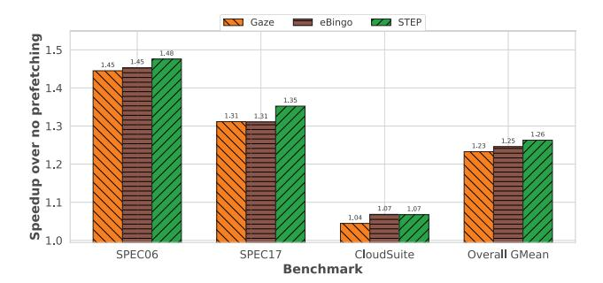

# *I. Storage Sensitivity Experiment*

In this subsection, we extend the main baselines to a broader storage sweep, allowing us to compare STEP against them across a wider range of metadata budgets. For STEP, Gaze, and the Bingo-based designs, we primarily scale storage by increasing the capacity of their pattern-history structures; for IPCP, we scale the number of entries in the IP table; and for vBerti, we scale the sizes of its history and delta tables. Figure 19 shows that STEP achieves strong performance already at low-to-moderate storage budgets and continues to improve as capacity increases, with diminishing returns beyond roughly 32 KB where the curve begins to flatten.

In contrast, the Bingo-based designs are more capacityhungry, indicating that their performance is more strongly limited by insufficient state at small budgets. At the same time, the added streaming support in eBingo improves its performance in the small-storage regime relative to plain Bingo.

Gaze, IPCP, and vBerti are comparatively storageinsensitive, suggesting that the patterns they capture are already largely covered by relatively small tables.

Overall, these results show that STEP is strongest among all storage regimes, whereas enhanced Bingo requires well over 100 KB of metadata to approach STEP's 10 KB operating point.

Fig. 20: Geometric-mean speedup over no prefetching under limited-way L2 prefetching. Prefetched lines are restricted to one L2 way.

#### *J. Limited-Way Prefetching Experiment*

To test whether STEP becomes redundant when cachelevel pollution is mitigated by prior techniques, we evaluate a limited-way prefetching configuration in which prefetched lines are restricted to only one cache way in the L2. This mechanism reduces the pollution caused by inaccurate or untimely prefetches and therefore provides a strong stress test for whether STEP's benefit is merely due to lower pollution.

Figure 20 shows that all three designs remain effective under limited-way prefetching, but STEP still achieves the highest overall performance. Specifically, STEP reaches an overall geometric mean of 1.263×. eBingo is the next strongest design at 1.245× overall.

These results show that suppressing the cache pollution does not eliminate the value of STEP. STEP continues to benefit from staged trigger-time decisions that improve not only pollution behavior but also the balance between early opportunity and later disambiguation.

