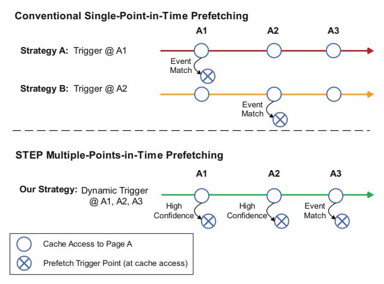

# STEP: Spatial Footprint Prefetcher with Multi-Point Temporal Triggers

Yuanji Ye, Oliver Lenke, Thomas Wild, and Andreas Herkersdorf Technical University of Munich, Germany Email: {yuanji.ye, o.lenke, thomas.wild, herkersdorf}@tum.de

*Abstract*—Modern processors continue to face the memory wall, which heavily impacts computer performance. Besides sophisticated cache hierarchies, prefetching is a proven technique to hide latency and mitigate the problem. Spatial footprint prefetchers have attracted research interest due to their ability to cover diverse memory access patterns with relatively low hardware cost. However, current implementations trigger on a single-point-in-time event, forcing a trade-off between issuing prefetches early, which increases noise, and issuing them later, which reduces opportunities.

We propose STEP, a spatial footprint prefetcher that introduces multiple sequential temporal decision points within a page's cache lifetime and selectively issues prefetches when confidence is high. STEP coordinates these decisions through a lightweight prefetch-confidence evaluator, enabling early opportunities while retaining high accuracy with later prefetching triggers. Moreover, STEP consolidates metadata into a single Pattern History Table (PHT), reducing storage overhead.

Experimental results on SPEC CPU2006, SPEC CPU2017, and CloudSuite show that STEP improves performance across a broad range of workloads. In the L2 single-core evaluation, STEP remains ahead of the strengthened ISO-storage baseline eBingo, while in the L1 single-core evaluation, STEP further outperforms Gaze, the strongest baseline at that level. STEP also delivers a stronger performance–storage trade-off, as eBingo requires substantially larger metadata capacity to approach STEP's lowstorage operating point.

#### I. INTRODUCTION

Over the last decade, DRAM capacity and bandwidth have improved significantly, but latency has advanced far more slowly [17]. As a result, processors frequently stall on memory accesses—the well-known memory wall [36]. With memoryintensive workloads in big data, deep learning, and media processing becoming pervasive, reducing effective memory access latency is increasingly critical [24], [25]. Modern cache hierarchies can effectively hide memory access latency in many cases. Nevertheless, cache-unfriendly data structures limit their effectiveness due to poor locality, higher eviction rates, and compulsory cache misses [23]. Combining caches with efficient prefetching strategies further helps bridge the processor–memory performance gap, with data prefetching being one of the most well-known and extensively studied techniques.

A prefetcher predicts future memory access behavior and fetches data into caches or buffers closer to the processor core, thereby hiding the latency of a full memory access. Commercial CPUs from Intel, IBM, and AMD predominantly employ low-complexity prefetchers—such as next-line, streaming, and stride-based designs—that are efficient to implement in hardware [5], [6], [19]. However, these simple prediction mechanisms can only capture a small fraction of the complex memory access behaviors exhibited by diverse programs.

To handle diverse access patterns while maintaining hardware simplicity, architects have proposed numerous prefetcher designs that leverage spatial and temporal locality.

Temporal prefetchers can effectively address irregular memory access patterns but typically require large storage to record the temporal correlation between memory addresses [7], [8], [35]. Consequently, most research in this area focuses on metadata management to balance performance gains and storage overhead. Machine-learning-based prefetchers can achieve high prefetching accuracy, but the models are often difficult to implement efficiently in hardware and may not meet strict prediction latency requirements [15], [37]. Furthermore, generalization beyond training programs is another concern [33].

Compared to these two approaches, spatial footprint-based prefetchers can achieve competitive performance across a wide range of programs with modest hardware cost and complexity [9], [12], [14], [20], [27], [34]. They are highly effective at learning and utilizing diverse spatial memory access patterns. The access pattern of a memory region (e.g., a 4 KB page) is recorded as a bit-vector footprint (e.g., one bit per cache line). The core idea is straightforward: if a program exhibits a particular footprint in region A, it will likely follow a similar footprint when re-accessing A or other regions sharing a similar event key (e.g., Program Counter (PC), offset, or richer combinations). Thus, these designs record historical footprints alongside an event key and predict future accesses by matching that event key.

Previous spatial footprint prefetchers almost universally select a single, fixed time point to trigger the prefetch event. For instance, many prefetchers trigger prefetching on the first access to a memory region, using the PC, offset (i.e., the distance of a block address from the beginning of a page), etc., of the first access as the event key [9], [12], [20], [27], [34]. Other spatial footprint prefetchers adopt a later trigger (e.g., Gaze presented by Z. Chen et al. [14]) in order to exploit temporal correlation between accesses.

This single-point-in-time design still exposes a fundamental trade-off among opportunity, accuracy, and storage, although modern designs can mitigate it. Earlier triggers see more potential opportunities, but with limited context, they must either prefetch aggressively and risk pollution, or rely on richer keys, fallback behavior, and larger metadata structures to maintain prediction quality. Later triggers, by contrast, benefit from additional evidence and can often make more accurate decisions with simpler states, but they inevitably miss some early opportunities. Recent single-point designs push this trade-off frontier significantly through stronger matching and candidate aggregation at a fixed trigger point. However, they still operate within the same formulation: they decide what to issue from candidates matched at the current trigger, rather than whether the current trigger itself already provides sufficient evidence for issuing prefetches.

In this paper, we revisit this design choice for the broader family of spatial footprint prefetchers and propose STEP, a prefetcher that treats prefetching as a sequence of temporal decisions rather than a one-shot trigger. Instead of committing to a single trigger point, STEP evaluates multiple trigger stages and adapts prefetch issuance according to the available evidence. This yields two benefits: (1) it can exploit early opportunities when the signal is already strong, and (2) as later points accumulate additional evidence, it can avoid issuing prefetches when the current trigger remains ambiguous. In this sense, STEP is not merely a different event-key design, but a different organizing principle for spatial footprint prefetching: it turns prefetching from a single-point candidate-selection problem into a staged trigger-decision problem.

Our goal in STEP is not to exhaustively optimize the event-key design, but to expose and validate this trigger-time decision dimension in a practical, low-cost implementation.1 The current design instantiates this idea using lightweight offset-based temporal events and a similarity-based confidence evaluator. Even this lightweight instantiation already outperforms strengthened single-point baselines in several key settings, while exposing staged trigger-time decision as a broader design direction beyond this specific implementation.

To summarize, we make the following contributions in this paper:

- We identify a limitation of conventional spatial footprint prefetchers: they make prefetching decisions at a single point in time, entangling trigger timing, accuracy, and storage cost in a fixed trade-off.
- We introduce multi-point temporal triggering as an orthogonal design dimension for spatial footprint prefetching, and propose STEP as a practical instantiation that performs staged trigger decisions using lightweight evidence accumulation and confidence evaluation.
- We design and implement a low-overhead hardware realization of STEP based on a unified Pattern History Table and lightweight trigger-time confidence logic, keeping the total storage overhead around 10 KB.
- We evaluate STEP across SPEC CPU2006, SPEC CPU2017, and CloudSuite in diverse settings, show-

1We instantiate STEP in a Gaze-like low-storage setting because Gaze was one of the most recent published low-storage spatial prefetchers at the time of submission. In principle, similar trigger-time decision mechanisms could also be explored on top of other spatial prefetchers.

Fig. 1: Performance–storage positioning of STEP and representative footprint spatial prefetchers. The strengthened fixedtrigger baseline eBingo improves with additional metadata, but STEP remains competitive near the low-storage regime around 10 KB.

ing that this lightweight instantiation outperforms strong single-point spatial prefetchers in most key settings while providing a favorable performance-storage trade-off.

#### II. RELATED WORK AND MOTIVATION

#### *A. Spatial Footprint Prefetching*

Spatial footprint prefetching is a widely studied and effective family of prefetching techniques. The core idea is to record the footprint—a bit-vector indicating which cache lines within a memory region (e.g., a 4 KB page) were touched—and to use historical footprints to predict the footprint of the same region on future accesses or of other regions that share similar characteristics.

A general framework for spatial footprint prefetching was introduced by SMS prefetcher [34]. It typically includes a Filter Table (FT), an Accumulation Table (AT), and a Pattern History Table (PHT). The FT filters out 4KB pages with negligible activity; remaining pages are tracked in the AT as bit vectors, with one bit per cache block. As new blocks are accessed, the AT updates the page's footprint. When the page becomes inactive (e.g., evicted from the AT), the AT commits the completed footprint to the PHT, along with its event key (the identifier used later to look it up). The PHT is commonly set-associative; upon a key match, it supplies the matched historical footprints to guide prefetching for the newly accessed page. Subsequent work—including PMP, DSPatch, Bingo, and Gaze [9], [12], [14], [20]—adopts similar structures while changing how entries are matched, selected, and consumed.

Among these design choices, the event key is particularly important because a recorded footprint is reusable only if the same key reappears. Event keys lie along a spectrum:

• High-frequency, simple keys (e.g., page offset). The key space is small (e.g., 64 offsets per 4 KB page), reducing

- storage and increasing match frequency, but each match carries limited information, lowering accuracy.
- Low-frequency, specific keys (e.g., full address or page number). The key space is large, demanding more storage and yielding fewer matches, but each match is more specific and therefore typically more accurate.

Thus, from an accuracy-coverage-storage standpoint, more specific keys tend to improve prediction precision but yield fewer opportunities, whereas simpler keys improve match frequency at the price of greater ambiguity. Prior designs, therefore, combine different event keys with different auxiliary mechanisms to mitigate these trade-offs, resulting in different performance-storage operating points, as shown in Fig. 1.

Among these designs, Bingo [9] is one of the strongest prior spatial footprint prefetchers in our evaluation. Rather than relying on only one event key, Bingo strengthens single-trigger prefetching through richer matching and candidate handling: it can exploit more specific history when available, fall back to coarser history when needed, and aggregate information from multiple matched candidates at the trigger point. In our evaluation, we further strengthen this baseline with the same streaming-pattern detection used in Gaze, and refer to the resulting design as eBingo. Planaria [27] leverages page proximity to transfer footprints across co-located pages and thereby improve coverage. Gaze [14], as another strong lowstorage baseline in our evaluation, improves prediction quality from a different direction. Instead of making the first access trigger more expressive, it delays issuance to a later trigger point so that the prefetcher can exploit short-range temporal correlation between offsets within the same region.

#### B. Motivation

Section II-A shows that prior work already contains several effective mechanisms to mitigate the trade-offs among accuracy, coverage, and storage, including richer matching, pattern merging, fallback behavior, candidate aggregation, delayed triggering, and auxiliary stream handling. However, as shown in Fig. 2, conventional spatial–footprint prefetchers almost always commit to a *single-point-in-time* trigger per region, whether it is the first point or the second point. Thus, prior work pushes the same frontier from different directions, but remains within the same formulation: the design is fixed to a single trigger time and only improves what happens at that time

STEP revisits this formulation. As shown in Fig. 2, instead of assuming that prefetching must be tied to one fixed event, STEP treats footprint prefetching as a sequence of temporal decision points. At each point, it asks whether the currently matched histories are already consistent enough to justify issuing prefetches; if not, it waits for additional evidence. This makes trigger timing itself a runtime decision variable. Importantly, this is orthogonal to other mechanisms: a design could still use stronger event representations or candidate aggregation, but STEP adds the ability to decide when the current evidence is sufficient, rather than forcing all decisions to occur at a single temporal point.

Fig. 2: Single-point vs. sequential multi-point prefetching. Conventional designs fix one temporal trigger (A1 or A2), trading early opportunity for later accuracy or vice versa. STEP evaluates a sequence of triggers (A1, A2, A3) and applies a confidence evaluator at each point, issuing early prefetches only when confidence is high and refining decisions as evidence accrues.

This idea is also related in spirit to confidence mechanisms used in classical stream and stride prefetchers, where aggressiveness is often gated by repeated observations of stable patterns. However, extending such confidence-driven decisions to connect multiple trigger points in spatial footprint prefetching is less straightforward. A spatial footprint match is not a single confidence state; instead, confidence depends on multiple candidate footprints across different observation points.

Realizing such sequential decisions raises two main challenges: (1) *Policy*—how to quantify per-point prefetch confidence and act on it with a lightweight decision rule; and (2) *State and timing*—how to retain and reuse keys and footprints across points without inflating storage or extending lookup critical paths. These challenges motivate our prefetch-confidence evaluator (for per-point decisions) and a consolidated, low-overhead state design (for storage and timing), detailed in Section III.

