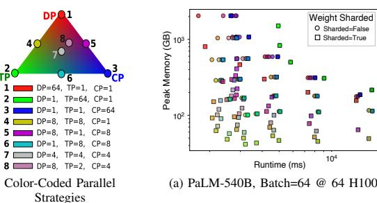
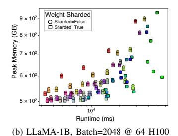
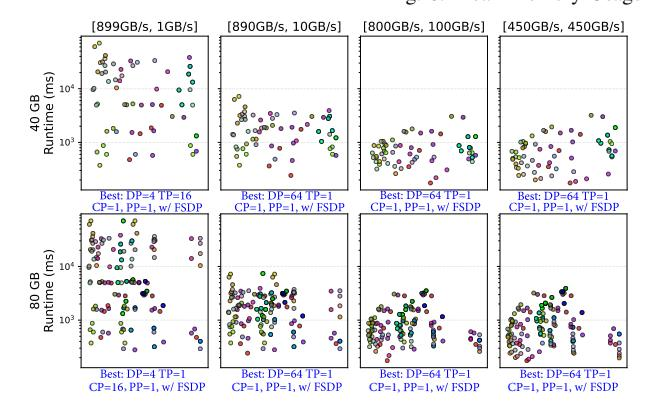
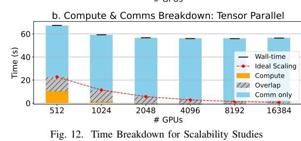

# *A. Impact of Parallelism Strategies*

We demonstrate how STAGE can be utilized to explore the complex design space of various parallelization strategies and model optimization techniques and highlight some observations. These case studies are not intended to be comprehensive - and can be extended for deeper research enabled by STAGE.

*Observation 1. No single parallelism strategy fits all models; each model and system may prefer different strategies.*

This observation highlights the need for STAGE to generate and evaluate a wide range of parallel strategies. We simulate a system with 64 H100 GPUs connected in an 8×8 NVLink+IB topology and run DSE on two setups: (1) a large model with small batch size (PaLM-540B [\[11\]](#page-13-13), batch = 64), and (2) a small model with large batch size (LLaMA3.2-1B [\[20\]](#page-13-14), batch = 2048). [Fig. 8a](#page-9-0) and [Fig. 8b](#page-9-0) show peak memory usage versus runtime for both settings.

Data-point shapes indicate whether weight sharding is applied; colors denote DP/TP/CP configurations; and pipeline parallelism (PP) is computed as pp = GPUs/(dp · tp · cp), where larger PP values appear as darker points.

For the small-batch, large-model case, two patterns emerge: (i) higher data parallelism reduces runtime but increases memory usage, while higher tensor parallelism lowers memory but slows execution, reflecting a runtime-memory trade-off; (ii) weight sharding significantly reduces memory footprint at the cost of a small runtime overhead.

For the large-batch, small-model case, the behavior differs: (i) memory and runtime no longer form a clear trade-off, as data-parallelism can achieve both low runtime and low memory usage; (ii) weight sharding has smaller impact because the model contains fewer large parameters worth sharding.

These results show that different models and training regimes favor different parallel strategies. Real-world scenarios can be even more nuanced: [Fig. 8c](#page-9-0) shows results for LLaMA-70B (batch = 1024) on a 1024-GPU H100 system, combining characteristics of both earlier cases. Weight sharding again lowers memory footprint. The most memory-efficient configurations are mixed parallel strategies-visible as blendedcolor points near the bottom. Data parallelism still yields the fastest runtime, but only when memory capacity is sufficient: high-DP configurations are feasible on both 80 GB and 40 GB H100s. Under a tighter 24 GB constraint, however, the optimal configuration becomes a composite strategy such as *(dp = 64, tp = 4, cp = 4, with FSDP)*.

*Observation 2. Optimal parallelization strategies vary with hardware constraints, not just model architecture.*

[Fig. 9](#page-9-1)[6](#page-8-1) presents DSE results for various parallel strategies under different hardware configurations. We fix the network topology to an 8×8 2D torus and vary both the per-dimension bandwidth distribution and the available HBM capacity, while keeping the total bandwidth per GPU constant across all setups. The figure shows that, under certain hardware constraints, the optimal parallel strategy shifts from pure data parallelism to hybrid configurations. This underscores the importance of DSE, enabled by STAGE, for selecting strategies that best match a given system's hardware characteristics.

*Observation 3. More communication might not mean more runtime. Communication and compute overlap also matters.*

From the previous DSE experiments, we observe that FSDP can substantially reduce memory footprint in many cases while having minimal impact on runtime. At first glance, this is counterintuitive: FSDP reconstructs weights every time they are used, which should introduce additional communication and increase runtime.

To understand this behavior, [Fig. 10](#page-9-2) visualizes the ratio of compute overlapping with communication versus the overall runtime. Dashed lines pair configurations with the same parallel degree, comparing setups with and without weight sharding. The figure shows that, in most situations where FSDP has an effect, the amount of overlap increases. This suggests that the additional communication introduced by FSDP is largely hidden behind ongoing computation. Furthermore, runtime often improves slightly, likely because optimizer states are sharded across nodes, reducing per-node computation.

*Observation 4. Activation Recompute is a promising trade-off.* For a given model and parallel strategy, STAGE can generate workloads both with and without activation recomputation [\[20\]](#page-13-14), [\[30\]](#page-14-13). For LLaMA-7B with batch = 1, TP = 8, and SP, [Fig. 11](#page-9-3) shows that activation recomputation lowers peak memory usage while increasing runtime. This reduction in memory footprint can enable larger data-parallel degrees, which may be beneficial based on the earlier analysis.

*Guideline. Choosing parallelism strategies in practice.* In the workloads and system settings studied in [Fig. 8,](#page-9-0) higher DP often delivers the lowest runtime among feasible configurations. However, different models might lead to different behavior in memory usage. For large models, this exposes a clear runtime-memory trade-off, where higher DP

6The x-axis represents peak memory usage; however, we omit the specific labels for simplification to focus on demonstrating the runtime.

5ASTRA-Sim natively supports the Chakra format enabling a proof-ofconcept to run STAGE-generated workloads. In addition, STAGE is also being used by proprietary simulators.

(b) EEGIMIT 1B, Butch=2010 @ 01 11100

Fig. 8. Peak Memory Usage vs Runtime across configurations.

Peak Memory reduction: 13.3% Execution time increase: 20.3% Peak Memory: 7042.5 MB Without Recomputation With Recomputation

Peak Memory: 7042.5 MB Peak Memory: 6107.0 MB

Time (µs)

Fig. 9. Runtime on different HBM capacity and Network Bandwidth. Llama70B @  $64 \times H100$ 

Fig. 11. Memory w/ and w/o Activation Recomputation

Fig. 10. Compute-Comms Overlap vs Runtime, PaLM-540B @ 64 H100

improves runtime but can exceed memory capacity, requiring hybrid DP/TP configurations. For small models, high DP often provides both low runtime and low memory usage, so there is little trade-off. Most real deployments lie between these extremes, where a practical default is therefore, starting from the largest memory-feasible DP, then increasing TP/CP only as needed to satisfy per-device memory limits and utilization constraints. Weight sharding and activation recomputation usually improve memory feasibility, possibly enabling faster configurations. However, their runtime impact depends on the available communication and compute resources of the target system. Therefore simulation-based exploration is still needed to choose the best parallel strategies.

B. Workload Scalability Studies with STAGE

via NVLink. Sixteen nodes form a pod connected by a local ring, and multiple pods are linked through a global ring. Our experiments cover system sizes from 512 to 16K GPUs.7 **Scaling Data Parallelism.** We analyze how data parallelism

In this section, we demonstrate how STAGE supports workload-level scalability analysis. We study how communication behavior changes as parallelization strategies vary under a fixed system configuration. This complements the next section, which examines *system-level scalability* by scaling the system configuration to support larger models.

Scaling Data Parallelism. We analyze how data parallelism impacts performance with a fixed microbatch size per GPU (i.e., weak scaling), simulating scenarios where batch size is scaled out for more stable convergence and improved training. Using LLaMA-70B with PP=4, we keep the per-GPU batch size at 8 and scale DP. Fig. 12a presents the breakdown of computation and communication times. As expected, compute time stays constant due to fixed per-device batch size and minor contribution to overall runtime. With scaling, communication overhead increases and finally converges, matching the behavior of data-parallel ring all-reduce.

**Target System Setup:** We simulate a large-scale system built from NVIDIA DGX nodes, each with 8 H100 GPUs connected

7To support these scales without running out of memory, we extended the ASTRA-sim workload feeder with disk-backed trace processing and caching.

Fig. 14. Normalized runtime vs. system bandwidth

**Fixed Model, Scaling Tensor Parallelism.** We evaluate tensor parallelism's impact on training on same PaLM-540B [11] (DP=4, CP=4, micro-batch=256), scaling TP w/ SP from 4 to 1024 GPUs to simulate faster training (i.e., *strong scaling*). As shown in Fig. 12b, compute time decreases with more GPUs, while communication time remains nearly constant. This is because tensor parallelism with sequence parallelism mainly uses ring reduce-scatter. As the TP degree grows, group size and communication steps increase, but per-device communication volume decreases, keeping total communication time stable. Furthermore, compute time reductions taper off at scale, causing scalability to plateau—especially beyond 2048 GPUs.

#### C. System Scalability Studies with STAGE

Similar to Sec. VI-B, we evaluate the effect of system properties on model scaling. We keep per-GPU compute and model size constant while scaling up the system. Starting from a LLaMA-8B model on 64 GPUs, we increase the model size by proportionally expanding TP. We then investigate how network bandwidth influences scaling, using the same H100-DGX nodes (8 H100 per node connected via NVLink) linked through Infiniband [45] switches with varying bandwidths.

Fig. 13 shows the normalized runtime on systems with high (3000 GB/s) and low (80 GB/s) Infiniband bandwidths. For the high-bandwidth system, runtime remains largely unaffected because scaling out mainly increases communication while compute and I/O per GPU stay constant, making it more suitable for very large-scale systems. In contrast, for the low-bandwidth system, communication overhead grows rapidly with scale, which limits the training of very large models.

Furthermore, Fig. 14 shows the impact of bandwidth on model performance under the same TP configuration. As bandwidth increases, runtime decreases, but the benefit tapers off once bandwidth becomes sufficiently large.

In conclusion, larger network bandwidth helps accelerate large-model training. However, when the model scale is limited, there exists a bandwidth sweet spot that offers near-optimal performance while maintaining a good cost–performance trade-off.

TABLE VIII
DECODE AND PREFILLING PERFORMANCE ACROSS DIFFERENT EP
CONFIGURATIONS FOR DEEPSEEK-R1.

| Phase          |         | Decode  |         |          | Prefilling |           |
|----------------|---------|---------|---------|----------|------------|-----------|
| Cluster Size   | 36      | 72      | 144     | 36       | 72         | 144       |
| Batch Size     | 512     | 1024    | 2048    | 512      | 1024       | 2048      |
| # Tokens       | 512     | 1024    | 2048    | 524,288  | 1,048,576  | 2,097,152 |
| Step Time (ms) | 227.483 | 187.483 | 163.681 | 2051.994 | 2866.145   | 3723.360  |
| Throughput*    | 62.520  | 75.859  | 86.890  | 7097.270 | 5081.235   | 3911.401  |

\*Throughput here is number of tokens processed per second, per GPU.

