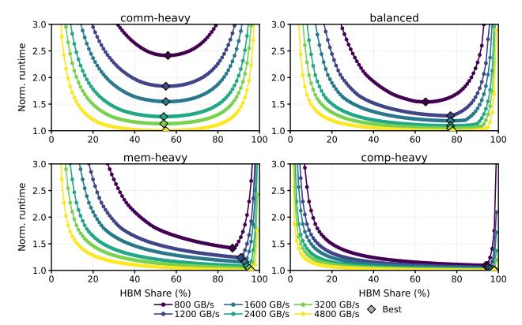

# F. STAGE for Different Simulators and Architectures

While our primary evaluation leverages AstraSim with the Chakra format, focusing primarily on H100/200 systems, STAGE is architecturally decoupled from any particular simulator or workload schema. The generated execution graphs

Fig. 15. Optimal HBM bandwidth share under different workloads and total bandwidth budget

serve as simulator-agnostic artifacts that can be consumed by diverse performance modeling frameworks.

To validate this portability, we integrate STAGE with multiple simulators, including SimAI [62] from Alibaba, ScaleSim [53] from Georgia Tech, and Genie [66] from HPE, using lightweight translation layers without modifying workload semantics. Each simulator models different aspects of AI systems at high fidelity: SimAI captures NVIDIA NCCL and NVLink semantics, ScaleSim models TPU-like compute arrays, and Genie emulates AI traffic over real physical network fabrics such as RDMA.

In Table IX, we present the results obtained across the three different simulators and setups8. For SimAI, we compare 8×H100 and 8×H200 systems with NVLink interconnects; for ScaleSim, we contrast compute times across TPUv5e and TPUv4 configurations; for Genie, an RDMA traffic emulator we study the runtime for a 100Gbps versus 400Gbps Infini-Band network with a single-layer switch.

These experiments highlight that STAGE-generated work-loads can be instantiated and executed across heterogeneous simulation environments without redesigning workload logic, underscoring the value of decoupling workload generation from simulation (Sec. III-B. Furthermore, we report the Lines-of-Code (LoC) required to adapt STAGE to each simulator backend. For most simulators, fewer than one hundred lines of translation code are required, demonstrating that STAGE maintains a shared workload generation pipeline while isolating simulator-specific graph instantiation logic.

