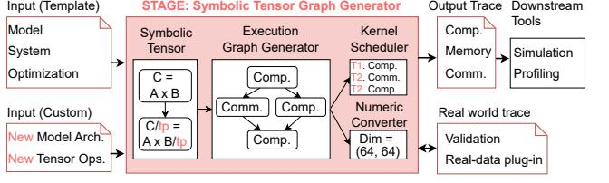

# I. INTRODUCTION

The rapid growth of machine learning models, especially Large Language Models (LLMs), including GPT [\[6\]](#page-13-0), Llama [\[57\]](#page-15-0), DeepSeek [\[12\]](#page-13-1), and Mistral [\[27\]](#page-14-0), has revolutionized the field of machine learning, driving massive advancements in natural language processing and generative AI. However, the scale and complexity of LLMs have introduced unprecedented computational challenges. These models often require massive amounts of computation and memory [\[39\]](#page-15-1), [\[61\]](#page-15-2), not only during training but also for inference, necessitating distributed AI systems. Several such systems exist in practice today, including NVIDIA HGX [\[43\]](#page-15-3), Google TPU [\[70\]](#page-16-0), Amazon Trainium [\[7\]](#page-13-2), Cerebras CS-3 [\[8\]](#page-13-3), and others. Optimizing compute, memory and communication resources optimally in these systems is crucial for performance [\[49\]](#page-15-4), [\[64\]](#page-15-5). The need for scalable and efficient distributed training is only growing, as evidenced by the recently released Llama 4 model that leverages a Mixture-of-Experts (MoE) architecture with up to 2 trillion parameters [\[36\]](#page-15-6), pushing the limits of current AI system infrastructure.

Standardized benchmarks play a crucial role in our community, serving two key purposes: optimizing the performance of current AI systems and guiding the design choices for nextgeneration systems. Efforts like MLPerf [\[50\]](#page-15-7) have been leading the way in identifying representative benchmarks in the domain of AI. Unfortunately, deploying the full software stack

TABLE I NUMBER OF OPERATIONS WITHIN SINGLE EPOCH PER GPU. (BATCH SIZE: 128 FOR DEEPSEEK, 32 FOR OTHERS)

| Model        | # of Param. | # of GPU | # of Comp. | # of Comm. |
|--------------|-------------|----------|------------|------------|
| GPT-3        | 175B        | 32       | 156,317    | 30,978     |
| LLaMA-3      | 70B         | 16       | 164,099    | 38,434     |
| Mixtral      | 8x22B       | 32       | 24,102     | 3,180      |
| DeepSeek-MoE | 16B         | 8        | 76,111     | 1,867      |

of distributed AI benchmarks for the sole purpose of running optimization and design-space exploration (DSE) studies is prohibitive in practice, as they require extensive framework (PyTorch/JAX/TensorFlow) expertise and continued access to large-scale systems. Furthermore, it is extremely difficult to isolate hardware versus software bottlenecks, and compute versus memory versus network behaviors.

Acknowledging the aforementioned challenges, recent efforts [\[23\]](#page-14-1), [\[55\]](#page-15-8) have proposed the idea of execution traces (ET) as a mechanism to capture the *coarse-grain (i.e., operatorlevel) compute and communication dependence behavior* during AI training. In particular, MLCommons Chakra [\[55\]](#page-15-8) has introduced specific support within PyTorch to trace the dependence graph (with timing) of distributed AI workloads *post-execution* from real systems. Selective replay of the ETs [\[33\]](#page-14-2), and analysis of the captured metadata (type, size and data volume) can help expose computation, memory, and communication bottlenecks, in turn guiding optimization tools.

While ETs are expected to play a crucial role in AI system design, we believe that ETs alone are insufficient for guiding optimization and DSE for the following reasons:

- High cost and limited accessibility: Generating ETs requires large-scale infrastructure—often hundreds or thousands of GPUs—accessible only to a few hyperscalers. Further, even when ETs are collected, privacy and proprietary constraints may prevent them from being shared broadly with the research community.
- Tied to AI platform: ETs from real-systems are inherently tied to the system they were collected on, with platformspecific software optimizations and hardware bindings baked in. This limits scalability and generality to study larger and diverse systems. As [Table I](#page-0-1) shows, even a single training epoch of a mid-sized LLM involves tens of thousands of operations per GPU, making trace analysis and scaling a nontrivial task. Efforts to scale ETs [\[10\]](#page-13-4), [\[23\]](#page-14-1) have focused on mimicking pre-existing system and model behaviors rather than enabling exploration of diverse configurations or novel parallelization strategies.
- Tied to AI Model. In the arms race of AI models,

1Symbolic Tensor grAph GEnerator

Fig. 1. Overview of STAGE

there continues to be rapid evolution of LLM architectures—driven by innovations such as MoEs [\[12\]](#page-13-1), [\[28\]](#page-14-3), attention mechanism variants [\[3\]](#page-13-5), [\[15\]](#page-13-6), [\[60\]](#page-15-9), and state space models [\[21\]](#page-14-4), aimed at improving model accuracy and training efficiency. This can render ETs from real-systems obsolete in a matter of months.

These challenges point to a growing need for a more agile framework for distributed AI workload generation that can flexibly adapt to emerging AI model structures and support fast iteration across diverse hardware platform architectures. To this end, we present STAGE, a novel framework for generating high-fidelity, scalable, and configurable execution graphs (EG) for distributed LLM workloads[2](#page-1-0) . [Fig. 1](#page-1-1) shows the overall flow of STAGE. At the front-end, STAGE accepts user-defined input workloads in tensor format and supports both predefined model templates and customized inputs for future extensibility. A key innovation in STAGE is the use of a symbolic tensor representation to generate a graph representation that compactly captures distributed ML workloads, enabling scalability by describing their shared computational structure while flexibly incorporating variations in tensor dimensions. Our abstraction enables flexible tensor partitioning and systematic support for all major parallelization strategies, as well as their arbitrary combinations—including hypothetical configurations beyond those seen in existing systems. Once the distributed execution graph is constructed, STAGE converts it into a schema that can be integrated with either a downstream simulator or augment a collection of real-system ETs for system optimization/analysis.

The key contributions of this paper are as follows:

- Symbolic Representation for Diverse AI Model Architectures: STAGE uses symbolic operations to abstract and generalize LLMs, enabling graph-based workload generation across a wide range of model architectures including dense (e.g., LLaMA, GPT), MoE (e.g., DeepSeek, Mixtral), and state-space-style (e.g., Mamba).
- Comprehensive Parallelism Modeling: STAGE systematically supports all viable combinations of parallelism with a novel producer-consumer-based communication matcher. It enables exhaustive exploration of parallelization configurations for diverse systems.
- Compute, Memory, and Network Modeling: STAGE accurately models computation, memory, and communication at tensor granularity by analyzing tensor dimensions, lifetimes, and synchronization behavior. This fine-

- grained modeling enables deeper insights into bottlenecks and resource utilization.
- Validation with Real-World Traces: STAGE generates execution graphs that model computation, communication, and memory behavior, and we validate their fidelity using real ETs collected from a single GPU to production-scale 128-GPU H100/H200 HGX clusters executing large-scale LLM training workloads.
- Scalable and Open Framework: STAGE can synthesize training traces for models on 32K GPUs in less than 30 minutes without compromising accuracy. This enables fast and scalable system analysis. The framework is publicly released to support the research community.

