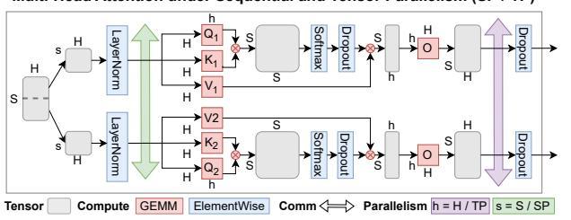
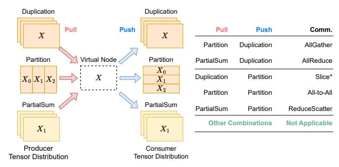

# IV. STAGE: SYMBOLIC TENSOR GRAPH GENERATOR

STAGE addresses the challenges discussed in [Sec. III](#page-2-0) by representing LLM workloads based on symbolic abstractions. Users simply specify high-level parameters such as model size and parallelism degrees, and STAGE automatically generates execution graphs capturing computation, communication, and memory behavior. By simplifying workload modeling while preserving key execution characteristics, STAGE bridges the gap between synthetic and real-world traces, supporting scalable and systematic design exploration.

### *A.* STAGE *Overview*

[Fig. 3](#page-3-0) provides a high-level overview of STAGE, illustrating its workflow from model specification to workload simulation. ⃝1 Symbolic Tensor Graphs (STG): The flow starts from a set of templates of commonly used modules in LLMs. These modules are integrated in the STAGE framework in the format of Symbolic Tensor Graph Intermediate Representation (STG IR). ⃝2 STAGE then assembles these modules into the whole model by repeating and connecting each module into a large STG for the whole model. ⃝3 With the assembled model, STAGE distributes the workload from a single piece to multiple accelerators by doing tensor-level distribution and graph-level distribution. STAGE analyzes the communication required by each parallelization strategy based on the tensor/graph shardings. ⃝4 Finally, STAGE interprets the STG IR and generates a directed acyclic graph (DAG) with explicit operation dependencies for downstream tasks.

#### Multi-Head Attention under Sequential and Tensor Parallelism (SP / TP)

Fig. 4. Using Symbolic Tensor Representation to Annotate MultiHead Attention with Sequence and Tensor Parallelism

#### B. Workload definition

STAGE is designed to be both simple to use and highly flexible, providing a systematic pipeline from model specification to workload generation.

- 1) Input Model and Module Templates: To ensure ease of use, STAGE requires only two user inputs: the target model (e.g., GPT, LLaMA) and a selection of module templates (e.g., MHA, FFN, MoE) in STG IR format. This design allows users to generate symbolic tensor graphs without manually specifying the entire model structure. In addition, STAGE supports user-defined operations beyond the built-in templates and models, enabling researchers to extend the framework with custom computations. This flexibility is essential for supporting future system-level optimizations and accommodating emerging model architectures.
- 2) Output Execution Graph: By default, STAGE leverages the Chakra schema since it is being standardized by MLCommons [37]. This schema captures the dependencies between compute and communication tasks, essential for identifying bottlenecks, critical paths, and opportunities for computation-communication overlap during distributed training. Using execution graphs to explicitly model task dependencies is widely adopted in both workload benchmarking [32], [55] and workload modeling [17], [34]. While Chakra is the default, STAGE can be flexibly adapted to other output formats, by introducing suitable translation modules.

#### C. Symbolic Tensor Representation

STAGE introduces the *Symbolic Tensor Graph (STG)* as an intermediate representation (IR) to model ML workloads. STG abstracts tensor shapes, operations, and distribution strategies symbolically, enabling efficient reuse across workloads that share the same graph structure but differ in dimensions.

Symbolic Tensor Format: Tensors are represented as:

Here, Shape includes symbolic dimensions such as Batch (B) and Sequence (S) and may also contain partition symbols, such as data parallelism (dp), tensor parallelism (tp) or sequence parallelism (sp). The optional Hidden (H) field denotes partial sums across devices. In the ML context, the hidden dimension typically corresponds to the model's embedding size or other feature dimensions. For instance, a tensor x with dp is represented as x[B/dp, H] with the batch dimension sharded across devices.

TABLE III

TENSOR-LEVEL DISTRIBUTION IN A LINEAR LAYER. WE USE [H, 4H] TO DENOTE THE WEIGHT MATRIX FOR THE UP-PROJECTION.

| Parallel Strategy                  | Symbolic Tensor Representation |
|------------------------------------|--------------------------------|
|                                    | x[B, H]                        |
| No Parallel                        | w[H, 4H]                       |
|                                    | у[В, 4Н]                       |
|                                    | x[B/dp, H]                     |
| Data-Parallel (dp)                 | w[H, 4H]                       |
|                                    | y[B/dp, 4H]                    |
|                                    | x[B, H/tp @ 1]                 |
| Tensor-Parallel (Row) (tp)         | w[H/tp, 4H @ 1]                |
|                                    | y[B, 4H @ 1/tp]                |
|                                    | x[B, H]                        |
| Tensor-Parallel (Column) (tp)      | w[H, 4H/tp]                    |
|                                    | y[B, 4H/tp]                    |
|                                    | x[B/fsdp, H]                   |
| Fully Sharded Data Parallel (fsdp) | w[H/fsdp, 4H]                  |
|                                    | y[B/fsdp, 4H]                  |
| Hybrid-Parallel (hp)               | x[B/hp, H]                     |
| (Column Tensor Parallel            | w[H, 4H/hp]                    |
| w/ Activation Sharded)             | y[B, 4H/hp]                    |

Fig. 4 illustrates how tensor representations are used to model multihead attention sp and tp. For clarity, the input tensor assumes a batch size of 1, and key intermediate tensors undergoing shape transformations are highlighted in grey.

**Tensor-Level Distribution Types:** STAGE defines three symbolic distribution semantics:

- Duplicated: Full copy on all devices.
- Partition: Tensor is disjointly sharded across devices along a specific dimension.
- PartialSum: Each device holds a partial result; reduction is required.

These distribution types can be composed to represent complex parallelization strategies. For example, the following notation combines dp, sp, and tp:

Here, dp applies to the batch dimension, sp to the sequence dimension, and tp at the end indicates that the tensor is in *PartialSum* form across the hidden dimension.

**Symbolic Operations:** Operators are expressed using a concise format:

output = op[op\_attr](input1, input2, ...)

For example, matrix multiplication is written symbolically as:

$$y = einsum[bm, mn \rightarrow bn](x, w)$$

Here,  $\times$  has shape [b,m], w has shape [m,n], and the output y has shape [b,n]. STAGE adopts einsum to express all tensor multiplications, allowing representation of preserved, reduced, and shared dimensions. By encoding partitioning strategies directly into symbolic tensor shapes, STAGE offers a unified abstraction that captures both computation and parallel execution, serving as the foundation for STG construction and downstream simulation.

Table III enumerates some of the common distributing techniques used for a linear layer, and also a hybrid one to show the flexibility. With this systematic design, STAGE reduces the need for user intervention while retaining flexibility for defining custom distribution strategies. Sec. VI-H discusses how conventional parallel strategies can be defined

Fig. 5. Tensor Distribution Mismatch: After applying tensor-level distribution

#### D. Workload Distributor

In STAGE, distributed workloads are handled using two approaches: (1) *Tensor-level distribution* where each machine holds shards of a tensor and collaborates to execute a single operator and (2) *Graph-level distribution* where each machine is responsible for a portion of the computation graph and exchanges data via send–receive pairs when information flows across graph partitions. Depending on the deployed parallelization strategy, STAGE employs components to implement either the tensor-level or graph-level distribution approach.

1) Tensor-level distributor: Tensor-level distribution transforms the initial tensor representations with corresponding parallel dimensions, enabling efficient workload distribution across multiple devices. However, these strategies inherently introduce the need for collective communication, which is essential for maintaining consistency and data alignment between devices during computation. Accurately modeling these communications is crucial to reflect the real-world behavior of parallel workloads. STAGE encodes tensor shardings in the assembled models. Then the tensor-level distributor will apply the corresponding parallel strategies, analyze and generate the collective communications required by the parallel strategies using Collective Communication Matcher.

In Fig. 5, we illustrate how propagating the initial parallelization across an undistributed compute graph—to avoid manually defining every sharded tensor—can create tensor distribution mismatches, where the producer and consumer of a tensor expect different sharding layouts. In STAGE, before applying tensor-level distribution, we first propagate the compute graph to infer each tensor's shape. Then we apply the tensor distribution separately for each operator, and repropagate the shape. This reveals a distribution mismatch for tensor x1 when viewed from the producer and consumer side. From the producer side, x1=einsum(x0,w0) produces an output with layout [a, c@ 1/tp]. From the consumer side, x2=einsum(x1,w1) expects x1 to have layout [a, c]. This mismatch necessitates an AllReduce operation to aggregate the partial sums across distributed tensors.

2) Collective Communication Matcher: To handle the diverse communication requirements arising from various parallelization strategies, STAGE uses a communication matcher

Fig. 6. Collective Communication can be divided into two steps: Pull + Push. Note that Slice\* is a special case on a single machine.

to systematically identify and encode the required communications. The matcher operates by analyzing the distribution patterns of tensors across devices and matches the appropriate collective communication operations based on the relationship between the distribution from the *producer* that produces the tensor, and the distribution from the *consumer* that consumes this tensor. This producer-consumer model is divided into two conceptual steps *Pull* and *Push* as Fig. 6 shows.

During *Pull*, data is gathered from all devices in the producer distribution to assemble a complete tensor. During *Push*, this tensor is distributed to devices according to the consumer distribution. To bridge these two steps, we introduce a virtual node that serves as an intermediate conceptual connector, enabling a flexible mix-and-match between *Pull* and *Push*.

For *Pull*, the process of reconstructing the complete tensor from different distributions is defined as follows:

- *Duplicated*: each device already holds a complete copy of the tensor. As a result, the head node does not require communication with other devices, making *No Communication* necessary.
- Partition: the tensor is divided into shards across devices.
   The head node gathers all shards from the devices and assembles the complete tensor through a process referred to as Gather.
- *PartialSum*: while similar to Partition, the aggregation sums the values across devices instead of concatenation. This operation is commonly known as *Reduce*.

On the other hand, for *Push*, the process of distributing the tensor to devices is described as follows:

- *Duplicated*: the tensor is replicated from the virtual head node to all devices using a *Broadcast* operation.
- *Partition*: each device receives its corresponding shard of the tensor through an operation called *Scatter*.
- *PartialSum*: Generally not used, as distributing a full tensor as partial sums is uncommon in practice.

To summarize the required communication patterns for tensor transformation, we share examples how the collective communication matcher can be used as shown in Table IV. By integrating a matching algorithm based on push-pull communication principles, STAGE identifies additional patterns that were previously overlooked but can arise from arbitrary tensor distribution schemes.

TABLE IV

EXAMPLES OF MATCHED COLLECTIVE COMMUNICATIONS. THE SYMBOLIC TENSOR NOTATIONS ARE DEFINED IN SEC. IV-D.

| Producer Tensor Distribution | Matched Coll-Comm        | Consumer Tensor Distribution |
|---------------------------------|--------------------------|---------------------------------|
| [B/dp, S, H@1/tp]               | ReduceScatter            | [B/dp, S, H/tp]                 |
| [B/dp, S, H@1/tp]               | AllToAll                 | $[B, S/\frac{dp}{dp}, H@1/tp]$  |
| [B/dp, S, H@1/tp]               | AllGather                | [B, S, H@1/tp]                  |
| [B/dp, S, H@1/tp]               | AllReduce                | [B/dp, S, H]                    |
| [B/dp, S, H@1/tp]               | ReduceScatter + AllToAll | [B/tp, S, H/dp]                 |
| [B/dp, S, H@1/tp]               | AllReduce + AllGather    | [B, S, H]                       |

3) Graph-Level Distributor: Graph-level distribution plays a critical role in modeling parallel strategies, particularly pipeline parallelism. Unlike tensor-level distribution, which distributes individual operators, graph-level distribution divides the compute graph into multiple subgraphs and assigns these subgraphs to different devices.

In STAGE, a graph distribution can be defined with multiple lists of nodes, where each list contains the nodes within this subgraph. Furthermore, for specific parallel strategies like pipeline parallel, we predefine a rule-based script to partition the workload into multiple stages by evenly dividing models according to their layer.

By partitioning the graph into subgraphs, we create some cross-graph edges, which indicate where the tensor moves from one machine to another. STAGE inserts send/recv pairs by identifying the rank of the source and destination nodes on each side of cross-graph edges.

#### E. Graph Instantiation: Symbolic to Numeric Conversion

At the final stage of the STAGE pipeline, the STG is transformed into fully instantiated execution graphs. In this step, STAGE replaces symbolic tensor shapes, operations, and communication patterns with concrete numeric values (such as batch size, sequence length, or hidden size), producing a detailed per-node representation of tensor sizes, communication volumes, and operator types. Once specified, these values are automatically propagated through the STG, resulting in a complete and consistent execution graph.

For advanced use cases, STAGE also supports plugging in real-system values collected from profiling tools such as PyTorch or Kineto [47]. These real values can be selectively injected into the symbolic graph to guide the instantiation process, enabling hybrid scenarios where partial traces are extended or scaled. This feature allows users to maintain high fidelity to real system behaviors while still benefiting from the scalability of symbolic modeling.

By separating graph construction from value instantiation, STAGE enables scalable, adaptable simulations across a wide design space.

#### V. VALIDATION

To ensure the fidelity of STAGE-generated workloads, we conducted a comprehensive comparison with real ETs.

