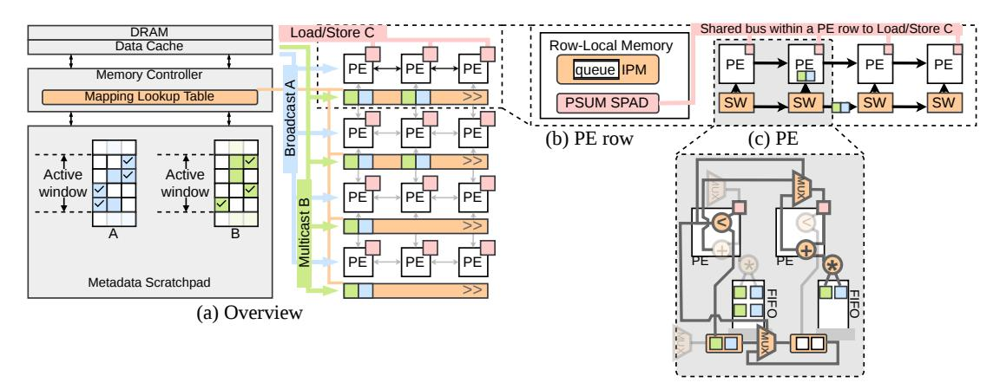

# *A. PE Row*

Figure [5\(](#page-6-1)b) illustrates a representative PE row containing four PEs. Each PE integrates an arithmetic logic unit (ALU) for local computation, a FIFO buffer that stores matched-butnot-yet-consumed B values, and a router with four physical ports to its neighbors. Although the router supports fourway connectivity, only one direction is active at any time, determined by the folding mechanism (§[IV-D\)](#page-7-1).

Initially, the router's active direction is *rightwards*, consistent with the default column-ordering rule of the V space mapping. Here, the PE row behaves as a simple right-propagating merge network, forming the baseline for our design. The folding technique (§[IV-D\)](#page-7-1) modifies these active directions.

We first introduce our PE-to-Virtual-Coordinate mapping. Each PE in a row holds exactly one virtual coordinate position of the output matrix C. Concretely, PE p in row r stores the partial sum C ∗ m,n whose V space coordinate is (r, p), along with the Cartesian column index n that maps to this position. A PE row therefore represents one virtual row of C, with PEs ordered left-to-right by increasing column index. When a B element with column index b enters a PE row, it is injected at the starting position determined by the IPM (§[IV-A2\)](#page-6-0) and traverses rightward through the merge network, comparing b against each PE's stored column index c until it finds a match (b = c, triggering accumulation) or a gap (b < c, triggering insertion).

Each PE row also has a dedicated connection to a small local memory containing: (i) the IPM, which the merge network keeps up-to-date as C entries shift, and (ii) a scratchpad (spad) holding overflow C values. All PEs within a row share this memory interface; therefore, we limit accesses to avoid contention.

*1) Adaptive Merge Network:* We refer to the PEs' local interconnect as a *merge network*. Each PE contains a *merger*

Fig. 5: SegFold  $\mu$ arch overview. PEs communicate over a local network, and share a row-level memory.

Fig. 6: Example of on-the-fly intersection where the indices of B are >, <, =, and conflicting with the C index.

(the local component of the merge network) that compares the incoming B element's column index against the C-column index stored at this  $\mathcal V$  space position. Based on this comparison, the merger decides whether to forward b to a neighbor or retain it locally for accumulation.

Figure 6 illustrates how the merge network determines the final virtual position  $f_{t_{\rm out}}$  in SEGMENTBC for each incoming B element. We use the red boxes to denote the Cartesian column index of the incoming B element and the pink boxes to denote the Cartesian column index of the  $C^*$  element stored at the PE.

Consider a PE row where the  $C^*$ -column indices  $\{1,3,4\}$  are stored at positions  $y=\{0,1,2\}$ . A B element with column index b=2 arrives at  $f_{t_{\rm in}}=0$ . At each position, the merger compares b and c (we use lower case to represent column indices), leading to one of these cases:

- Fig. 6(a): b > c. Because the  $C^*$ -column indices are strictly monotonic, the final position  $f_{t_{\text{out}}}$  must lie to the right of y. The element is therefore forwarded to y+1.
- Fig. 6(b): b < c. If we eventually reach a position y with a larger c, because monotonicity ensures that no match exists further to the right, the network shifts all C\*-column indices to the right by one slot. This creates an empty slot at y: the final virtual position ftout.
- Fig. 6(c): b = c. A match is found at position y, which becomes  $f_{t_{out}}$ .

Together, these cases ensure that each B element successfully finds its final virtual position  $f_{t_{out}}$ , provided that the  $C^*$ -

Fig. 7: Index to PE mapper (IPM) using binary search. Each level is in its own look up table (LUT) for pipelining.

column indices to the left of  $f_{t_{\rm in}}$  satisfy c < b. Figure 6(d) shows a scenario that violates this, and is prohibited by our dataflow.

2) Index to PE Mapper (IPM): To avoid the prohibited scenario in Fig. 6(d), the key challenge is to construct a mapping that (i) guarantees a legal  $f_{t_{in}}$  for every segment and (ii) simultaneously minimizes the traversal distance required. Achieving both goals increases PE utilization by enabling more pipelined segment injections from different B rows, while also reducing merge-network latency and contention.

We will now use s as shorthand for  $f_{t_{\rm in}}$  (where the B element enters the network). As discussed, a starting point s is legal if all  $C^*$ -column indices that appear to the left of s are strictly smaller than s, i.e.,  $\forall i < s, c_i < s$ . Due to row saturation and the column-ordering property, the  $c_i$  values stored in the merges are guaranteed to be strictly ordered from left to right without gaps. This monotonicity allows us to perform a binary search over the  $c_i$  values to determine the rightmost legal starting point for s.

Figure 7 shows an example of an IPM with multiple lookup tables (LUTs), looking up a B element with column index 11. In the first level, it is greater than 9 and will go to the right branch. In the second and third level, as both keys are showing null, it will go to the left branch. Finally, it reaches a leaf with value 8. Therefore, this b element will be mapped to the 8th merger and traverse the adaptive merge network.

**Row-wise Mapping.** Computing a separate mapping for every b element in a B row would be prohibitively expensive in hardware, since it would require the IPM to support a number of simultaneous reads proportional to the number of PEs. To

reduce this overhead, we instead compute the mapping only for the *first* nonzero element of each B row. This optimization is valid because, under the row mapping, each element's start point s increments by 1, matching the increment of its column index b. Combined with the column-ordering property, this guarantees that if the first mapped element of a row satisfies the legality condition ∀i < s, ci < b, the remaining elements automatically satisfy it as well.

IPM Updates. When a PE updates its c value, it notifies the IPM. Because the LUT has a limited number of write ports, multiple updates to the same entry are queued and applied serially, so the IPM may not always reflect the most recent c value. Due to the time-ascending property of these updates, an out-of-date LUT can only map a b element to a position to the *left* of its true most-recent legal starting point. This does not violate correctness, since the merge network still identifies the correct match, but it may increase the segment length. We quantify the gap between fully up-to-date c indices and the LUT-based mapping with bounded write bandwidth in §[VI-C.](#page-9-0)

