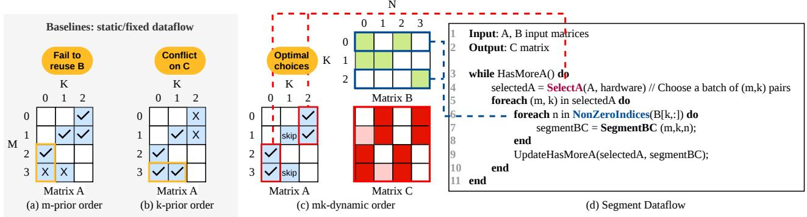
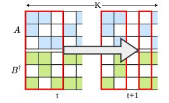

# Algorithm 1: SELECTA: Dynamic (m, k) Selection

```
Input: A bitmask, B-row metadata, hardware state; Wmax
        window size; Rmax PE-row capacity
  Output: Selected (m, k) pairs, corresponding partial B rows
  // Inter-tile: sliding window over K
1 while |Wk| < Wmax and HASMOREK() do
2 Wk ← Wk ∪ {next k};
3 end
  // Intra-tile: greedy mk-dynamic
     selection
4 selected ← ∅; usedM ← ∅;
5 foreach k ∈ Wk do
6 if |selected| ≥ Rmax then break;
7 foreach parallel m s.t. A[m, k] = 1 do
8 if m /∈ usedM and |selected| < Rmax then
9 selected ← selected ∪ {(m, k)};
10 usedM ← usedM ∪ {m};
11 end
12 end
13 end
  // Inter-tile: Retire completed ks and
     refill window
14 foreach k ∈ Wk s.t. ALLDONE(k) do
15 Wk ← Wk \ {k};
16 end
17 return selected;
```

elements that maximizes row-wise intersection—the number of m indices sharing the same k—which directly increases reuse of the corresponding B row.

Algorithm [1](#page-3-1) formalizes SELECTA: it selects (m, k) pairs from the input metadata based on the runtime hardware state. The flexibility in SELECTA originates from the associativity of the reduction over the K dimension, which allows intersections in Eq. [2](#page-1-0) to be computed in any order without violating the accumulation rule in Eq. [3.](#page-1-1) Based on this observation, SELECTA performs two levels of reordering: intra-tile reordering, which maximizes the number of A entries selected within each k column, and inter-tile reordering, which maximizes the number of k columns considered concurrently.

Intra-tile Reordering. Unlike prior dataflows that follow either an m-prior or a k-prior order, SELECTA decides the set of (m, k) pairs using an mk-dynamic order. More specifically, we simultaneously consider the following two criteria. First, we greedily maximize the number of pairs that share the same k, as shown in Algorithm [1](#page-3-1) line 5. Second, we avoid selecting pairs with different k values but the same m index, as shown in Algorithm [1](#page-3-1) line 8, because they update the same output row and can create reduction conflicts when their generated partials share column positions.

We use the A pattern in Fig. [2](#page-4-1) to demonstrate the advantages of our algorithm over conventional ones. Gustavson dataflow (Fig. [2\(](#page-4-1)a)) follows an m-prior order and chooses A0,2, A1,1, A2,<sup>0</sup> and A3,0. This restricts the potential reuse of the first B row, corresponding to the two elements highlighted in the yellow box. Outer product (Fig. [2\(](#page-4-1)b)) follows a k-prior order and selects A2,0, A3,0, A1,<sup>1</sup> and A3,1. Nevertheless, A3,<sup>0</sup> and A3,<sup>1</sup> have the same m index, so their products target the

<span id="page-4-1"></span>

Fig. 2: SegFold Dataflow Example. A batch of (m, k) pairs is chosen by SELECTA, and SEGMENTBC(m, k, n) is invoked over B[k, :] nonzeros for ordered processing in the virtual coordinate space. Reuse benefits over two iterations are shown in pink. Tick marks indicate the A elements selected for each spatial iteration under different dataflows.

same output row and may contend when the corresponding B rows contribute to overlapping n, which we do not know beforehand. Meanwhile, our algorithm selects  $A_{0,2}$ ,  $A_{1,2}$ ,  $A_{2,0}$ , and  $A_{3,0}$ , exploiting B reuse while avoiding reduction conflicts in C.

**Inter-tile Reordering.** Instead of choosing (m,k) pairs from a fixed tile, SELECTA maintains a *sliding window* over the K dimension. A k value in the window is marked as complete and replaced by a new one once all A-B intersections for that k have been processed.

For example, in Fig. 3, the third column of A and the corresponding third k slice of B (shown transposed in the figure) each participate in only one effective intersection. Once that intersection completes, the window advances from  $k = \{0,1,2\}$  to  $k = \{0,1,3\}$ . This

<span id="page-4-2"></span>

Fig. 3: Example active window of SELECTA, shown in red for two time steps.

enables k-level pipelining across different (m, k) tiles.

Moreover, using an entire B row as the intersection granularity increases reuse of the triggering A element across the loaded B row, but it also reduces the available parallelism across different B rows, because it requires the dataflow to finish an entire row of length N before moving on to the next intersection. To alleviate this limitation, we relax the requirement of fully loading a B row before processing and instead allow the hardware to operate on partial B rows. Concretely, we decompose the N dimension into smaller segments and interleave segments from multiple B rows. A single active window tracks the progress of each B row within the window, enabling higher inter-row parallelism while preserving the reuse benefits of row-wise intersection.

#### <span id="page-4-0"></span>B. SEGMENTBC: on-the-fly element-wise redistribution

The sparse patterns of both T and C are highly irregular and data-dependent, making it impractical to materialize a large intermediate tensor T and then reduce it afterward. Therefore, Segment dataflow performs on-the-fly element-wise redistribution to (1) generate and maintain compressed indices

for C and (2) reduce each  $T_{m,n,k}$  in place into the partial sum  $C_{m,n}^{*-1}$ .

Let  $(x,y) \in X \times Y$  denote the virtual coordinate at which a nonzero element of C is allocated for reduction, where |X| is the number of non-empty rows in C and |Y| is the maximum number of nonzeros in any row of C. We refer to  $\mathcal{V} = X \times Y$  as the *virtual coordinate space*; each occupied virtual coordinate holds a distinct C element. As new  $T_{m,n,k}$  are deposited into  $C_{m,n}^*$ , the virtual coordinate space evolves over time: newly created C entries are inserted, shifting existing entries to maintain ordering. In the  $\mathcal V$  space and the algorithm description, we do not distinguish T from B, since the dynamics depend only on the n indices. We use  $f_t$  to denote the mapping from the dense Cartesian space to the  $\mathcal V$  space at time step t:

$$f_t(m,n) = (x,y). (4)$$

 $f_t(m,n)$  indicates the compressed virtual location that stores the partial sum  $C_{m,n}^*$  at time t.

To preserve both correctness and maximize locality, we constrain the mapping  $f_t$  with the following properties:

- 1) **Injectivity.**  $f_t$  is injective: partial sums for distinct (m, n) pairs are assigned to distinct virtual coordinates (x, y).
- 2) **Row saturation.** Within each virtual row, nonzeros occupy consecutive *y* positions, left to right (no gaps).
- 3) **Column ordering.** Within each virtual row, column indices strictly increase from left to right. That is,  $\forall m$ , if  $f_t(m, n_1) = (x, y_1)$  and  $f_t(m, n_2) = (x, y_2)$  with  $n_1 < n_2$ , then  $y_1 < y_2$ .
- 4) **Time ascending.** Entries in a virtual row only move "forward" over time. For each x, if  $f_t(m,n) = (x,y)$  and  $f_{t'}(m,n) = (x,y')$  with t < t', then  $y \le y'$ .

Fig. 4 illustrates how the mapping f is updated in the walk-through example from Fig. 2(c). The numbers in the boxes show the column index n in the dense Cartesian space. At time step t, the bottom row of  $f_t$  contains  $\{0,2\}$  (Fig. 4(a)). When new B elements arrive and intersect with matching A elements, they generate partial sums with column indices  $\{0,1\}$ . Because the partial sum with column index 1 has not

<span id="page-4-3"></span><sup>&</sup>lt;sup>1</sup>Here we use \* to denote the intermediate result accumulated so far

<span id="page-5-0"></span>

Fig. 4: Example of on-the-fly update of the mapping from the C column indices to the V space. Example from Figure [2\(](#page-4-1)c).

previously appeared in the V space, the mapping is updated to {0, 1, 2} to satisfy the column-ordering property (Fig. [4\(](#page-5-0)b)).

With the definition of the V space, we formally define *segment* as the displacement, measured in virtual coordinate positions, that a B element traverses before reaching its final position in the PE array. The name SEGMENTBC reflects that an element enters the V space as B carrying B's metadata and leaves as C with its value and metadata updated. Specifically, for a B element with column index n that enters the array and is eventually accumulated into row m of C:

$$displacement = ||f_{t_{in}}(m, n) - f_{t_{out}}(m, n)||,$$
 (5)

where tin and tout denote the times when the element enters and is consumed, respectively. The displacement arises because the V space mapping f evolves over time: as new A– B intersections are discovered on-the-fly, newly formed C ∗ entries are inserted into the virtual coordinate space, shifting existing entries and potentially increasing the distance from ftin to the final position ftout . Additionally, the initial mapping ftin may be approximate due to hardware constraints (§[IV-A2\)](#page-6-0).

The optimization goal of SEGMENTBC is to minimize segment displacement, since longer displacements cause more network contention. We employ a dynamic mapping strategy that determines where B elements are placed and how they traverse the array; we discuss data traversal in §[IV-A1](#page-5-1) and mapping in §[IV-A2.](#page-6-0)

