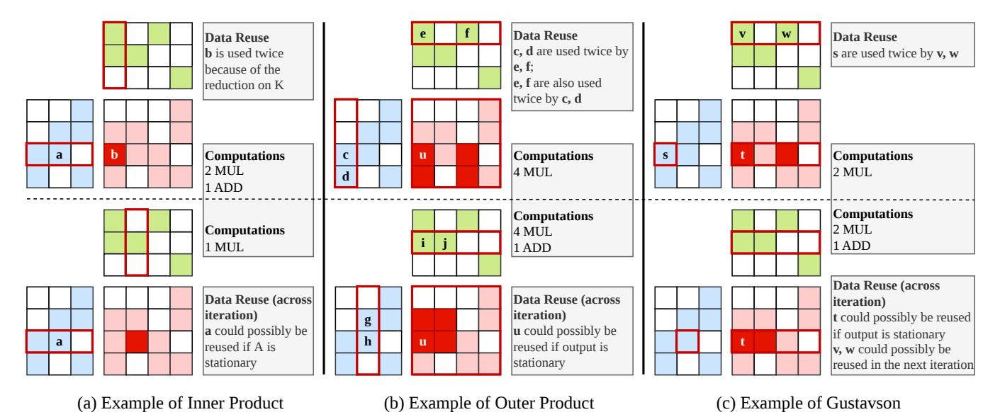

# *B. Dataflow in Prior Work*

SpGEMM accelerators span a diverse design space, characterized by their dataflow strategies and degrees of hardware reconfigurability (see Table [I\)](#page-1-2). Early versions of TPU [\[9\]](#page-13-10), [\[21\]](#page-13-9) use weight-stationary systolic arrays optimized for dense workloads, without sparsity support.

In the sparse domain, most prior accelerators adopt a static dataflow. Architectures like ExTensor adopt a fixed innerproduct dataflow [\[17\]](#page-13-2). SIGMA builds upon this by incorporating a reconfigurable reduction network [\[39\]](#page-14-14). Outer-product accelerators, such as OuterSpace [\[33\]](#page-14-1) and SpArch [\[54\]](#page-14-15), exploit sparsity using mechanisms like specialized memory hierarchy or comparator arrays. Gustavson-inspired designs, including MatRaptor [\[43\]](#page-14-16) and Gamma [\[51\]](#page-14-17), focus on row-/column-wise intersections through comparator queues; Gamma and Zed [\[6\]](#page-13-11) additionally include a matrix-preprocessing step that groups similar rows of the stationary matrix to improve reuse on the streaming matrix.

Recent efforts like Flexagon [\[28\]](#page-13-7), Trapezoid [\[49\]](#page-14-11), Sp-MARD [\[46\]](#page-14-18), SparGD [\[45\]](#page-14-12), and SPARM [\[26\]](#page-13-12) support multiple dataflows (inner-product, outer-product, Gustavson), employing reconfigurable distribution, merge, and reduction fabrics for greater flexibility across different matrices.

Spada [\[24\]](#page-13-8) develops a window-adaptive (WA) dataflow that supports a spectrum of execution modes by adjusting window height and width at tile granularity to realize the input and output reuse benefits of different dataflows under varying sparse patterns. It uses local dynamism: neighboring lanes can opportunistically process each other's elements when idle, providing some degree of dynamic load balancing within the merge network. However, the overall scheduling remains statically determined by the tiled loop structure.

Fig. 1: Comparison of classic dataflows. Every two consecutive blocks in a column (top vs bottom) are two sequential snapshots.

Within this continuum, SegFold introduces a dynamic dataflow that adapts at sub-tile granularity. Unlike Spada's window-size adaptation, SegFold dynamically reorders work selection (SELECTA in §[III-A\)](#page-3-0) within an active window based on instantaneous reuse opportunities, and uses a reconfigurable merge network to dynamically remap partial sums (SEGMENTBC in §[III-B\)](#page-4-0) based on output sparsity patterns discovered on-the-fly.

