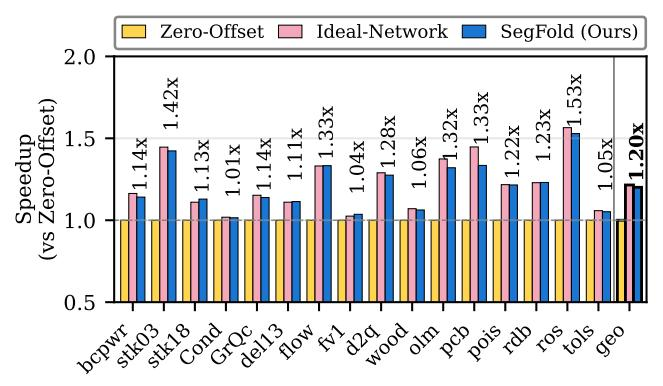
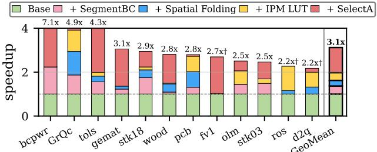

# V. METHODOLOGY

Simulation Infrastructure. We evaluate SegFold using a cycle-level microarchitectural simulator. Hardware parameters are summarized in Table [II.](#page-8-0) To maintain a hardware cost comparable to state-of-the-art sparse accelerators [\[28\]](#page-13-7), SegFold instantiates a 16 × 16 2D PE array. The design meets timing at 1 GHz. The memory controller uses a fixed active-window size of 32, chosen to balance performance against metadata and storage overhead.

The memory hierarchy uses an on-chip cache backed by offchip HBM2 DRAM, with details in Table [II.](#page-8-0) Off-chip memory is modeled using Ramulator2 [\[25\]](#page-13-15) configured with an HBM2 at 2 Gbps. All hardware components are simulated on a cycleby-cycle basis to ensure timing accuracy.

Baselines. We compare to two state-of-the-art accelerators.

*Flexagon* [\[28\]](#page-13-7) is a reconfigurable accelerator capable of supporting multiple canonical dataflows. The on-chip components of Flexagon are modeled using the open-source STONNE simulator [\[30\]](#page-13-16), integrated with the same Ramulatorbased memory backend for consistency. Since Flexagon was originally designed as a 1D array accelerator, it is extended to a 2D configuration for fair comparison. This extension duplicates the on-chip cache while maintaining a shared offchip DRAM. To match the compute resources of SegFold, Flexagon's 1D array of 128 PEs is scaled into a 2D array of 2 × 128 PEs. On-chip bandwidth is preserved by scaling both the reduction network and distribution network to 128 elements per cycle for each 1D array. The original Flexagon network remains unchanged along the second dimension; the 2D extension is achieved by tiling along M to distribute the workload evenly across the two PE arrays.

*Spada* [\[24\]](#page-13-8) is a runtime-adaptive SpGEMM accelerator that dynamically adjusts its window to the sparsity of matrix A. We use its open-source simulator unchanged as our baseline. For the non-square evaluation (Fig. [9\(](#page-10-1)a)), we additionally integrate Spada with the same Ramulator2 HBM2 memory backend used by SegFold to ensure a fair memory-system comparison.

Area and Energy. We employ the ASAP7 7nm standard-cell library as the target technology for RTL synthesis [\[2\]](#page-13-17). We use Design Compiler to elaborate all RTL sources and invoke compile\_ultra for timing-driven optimization. We report the post-synthesis timing, area, resources, and power.

Workloads. We select fifteen matrices from SuiteSparse [\[8\]](#page-13-18) as our baseline benchmark suite for the overall and non-square comparisons, covering a range of application domains, matrix sizes, aspect ratios, and sparsity levels. The ablation studies in §[VI-C](#page-9-0) draw from a slightly different subset to expose mechanism-specific behavior. Throughout, we report *density* as nnz/(M ×N). These matrices are characterized in Table [III.](#page-9-1) Across all experiments, the matrices span dimensions from hundreds to tens of thousands of rows and densities across more than two orders of magnitude. The test set includes both square and non-square matrices to capture the shape impact of matrix multiplication. The benchmark suite exercises a representative range of irregular access patterns. Unless otherwise specified, we use the transpose of the matrix as B for matrix multiplication.

Tiling. Tiling is applied along the Cartesian dimensions M and N. Tile sizes are statically determined based on the distribution of nonzero values in the corresponding C tiles. To accommodate the tiling, when a virtual row of C exceeds the physical PE-row capacity, overflow values are spilled to the per-row spad. Because the spad is sized to accommodate the expected maximum overflow, which is determined by the

TABLE III: SuiteSparse matrices used in our evaluation.

| Matrix       | M     | N     | Density     | Application domain    |  |
|--------------|-------|-------|-------------|-----------------------|--|
| fv1          | 9604  | 9064  | $9.79e{-4}$ | 2D/3D problem         |  |
| flowmeter0   | 9669  | 9669  | $7.21e{-4}$ | Model reduction       |  |
| delaunay_n13 | 8192  | 8192  | $7.32e{-4}$ | Undirected graph      |  |
| ca-GrQc      | 5242  | 5242  | $1.05e{-3}$ | Undirected graph      |  |
| ca-CondMat   | 23133 | 23133 | $3.49e{-4}$ | Undirected graph      |  |
| poisson3Da   | 13514 | 13514 | 1.93e - 3   | CFD                   |  |
| bcspwr06     | 1454  | 1454  | $2.51e{-3}$ | Power network         |  |
| tols4000     | 4000  | 4000  | $5.49e{-4}$ | CFD                   |  |
| rdb5000      | 5000  | 5000  | $1.18e{-3}$ | CFD                   |  |
| gemat1       | 4929  | 10595 | $8.92e{-4}$ | Power network         |  |
| lp_woodw     | 1098  | 8418  | $4.06e{-3}$ | Linear programming    |  |
| pcb3000      | 3960  | 7732  | $1.88e{-3}$ | Circuit simulation    |  |
| Franz6       | 7576  | 3016  | 1.99e - 3   | Combinatorial problem |  |
| Franz8       | 16728 | 7176  | $8.36e{-4}$ | Combinatorial problem |  |
| psse1        | 14318 | 11028 | $3.63e{-4}$ | Power network         |  |

tile dimensions along M and N and the anticipated density of C, spills are infrequent under our default tiling configuration.

#### VI. EVALUATION

We evaluate SegFold's end-to-end performance against Spada and Flexagon, perform a per-component ablation, study sensitivity to key hardware parameters and input sparse patterns, and report post-synthesis area and power.

#### A. Overall Performance

Fig. 8 shows that SegFold achieves a 1.95× geometric-mean speedup over Spada and a 5.3× geometric-mean speedup over the best-performing Flexagon configuration across all workloads. The much larger 5.3× speedup over Flexagon reflects the limitation of static dataflows: Flexagon must commit to a single dataflow—inner-product, outer-product, or Gustavson—per tile, and even its best per-tile choice cannot simultaneously exploit reuse on all three operands. SegFold's dynamic scheduling sidesteps this by reordering work within each tile based on the runtime nonzero pattern.

On highly sparse matrices with structured, non-uniform nonzero distributions, SegFold achieves  $1.08\times$  to  $5.75\times$ speedups over Spada. The advantage comes from SegFold's two core dynamic mechanisms operating within a tile: (1) SELECTA dynamically reorders (m, k) pairs in the active window to maximize B-row reuse and avoid C-row contention, and (2) SEGMENTBC dynamically remaps partial sums across PEs based on the evolving  $\mathcal{V}$  space state. Spada, in contrast, adapts only its window size at tile granularity while keeping the scheduling within each window static, leaving sub-tile reuse and load-balance opportunities unexploited. This gap is amplified on highly sparse matrices, where SegFold's dynamic scheduling can skip whole empty regions of the iteration space outright (e.g., k columns with no A/B-nonzeros), while Spada must still follow its static loop over the entire window even when most of it contributes no work. The one exception is ca-GrQc, on which SegFold underperforms Spada  $(0.59\times)$ : its scale-free graph structure produces a few extremely dense rows that overwhelm SegFold's per-row PE allocation, while Spada's tile-level adaptation handles them better.

#### B. Non-square Performance

Figure 9(a) compares SegFold against Spada on non-square SuiteSparse matrices. These non-square comparisons are done by multiplying each matrix by its own transpose. SegFold outperforms Spada on tall matrices, achieving  $1.42\times$  geomean speedup over Spada, where its dynamic dataflow effectively exploits the elongated row structure. On wide matrices, however, SegFold falls behind: two out of three tested matrices underperform Spada. The cause is how SegFold handles the K dimension: because we do not tile along K within a tile, a large K relative to M creates load imbalance across K rows. Transposing the matrices does not help here because we are already computing K a self-transpose multiply). However, there are cases where transposition could provide critical optimization.

As shown in Fig. 9(b), Direction 1 computes  $A_{\mathrm{real}}^{M,K} \times S^{K,N}$ , where  $M \neq K$  and K = N while Direction 2 computes  $S^{M,K} \times \left(A_{\mathrm{real}}^{N,K}\right)^{\top}$ , where M = K and  $K \neq N$ . They are arithmetically equivalent up to an output transpose, effectively swapping which operand drives SELECTA. Transposing the wide matrices recovers 2.4– $3.0\times$  over Direction 1, confirming that the M/K ratio has a significant impact on SegFold's performance: when an operand has its reduction-side dimension K much larger than its output-side dimension, making it the second operand places its short axis along the multiplication's output dimension N. The dataflow then iterates along the short N rather than the long K, improving the efficiency of SELECTA's scan. Conversely, on tall matrices Direction 1 is already favorable. Selecting the multiplication direction can often be decided in advance, yielding several-fold speedups.

#### C. Ablation Studies

We isolate the effects of two components of SegFold: (i) the dynamic scheduling and (ii) the dynamic mapping.

- 1) Effect of Dynamic Scheduling: To understand the impact of SegFold's dynamic dataflow, we perform an experiment with fixed k iteration order, making the dataflow resemble a constrained outer-product scheme: instead of dynamically reordering k within the active window, we process k in a predetermined sequence. The final result shows this reduces normalized performance to  $0.670 \pm 0.065$  of the baseline, indicating that dynamic k reordering is important for exposing segment-level parallelism and keeping PEs busy.
- 2) Effect of Dynamic Mapping: To isolate the effect of dynamic mapping, we compare SegFold's LUT-based mapping against two alternatives, both using the same dataflow and hardware resources but with different mapping logic:
- 1) **Zero-Offset mapping**: the head of the B row is always mapped to the beginning of the PE row  $(f_{t_{in}}(m,n)=0)$ .
- 2) **Ideal-Network mapping**: an oracle mapper that always finds the optimal placement with no stale-index overhead.

Figure 10 reports the speedup of each mapping method across 16 SuiteSparse matrices, normalized to the zero-offset baseline. SegFold's LUT-based mapper achieves a geometric-mean speedup of  $1.20\times$  over the zero-offset policy. Matrices

Fig. 8: Speedup over Spada and static dataflow implementations on SuiteSparse matrices. Sparsity patterns shown below.

Fig. 9: Nonsquare SuiteSparse matrices. (a) SegFold vs. Spada speedup, normalized to Spada. (b) Effect of multiplication direction on SegFold throughput, normalized to nonsquare matrix as A.

Fig. 10: Speedup of different mapping methods (Zero-Offset, Ideal-Network, SegFold) on SuiteSparse matrices, normalized to Zero-Offset.

with more irregular sparsity patterns (e.g., pcb3000, olm5000, flowmeter0) benefit most from dynamic scheduling, as the LUT-based mapper adapts to instantaneous PE occupancy and avoids long segment traversals. Compared to the ideal oracle mapping, SegFold's LUT-based scheduling incurs only a 1.2% average overhead, demonstrating that our hardware approximation closely tracks the theoretical optimum.

**Attribution Summary.** To quantify the contribution of each dynamic mechanism in both the dataflow and microarchitecture, we conduct an incremental ablation study across 12 SuiteSparse matrices. Figure 11 shows the performance breakdown of SegFold, achieving a geometric-mean speedup of  $3.1\times$  over the base configuration. Across different sparsity patterns, each dynamic mechanism contributes to the overall speedup, with SELECTA delivering the largest gain—

Fig. 11: Speedup break down of the different dynamic mechanisms.

Fig. 12: Hardware-parameter sensitivity studies across three matrix sizes (N = 256, 512, 1024) and two density levels (d = 0.05, 0.1). (a) Crossbar Width sweep, normalized to BRL=4. (b) Window Size sweep, normalized to W=32. Color encodes matrix size, marker encodes density ( $+: d = 0.05, \times: d = 0.1$ ).

indicating that dynamic scheduling plays a critical role in handling highly irregular sparse matrices. SEGMENTBC, spatial folding, and the IPM LUT provide additional gains, with their relative benefits depending on the matrix's structural properties and output sparsity patterns.

