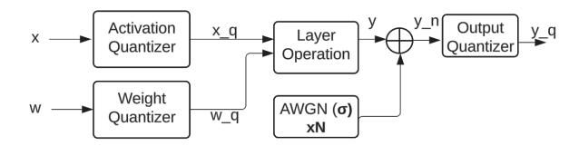

# *A. Transient simulations*

Eye diagrams are generated using electro-optic transient simulations in Cadence Spectre. The photonic modulators are used from a 45nm photonics-enabled CMOS PDK [72]. The intrinsic bandwidth of these modulators exceeds 35 GHz. Transient simulations are performed for >105 clock cycles to capture ISI effects. We assume a uniform distribution of the quantized values during the transient simulation. Although the unquantized DNN activation values are concentrated near zero, the quantization process (Sec. III-C) moves these values to be evenly distributed across quantization levels (Fig. 8).

## *B. Optical loss budgeting*

An optical power tracker [18] is employed for loss budget evaluations. The parameters used in loss budget evaluation are shown in the 'Ours' column in Table-IV. The laser source is a multi-wavelength laser with 15% efficiency [63] – we assume, optimistically, that the efficiency is maintained as the number of wavelengths increases. Photonic devices are chosen with the least optical loss – SiN waveguide [69], Y-branch splitter [15], edge coupler [73], micro-ring modulator [74], micro-ring resonator [18], Mach-Zehnder [28], and directional-coupler [75]. A 3dB penalty due to biasing of modulators, along with an additional 2dB margin to accommodate fluctuations in laser power and other signal losses [76], is also included in Table-IV. Additional losses due to ISI and photonic MAC operation are discussed in Sec-IV-B and Sec-IV-C, respectively.

#### *C. DNN evaluations*

We use Pytorch [77] to evaluate inference accuracy under the effects of nonlinearities, ISI and noise introduced by SiPh accelerators. Image classification accuracy is evaluated on the ImageNet [37] dataset for MobileNet-v2 [78] and ResNet50 [38], which contain 3.4M and 26M parameters, respectively. We also evaluate perplexity on Wikitext-2 [79] dataset for Qwen2.5-7B-instruct language model [80].

For image classification networks, we apply quantizationaware training (QAT) [81] to recover accuracy with lowprecision (3-bit/4-bit) weights and activations. QAT also learns the optimal dynamic range for both activations and weights, which are used by the quantizers during inference (Fig. 8).

Fig. 8. Schematic for noise injection in a DNN layer. Activation, weight and output quantizers ensure that data is quantized to low-bit precision. Variance for AWGN is the noise added by the SiPh accelerator. The number of noise samples added to the layer output depends on the dot-product length in the SiPh accelerator and the number of channels in the DNN layer.

For the language model, we evaluate a post-training quantization model, as QAT was infeasible due to limited compute resources. The baseline Qwen2.5-7B-instruct is implemented in fp16 precision [80], and must be quantized to low precision weights and activations for deployment on SiPh accelerators (Sec. II-C1, Sec. IV-F1).

Weights are quantized to int4 precision using activationaware weight quantization [82], while the activations are still retained in fp16 precision to preserve model performance [82]–[84]. We refer to this weight quantized language model as Qwen2.5-7B-instruct-AWQ.

To enable deployment on a SiPh accelerator, the activations in the Qwen2.5-7B-instruct-AWQ model are further quantized to integer formats (int4-int8). This quantization is performed by using an affine transformation with a scale and a zero point value [85]. We investigate three quantization granularities in Sec. IV-E – per-tensor, per-feature and per-block.

Per-tensor quantization applies a single scale and zero point to the entire activation tensor. Per-feature granularity applies a single scale and a zero point to each hidden dimension of the activation tensor. Per-block granularity applies a single scale and zero point to a block containing 14 batches and 74 hidden dimensions. This particular block size is chosen to provide the best perplexity on the Qwen2.5-7B model, and larger block sizes lead to poorer perplexity in our evaluations.

#### *D. Incorporating analog signal integrity factors*

We implement the effects of analog signal integrity factors using hook utilities [77]. We add nonlinearity to the input encoding using forward pre-hooks, where the nonlinearity function depends upon the modulator and the biasing (Sec. II-B1).

We account for timing noise due to ISI by first deriving the post-MAC conditional output distributions from transient simulations (Sec-IV-B). The derived distribution is added as a noise layer using forward post-hooks.

The effect of analog noise on the output is also added using post-hooks, where the variance of the Gaussian noise is derived from the optical loss budgeting (Sec-IV-G3). We also consider the dot-product length and add multiple noise samples [86] depending on the number of channels in the layer (Fig. 8).

