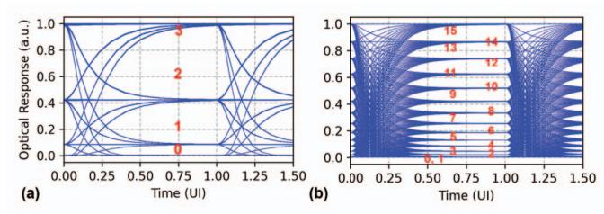
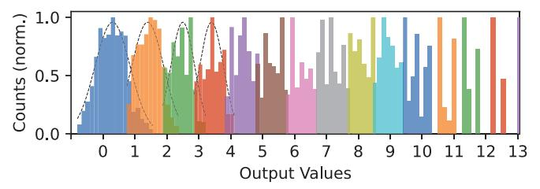
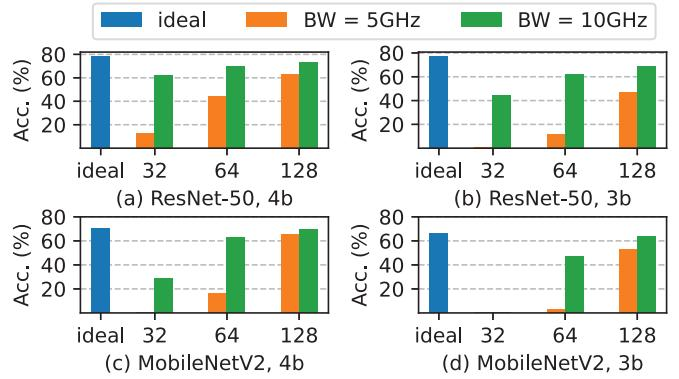
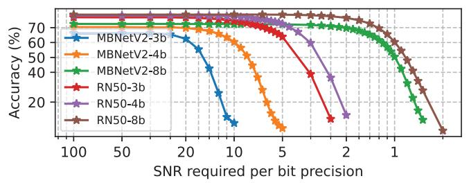
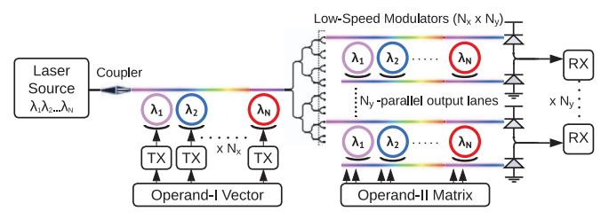
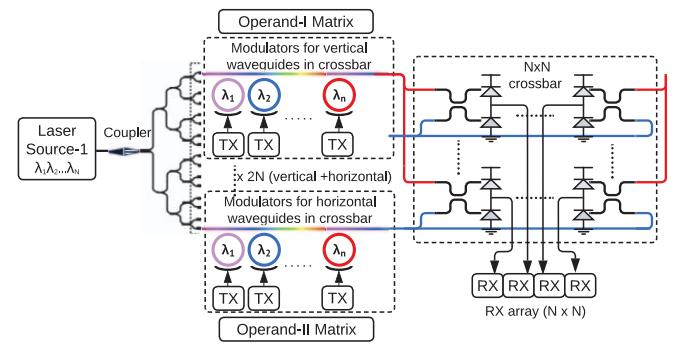
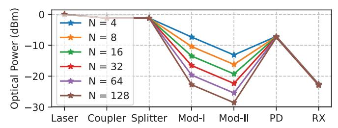
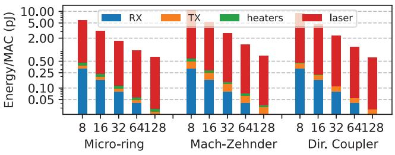

# *E. Power Evaluation for SiPh accelerators*

The energy consumed in MAC operation for SiPh accelerators includes energy consumed in the (a) transmitter circuits for encoding input activations, comprising serializer, and linear driver with nonlinearity compensation and ISI mitigation (Sec. IV-F1), (b) heater for encoding weight values, (c) receiver circuits for deducing output values comprising linear TIA (Sec. II-C1), and ADC, and (d) Laser power.

The parameters used for evaluation are listed in the 'Ours' column in Table-IV. We use the energy from measured circuits wherever possible. For the TX energy at 1-2 bit precision, we report published SiPh transceivers. For >3-bit precision, we calculate the driver power consumption (Sec-IV-F1).

The compensation power for nonlinearity is synthesized in a 16nm CMOS process (Sec-IV-F1). We choose the linear TIAs which support the multi-bit detection with the lowest energy (2/3-bit [48], 4-bit [58], 5-bit [46]). We use two ADCs depending on the operating frequency – [87] for 5GHz, and [88] for 10GHz.

#### *F. Power Evaluation for Digital accelerators*

We compare the energy/MAC operations in SiPh accelerators with that of digital DNN accelerators in Sec. IV-H. To ensure a fair comparison, we match the effective MAC throughput of the two designs. Both accelerators are evaluated under an output-stationary dataflow to maintain a consistent mapping. While more efficient and reconfigurable dataflows for digital accelerators are possible [89], comparing them is left to future work. The DRAM and on-chip SRAM bandwidths are sized to maintain the MAC throughput. The energy costs of the on-chip SRAM and DRAM are not included in this comparison to isolate the compute energy.

For the digital baseline, we synthesize a digital MAC array with 5 subarrays, each containing 16×16 MACs running at 1 GHz in a 16nm CMOS process. The digital MAC array includes a multicast interconnect for input activations [90] and a reduction interconnect for adding partial sums. The specifications of the digital baseline are shown in Table-V.

#### *G. Limitations of the study*

Evaluations based on analog circuit simulations are sensitive to simulation granularity and environmental variations. We make the following assumptions to make the analysis tractable, which bias the simulations in favour of SiPh accelerators.

We model the encoding circuit to be an ideal linear circuit with bandwidth limited by a lumped RC element. A transistorlevel implementation would capture parasitics and device mismatch that would further degrade signal integrity [35].

We also do not account for the cost of high-frequency clock distribution and signal routing, as these effects can be captured only after physical layout [19].

We assume no device-level mismatch in the photonic components. In practice, such mismatches induce variations in optical loss across the MAC array and necessitate calibration and control circuits, which in turn reduce laser efficiency [16].

Finally, we do not consider manufacturability, yield, packaging and validation overheads [19]. These issues are common concerns for analog circuits and are further exacerbated in analog SiPh accelerators.

#### IV. EVALUATIONS

#### *A. Effects due to nonlinearity*

We plot the eye diagram for 2-bit and 4-bit encoding on a micro-ring modulator (MRM) without nonlinearity compensation (Fig. 9) to show the impact of nonlinearity. Unequal eye heights and merging of the '0' and '1' optical levels are visible in Fig. 9(b). Furthermore, the impact of nonlinearity is more severe for MAC operations – the optical levels for outputs '0', '1' and '2' are merged (Fig. 10(a)).

While eye diagrams provide a qualitative view, the impact of nonlinearity is more clearly reflected in DNN accuracy. Fig. 11 shows the effect of nonlinearities on ResNet-50 and MobileNet-V2 at 3-bit and 4-bit precision. DNNs are very sensitive to the cosine nonlinearity introduced by the MZM at 3-bit precision – ResNet-50 incurs >25% accuracy loss and MobileNet-V2 accuracy collapses to near zero.

Fig. 9. Eye diagrams at 5 GHz clock cycle for (a) 2-bit and (b) 4-bit encoding, without nonlinearity compensation. Driver -3dB bandwidth is set as 10 GHz and 15 GHz, in (a) and (b), respectively. The optical levels are marked in red.

Fig. 10. Eye diagrams at 5 GHz clock cycle for a 2-element dot product operation at 2-bit precision with (a) driver with no nonlinearity compensation, and (b) ideal linearized driver. Driver -3 dB bandwidth is set to 10 GHz.

Fig. 11. Effect of nonlinearities on DNN accuracy. RN50 and MBV2 refer to ResNet-50 and MobileNet-V2, respectively.

The MRM operation is strongly dependent on the biasing conditions. We evaluate two bias points corresponding to extinction ratios (ER) of 20 dB and 15 dB (Sec. II-B2). While there is minimal accuracy loss at 20 dB ER (1-2%), the 15 dB ER shows much larger accuracy losses. Fig. 2 shows ResNet50 accuracy at 4-bit precision across these modulator configurations, including a 14 dB ER MRM, where the accuracy further drops to 47.7%.

#### *B. Effects due to inter-symbol interference*

In this section, we analyze the impact of inter-symbol interference (ISI). First, we analyze the effect of ISI on the eye width. We assume timing noise of 2 psrms in our analysis, which requires an eye-width >28 ps to achieve an error rate of 10−12. Prior transceivers have reported timing noise ranging from 0.8 ps to 3.7 ps [21], [36], [91].

Fig. 12 shows the variation of eye width with TX bandwidth (BW). TX BWs >12.5 GHz provide sufficient eye width for reliable sampling of MAC operations at a 5 GHz clock frequency. In contrast, a 4-bit SiPh MAC operation at 10 GHz clock frequency requires BW >40 GHz to achieve sufficient eye width. Such high-bandwidth TX are showcased in stateof-the-art SiPh TX [25], [35], and typically rely on extensive equalization [35], [36].

We further use eye diagrams to derive output distributions when the eye width falls below the error-free threshold. Fig. 13 and Fig. 14 show the output distributions for 4-bit MAC operation at 5 GHz, with TX driver BWs of 5 GHz and

Fig. 12. Eye width plotted against TX driver BW. The purple line represents the required eye width to achieve an error rate below 10−12.

10 GHz, respectively. We observe that distributions of output values at 5 GHz BW spill over to adjacent outputs, indicating incorrect detections. At 10 GHz BW, the distributions show improved seperation between the output levels.

Fig. 13. Normalized histogram for output values for 4-bit SiPh MAC operation at 5 GHz with TX driver BW of 5 GHz. The dotted curves represent the Gaussian distribution fits.

Fig. 14. Normalized histogram for output values for 4-bit SiPh MAC operation at 5 GHz with TX driver BW of 10 GHz. The dotted curves represent the Gaussian distribution fits.

We use the derived output distribution to quantify DNN accuracy degradation under ISI (Fig. 15). Significant overlap in the output distributions for the 5 GHz TX driver BW results in an accuracy loss >5% across all SiPh accelerator sizes. Severe accuracy losses, >50%, are observed in smaller 32×32 arrays. Reduced output distribution overlap greatly improves accuracy for the 10GHz TX driver BW; however, a nonnegligible accuracy loss persists, with up to 9% degradation observed for ResNet-50 at 3-bit precision.

#### *C. Eye Height losses due to analog photonic MAC operation*

In this section, we present an eye height loss mechanism arising from analog photonic MAC operation, independent of the DNN model being evaluated. This loss mechanism becomes apparent only when the eye diagrams for photonic MAC are examined. Contrast the eye diagrams for 4-bit communication and 4-bit MAC, as shown in Fig. 16. Zoomedin eyes around levels '2' and '3' (Fig. 16(c) and (d)) show that eye heights in 4-bit photonic MAC are significantly reduced compared to 4-bit communication.

Fig. 15. DNN accuracies at clock frequency of 5 GHz for different SiPh accelerator sizes (from 32×32 to 128×128) under the ISI effects caused by driver BW of 5 GHz and 10 GHz.

This loss occurs in photonic MAC operation because multiple input-weight combinations produce the same output value. For instance, an optical value of '2' in 4-bit output precision can result from the following 4-bit quantized input and weight values: [(4, 4), (4, 5), (6, 3), (7, 3), (7, 4), (8, 2), (8, 3), (9, 3), (10, 3), (11, 2), (12, 2), (13, 2), (14, 2), (15, 2) ]. The receiver electronics would need to distinguish between the maximum optical level of '2' and the minimum optical level of '3', effectively compressing the decision margin, and increasing the error probability.

Fig. 17 quantifies total eye height loss, including contributions from both photonic MAC operation and ISI. Eye height losses due to photonic MACs account for the largest portion of these losses – 8.45 dB for 3-bit MAC and 11.76 dB for 4 bit MAC. These eye height losses are utilized in optical loss budgeting (Sec-IV-G3).

Fig. 16. Eye diagrams at 5 GHz clock frequency with a 15 GHz TX driver BW for (a) 4-bit communication, (b) 4-bit MAC operation. (c) 4-bit communication, zoomed in around optical levels '2' and '3', and (d) 4-bit MAC operation, zoomed in around the same optical levels. The solid red lines in (c) and (d) represent thresholds for detecting the levels.

#### *D. Accuracy measurements under noise*

We first examine the accuracy when a single noise sample is added to the DNN layers (Fig. 18). We can see that the low bitwidth quantized DNNs (3/4-bit) are less resilient to noise than the 8-bit quantized DNNs [92]. SNR required for

Fig. 17. Eye height loss relative to ideal eye height for MAC operations at 3 bit/4-bit precision and different TX driver bandwidths. Plotted loss comprises eye height reduction due to photonic MAC and ISI losses.

minimal accuracy loss in MobileNetV2 quantized to 3, 4 and 8-bit precisions are >20, >12 and >2, respectively, and for ResNet50 quantized to 3, 4 and 8-bit precisions are >12.5, >8.33 and >2.5, respectively. Notably, the SNR values for accuracy with 3/4-bit quantized models (SNR = 20, 8.33) exceed the SNR required for detecting 3/4-bit output values with an error rate of 10−12 (requiring SNR = 7).

The DNN accuracy under the effect of noise for different SiPh accelerator sizes is shown in Fig. 19. The largest array size (256×256) achieves noise performance close to a single noise sample addition, whereas smaller arrays require additional SNR (12-20) to maintain accuracy.

Fig. 18. Classification accuracy with single noise sample injection [86] for 3, 4 and 8-bit quantized MobileNetV2 (MBNetV2) and ResNet50 (RN50), for different SNR/(bit-precision) values.

Fig. 19. DNN accuracy for different SiPh accelerator sizes (from 32×32 to 256×256) under the effect of noise. The x-axis shows SNR per bit-precision.

## *E. Perplexity measurements with quantized activations*

In this section, we examine the perplexity on the Wikitext-2 dataset [79] for Qwen2.5-7B-instruct-AWQ [80] language model. Achieved perplexity for different activation precisions and quantization granularities (per-tensor, per-feature, and per-block) (Sec. III-C) are shown in Table-II. The baseline Qwen2.5-7B-instruct-AWQ language model with weights in int4 precision and activations in fp16 precision achieves a perplexity of 6.79. Among the evaluated schemes, per-block quantization yields the lowest perplexity across all precisions.

When the activation values are quantized to int8/int7 precision, perplexity remains close to the baseline, indicating minimal disruption to the model's internal representation. However, when precision is reduced to int5/int4, perplexity increases dramatically, indicating insufficient dynamic range to capture outlier activations. Such outlier activation values are critical for achieving high performance in language models [93]. Consequently, the perplexity achieved by Qwen2.5- 7B-instruct-AWQ with int5 activation precision is worse than that of the pointer sentinel-LSTM model containing 21M parameters, introduced on the Wikitext-2 dataset in 2016 [79].

TABLE II WIKITEXT-2 PERPLEXITY (LOWER IS BETTER) FOR QWEN2.5-7B-INSTRUCT-AWQ WITH INT4 WEIGHTS UNDER DIFFERENT ACTIVATION QUANTIZATION PRECISION AND GRANULARITY.

| Activation precision | per-tensor | per-feature | per-block |
|----------------------|------------|-------------|-----------|
| fp16 (baseline)      | 6.79       | 6.79        | 6.79      |
| int8                 | 17.71      | 8.2         | 6.82      |
| int7                 | 1284.77    | 35.9        | 6.85      |
| int6                 | 30564      | 19.77       | 8.04      |
| int5                 | 83150      | 182441      | 182       |
| int4                 | 1204401    | 53317       | 2129      |

To address the dynamic range in activations, digital implementations typically perform accumulations in higher bit precisions – FP8 precision [94], [95], and 24-bit integer precision [96] accumulation is used even with multiplications in FP4 and int4 precision, respectively. Tackling the dynamic range is difficult for SiPh accelerators, as they cannot utilize bits lost due to ADC quantization [97].

The observed perplexity degradation for Qwen2.5-7Binstruct-AWQ arises solely due to activation quantization, before considering any analog signal integrity factors which have been shown to impact DNN performance (Sec. IV-A, Sec. IV-B, Sec. IV-D). Thus, further algorithm and devicelevel advances are required for the deployment of language models in SiPh accelerators.

#### *F. Mitigating analog signal integrity factors*

In this section, we discuss the techniques used to mitigate the analog signal integrity factors and quantify the energy overhead.

*1) Nonlinearity compensation in linear SiPh TX:* Nonlinearity compensation in TX is usually performed by (a) utilizing a higher resolution driver or segmented modulator ((n+k) bits) [54] to generate 2(n+k) optical levels, and (b) using a nonlinearity compensation logic that maps the n-bit data to a (n+k)-bit value to linearize the resulting optical output.

Prior SiPh TX have implemented 30 driver segments (4.9b) [20], [35], a 4-bit segmented driver [39], and a 5 bit driver [27] in 2-bit, 2-bit, and 4-bit communication, respectively, to compensate for nonlinearities. A SiPh accelerator [15] has also proposed using a 5-bit driver for compensating static nonlinearity in 4-bit modulation. These designs correspond to compensation overheads of k = 1 for [15], [27] and 2 for [20], [35], [39]. We conservatively choose k = 3 in our analysis due to the pronounced impact of nonlinearity on MAC outputs (Sec. IV-A).

Next, we estimate the total TX energy in a SiPh accelerator by calculating the driver power (Pdrv) and the nonlinearity compensation logic power (Pnlc). We estimate Pdrv by utilizing Eq. 5, where f is the modulation frequency, and α denotes the toggle rates. The toggle rates (α) are modified for multibit precision [98], and Vswing is chosen as 2 V, which can be generated by CMOS processes [34]. We choose Cmod as 40 fF. Modulator device capacitance and parasitics each contribute around 20 fF, representing advanced devices [99], and packaging techniques [73], [100].

Pnlc is calculated by synthesizing the nonlinearity compensation logic in a 16nm CMOS process with a clock frequency of 5 GHz. We time-multiplex two logic blocks to meet the timing constraints at a 10 GHz clock frequency.

$$P_{\rm drv} = \frac{1}{2} \left( \alpha f C_{\rm mod} V_{\rm swing}^2 \right) \tag{5}$$

The estimated total TX energy (driver, nonlinearity compensation and serializer) for different bit precisions is shown in Fig. 20. Energy consumed by prior SiPh TX [20], [22]– [25], [27], [34]–[36], [39], [41]–[45], [49]–[51], [99], [101], [102] are also shown for reference. Estimated TX energy is on par with the lowest energies since we assume a lower Cmod and Vswing compared to prior SiPh TX to reflect the newer devices and technology nodes [73], [74], [99], [100]. Multibit TX consumes much higher energy than binary, e.g., 419 fJ per 4-bit transmission, compared to 154 fJ for binary [22].

Fig. 20. Plot showing the estimated TX energy for 5 GHz and 10 GHz across different bit precisions. Energy consumed by prior SiPh TX (Pr. Tx) [20], [22]–[25], [27], [34]–[36], [39], [41]–[45], [49]–[51], [99], [101], [102] and drivers (Pr. drv) are also plotted. The plotted TX energies include the energy required for nonlinearity compensation and ISI mitigation.

- *2) Compensating inter-symbol-interference:* We mitigate ISI at the 5 GHz clock frequency by increasing the driver bandwidth (BW). Driver BW requirements at 10 GHz operating frequency (Sec. IV-B) necessitate feedforward equalization. We assume a 1-tap feedforward equalizer [36] for bandwidth extension, which roughly doubles the energy compared to a non-equalized TX. The energy consumed for ISI mitigation for higher driver bandwidths is included in Fig. 20.
- *3) Compensating eye height losses:* We compensate eye height losses arising from the photonic MAC operation and inter-symbol interference by increasing the laser power. For 3

and 4-bit MAC operations, this requires 10× and 21× higher laser power relative to the ideal scenario without eye height losses. These increases in laser power make it the largest energy consumer in SiPh accelerators (Sec. IV-G5).

An analogous approach is used in analog electronic accelerators, where signal amplification is employed after MAC operations [31], [32]. In the photonic domain, semiconductor optical amplifiers (SOA) can be an alternative [103] to amplify the optical signals. However, their usage in SiPh accelerators is currently limited by noise performance [18], [25], [103].

TABLE III VALIDATION OF THE POWER CALCULATIONS

| Prior Work | Reported (mW) | Calculated (mW) | Effects Excluded from analysis |
|---------------|------------------|--------------------|-----------------------------------|
| DEAP [6]      | 95,000           | 92,925             | Linear TX/RX, ISI                 |
| Albireo [10]  | 22,700           | 22,820             | Linear TX/RX, ISI                 |
| LT [13]       | 14,750           | 14,092             | Linear TX/RX, ISI                 |
|               |                  |                    | WG limits                         |
| OC [15]       | 3653             | 3418               | Linear RX, Laser                  |
|               |                  |                    | WPE, WG limits                    |

#### *G. Energy analysis for SiPh accelerators*

- *1) Validation:* We validate our energy calculations by excluding ISI, nonlinearity compensation, and some optical losses for architectures in prior works [6], [10], [13], [15]. The calculated values match within 6.5% of the values reported in prior works (Table-III).
- *2) SiPh accelerators chosen for evaluation:* We evaluate three SiPh accelerator topologies, each having a distinct photonic MAC technique - (a) micro-ring modulator (MRM) [6], [15], [18] (Fig. 21), (b) Mach-Zehnder modulator (MZM) [10] (Fig. 22), and (c) directional coupler (DC) [13] (Fig. 23).

Fig. 21. Architecture for micro-ring-modulator (MRM) based SiPh accelerator [6], [15]. MRM-based SiPh accelerator performs a vector-matrix multiplication between operands I and II. Operand-I vector is encoded at high speed using TX across Nx-λ and broadcasted to Ny-output lanes. The operand-II matrix is encoded by low-speed modulators in each micro-ring. Multiplication is performed in each micro-ring, and addition occurs across λ-s at the photodiode. Each output lane has a separate RX.

*3) Loss Budget Analysis:* In this section, we perform loss budget analysis [18], [76] on the chosen accelerator topologies. We quantify the total losses as SiPh accelerators scale to larger array sizes. MAC precision of 4-bit is used for choosing the eye height loss (Fig. 17) for all the accelerator topologies.

The loss budget analysis for MRM-based SiPh accelerators is shown in Fig. 24. We observe that optical power loss is predominantly due to splitting the waveguide to create larger MAC arrays. Overall, an aggregate loss of >21dB in MRM-based SiPh accelerators is observed.

Fig. 22. Architecture for Mach-Zehnder modulator-based SiPh accelerator, adapted from [10]. MZM-based accelerator performs vector-matrix multiplication between operands I and II. MZM is high-speed modulated using TX to perform multiplication across all λ. The λs are first filtered by specific-λ via micro-rings, then added at the photodiode.

Fig. 23. Architecture for directional coupler (DC) based SiPh accelerator [13]. DC-based SiPh accelerator performs a matrix-matrix multiplication between operands I and II. Once the laser light is split 2N-ways, both operands are encoded at high speed using TX. The crossbar is formed by operand-I and operand-II broadcast to vertical and horizontal connections. Each crossbar intersection has a DC and a photodiode for performing dot products.

Fig. 24. Loss budget plots for micro-ring modulator-based SiPh accelerators with MAC array sizes from 4×4 to 128×128. Refer to Fig. 21 for the circuit checkpoints on the x-axis. Photodiode-to-RX loss incorporates margins (Sec-III-B), ISI and eye height losses (Sec-IV-C).

The loss budget analysis for MZM-based SiPh accelerators is shown in Fig. 25. We observe losses >22dB in the optical path for MZM-based SiPh accelerator. The loss budget analysis for a DC-based SiPh accelerator is shown in Fig. 26. A photonic crossbar requires two levels of splitting, leading to an increase of >3dB in optical loss as the array size doubles. Optical losses in DC-based SiPh accelerators start from 27dB for a 4×4 array, and reach 44dB for a 128×128 array.

*4) Laser Power required for SiPh accelerators:* Using the SNR values required for DNN accuracy, we plot MobileNetV2 accuracy vs laser power/λ plot for SiPh accelerators in Fig. 27. Laser power >35mW/λ is required to obtain accuracy within 1% of 4-bit quantized MobileNetV2. Similarly, we find that at least 20 mW/λ of laser power is required to achieve accuracy

Fig. 25. Loss budget plot for Mach-Zehnder modulator-based accelerators. Refer to Fig. 22 for the checkpoints on the x-axis.

Fig. 26. Loss budget plot for directional-coupler-based SiPh accelerator. Due to two levels of splitting to create the crossbar structure, the losses increase by at least 3dB every time the array size is doubled.

within 1% of that of 4-bit quantized ResNet50.

We check the maximum optical power in the SiPh circuit to incorporate the waveguide constraints. None of the SiPh accelerators are accurate when silicon waveguides are used due to the limited optical power handling capacity. Using SiN waveguides, 16×16 MRM-based, and 8×8 MZM-based SiPh accelerators can achieve accuracy within 1% of ideal 4-bit digital DNN accuracy. Larger array sizes are possible at some accuracy loss, e.g. a 32×32 MRM-based SiPh accelerator is feasible with 5% accuracy loss.

Fig. 27. MobileNetv2 accuracy vs. laser power/λ for different SiPh accelerators at 4-bit precision. Dotted line represents the digital inference accuracy at 4-bit precision (70.27%).

*5) Energy/MAC consumed by SiPh accelerators:* Fig. 28 shows the energy consumed by SiPh accelerators operating at 5GHz and 4-bit precision across various array sizes. Laser power scales poorly, increasing significantly to compensate for optical losses and for eye height reduction due to photonic MAC and ISI losses. In contrast, the energy consumed by electronics is amortized across one of the array dimensions; therefore, electronic energy is negligible compared to laser energy for a 128×128 array ( >80% of energy/MAC).

Fig. 28. Energy/MAC operation at 4-bit precision for micro-ring, Mach-Zehnder and directional coupler-based SiPh accelerators operating at 5GHz clock frequency. Bar-splits show the energy spent on different components, also in log-scale – for 8×8 micro-ring based accelerator, 0.32pJ, 0.057pJ, 0.08pJ, 5.4pJ is spent on RX, TX, heaters and laser respectively .

Operating at a 2 GHz clock frequency reduces ISI, thereby reducing energy consumption in electronic circuits. However, the system's overall throughput is reduced, resulting in less laser power amortization. Thus, the energy/MAC in SiPh accelerators operating at 2 GHz is 2.4× higher than at 5 GHz.

## *H. Comparison with prior SiPh accelerators*

In this section, we compare our analysis with prior SiPh accelerators (Table-IV). We also report the parameters considered in both prior work and our analysis, with lower values preferred, except for MAC precision, laser efficiency, and waveguide power limit. The parameters used in our analysis are optimistic or comparable to those in prior work. Prior works have not considered modulator biasing loss (Sec III-B), loss budget margin (Sec III-B), receiver linearity (Sec II-C1) and waveguide power limitations (Sec II-E).

The heater power considered in our analysis is lower than that in prior work, as we use heaters with undercut substrates that reduce power consumption compared to conventional heaters [18]. Additionally, we also share heaters across a row/column of the photonic MAC array [15]. These two heater-pertinent factors reduce overall heater energy by >9× relative to prior works that require heaters [6], [10], [13], [18]. All energy/MAC plots in this work (Fig. 28, Fig. 29, Fig. 30) incorporate the undercut heaters and heater-sharing along a row of photonic MAC array.

The modulator capacitance considered – a total of 40 fF, comprising 20 fF from the MRM capacitance and 20 fF from the packaging – is optimistic compared to prior works.

None of the prior works have considered nonlinearity in RX. We report the TIA power used in prior works, which are all binary TIAs and are insufficient for decoding multiple bits (Sec II-A). The noise values reported in the Table IV for prior works [10], [13], [14] are obtained through their cited TIA scaled to their respective operating frequency. We use the power and noise for a 4-bit linear TIA [58] in the evaluations.

Nonlinearity in TX has been considered by only one prior work [15], although the effect of nonlinearity on DNN accuracy was not considered. None of the prior works have considered the impact of ISI on SiPh accelerators, either qualitatively or quantitatively through DNN accuracy evaluations. SiPh accelerators operating at lower clock frequencies (e.g. 2GHz [15]) would experience reduced ISI effects, albeit at

1&#x27;N/R' refers to parameters required for the respective design which have not been reported.

2&#x27;-' refers to parameters not required for the respective design.

TABLE IV PARAMETERS USED IN SIPH ACCELERATORS (PRIOR WORKS AND OURS)  $^{1,2}$ 

| Prior works                       | [15] | [14]          | [13]  | [10]       | [11]          | [6]   | [16] | Ours  |
|-----------------------------------|------|---------------|-------|------------|---------------|-------|------|-------|
| Clock freq. (GHz)                 | 2    | 10            | 5     | 5          | 10            | 5     | 0.5  | 5, 10 |
| MAC prec. (bits)                  | 4    | 5             | 4     | 7          | 8             | 6     | 7    | 3, 4  |
| Number of $\lambda$               | 256  | 1             | 12    | 63         | N/R           | 9-100 | 1    | 8-128 |
| Laser power/\(\lambda\)           | 6.02 | N/R           | 11    | 6.99 [104] | N/R           | N/R   | 23   | <20   |
| (dBm) & WPE (%)                   | N/R  | 20            | 20    | 8 [104]    | 20            | N/R   | 16   | 10-20 |
| Waveguide (WG) loss (dB/cm)       | 0    | N/R           | N/R   | 0.15       | N/R           | N/R   | N/R  | 0.03  |
| WG power limit (mW)               | N/R  | N/R           | N/R   | N/R        | N/R           | N/R   | 200  | 200   |
| Power launched into WG (mW)       | 1024 | N/R           | 154   | 441        | N/R           | N/R   | 200  | <200  |
| Y-branch loss (dB)                | 0.05 | N/R           | 0.3   | 0.3        | N/R           | N/R   | 0.4  | 0.05  |
| Edge-coupler loss (dB)            | N/R  | 0.2           | N/R   | N/R        | 2             | N/R   | N/R  | 0.6   |
| Microring mod. (MRM) loss (dB)    | 2.5  | -             | -     | -          | -             | N/R   | -    | 1     |
| MRM capacitance (fF)              | 30   | -             | -     | -          | -             | N/R   | -    | 20    |
| Microring resonator loss (dB)     | -    | 0.2           | 0.93  | 0.39       | -             | -     | -    | 0.01  |
| Mach Zehnder mod. (MZM) loss (dB) | -    | -             | 1.2   | 1.2        | 1.2           | -     | 1.1  | 2.8   |
| MZM Capacitance (fF)              | -    | -             | N/R   | N/R        | N/R           | -     | N/R  | 415   |
| Directional coupler loss (dB)     | -    | -             | 0.33  | -          | -             | -     | -    | 0.06  |
| Phase shifter loss (dB)           | -    | 0.91          | 0.33  | -          | -             | -     | 0.1  | 0.33  |
| Modulator biasing loss (dB)       | N/R  | N/R           | N/R   | N/R        | N/R           | N/R   | N/R  | 3     |
| Loss budget margin (dB)           | N/R  | N/R           | N/R   | N/R        | N/R           | N/R   | N/R  | 2     |
| Photodiode Responsivity (A/W)     | 0.5  | 1.1           | N/R   | 1.1        | 0.8           | N/R   | 1.1  | 1.2   |
| Heater Power (mW)                 | 4.6  | N/R           | 2.4   | 3.1        | -             | 19.5  | N/R  | 2.8   |
| Linear TX (Y/N)                   | Y    | N             | N     | N          | N             | N     | N    | Y     |
| TX power (mW)                     | 0.65 | 68            | 17.85 | 26         | 11.06         | 26    | 72   | 4.16  |
| ISI issues (Y/N)                  | N    | Y (very high) | Y     | Y          | Y (very high) | Y     | N    | Y     |
| ISI mitigation (Y/N)              | N/A  | N             | N     | N          | N/A           | N     | N/A  | Y     |
| Linear TIA (Y/N)                  | N    | N             | N     | N          | N             | N     | N    | Y     |
| TIA power (mW)                    | 0.85 | 0.75          | 3     | 3          | N/R           | 17    | 41   | 85.2  |
| ADC Power (mW)                    | 1.2  | 11.5          | 7.4   | 29         | 29            | 76    | 66   | 5.5   |
| Noise assumed (uA)                | 0.4  | 1.128         | 0.564 | 0.564      | N/R           | N/R   | 0.4  | 1.3   |

the cost of lower energy efficiency (Sec-IV-G5) due to less amortization of the constant laser power.

None of the prior works have considered the loss mechanism due to analog photonic MAC operation. Table-IV also compares whether the prior works operate within the waveguide constraints (Sec-II-E) – most prior proposals go above the waveguide power limits.

#### I. Comparison with digital DNN accelerators

In this section, we compare the energy consumption of MAC operations in SiPh accelerators with that of digital DNN accelerators. The specifications of the digital accelerator baseline and the SiPh acceleration are shown in Table-V. A 5x(16x16) 4-bit MAC array consumes <150fJ/MAC and has an area of 0.25mm2. When scaled to a 7 nm CMOS process, our energy results align closely with the reported digital MAC energy (77 fJ [105]).

A  $16\times16$  MRM-based SiPh accelerator consumes about 3 pJ energy/MAC operation at 4-bit precision (Fig. 28), about  $20\times$  higher compared to digital MAC operation. Even for a  $128\times128$  SiPh accelerator, energy/MAC is around 900 fJ/MAC, about  $6\times$  higher than for digital.

The apparent reversal of energy efficiency gains when comparing SiPh and digital accelerators becomes clear once various factors required for an accurate SiPh accelerator are included progressively, as illustrated in Fig. 29. An SiPh accelerator without accuracy loss (Fig. 29(g)) incurs a 44×

 $\label{table V} TABLE\ V$  Specifications of digital and SiPh accelerator configurations

| Parameter               | Digital | SiPh  |
|-------------------------|---------|-------|
| MAC precision           | 4       | 4     |
| Clock Frequency (GHz)   | 1       | 5     |
| MAC array               | 16×16   | 16×16 |
| Number of MAC arrays    | 5       | 1     |
| TOPS                    | 2.56    | 2.56  |
| Area (mm 2 ) | 0.25    | 5.2   |
| SRAM Bandwidth (GB/s)   | 720     | 720   |

increase in energy/MAC operation compared to a baseline ideal (Fig. 29(a)). SiPh accelerator built within the SiPh waveguide constraints (16×16, Fig. 29(h)) consumes  $>100\times$  energy compared to the baseline ideal SiPh accelerator.

## J. Future SiPh devices

We have shown that mitigating analog signal integrity issues drastically increases the energy consumption. However, SiPh is an evolving field with active research in improving optical devices [19]. We make the following aggressive assumptions for future SiPh devices to improve energy efficiency:

• Future waveguides can support up to 1.5W of continuouswave optical power without exhibiting nonlinear behaviour, or low noise semiconductor optical amplifiers are feasible, enabling a 64×64 SiPh MAC array.

Fig. 29. Energy/MAC operation (log scale, splits also on log scale) for a 64×64 micro-ring modulator (MRM) SiPh accelerator operating at 4-bit MAC precision and 5GHz clock frequency, accounting for progressively realistic considerations. From case (f) onwards, laser energy is >0.4pJ, and other components consume negligible energy relative to the laser. (a) **baseline ideal SiPh accelerator** considers only the optical device losses (no optical loss budgeting) [6], [10], [12]. (b) Accounting for system-level optical losses (Sec-III-B). (c) Setting laser power to correctly resolve a multibit optical output (Sec-II-A). Only two prior works [13], [15] fall in this category. (d) Maintaining the linearity for MAC operation - by nonlinearity compensation in the modulator drivers, and using linear receivers (Sec-IV-A). (e) Compensating for ISI - optical loss and reduced eye width (Sec-IV-B) (f) Compensating for optical losses due to photonic MAC operation (Sec-IV-C). (g) Increasing laser power to achieve <1% DNN accuracy loss. (h) Energy/MAC operation for 16×16 MRM SiPh accelerator at 5GHz for achieving <1% DNN accuracy loss.

- Optical device losses are improved, such that the losses for edge coupler, splitter, micro-ring, Mach-Zehnder modulator, and directional coupler could be reduced to 0.1dB, 0.01dB, 0.5dB, 0.5dB and 0.01dB, respectively.
- Lasers are improved to deliver  $40\text{mW}/\lambda$  optical power across  $64-\lambda$  with at least 60% efficiency.

We plot the energy/MAC while accounting for each of the assumptions mentioned above in Fig. 30. The energy consumed by lasers becomes comparable to electronics only after laser WPE is improved to 60% (Fig. 30(d)). Even with an impossible 100% laser efficiency, the energy/MAC at 4-bit precision is around 140fJ. Increasing the clock cycle to 10 GHz is not beneficial at this point either, as it merely shifts the energy burden from lasers onto electronics.

Amongst the future assumptions, reduced optical device losses are the most attainable. In contrast, the other two assumptions – highly efficient lasers and waveguides with improved power handling capacity – seem daunting to achieve in the next decade.

Fig. 30. Energy/MAC operation for micro-ring modulator-based SiPh accelerator with 4-bit precision, (a)-(e) at 5GHz, and (f) at 10GHz clock frequency. The dotted purple line shows energy for digital MAC at 4-bit precision. (a) 64×64 MAC array, enabled by future waveguides capable of handling 1.5W continuous-wave optical power. (b) Reduced optical losses in future SiPh devices. (c) Laser WPE at 40%. (d) Laser WPE at 60%. (e) Laser WPE at 100%. (f) 10GHz clock frequency at 60% laser WPE.

#### K. Future DNN models

Alongside advances in SiPh devices, improvements in DNN models also influence the energy efficiency achievable by SiPh accelerators. Below, we consider two ways in which future DNN models could affect this evaluation.

Future DNN models may achieve reasonable accuracy with even lower bit precision, i.e. 3-bit or lower. In this case, the eye height losses due to photonic MAC and the margins for multi-bit detection are reduced, resulting in significant energy savings for SiPh accelerators. Reducing MAC precision from 4-bit to 3-bit yields a  $3.1\times$  energy savings for a  $16\times16$  MRM-based SiPh accelerator. However, reduced bit precision would also benefit digital DNN accelerators.

Advances in hardware-aware training specific to SiPh accelerators could reduce the SNR required to maintain accuracy at the same bit precision, possibly even at an increase in DNN model size [106]. For a  $16\times16$  MRM-based SiPh accelerator, reduction in SNR requirements by  $2\times$  and  $4\times$  provides  $1.88\times$  and  $3.39\times$  energy savings, respectively.

#### V. DISCUSSION

#### A. Limitations of prior SiPh accelerator approaches

Several prior works propose techniques to improve the performance, precision or energy efficiency of SiPh accelerators. However, these approaches largely fail to maintain analog signal integrity under realistic system conditions. We categorize these limitations into three groups:

- 1) Overestimation of achieved precision: Several works report high MAC precision by analyzing the isolated optical components without accounting for the full signal chain.
  - Prior studies claim 10-bit [10] and 16-bit [12] precision based on optical device characteristics alone, but discount the limitations due to the electronics.
  - Experimental demonstrations using tabletop instruments achieve high resolution (16-bit [4]) but at the cost of high power (>80W per modulation [107], which are not representative of integrated accelerator deployments.
  - Similarly, evaluations on smaller datasets such as MNIST or CIFAR-10 [6], [107] permit operation at lower signal-to-noise ratios (SNR). When scaled to more complex workloads (e.g., ImageNet), these designs would require significantly higher SNR and therefore higher optical power to maintain accuracy.
- 2) Optimizations orthogonal to analog signal integrity: A second category of works improves specific SiPh accelerator components (e.g., weight storage, modulation mechanisms), but does not address the dominant challenge in maintaining analog signal integrity in the activation signal path.
  - High-precision weight programming has been demonstrated (9-bit [108]), but typically at low clock frequencies (hundreds of MHz). Low clock frequencies reduce the impact of ISI and therefore do not address signal integrity issues in the activation signal path.

- Architectures using optical lenses for modulation [97], [109], or optically controlled phase change material [108], [110], [111] can reduce the energy and area costs of setting the weight values. However, they leave the activation signal path unchanged and still suffer from signal integrity issues.
- Phase-based modulation schemes have been proposed as alternatives to amplitude modulation, but they introduce their own challenges, including phase-error accumulation, difficulty in supporting wavelength-division multiplexing, and poor scalability [4], [6], [8], [12].
- Techniques such as temporal accumulation on capacitances [13], [97] can improve SNR by integrating signals over time, but require additional charge management circuitry analogous to integrate-and-dump receivers [112]. The resulting power overhead is comparable to that of linear TIAs, limiting net energy savings.
- Approaches such as SCATTER [113], which reroute optical power based on sparsity, implicitly assume that additional power can be redistributed without violating waveguide power constraints (Sec. II-E).
- Approaches that implement approximate floating-point operations [114] may extend the usable dynamic range of SiPh computation through analog exponent encoding, but still suffer from signal integrity issues.
- Architectures such as Mirage [14] perform residuenumber encoded MAC operations at 5-bit precision to address the limited dynamic range of photonic MAC operations. However, photonic MAC operations at 5-bit precision would incur higher levels of nonlinearity, ISI, and noise, further worsening energy efficiency compared to digital MAC operations.
- *3) Scaling limitations in frequency and optical power:* Attempts to scale SiPh accelerators to higher performance introduce fundamental tradeoffs that negate expected gains.
  - Increasing clock frequencies to match optical communication links (>25 GHz) reduces the energy/MAC contribution from the lasers, but exacerbates noise and ISI, and significantly increases receiver power consumption, particularly in ADCs [115], [116]. Mitigating the ISI might also require power-intensive digital signal processing (DSP) [53], offsetting any possible energy benefits.
  - Optical phased-array systems have demonstrated operation at high optical power levels (e.g., 10 W [117]), but rely on pulsed operation (e.g., 10 ns pulses at 100 kHz). Applying similar pulsed schemes to SiPh accelerators would result in extremely low utilization (<0.1%), making them unsuitable for sustained compute workloads.

## *B. Future SiPh accelerators*

We expect future SiPh accelerator designs to be viable only in regimes where analog signal integrity constraints are either bypassed or explicitly mitigated through architectural co-design. We identify two such directions.

*1) Application-specific implementations:* A SiPh accelerator could be beneficial in applications where inputs exist natively in the optical domain, relaxing the signal integrity challenges discussed in this work. An example of such an application would be in-network optical computing. In such systems, the optical receiver can be augmented to perform MAC operations directly on the incoming optical signals. Thus, the optical power provided by the transmitter can be *harvested* for performing MAC operations.

While there has been some preliminary work on such computing platforms [118], [119], a complete system design remains open. In particular, realizing such architectures requires joint consideration of analog signal integrity, dataflow scheduling, and interactions with the transmitter(s). Prior results from electronic in-network computation has shown up to 6.2× speedups for matrix-multiplication workloads over multicore CPUs [120].

Another example of such an application is optical sensing and imaging, where free-space optics could be used to perform early layers of computation. Thus, an analog processing pipeline using a SiPh accelerator before digitization could be attractive, similar to analog in-sensor computing proposals like RedEye [32].

*2) Hybrid digital-SiPh implementations:* A more general direction is adopting hybrid architectures that combine SiPh accelerators with digital processing, explicitly accounting for signal integrity limitations. In this case, SiPh accelerators perform MAC operations at low precision (<4-bits), while higher-precision computation, and error correction are handled by digital pipelines (4-16 bits).

Recent models using low-precision operations [94] are already aligned for such accelerators since they include low precision (1 to 4-bit) layers interspersed with numerous higher precision (4 to 8-bit) linear layers and activation functions [121]. Techniques from prior outlier-aware digital accelerators [122], [123] can also be incorporated to improve robustness for large language models (Sec. IV-E).

