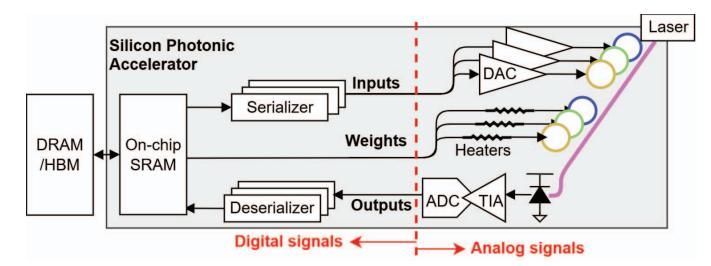
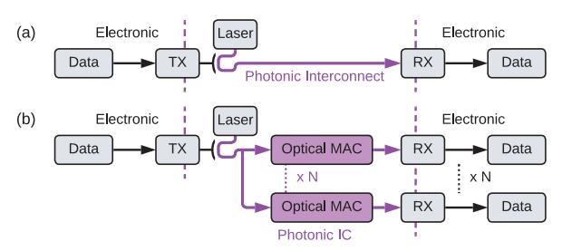
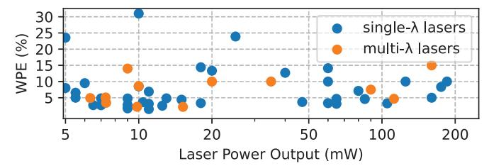

# Shining light on Silicon Photonic DNN Accelerators

Avilash Mukherjee

Electrical and Computer Engineering

University of British Columbia

Vancouver, Canada

avilash@ece.ubc.ca

Mieszko Lis

Electrical and Computer Engineering

University of British Columbia

Vancouver, Canada

mieszko@ece.ubc.ca

Sudip Shekhar

Electrical and Computer Engineering
University of British Columbia
Vancouver, Canada
sudip@ece.ubc.ca

Abstract—Silicon Photonic (SiPh) accelerators have been proposed as a promising alternative to digital DNN accelerators, offering improved energy-efficiency and performance by computing in the analog optical domain.

Achieving DNN accuracy through analog computing, however, fundamentally depends on maintaining analog signal integrity. Thus, analog signal integrity factors, such as nonlinearity, intersymbol interference (ISI), and optical losses in SiPh accelerators, must be thoroughly analyzed, yet their impact remains underexplored in prior works.

Addressing this glaring gap, we evaluate SiPh accelerators under the effects of nonlinearity, ISI, and system-level optical losses. We quantify the impact of each factor on DNN accuracy and characterize the additional energy required for compensation.

After accounting for this compensation energy, necessary to maintain DNN accuracy, SiPh accelerators consume  $>5\times$  energy/MAC compared to digital DNN accelerators under isoaccuracy and iso-throughput conditions.

Index Terms—photonic computing; silicon photonics; hardware acceleration; deep neural networks.

#### I. INTRODUCTION

Novel technologies like in-memory computing [1]–[3] and silicon photonics (SiPh) [4]–[19] have been proposed to accelerate DNN inference. DNN acceleration using SiPh seems promising due to its ability to leverage high clock frequencies (>25GHz) [20]–[22], multi-wavelength channels [23]–[26] and multi-level encoding, such as 4-level encoding ( $\equiv$  2-bit) [20], [27], [28], and 16-level encoding ( $\equiv$  4-bits) [27].

Most SiPh accelerators perform analog computation in the photonic domain [29]. In contrast to synchronous digital electronic computing, where signal integrity is enforced through binary voltage signals and setup/hold time margins [30], analog computation lacks such guarantees. Prior analog electronic accelerator proposals explicitly account for signal integrity as a critical factor [31], [32]. While some SiPh accelerators consider nonidealities such as device variation [13], [33] and phase errors [33], the impact of analog signal integrity on SiPh accelerators remains largely unexplored.

A SiPh accelerator contains circuits for data serialization to match the operating frequency of photonic circuits, conversion of the digital data to the photonic domain, computation in the photonic domain, conversion from photonic to the digital domain, and subsequent deserialization and storage in the on-chip

This work was supported by the Schmidt Sciences Polymath Program and Natural Sciences and Engineering Research Council of Canada.

Fig. 1. Overview of a SiPh accelerator. Electronic components interfacing with photonics cause challenges in maintaining analog signal integrity.

memory (Fig. 1). Analog signal integrity issues arise along the analog signal chain due to limitations in the electronics interfacing with the photonic components.

Key analog factors, such as nonlinearity [27], [34], [35], inter-symbol interference (ISI) [35], [36], and noise, each degrade the accuracy of SiPh accelerators. The impact of these factors on ImageNet [37] classification accuracy for ResNet50 [38] is shown in Fig. 2 – an accuracy drop of >10% relative to ideal 4-bit inference is observed when any factor remains unmitigated. Details of the accuracy evaluation, and variation, are described in Sec-III-C and Sec-IV, respectively.

Fig. 2. ImageNet accuracy of ResNet50 at 4-bit precision under the effect of different analog signal integrity factors - nonlinearity (NL), inter-symbol interference (ISI) and noise, in SiPh accelerators.

Analog signal integrity has been underexplored in prior SiPh accelerator designs. Table I summarizes the effects considered in prior works. For a practical SiPh accelerator, all the listed effects must be considered. To address this gap, we make the following contributions towards a comprehensive analysis of analog signal integrity in SiPh accelerators:

- 1) We analyze the impact of nonlinearities in SiPh accelerators (Sec-IV-A).
- We evaluate the ISI effects in SiPh accelerators (Sec-IV-B).
- 3) We identify and characterize a novel loss mechanism arising from photonic MAC operation (Sec-IV-C).
- 4) We characterize the additional energy required to mitigate analog signal integrity degradation, showing an

|                                                                         | [15]             | [14]             | [13] | [10] | [11]             | [6]              | [16]             | Ours |
|-------------------------------------------------------------------------|------------------|------------------|------|------|------------------|------------------|------------------|------|
| Nonlinearity in electronic-to-optical conversion (E/O) considered (Y/N) | Y                | N                | N    | N    | N                | N                | N                | Y    |
| Nonlinearity in optical-to-electronic conversion (O/E) considered (Y/N) | N                | N                | N    | N    | N                | N                | N                | Y    |
| ISI mitigation (Y/N)                                                    | N/A 1 | N                | N    | N    | N                | N                | N/A 1 | Y    |
| Photonic MAC loss considered (Y/N)                                      | N                | N                | N    | N    | N                | N                | N                | Y    |
| Laser efficiency considered (Y/N)                                       | N                | Y                | Y    | Y    | Y                | N                | Y                | Y    |
| Waveguide power limit met (Y/N)                                         | N                | N/R 2 | N    | Y    | N/R 2 | N/R 2 | Y                | Y    |
| Accuracy achieved (Y/N)                                                 | N                | N/R 2 | Y    | N    | N/R 2 | N/R 2 | N                | Y    |

&lt;sup>1 ISI mitigation not required since the clock frequency is low (Sec. II-F)

increase in total energy consumption (electronic and photonic) by  $>100\times$  relative to an iso-throughput ideal SiPh accelerator baseline (Sec. IV-I).

#### II. BACKGROUND

We begin by examining analog signal integrity challenges in a canonical SiPh communication link (Fig. 3(a)), and then extend the analysis to SiPh accelerators (Fig. 3(b)). Thereafter, we explain the building blocks of the SiPh accelerators, highlighting how each component affects the signal integrity.

Fig. 3. Block diagram for (a) a SiPh transceiver (transmitter (TX) and receiver (RX)) and (b) a SiPh accelerator, showing similar blocks for digital to optical (and vice-versa) conversion. The key difference lies in the parallelized MAC operations in the optical domain for SiPh accelerators.

#### A. Analog signal integrity in SiPh communication links

In the binary communication link depicted in Fig. 4(a), ① Binary data is encoded in the optical domain by modulating the light from a laser source. ② The light traverses the photonic interconnect, and ③ the incident light is converted to current via photodiode and then to a 1-bit digital data by the transimpedance amplifier (TIA).

Compared to a binary SiPh communication link, a multi-bit SiPh communication link (Fig. 4(c)) introduces the following signal integrity issues:

- TX nonlinearity: Modulators have nonlinear transfer function [28], [36], and modulator drivers introduce residual nonlinearity [20]. The multi-bit digital data must be linearly converted into equally spaced levels in the optical domain. Thus, additional nonlinearity compensation [20], [27], [39] is necessary (Sec-IV-F1).
- 2) **ISI**: Inter-symbol interference (ISI) [36], resulting from finite bandwidth-induced spreading, worsens for multibit encoding [35] (Sec-IV-B).
- 3) **RX nonlinearity**: Nonlinearities added by the TIA would result in incorrect bits on the ADC output. Thus,

- the photodiode current must be linearly converted to a voltage, requiring a linear TIA [40], [41] (Sec-II-C1).
- 4) **Increased laser power** is required for correct detection of multiple bits from the optical signal (Fig 4(b)).

Mitigation of the above issues has always been a significant overhead for multi-bit SiPh communication links [19]. Analog electronics alone consume >4pJ/bit [41]–[48] with additional energy overheads from digital signal processing [41] and laser power. Comparatively, binary SiPh communication links consume <2pJ/bit [21]–[25], [34], [49]–[51].

Analog signal integrity issues are further exacerbated for SiPh accelerators. ISI degrades photonic MAC outputs, since temporally spread waveforms from multiple analog signals are added at the output (Sec-IV-B). Independently, photonic MAC operations reduce the separation between the MAC output optical power levels compared to communication, due to the weighted sum of multiple analog signals (Sec-IV-C).

Fig. 4. (a) Schematic for a binary SiPh transceiver, where TX consists of binary driver and serializer, and RX consists of photodiode (PD), binary transimpedance amplifier (TIA) and deserializer; (c) Schematic for a multi-bit SiPh transceiver; (b) Normalized optical power levels for transmission with [i] 1-bit precision at laser power  $P_L$ , [ii] 2-bit precision at laser power  $P_L$ , and [iii] 2-bit precision at laser power for '1' is above the noise floor for [i] and [iii]. In the case [ii], the optical power level for '1' is below the noise floor and will not be detected correctly.

#### B. Digital to optical conversion circuits

1) Electro-Optical Modulator: Micro-ring modulators (MRMs) and Mach-Zehnder modulators (MZMs) are commonly used to encode data in the photonic domain. The electro-optical transfer function of an MRM and an MZM are given by a Lorentzian function (Eq. 1) and a raised-cosine function (Eq. 2), respectively, where Pout and Pin denote the input and output optical power, V is the applied voltage, Kring

[14], [11], and [6] do not report laser power; thus, waveguide limits (Sec. II-E) and accuracy (Sec. IV) cannot be inferred.

is the coupling coefficient, β is a parameter dependent on the wavelength and ring resonance, and Vπ is the voltage required for a phase shift of π in MZM. We refer readers to [28], [36] for details on Eq. 1 and Eq. 2.

$$P_{\text{out}} = P_{\text{in}} \left( 1 - \frac{K_{\text{ring}}}{1 + \beta V^2} \right) \tag{1}$$

$$P_{\text{out}} = \frac{P_{\text{in}}}{2} \left( 1 + \cos \left( \frac{\pi V}{V_{\pi}} \right) \right) \tag{2}$$

Both modulators exhibit an intrinsic nonlinear voltage response, referred to as static nonlinearity [20]. Static nonlinearity causes the modulator to produce unequally spaced optical power levels from equally spaced voltages. The degree of nonlinearity depends upon biasing, device parameters, and operating temperature [20], [28], [35], [36].

Modulators also introduce a large capacitance to the encoding circuits. Modulator capacitance (Cmod) of 100 fF and >1000 fF have been shown in SiPh transmitters with MRM [22], [34] and MZM [28], respectively. Cmod includes parasitic capacitances from the driver and interconnect (60 fF in [22]). Cmod and modulator parameters also vary with the applied voltage [20], [28], [35], causing dynamic nonlinearity. However, dynamic nonlinearity has been primarily analyzed for TXs operating at frequencies >25 GHz [35], [52].

*2) Transmitter Electronics:* Modulator drivers must generate large voltage swings (Vswing) to achieve a high extinction ratio (ER), defined as the ratio of the maximum to the minimum optical power through the modulator. Vswing is typically larger than supply voltages in CMOS processes. CMOS-based drivers can generate Vswing upto 4 V for ∼12 dB ER [50], while BiCMOS implementations generate Vswing >6 V [53].

Multi-bit drivers using segmented driver/modulator to generate intermediate optical power levels [20], [27], [34], [54]. Mismatch across the segments due to process variations introduces residual nonlinearity.

## *C. Optical to digital conversion circuits*

A photodiode (PD) converts optical power (W) to current (A). Responsivity (R, in A/W) determines the magnitude of current generated (Ipd) by the incident optical power. PD also performs wavelength-domain accumulation by adding the optical power across the wavelengths into a current [6].

A trans-impedance amplifier (TIA) converts the PD current into a voltage. For 1-bit detection, inverter-based TIAs are commonly used [21], [22], [55] due to their low energy consumption (75fJ/b [22]). In contrast, multi-bit detection requires linear current-to-voltage conversion, necessitating linear TIAs [40], [47], [48], [56]–[60].

We analyze the impact of noise at the TIA input, since optical signals get significantly attenuated before reaching the TIA (Sec III-B), making TIA noise (In, rms) the dominant factor affecting signal-to-noise ratio (SNR). The minimum optical power (Pmin) at the PD to achieve a target SNR is derived from In, rms and R (Eq. 3).

For example, obtaining a 10−12 error rate from a binary transmission requires an SNR of 7. A TIA with 2 μA In, rms and R of 1 A/W therefore requires the optical power when '1' is transmitted to exceed 28 μW or -15.5 dBm.

$$P_{\min} = \frac{2 \times SNR \times I_{n,rms}}{R}$$
 (3)

- *1) Linear TIAs:* Linear TIAs have a limited linear input current range; exceeding this range introduces distortions in the output voltage. This distortion is typically quantified as a percentage nonlinearity. The following conditions must be satisfied for multi-bit detection [41]:
  - Noise-free condition: The number of resolvable levels within the linear current range must exceed 2n.
  - Distortion-free condition: The distortion must be less than half the least significant bit, i.e. < (1/2n+1)%.

For example, a linear TIA [48] with an input-referred noise of 2.7 μA and a linear range of 330 μA with < 5% distortion provides 8.73 noise-free levels for a 10−12 error rate, corresponding to 3-bit detection. The reported distortion also satisfies the 3-bit requirement (<6.25%).

We plot the energy per conversion against the achievable bit precision for TIAs [40], [41], [46]–[48], [56]–[61] in Fig. 5. Fig 5 shows that higher linearity is typically achieved using implementations in the SiGe process. Achieving 4-bit detection can consume significantly higher energy (1.52pJ) [58] compared to a binary detection (75fJ) [22].

Fig. 5. Scatterplot of energy/conversion versus bit-precision in linear TIAs. Linear TIAs can achieve >3-bit detection, with TIAs in SiGe process achieving 5-bit precision [40], [41], [46]–[48], [56]–[61].

#### *D. Laser*

Lasers serve as the optical source for SiPh circuits. Lasers in C/L/O wavelength bands (C-band: 1530-1565nm, Lband:1565-1625nm, O-band:1260-1360nm) typically have 10- 15% wall-plug efficiency (WPE) [19]. Fig. 6 shows similar WPE trends across lasers reported over the past two decades. While higher WPE (23.9%, 31%) has been demonstrated [62], these results are limited to a single-λ lasers.

Multi-λ laser sources, required for SiPh accelerators [10], [13], [15], are realized either by a comb laser providing multiple-λ [26], or multiplexing multiple single-λ lasers [63]. While comb lasers may offer a larger number of λs and lower losses, their demonstrated WPE remains low [26]. As a result, multiplexing multiple lasers is currently the more practical approach [19], with demonstrations on 8-λ at 20mW/λ [63], and projected integration to higher λs [64].

Fig. 6. Scatterplot of laser wall-plug efficiency (WPE) vs optical power output for lasers in C/L/O-λ bands. For the lasers providing multiple-λ, the total laser power output across all λ is shown.

## *E. Waveguides*

The most commonly used waveguides are silicon and silicon nitride [65] waveguides. Nonlinear effects emerge in both waveguides beyond a certain optical power [66]. Silicon waveguide measurements [67] and simulations [68] show that silicon waveguides are significantly nonlinear after 30mW of optical power. Similarly, silicon nitride waveguides are nonlinear after 120mW of optical power [69].

#### *F. Eye Diagrams*

Analog signal integrity effects are easily visualized using eye diagrams [70], which overlay transient waveforms within a single window of the clock cycle, also referred to as the unit interval (UI). Eye diagrams show - (a) the effective eye height and (b) clear eye width, free of signal transitions.

The eye diagram in Fig. 7(a) shows a binary encoding with eye height 0.8× of the ideal separation, representing a loss of 0.97dB, and an eye width of about 0.9UI. For correct detection, the eye height should be higher than the noise-free level (Sec. II-C). In Fig. 7(b), the middle eye is the most affected by ISI due to increased signal transitions. The eye height is 0.6× the ideal separation (2.2dB loss) due to ISI.

Ample eye width is also required to mitigate timing noise, which introduces uncertainty during signal sampling. In SiPh links, a minimum eye width (twidth) is specified to achieve a target error rate and mitigate timing noise. The minimum eye width is calculated by Eq. 4, where tn, rms represents the rms value of the timing noise, and Qerror-rate is the value of the tail distribution for a Gaussian distribution at a given error rate [71]. As an example, a 2psrms timing noise at 10−12 error rate would require an eye width of more than 28ps. In Fig. 7(a) and (b), the eye width is 180ps and 84ps, respectively.

$$t_{width} = 2 \times Q_{error-rate} \times t_{n,rms}$$
 (4)

Fig. 7. Eye diagrams for (a) binary and (b) 2-bit encoding at 5 GHz with a driver with 5 GHz -3dB bandwidth. The effect of ISI is visible in (a) with reduced eye height and eye width. ISI effects are much more prominent in (b) with reduced eye height and width in the middle eye.

#### III. METHODS

