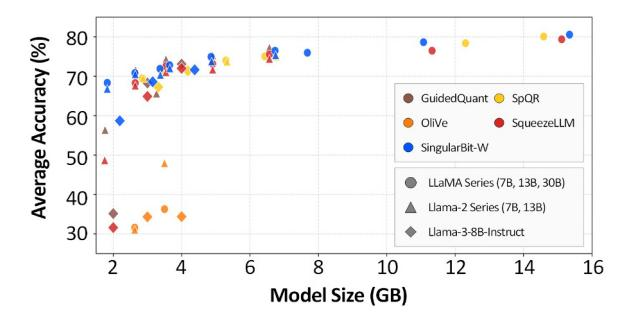
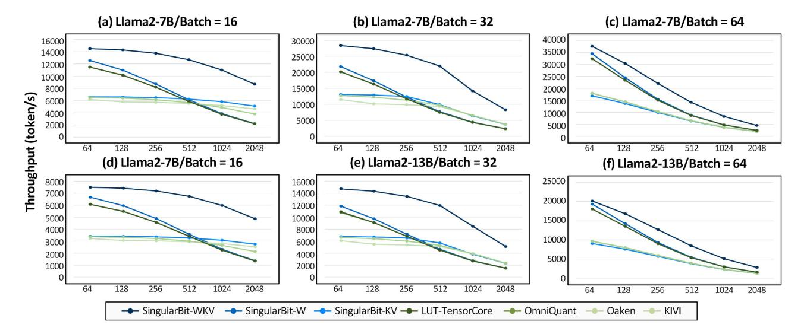
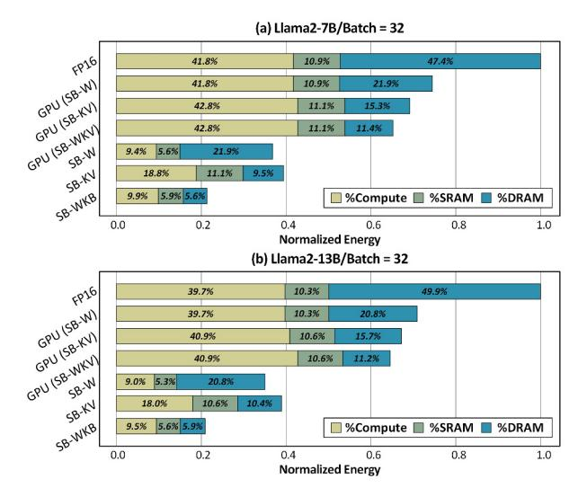
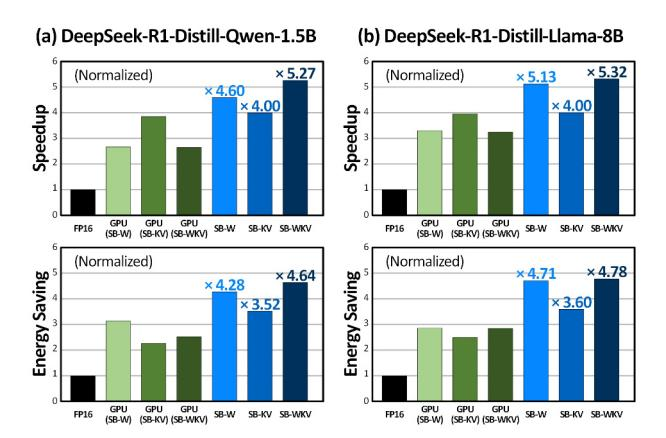

# *B. Algorithmic Performance*

We evaluate the algorithmic effectiveness of SingularBit-W and SingularBit-KV against state-of-the-art compression baselines. For weight compression, we assess SingularBit-W using perplexity and zero-shot accuracy, highlighting its robustness in the ultra-low-bit regime. For KV-cache compression, we evaluate SingularBit-KV on generation quality and multi-step reasoning under aggressive compression.

Ultra-Low-Bit Effectiveness. Table II compares perplexity at 2-bit precision, with all measurements using a context window of 2,048 tokens. Conventional methods such as RTN, GPTQ, and AWQ suffer severe perplexity degradation at this precision, whereas SingularBit-W maintains stable performance across all evaluated settings. SingularBit-W also outperforms specialized low-bit methods, including OmniQuant and MagR+OPTQ, achieving the best perplexity with margins ranging from 0.14 to 2.63. These gains are consistent across model families, model sizes, and benchmarks, demonstrating the generality of our approach. We attribute this advantage to the synergy between SVD and mixed-precision quantization, which preserves critical spectral components while reducing quantization error at extremely low average bitwidths.

Language Modeling. Figure 11 shows Wikitext-2 perplexity versus total model size, where each method is evaluated at multiple compression levels, including 2-, 3-, and 4 bit settings. SingularBit-W consistently achieves the lowest

Fig. 11: Wikitext-2 perplexity versus compressed model size for weight quantization baselines.

Fig. 12: Zero-shot commonsense reasoning accuracy versus compressed model size for weight quantization baselines.

perplexity across model sizes, forming a Pareto frontier. In the smallest model-size range, aggressive compression causes several baselines, such as SqueezeLLM and OliVe, to collapse, whereas SingularBit-W maintains stable perplexity. Even compared with strong baselines such as GuidedQuant and SpQR, SingularBit-W achieves comparable or better results across all settings.

Multiple Choice Reasoning. Figure 12 further supports these findings by reporting zero-shot commonsense reasoning accuracy under the same model-size and compression settings. SingularBit-W achieves the highest accuracy in nearly all configurations, with larger gains in smaller models and ultra-lowbit regimes. The consistent improvement in both perplexity and zero-shot accuracy shows that SingularBit-W preserves overall model quality rather than improving language modeling metrics alone.

Generation Quality. Table III evaluates the generation quality of SingularBit-KV on CoQA and TruthfulQA using Llama-3-8B-Instruct at 2-bit and 3-bit precision. Although each method targets a nominal bitwidth, the effective compression ratio differs across methods due to heterogeneous precision allocation. SingularBit-KV achieves the best accuracy across all bitwidth and benchmark combinations. Existing methods such as KVQuant, PALU, and ReCalKV suffer significant accuracy degradation at 2-bit precision, whereas SingularBit-KV remains robust, with only a 2.0% drop on CoQA and a 0.5% drop on TruthfulQA relative to the FP16 baseline. Compared with ZipCache, SingularBit-KV consistently delivers higher accuracy while maintaining a higher

TABLE III: Accuracy (%) and compression ratio (%) comparison on CoQA and TruthfulQA for Llama-3-8B-Instruct.

|                | CoQA |      |      |      | TruthfulQA |      |      |      |  |  |
|----------------|------|------|------|------|------------|------|------|------|--|--|
| Precision      | KV3  |      | KV2  |      | KV3        |      | KV2  |      |  |  |
| Method         | Acc  | CR   | Acc  | CR   | Acc        | CR   | Acc  | CR   |  |  |
| FP16           |      |      | 63.5 |      | 60.0       |      |      |      |  |  |
| GEAR           | 63.7 | 78.1 | 59.6 | 84.2 | 58.5       | 78.1 | 54.0 | 84.2 |  |  |
| KVQuant        | 58.8 | 80.4 | 20.6 | 86.6 | 49.0       | 80.4 | 24.5 | 86.6 |  |  |
| PALU           | 22.4 | 85.9 | 2.2  | 90.6 | 42.0       | 85.9 | 9.0  | 90.6 |  |  |
| ReCalKV        | 62.6 | 60.0 | 36.5 | 70.0 | 47.0       | 60.0 | 40.0 | 70.0 |  |  |
| ZipCache       | 63.5 | 80.9 | 56.4 | 86.9 | 60.0       | 80.9 | 52.0 | 86.9 |  |  |
| SingularBit-KV | 67.6 | 83.1 | 61.5 | 86.8 | 60.0       | 81.2 | 59.5 | 84.5 |  |  |

compression ratio in most configurations, yielding a better accuracy-compression trade-off.

CoT Reasoning. Table IV shows the robustness of SingularBit-KV on GSM8K, a mathematical reasoning benchmark that requires multi-step chain-of-thought generation. At 2-bit precision, most competing methods, including KVQuant, PALU, and ZipCache, suffer severe accuracy degradation, dropping to the 0–30% range and losing much of their reasoning capability. In contrast, SingularBit-KV maintains performance close to the FP16 baseline, including on the DeepSeek-R1-Distill series. This robustness comes from its joint consideration of token importance and rank significance, which preserves critical contextual information throughout extended decoding under aggressive compression.

#### *C. Hardware Performance*

We evaluate the system-level performance of Singular-Bit in terms of throughput and energy efficiency under an iso-resource constraint. We consider three configurations: SingularBit-W, SingularBit-KV, and SingularBit-WKV. For throughput, we sweep sequence lengths, batch sizes, and model sizes to show that SingularBit-WKV mitigates the dual memory wall across diverse inference scenarios. For energy efficiency, we evaluate the SingularBit algorithms on both a GPU and the SingularBit accelerator to separate algorithmic gains from hardware specialization. We further analyze speedup and energy savings on reasoning workloads.

Hardware Throughput Analysis. Figure 13 reports throughput in tokens per second across varying sequence lengths and batch sizes for LLaMA2-7B and LLaMA2-13B. To ensure an iso-accuracy comparison, we match the compression ratio of SingularBit-W to competing weight-compression methods by adjusting the rank ratio, and select SingularBit-KV operating points that incur less than a 1% accuracy drop on CoQA and TruthfulQA.

The results show that SingularBit-WKV effectively addresses the dual memory wall that limits existing approaches. Weight-compression methods such as OmniQuant and LUT-TensorCore perform well at short sequence lengths but lose efficiency as the KV cache grows. In contrast, KV-compression methods such as KIVI and Oaken improve throughput at long sequence lengths but remain limited by weight memory traffic at shorter sequences. SingularBit-WKV compresses both

TABLE IV: Accuracy and compression ratio (%) comparison on GSM8K across Llama-3 and DeepSeek-R1-Distill models.

|                |            |      | Llama-3-8B-Instruct |      |      |      | R1-Distill-Qwen-1.5B |      | R1-Distill-Llama-8B |      |      |      |
|----------------|------------|------|---------------------|------|------|------|----------------------|------|---------------------|------|------|------|
| Precision      | KV3 KV2 |      |                     | KV3  |      |      | KV2                  |      | KV3                 |      | KV2  |      |
| Method         | Acc        | CR   | Acc                 | CR   | Acc  | CR   | Acc                  | CR   | Acc                 | CR   | Acc  | CR   |
| FP16           | 0.77       |      |                     | 0.85 |      |      |                      | 0.82 |                     |      |      |      |
| GEAR           | 0.77       | 78.1 | 0.66                | 84.2 | 0.80 | 78.1 | 0.55                 | 84.2 | 0.80                | 78.1 | 0.74 | 84.2 |
| KVQuant        | 0.81       | 80.4 | 0.36                | 86.6 | 0.77 | 80.4 | 0.24                 | 86.6 | 0.70                | 80.4 | 0.04 | 86.6 |
| PALU           | 0.43       | 85.9 | 0.03                | 90.6 | 0.29 | 85.9 | 0.03                 | 90.6 | 0.34                | 85.9 | 0.00 | 90.6 |
| ReCalKV        | 0.69       | 60.0 | 0.36                | 70.0 | 0.65 | 60.0 | 0.34                 | 70.0 | 0.58                | 60.0 | 0.26 | 70.0 |
| ZipCache       | 0.73       | 80.9 | 0.72                | 86.9 | 0.03 | 80.9 | 0.00                 | 86.9 | 0.88                | 80.9 | 0.00 | 86.6 |
| SingularBit-KV | 0.82       | 81.1 | 0.81                | 85.1 | 0.81 | 79.1 | 0.85                 | 84.4 | 0.80                | 82.1 | 0.82 | 86.0 |

Fig. 13: Throughput comparison across sequence lengths and batch sizes.

sources of memory traffic, maintaining high throughput across the full sequence-length range. Individually, SingularBit-W outperforms weight-compression baselines through rank-aware mixed precision, while SingularBit-KV surpasses KIVI and Oaken at long sequences where KV cache traffic dominates. These gains remain consistent across model sizes, from 7B to 13B, and batch sizes, from 16 to 64, demonstrating robust scalability.

System Energy Analysis. Figure 14 presents a system energy breakdown across on-chip computation, on-chip SRAM, and off-chip DRAM. We evaluate both GPU and SingularBit accelerator execution to distinguish algorithmic benefits from hardware specialization. Even without specialized hardware, the compression algorithms reduce system energy by 25.5– 29.1% for weight compression, 30.8–32.8% for KV compression, and 34.7–37.3% for combined compression. However, the GPU cannot fully exploit these reductions because it lacks native support for fine-grained KV compression and rank-wise mixed-precision execution.

The SingularBit accelerator closes this gap through two specialized units. The SingularBit Tensor Core operates directly on reduced bitwidth values without dequantization, reducing both computation and on-chip SRAM access. It further employs a LUT-based structure that precomputes group scaling factor multiplications and channel-wise accumulations across four inputs, reusing the results across PE lines to minimize arithmetic energy. The SingularBit Compression Engine supports fine-grained precision selection, quantization, and bit packing in dedicated hardware, avoiding the formatconversion and data-movement overheads incurred by GPUbased implementations. Together, these units fully realize the algorithmic benefits, delivering 78.6% (7B) and 79.1% (13B) total system energy reduction compared to the FP16 baseline.

Reasoning Performance. Figure 15 evaluates end-to-end speedup and energy savings on decode-heavy reasoning tasks for DeepSeek-R1-Distill-Qwen-1.5B and DeepSeek-R1- Distill-LLaMA-8B, comparing GPU and accelerator execution across SingularBit-W, SingularBit-KV, and SingularBit-WKV configurations. Even on a GPU, the compression algorithms alone achieve 4.00× speedup on both models using 3-bit average weight precision and 78.18% KV compression, demonstrating the substantial contribution of our algorithmic design. The SingularBit accelerator further amplifies these gains: SingularBit-WKV achieves 5.27× speedup and 4.64×

Fig. 14: System energy breakdown for Llama2-7B and Llama2-13B, comparing GPU execution with SingularBit accelerator execution to separate algorithmic and hardware gains.

Fig. 15: End-to-end speedup and energy savings on decodeheavy reasoning workloads.

energy savings on Qwen-1.5B, and 5.32× speedup and 4.78× energy savings on LLaMA-8B. These consistent gains across both models show that SingularBit provides robust hardware efficiency regardless of model architecture. The performance gap between GPU and accelerator execution highlights that, while the algorithm reduces memory traffic, the SingularBit accelerator is necessary to fully exploit these savings by natively supporting rank-wise mixed-precision execution and fine-grained KV compression.

#### *D. Overhead Analysis*

We analyze four potential sources of overhead in the SingularBit accelerator: online SVD, KV compression, KV reconstruction, and mixed-precision control.

No Online SVD Overhead. A possible misunderstanding is that SingularBit-KV performs an online SVD step to compress the KV cache. This is not the case. SVD is applied only once offline to the weight tensors, and no decomposition is performed during inference. At runtime, KV generation computes only xUWK and xUWV , denoted as K' and V'. The runtime compression path consists only of token- and rank-aware mixed-precision quantization and packing on K' and V'.

Compression Engine Overhead. The SingularBit compression engine supports online KV compression using the attention map, rank metadata, and K' and V' activations as input. It determines token- and rank-aware precision and bitpacks the quantized values into the compressed KV format. These functions require additional control, quantization, and packing logic. As shown in Table VII, the compressor occupies 21.5 mW (23.3%) and 1.23 mm2 (27.9%) within the compression engine. Since one compression engine is shared across at least eight SingularBit tensor cores, the chip-level overhead remains below 4% in both area and power. Compression also proceeds in parallel with the post-attention computation and finishes before the next attention layer begins KV compression across all evaluated configurations. Therefore, it is not on the critical path and does not increase end-to-end latency.

KV Reconstruction Overhead. The main runtime overhead of SingularBit-KV comes from the additional VT recomputation during decoding. Because the stored cache contains only K' and V', the original K and V tensors must be reconstructed before attention. This reconstruction is executed on the SingularBit tensor core and increases latency by 5% at context length 64 and by 2% at context length 2,048. In contrast, SingularBit-KV reduces KV-related DRAM traffic by approximately 5×, while SingularBit-WKV reduces total DRAM traffic by up to 8.5×. As a result, the added VT recomputation cost remains smaller than the performance and energy gains obtained from reducing off-chip memory accesses.

Mixed-Precision Control Overhead. The last overhead concerns the control logic required to support rank-wise mixed-precision execution in the SingularBit Tensor Core. As shown in Table VII, the total control logic per Tensor Core occupies only 0.09 mm2 (1.6% of area) and consumes 23.4 mW (7.6% of power). These numbers include the entire Tensor Core control path, including standard matmul orchestration, rather than only the additional logic for mixed-precision scheduling. Therefore, the overhead attributable specifically to rank-wise mixed-precision support is smaller still.

