# Symbiotic MLLM Serving: Dynamically Balancing Parallelism Across GPUs and Resources Within GPUs

Zhicheng Li<sup>1,2</sup>, Jiacheng Zhao<sup>1,2,\*</sup>, Yangyu Zhang<sup>1,2</sup>, Zhaolin Duan<sup>3</sup>, Xinyu Liu<sup>1,2</sup>, Siqi Li<sup>4</sup> Shuoming Zhang<sup>1,2</sup>, Shuaijiang Li<sup>1,2</sup>, Donglin Yu<sup>5</sup>, Yuan Wen<sup>6</sup>, Chunwei Xia<sup>7</sup>, Xiyu Shi<sup>1</sup>, Huimin Cui<sup>1,2,8</sup>

<sup>1</sup>State Key Lab of Processors, Institute of Computing Technology, Chinese Academy of Sciences, China

<sup>2</sup>University of Chinese Academy of Sciences, China

<sup>3</sup>Tianjin University, China

<sup>4</sup>Beijing University of Technology, China

<sup>5</sup>University of Illinois Urbana-Champaign, United States

<sup>6</sup>University of Aberdeen, United Kingdom

<sup>8</sup>XCORESIGMA CO.,LTD.

{lizhicheng21s, zhaojiacheng, zhangyangyu19b, zhangshuoming21s}@ict.ac.cn {lishuaijiang19b, shixiyu, cuihm}@ict.ac.cn, liuxinyu25@mails.ucas.ac.cn duanzhaol@tju.edu.cn, lisiqi7@emails.bjut.edu.cn, donglin5@illinois.edu ywen2@ed.ac.uk, C.Xia@leeds.ac.uk

Abstract—Multimodal Large Language Models (MLLMs) present a key serving challenge. Existing systems usually extend text-only LLM stacks. They either co-locate the vision encoder with the decoder on the same GPUs or move it to a fixed GPU pool. Both choices rely on ahead-of-time, static decisions for parallelism and GPU allocation. They ignore a key asymmetry in MLLMs: the encoder has a small memory footprint but input-dependent, often quadratic, compute cost, while the decoder is both memory- and compute-intensive. With mixed high-and low-resolution requests, this leads to interference between encoder and decoder, persistent SM and HBM slack, poor GPU utilization, and frequent SLO violations.

In this paper, we propose RESONATOR, an efficient MLLM serving system that uses fine-grained runtime scheduling along two axes. First, an intra-GPU sharing engine manages SM and HBM sharing between encoder and decoder. It exploits stagelevel complementarity and kernel-level slack to run computebound encoder kernels and memory-bound LLM kernels in a work-conserving way on the same GPU. Second, an inter-GPU parallelism engine selects the encoder's data-parallel and tensor-parallel plan at runtime based on input resolution, batch composition, and a lightweight Performance Atlas, and switches plans with near-zero overhead. Evaluation on three state-of-theart MLLMs against strong baselines shows that RESONATOR improves mean TTFT by up to  $5.1\times$ , TPOT by up to  $3.0\times$ , mean end-to-end latency by up to  $4.9\times$ , and overall throughput by up to  $3.4\times$ , while adapting efficiently to highly concurrent and dynamic workloads.

#### I. INTRODUCTION

Multimodal Large Language Models (MLLMs), such as GPT-4-omni [1], Gemini [2], Qwen2-VL [3], [4], and Kimi-VL [5], are now widely deployed in practice. They support tasks such as chart understanding [6], video analysis [7], and image-grounded QA [8]. Most MLLMs follow a modular design: modality-specific encoders (for images [9] or audio [10])

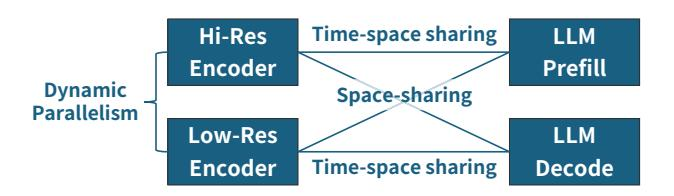

Fig. 1. Desired control space for MLLM serving. High- and low-resolution encoders use dynamic parallelism, and share GPUs with LLM prefill and LLM decode through time-space sharing and space-sharing.

produce token sequences, and a text-centric decoder then generates responses. This design creates a clear asymmetry. The vision encoder has a small memory footprint but its compute cost depends strongly on input size (e.g., image resolution), often with quadratic scaling in sequence length. In contrast, the language model processes a shorter, merged sequence and shows more stable memory and compute cost during prefill and decoding.

Efficient serving of large language models is an active topic [11]–[14]. Orthogonal to kernel-level optimizations such as FlashAttention [15], FlashInfer [16], Liger [17], and Marlin [18], recent systems focus on runtime scheduling. Two lines of work dominate. First, resource disaggregation separates prefill and decode to meet SLOs at scale [19]–[21]. Second, systems expand the parallelism design space, combining data and tensor parallelism [22] with pipeline and expert parallelism for MoE models [23], [24]. However, these systems still rely on ahead-of-time (AoT) decisions: the parallelism plan (DP/TP/PP/EP degrees) is fixed at deployment time and stays static, and GPU allocations (which GPUs, MIG slices, or SM budgets) are also pinned. This design matches text-only LLMs with a single heavy decoder, but it does not respect the distinct behavior of MLLM encoders.

<sup>\*</sup>Corresponding author.

Figure 1 sketches what a serving system *should* control. High-resolution and low-resolution encoders need different parallel plans, and they should share GPUs with LLM prefill and decode in both time and space. Existing stacks do not expose this control space. They either bolt the encoder onto the decoder GPUs or move it to a fixed pool of encoder-only GPUs. Both choices lead to poor GPU utilization and fragile SLOs when the request mix changes.

When we extend a strong text-only serving stack (built on vLLM-style designs) to support images, the vision encoder harms both time-to-first-token (TTFT) and tokens-per-second (TPOT). The encoder enters the prefill critical path and competes with prefill and decoding for SM and HBM resources on the same GPUs. Naive fixes perform poorly: dedicating separate GPUs to the encoder wastes capacity for small or textonly requests, while static SM or MIG quotas cannot adapt to different resolutions and workloads. A better serving system needs to treat the encoder as a first-class, dynamic workload, not as a fixed pre-processing or post-processing step.

We analyze MLLM workloads at both stage and kernel level. At stage level, encoder and LLM phases stress different resources: the encoder is mostly compute-bound with low HBM utilization, while prefill and decoding show higher HBM pressure and moderate SM use. At kernel level, even computeheavy stages still leave many SM and HBM vacuoles; kernels show diverse profiles, from SM-bound to bandwidth-bound and low-occupancy. This slack suggests that a single GPU can host both encoder and LLM if the system shares SMs and HBM at fine granularity and respects kernel behavior. Space sharing and time-space sharing become natural tools.

We also study encoder performance across image resolutions and tensor-parallel (TP) degrees. For small images, one GPU often gives the best efficiency; large TP groups underutilize GPUs. For high-resolution images, multi-GPU TP is necessary to keep latency under SLOs. Real workloads mix both types. No single static TP degree works well for all requests. The optimal parallel plan for the encoder depends on the current request mix, batch composition, and GPU budget. This motivates *inter-GPU dynamic parallelism*: the serving system must select the encoder's DP/TP plan at runtime rather than fixing it ahead of time.

We design RESONATOR, a serving runtime that turns the encoder from a source of interference into a cooperative partner for the LLM. RESONATOR decouples the vision encoder from the decoder in the software stack, and then re-couples them through two levels of runtime control: (i) an *intra-GPU sharing engine* that manages SM and HBM sharing between encoder and LLM. (ii) an *inter-GPU dynamic parallelism* that selects the encoder's DP/TP plan per batch based on a *Performance Atlas*. Figure 8 illustrates this design space.

This paper makes the following contributions:

• We analyze modern MLLM serving under strong text-only designs and show that AoT parallelism planning and static resource allocation cause encoder-induced SLO violations and poor GPU utilization. We reveal two key properties: (i) the encoder and LLM exhibit complementary resource

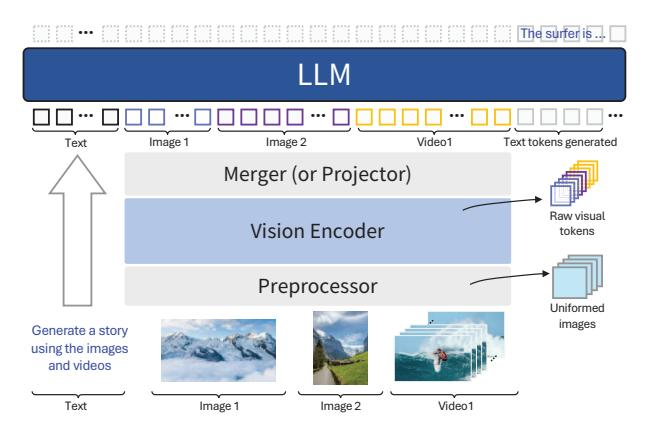

Fig. 2. Architecture of a typical MLLM. The model consists of four main components: Preprocessor, Vision Encoder, Merger, and Large Language Model (LLM).

footprints with stage-level and kernel-level slack, and (ii) the optimal encoder parallel plan is request dependent, varying with image resolution and workload mix.

- We present RESONATOR, a symbiotic MLLM serving runtime with two runtime mechanisms: an intra-GPU sharing engine that performs dual-mode scheduling to exploit finegrained slack, and an inter-GPU parallelism engine that uses a unified Performance Atlas and zero-overhead plan switching to adapt the encoder DP/TP to real-world workloads.
- We implement RESONATOR on top of a production-style serving stack and evaluate it on state-of-the-art MLLMs including Qwen2-VL [3], [4] and Kimi-VL [5]. Compared to strong baselines built on vLLM- and SGLang-like systems, RESONATOR improves TTFT, TPOT, and end-to-end throughput under diverse mixed-resolution workloads while using the same GPU budget.

### II. BACKGROUND AND MOTIVATION

#### *A. Multi-modal Large Language Model Inference*

Multimodal Large Language Models (MLLMs) integrate advanced visual understanding with text-centric foundation models, enabling tasks like visual question answering and agentic interactions. Their architecture combines powerful vision encoders with large language model (LLM) backbones. To understand the systems challenges of MLLMs, we break down their inference pipeline into four key stages, as shown in Figure 2: preprocessor, vision encoder, merger, and LLM.

Preprocessor: This CPU-intensive stage transforms raw images into a format suitable for the vision encoder through operations such as resizing, normalization, and partitioning into uniform tiles or patches. Modern MLLMs use dynamic resolution strategies to preserve image detail, resulting in a variable number of tiles based on input resolution.

Vision Encoder: Typically a Vision Transformer (ViT) [9]. This module converts processed image tiles into a sequence of high-dimensional embeddings, called raw visual tokens (nraw). The sequence length depends on the input's resolution and encoder architecture, and can grow significantly for highresolution images.

| Image size         | Params (prefill / enc / dec) | Prefill |      | Encoder |      |      | Decoding |      |      |      |
|--------------------|------------------------------|---------|------|---------|------|------|----------|------|------|------|
|                    |                              | SMs     | HBM  | Warp    | SMs  | HBM  | Warp     | SMs  | HBM  | Warp |
| $225 \times 225$   | 7B / 675M / 7B               | 82.4    | 45.2 | 11.0    | 9.4  | 3.1  | 2.1      | 76.8 | 67.6 | 8.3  |
| $1024 \times 1024$ | 7B / 675M / 7B               | 80.5    | 27.5 | 17.5    | 78.0 | 25.3 | 31.1     | 75.0 | 70.2 | 6.5  |
| $3000\times3000$   | 7B / 675M / 7B               | 92.7    | 26.8 | 19.0    | 98.9 | 34.2 | 47.3     | 77.1 | 77.5 | 7.6  |
| TABLE I            |                              |         |      |         |      |      |          |      |      |      |

GPU SM ACTIVITY(SMS), HBM BANDWIDTH (HBM), AND SM WARP OCCUPANCY (WARP) FOR PREFILL, ENCODER, AND DECODING ON OWEN2-VL-7B AT LOW, MEDIUM, AND HIGH IMAGE RESOLUTIONS.

**Merger (or Projector):** This lightweight component [25] bridges vision and language modalities by summarizing the long sequence of raw visual tokens  $(n_{raw})$  into a much shorter sequence  $(n_{final})$ , where  $n_{final} \ll n_{raw}$ . This reduces the computational load for the LLM's prefill phase, which scales at quadratic complexity. However, it does not alleviate the vision encoder's heavy workload, which must process all  $n_{raw}$ 

Large Language Model (LLM): The LLM, as the final stage, processes a combined sequence of the user's text prompt and summarized visual tokens. It performs a prefill operation to compute the KV cache, followed by autoregressive decoding to generate the text output.

#### B. Motivation

The problem in MLLM serving: encoder degrades SLOs: Traditional LLM serving systems are designed for text-only models. They use a static parallel plan before deployment and a fixed split of GPU resources between stages. This design works well when almost all work happens in a single decoder. Multimodal LLMs change this picture. The vision encoder adds a new source of latency and a new pattern of GPU use.

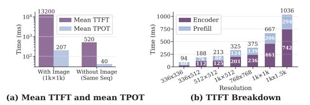

Fig. 3. End-to-end breakdown for Qwen2-VL-7B across different image resolutions. The vision encoder's latency contribution increases with resolution, establishing it as the dominant performance bottleneck in the prefill stage.

We first measure how the vision encoder affects SLOs and GPU usage in MLLM serving.

We run Qwen2-VL-7B on a single NVIDIA A100. We compare two workloads with the same arrival rate of ten requests per second. The first workload uses image requests with  $1k \times 1k$  inputs. The second workload uses text-only prompts. The decoder input length for the text-only prompts is similar to the sequences that the images produce. All other serving settings are the same.

Figure 3 shows a modern MLLM serving system that runs a vision encoder, prefill, and decoding on the same GPU. When the encoder runs on the LLM GPU, both *time-to-first-token* (TTFT) and *tokens-per-second* (TPOT) get worse. SLO violations increase, even when the LLM itself has enough compute. The reason is simple: the encoder enters the critical path and competes for SMs and HBM with prefill and decoding. A

naive solution, such as placing the encoder on a separate GPU or using fixed SM quotas, raises cost or underutilizes hardware. We need a more careful way to share resources between encoder and LLM.

## Challenge 1: Stage-level and kernel-level slack enables intra-GPU sharing:

Stage-level view: encoder and LLM stress different resources: Table I reports average SM and HBM utilization for encoder, prefill, and decoding. The encoder uses high SM utilization but low HBM utilization. Prefill and decoding use much higher HBM utilization but only moderate SM utilization. So encoder and LLM do not stress the same resource at the same time. One stage is mostly compute-bound, while the others are more memory-bound. This mismatch suggests that a single GPU can host both encoder and LLM. If we manage SMs and HBM carefully, the two stages can help fill each other's idle gaps instead of blocking each other.

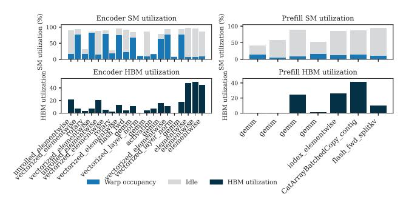

Fig. 4. SM and HBM utilization of major encoder and prefill kernels on the baseline system listed in execution order (image resolution:  $1k \times 1k$ ).

Kernel-level view: slack inside compute-intensive stages: Stage averages hide fine-grained slack. Figure 4 breaks encoder and prefill into individual kernels. The top row shows SM utilization per kernel. Grey bars mark the SM capacity; blue bars show the actual SM utilization. Even inside encoder, which looks compute-intensive at the stage level, many kernels use only a small fraction of SMs and leave large vacuoles. The bottom row shows HBM utilization per kernel. Some kernels are clearly compute-bound and use little bandwidth. Others are bandwidth-bound or have low warp occupancy.

These patterns give two key insights:

- There is still a lot of slack inside encoder and prefill. Even when both stages look heavy, many kernels do not saturate SMs or HBM.
- Kernels have different resource profiles. Some are SMbound, some are bandwidth-bound, and some are lowoccupancy.

A single global stream or a single static SM partition cannot exploit this slack. We need per-kernel scheduling. When a

kernel is compute-bound, it should run in a *wide* stream that sees most SMs. When a kernel is bandwidth-bound or lowoccupancy, it can run in a *narrow* stream that uses only a small SM slice. In this way, encoder and LLM kernels can share SMs and HBM at fine granularity and fill each other's vacuoles. This motivates our intra-GPU sharing design and per-kernel scheduling strategy.

*Challenge 2: Request-dependent optimal parallel plan for the encoder:* We now study how the best encoder parallel plan changes with the request.

Fig. 5. Encoder latency for different image resolutions and parallelism strategies on four A100 GPUs. The optimal strategy shifts from a single GPU in the low-resolution range to 4-GPU tensor parallelism in the high-resolution range.

There is a significant gap between the parameters of the encoder and the LLM. This size gap means that the encoder has more flexible parallelism choices. It can run in pure data parallel form on several GPUs or in tensor parallel form across GPUs without hitting memory limits. This makes the encoder a natural target for dynamic inter-GPU parallelism.

We run the Qwen2-VL-7B encoder on 4 NVIDIA A100 GPUs and test several parallelism plans. Figure 5 shows the result. For low-resolution images, a single GPU has the lowest latency, because the encoder workload is small and tensor parallelism only adds communication cost. For medium resolutions, 2-TP is best. For very high resolutions, 4-TP gives the lowest latency, because the encoder has enough work to keep all GPUs busy. This behavior follows the scaling of compute and communication: as image resolution increases, the encoder sequence length grows, the self-attention compute cost increases roughly quadratically with sequence length, while the tensor-parallel communication cost grows roughly linearly. At low resolution, communication dominates and extra GPUs only add overhead; at high resolution, compute dominates and more GPUs help hide communication and reduce end-to-end latency.

There is no single ahead-of-time parallel plan that is best for all request patterns. A plan that works well for lowresolution inputs performs poorly for high resolution inputs, and the reverse is also true. Real MLLM services see a mix of images with many different resolutions and contents. Any system that uses one fixed encoder parallel plan must either over provision or under provision many requests. Moreover, the effective batch size of encoder requests varies dynamically as requests arrive and complete, further shifting the optimal DP/TP balance at runtime and reinforcing the need for dynamic parallelism selection. Even if a request's resolution is known at arrival, the best parallel plan cannot be decided purely offline: it depends on the *current* queue composition and GPU budget. Under low concurrency, assigning more GPUs via TP minimizes single-request latency; under high concurrency, using more DP replicas improves throughput and reduces head-of-line blocking for short requests. This latency– concurrency trade-off is decided at batch formation time, so the encoder DP/TP plan must be selected at runtime rather than fixed ahead of time.

Design takeaway. These observations form a clear picture:

- The encoder and decoding chunks have complementary compute and memory footprints, and both leave many SM and HBM bubbles. This enables intra-GPU sharing with SM partitioning in the complementary scenario.
- The encoder and compute-bound LLM task are both FLOPsheavy but still leave many SM bubbles per kernel. This enables intra-GPU time–space sharing with per-kernel stream binding in the contending scenario.
- Across requests, the best encoder tensor-parallel degree changes with input resolution and batch mix. This calls for inter-GPU dynamic parallelism for the encoder.

The next section turns these opportunities into the concrete design of RESONATOR.

#### III. DESIGN OF RESONATOR

#### *A. Overview*

Figure 6 should be read as a control-flow overview of RESONATOR, rather than only a component diagram. Offline, RESONATOR profiles the target model and hardware once to build the Performance Atlas. Online, each incoming request goes through two runtime control decisions. First, on a single GPU, RESONATOR decides how the encoder and the current LLM chunk share SM resources. Second, across multiple GPUs, RESONATOR decides how encoder requests are batched and which DP/TP plan the encoder should use. The following subsections then detail these two decisions: intra-GPU sharing in §III-C and inter-GPU parallelism in §III-D.

*Two levels of resource balancing:* RESONATOR coordinates encoder and LLM work along two axes:

- Intra-GPU resource balancing: on each GPU, the system decides how encoder and LLM share SMs and HBM. It chooses whether a GPU runs only LLM, only encoder, or both, and sets the SM quota for each side to protect LLM latency while reusing slack for encoder work.
- Inter-GPU dynamic parallelism: across multiple GPUs, the system decides how many GPUs and which tensorparallel and data-parallel plan the encoder uses for each batch. It matches encoder parallelism to the current request mix and GPU budget, avoiding both underutilization and over-provisioning.

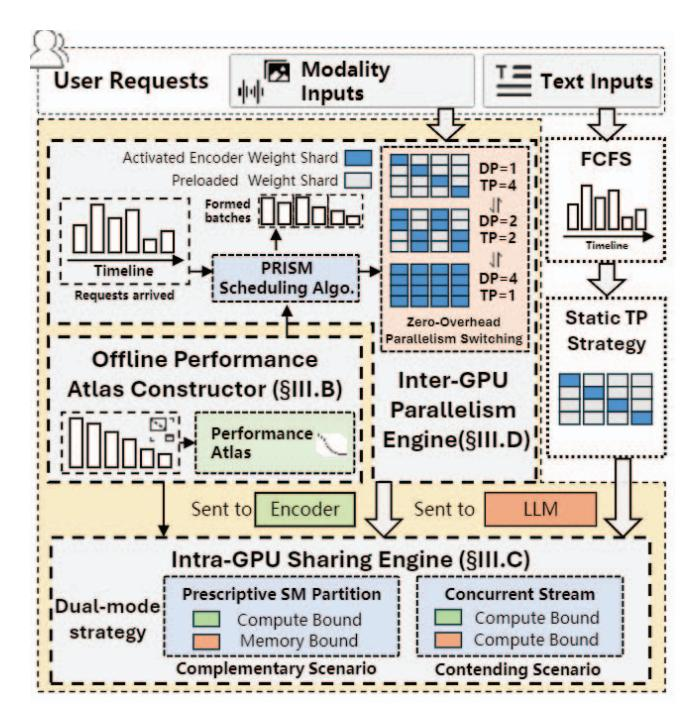

Fig. 6. Overview of RESONATOR. The offline profiler builds a lightweight Performance Atlas for the target model and GPU. At runtime, the control plane makes two decisions at different granularities: (1) within each GPU, the Intra-GPU Sharing Engine selects the sharing mode and SM allocation for the co-running encoder and LLM chunk; (2) across GPUs, the Inter-GPU Parallelism Engine forms encoder batches and selects the encoder DP/TP plan under the current GPU budget. The data plane then executes these decisions via stream/SM control within a GPU and logical sharding across GPUs.

*Main components:* These two mechanisms rely on three system components:

- Performance Atlas (§III-B): a lightweight offline profiler samples representative operating points and fits compact random-forest models. The atlas predicts encoder latency under different TP degrees and SM quotas, gives LLM chunk latency under different SM quotas, records valid TP sets that fit memory, tags chunks as memory-bound or compute-bound, and stores kernel profiles (SM usage and HBM usage). All scheduling decisions query only this atlas.
- Intra-GPU Sharing Engine (§III-C): this engine uses
  the atlas to decide how many SMs the LLM chunk
  should use. It then assigns the remaining SMs to the\nencoder. It switches space-sharing and time-space sharing
  depending on whether the LLM chunk is memory-bound
  or compute-bound.
- Inter-GPU Parallelism Engine (§III-D): this engine implements inter-GPU dynamic parallelism. It forms encoder batches, queries the atlas for each DP/TP option, and uses a dynamic-programming scheduler to select the best plan under the current GPU budget. A zero-overhead switching mechanism applies this plan without reshaping or reloading encoder weights.

#### B. Performance Atlas: Unified Performance Modeling

The Performance Atlas provides lightweight latency predictors and lookup tables for all schedulers in RESONATOR. It has two parts: an *encoder performance model* and an *LLM chunked-prefill model*. Instead of exhaustively profiling the full space, we profile representative operating points on the target GPU and fit lightweight predictors on top of these samples: a compact polynomial model for the encoder and a randomforest predictor for LLM chunks. At runtime, schedulers only query this atlas.

1) Encoder Performance Model: Encoder latency depends on input resolution r, tensor parallelism k, and SM allocation  $SM_{enc}$ .

We first map resolution to sequence length, where H(r) and W(r) are the image height and width at resolution r, and P is the ViT patch size:

$$L_{seq} = \left\lceil \frac{H(r)W(r)}{P^2} \right\rceil. \tag{1}$$

 $L_{seq}$  is the sole complexity parameter of the ViT encoder, so the learned predictor generalizes to arbitrary resolutions and aspect ratios without discrete buckets.

The latency of a single encoder request is predicted by a compact polynomial fit as

$$T_{enc}(r, k, SM_{enc}) = \widehat{T}_{enc}^{poly}(L_{seq}, k, SM_{enc}).$$
 (2)

The encoder processes batched requests serially, so the total encoder latency for a batch is  $\sum_i T_{enc}(r_i, k, SM_{enc})$ . The sampled points cover the valid TP set and the discrete SM levels allowed by the hardware partitioning granularity  $\Delta_{SM}$ , and the predictor generalizes to arbitrary resolutions within the profiled range.

To support inter-GPU parallelism, the profiler also records:

- the valid TP set K(r) for each resolution r (fits GPU memory),
- the encoder latency for a request R under TP degree k:

$$T(R, k) = T_{enc}(r(R), k, SM_{\text{full}}).$$

2) LLM Chunked-Prefill Model: The LLM runs in chunked-prefill mode with mixed prefill and decode chunks. Each chunk is characterized by the number of prefill tokens  $n_p$ , the number of decode tokens  $n_d$ , and a context length bucket  $L_c$  representing the average KV cache depth of the decode requests. We write  $\mathbf{c}=(n_p,n_d,L_c)$  for a chunk configuration. For each  $\mathbf{c}$ , the atlas gives both latency and sharing hints.

Chunk latency under a given SM quota is predicted from the chunk feature vector:

$$T_{llm}(\mathbf{c}, SM_{llm}) = \mathrm{RF}_{llm}(n_p, n_d, L_c, SM_{llm}), \tag{3}$$

where  $\mathrm{RF}_{llm}$  is trained on representative profiled chunk configurations rather than the full Cartesian product of all possible loads.

For each chunk configuration, the profiler also:

 tags the chunk as memory-bound (decode-heavy) or compute-bound (prefill-heavy). Let I denote the chunk's compute intensity (FLOPs per byte) and

- $I^{\star}= \text{PeakFLOPs/PeakHBM\_BW}$  the GPU roofline ridge point. A chunk is tagged memory-bound if  $I<\eta\cdot I^{\star}$ , where  $\eta$  is a configurable intensity threshold.
- chooses a minimum decode SM fraction  $SM_{dec}^{min} \in (0,1)$ —the smallest fraction of SMs that keeps TPOT within the target SLO under isolated decode profiling.

The Intra-GPU Sharing Engine uses these tags to choose the sharing mode and SM split. The profiler also builds a small kernel profile table  $\mathcal P$  that records, for each kernel type  $k_{\mathrm{op}}$  from encoder or LLM, a type label  $\tau(k_{\mathrm{op}}) \in \{\mathrm{comp}, \mathrm{mem}\}$  and its typical SM usage and memory bandwidth; the Intra-GPU Sharing Engine uses  $\tau$  to route individual kernels to CUDA streams with different SM quotas (§III-C). These kernel hints are used only in the contending scenario; the complementary decode-heavy path relies on chunk-level mode selection and decode SM hints instead.

3) Profiling Procedure and Complexity: The Atlas is built by a one-time offline profiler that sweeps the input space on the target GPU. Let  $S(|S|=N_S \leq \lfloor SM_{\text{total}}/\Delta_{SM} \rfloor)$  be the set of SM allocation levels determined by the hardware partitioning granularity  $\Delta_{SM}$ , and  $\mathcal{K}$  ( $|\mathcal{K}|=N_K$ ) the set of TP degrees. For the encoder, the profiler sweeps  $L_{seq}$  with stride  $\Delta_L$ ; let  $N_L^{(k)}$ be the number of memory-valid points for TP degree k. For the LLM, it samples representative chunk points from chunk grids  $\mathcal{G}_n$ ,  $\mathcal{G}_d$ ,  $\mathcal{G}_c$  (for  $n_n$ ,  $n_d$ ,  $L_c$ ), rather than exhaustively measuring every possible runtime load. KV-cache setup is amortized by grouping LLM runs by  $L_c$  bucket ( $|\mathcal{G}_c|$  cache populations total). We fit a compact polynomial regressor for encoder latency and a random-forest regressor for LLM latency, while deriving memory-bound versus compute-bound tags from the profiled chunk characteristics. After fitting, Atlas stores the encoder polynomial coefficients, trained LLM predictor, the valid TP set, decode SM hints, and kernel profile hints. In our Qwen2-VL-7B profiling, the Atlas achieves 4.7% mean prediction error within the profiled range and 8.1% under extrapolation, with a one-time profiling cost of about 6 hours.

#### C. Intra-GPU Sharing Engine

The Intra-GPU Sharing Engine coordinates how the vision encoder and LLM chunks share SM resources on a single GPU as shown in Figure 7. Given a co-running pair {encoder, LLM chunk}, it first classifies the chunk as memory-bound (decodeheavy) or compute-bound (prefill-heavy) at chunk boundaries, primarily using the chunk tag and decode SM quota provided by the Performance Atlas, together with lightweight runtime metadata. For memory-bound chunks, the engine reserves a dedicated SM slice for decoding to reduce interference and stabilize tail latency variation. For compute-bound chunks, it avoids fixed SM partitioning and instead controls resource usage at the kernel level by binding kernels to CUDA streams with different SM quotas. This design replaces opaque hardware scheduling with an explicit, scenario-specific sharing policy tailored to encoder and decoding and encoder and prefill co-execution.

a) Decision Strategy: Scenario Classification: The engine classifies the current LLM chunk as memory-bound

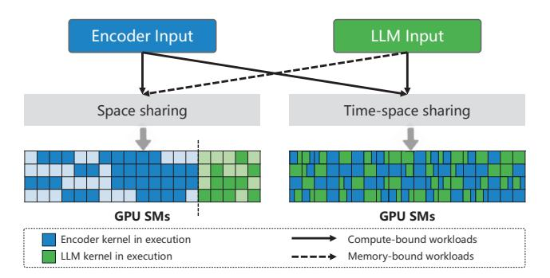

Fig. 7. Intra-GPU sharing. Space sharing splits SMs between encoder and LLM kernels. Time-space sharing reallocates SMs at the kernel level, allowing two compute-bound stages to share compute resources more efficiently. or compute-bound at each chunk boundary. The primary signal is the chunk tag  $TAG(c) \in \{mem, comp\}$  and the minimum decode SM quota  $SM_{dec}^{min}(\mathbf{c})$ , both provided by the Performance Atlas (§III-B) as scheduling hints and read with lightweight metadata lookup at runtime. The runtime does not rely on high-frequency hardware counter sampling. At runtime, the engine additionally uses the decode token fraction  $\rho$  in the chunk as a decode-heavy indicator. The engine enters the *complementary scenario* (SM partitioning) when  $TAG(\mathbf{c}) = mem$  and  $\rho \geq \rho_0$ , where  $\rho_0$  is a fixed threshold; otherwise it enters the contending scenario (kernellevel sharing). To avoid frequent switching, the engine applies hysteresis and changes the mode only when the classification

remains consistent for consecutive chunks.

b) Complementary Scenario: Encoder + Memory-bound Decoding Chunks: In the complementary scenario, the encoder shares the GPU with a memory-bound decoding chunk. The decoding part is bandwidth-limited and very sensitive to latency. If encoder kernels and decoding kernels run on the same SMs, they compete for on-chip resources and cause large jitter in decode latency. To avoid this interference, the engine uses explicit SM partitioning. It sets  $SM_{dec}$  =  $\lceil SM_{\text{total}} \cdot SM_{dec}^{min}(\mathbf{c}) \rceil$  using the Atlas-provided quota and assigns the remaining SMs  $SM_{\rm enc} = SM_{\rm total} - SM_{\rm dec}$  to the encoder. All decoding kernels always run on  $SM_{dec}$ , so encoder activity does not change their contention pattern. This SM slice enforces progress isolation on SM-local resources. Shared subsystems such as L2 and HBM can still introduce interference, so the engine monitors decode tail behavior and falls back to more conservative sharing when decode latency variation increases. In this way, decoding maintains bounded tail latency variation while the encoder still uses most SMs and keeps high throughput.

c) Contending Scenario: Encoder + Compute-bound Chunks: Per-kernel stream binding is enabled only in this regime. In the contending scenario, the encoder shares the GPU with a compute-bound LLM chunk, such as a prefill chunk. Both sides need a lot of FLOPs, so a static SM split hurts them. If we give each side a fixed share of SMs, each side still has many kernels that do not use all of its SMs, and the GPU leaves many SMs idle. To avoid this waste, the engine does not partition SMs between the encoder

Algorithm 1 Per-Kernel Stream Binding in the Contending Scenario

1: **Input:** arriving kernel k from task  $T \in \{\text{enc}, \text{llm}\}$ 

```
2: State: kernel profile table \mathcal{P}, SM manager SMCTRL
 3: Streams: per-task wide stream s_T^{\text{wide}}, narrow stream s_T^{\text{narrow}}
 4: procedure InitContendingMode
          for each task T \in \{\text{enc}, \text{llm}\}\ do
              create CUDA streams s_T^{\text{wide}} and s_T^{\text{narrow}}
 6.
               SMCTRL.SETQUOTA(s_T^{\text{wide}}, 1.0)
                                                                 ⊳ can use all
 7.
     SMs
               SMCTRL.SETQUOTA(s_T^{\text{narrow}}, q_{\text{narrow}})
     0 < q_{\rm narrow} < 1
 9: procedure DISPATCHKERNEL(k, T)
         \tau \leftarrow \mathcal{P}.\mathsf{TYPE}(k)
                                                      \triangleright \tau \in \{\text{comp}, \text{mem}\}\
11:
          if \tau = \text{comp then}
              s \leftarrow s_T^{\text{wide}} \quad \triangleright \text{ compute-bound kernel uses all SMs}
12:
13.
14:

     SMs
          LAUNCHONSTREAM(k, s)
15:
```

and the compute-bound chunk. Instead, it lets both tasks see the full SM pool and controls resource use at the kernel level. The engine classifies each kernel as compute-bound or memory-bound/low-occupancy by a profile table. It sends compute-bound kernels to *wide* streams, which can use all SMs, and sends memory-bound or low-occupancy kernels to *narrow* streams, which only use a small subset of SMs. In this way, heavy kernels from the encoder and the LLM chunk fill the GPU in a time-space sharing manner, while light or bandwidth-bound kernels stay in a limited region and do not block global compute.

d) Implementation and Overhead: We use existing runtime support to bind CUDA streams to specific SMs. In practice, we use mechanisms such as green-ctx or libsmctrl [26] to map each stream to a chosen SM subset. Wide streams bind to a context that can schedule on all SMs, while narrow streams bind to a context that can only schedule on a small SM set. The engine uses profiler results to decide how many SMs each stream should see: it reads the perkernel SM usage and memory bandwidth from offline logs and chooses a larger SM quota for compute-bound kernels and a smaller quota for memory-bound or low-occupancy kernels. At runtime, the engine only looks up the kernel type in the table  $\mathcal{P}$ , selects the proper stream, and calls the launch API. All data paths and kernel code stay the same. The wide/narrow streams and SM quotas are pre-created, so dispatch adds only a metadata lookup and a stream selection. Because the launch stream is chosen at runtime, this contending path uses eager execution rather than CUDA Graph replay. This is acceptable because it is triggered mainly for compute-heavy encoder+prefill co-execution, where the extra CPU launch work is small relative to kernel execution time. In contrast, the complementary decode-heavy path switches policy only at

chunk boundaries and does not require per-kernel rerouting on the critical decode loop, preserving compatibility with replaybased decode optimizations.

#### D. Inter-GPU Parallelism Engine

The Inter-GPU Parallelism Engine is RESONATOR's component for managing encoder execution across multiple GPUs. It dynamically forms request batches and selects the optimal parallelism strategy for each batch to maximize system performance.

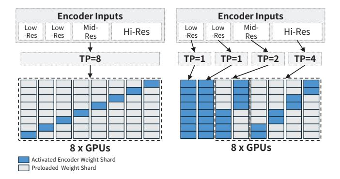

Fig. 8. GPU parallelism strategies for heterogeneous encoder requests on 8 GPUs. Left: fixed TP=8 assigns every request to all GPUs, causing underutilization. Right: dynamic DP/TP selection assigns each request an appropriate parallelism degree to improve utilization and throughput.

The engine consists of two main parts: a scheduling algorithm and a runtime support mechanism.

- PRISM Scheduling Algorithm: Given the queue of pending encoder requests and the current accelerator state (available GPUs), PRISM produces an execution plan that specifies: (i) how requests are batched, and (ii) how encoder parallelism is organized (e.g., DP/TP configuration and placement). Plans are chosen by querying Λ<sub>atlas</sub> to predict per-plan latency and throughput, optimizing SLO-aware objectives (e.g., TTFT under capacity constraints).
- Runtime Support: A zero-overhead switching mechanism enables the engine's dynamic decisions. It allows the system to change an encoder's parallelism strategy between batches without reloading or resharding model weights.

#### 1) PRISM Scheduling Algorithm:

a) **Scheduling Challenges and Objectives**: The engine's primary objective is to maximize the overall system throughput. Simple queuing policies, however, fail to achieve this due to two fundamental challenges in MLLM serving.

First, request heterogeneity causes severe Head-of-Line (HoL) blocking. A long-running, high-resolution request can stall many short, low-resolution requests, significantly degrading overall throughput and fairness.

Second, there is a fundamental trade-off between latency and concurrency. Using tensor parallelism (TP) reduces the latency of a single request, but it consumes more GPUs, which reduces the number of requests that can be processed concurrently. A static parallelism choice is therefore inherently suboptimal under a dynamic system load.

Conventional approaches that use a fixed parallelism strategy are inefficient when processing such heterogeneous requests, as illustrated in Figure 8 (left). To address this limitation, our engine employs a dynamic parallelism selection mechanism that adapts GPU resource allocation to the request characteristics. This dynamic approach significantly improves throughput and utilization, as detailed in Figure 8 (right).

- b) Adaptive Batching with Dynamic Programming: To address these challenges, the engine formulates the scheduling task as a Multiple-Choice Knapsack Problem (MCKP). The goal of this formulation is to find a batch configuration that maximizes the aggregate processing rate. The processing rate is defined as the sum of the inverse latencies of the selected requests. This objective function naturally prioritizes configurations that complete more work per unit of time, which directly maximizes the system's overall throughput.
- c) Problem Formulation: Let the queue of pending requests be  $Q=\{R_1,R_2,\ldots,R_m\}$  and the number of available GPUs be N. For each request  $R_i$ , there exists a set of valid Tensor Parallelism (TP) configurations,  $K_i\subseteq\{1,2,4,\ldots,N\}$ . Using our Performance Atlas, we can determine the execution latency  $T(R_i,k)$  for each request  $R_i$  under a TP degree of  $k\in K_i$ . The value or contribution of scheduling request  $R_i$  with parallelism k is its processing rate,  $v(R_i,k)=1/T(R_i,k)$ . The cost is the number of GPUs it consumes, which is simply k. The optimization problem is to select at most one parallelism option for each request, such that the total cost does not exceed N and the total value is maximized. The problem is:

$$\text{maximize} \left\{ \sum_{i=1}^m v(R_i, k_i) \mid \sum_{i=1}^m k_i \leq N, \forall i: k_i \in K_i \cup \{0\} \right\}$$

We solve this MCKP using dynamic programming. Let dp[i][j] be the maximum achievable aggregate throughput (total value) considering only the first i requests from the queue  $(R_1, \ldots, R_i)$  with a total budget of j GPUs.

The state transition is derived by considering the options for request  $R_i$ :

- 1) **Do not schedule**  $R_i$ : The maximum value is simply the optimal value for the first i-1 requests with the same GPU budget j, which is dp[i-1][j].
- 2) **Schedule**  $R_i$  **with TP degree**  $k \in K_i$ : This is only possible if  $j \ge k$ . The value would be the contribution from this choice,  $v(R_i, k)$ , plus the optimal value for the first i-1 requests with the remaining GPU budget of j-k, which is dp[i-1][j-k]. We select the best  $k \in K_i$ .

This leads to the following recurrence relation:

$$dp[i][j] = \max \begin{cases} dp[i-1][j] \\ \max_{k \in K_i, k \leq j} \{dp[i-1][j-k] + v(R_i, k)\} \end{cases}$$

The base cases are dp[0][j] = 0 for all j, and dp[i][0] = 0 for all i. After filling the table, the optimal value for the entire queue is dp[m][N].

#### Algorithm 2 PRISM Scheduler

```
Input: Pending request queue Q = \{R_1, \dots, R_m\},
           Available GPUs N, Performance Atlas A
     Output: Optimal batch with assigned TP degrees, B_{opt}
 1: Initialize dp[m+1][N+1] \leftarrow 0
 2: Initialize trace[m+1][N+1] \leftarrow 0
 3: for i \leftarrow 1 to m do

    ▶ Iterate through each request

         for j \leftarrow 1 to N do

    ▷ Iterate through each budget

               dp[i][j] \leftarrow dp[i-1][j]
                                                    ▶ Default action: skip
               trace[i][j] \leftarrow 0
 6:
               for all k \in \mathcal{A}. ValidTP(R_i) and k \leq j do
 7:
 8:
                    v_{ik} \leftarrow 1/\mathcal{A}.\text{GetLatency}(R_i, k)
                   \begin{array}{l} \text{if } dp[i-1][j-k]+v_{ik}>dp[i][j] \text{ then} \\ dp[i][j] \leftarrow dp[i-1][j-k]+v_{ik} \rhd \text{Update} \end{array}
10:
    optimal value
                        trace[i][j] \leftarrow k > Record the TP degree
11:
```

#### Backtrack to reconstruct the optimal batch:

```
12: B_{opt} \leftarrow \emptyset; \ j \leftarrow N
13: for i \leftarrow m downto 1 do
14: k \leftarrow trace[i][j]
15: if k > 0 then \triangleright If request R_i was included in the optimal solution
16: B_{opt} \leftarrow B_{opt} \cup \{(R_i, \mathrm{TP} = k)\}
17: j \leftarrow j - k \triangleright Decrement the remaining GPU budget
18: return B_{opt}
```

The value dp[m][N] represents the optimal aggregate throughput, but not the batch configuration itself. The chosen set of requests and their corresponding parallelism degrees are reconstructed by backtracking through the DP table, as shown in lines 12-18 of Algorithm 2. This process identifies which requests were included in the optimal solution and with which parallelism configuration, yielding the final batch to be dispatched to the Unified Runtime.

- 2) Zero-Overhead Parallelism Switching: The Enabler of JIT Decisions: The principle of dynamic, Just-in-Time (JIT) parallelism is only practical if the cost of switching between parallel strategies is negligible. To understand how our system, RESONATOR, achieves this, we first contrast the canonical implementation of Tensor Parallelism (TP) with the mechanism that allows us to bypass its inherent overheads.
- a) The Limitation of Canonical TP: Canonical TP [22] physically partitions the weight matrices of Transformer layers across multiple GPUs, with each GPU storing only its designated shard. Following a local matrix multiplication, a collective communication operation (e.g., All-Reduce) is required to synchronize partial results. The key limitation of this approach is its static nature: altering the TP degree necessitates a costly, network-intensive redistribution of weight data across all participating GPUs, making it infeasible for dynamic, perbatch adaptation.
- b) RESONATOR's Zero-Overhead Mechanism: Logical Sharding: RESONATOR's zero-overhead switching is enabled

by a mechanism we term **logical sharding**, which leverages the strided memory access capabilities of modern GPU compute libraries like cuBLAS and CUTLASS [27], [28]. These libraries can perform GEMM operations on non-contiguous memory slices by specifying a leading dimension (ld) parameter, which defines the memory stride between rows or columns.

This allows us to pre-load the entire, unsharded encoder model onto every GPU at startup. At runtime, instead of physically moving data, RESONATOR simply alters the kernel launch parameters to logically constrain the computation to the desired shard. This transforms a heavyweight data-shuffling problem into a lightweight metadata update. For a Data Parallel (DP) execution, kernels operate over the full local tensor. For a Tensor Parallel (TP) execution across  $k^*$  GPUs, each worker is directed to compute on only its  $1/k^*$  logical shard by invoking a strided GEMM on the pre-loaded weights. This ability to instantly reconfigure the parallel topology via a control-plane operation, rather than a data-plane one, is what makes RESONATOR's dynamic, per-batch planning both feasible and highly efficient.

#### E. Discussion: Scope and applicability to training.

RESONATOR targets MLLM *inference serving*, where runtime dynamics are substantially richer than in training: requests arrive with heterogeneous image resolutions, variable text lengths, time-varying arrival rates, and fluctuating GPU resource pressure, making adaptive scheduling especially beneficial. Training, by contrast, typically operates under relatively fixed resource allocations, more regular batch structures, and more stable input shapes, which reduces the potential benefit of the proposed mechanisms. That said, the core ideas operate at the runtime level and could in principle benefit MLLM training pipelines that exhibit similar encoder/backbone resource asymmetry, although this would require additional design and evaluation beyond the scope of this paper.

#### IV. EVALUATION

#### A. Experimental Setup

**Hardware and software setup**: All experiments are conducted on a single server equipped with 8 NVIDIA A100 SXM 80GB GPUs and an Intel Xeon Gold 6430 CPU. The GPUs are interconnected via NVLink. Our system is implemented using SGLang-0.4.7 [12].

Models: We evaluate three state-of-the-art open-weight MLLMs with varying model sizes: Qwen2-VL-7B [3], Kimi-VL-16B [5], Qwen2-VL-72B [3].

Table II summarizes the vision encoder specifications and the HBM overhead of weight replication required by logical sharding (§III-D).

Dataset and Workload: We use MMMUPro [29] and TextVQA [30] datasets for MLLM evaluation. These datasets feature a wide spectrum of image resolutions and complexities, ranging from standard web images to detailed charts and documents. We vary the average arrival rate, measured in requests per second (RPS), to evaluate system performance under different load levels as our synthesized workload traces.

Requests are randomly sampled from the datasets and arrive following a Poisson process at the specified RPS.

TABLE II
VISION ENCODER SPECIFICATIONS AND HBM OVERHEAD OF WEIGHT
REPLICATION ON A100 80 GB.

| Model        | Encoder  | Params | FP16             | % HBM |
|--------------|----------|--------|------------------|-------|
| Qwen2-VL-7B  | ViT-675M | 675M   | 1.3 GB           | 1.6%  |
| Qwen2-VL-72B | ViT-675M | 675M   | 1.3 GB           | 1.6%  |
| Kimi-VL-16B  | MoonViT  | 400M   | $0.8\mathrm{GB}$ | 1.0%  |

**Evaluated Metrics:** We use four standard Service Level Objectives (SLOs) for serving systems: Throughput, TTFT, TPOT and end-to-end latency.

**Baseline:** We compare RESONATOR against two state-of-the-art LLM inference serving systems: *vLLM* [11] and *SGLang* [12], as well as *EPD-Serve* [19], a recent MLLM-specific system that disaggregates encoder, prefill, and decode stages into separate GPU pools. For all systems, the LLM backbone uses TP=4 on 4 A100s (Qwen2-VL-7B, Kimi-VL-16B) and TP=8 on 8 A100s (Qwen2-VL-72B). RESONATOR uses the same LLM parallelism as the baselines; only the encoder parallelism is dynamically adjusted at runtime.

#### B. End-to-end Performance

Figure 9 compares RESONATOR with SGLang and vLLM across three MLLMs under increasing request rates. Overall, RESONATOR consistently improves throughput, TTFT, TPOT, and end-to-end (E2E) latency across all models and load levels.

**End-to-end latency.** RESONATOR substantially reduces user-perceived latency. On Kimi-VL-16B, it lowers mean E2E latency by up to  $4.9\times$  over SGLang and  $10.7\times$  over vLLM. On Qwen2-VL-7B, the improvement reaches  $3.0\times$  and  $7.8\times$ . Even on Qwen2-VL-72B, RESONATOR still achieves up to  $1.9\times$  and  $3.2\times$  gains. The smaller relative gain on 72B is expected, as the much larger LLM backbone dominates end-to-end time.

**TTFT.** RESONATOR significantly improves both mean and tail TTFT by dynamically selecting DP for simple requests and TP for complex ones, thereby reducing head-of-line blocking. For example, on Kimi-VL-16B at 10 RPS, mean TTFT drops to 11.6 s, compared with 43.5 s for SGLang and 59.7 s for vLLM; P99 TTFT is likewise much lower (14.7 s vs. 70.0 s and 104.8 s).

**TPOT.** RESONATOR also improves decoding efficiency, especially for large models. On Qwen2-VL-72B at 8 RPS, mean TPOT is 200 ms, versus 342 ms for SGLang and 600 ms for vLLM. This comes from reclaiming idle SMs during TP communication waits and reallocating them to co-located decode tasks.

**Throughput.** RESONATOR achieves higher throughput across all models. On Qwen2-VL-7B, it reaches 876 tokens/s, compared with 462 for SGLang and 257 for vLLM; on Qwen2-VL-72B, it peaks at 373 tokens/s versus 293 and 162. These gains come from dynamic parallelism, which sustains scaling under load while static TP baselines saturate earlier.

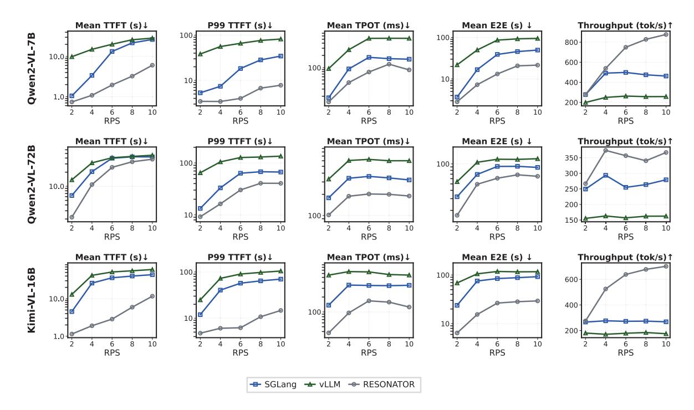

Fig. 9. End-to-end performance comparison of RESONATOR against SGLang and vLLM across various MLLMs and request rates (RPS). RESONATOR shows significant improvements in latency (lower is better, ↓) and throughput (higher is better, ↑) across all configurations. Qwen2-VL-7B and Kimi-VL-16B are evaluated on 4 A100s, Qwen2-VL-72B is evaluated on 8 A100s.

#### C. Analysis of the Parallelism Performance Landscape

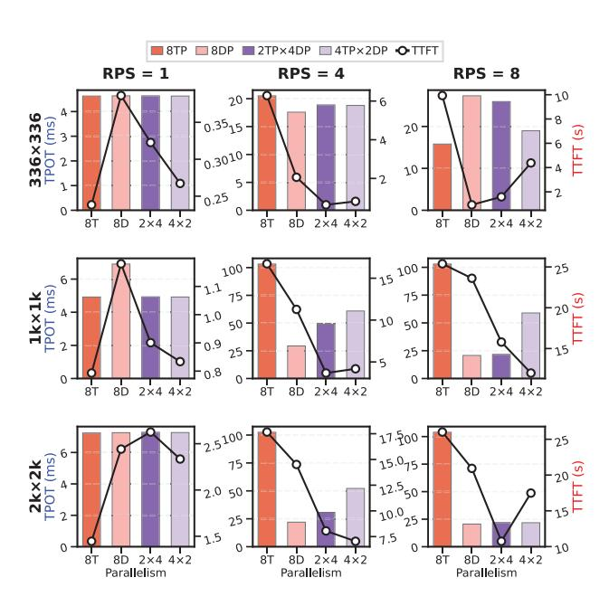

Fig. 10. TPOT and TTFT using four parallelism strategies on 8 NVIDIA-A100 GPUs for Kimi-VL

To validate our central claim that no single static parallelism strategy is optimal for MLLM serving, we map the performance landscape under varying request complexity and system load (Figure 10). We use three image resolutions(336×336,

1024×1024, and 2048×2048) to represent low, medium, and high encoder complexity, and three request rates(1, 4, and 8 RPS) to represent different concurrency levels. For each of the resulting nine scenarios, we evaluate four fixed strategies on our 8-GPU setup: 8DP, 8TP, 4DP-2TP, and 2DP-4TP. The results show a highly dynamic landscape in which the best configuration shifts substantially with the workload.

**Low Concurrency: Latency-Bound Scenarios.** At a low arrival rate (RPS=1), the system is latency-bound, where minimizing single-request time is key. Here, an aggressive **8-way Tensor Parallelism (8TP)** strategy is consistently optimal. For high-resolution images, 8TP achieves a 1.45 s mean Time-to-First-Token (TTFT), significantly outperforming the next best strategy (4TP×2DP at 2.33 s). It remains superior even for low-resolution images, with a TTFT of 0.24 s.

High Concurrency: Throughput-Bound Scenarios. At a high arrival rate (RPS=8), the system becomes throughput-bound, and the optimal strategy depends heavily on request complexity. For low-resolution requests, pure 8-way Data Parallelism (8DP) is best, yielding a 0.93 s TTFT by maximizing concurrency. For high-resolution (2k×2k) requests, a hybrid 2TP×4DP is optimal with a 10.75 s TTFT. This strategy strikes a crucial balance, as pure 8DP is too slow perrequest (20.93 s), while pure 8TP cripples throughput with an effective latency of 26.01 s.

#### D. Effectiveness of the Intra-GPU Sharing Engine.

To validate the necessity of our Intra-GPU sharing design, we conduct an experiment that isolates the performance of

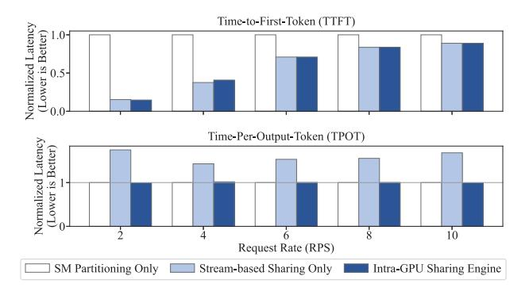

Fig. 11. Ablation study of the Intra-GPU Sharing Engine, normalized to the *SM Partitioning Only* strategy. The Intra-GPU Sharing Engine achieves the low TTFT of co-scheduling and the low TPOT of partitioning by adaptively selecting the best model.

its two constituent concurrency models. We compare three configurations, with results normalized to the SM Partitioning Only strategy, as shown in Figure 11.

- SM Partitioning Only: A static strategy that always uses prescriptive SM partitioning for all co-located tasks. This serves as our baseline.
- Stream-based Sharing Only: A static strategy that always uses concurrent stream.
- Intra-GPU Sharing Engine: Our proposed approach, which dynamically selects between the two strategies based on the workload scenario.
- *a) TTFT Analysis:* Figure 11 (top) shows that TTFT is mainly determined by the compute-intensive prefill phase. *SM Partitioning Only* performs poorly, while *Stream-based Sharing Only* reduces normalized TTFT to 0.15 at 2 RPS, corresponding to a 6.5× speedup, and achieves a 1.6× average reduction across loads. This confirms that co-scheduling is more effective for compute-bound cases. Our method identifies these scenarios and applies co-scheduling, achieving TTFT close to *Stream-based Sharing Only*.
- *b) TPOT Analysis:* Figure 11 (bottom) shows that TPOT is dominated by the memory-bound decode phase. In this case, *Stream-based Sharing Only* performs poorly, with up to 1.75× higher latency than *SM Partitioning Only*, due to interference with latency-sensitive decoding. By contrast, *SM Partitioning Only* is effective because it provides stronger isolation. Our method identifies these scenarios and applies partitioning accordingly, achieving TPOT close to the best baseline.
- *c) Conclusion:* This study demonstrates a clear performance trade-off: neither static concurrency model is optimal for both TTFT and TPOT. The Intra-GPU sharing engine is superior because it intelligently adapts. It applies the best model for the specific needs of each execution phase, validating that this adaptability is essential for achieving the best overall system performance.
- *d) Tail Latency Stability under Co-execution:* To further validate the Intra-GPU Sharing Engine's ability to protect decode quality, we record per-token inter-token latency during encoder–decoder co-execution on a single GPU (Kimi-VL-

16B, mixed-resolution workload, 2 RPS) and compute TPOT P99 within 1-second windows. Figure 12 compares *Stream Sharing Only*—where encoder and decoder share all SMs via concurrent CUDA streams—against our full *Intra-GPU Sharing Engine*, which adaptively applies SM partitioning in decode-heavy scenarios. With stream sharing alone, TPOT P99 spikes to 28 s at its worst and exceeds the 250 ms SLO in 20% of time windows (21 out of 103), because compute-intensive encoder kernels unpredictably preempt memory-bound decode iterations. Our Sharing Engine reduces the SLO violation rate to 5% (5 out of 100 windows) and caps the worst-case TPOT P99 at 479 ms. The median TPOT P99 also drops from 193 ms to 118 ms. These results confirm that the adaptive SM partitioning policy is essential for bounding decode tail latency under co-execution.

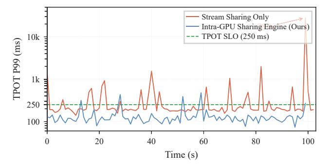

Fig. 12. Per-second TPOT P99 during encoder–decoder co-execution on Kimi-VL-16B at 2 RPS. *Stream Sharing Only* suffers frequent spikes (up to 28 s), while the *Intra-GPU Sharing Engine* keeps TPOT P99 near or below the 250 ms SLO.

#### *E. Case Study: Performance on a Highly Heterogeneous Workload*

To demonstrate the effectiveness of our dynamic scheduling in a realistic, highly heterogeneous scenario, we constructed a challenging batch of 20 requests with a uniform mix of four distinct resolutions (from 256x256 to 2048x2048). We compared the performance of our dynamic scheduler against a range of static parallelism strategies, which presented in Figure 13.

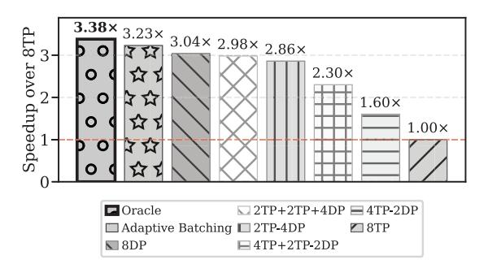

Fig. 13. Case study of Adaptive Schedule on 8 NVIDIA-A100 GPU of Qwen2-VL Encoder

Our dynamic scheduler outperforms all static configurations by applying the optimal parallelism strategy to each request.

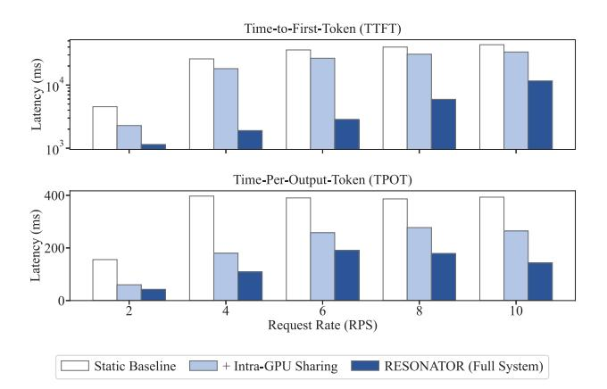

Fig. 14. Ablation study results showing the incremental performance benefits of Intra-GPU Sharing and the RESONATOR system on (a) Time-to-First-Token (TTFT) and (b) Time-Per-Output-Token (TPOT).

It achieves a 3.23x speedup over the worst-performing static strategy, 8-way Tensor Parallelism (8TP), which suffers from severe head-of-line blocking in this mixed workload. While a pure 8-way Data Parallelism (8DP) strategy also performs well (3.04x speedup) by efficiently handling the numerous low-resolution requests, our dynamic approach is superior.

By routing high-resolution requests to latency-optimal TP and low-resolution ones to throughput-optimal DP, our scheduler avoids the compromises of any single static plan and nearly matches the Oracle's speedup on mixed workloads.

#### F. Ablation Study

We conduct an ablation study to quantify the contributions of our two optimizations. We evaluate three system configurations under a mixed-resolution workload (Figure 14).

- Static Baseline: Uses fixed tensor parallelism and no intra-GPU sharing.
- Static Baseline + Intra-GPU Sharing: Adds the intra-GPU sharing engine to the baseline.
- RESONATOR (Full System): Our complete system with both engines.
- a) Impact on TTFT: Figure 14 (top) shows RES-ONATOR significantly reduces TTFT. The baseline configurations exhibit poor TTFT that degrades under load. Their fixed parallelism strategy is inefficient for mixed-resolution workloads, causing high TTFT. In contrast, RESONATOR's Inter-GPU Parallelism Engine applies optimal parallelism to each batch. This dynamic adaptation accelerates the encoder, yielding a 13.7× TTFT improvement at 4 RPS.
- b) Impact on TPOT: The Intra-GPU Sharing Engine is key to improving TPOT (decoding efficiency), as shown in Figure 14 (bottom). It resolves resource contention between encoders and decoders, enabling uninterrupted decoding. At 2 RPS, it reduces TPOT by  $2.6\times$  (from 155 ms to 60 ms). The full RESONATOR system further reduces TPOT to 42.7 ms, showing that efficient batching also improves decoding.
- c) Conclusion: Both components are essential. The Intra-GPU Sharing Engine enables co-location for low TPOT. The

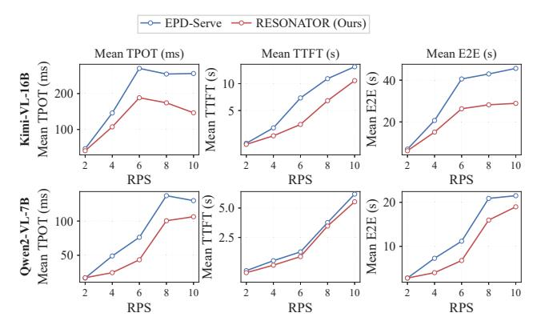

Fig. 15. Performance comparison of RESONATOR ( $4\times A100$ ) and EPD-Serve ( $6\times A100$ ) on Kimi-VL-16B and Qwen2-VL-7B. RESONATOR achieves consistently higher throughput and lower latency while using 33% fewer GPUs.

Inter-GPU Parallelism Engine manages request heterogeneity for low TTFT under load. Their synergy in RESONATOR validates our symbiotic design for MLLM serving.

#### G. Comparison with MLLM-Specific Disaggregation

To evaluate RESONATOR against MLLM-specific serving architectures, we compare it with EPD-Serve [19], a representative encoder–prefill–decode disaggregation system with dedicated GPU pools and static intra-pool parallelism. We evaluate both Kimi-VL-16B and Qwen2-VL-7B on MMMUPro under 2–10 RPS. EPD-Serve uses 6 A100 GPUs (2 for encoder and 4 for LLM), while RESONATOR uses only 4 A100 GPUs by co-scheduling encoder and LLM on shared devices, reducing GPU usage by 33%. Figure 15 shows the results.

RESONATOR consistently outperforms EPD-Serve across both models, and the gap widens under higher load. On Kimi-VL-16B, RESONATOR improves mean TTFT by up to  $2.31\times$ , mean E2E latency by up to  $1.58\times$ , and mean TPOT by up to  $1.75\times$ . On Qwen2-VL-7B, it improves mean E2E latency by up to  $1.81\times$  and mean TPOT by up to  $1.99\times$ . These gains come from eliminating static pool boundaries: RESONATOR dynamically adjusts encoder TP/DP per batch and uses intra-GPU isolation to protect decode quality during co-execution. Overall, co-scheduling encoder and LLM with adaptive resource management is both more performant and more resource-efficient than stage-disaggregated serving.

#### H. Compute Efficiency of Logical Sharding

Logical sharding (§III-D2b) avoids weight movement by executing each TP worker on a logical slice of the replicated encoder weights. This removes the resharding cost, but it introduces one potential concern: the GEMM input weight is no longer a physically compact shard, and each worker accesses a strided region whose leading dimension is larger than the shard width. If this layout substantially reduced memory coalescing or cache locality, the benefit of zero-overhead switching could be offset by slower kernels.

To quantify this cost, we micro-benchmark the three dominant encoder GEMM types in Qwen2-VL-7B: QKV projection, FFN up-projection, and FFN down-projection. The

experiments run on a single A100 GPU in FP16 and sweep  $L_{seq} \in \{1\mathrm{k}, 4\mathrm{k}, 8\mathrm{k}, 16\mathrm{k}\}$  and  $\mathrm{TP} \in \{1, 2, 4\}$ . For each configuration, we compare two layouts with identical arithmetic: (i) a physically contiguous shard, which represents conventional TP after materializing each shard, and (ii) a strided logical shard, which uses the full replicated weight tensor with an adjusted leading dimension. We report both latency and MFU, normalized against the A100 FP16 peak of 312 TFLOPS.

Figure 16 shows that the strided layout closely tracks the contiguous baseline across all three GEMM types. The median absolute gap is only **0.7%**, and 91% of configurations fall within 2%. The gap remains small because each logical shard still contains wide matrix tiles: the shard column width ranges from 896 to 7168 elements, far larger than a 64-element L2 cache line. As a result, the kernels retain regular, vectorized memory access within each tile, and the extra stride mainly affects the row-to-row address calculation rather than the dense inner loop. Small residual gaps appear in a few low-sequence-length cases, where fixed launch and addressing overheads are less amortized, but they do not change the preferred TP/DP choices.

These results support the main scheduling assumption behind RESONATOR: changing encoder parallelism can be treated as a lightweight control-plane decision rather than a data-plane reshuffling operation. Moreover, the Performance Atlas profiles the strided execution path directly, so any remaining layout cost is already included in the latency estimates used by the online scheduler.

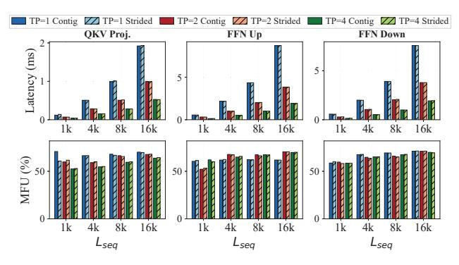

Fig. 16. Latency and MFU comparison of contiguous vs. strided (logical sharding) GEMMs for the three encoder linear-layer types on A100 FP16. Solid bars: contiguous; hatched bars: strided. Colors denote TP degree. The performance gap is within 2% for 91% of configurations.

#### V. RELATED WORK

a) LLM Infrastructure: LLM serving has been extensively studied to mitigate the memory and performance bottlenecks of text-only decoders. A rich ecosystem of serving frameworks has emerged, including vLLM [11], SGLang [12], FlexGen [31], Sarathi [13], TurboTransformers [32], ORCA [33], and MuxServe [34], together with a wide range of optimization techniques. Memory management has been a central focus, with advances in KV cache eviction [35], [36] and compression [37], while model-centric techniques such as quantization and sparsification [38], [39]

have become standard for reducing model size. However, these frameworks and optimizations are fundamentally designed for text-only workloads and do not address the encoder bottleneck introduced by MLLMs.

b) Disaggregated and Parallel Serving: To further improve serving efficiency, prior work has explored architectural paradigms. Model parallelism [22], [40], [41], has been essential for serving increasingly large models. A complementary direction is disaggregation: systems such as Split-Wise [20] and DistServe [42] decouple prefill and decode to reduce interference and improve TTFT and TPOT, while Pensieve [43], Mooncake [24], PD-Serve [21], and Seesaw [14] extend this design with more sophisticated scheduling and sharding. Despite their effectiveness, these systems target textonly workloads and do not account for the distinct encoding stage of MLLMs, missing opportunities such as parallel frame encoding for video inputs. Although early ideas on MLLM disaggregation have appeared [19], [44], they do not address dynamic scheduling and resource partitioning, which our work is the first to unify in an integrated system.

c) Multimodal Inference Serving: Recent systems begin to optimize MLLM serving. Inf-MLLM [36] targets longcontext streaming inference, mainly on a single GPU with model-level memory optimizations. EPD-Serve [19] and Mod-Serve [44] disaggregate modality encoding, prefill, and decoding across resources, showing the value of stage-aware serving under bursty and heterogeneous multimodal requests. Space-Serve [45] further explores spatial multiplexing between complementary encoders and decoders to improve GPU utilization. In contrast, RESONATOR emphasizes runtime adaptation in a disaggregated pipeline: it selects encoder parallelism per request batch and reallocates GPU compute between encoder and decoder execution. This lets RESONATOR exploit both inter-GPU parallelism choices and intra-GPU resource complementarity, rather than relying only on static stage placement or fixed resource partitioning.

#### VI. CONCLUSION

This paper presented RESONATOR, a serving system that embraces MLLM heterogeneity with a disaggregated architecture. RESONATOR introduces two runtime optimizations: (i) an intra-GPU sharing engine that adaptively partitions SMs between the vision encoder and LLM decoder using a profile-driven performance atlas to exploit stage-level and kernel-level slack; and (ii) an inter-GPU parallelism engine that dynamically selects TP/DP configurations with JIT batching to match heterogeneous MLLM workloads. RESONATOR achieves up to  $3.4\times$  higher throughput,  $5.1\times$  lower TTFT, and  $3.0\times$  better TPOT efficiency.

#### ACKNOWLEDGMENT

This work is supported by the National Key Research and Development Program of China (2024YFB4505603), the National Natural Science Foundation of China (62232015, 62302479).

#### REFERENCES

- [1] OpenAI, "GPT-4o System Card," 2024. [Online]. Available: https: //arxiv.org/abs/2410.21276
- [2] Gemini Team, "Gemini: A family of highly capable multimodal models," 2025. [Online]. Available: https://arxiv.org/abs/2312.11805
- [3] P. Wang, S. Bai, S. Tan, S. Wang, Z. Fan, J. Bai, K. Chen, X. Liu, J. Wang, W. Ge, Y. Fan, K. Dang, M. Du, X. Ren, R. Men, D. Liu, C. Zhou, J. Zhou, and J. Lin, "Qwen2-VL: Enhancing vision-language model's perception of the world at any resolution," 2024. [Online]. Available: https://arxiv.org/abs/2409.12191
- [4] S. Bai, K. Chen, X. Liu, J. Wang, W. Ge, S. Song, K. Dang, P. Wang, S. Wang, J. Tang, H. Zhong, Y. Zhu, M. Yang, Z. Li, J. Wan, P. Wang, W. Ding, Z. Fu, Y. Xu, J. Ye, X. Zhang, T. Xie, Z. Cheng, H. Zhang, Z. Yang, H. Xu, and J. Lin, "Qwen2.5-VL Technical Report," 2025. [Online]. Available: https://arxiv.org/abs/2502.13923
- [5] Kimi Team, "Kimi-VL Technical Report," 2025. [Online]. Available: https://arxiv.org/abs/2504.07491
- [6] Y. Han, C. Zhang, X. Chen, X. Yang, Z. Wang, G. Yu, B. Fu, and H. Zhang, "ChartLlama: A multimodal LLM for chart understanding and generation," 2023. [Online]. Available: https://arxiv.org/abs/2311.16483
- [7] Y. Tang, J. Bi, S. Xu, L. Song, S. Liang, T. Wang, D. Zhang, J. An, J. Lin, R. Zhu, A. Vosoughi, C. Huang, Z. Zhang, P. Liu, M. Feng, F. Zheng, J. Zhang, P. Luo, J. Luo, and C. Xu, "Video understanding with large language models: A survey," *IEEE Transactions on Circuits and Systems for Video Technology*, pp. 1–1, 2025.
- [8] B. Chen, A. Khare, G. Kumar, A. Akula, and P. Narayana, "Seeing beyond: Enhancing visual question answering with multi-modal retrieval," in *Proceedings of the 31st International Conference on Computational Linguistics: Industry Track*, O. Rambow, L. Wanner, M. Apidianaki, H. Al-Khalifa, B. D. Eugenio, S. Schockaert, K. Darwish, and A. Agarwal, Eds. Abu Dhabi, UAE: Association for Computational Linguistics, Jan. 2025, pp. 410–421. [Online]. Available: https://aclanthology.org/2025.coling-industry.35/
- [9] A. Dosovitskiy, L. Beyer, A. Kolesnikov, D. Weissenborn, X. Zhai, T. Unterthiner, M. Dehghani, M. Minderer, G. Heigold, S. Gelly, J. Uszkoreit, and N. Houlsby, "An image is worth 16x16 words: Transformers for image recognition at scale," in *International Conference on Learning Representations*, 2021. [Online]. Available: https://openreview.net/forum?id=YicbFdNTTy
- [10] T. Alex, W. Suharitdamrong, S. Atito, A. Mustafa, P. J. B. Jackson, I. Razzak, and M. Awais, "PAL: Probing audio encoders via LLMs – a study of information transfer from audio encoders to LLMs," 2025. [Online]. Available: https://arxiv.org/abs/2506.10423
- [11] W. Kwon, Z. Li, S. Zhuang, Y. Sheng, L. Zheng, C. H. Yu, J. Gonzalez, H. Zhang, and I. Stoica, "Efficient memory management for large language model serving with PagedAttention," in *Proceedings of the 29th Symposium on Operating Systems Principles*, ser. SOSP '23. New York, NY, USA: Association for Computing Machinery, 2023, p. 611–626. [Online]. Available: https://doi.org/10.1145/3600006.3613165
- [12] L. Zheng, L. Yin, Z. Xie, C. Sun, J. Huang, C. H. Yu, S. Cao, C. Kozyrakis, I. Stoica, J. E. Gonzalez, C. Barrett, and Y. Sheng, "SGLang: Efficient execution of structured language model programs," in *The Thirty-eighth Annual Conference on Neural Information Processing Systems*, 2024. [Online]. Available: https://openreview.net/forum?id=VqkAKQibpq
- [13] A. Agrawal, N. Kedia, A. Panwar, J. Mohan, N. Kwatra, B. Gulavani, A. Tumanov, and R. Ramjee, "Taming Throughput-Latency tradeoff in LLM inference with Sarathi-Serve," in *18th USENIX Symposium on Operating Systems Design and Implementation (OSDI 24)*. Santa Clara, CA: USENIX Association, Jul. 2024, pp. 117–134. [Online]. Available: https://www.usenix.org/conference/osdi24/presentation/agrawal
- [14] Q. Su, W. Zhao, X. Li, M. Andoorveedu, C. Jiang, Z. Zhu, K. Song, C. Giannoula, and G. Pekhimenko, "Seesaw: High-throughput LLM inference via model re-sharding," 2025. [Online]. Available: https://arxiv.org/abs/2503.06433
- [15] T. Dao, D. Fu, S. Ermon, A. Rudra, and C. Re, "FlashAttention: Fast and memory-efficient exact attention with IO-awareness," *Advances in neural information processing systems*, vol. 35, pp. 16 344–16 359, 2022.
- [16] Z. Ye, L. Chen, R. Lai, W. Lin, Y. Zhang, S. Wang, T. Chen, B. Kasikci, V. Grover, A. Krishnamurthy, and L. Ceze, "FlashInfer: Efficient and customizable attention engine for LLM inference serving," in *Eighth Conference on Machine Learning and Systems*, 2025. [Online]. Available: https://openreview.net/forum?id=RXPofAsL8F

- [17] J. Du, J. Wei, J. Jiang, S. Cheng, D. Huang, Z. Chen, and Y. Lu, "Liger: Interleaving intra- and inter-operator parallelism for distributed large model inference," in *Proceedings of the 29th ACM SIGPLAN Annual Symposium on Principles and Practice of Parallel Programming*, ser. PPoPP '24. New York, NY, USA: Association for Computing Machinery, 2024, p. 42–54. [Online]. Available: https://doi.org/10.1145/3627535.3638466
- [18] E. Frantar, R. L. Castro, J. Chen, T. Hoefler, and D. Alistarh, "Marlin: Mixed-precision auto-regressive parallel inference on large language models," in *Proceedings of the 30th ACM SIGPLAN Annual Symposium on Principles and Practice of Parallel Programming*, ser. PPoPP '25. New York, NY, USA: Association for Computing Machinery, 2025, p. 239–251. [Online]. Available: https://doi.org/10.1145/3710848.3710871
- [19] G. Singh, X. Wang, Y. Hu, T. T. L. Yu, L. Xing, W. Jiang, Z. Wang, X. Bai, Y. Li, Y. Xiong, Y. Zhang, and Z. Fan, "Efficiently serving large multimodal models using EPD disaggregation," in *Forty-second International Conference on Machine Learning*, 2025. [Online]. Available: https://openreview.net/forum?id=n7VLFYNoCb
- [20] P. Patel, E. Choukse, C. Zhang, A. Shah, I. Goiri, S. Maleki, and R. Bianchini, "Splitwise: Efficient generative LLM inference using phase splitting," in *2024 ACM/IEEE 51st Annual International Symposium on Computer Architecture (ISCA)*, 2024, pp. 118–132.
- [21] Y. Jin, T. Wang, H. Lin, M. Song, P. Li, Y. Ma, Y. Shan, Z. Yuan, C. Li, Y. Sun, T. Wu, X. Chu, R. Huan, L. Ma, X. You, W. Zhou, Y. Ye, W. Liu, X. Xu, Y. Zhang, T. Dong, J. Zhu, Z. Wang, X. Ju, J. Song, H. Cheng, X. Li, J. Ding, H. Guo, and Z. Zhang, "P/D-Serve: Serving disaggregated large language model at scale," 2024. [Online]. Available: https://arxiv.org/abs/2408.08147
- [22] M. Shoeybi, M. Patwary, R. Puri, P. LeGresley, J. Casper, and B. Catanzaro, "Megatron-LM: Training Multi-Billion Parameter Language Models Using Model Parallelism," 2019.
- [23] F. Strati, S. McAllister, A. Phanishayee, J. Tarnawski, and A. Klimovic, "DejaVu: KV-cache streaming for fast, fault-tolerant generative LLM serving," in *Proceedings of the 41st International Conference on Machine Learning*, ser. ICML'24. JMLR.org, 2024.
- [24] R. Qin, Z. Li, W. He, J. Cui, F. Ren, M. Zhang, Y. Wu, W. Zheng, and X. Xu, "Mooncake: Trading more storage for less computation — a KVCache-centric architecture for serving LLM chatbot," in *23rd USENIX Conference on File and Storage Technologies (FAST 25)*. Santa Clara, CA: USENIX Association, Feb. 2025, pp. 155–170. [Online]. Available: https://www.usenix.org/conference/fast25/presentation/qin
- [25] J. Cha, W. Kang, J. Mun, and B. Roh, "Honeybee: Locality-enhanced projector for multimodal LLM," in *Proceedings of the IEEE/CVF Conference on Computer Vision and Pattern Recognition*, 2024, pp. 13 817–13 827.
- [26] J. Bakita and J. H. Anderson, "Hardware compute partitioning on NVIDIA GPUs," in *2023 IEEE 29th Real-Time and Embedded Technology and Applications Symposium (RTAS)*, 2023, pp. 54–66.
- [27] NVIDIA Corporation, "NVIDIA cuBLAS documentation," https://docs. nvidia.com/cuda/cublas/, 2025, accessed: 2025-09-01.
- [28] NVIDIA Corporation, "CUTLASS: CUDA Templates for Linear Algebra Subroutines and Solvers," https://github.com/NVIDIA/cutlass.
- [29] X. Yue, T. Zheng, Y. Ni, Y. Wang, K. Zhang, S. Tong, Y. Sun, B. Yu, G. Zhang, H. Sun, Y. Su, W. Chen, and G. Neubig, "MMMU-Pro: A more robust multi-discipline multimodal understanding benchmark," 2024. [Online]. Available: https://arxiv.org/abs/2409.02813
- [30] A. Singh, V. Natarajan, M. Shah, Y. Jiang, X. Chen, D. Batra, D. Parikh, and M. Rohrbach, "Towards VQA models that can read," in *Proceedings of the IEEE/CVF conference on computer vision and pattern recognition*, 2019, pp. 8317–8326.
- [31] Y. Sheng, L. Zheng, B. Yuan, Z. Li, M. Ryabinin, D. Y. Fu, Z. Xie, B. Chen, C. Barrett, J. E. Gonzalez, P. Liang, C. Re, I. Stoica, and C. Zhang, "FlexGen: High-Throughput Generative Inference of Large Language Models with a Single GPU," Jun. 2023, arXiv:2303.06865 [cs]. [Online]. Available: http://arxiv.org/abs/2303.06865
- [32] J. Fang, Y. Yu, C. Zhao, and J. Zhou, "TurboTransformers: an efficient GPU serving system for transformer models," in *Proceedings of the 26th ACM SIGPLAN Symposium on Principles and Practice of Parallel Programming*, 2021, pp. 389–402.
- [33] G.-I. Yu, J. S. Jeong, G.-W. Kim, S. Kim, and B.-G. Chun, "Orca: A distributed serving system for Transformer-Based generative models," in *16th USENIX Symposium on Operating Systems Design and Implementation (OSDI 22)*. Carlsbad, CA: USENIX Association,

- Jul. 2022, pp. 521–538. [Online]. Available: https://www.usenix.org/ conference/osdi22/presentation/yu
- [34] J. Duan, R. Lu, H. Duanmu, X. Li, X. Zhang, D. Lin, I. Stoica, and H. Zhang, "MuxServe: flexible spatial-temporal multiplexing for multiple LLM serving," in *Proceedings of the 41st International Conference on Machine Learning*, ser. ICML'24. JMLR.org, 2024.
- [35] Y. Li, Y. Huang, B. Yang, B. Venkitesh, A. Locatelli, H. Ye, T. Cai, P. Lewis, and D. Chen, "SnapKV: LLM knows what you are looking for before generation," in *The Thirty-eighth Annual Conference on Neural Information Processing Systems*, 2024. [Online]. Available: https://openreview.net/forum?id=poE54GOq2l
- [36] Z. Ning, J. Zhao, Q. Jin, W. Ding, and M. Guo, "Inf-MLLM: Efficient streaming inference of multimodal large language models on a single GPU," 2024. [Online]. Available: https://arxiv.org/abs/2409.09086
- [37] H. Kang, Q. Zhang, S. Kundu, G. Jeong, Z. Liu, T. Krishna, and T. Zhao, "GEAR: An efficient error reduction framework for KV cache compression in LLM inference," in *Proceedings of The 4th NeurIPS Efficient Natural Language and Speech Processing Workshop*, ser. Proceedings of Machine Learning Research, M. Rezagholizadeh, P. Passban, S. Samiee, V. Partovi Nia, Y. Cheng, Y. Deng, Q. Liu, and B. Chen, Eds., vol. 262. PMLR, 14 Dec 2024, pp. 305–321. [Online]. Available: https://proceedings.mlr.press/v262/kang24a.html
- [38] Z. Yao, R. Y. Aminabadi, M. Zhang, X. Wu, C. Li, and Y. He, "Zero-Quant: Efficient and Affordable Post-Training Quantization for Large-Scale Transformers," in *Advances in Neural Information Processing Systems*, A. H. Oh, A. Agarwal, D. Belgrave, and K. Cho, Eds., 2022.
- [39] Z. Zhang, Y. Sheng, T. Zhou, T. Chen, L. Zheng, R. Cai, Z. Song, Y. Tian, C. Re, C. Barrett, Z. Wang, and B. Chen, "H2O: Heavy-hitter oracle for efficient generative inference of large language models," in *Thirty-seventh Conference on Neural Information Processing Systems*, 2023. [Online]. Available: https: //openreview.net/forum?id=RkRrPp7GKO
- [40] L. Zheng, Z. Li, H. Zhang, Y. Zhuang, Z. Chen, Y. Huang, Y. Wang, Y. Xu, D. Zhuo, E. P. Xing, J. E. Gonzalez, and I. Stoica, "Alpa: Automating Inter- and Intra-Operator Parallelism for distributed deep learning," in *16th USENIX Symposium on Operating Systems Design and Implementation (OSDI 22)*, 2022, pp. 559–578.
- [41] Z. Li, L. Zheng, Y. Zhong, V. Liu, Y. Sheng, X. Jin, Y. Huang, Z. Chen, H. Zhang, J. E. Gonzalez, and I. Stoica, "AlpaServe: Statistical multiplexing with model parallelism for deep learning serving," in *17th USENIX Symposium on Operating Systems Design and Implementation (OSDI 23)*, 2023, pp. 663–679.
- [42] Y. Zhong, S. Liu, J. Chen, J. Hu, Y. Zhu, X. Liu, X. Jin, and H. Zhang, "DistServe: Disaggregating prefill and decoding for goodput-optimized large language model serving," in *18th USENIX Symposium on Operating Systems Design and Implementation (OSDI 24)*. Santa Clara, CA, USA: USENIX Association, Jul. 2024, pp. 193–210. [Online]. Available: https://www.usenix.org/conference/ osdi24/presentation/zhong-yinmin
- [43] L. Yu, J. Lin, and J. Li, "Stateful large language model serving with Pensieve," in *Proceedings of the Twentieth European Conference on Computer Systems*, 2025, pp. 144–158.
- [44] H. Qiu, A. Biswas, Z. Zhao, J. Mohan, A. Khare, E. Choukse, I. Goiri, Z. Zhang, H. Shen, C. Bansal, R. Ramjee, and R. Fonseca, "ModServe: Modality- and stage-aware resource disaggregation for scalable multimodal model serving," in *Proceedings of the 2025 ACM Symposium on Cloud Computing*, ser. SoCC '25. New York, NY, USA: Association for Computing Machinery, 2026, pp. 817–830. [Online]. Available: https://doi.org/10.1145/3772052.3772254
- [45] Z. Li, S. Zhang, J. Zhao, S. Li, X. Shi, Y. Zhang, S. Li, D. Yu, Z. Yang, Y. WEN, and H. Cui, "SpaceServe: Spatial multiplexing of complementary encoders and decoders for multimodal LLMs," in *The Thirty-ninth Annual Conference on Neural Information Processing Systems*, 2026. [Online]. Available: https://openreview.net/forum?id= w4qJ056WhI