# TAGT: An Efficient Graph Transformer Accelerator with Topology-aware Sparsification and Merging

Hui Yu\*, Wei Zhang\*, Ligang He†, Jin Zhao‡, Yu Zhang‡, Zixiao Wang‡

\*Department of Electronic and Computer Engineering, The Hong Kong University of Science and Technology, Hong Kong, China

†Department of Computer Science, University of Warwick, Coventry, United Kingdom

‡School of Computer Science and Technology, Huazhong University of Science and Technology, Wuhan, China

{eeyhui, wei.zhang}@ust.hk, ligang.he@warwick.ac.uk, {zjin, zhyu, zwang62}@hust.edu.cn

Abstract—Graph Transformers (GTs) have emerged as a powerful paradigm for graph representation learning, as their attention mechanism can capture long-range dependencies and model complex structural interactions beyond the local message-passing scope of conventional Graph Neural Networks (GNNs). This capability has enabled GTs to achieve strong accuracy across important domains, including recommendation systems and VLSI congestion prediction. However, the global attention mechanism in GTs requires each vertex to attend to all other vertices, incurring  $O(N^2)$  computation and intermediate data movement. As graph size increases, this quadratic complexity leads to prohibitive computational overhead and excessive off-chip memory traffic, fundamentally limiting the scalability and efficiency of GT execution.

In this paper, we propose TAGT, the first efficient topologyaware Graph Transformer accelerator designed to mitigate these performance bottlenecks. Specifically, we integrate a topologyaware sparsification and merging approach into the accelerator design that dramatically reduces the  $O(N^2)$  complexity. TAGT introduces a structure-aware sparse subgraph, termed the Topology Dependency Subgraph (TDS), which exploits inherent topological dependencies and reduces the number of attended edges to  $O(N \log N)$  on average. The TDS is designed to retain local neighborhood structure while capturing essential higherorder interrelationships. By performing attention on the TDS, TAGT approximates global attention over the entire graph with negligible accuracy loss while eliminating most unnecessary computations and off-chip data movements. To fully harness the performance potential of this approach, TAGT incorporates a datadriven loading and merging engine to minimize off-chip memory accesses and reduce TDS construction overhead on the fly. TAGT also introduces a TDS-based fast attention unit to improve the parallelism of attention computation. We implement and evaluate TAGT on a Xilinx Alveo U280 FPGA card. Experimental results show that TAGT achieves average speedups of 175.4 $\times$  and 18.6 $\times$ , together with energy savings of 217.2× and 24.8×, over state-ofthe-art software GT solutions on Intel Xeon CPUs and NVIDIA A100 GPUs, respectively. Compared with representative GNN accelerators, including FlowGNN, MEGA, and BingoGCN, TAGT delivers average speedups of  $8.2\times$ ,  $6.9\times$ , and  $4.7\times$ , and energy savings of  $9.3\times$ ,  $7.5\times$ , and  $5.2\times$ , respectively.

#### I. INTRODUCTION

Graph Neural Networks (GNNs) excel at extracting latent information from graph-structured data, leading to their widespread adoption in tasks like node classification [10], [21] and link prediction [48], [57]. Their core operation relies on a message-passing mechanism, where vertex embeddings are updated using neural networks (e.g., MLPs). However, this

TABLE I
A COMPARATIVE ANALYSIS OF STATE-OF-THE-ART SOLUTIONS FOR SUPPORTING GRAPH TRANSFORMER

| Solutions     | Sparse attention computation | Better data locality | Maintains model accuracy | High data parallelism |
|---------------|------------------------------|----------------------|--------------------------|-----------------------|
| TorchGT [55]  | ✓                            | ✓                    | ×                        | ×                     |
| FlowGNN [30]  | ×                            | ×                    | ✓                        | ×                     |
| MEGA [60]     | ×                            | ×                    | ×                        | ✓                     |
| BingoGCN [44] | ×                            | ✓                    | ×                        | ×                     |
| TAGT          | ✓                            | ✓                    | ✓                        | ✓                     |

conventional paradigm is fundamentally limited by critical challenges: over-smoothing [6], over-squashing [3], [32], limited expressivity [26], and poor scalability [23], [24].

To address these limitations, researchers have adapted the formidable Transformer architecture [33] to graph-structured data, introducing the *Graph Transformers* (GTs) paradigm. Empowered by the global self-attention mechanism, GTs effectively capture complex, long-range dependencies and intricate structural patterns. By breaking free from the restricted, localized receptive fields typical of traditional message-passing GNNs [17], [47], [51], GTs achieve strictly superior expressive power and consistently deliver state-of-the-art performance across diverse graph representation learning tasks.

Unlike traditional GNNs, GTs employ a global attention mechanism [7], [11], [47], an all-to-all computational paradigm that empowers the model to capture long-range dependencies and global graph interactions. However, this mechanism's  $O(N^2)$  complexity is a fundamental scalability barrier. As graph size increases, the computational demands and memory footprint grow quadratically, resulting in prohibitive overhead. Worryingly, as shown in Table I, existing solutions dedicated to accelerating GTs fail to adequately mitigate these bottlenecks. They continue to suffer from significant computational inefficiency and excessive off-chip memory access due to the following two reasons.

First, the global attention mechanism introduces a fundamental computational bottleneck. Its  $O(N^2)$  complexity scales quadratically with the number of vertices N, requiring each vertex to compute attention scores with all other vertices. Although IO-aware attention kernels such as FlashAttention [9] can reduce the memory traffic of dense attention through tiling and online softmax, they do not eliminate the inherent quadratic number of vertex-pair interactions. Moreover, graph transformers often incorporate graph-specific structural encod-

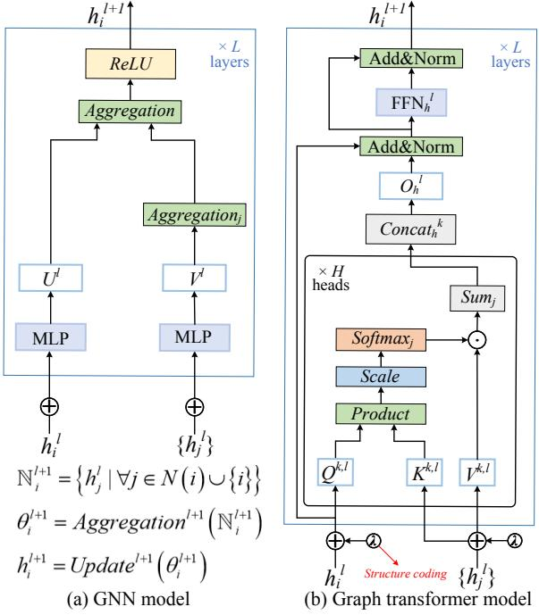

Fig. 1. The workflow of graph transformer

ings into the attention matrix, which makes their attention computation less regular than the dense token attention in conventional Transformers. As a result, existing block-matrix optimizations cannot fully address the computational and memory-access bottlenecks of graph transformer execution on large-scale graphs.

Second, graph transformer execution is fundamentally memory-bound, plagued by massive off-chip data movement originating from two primary reasons. The most severe challenge is the intermediate data explosion from the global attention mechanism; this all-to-all computation generates a massive  $O(N^2)$  intermediate attention matrix. For large graphs (e.g., N = 256K), this matrix is prohibitively large to buffer on-chip, forcing constant, high latency off-chip spilling and incurring  $O(N^2)$  in communication overhead. This issue is compounded by the high-dimensional input features inherent to graph data. Unlike text tokens, graph vertices carry large feature vectors ( $D_{feat} = 100\text{-}1000$ ) [21], [34], [43], meaning the  $N \times D_{feat}$  input matrix and the O(Nd) weight matrices often exceed on-chip storage capacity [14], [49], [50]. This dual bottleneck, managing the  $O(N^2)$  intermediate data while continuously streaming the large  $O(N \cdot D_{feat} + Nd)$  working set, saturates memory bandwidth and transforms the computational problem into a dominant memory access bottleneck.

Addressing these challenges, our analysis of graph transformer models yields two key insights. First, existing models rely on a fully-connected attention paradigm to capture high-order vertex relationships and maintain model accuracy [11], [47], an approach that neglects intrinsic graph topology and vertex data dependencies. This indicates that by leveraging these inherent dependencies, unnecessary attention computa-

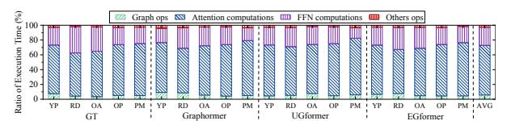

Fig. 2. The execution time breakdown of graph transformer inference

### TABLE II DETAILED INFORMATION OF DATASETS IN EVALUATION

| Datasets                  | #Vertices   | #Edges        | #Dimension | # Task             |
|---------------------------|-------------|---------------|------------|--------------------|
| Yelp(YP) [52]             | 716,847     | 13,954,819    | 300        | 100-class Classif. |
| Reddit (RD) [16]          | 232,965     | 114,615,892   | 602        | 41-class Classif.  |
| Ogbn-Arxiv (OA) [19]      | 169,343     | 1,166,243     | 128        | 40-class Classif.  |
| Ogbn-Products (OP) [19]   | 2,449,029   | 61,859,140    | 100        | 47-class Classif.  |
| Ogbn-Papers100M (PM) [19] | 111,059,956 | 1,615,685,872 | 128        | 172-class Classif. |

tions can be eliminated with negligible accuracy degradation. Second, unlike traditional transformers with their fixed input sequence, the vertex processing order in graph transformers is flexible [7], [39], [40]. This flexibility presents an opportunity to reorder vertex processing to optimize for data locality, minimizing cache misses and off-chip communication. Guided by these insights, we propose an effective *topology-aware* sparsification and merging approach to simultaneously reduce attention computations and data access costs. However, in purely software-based implementations, the associated runtime overheads can offset these gains, limiting the approach's overall effectiveness.

To overcome these limitations and harness the full potential of graph transformers, we introduce TAGT, the first co-designed, topology-aware accelerator that enables their efficient execution. At the algorithm level, TAGT introduces the Topology Dependency Subgraph (TDS), which is constructed with each target vertex plus a set of higher-order surrogate vertices formed by aggregating distant, non-target vertex features. Performing attention on the TDS faithfully approximates the full global interactions, thus maintaining high model fidelity while systematically eliminating unnecessary attention operations. Consequently, by systematically reducing the computational complexity, the TDS approach inherently accelerates both the training and inference phases of graph transformers. At the architecture level, TAGT integrates two specialized hardware components to support this approach: a data-driven loading and merging engine with specialized dataflow pipelines to accelerate TDS construction on the fly and minimize off-chip communication; a novel TDS-based fast attention unit explicitly co-designed with the TDS structure to maximize data parallelism.

We have implemented and evaluated TAGT on a Xilinx Alveo U280 FPGA card. For graph transformer, the results show that TAGT outperforms the state-of-the-art software frameworks, i.e., DGL [37] and TorchGT [55], running on Intel Xeon CPU and NVIDIA A100 GPU by on average 175.4x and 18.6x, with an average of 217.2x and 24.8x energy savings, respectively. Compared with the state-of-the-art GNN accelerators, i.e., FlowGNN [30], MEGA [60], and BingoGCN [44], TAGT obtains on average  $8.2\times$ ,  $6.9\times$ ,  $4.7\times$  speedups and  $9.3\times$ ,  $7.5\times$ ,  $5.2\times$  energy savings, respectively.

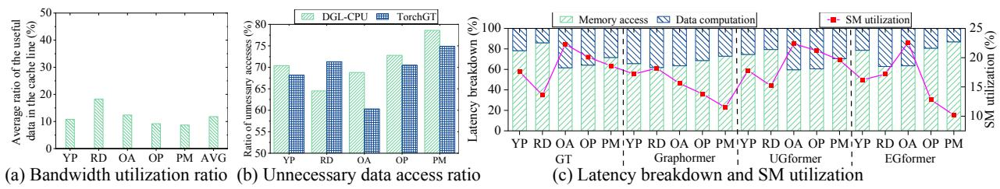

Fig. 3. (a) The cache line utilization ratio of TorchGT [55] running GT model on different datasets and (b) the ratio of the number of redundant data accesses to the total number of data accesses for GT model on TorchGT and (c) latency breakdown and SM utilization of TorchGT on NVIDIA Tesla A100

#### II. BACKGROUND AND MOTIVATION

#### A. Graph Transformer

Built on the canonical Transformer architecture [33], graph transformers [7], [11], [47] treat vertices as input tokens, enabling global (all-to-all) attention rather than being restricted to direct neighbors. To capture salient topological properties, they incorporate specialized structural encodings directly into the input features and the model's attention matrices.

Specifically, we construct a fully-connected directed graph G in which each vertex corresponds to a token in the input sequence. Note that every pair of vertices is connected and each vertex also possesses a self-loop. For a given vertex v, its embedding is updated using the embeddings of its neighboring vertices. Denote by N(v) the neighbor set of v in G (for the standard Transformer with fully connected attention, N(v) equals the set of all vertices). The embedding update of v at layer l is expressed as follows:

$$H^{v} = concat\left(\left\{h_{u}^{l}|u \in N\left(v\right)\right\}\right)$$

$$\bar{h}_{v}^{l+1} = soft \max\left(\frac{h_{v}^{l}W_{Q}\left(H^{v}W_{K}\right)^{T}}{\sqrt{d_{K}}}\right)H^{v}W_{V} \qquad (1)$$

$$h_{v}^{l+1} = FFN(\bar{h}_{v}^{l+1}) + \bar{h}_{v}^{l+1}$$

where  $h_v^l$  represents the embedding of vertex v at the layer l-th layer, while  $H^v$  is the embedding matrix of the neighboring vertices of v.  $W_Q$ ,  $W_K$ , and  $W_V$  are the learnable projection weight matrices for the query, key, and value, respectively.  $d_K$  is the second dimension of  $W_K$ . Note that common graph transformers also incorporate graph structure encoding based on the model described above. Taking Graphormer [47] as an example, the update rule for the initial embedding of vertex v in Equation 1 is given by  $h_v^{(0)} = x_v + z_{\deg^-(v)}^- + z_{\deg^+(v)}^+$  and the attention coefficient of  $A_v$  vertex v is computed by  $A_v = soft \max\left(\frac{h_v W_Q(h_u W_k)^T}{\sqrt{d_K}}\right) + bias_{\varphi(v,u)}$ , where  $x_v$  denotes the original feature vector of vertex v,  $z^-$ ,  $z^+ \in R^d$  represent learnable embeddings determined by the in-degree  $\deg^-(v)$  and out-degree  $\deg^+(v)$ . Additionally,  $bias_\varphi$  is a learnable scalar shared across all layers,  $\varphi(v,u)$  denotes the shortest path distance between vertices v and u, respectively.

#### B. Characterization of Graph Transformer Inference on GPU

The primary challenge in graph transformer inference is accelerating both attention and FFN computations. This is complicated by their inherently memory-bound nature and hybrid computation patterns. These models demand concurrent,

irregular access to diverse data (vertex features, structural encodings, and weights) while simultaneously performing dense matrix operations for attention and embedding updates. This mix of memory- and compute-bound tasks creates a significant bottleneck. To quantify this, we characterized four representative models on an NVIDIA A100 GPU using TorchGT [55] across five datasets (Table II), with the full experimental setup detailed in §V-A.

Execution Time Breakdown. Fig. 2 presents the inference time breakdown of graph transformer. The graph operations (i.e., operations related to obtaining topology structure information), attention computations, FFN computations, and other operations (i.e., additional operations) account for 5.68%, 67.08%, 24.53%, and 2.71%, respectively, averaged across models and datasets. Among these, attention and FFN computations dominate the execution time during graph transformer inference, as they involve loading the necessary data and computing numerous attention scores between target vertices and their associated neighbors to update vertex embeddings. This process incurs substantial data access and movement overheads, highlighting the need for a custom accelerator to ensure efficient execution.

Difference between GNN and Graph Transformer. Fig. 1 shows that the major differences between GNNs and graph transformers are: (1) Message-passing Mechanism vs. Global Attention Mechanism. GNNs typically rely on local messagepassing schemes, where each vertex aggregates information from its neighbors. In contrast, graph transformers use a global attention mechanism, allowing each vertex to attend to all other vertices in the graph, thereby capturing long-range dependencies more effectively. (2) Vertex Feature Propagation vs. Topology Structure Encoding. While GNNs naturally propagate information based on graph structure, graph transformers often integrate explicit graph structural encodings (e.g., shortest path distances) into the attention mechanism to capture complex relationships within the graph. Therefore, existing GNN solutions cannot directly provide efficient support for graph transformer models (detailed in §V).

#### C. Problems of the Existing Graph Transformer Solutions

Existing graph-learning systems and accelerators are poorly matched to efficient graph transformer (GT) inference. General-purpose GT implementations such as DGL [37] preserve the original  $O(N^2)$  global attention, where each vertex attends to all other vertices, leading to quadratic computation and prohibitive off-chip memory traffic as graph size

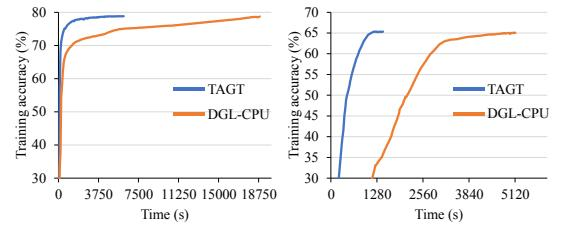

(a) Illustration the training Graphormer (b) Illustration the training Graph Transformer model on the *OP* dataset model on the *YP* dataset

Fig. 4. Model accuracy analysis of *TAGT* versus the DGL-CPU baseline across various datasets and models. This comparison evaluates *TAGT*'s sparse attention on the TDS against the DGL-CPU baseline, which implements the global attention on the fully-connected graph

increases. Meanwhile, representative GNN accelerators such as FlowGNN [30], MEGA [60], and BingoGCN [44] are primarily optimized for sparse message-passing workloads rather than dense all-to-all attention, making them inefficient when adapted to GT execution.

While specialized frameworks like TorchGT [55] attempt to reduce this cost using a dual-interleaved attention mechanism, they introduce three challenges: (1) Its optimizations depend on stringent topological prerequisites (i.e., Hamiltonian paths), which are NP-complete to verify and often unmet by real-world graphs. (2) Failing these prerequisites forces a costly fallback to the  $O(N^2)$  global mechanism. (3) Its selective attention approach can lead to significant model accuracy loss. Therefore, despite existing efforts, two major challenges remain in efficiently supporting graph transformer inference.

**Prohibitive Computational Complexity.** The standard multi-head attention mechanism in graph transformers treats the graph as fully connected, mandating an all-to-all computation among vertices irrespective of the underlying graph's actual (and often sparse) topology. This approach results in a computational complexity that scales quadratically  $(O(N^2))$  with the number of vertices (N), a property that makes large-scale application fundamentally non-scalable. Our profiling (Fig. 2) confirms that this attention and FFN calculation saturates the computational resources, consuming over 91.61% of the total execution time. This intense computational demand effectively starves all other pipeline stages, rendering their optimization almost negligible and identifying this module as the primary performance limiter.

Excessive Memory Access. Graph transformer execution is fundamentally memory-bound. The large working set, comprising high-dimensional vertex features and weight matrices, overwhelms on-chip memory capacity and forces constant off-chip data movement. This memory bottleneck is dominant; our profiling (Fig. 3(c)) shows that off-chip access consumes over 60.5% of total execution time, consequently starving the computational units (SMs) and depressing their utilization to below 25%. This inefficiency is exacerbated by two factors. First, the global attention mechanism is highly unnecessary; Fig. 3(b) reveals that over 60.3% of the data fetched from off-chip GPU memory is ultimately unnecessary on TorchGT. Second, existing sparse optimizations (e.g., TorchGT) trade

computational redundancy for access irregularity. Dictated by the irregular graph topology, these methods necessitate non-contiguous off-chip feature fetching, which significantly degrades spatial locality. As quantitatively shown in Fig. 3(a), only 18.27% of the fetched cache line data is utilized.

#### D. Challenges and Opportunities

While some graph transformer models incorporate local or adaptive attention modules to achieve linear complexity, this optimization typically comes at the high cost of significant accuracy degradation [39]–[41].

Furthermore, recent sub-quadratic graph transformer models demonstrate the promise of sparse or linear attention, but many rely on heuristic or data-sensitive sparsification strategies. For example, AnchorGT [59] introduces anchor-selection biases that can vary across graph topologies, reducing robustness across diverse real-world datasets and often requiring dataset-specific retuning to maintain performance. In addition, several existing approaches improve predictive accuracy by modifying the standard GT architecture and introducing auxiliary trainable components. These structural changes and adaptive sparsification routines can increase inference complexity and runtime overhead, as further discussed in §V-C. This inherent trade-off exposes a critical question:

#### Q1: Is it possible to design a sparse graph structure that eliminates unnecessary attention computations while incurring negligible accuracy degradation?

The answer is affirmative. The fundamental flaw in existing sparse optimizations is their naive pruning of connections, which irreversibly severs pathways for essential higher-order vertex interactions. Conversely, while the global attention mechanism maintains fidelity via this exhaustive, all-pairs traversal, it does so only at a prohibitive computational cost. The key opportunity, therefore, is to design a sparse subgraph that simultaneously preserves local topology and encapsulates these critical higher-order relationships. As shown in Fig. 4, our TAGT approach (detailed in §III-A) actualizes this principle, successfully resolving the performance-accuracy dilemma: in exchange for a slight and consistently negligible degradation in final accuracy (more detailed accuracy analysis can be found in  $\S V-C$ ), TAGT achieves an over  $3\times$  acceleration in training efficiency and convergence speed over the prohibitive global attention baseline.

Traditional transformer-based LLMs effectively employ KV Caching to reduce redundant computations during autoregressive inference, reusing K/V projections of previously processed tokens [9], [53]. This established optimization leads to a critical question:

## Q2: Can this KV caching paradigm be directly applied to graph transformer models?

The answer is fundamentally no. This optimization is architecturally incompatible with graph transformers, which lack the fixed sequential processing order that KV Caching exploits. Graph Transformers operate on unordered vertex sets via a dynamic, all-to-all interaction model, breaking the stable past token dependency required for caching. This reveals a new

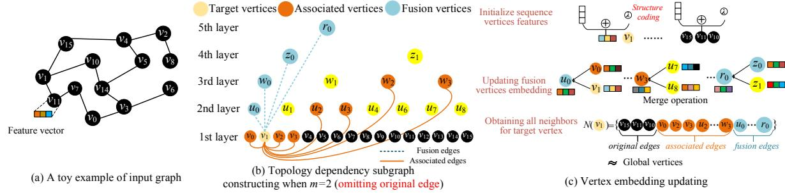

Fig. 5. An example to illustrate our approach

opportunity. While the full graph's unordered nature thwarts caching, the structured dependency model of our sparse TDS subgraph does not. We therefore propose a TDS-based fast attention mechanism to improve data parallelism while maintaining better data locality (detailed in §IV-B).

#### III. OVERVIEW OF OUR APPROACH

Based on the above insights, we propose an effective topology-aware sparsification and merging approach for graph transformer. This section first introduces our idea and then discusses the limitations of software-only implementations.

#### A. Topology-aware Sparsification and Merging Approach

While both Graph Transformers and LLMs utilize attention to capture long-range dependencies, they operate on fundamentally different paradigms. LLMs adhere to autoregressive sequential processing, whereas GTs operate on unordered vertex sets. This distinction enables GTs to leverage sparse attention mechanisms, but it also defines their central challenge: how to aggressively reduce the  $O(N^2)$  complexity without sacrificing the critical, long-range dependencies essential for maintaining model fidelity. To resolve this performance-accuracy trade-off, we introduce a simple yet highly effective topological sparsification approach.

Topology Dependency Subgraph Constructing. To efficiently approximate global attention, we introduce the Topology Dependency Subgraph (TDS). The TDS is a sparse, treelike structure designed to capture long-range dependencies while significantly reducing computational complexity. Our approach employs a bottom-up hierarchical aggregation mechanism. As shown in Fig. 5 (b), the input sequence (length N) forms the base layer (leaves). We then recursively merge groups of m memory-contiguous vertices (e.g., m = 2) along the native 1D input order to form fusion vertices in the subsequent layer. As a result, TDS does not rely on topologydriven reordering and avoids its associated preprocessing overheads, while still maintaining competitive predictive fidelity and structural expressiveness (further detailed in §V-E). This fusion vertex holds an aggregated feature representation of its children, designed to faithfully encapsulate their combined information. This process is repeated for approximately  $\log_m(N)$  layers until a single root vertex is formed, which

1This is because the sparse attention mechanisms in existing graph transformers (e.g., TorchGT [55]) fully account for the correlation relationships inherent within the graph structure itself.

encapsulates the context of the entire sequence. The resulting TDS contains the N original vertices and approximately N/(m-1) fusion vertices (for  $m\geq 2$ ). By performing attention on this far smaller graph, a target vertex can interact with local neighbors (leaves) and long-range contexts (highlevel fusion vertices) simultaneously. This design creates a clear trade-off: a smaller m (e.g., m=2) results in a deeper tree with higher fidelity (less information loss from aggregation) but more computational overhead. The choice of m is further discussed in  $\S V-E$ .

To efficiently approximate global attention while maintaining topological fidelity, the TDS introduces three distinct edge types: original edges, fusion edges, and association edges. Original edges correspond to the edges in the input graph and are preserved to maintain the fine-grained local neighborhood structure. The other two novel edge types, described below, are constructed to create computational shortcuts that capture long-range and multi-granularity interactions. Fusion edges are bottom-up, directed edges that enable hierarchical aggregation. They connect the original vertices (leaves) to their ancestor fusion vertices, allowing each fusion vertex to compute its embedding by directly gathering information from all its descendants. As illustrated in Fig. 5 (b) (with m=2), the fusion vertex  $w_0$  (at layer 2) aggregates the four original vertices  $v_0, v_1, v_2$ , and  $v_3$ . Consequently, directed fusion edges are added from each of these leaves to  $w_0$  (e.g.,  $v_0 \rightarrow w_0, v_1 \rightarrow w_0$ , etc.). This directly connects the baselayer vertices to their high-level representations, dramatically shortening the path for information to flow upward.

Association edges are directed towards a target vertex (e.g.,  $v_{0,k}$ ), allowing it to systematically gather information from other nodes at multiple granularities. The construction is a recursive, layer-by-layer process, adding m associated vertices from the left and right at each level. For example, to construct the right-side associations for target  $v_1$  (where k=1) with m=2, the process begins at the base layer (l=0) by selecting m neighbors starting from  $p_0=k+1=2$ . This adds edges from  $v_2$  and  $v_3$ . The starting index for the next layer (l=1) is then recursively calculated,  $p_1=parent(p_0+m)=parent(2+2)=parent(4)$ , which maps to the fusion vertex  $v_2$ . The process then selects m vertices starting from  $v_2$  (i.e.,  $v_2, v_3$ ). A key mechanism is used to ensure the vertex sets remain mutually exclusive: if the last index ( $p_l+m-1$ ) is odd, the next vertex in that layer is also included, and the next

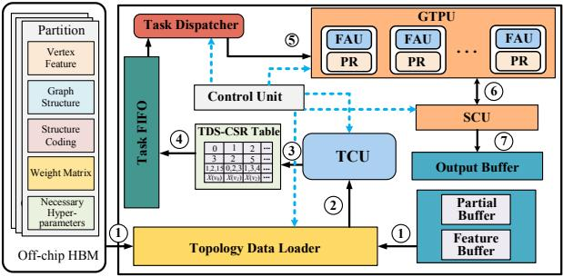

FAU: Fast Attention Unit TCU: TDS Construction Unit SCU: Specific Computing Unit
PR: Private Register GTPU: Graph Transformer Processing Unit
Control Flow Data Flow

Fig. 6. TAGT architecture

layer's starting index is adjusted  $(p_{l+1} = parent(p_l + m + 1))$ . This process repeats up the tree, connecting  $v_1$  to a set of finegrained  $(v_2, v_3)$  and coarse-grained  $(u_2, u_3, w_2, w_3)$  vertices that collectively, yet sparsely, cover the entire graph.

Vertex Embedding Updating based on TDS. The embedding update process consists of two distinct stages, as illustrated in Fig. 5 (c). First, a bottom-up hierarchical aggregation pass is performed to compute the features for all fusion vertices. These vertices form the coarse-grained context. For instance, the feature vector for the fusion vertex  $u_0$  is generated by aggregating its constituent children,  $v_0$  and  $v_1$ . This process continues recursively up to the root. Second, after the fusion vertices are populated, the target vertex attention computation is executed. To update the target vertex (e.g.,  $v_1$ ), the TDS identifies its complete 1-hop attention neighborhood as defined by the union of its edges. This neighborhood set is composed of: original edges (e.g., local neighbor  $v_0$ ), association edges (e.g., distant, coarse-grained context  $u_2$ ), and fusion edges (e.g., its direct ancestors  $u_0$  and  $w_0$ ). The final embedding of  $v_1$  is then obtained by performing the multi-head attention computation (Equation 1) over this aggregated set. The power of this approach is evident: by construction, the TDS places critical local context  $(v_0)$ , multigranularity information  $(u_2)$ , and even full global context (the root) directly into the 1-hop attention neighborhood of the target vertex. This design allows the model to retain its ability to learn global information, achieving the effect of a multihop message passing mechanism but with the efficiency of a single, sparse attention operation.

Complexity and Connectivity Benefits of TDS. Performing attention on the TDS provides a dual benefit, addressing both computational complexity and information propagation. Computationally, the TDS transforms the  $O(N^2)$  global attention bottleneck into a highly scalable  $O(mN\log_m N)$  problem, which fundamentally resolves the massive activation memory and dense gradient update bottlenecks inherent to traditional graph transformers. As our analysis (see §V-E) demonstrates that m can be a small constant (i.e., 2), the practical complexity of our approach becomes  $O(N\log N)$ . This dramatic efficiency gain is achieved without sacrificing the model's expressive power. This is because the TDS edge construction guarantees that any two arbitrary original vertices

 $(v_i,v_j)$  are connected by a path of at most two hops (e.g.,  $v_i \rightarrow$  ancestor  $\rightarrow v_j$  via fusion and association edges). This structural guarantee ensures that the model retains the effect of global connectivity while operating with near-linear computational efficiency.

#### B. Theoretical Error Characterization of TDS

Let  $A \in \mathbb{R}^{N \times N}$  and  $\hat{A} \in \mathbb{R}^{N \times N}$  denote the full and TDS-sparse attention matrices, respectively. For vertex i, let  $\mathcal{T}_i(m)$  be the retained TDS neighborhood and  $K \triangleq |\mathcal{T}_i(m)|$ . In TDS, each vertex attends to  $\mathcal{O}(m \log_m N)$  connections, and the total attended edges scale as  $\mathcal{O}(mN \log_m N)$ .

Let  $h_i$  and  $\hat{h}_i$  be the outputs under full attention and TDS attention, and define  $\Delta h_i \triangleq h_i - \hat{h}_i$ . Under the Lipschitz continuity of Softmax with constant L and bounded value vectors V, the perturbation satisfies

$$\|\Delta h_i\|_2 \le L\|V\|_2 \sum_{j \notin \mathcal{T}_i(m)} \alpha_{ij} + \varepsilon_{\text{fus}}(m),$$
 (2)

where  $\varepsilon_{\rm fus}(m)$  denotes the fusion-induced coarsening error and is nondecreasing in m. Assuming a heavy-tailed decay of ranked attention weights, i.e.,  $\alpha_{i,(k)} \leq c \, k^{-\beta}$  with  $\beta > 1$  [7], [11], [15], [47], [59], the tail mass satisfies

$$\sum_{j \notin \mathcal{T}_i(m)} \alpha_{ij} \le \sum_{k > K} c \, k^{-\beta} = \mathcal{O}(K^{1-\beta}). \tag{3}$$

Combining (2) and (3) gives

$$\|\Delta h_i\|_2 \le \mathcal{O}((m\log_m N)^{1-\beta}) + \varepsilon_{\text{fus}}(m). \tag{4}$$

Equation (4) shows that TDS error is jointly determined by structural truncation and fusion coarsening. Thus, m controls a fidelity–efficiency trade-off: smaller m reduces coarsening error, while larger m reduces latency but increases sparsity and reduces accuracy. In the limiting case m=N, TDS degenerates to exact  $\mathcal{O}(N^2)$  global attention.

#### C. Benefits of Custom Design

While our topology-aware approach yields significant gains on General-Purpose Processors (GPPs) (Fig. 9), its full potential is fundamentally constrained by the limitations of these architectures. GPPs are notoriously inefficient at handling the irregular memory access overheads induced by our dynamic, sparse TDS gathering, which leads to memory-bound execution. Furthermore, GPPs lack the specialized mechanisms required to exploit the massive inter-vertex data reuse (e.g., shared fusion ancestors) inherent in our on the fly, per-vertex TDS construction, resulting in substantial redundant computation and data fetching. This issue is further compounded by the softmax dependency, which introduces data-dependent synchronization, preventing the fine-grained data parallelism that GPPs rely on. These critical bottlenecks, irregular memory access, data redundancy, and limited parallelism, represent a fundamental mismatch for general-purpose architectures, necessitating the design of a dedicated accelerator to fully unlock the efficiency of our approach.

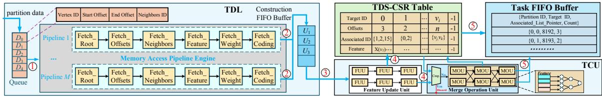

Fig. 7. The details of microarchitecture of TDL and TCU

#### IV. TAGT ARCHITECTURE OVERVIEW

In this section, we introduce the topology-aware accelerator, *TAGT*, to unleash the performance of our approach. *TAGT* contains several hardware units, i.e., Topology Data Loader, TDS Construction Unit, Task Dispatcher, Graph Transformer Processing Unit, Specific Computing Unit, and some on-chip buffers, as shown in Fig. 6. These components work together to efficiently execute the topology-aware sparsification and merging approach for graph transformer.

**Topology Data Loader (TDL)**. The TDL is the hardware data-management unit orchestrating data flow between off-chip HBM and on-chip memory. Given a partition of the input sequence, the TDL is responsible for fetching the requisite vertex topology, initial features, and structural encoding data from HBM. To exploit data locality and minimize redundant off-chip access, the TDL can also source necessary data directly from the on-chip buffers (1). All gathered data is then forwarded to the *TDS Construction Unit* (TCU) (2) to construct the TDS for the target vertices.

**TDS Construction Unit (TCU).** The TCU is a specialized hardware pipeline that constructs the TDS for each target vertex on the fly. It first utilizes a Feature Update Unit (FUU) to process original vertex features from the TDL, concatenating initial features with structural encodings to generate the base-level (leaf) vertex embeddings. These embeddings are then fed into the Merge Operation Unit (MOU), which uses multi-level parallel pipelines to recursively aggregate leaf features and compute the embeddings for all fusion vertices based on the merge size m, which is programmed into its onchip configuration registers. Critically, the MOU integrates a hardware-managed redundancy elimination mechanism. When constructing the TDS for a batch of target vertices, this mechanism identifies common fusion ancestors (e.g., shared high-level parents) and ensures their embeddings are computed only once, thereby eliminating redundant computations and maximizing inter-vertex data reuse. Concurrently, the TCU's control logic assembles the complete TDS sparse graph structure (original, fusion, and association edges) and stores it in the TDS-CSR table ((3)).

**Task Dispatcher**. It is activated when the *Task FIFO* is not empty. It fetches the information from the *Task FIFO* and generates fine-grained computation tasks for each target vertex (4). The dispatcher's core scheduling logic then involves packing these individual tasks into a consolidated workload packet. This packet is systematically forwarded to the *Graph Transformer Processing Unit*. Upon ingestion, the processing unit's internal arbitration logic takes over, partitioning the packet's workload and dynamically scheduling the sub-tasks

among its pool of available *Fast Attention Units* (FAUs) ( ⑤ ). Each FAU then independently computes the requisite attention scores, facilitating a high degree of concurrent processing for the attention mechanism.

Graph Transformer Processing Unit (GTPU). The GTPU is a specialized processing element designed to support both attention score generation and value aggregation within its core FAUs. Each FAU integrates two types of processing elements: an Update Processing Element (UPE) for Matrix-Matrix (MM) operations, such as FFNs and raw attentionscore computation, and a Vector Processing Element (VPE) for Vector-Matrix (VM) operations, such as value aggregation after softmax normalization. During attention execution, the UPE computes the raw attention scores between a target vertex and its associated TDS vertices and streams these scores to the Specific Computing Unit (SCU) without materializing the intermediate attention matrix in memory ( 6 ). The SCU then performs block-centric softmax normalization and generates normalized partial contributions for value aggregation. These normalized contributions are consumed by the VPE to produce the final target-vertex embedding. This score-streaming and contribution-based dataflow avoids storing dense attention scores while preserving the standard softmax-attention semantics over the TDS neighborhood. Efficiency is further enhanced by local partial-sum accumulation in the UPE's Private Registers (PRs), and the configurable nature of the units provides flexibility across different models.

Specific Computing Unit (SCU). The SCU is a specialized functional unit architected to efficiently execute the nonlinear, element-wise, and reduction operations essential for Graph Transformers. It integrates three primary components: an Element-wise Computing Unit, a Reduction Unit, and an Activation Unit. The SCU's core innovation is its implementation of a block-centric asynchronous softmax mechanism, which fundamentally overcomes the low parallelism induced by the global data dependencies in standard softmax. This mechanism decouples the computation, allowing the Element-wise Unit to process independent vector blocks in parallel (e.g.,  $e^{x_i-\phi}$ ) while the Reduction Unit performs a single, final accumulation of these partial results, thereby eliminating costly inter-block synchronization. Concurrently, the Activation Unit provides support for other critical non-linearities, such as ReLU for the FFN. Final results from the SCU's Output Buffer are then either written back to off-chip HBM or cached directly in the Structure and Feature Buffer to stage them as input for the subsequent attention layer ( 7 ).

**On-chip Buffers.** The on-chip memory is composed of several buffers, e.g., *Partial Buffer, Feature Buffer, Weight* 

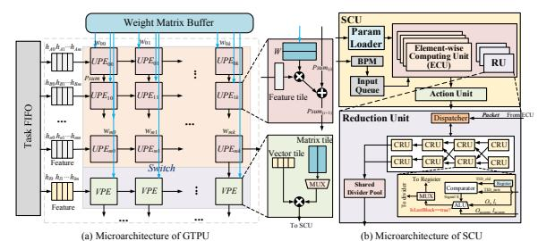

Fig. 8. Microarchitecture of TAGT: (a) the design details of GTPU; (b) the design details of SCU

*Matrix* buffer, and *Output Buffer*, which are employed to cache various data (e.g., partial results, vertex features, weight matrices, and output results) to improve data reuse and reduce unnecessary off-chip communications. Note that *TAGT* adopts the ping-pong buffering technology [5] to decouple the different operations for all buffers to hide the access latency.

#### A. Data-driven Data Loading and Merging Mechanism

Upon partition arrival (e.g.,  $D_0$ ), as shown in Fig. 7, the TDL activates its *Memory Access Pipeline Engine* (MAPE) to retrieve associated graph data ( ① ). MAPE utilizes multiple 6-stage hardware pipelines for efficient, staged retrieval. The pipeline stages (*Fetch\_Root*, *Fetch\_Offsets*, *Fetch\_Neighbors*) identify target vertices and their neighborhood data from the CSR-based structure. Concurrently, *Fetch\_Features*, *Fetch\_Weight*, and *Fetch\_Coding* retrieve the corresponding feature vectors, model weights, and structural embeddings. To mitigate HBM latency and prevent pipeline stalls, *TAGT* replicates the *Fetch\_Neighbors* and *Fetch\_Features* units. This parallelization balances the pipeline by masking memory access latency. The aggregated data is then transferred to the *Construction FIFO Buffer* for processing by the *TDS Construction Unit* (TCU) ( ② ).

Once the TCU receives data, its parallel FUUs generate initial vertex embeddings by integrating raw features with their structural coding data (3). TAGT is agnostic to the specific semantics of structural or positional encodings (SE/PE), provided that they are materialized as per-vertex dense vectors before entering the TCU. This property is enabled by the FUU, which serves as the entry stage of the TCU and initializes the leaf embeddings of the TDS. At the microarchitectural level, the FUU performs synchronized fetching of raw vertex features and encoding vectors from decoupled on-chip buffers, lightweight concatenation-based fusion of these input streams, and a standard linear projection to produce unified base-level embeddings for the downstream TDS construction pipeline. Since the FUU treats SE/PE inputs purely as auxiliary vector payloads rather than invoking encoding-specific graph operators, supporting different vectorized SE/PE schemes does not require fundamental microarchitectural changes beyond inputdimension adaptation and configuration updates. Note that this agnosticism also extends to encoding schemes requiring online graph-specific operators for modern GTs. Subsequently, these embeddings processed by FUU are stored in the TDS-CSR *Table* and concurrently streamed to the MOU ((4)).

TABLE III
DETAILED INFORMATION OF GRAPH TRANSFORMER MODELS

| Models                 | #Layers | #Hidden Dimension | #Head |
|------------------------|---------|-------------------|-------|
| Graph Transformer [11] | 4       | 128               | 12    |
| Graphormer [47]        | 4       | 768               | 8     |
| UGformer [27]          | 4       | 384               | 4     |
| Edge Transformer [4]   | 8       | 200               | 4     |

|   | Resource | GT    | Graphormer | UGformer | EGformer |  |
|---|----------|-------|------------|----------|----------|--|
| ſ | DSP      | 77.2% | 80.2%      | 73.6%    | 75.8%    |  |
|   | LUT      | 42.6% | 49.5%      | 40.1%    | 45.2%    |  |
|   | FF       | 34.9% | 35.2%      | 30.4%    | 33.6%    |  |
|   | BRAM     | 62.4% | 69.7%      | 59.3%    | 64.5%    |  |
|   | UltraRAM | 82.4% | 89.7%      | 80.3%    | 85.6%    |  |

The MOU, which employs multi-stage parallel addition trees for high-fan-in aggregation, merges and updates features for the fusion and associated vertices. Crucially, the MOU incorporates a deduplication logic. By checking the TDS-CSR Table, it skips generation for any previously processed fusion vertex (whose ID is pre-calculable), thereby eliminating redundant computation. The finalized TDS-CSR Table thus contains the target vertices, their offsets, and the complete lists of associated IDs and features. The TDS-CSR Table subsequently feeds the Task FIFO Buffer (5), populating it with compact task descriptors (e.g., Partition ID, Target ID, Associated List Pointer, Count) rather than full feature vectors. Note that the count tracks the number of completed associated vertex computations for each target vertex, ensuring all interactions are processed before finalization. Finally, the Task Dispatcher pulls these descriptors to execute its core optimization. It inspects the associated ID lists (via the pointers) across multiple pending tasks. By identifying identical Associated IDs shared by different Target IDs, it coalesces the workload. This allows the dispatcher to issue a single, packed data request to the GTPU, enabling the computation for a shared associated feature to be reused across multiple target vertices and serving many attention matrix calculations in one highly efficient dispatch cycle.

#### B. TDS-based Fast Attention Strategy

As depicted in Fig. 8, each FAU is organized around two tightly coupled datapaths: a UPE datapath for MM-style computation and a VPE datapath for VM-style aggregation. The UPE first computes raw attention scores for the target vertex over its TDS-associated vertices. Instead of writing these scores to an intermediate attention matrix, TAGT streams them directly to the SCU, where block-centric softmax normalization is performed. The SCU computes normalized partial contributions and forwards them to the VPE, which completes the weighted value aggregation. Therefore, the fused attention pipeline follows a score-streaming path from UPE to SCU and a contribution-aggregation path from SCU to VPE, eliminating dense attention-score materialization while preserving the original attention semantics. Conversely, for MM-dominant workloads such as FFNs, the configurable Switch activates the Reconfigured MM mode in Fig. 8, where the VPE's MAC resources are combined with the UPE resources to form a

TABLE V
SYSTEM CONFIGURATIONS OF THE COMPARED ACCELERATOR BASELINES.

| Configuration     | FlowGNN [30]              | MEGA [60]                                         | BingoGCN [44]                                        | TAGT                                                                                                                                  |
|-------------------|---------------------------|---------------------------------------------------|------------------------------------------------------|---------------------------------------------------------------------------------------------------------------------------------------|
| Frequency         | 300 MHz                   | 1 GHz                                             | 300 MHz                                              | 280 MHz                                                                                                                               |
| Compute Resources | 747 DSPs                  | 4,096 MACs                                        | 1,539 DSP-equivalent resources                       | 4,096 MACs                                                                                                                            |
| Main Units        | 8 NT units 16 MP units | $4 \times 8 \times 32$ BSEs 256 aggregation units | 1 combination engine 1 aggregation engine 1 CMO unit | 16 FAUs, 8 FUUs, 8 MOUs, 1 SCU, 256 UPEs, and 128 VPEs per FAU                                                                        |
| On-chip Memory    | 5 MB                      | 5 MB                                              | 4.5 MB                                               | 1 MB Feature Mem., 1 MB Weight Mem., 512 KB Partial Buffer, 512 KB TDS-CSR Table, 128 KB Task FIFO, and 128 KB Output Buffer |
| Off-chip Memory   | 460 GB/s HBM2             | 460 GB/s HBM2                                     | 460 GB/s HBM2                                        | 460 GB/s HBM2                                                                                                                         |

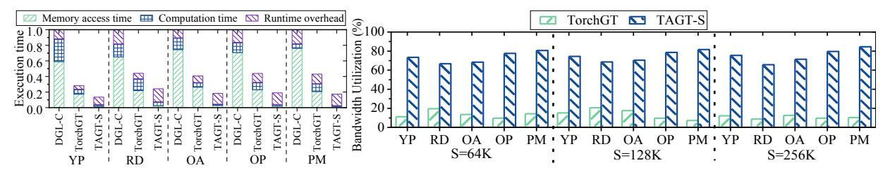

(a)Normalized execution time of TAGT-S compared with different software frameworks on the GT model (b)Bandwidth utilization of TAGT-S and TorchGT on the GT model under different sequence lengths

Fig. 9. Performance of TAGT-S against different software systems over different datasets

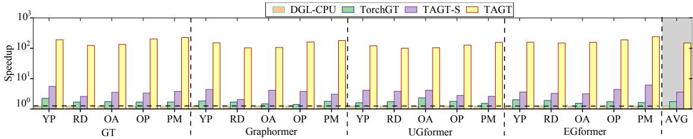

Fig. 10. Comparative performance of normalized to that of DGL-CPU

larger MM engine. This dual-mode organization improves hardware utilization across both attention and FFN phases.

Upon completion, the raw attention scores (S) computed by the FAU are streamed to the SCU. At the SCU's ingress, a Block Partition Module (BPM) segments this incoming stream of scores into fixed-size chunks (e.g.,  $S_i$ ). These blocks are then enqueued into the Input Queue, effectively creating the atomic partial tasks for the asynchronous computation. The SCU is architected to execute a block-centric asynchronous partial-contribution softmax computation, which comprises a Param Loader, Input Queue, an array of Element-wise Computing Units (ECUs), a stateful Reduction Unit (RU), and an Activation Unit (AU). The dataflow begins when the Param Loader provides the crucial context, including the unified maximum value ( $\phi$ ), TargetVertexID (TID), and IsFirst/LastBlock flags, to an available ECU. The ECU pulls a raw score block  $(S_i)$  and fetches the corresponding Value (V) vectors, computing the block-wise partial components: the local partial numerator  $O_j = \sum_{i \in S_j} e^{s_i - \phi} \cdot v_i$  and the local partial denominator  $l_j = \sum_{i \in S_j} e^{s_i - \phi}$ . Note that the summation  $(\sum)$  in these equations specifically denotes the localized aggregation within a single discrete chunk  $(S_i)$  rather

than the global sequence. These are then dispatched as a

tagged packet {TID, IsFirstBlock, IsLastBlock,  $O_i, l_i$ } to RU.

The RU, the stateful core of the SCU, consists of a central Dispatcher, an array of Core Reduction Units (CRUs) (e.g., 64), and a Shared Divider Pool. Each CRU contains a Comparator, Registers (for TID\_Tag, O\_accum, l\_accum), and a Merge ALU. The O\_accum and l\_accum registers store the intermediate accumulated numerator (a vector) and denominator (a scalar), respectively, for the specific *TID* being processed by that CRU. When a packet arrives, the *Dispatcher* broadcasts its TID to all CRUs. The Comparators check in parallel: on a Hit, the corresponding CRU's Merge ALU asynchronously integrates the packet's payload into the global context  $(O_{\text{accum\_new}} = O_{\text{accum}} + O_j, l_{\text{accum\_new}} = l_{\text{accum}} + l_j);$ on a Miss, the Dispatcher allocates a free CRU to initialize its registers with the packet's data. Crucially, when a CRU processes a packet with the IsLastBlock flag set, its internal logic performs the final global reduction and sends a division request to the Dispatcher. The Dispatcher arbitrates this request and assigns a free unit from the Shared Divider Pool to perform the final normalization  $Output = O_{\mathrm{final}}/l_{\mathrm{final}}.$  This allows the CRU to immediately clear its state and accept a new task, while the final normalized embedding is forwarded to the AU (e.g., for ReLU). Note that this execution logic

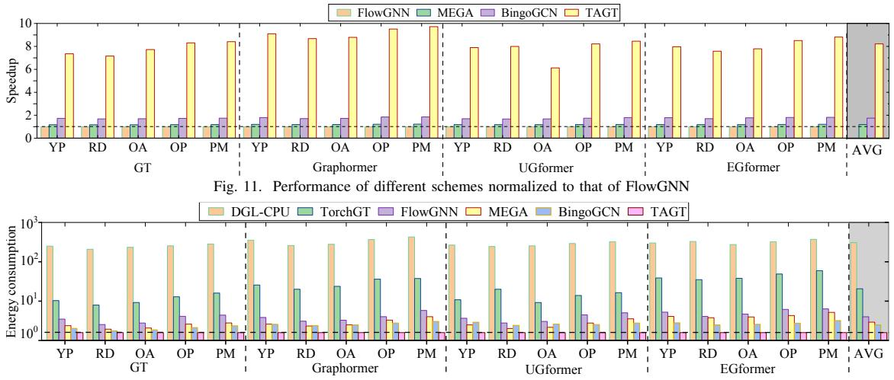

Fig. 12. Energy consumption of different solutions normalized to that of TAGT

extends to computing attention scores between a target vertex and its associated vertices in other partitions. After computing a partition's attention scores, the results are held in the partial buffer. The target vertex's feature is retained in the feature buffer to prevent redundant fetches for subsequent partitions. Once all computations for the target vertex are complete, the final result is sent to the *Output Buffer* for writeback to HBM.

#### V. EXPERIMENTAL EVALUATION

#### A. Experimental Setup

TAGT Setting. We implemented *TAGT* on a Xilinx Alveo U280 FPGA accelerator card, which features a XCU280 FPGA chip equipped with 1.08 million LUTs,9 MB of on-chip BRAM, 30 MB of on-chip UltraRAM, 9,024 DSP slices, and two 4 GB HBM2 stacks, providing a total memory bandwidth of 460 GB/s. To determine the clock rate for *TAGT*, we employed Xilinx Vivado 2019.1 and conservatively set the operating frequency to 280 MHz for our experiments.

Benchmarks and Graph Datasets. Table II summarizes five widely-used datasets for graph transformer research [11], [16], [19], [47], [55] used in the evaluation, i.e., Yelp (YP), Reddit (RD), Ogbn-Arxiv (OA), Ogbn-Products (OP), and Ogbn-Papers100M (PM). We evaluate TAGT using four widely recognized graph transformer models: Graph Transformer (GT) [11], Graphormer [47], and UGformer [27], and Edge Transformer (abbreviated as EGformer) [4]. As shown in Table III, we follow the hyperparameter configurations reported in their original papers as closely as possible. The resource utilization of TAGT across all evaluated models is presented in Table IV.

**Baselines and Evaluation Metrics.** The performance of *TAGT* is compared with five solutions, i.e., DGL-CPU (v2.4.0) [37], TorchGT [55], FlowGNN [30], MEGA [60], and BingoGCN [44]. DGL-CPU is the best-performing solution on the CPU platform, and TorchGT is the state-of-the-art framework for Graph Transformer training on GPU. In our experiments, DGL-CPU is running on the 32-core Intel Xeon

Platinum 8357B processors running at 2.6 GHz, 503 GB DDR4 RAM, and 16 memory channels. TorchGT runs on the NVIDIA Tesla A100 GPU with 6,912 cores and 80 GB HBM. FlowGNN, MEGA, and BingoGCN, are the cutting-edge hardware GNN accelerators. The configurations of these baseline accelerators and our *TAGT* are listed in Table V. Running Average Power Limit [2] are used to estimate the CPU energy consumption. The GPU energy is obtained by NVIDIA System Management Interface (nvidia-smi) [1]. Note that, to evaluate our software approach, we have also modified DGL to use our *topology-aware sparsification and merging approach* to support graph transformer inference, and this software implementation is called *TAGT-S*. Note that *TAGT-S* runs on the above A100 GPU in the following experiments.

To ensure experimental fairness, since DGL-CPU, FlowGNN, MEGA, and BingoGCN do not natively support the global attention mechanism [30], [37], [44], [60], we must first clarify a fundamental difference: FlowGNN, MEGA, and BingoGCN are hardware accelerators meticulously optimized for sparse GNN message-passing (e.g., GCN [21], GAT [34]), not the dense global attention inherent in Graph Transformers. Therefore, to establish a baseline that demonstrates the limitations of existing sparse-optimized hardware, we adapted their frameworks to execute the  $O(N^2)$  all-to-all interactions required by a global attention mechanism. We acknowledge that this represents a worst-case dense workload for these sparse accelerators, a task they were never designed to perform. This comparison is thus included not as a direct performance race, but to motivate the critical need for a new architecture (i.e., TAGT), which is specifically designed to accelerate (and sparsify) this dense attention workload. Additionally, to ensure the creation of strong and equitable baselines, we meticulously preserved and leveraged the native optimization techniques inherent to each framework during this process. For example, MEGA's degree aware mixed-precision quantization was retained to accelerate its dense attention computation, ensuring a

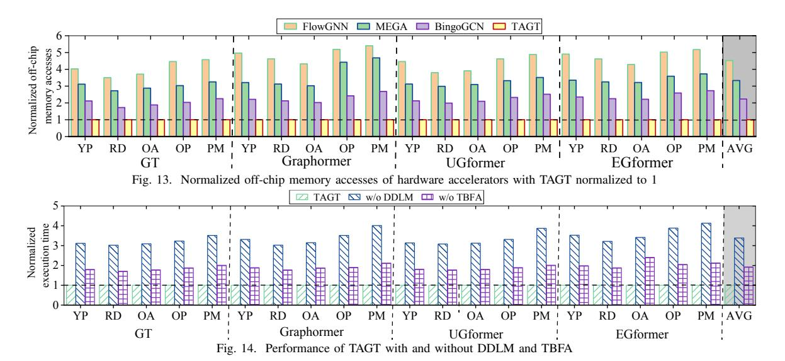

best-effort implementation for each compared system.

#### B. Experimental Results

Comparison with Software Systems. Fig. 9 (a) presents the normalized execution time of various solutions, decomposed into memory access time, computation time, and runtime overhead. As shown, TAGT-S consistently surpasses TorchGT, which incurs  $1.8\times$  to  $2.5\times$  higher execution time. This gap is driven by TorchGT's significantly higher data access and attention computation overheads. The root cause of this performance gap is that these general graphs lack the Hamiltonian path structure required by TorchGT's core optimizations, forcing it to revert to a costly  $O(N^2)$  global attention. TAGT-S, however, is specifically designed to sparsify this exact workload, directly circumventing this bottleneck.

Fig. 9 (b) provides the bandwidth utilization of TAGT-S and TorchGT. The results show that TAGT-S sustains high bandwidth utilization (above 60%) across different sequence lengths. This efficiency is attributed to its capability to drastically reduce attention computations, thereby slashing unnecessary off-chip communication and improving data locality. However, Fig. 9 (a) reveals that the TAGT-S software implementation is ultimately constrained by its own high runtime overhead, which accounts for 69.8%-86.1% of its total execution time. TAGT (our hardware accelerator) is specifically engineered to eliminate this bottleneck. By utilizing dedicated hardware pipelines and the TDS-based fast attention engine, TAGT converts this software overhead into efficient, parallel computation, further reduces memory access latency, and significantly boosts overall performance. As illustrated in Fig. 10, TAGT ultimately outperforms DGL-CPU and TorchGT by 103.8x-282.6x (175.4× on average) and  $9.4 \times -34.2 \times (18.6 \times \text{ on average})$ , respectively.

**Comparison with GNN Accelerators.** Fig. 11 shows that TAGT outperforms FlowGNN, MEGA, and BingoGCN by  $8.2 \times, 6.9 \times$ , and  $4.7 \times$  on average, respectively. The key reason is that these GNN accelerators are primarily optimized for

TABLE VI
ACCURACY COMPARISON OF *TAGT* WITH DGL-CPU [37] AND TORCHGT [55].

| Models             | Solutions             | Model Accuracy (%) |        |            |               |                 |  |
|--------------------|-----------------------|--------------------|--------|------------|---------------|-----------------|--|
| Widucis            |                       | Yelp               | Reddit | Ogbn-Arxiv | Ogbn-Products | Ogbn-Papers100M |  |
|                    | DGL-CPU               | 65.98              | 98.02  | 57.97      | 78.08         | 65.96           |  |
| Graph Transformer  | TorchGT               | 63.05              | 93.98  | 56.72      | 76.06         | 63.16           |  |
| Grapii Transformer | TAGT(Ours)            | 65.23              | 97.11  | 57.86      | 77.91         | 65.35           |  |
|                    | Accuracy drop of TAGT |                    |        | 0.1        | 1-0.91 pp     |                 |  |
|                    | DGL-CPU               | 62.33              | 95.65  | 56.55      | 78.91         | 65.98           |  |
| Graphormer         | TorchGT               | 60.18              | 91.96  | 53.67      | 73.47         | 62.04           |  |
| Graphornici        | TAGT(Ours)            | 62.30              | 95.54  | 56.45      | 78.82         | 65.43           |  |
|                    | Accuracy drop of TAGT |                    |        | 0.0        | 3-0.55 pp     |                 |  |
|                    | DGL-CPU               | 65.34              | 97.13  | 58.98      | 79.32         | 64.89           |  |
| UGformer           | TorchGT               | 64.17              | 94.33  | 56.64      | 77.33         | 62.78           |  |
| OGIOIIIICI         | TAGT(Ours)            | 65.06              | 96.89  | 58.23      | 78.48         | 64.67           |  |
|                    | Accuracy drop of TAGT |                    |        | 0.23       | 2-0.84 pp     |                 |  |
| EGformer           | DGL-CPU               | 63.88              | 96.16  | 58.35      | 79.78         | 66.43           |  |
|                    | TorchGT               | 62.45              | 94.68  | 56.21      | 77.87         | 62.74           |  |
|                    | TAGT(Ours)            | 63.75              | 95.28  | 58.11      | 78.95         | 66.35           |  |
|                    | Accuracy drop of TAGT |                    |        | 0.0        | 8-0.88 pp     |                 |  |

sparse message-passing workloads, whereas GT inference is dominated by dense all-to-all attention. When adapted to GT execution, they still need to process an  $O(N^2)$  attention workload, which introduces substantial intermediate data movement and irregular off-chip accesses. In contrast, TAGT uses TDS as its native execution representation. By merging non-target vertices into higher-order surrogate vertices, TDS preserves essential local and long-range dependencies while avoiding full attention materialization. More importantly, TAGT's hardware pipeline is co-designed around this compact representation: the data-driven loading and merging engine constructs TDSs on the fly, while the TDS-based fast attention unit directly exploits the resulting sparse structure for parallel attention execution. As shown in Fig. 13, this co-design reduces off-chip memory traffic by 42.1%-81.6% across hardware baselines, including 78.3%-81.5% over FlowGNN, thereby translating the algorithmic sparsity of TDS into higher end-to-end throughput.

**Analysis of Energy Consumption.** Fig. 12 shows that TAGT reduces energy consumption by  $217.2 \times$  over DGL-CPU and  $24.8 \times$  over TorchGT on average. Compared with FlowGNN, MEGA, and BingoGCN, TAGT achieves average energy savings of  $9.3 \times$ ,  $7.5 \times$ , and  $5.2 \times$ , respectively. These gains come from both the TDS-based algorithmic reduction and the specialized hardware support in TAGT. At the algo-

TABLE VII
ABLATION STUDY OF TAGT-S ORDERING STRATEGIES AND EDGE
RETENTIONS ON GT MODEL OVER Yelp USING NVIDIA A100 GPU

| Model Configuration      | Prep. Time | Accuracy (%) | Hit Rate (%) | Inference Latency (ms) | Norm. speedup |
|--------------------------|------------|--------------|--------------|------------------------|---------------|
| DGL-CPU Baseline         | -          | 65.98        | -            | 130.4                  | 1.0×          |
| TAGT-S (Local-only)      | -          | 56.12        | 22.5         | 15.6                   | 8.36×         |
| TAGT-S (Random Ordering) | 1 ms       | 65.08        | 14.7         | 22.2                   | 5.87×         |
| TAGT-S (Degree-Sorted)   | 4 ms       | 65.28        | 15.4         | 21.8                   | 5.98×         |
| TAGT-S (Community-based) | 853 ms     | 65.32        | 18.3         | 21.1                   | 6.18×         |
| TAGT-S (BFS Ordering)    | 18 ms      | 65.41        | 20.8         | 20.9                   | 6.24×         |
| TAGT-S (METIS Ordering)  | 3235 ms    | 65.48        | 21.3         | 20.5                   | 6.36×         |

Prep. Time estimates the offline ordering overhead for the Yelp datase

Local only restricts attention to original addes

rithm level, TDS-based sparse attention reduces the number of attention operations and avoids materializing the dense intermediate attention matrix. At the architecture level, the data-driven loading and merging engine filters and merges graph data before attention computation, reducing unnecessary HBM transactions and improving on-chip data reuse. The dedicated on-chip buffers further retain compact TDS metadata, partial results, and reusable features, avoiding repeated off-chip accesses. In addition, the TDS-based fast attention unit maps the sparse TDS workload onto a parallel and pipelined datapath, reducing control overhead and improving compute utilization. Therefore, *TAGT*'s energy advantage is not simply a consequence of shorter execution time; it results from jointly reducing attention computation, off-chip memory traffic, and hardware orchestration overhead.

#### C. Accuracy Analysis of Graph Transformer

Table VI compares the model accuracy of TAGT with DGL-CPU and TorchGT. DGL-CPU serves as the full-attention reference that preserves the original  $O(N^2)$  global attention, while TorchGT represents a sparse-attention graph transformer baseline. In this evaluation, the input sequence length is fixed to 16K across all models, and each reported accuracy is averaged over 100 independent runs.

Compared with the full-attention DGL-CPU reference, *TAGT* incurs only marginal accuracy degradation. Across all evaluated datasets and graph transformer models, the accuracy drop remains below 1 percentage point (pp), i.e., 0.11–0.91 pp for Graph Transformer, 0.03–0.55 pp for Graphormer, 0.22–0.84 pp for UGformer, and 0.08–0.88 pp for EGformer. This result indicates that the proposed TDS-based sparsification preserves the dominant global-context information required by graph transformer inference.

The accuracy advantage of TAGT over TorchGT mainly comes from its topology-aware merging mechanism. Instead of directly discarding distant vertices or relying on a fixed sparse attention pattern, TAGT compresses non-target vertices into higher-order surrogate vertices, thereby retaining their aggregated contextual information in the TDS. In contrast, TorchGT's dual-interleaved attention can be more sensitive to dataset structure and may lose long-range interactions that are not covered by its sparse attention pattern. As a result, TAGT consistently achieves accuracy close to the full-attention DGL-CPU reference while providing higher accuracy than TorchGT across all evaluated models and datasets.

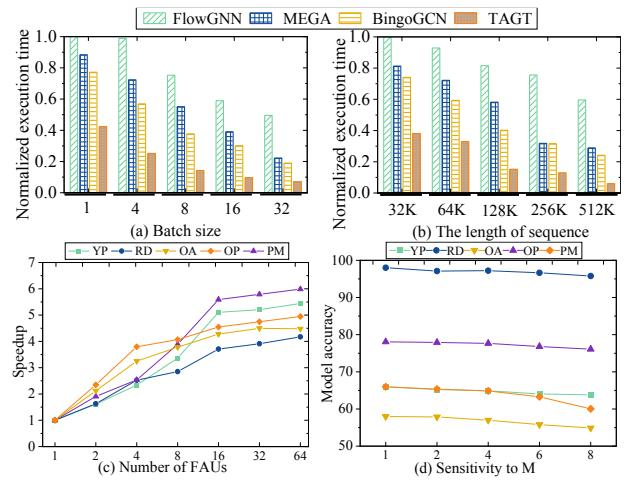

Fig. 15. Sensitivity studies of TAGT: (a) sensitivity to batch size; (b) sensitivity to the sequence length; (c) sensitivity to FAUs; (d) sensitivity to the hyperparameter m

#### D. Effectiveness of TAGT's Designs

Fig. 14 quantifies the performance impact of *TAGT*'s core components: the *Data-driven Data Loading and Merging* (DDLM) mechanism and the *TDS-based Fast Attention* (TBFA) scheme.

**DDLM.** This mechanism attacks data movement and compute bottlenecks by eliminating redundant 'fusion vertex' generation and employing deeply pipelined memory access. This strategy yields an average  $4.41\times$  speedup compared to *TAGT* without DDLM (i.e., w/o DDLM), contributing 71.38% of the total performance gain.

**TBFA.** The TBFA scheme leverages the accelerator's codesigned hardware (e.g., the fused-pipeline FAU and asynchronous SCU) to execute attention on the optimized TDS data structure. This replaces the costly, dense  $O(N^2)$  global attention with a parallel, hardware-accelerated sparse workload, effectively converting the software overheads of TAGT-S into efficient computation. This enhancement yields the remaining  $2.48\times$  average speedup over the TAGT variant without TBFA (i.e., w/o TBFA), accounting for 28.62% of the total performance improvement.

#### E. Sensitivity Studies

Fig. 15 (a) shows that *TAGT*'s performance (on the GT model) scales positively with batch size due to increased data parallelism. However, to ensure a fair comparison under resource constraints, we adopted a fixed batch size of 32 for all primary baseline experiments. Fig. 15 (b) evaluates the sensitivity to the length of sequence. Performance improves as the sequence length increases, since longer sequences better utilize hardware parallelism. This trend peaks at a sequence length of 512K, beyond which performance is saturated as the system becomes bottlenecked by memory bandwidth. Fig. 15 (c) explores the impact of the number of FAUs. Performance scales with additional compute units until the system becomes bottlenecked by memory bandwidth, at which point adding more FAUs yields diminishing returns. Fig. 15 (d) analyzes the accuracy impact of the TDS hyperparameter m. A larger

m does not necessarily yield higher accuracy; the model consistently achieves the highest accuracy at m = 2. Furthermore, as m increases, each fusion vertex aggregates more original vertices, reducing hierarchy depth and fusion overhead but increasing information compression and weakening finegrained topological fidelity. Therefore, larger m improves efficiency at the cost of predictive accuracy, and m = 2 is chosen as the optimal balance between accuracy and efficiency.

To evaluate the structural robustness of TDS, Table VII presents an ablation study over different graph ordering strategies on the *YP* dataset. Restricting attention to original local edges yields the highest L2 cache hit rate (22.5%) and the lowest latency (15.6 ms), but significantly degrades accuracy to 56.12%, confirming the necessity of TDS-preserved longrange structural interactions. Across non-local-only ordering strategies, TAGT-S maintains stable accuracy (65.08%– 65.48%) and consistent end-to-end speedups (5.87×–6.36×) over the DGL baseline, indicating strong robustness to vertex ordering. The key reason is that TDS does not derive its global modeling capability from a specific vertex order; instead, it relies on the hierarchical fusion-and-association structure, which systematically preserves local topology through original edges while exposing each target vertex to distant graph context through multi-level fusion vertices and associated edges. Different orderings only change which vertices are grouped together at each merge step, thereby slightly affecting local semantic coherence and hardware locality, but they do not alter the existence of these global structural pathways. This is exactly why removing TDS global links in the localonly setting causes a large accuracy drop, whereas changing the ordering from random to METIS yields only marginal variation. Although more advanced orderings such as METIS slightly improve the L2 cache hit rate (up to 21.3%) and reduce latency, these gains are marginal relative to their substantial offline preprocessing cost (3,235 ms). Even naive random ordering preserves most of TAGT-S's benefits, indicating that the main acceleration and expressiveness gains come from the intrinsic structural efficiency of TDS rather than expensive graph reordering.

#### VI. RELATED WORK

Software GNN and Graph Transformer Frameworks. Software GNN systems [35], [38], [57], including DGL [37] and PyG [12], mainly optimize sparse message-passing primitives such as SpMM-based 1-hop aggregation. They therefore do not efficiently support the dense all-to-all attention pattern in GTs, whose O(N2 ) computation and intermediate states incur substantial memory pressure. Specialized GT systems such as TorchGT [55] reduce attention cost through structureguided sparse attention, but their effectiveness depends on graph-specific structural properties and can degrade when such patterns fail to preserve sufficient long-range interactions.

Hardware GNN and LLM Accelerators. Existing hardware acceleration efforts mainly target either GNNs or LLMs. GNN accelerators [14], [20], [54], [58], such as HyGCN [45] and NTGAT [18], are optimized for sparse message-passing dataflows, including CSR/CSC traversal, neighbor aggregation, and workload balancing over irregular graphs. However, GT inference introduces dense attention over vertex pairs, which does not match these sparse aggregation-centric designs. In contrast, LLM accelerators [28], [36], [53] focus on dense GEMM, regular token sequences, and autoregressive decoding. They lack topology-aware mechanisms for handling the hybrid workload of GTs, where dense attention computation is coupled with irregular graph-structured data access.

Sparsification Methods for Graph Transformers. Several GT sparsification methods [13], [29], [31], [39]–[41], [59] reduce global attention to sparse, sub-quadratic, or approximately linear forms. Representative methods such as ANS-GT [56] and AnchorGT [59] use sampling- or anchor-based mechanisms to approximate long-range dependencies. While effective in reducing attention complexity, these heuristic strategies can be sensitive to graph topology, require datasetspecific tuning, and introduce auxiliary inference overhead. In contrast, TDS provides a deterministic, parameter-free, and hardware-friendly sparsification mechanism. By preserving global context through structured topology-aware merging rather than probabilistic selection, TDS enables robust sparsification and efficient accelerator mapping.

LLM Compression and Sparse Attention Techniques. LLM compression and sparse-attention techniques [8], [22], [25], [42], [46] reduce model cost by exploiting quantization, pruning, or structured attention patterns. However, these techniques are designed for regular token sequences, where token order carries semantic meaning and attention patterns can often be defined by position. They cannot be directly applied to GTs because graph vertices have arbitrary input order and their dependencies are determined by irregular topology rather than sequence position. Applying sequence-oriented sparsity to graph attention may discard critical structural dependencies, motivating a topology-aware sparsification approach.

#### ACKNOWLEDGMENT

We thank the anonymous reviewers for their insightful comments. Wei Zhang (wei.zhang@ust.hk) is the corresponding author of this paper. This paper is supported by the UGC CRF grant C5032-23G and ACCESS—AI Chip Center for Emerging Smart Systems, the InnoHK initiative of ITC.

#### VII. CONCLUSION

This paper presents *TAGT*, the first topology-aware accelerator for efficient graph transformer inference. By constructing the Topology Dependency Subgraph (TDS) through sparsification and merging, *TAGT* enables sparse attention while preserving essential local and long-range interactions. Its data-driven loading and merging engine and TDS-based fast attention unit reduce both attention computation and offchip memory traffic. Experimental results show that *TAGT* achieves an average speedup of 18.6× over a state-of-the-art GPU-based graph transformer system.

#### REFERENCES

- [1] "Nvidia system management interface," https://developer.nvidia.com/ nvidia-system-management-interface, 2021.
- [2] "Running average power limit," https://www.intel.com/content/www/ us/en/developer/articles/technical/software-security-guidance/advisoryguidance/running-average-power-limit-energy-reporting.html, 2024.
- [3] U. Alon and E. Yahav, "On the bottleneck of graph neural networks and its practical implications," in *Proceedings of the 9th International Conference on Learning Representations*, 2021, pp. 1–16.
- [4] L. Bergen, T. J. O'Donnell, and D. Bahdanau, "Systematic generalization with edge transformers," in *Proceedings of the 2021 Advances in Neural Information Processing Systems*, 2021, pp. 1390–1402.
- [5] C. Chen, K. Li, Y. Li, and X. Zou, "ReGNN: A redundancy-eliminated graph neural networks accelerator," in *Proceedings of the 28th IEEE International Symposium on High-Performance Computer Architecture*, 2022, pp. 429–443.
- [6] D. Chen, Y. Lin, W. Li, P. Li, J. Zhou, and X. Sun, "Measuring and relieving the over-smoothing problem for graph neural networks from the topological view," in *Proceedings of the 34th AAAI Conference on Artificial Intelligence*, 2020, pp. 3438–3445.
- [7] J. Chen, K. Gao, G. Li, and K. He, "NAGphormer: A tokenized graph transformer for node classification in large graphs," in *Proceedings of the 11th International Conference on Learning Representations*, 2023, pp. 1–16.
- [8] Z. Chen, Z. Qu, Y. Quan, L. Liu, Y. Ding, and Y. Xie, "Dynamic N: M fine-grained structured sparse attention mechanism," in *Proceedings of the 28th ACM SIGPLAN Annual Symposium on Principles and Practice of Parallel Programming*, 2023, pp. 369–379.
- [9] T. Dao, D. Y. Fu, S. Ermon, A. Rudra, and C. Re, "FlashAttention: Fast ´ and memory-efficient exact attention with io-awareness," in *Proceedings of the 2022 Advances in Neural Information Processing Systems*, 2022, pp. 16 344–16 359.
- [10] M. Defferrard, X. Bresson, and P. Vandergheynst, "Convolutional neural networks on graphs with fast localized spectral filtering," in *Proceedings of the 2016 Annual Conference on Neural Information Processing Systems*, 2016, pp. 3837–3845.
- [11] V. P. Dwivedi and X. Bresson, "A generalization of transformer networks to graphs," *CoRR*, vol. abs/2012.09699, pp. 1–10, 2020.
- [12] M. Fey and J. E. Lenssen, "Fast graph representation learning with pytorch geometric," *CoRR*, vol. abs/1903.02428, pp. 1–9, 2019.
- [13] E. Frantar and D. Alistarh, "SparseGPT: Massive language models can be accurately pruned in one-shot," in *Proceedings of the 2023 International Conference on Machine Learning*, vol. 202, 2023, pp. 10 323–10 337.
- [14] T. Geng, C. Wu, Y. Zhang, C. Tan, C. Xie, H. You, M. C. Herbordt, Y. Lin, and A. Li, "I-GCN: A graph convolutional network accelerator with runtime locality enhancement through islandization," in *Proceedings of the 54th Annual IEEE/ACM International Symposium on Microarchitecture*, 2021, pp. 1051–1063.
- [15] J. E. Gonzalez, Y. Low, H. Gu, D. Bickson, and C. Guestrin, "PowerGraph: Distributed graph-parallel computation on natural graphs," in *Proceedings of the 10th USENIX Symposium on Operating Systems Design and Implementation*, 2012, pp. 17–30.
- [16] W. Hamilton, Z. Ying, and J. Leskovec, "Inductive representation learning on large graphs," in *Proceedings of the 2017 Advances in Neural Information Processing Systems*, 2017, pp. 1024–1034.
- [17] V. T. Hoang and O. Lee, "A survey on structure-preserving graph transformers," *CoRR*, vol. abs/2401.16176, pp. 1–12, 2024.
- [18] W. Hou, K. Zhong, S. Zeng, G. Dai, H. Yang, and Y. Wang, "NTGAT: A graph attention network accelerator with runtime node tailoring," in *Proceedings of the 28th Asia and South Pacific Design Automation Conference*, 2023, pp. 645–650.
- [19] W. Hu, M. Fey, M. Zitnik, Y. Dong, H. Ren, B. Liu, M. Catasta, and J. Leskovec, "Open graph benchmark: Datasets for machine learning on graphs," in *Proceedings of the 2020 Advances in Neural Information Processing Systems*, 2020, pp. 22 118–22 133.
- [20] R. Hwang, M. Kang, J. Lee, D. Kam, Y. Lee, and M. Rhu, "GROW: A row-stationary sparse-dense GEMM accelerator for memory-efficient graph convolutional neural networks," in *Proceedings of the 2023 IEEE International Symposium on High-Performance Computer Architecture*, 2023, pp. 42–55.

- [21] T. N. Kipf and M. Welling, "Semi-supervised classification with graph convolutional networks," in *Proceedings of the 5th International Conference on Learning Representations*, 2017, pp. 1–14.
- [22] W. Kwon, S. Kim, M. W. Mahoney, J. Hassoun, K. Keutzer, and A. Gholami, "A fast post-training pruning framework for transformers," in *Proceedings of the 2022 Advances in Neural Information Processing Systems*, 2022, pp. 24 101–24 116.
- [23] J. Li, Q. Zhang, W. Liu, A. B. Chan, and Y. Fu, "Another perspective of over-smoothing: Alleviating semantic over-smoothing in deep gnns," *IEEE Transactions on Neural Networks and Learning Systems*, vol. 36, no. 4, pp. 6897–6910, 2025.
- [24] J. Li, Q. Zhang, S. Xu, X. Chen, L. Guo, and Y. Fu, "Curriculumenhanced residual soft an-isotropic normalization for over-smoothness in deep gnns," in *Proceedings of the 38th AAAI Conference on Artificial Intelligence*, 2024, pp. 13 528–13 536.
- [25] J. Lin, J. Tang, H. Tang, S. Yang, W. Chen, W. Wang, G. Xiao, X. Dang, C. Gan, and S. Han, "AWQ: activation-aware weight quantization for on-device LLM compression and acceleration," in *Proceedings of the 7th Annual Conference on Machine Learning and Systems*, 2024, pp. 1–14.
- [26] C. Morris, M. Ritzert, M. Fey, W. L. Hamilton, J. E. Lenssen, G. Rattan, and M. Grohe, "Weisfeiler and leman go neural: Higher-order graph neural networks," in *Proceedings of the 33rd AAAI Conference on Artificial Intelligence*, 2019, pp. 4602–4609.
- [27] D. Q. Nguyen, T. D. Nguyen, and D. Q. Phung, "Universal graph transformer self-attention networks," in *Proceedings of the 2022 Companion of The Web Conference*, 2022, pp. 193–196.
- [28] Y. Qin, Y. Wang, Z. Zhao, X. Yang, Y. Zhou, S. Wei, Y. Hu, and S. Yin, "MECLA: memory-compute-efficient LLM accelerator with scaling sub-matrix partition," in *Proceedings of the 51st ACM/IEEE Annual International Symposium on Computer Architecture*, 2024, pp. 1032–1047.
- [29] L. Rampasek, M. Galkin, V. P. Dwivedi, A. T. Luu, G. Wolf, and ´ D. Beaini, "Recipe for a general, powerful, scalable graph transformer," in *Proceedings of the 2022 Advances in Neural Information Processing Systems*, 2022, pp. 14 501–14 515.
- [30] R. Sarkar, S. Abi-Karam, Y. He, L. Sathidevi, and C. Hao, "Flowgnn: A dataflow architecture for real-time workload-agnostic graph neural network inference," in *Proceedings of the 2023 IEEE International Symposium on High-Performance Computer Architecture*, 2023, pp. 1099–1112.
- [31] H. Shirzad, A. Velingker, B. Venkatachalam, D. J. Sutherland, and A. K. Sinop, "Exphormer: Sparse transformers for graphs," in *Proceedings of the 2023 International Conference on Machine Learning*, vol. 202, 2023, pp. 31 613–31 632.
- [32] J. Topping, F. D. Giovanni, B. P. Chamberlain, X. Dong, and M. M. Bronstein, "Understanding over-squashing and bottlenecks on graphs via curvature," in *Proceedings of the 10th International Conference on Learning Representations*, 2022, pp. 1–30.
- [33] A. Vaswani, N. Shazeer, N. Parmar, J. Uszkoreit, L. Jones, A. N. Gomez, L. Kaiser, and I. Polosukhin, "Attention is all you need," in *Proceedings of the 2017 Advances in Neural Information Processing Systems*, 2017, pp. 5998–6008.
- [34] P. Velickovic, G. Cucurull, A. Casanova, A. Romero, P. Lio, and ` Y. Bengio, "Graph attention networks," in *Proceedings of the 6th International Conference on Learning Representations*, 2018, pp. 1–13.
- [35] C. Wang, D. Sun, and Y. Bai, "PiPAD: Pipelined and parallel dynamic GNN training on gpus," in *Proceedings of the 28th ACM SIGPLAN Annual Symposium on Principles and Practice of Parallel Programming*, 2023, pp. 405–418.
- [36] H. Wang, Z. Zhang, and S. Han, "SpAtten: Efficient sparse attention architecture with cascade token and head pruning," in *Proceedings of the 2021 IEEE International Symposium on High-Performance Computer Architecture*, 2021, pp. 97–110.
- [37] M. Wang, L. Yu, D. Zheng, Q. Gan, Y. Gai, Z. Ye, M. Li, J. Zhou, Q. Huang, C. Ma, Z. Huang, Q. Guo, H. Zhang, H. Lin, J. Zhao, J. Li, A. J. Smola, and Z. Zhang, "Deep Graph Library: Towards efficient and scalable deep learning on graphs," *CoRR*, vol. abs/1909.01315, pp. 1–18, 2019.
- [38] Y. Wang, B. Feng, G. Li, S. Li, L. Deng, Y. Xie, and Y. Ding, "GNNAdvisor: An adaptive and efficient runtime system for GNN acceleration on gpus," in *Proceedings of the 15th USENIX Symposium on Operating Systems Design and Implementation*, 2021, pp. 515–531.

- [39] Q. Wu, C. Yang, W. Zhao, Y. He, D. Wipf, and J. Yan, "Difformer: Scalable (graph) transformers induced by energy constrained diffusion," in *Proceedings of the 11th International Conference on Learning Representations*, 2023, pp. 1–26.
- [40] Q. Wu, W. Zhao, Z. Li, D. P. Wipf, and J. Yan, "NodeFormer: A scalable graph structure learning transformer for node classification," in *Proceedings of the 2022 Advances in Neural Information Processing Systems*, 2022, pp. 27 387–27 401.
- [41] Q. Wu, W. Zhao, C. Yang, H. Zhang, F. Nie, H. Jiang, Y. Bian, and J. Yan, "Simplifying and empowering transformers for large-graph representations," in *Proceedings of the 2023 Advances in Neural Information Processing Systems*, 2023, pp. 64 753–64 773.
- [42] G. Xiao, J. Lin, M. Seznec, H. Wu, J. Demouth, and S. Han, "SmoothQuant: Accurate and efficient post-training quantization for large language models," in *Proceedings of the 2023 International Conference on Machine Learning*, vol. 202, 2023, pp. 38 087–38 099.
- [43] K. Xu, W. Hu, J. Leskovec, and S. Jegelka, "How powerful are graph neural networks?" in *Proceedings of the 7th International Conference on Learning Representations*, 2019, pp. 1–14.
- [44] J. Yan, H. Ito, Y. Nagahara, K. Kawamura, M. Motomura, T. V. Chu, and D. Fujiki, "BingoGCN: Towards scalable and efficient GNN acceleration with fine-grained partitioning and SLT," in *Proceedings of the 52nd Annual International Symposium on Computer Architecture*, 2025, pp. 1910–1924.
- [45] M. Yan, L. Deng, X. Hu, L. Liang, Y. Feng, X. Ye, Z. Zhang, D. Fan, and Y. Xie, "HyGCN: A GCN accelerator with hybrid architecture," in *Proceedings of the 2020 IEEE International Symposium on High Performance Computer Architecture*, 2020, pp. 15–29.
- [46] Z. Yao, R. Y. Aminabadi, M. Zhang, X. Wu, C. Li, and Y. He, "ZeroQuant: Efficient and affordable post-training quantization for largescale transformers," in *Proceedings of the 2022 Advances in Neural Information Processing Systems*, 2022, pp. 27 168–27 183.
- [47] C. Ying, T. Cai, S. Luo, S. Zheng, G. Ke, D. He, Y. Shen, and T. Liu, "Do transformers really perform badly for graph representation?" in *Proceedings of the 2021 Advances in Neural Information Processing Systems 34: Annual Conference on Neural Information Processing Systems*, 2021, pp. 28 877–28 888.
- [48] H. Yu, Y. Zhang, L. He, B. Peng, J. Zhao, Z. Wang, H. Qi, and H. Jin, "Tagnn: An efficient topology-aware accelerator for high-performance dynamic graph neural network," in *Proceedings of the 2025 International Conference for High Performance Computing, Networking, Storage and Analysis*, 2025, pp. 237–249.
- [49] H. Yu, Y. Zhang, L. He, Y. Zhao, X. Li, R. Xin, J. Zhao, X. Liao, H. Liu, B. He, and H. Jin, "RAHP: a redundancy-aware accelerator for highperformance hypergraph neural network," in *Proceedings of the 2024 International Symposium on Microarchitecture*, 2024, pp. 1264–1277.
- [50] H. Yu, Y. Zhang, J. Zhao, Y. Liao, Z. Huang, D. He, L. Gu, H. Jin, X. Liao, H. Liu, B. He, and J. Yue, "RACE: an efficient redundancyaware accelerator for dynamic graph neural network," *ACM Transactions on Architecture and Code Optimization*, vol. 20, no. 4, pp. 53:1–53:26, 2023.
- [51] C. Yuan, K. Zhao, E. E. Kuruoglu, L. Wang, T. Xu, W. Huang, D. Zhao, H. Cheng, and Y. Rong, "A survey of graph transformers: Architectures, theories and applications," *CoRR*, vol. abs/2502.16533, pp. 1–27, 2025.
- [52] H. Zeng, H. Zhou, A. Srivastava, R. Kannan, and V. K. Prasanna, "Graphsaint: Graph sampling based inductive learning method," in *Proceedings of the 8th International Conference on Learning Representations*, 2020, pp. 1–19.
- [53] S. Zeng, J. Liu, G. Dai, X. Yang, T. Fu, H. Wang, W. Ma, H. Sun, S. Li, Z. Huang, Y. Dai, J. Li, Z. Wang, R. Zhang, K. Wen, X. Ning, and Y. Wang, "FlightLLM: Efficient large language model inference with a complete mapping flow on fpgas," in *Proceedings of the 2024 ACM/SIGDA International Symposium on Field Programmable Gate Arrays*, 2024, pp. 223–234.
- [54] B. Zhang, R. Kannan, and V. K. Prasanna, "BoostGCN: A framework for optimizing GCN inference on FPGA," in *Proceedings of the 29th IEEE Annual International Symposium on Field-Programmable Custom Computing Machines*, 2021, pp. 29–39.
- [55] M. Zhang, J. Sun, Q. Hu, P. Sun, Z. Wang, Y. Wen, and T. Zhang, "TORCHGT: A holistic system for large-scale graph transformer training," in *Proceedings of the 2024 International Conference for High Performance Computing, Networking, Storage, and Analysis*, 2024, pp. 1–17.

- [56] Z. Zhang, Q. Liu, Q. Hu, and C. Lee, "Hierarchical graph transformer with adaptive node sampling," in *Proceedings of the 2022 Advances in Neural Information Processing Systems*, 2022, pp. 21 171–21 183.
- [57] J. Zhou, G. Cui, S. Hu, Z. Zhang, C. Yang, Z. Liu, L. Wang, C. Li, and M. Sun, "Graph neural networks: A review of methods and applications," *AI Open*, vol. 1, pp. 57–81, 2020.
- [58] Z. Zhou, B. Shi, Z. Zhang, Y. Guan, G. Sun, and G. Luo, "Block-GNN: Towards efficient GNN acceleration using block-circulant weight matrices," in *Proceedings of the 58th ACM/IEEE Design Automation Conference*, 2021, pp. 1009–1014.
- [59] W. Zhu, G. Song, L. Wang, and S. Liu, "Anchorgt: Efficient and flexible attention architecture for scalable graph transformers," in *Proceedings of the 33rd International Joint Conference on Artificial Intelligence*, 2024, pp. 5707–5715.
- [60] Z. Zhu, F. Li, G. Li, Z. Liu, Z. Mo, Q. Hu, X. Liang, and J. Cheng, "MEGA: A memory-efficient GNN accelerator exploiting degree-aware mixed-precision quantization," in *Proceedings of the 2024 IEEE International Symposium on High-Performance Computer Architecture*, 2024, pp. 124–138.