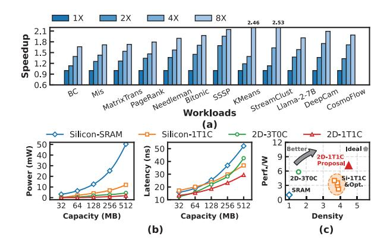
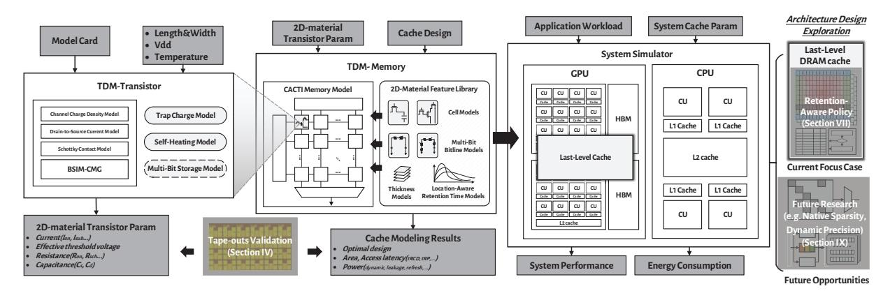
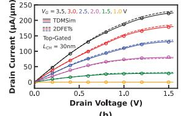
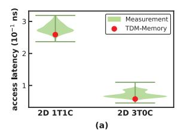

# TDMSim: Enabling High-Density and Energy-Efficient GPU DRAM Caches with 2D-Materials for Data-Intensive Applications

Chao Fu† Shaoxin Laboratory Fudan University Shaoxing, China cfu19@fudan.edu.cn

Xiangqi Dong State Key Laboratory of ICS Fudan University Shanghai, China xqdong21@m.fudan.edu.cn

WenZhong Bao State Key Laboratory of ICS Fudan University Shanghai, China baowz@fudan.edu.cn

Jingyang Zheng† State Key Laboratory of ICS Fudan University Shanghai, China 24212020260@m.fudan.edu.cn

> Zheng Cao State Key Laboratory of ICS Fudan University Shanghai, China 25113040054@m.fudan.edu.cn

Peng Zhou State Key Laboratory of ICS Fudan University Shanghai, China pengzhou@fudan.edu.cn

Xinliu He State Key Laboratory of ICS Fudan University Shanghai, China 23112020008@m.fudan.edu.cn

> Yuning Zhan State Key Laboratory of ICS Fudan University Shanghai, China 25213040240@m.fudan.edu.cn

Jun Han∗ State Key Laboratory of ICS Fudan University Shanghai, China junhan@fudan.edu.cn

*Abstract*—Modern GPUs provision increasingly large last-level caches (LLCs) to sustain the high data-reuse demands of artificial intelligence and high-performance computing workloads. As capacity scales, conventional cache designs are fundamentally constrained by a tightly coupled trade-off among density, access latency, and energy. Two-dimensional (2D) materials, with intrinsically low leakage current and atomic-scale thickness, offer a promising approach for building high-density, energy-efficient cache arrays. However, architects lack a cross-level design methodology that can propagate device-level characteristics of 2D materials into quantitative architectural guidance, leaving the system-level potential of 2D-material caches unexplored.

To this end, we present TDMSim, a validated cross-level simulation toolkit that bridges transistor-level, circuit-level, and system-level modeling for 2D-material-based architectures. Based on this toolkit, we integrate 2D-material DRAM cache designs into a CPU-GPU system, and propagate the intrinsic retentiontime variability of 2D-material arrays to system-level metrics. To mitigate the impact of this variability, we design a retentionaware policy that steers 2D-material DRAM caches toward their ideal performance limit, achieving a 75.6% reduction in access interference rate and a 65.4% reduction in refresh energy.

We evaluate the above proposed 2D-material DRAM caches under realistic GPU workloads, observing a 79.4% reduction in energy consumption alongside a 42.1% improvement in system performance under the same area budget as an SRAM cache. Moreover, 2D-material DRAM caches deliver 25.4% higher performance and 42.7% lower energy consumption than conventional DRAM caches with state-of-the-art optimizations.

- † Equal contribution
- ∗ Corresponding author

TDMSim will be released as open source to foster cross-level research on emerging 2D materials and to establish device-aware modeling as a general methodology for future 2D-material-based architectures.

*Index Terms*—cross-level simulation toolkit, DRAM cache, GPU, two-dimensional materials

## I. INTRODUCTION

The rapid growth of data size in data-intensive workloads has intensified demands for the memory systems of GPUs. Moreover, the scaling of GPU memory capacity has lagged far behind compute throughput [1]. To sustain throughput and energy efficiency, modern GPU architectures have explored various techniques, such as heterogeneous memory expansion [2] and dataflow graph optimization [3].

Among these approaches, increasing last-level cache (LLC) capacity of GPUs still stands out as one of the widely endorsed directions in current GPU architecture research and development, due to its clear impact on improving energy efficiency for data-intensive workloads, such as large language models (LLMs), graph analytics, and sparse linear algebra. This trend is evident in commercial products, with NVIDIA H100 featuring a 50 MB on-chip L2 cache [4] and AMD MI300X offering a 256 MB Infinity Cache [5]. Beyond industrial practices, academic research has extensively explored techniques to optimize LLC capacity efficiency. For instance, Morpheus exploits idle cache resources across thread blocks to increase the effective LLC capacity [6].

Fig. 1: (a) Performance scaling with increasing LLC capacity for a 32MB Baseline. (b) Power and average access latency scaling of SRAM/DRAM caches based on different cell technologies and materials with increasing capacity. (c) Energy-efficiency and density of different cache designs. See the Section VI-A for details of the experimental methodology.

To experimentally corroborate these insights, we demonstrate the performance benefits of enlarging GPU LLC capacity for representative data-intensive workloads. As shown in Figure 1a, KMeans with a dataset of  $10^6$  10-dimensional points achieves up to  $2.46\times$  speedup when LLC capacity is increased to 256 MB, allowing all cluster centers and data points to be cached in LLC. Similarly, Llama achieves a  $1.8\times$  performance improvement with the same LLC capacity, as the larger LLC can accommodate a portion of the weights and Key-Value(KV) cache, enhancing memory performance during the decode stage of LLM inference [7].

However, achieving both high-density and energy-efficiency in cache design remains a significant challenge. Figure 1b illustrates that increasing cache size typically can lead to higher access latency, greater static power, and increased area overhead. 6T-SRAM LLC is widely adopted in prevalent designs for its low access latency and high bandwidth, but its large cell area results in poor scalability. Meanwhile, DRAM caches have been incorporated into commercial products [8], [9], owing to their high density. Nevertheless, they necessitate frequent refresh operations, resulting in additional energy overhead and potential access interference [10].

The rapid advancement in two-dimensional(2D) materials provides a promising foundation for addressing the cache capacity scaling challenge discussed above. 2D materials feature atomically thin layers, which leads to excellent electrostatic control and aggressive device scaling. These properties make 2D materials promising for memory designs. Specifically, transistors fabricated with 2D materials as the channel can achieve ultra-low leakage and compact layout area [11], enabling memory cells with longer retention time and higher integration density. This allows caches built with 2D-material cells to better approach the high-density and energy-efficiency characteristics of ideal GPU caches compared to conventional designs, as shown in Figure 1c.

Furthermore, the practical feasibility of 2D materials has advanced beyond the laboratory stage. Leading research institutions such as IMEC and IRDS have outlined concrete roadmap targets for 2D material integration in next-generation logic and memory devices [12]–[14]. Major foundries such as TSMC, Intel, and IBM have also reported the fabrication of 2D-material-based prototypes [15]–[17]. These efforts establish 2D materials as a viable near-term solution for next-generation architectures.

Despite these advancements, the evaluation of 2D-material DRAM cache architecture remains noticeably insufficient. The main barrier to further progress is **the lack of a comprehensive, cross-level simulation framework that bridges 2D-material device research and architectural design.** This gap prevents a thorough design exploration around the potential of 2D-material caches at the system level and impedes accurate performance impact projections for system architecture. Moreover, the intrinsic retention-time variability (discussed in Section VII) of 2D-material arrays prevents them from delivering optimal performance when simply integrated into conventional cache hierarchies without system-level enhancements.

This paper addresses the above challenges by introducing <u>Two-Dimensional Material Simulator</u> (TDMSim), a validated cross-level simulation toolkit designed specifically for 2D-material memory devices. TDMSim comprises two modules, *TDM-Transistor* and *TDM-Memory*. Based on 2DFETs [18], TDM-Transistor takes process and device parameters as input, and produces intrinsic properties of 2D-material transistors. TDM-Memory, built on a modified CACTI [19] framework, synthesizes candidate memory cells from these intrinsic parameters, constructs optimal caches, and quantifies access latency and energy consumption. The output from TDMSim can then be used in system simulators to evaluate the overall system performance with realistic workloads, facilitating systematic sensitivity analysis of 2D-material-based designs.

For validation, we verify the transistor models produced by TDM-Transistor with device characteristics measured from our 2D-material transistor tape-outs. We also validate the TDM-Memory cell and array models against measurements of memory arrays fabricated with our 2D-material cells.

Additionally, this study reveals the impact of retention-time variability in 2D-material arrays, which can significantly influence system-level behavior when propagated through TDMSim. To mitigate the impact of variability, we implement a retention-aware refresh policy within a 2D-material DRAM cache. Full-system gem5 simulations evaluate the integrated 2D-material DRAM cache and retention-aware policy in a CPU-GPU heterogeneous system prototype. The results demonstrate up to 79.4% reduction in cache energy and 42.1% improvement in system performance, reflecting the combined benefits of the policy and the 2D-material cache integration.

These results highlight that TDMSim provides a bridging infrastructure to enable architects to systematically translate intrinsic device-level properties of emerging 2D-material memories into practical system-level optimizations. The retentionaware refresh policy is included merely as an initial proofof-concept, illustrating the feasibility of this design paradigm, and represents just one of the many architectural opportunities that TDMSim opens for future exploration of 2D-material technologies.

The main contributions of this paper are as follows.

- The first cross-level simulation toolkit for systemlevel design of high-density, energy-efficient DRAM caches using 2D materials. Our toolkit covers transistorlevel, circuit-level, and system-level simulation for 2Dmaterial-based designs, with models validated with real tapeout measurements. We plan to open-source TDMSim to release future research potential in computer architecture with 2D materials.
- A retention-aware policy that enhances 2D-material DRAM cache efficiency. We observe pronounced retention-time variability in fabricated 2D-material memory arrays and propose a lightweight refresh and data placement policy. The policy reduces access interference rate by 75.6% and lowers refresh energy by 65.4% over the 2D-material DRAM cache without it.
- Remarkable benefits of integrating 2D-material DRAM caches into GPU systems. We integrate several DRAM cache designs into a CPU–GPU system modeled with TDMSim and evaluate them on GPU workloads. The results demonstrate 79.4% energy reduction and 42.1% performance improvement, highlighting their potential for shaping future energy-efficient GPU memory hierarchies.

## II. BACKGROUND AND MOTIVATION

#### *A. Benefits of 2D Materials*

The unique physical properties of 2D materials, including atomic-scale thickness and distinctive electronic behaviors, offer transformative improvements to memory cell performance.

First, memory cells offer extended retention times, primarily due to the superior electrostatic control of atomically thin channels. This feature yields significantly lower leakage currents and a subthreshold swing approaching the theoretical limit of 60mV /dec [20]. Consequently, capacitor-based memories utilizing these access transistors demonstrate prolonged data retention [10].

Another crucial advantage of 2D materials is their potential to enhance memory cell energy efficiency. In 2D-material memory arrays, reduced switching capacitance significantly lowers dynamic energy consumption. This reduction arises from two factors. First, the higher integration density enabled by atomically thin channels shortens wordline and bitline routing, thereby reducing parasitic capacitances of interconnect. Second, the extremely low leakage current of 2D-material devices allows designers to use smaller storage capacitors while still maintaining long retention.

## *B. Challenges of Deploying 2D Materials*

Despite rapid progress in 2D-material devices, computerarchitecture research that faithfully incorporates 2D-material behavior remains severely constrained by simulation tools.

TABLE I: Comparative Analysis of Memory Technology and Hierarchy Support in Prevalent Simulation Tools.

| Simulation tool                                   | Device | Cell | Array | System | 2D-Material Feature Support |
|---------------------------------------------------|--------|------|-------|--------|--------------------------------|
| HSPICE + 2D Models (2DFETs [18], S2DS [21])    | √      | √    | √     | ×      | √                              |
| CACTI [19] Variants (NVSim [22], DESTINY [23]) | ×      | √    | √     | ×      | ×                              |
| NVMExplorer [24]                                  | ×      | √    | √     | √      | ×                              |
| gem5 [25]                                         | ×      | ×    | ×     | √ 1    | ×                              |
| TDMSim (This work)                                | √      | √    | √     | √      | √                              |

1 only supports refresh-free caches

As summarized in Table I, existing simulators are fragmented across abstraction levels, breaking the linkage from the physical device to the array and system outcomes. Prevailing silicon-centric or NVM-oriented assumptions exclude the physical properties of 2D materials and lead to inaccurate latency, power, and reliability estimates for 2D-material cells.

The absence of a cross-level simulation infrastructure has limited progress in evaluating 2D-material memory architectures. In its absence, studies have relied on simplified analytical estimates, which obscure interactions among device retention, peripheral design, and cache management. For example, although recent works report millisecond-scale retention in 2D-material DRAM cells, their effects on refresh scheduling, interconnect loading, and controller timing remain largely speculative. This gap severely hinders the practical deployment of 2D-material memories by leaving architects without quantitative guidance on their attainable benefits, the penalties they may introduce, or the architectural modifications required for their effective integration. In particular, critical questions such as how to design refresh strategies for 2D DRAM caches and how to address the challenges posed by immature fabrication processes at the architectural level remain unresolved. Without resolving these issues, the reliable deployment of 2D-material DRAM caches in real-world systems is not feasible.

This work addresses the gap with a cross-level simulation framework that connects device parameters to outcomes under realistic benchmark workloads. The framework enables defensible quantification of latency, power, and refresh overhead, and turns advances in 2D materials into reproducible architectural guidance.

#### III. 2D-MATERIAL SIMULATION TOOLKIT

The TDMSim toolkit provides comprehensive modeling and simulation of 2D-material memories spanning the transistor, circuit, and system levels, as shown in Figure 2. The TDM-Transistor model takes user-specified process, temperature, and voltage parameters as inputs and outputs intrinsic transistor characteristics. Using these parameters, the TDM-Memory model constructs candidate cell and array organizations, identifies optimal designs, and then reports the corresponding metrics. The resulting parameters are passed to the system simulator, which instantiates the specified components of systems and executes the evaluation under realistic workloads.

The TDMSim toolkit is built on several existing models and calibrated to accurately reflect the distinctive properties

Fig. 2: TDMSim architecture overview.

of 2D materials. We standardize the inputs and outputs of all TDMSim modules, enabling the system simulator to automatically acquire key parameters of 2D-material DRAM caches for simulation, thereby eliminating manual processing. The following sections summarize the limitations of existing models and detail our extensions that enable full simulation support for 2D-material DRAM caches.

#### A. TDM Transistor Model

The distinct physical properties of 2D-material transistors fundamentally distinguish 2D-material DRAM caches from their silicon counterparts. Hence, accurate TDM-Transistor modeling is critical for capturing device-level behavior. The primary goal of this work is to provide the architecture community with a device-to-architecture simulation toolkit for emerging 2D materials. To this end, TDM-Transistor is designed to balance modeling accuracy with scalability for large array simulations. While device-level simulators such as S2DS [21] and Yadav [26] capture physical features with high fidelity, they are limited to single devices and difficult to scale due to long simulation times and poor convergence. Therefore, we employ the 2DFETs model [18] within the BSIM-CMG framework [27] as the baseline, which provides analytical expressions of 2D-material transistors.

Nevertheless, the baseline model retains several idealized assumptions inherited from silicon transistor formulations, thereby limiting its fidelity in representing practical 2D-material devices. To this end, we extend it to construct a 2D-material transistor model that faithfully captures the features of fabricable devices, as depicted in Figure 3.

1) Trapped Charge Model: Fabrication of 2D-material devices commonly employs electron-beam evaporation to deposit an ultrathin metallic seed layer on the surface of 2D material, which enables uniform ALD of the gate dielectric [28], [29]. These process-critical interfaces are susceptible to structural and chemical imperfections, leading to appreciable trapped charge. The resulting trap states substantially perturb key electrical characteristics, including capacitance, threshold voltage, and subthreshold swing [30], and thus necessitate explicit modeling. Accordingly, we augment the TDM-Transistor model to incorporate trapped charge effects as follows:

Fig. 3: Extension of baseline transistor models to 2D materials.

$$C_{ox}\left(V_{as} - V_{fb} - \varphi_s\right) = Q_m + Q_D + Q_t \tag{1}$$

where  $C_{ox}$  represents the gate-oxide capacitance per unit area,  $V_{fb}$  is the flat-band voltage,  $\varphi_s$  denotes the semiconductor potential,  $Q_m$ ,  $Q_D$ ,  $Q_t$  denotes the free charge density, dopant-induced charge density, and the trap-charged density introduced by this model, which  $Q_t$  is calculated as:

$$Q_t = q \cdot \sum_{i} \frac{D_{\text{trap},i}}{1 + \exp\left(\frac{V_{\text{ch}} - \varphi_s + E_{it,i}/q}{V_t}\right)}$$
(2)

where  $V_{ch}$  is the channel potential,  $D_{trap,i}$  and  $E_{it,i}$  are the trap density and trap energy level with respect to conduction band minima for the  $i_{th}$  number of trap level, respectively.

2) Self-Heating Model: High current density of 2D-material transistors can produce appreciable self-heating within the channel [31]. Moreover, heat dissipation is hindered by the high interface thermal resistance of 2D materials [32], leading to intensified self-heating effects in 2D-material transistors. Therefore, an explicit self-heating model is required, since thermal assumptions in conventional silicon transistor models are inadequate for 2D-material devices.

BSIM-CMG models self-heating through an equivalent thermal network with a thermal resistance  $R_{TH}$ , which incorporates three primary resistance components [21]: the thermal boundary resistance between the 2D-material channel and the bottom insulator  $R_B$ , the spreading resistance of the insulator  $R_i$ , and the spreading thermal resistance into the substrate

Fig. 4: Extension of the baseline cell model and array model to support 2D material features.

 $R_{Si}$ . Given that  $R_{TH}=R_B+R_i+R_{Si}$ , with  $R_B \propto \frac{1}{W}$ ,  $R_i \sim \frac{1}{W}$ , and  $R_{Si} \propto \frac{1}{\sqrt{W}}$  [33], the total thermal resistance in the self-heating network can be expressed as:

$$R_{TH} = \frac{R_{TH0}}{W} + \frac{R_{TH1}}{\sqrt{W}} \tag{3}$$

where  $R_{TH0}$  and  $R_{TH1}$  are empirical fitting coefficients, and W describes the effective device width.

These two extensions facilitate a more precise yet compact representation of 2D-material transistor behavior under realistic process conditions.

## B. TDM Memory Model

CACTI [19] serves as the baseline framework for modeling memory cells and arrays. Based on the specified memory type and TDM-Transistor parameters, the model performs circuit-level design space exploration to select cell technology, and returns the estimates of energy consumption, access latency, and area for the selected organization.

In contemporary processors, 6T-SRAM cells remain the dominant primitives for caches. Meanwhile, certain work explores DRAM cache designs that employ 1T1C-DRAM and 3T0C-DRAM cells to increase capacity density [34], [35]. However, the unavoidable charge leakage necessitates periodic refresh for DRAM caches, which introduces nontrivial energy overhead [36]. In practice, 3T0C-DRAM cells are rarely adopted because their shorter retention time demands a much higher refresh frequency [37], [38].

The ultra-low leakage of 2D-material transistors establishes a new design opportunity for 1T1C and 3T0C DRAM cells by slowing charge leakage and extending retention time, thereby reducing refresh frequency while mitigating associated energy and performance penalties [10], [39]. Although TDM-Transistor can also be employed in 6T-SRAM cells for lower leakage, the inherent structural complexity of the cell limits scalability and yields a negligible latency advantage. Guided by these considerations, we implement 1T1C and 3T0C DRAM cells in TDM-Memory using the simulation results of the TDM-Transistor model, as illustrated in Figure 4.

Although CACTI supports modeling of 1T1C DRAM [19], [37], and prior work extends it to 3T0C DRAM [37], its built-in models are calibrated for silicon and diverge significantly from the characteristics of 2D-material cells. First,

the capacitance formulation in 2D-material transistors differs from silicon transistors, and non-negligible Schottky contact resistances reshape the RC characteristics of bitline networks. Second, the characteristics of 2D FETs and memory cells can vary across the array due to process-induced nonuniformities in 2D FET fabrication (as discussed in Section VII).

To address these limitations, we extend CACTI with a gate capacitance model, a drain capacitance model, and a Schottky contact resistance model. Furthermore, we account for variability within the array. In addition, the decoder and driver designs are updated to reflect the architectural differences between the 3TOC and 1T1C arrays. The 3TOC array includes one additional input to the decoder and twice the number of drivers because the read and write transistors are separated.

1) Wordline Gate Capacitance Model: In 2D-material transistors, the atomically thin body and the intrinsically low density of states make the quantum capacitance effect particularly pronounced. [40], [41]. Because the gate capacitance is the series combination of quantum capacitance and oxide capacitance, the quantum capacitance can dominate the overall gate response. We therefore augment the gate-capacitance formulation to include parasitic contributions of 2D materials. The modified gate capacitance  $C_{gate}$  consists of the oxide capacitance per unit gate width  $C_{og}$ , quantum capacitance  $C_q$ , fringing capacitance  $C_{fr}$ , overlap capacitance  $C_{ov}$ , and the polysilicon line capacitance per unit length  $C_{pw}$ :

$$C_{\text{gate}} = \left(\frac{C_{og} \cdot C_q}{C_{og} + C_q} + C_{fr} + C_{ov}\right) \cdot W + C_{pw} \cdot L_{phy} \quad (4)$$

where W denotes the device width and  $L_{phy}$  denotes the physical length of the poly line entering the gate.

2) Bitline Drain Capacitance Model: The difficulty of achieving effective doping in 2D materials leads to expanded depletion regions at the source/drain-channel interfaces [42], [43]. Consequently, the junction capacitance in 2D-material transistors is suppressed, similar to the ideal SOI transistors [21], [44]. We therefore exclude the junction capacitance term from the drain-capacitance model and include only  $C_{fr}$ ,  $C_{ov}$ , and metal interconnect capacitances  $C_{metal}$ :

$$C_{\text{drain}} = (C_{fr} + C_{ov}) \cdot H_{\text{drain}} + C_{\text{metal}} \cdot W_{\text{drain}}$$
 (5)

where  $H_{drain}$  denotes the total drain height for capacitance with respect to the gate, and the  $W_{drain}$  denotes the total drain width.

3) Bitline Schottky Contact Resistance Model: The limited dopability of 2D-channel-materials precludes the use of heavy active-region doping to realize low-resistance ohmic contacts. As a result, 2D-material transistors inherently exhibit Schottky contact resistance [45]:

$$R_{\rm sch} \propto \exp(-V_{gs}) + \exp(-V_{gd})$$
 (6)

where  $R_{sch}$  is voltage dependent and varies with the gate-source voltage  $V_{gs}$  and the gate-drain voltage  $V_{gd}$ . During simulation, the TDM-Memory model calculates  $R_{sch}$  from the RC abstraction of the array and cell at the applied voltage, then integrates it into the bitline model.

Fig. 5: Experimental validation setup for (a) TDM-Transistor and (b) TDM-Memory models.

*4) Variability Model:* TDM-Memory incorporates a variability model derived from small-scale fabricated arrays and extrapolates it for large-scale caches. TDMSim leverages a broad range of transistor configurations from TDM-Transistor, whereas conventional CACTI models typically use a single FET configuration. TDMSim accounts for variations based on each cell's location within the array; for example, accesses at the array edges may incur longer latency. Static power is computed by weighting all transistor configurations according to their distribution across the array.

## IV. MODEL VALIDATION

## *A. Experimental Setup*

Figure 5a illustrates the device-level experimental platform used to validate the proposed TDMSim toolkit. The platform consists of a probe station integrated with a Keysight B1500A Semiconductor Device Analyzer and a Keysight E4990A Impedance Analyzer. Fabricated 2D-material transistor and cache cells are mounted on the probe chuck for measurement of key electrical quantities. The resulting measurements are used to extract the I–V and impedance characteristics required for model parameterization. Figure 5b depicts the experimental platform for evaluating memory arrays fabricated with 2Dmaterial transistors. This setup measures the access latency on actual tapeout arrays and compares the results with TDM-Memory model simulations, providing calibration data and quantitative validation of model accuracy.

The fabricated short-channel transistors use a CVD-grown monolayer MoS2/sapphire substrate [46]. Fabrication involved electron-beam lithography to pattern Au source and drain electrodes, atomic-layer deposition of a high-k HfO2 as the gate dielectric, and electron-beam evaporation of the top Au gate [47], [48]. These transistors have a channel length of 30 nm and a contacted gate pitch (CGP) of 130 nm, exhibiting low contact resistance and high on/off current ratio.

## *B. 2D-material Transistor Validation*

The proposed TDM-Transistor model is validated against experimental data collected from the fabricated 2D-material

Fig. 6: Validation result of the TDM-Transistor model: comparison with (a) the measured Id–Vg and (b) Id–Vd characteristics of a typical fabricated 2D-material transistor.

Fig. 7: Cell-level validation results of the TDM-Memory model: (a) access latency, (b) access energy.

transistors. As illustrated in Figure 6, the TDM-Transistor model accurately reproduces the measured Id–Vg and Id–Vd characteristics, demonstrating higher fidelity compared with the baseline model [18].

Figure 6 shows that the fabricated top-gated transistor exhibits an on-state current exceeding 200 A/m and an offstate current below 10−12 A/μm, which is primarily limited by the resolution of the measurement instrument and even lower in practice. To estimate the off-current, a logic high is first written into the DRAM cell, after which the access transistor is turned off. The voltage variation across the capacitor is then measured over time, from which we derive the off-current. At 330K, the average off-current is approximately 10−17 A/μm, with a peak value reaching around 10−15 A/μm, demonstrating excellent leakage suppression and strong electrostatic control.

## *C. 2D-material Memory Cell Validation*

The TDM-Memory model captures behavior at both the cell and array organization, and each is validated against measurements from fabricated chips. Cell-level validation targets the evaluation of access latency and energy consumption on 2D 1T1C and 3T0C cells. The simulated results are compared with the data collected from the test platform shown in Figure 5.

Figure 7 shows the validation results, where violin plots summarize the distributions across one hundred measured samples, and superimposed scatter points indicate predictions from the TDM-Memory model. The strong alignment between the simulation results and the measurements for both single-cell access latency and power consumption confirms the accuracy of the model. Meanwhile, the low access latency and energy consumption of a single cell highlight its potential for efficient integration into larger systems.

Fig. 8: Array-level validation results of the TDM-Memory model: comparison with (a) the fabricated cache and (b) the large-scale cache evaluated in Hspice. The results of (b) are normalized to the 32MB SRAM cache.

#### *D. 2D-material Memory Array Validation*

The validation of the TDM-Memory model at the array level is conducted in two stages. The first stage verifies correctness by comparing model predictions with measurements from a taped-out memory array fabricated with 2D-material 1T1C and 3T0C cells. Since large-scale arrays fabricated with 2D materials are beyond our current fabrication capabilities, we then construct an Hspice reference to examine the scalability of TDM-Memory. To ensure scientific rigor, all device and cell parameters in the large-scale reference are fixed to the values calibrated from small-scale tape-outs without any additional tuning. Peripheral circuits for the large-scale design are adopted from previously fabricated and verified Hspice implementations [49], [50].

Figure 8a presents the fabricated and simulated access latency of the 2D-material arrays. The box plots depict the statistical distribution of the measured data and TDM-Memory, respectively. The close agreement between them confirms that TDM-Memory accurately captures the timing behavior and variability of 2D-material memory arrays. Figure 8b shows the validation results for a 32 MB DRAM-cache array and its peripheral circuits, where TDM-Memory closely tracks the Hspice reference for access latency, static power, and dynamic energy, with deviations under 6%. These results demonstrate that TDM-Memory maintains accuracy at scale and is suitable for system-level performance and energy analysis across arbitrary array sizes.

