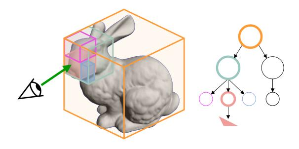
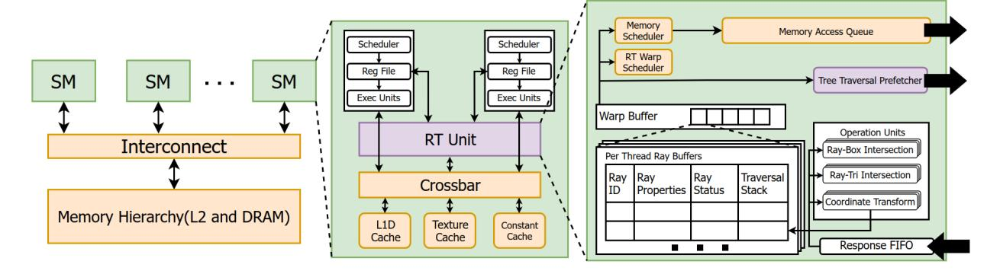

# *A. Ray Tracing*

Ray tracing is a 3D rendering technique based on realistically modeling how light rays travel through space. Highperformance graphics application programming interfaces (APIs) such as Vulkan [\[42\]](#page-13-3) and DirectX [\[2\]](#page-12-14) support ray tracing pipelines, which enable developers to build ray tracing applications. Ray tracing pipelines introduce new programmable shader types such as ray generation(*raygen*), closest-hit(*chit*), any-hit(*ahit*), intersection(*rint)* and miss(*miss*) shaders. Raygen shader is the beginning of the pipeline, where *primary* rays are generated by defining an origin and a direction in 3D space. Rays generated from the user's position in the world toward the scene are called *primary* rays. Rays that result from interactions with objects—such as reflections or refractions—are referred to as *secondary* rays. While the latest GPUs have built-in hardware support for testing intersections for triangles, procedural shapes such as spheres and cylinders require the *intersection* shaders to check if the ray intersects the object. If the intersected object is not opaque, then the *any-hit* shader is called for every intersection. Otherwise, at the end of the traversal, if the ray hits an object, the *closest-hit* shader is called. If the ray misses all objects, the *miss* shader is called.

Two types of ray tracing are supported, *closest-hit* and *anyhit*, for various purposes and applications. Closest-hit rays search for the primitive that is closest to the ray origin, whereas any-hit rays terminate their search upon finding any primitive that the ray intersects. Primary rays are always closest-hit rays; secondary rays are also closest-hit for path tracing, but anyhit for shadow and ambient occlusion shaders. Path tracing renders a 2D image of a 3D scene by tracing multiple rays per pixel and computing their resulting colors. Unlike hybrid approaches, which use ray tracing selectively for effects like shadows or ambient occlusion alongside rasterization, path tracing uses ray tracing exclusively to generate the entire frame. Shadow shaders determine the amount of direct light that reaches objects in a scene by tracing rays from the objects to the light sources. Ambient occlusion shaders estimate the amount of ambient light that reaches objects by tracing rays in random directions from the objects and calculating the degree of occlusion. Among the use cases of ray tracing, path tracing is the most intensive and time consuming workload. Typically, 4 to 16 bouncing rays are traced per pixel to determine its final color, compared to 2 or 4 rays traced for shadows and ambient occlusion. In addition, path tracing rays are always closest-hit, whereas other workloads use any-hit rays which are faster to trace.

Fig. 3. Simplified BVH structure for Stanford Bunny. The green arrow represents the ray coming out of the camera, i.e. the eye. The ray intersects with the triangle inside the pink box.

#### *B. BVH Traversal*

To accelerate ray tracing, a tree-like structure called Bounding Volume Hierarchy (BVH) is employed, which consists of Axis-Aligned Bounding Boxes(AABB) that hierarchically capture scene primitives [\[25\]](#page-12-15). Rays first test outer boxes before deeper hierarchy levels, reducing the number of intersection tests. Primitives are leaf nodes of the tree, which are at the bottom. As rays test intersections and traverse deeper into the tree, they reach the leaf nodes and test against the primitives to determine if there is a hit. If a hit is found, remaining nodes are skipped if they are farther than the closest-hit primitive, which saves time.

As with any tree search problem, the tree can be traversed in depth-first or breadth-first fashion. For ray tracing, depth-first search (DFS) is often preferred as it quickly descends deeper and identifies a hit primitive, which allows the remaining nodes to be skipped if they are farther. A stack (last-in first-out or LIFO) data structure stores node addresses (not the node data itself) that will be read from memory next. Breadthfirst search (BFS) is also a viable option. However, BFS processes nodes on the same level before going deeper, and takes longer to identify the first primitive hit. Therefore, it loses the opportunity to skip farther nodes. BFS uses a queue (first-in first-out or FIFO) structure to keep track of nodes, unlike the stack in DFS.

Figure [3](#page-2-0) visualizes a simplified BVH structure and the corresponding tree for the Bunny object [\[9\]](#page-12-16).

#### *C. GPU Architecture and Hardware Accelerated Ray Tracing*

GPUs are Single Instruction Multiple Thread (SIMT) computers. They support thousands of hardware threads that run in parallel, thus yielding massive computational throughput [\[28\]](#page-12-17). Figure [4](#page-3-0) shows the baseline GPU model [\[39\]](#page-13-4), with our proposed modifications highlighted in purple. A GPU consists of an array of Streaming Multiprocessors (SMs), as termed by Nvidia. SMs act as the main compute units where shader programs are executed. Each SM houses a register file, schedulers, hundreds of execution lanes, and an L1D cache. Shader programs are executed by groups of 32 threads, called "warps" by Nvidia, which operate in a lock-step manner. All the SMs are connected to an L2 cache via an interconnect, which is in turn connected to the DRAM memory controllers.

The latest GPUs also incorporate an RT unit in the SMs [\[5\]](#page-12-5) [\[6\]](#page-12-6). RT units are introduced to accelerate the BVH tree traversal process, which accounts for the majority of ray tracing execution time [\[39\]](#page-13-4). Tree traversal involves fetching the BVH tree nodes from memory, testing for intersections, and fetching subsequent nodes based on the intersection results. The RT unit model used in this study is shown in Figure [4.](#page-3-0) A warp buffer stores the per thread traversal stack and ray metadata. At each cycle, a warp from the warp buffer is selected and a memory request from that warp is served. Duplicate requests within the same warp are coalesced into one request, and inserted into the memory access queue, which sends them to the memory hierarchy (i.e., L1 cache). In the meantime, memory responses are inserted into the response FIFO. Data in the response FIFO are fed into math units which perform ray-box, ray-triangle intersection tests or coordinate transformations depending on the node type. Finally, the warp buffers are updated and new node addresses are pushed to stacks based on intersection test results. Traversal continues until all threads in the warp have emptied their stacks (closesthit), or found a hit (any-hit).

RT units accelerate BVH traversal by streamlining the memory reads and intersection tests. BVH traversal is carried out within the RT unit by a single CISC-like instruction, i.e., the *trace ray* instruction. Dedicated memory schedulers and fixedfunction intersection units inside the RT unit handle memory reads and primitive intersection tests internally, eliminating the need for explicit memory and compute instructions in the shader code.

During BVH traversal, GPU threads spend most of their time waiting for small pieces of tree data to arrive from memory [\[19\]](#page-12-13). As studied in the previous work [\[19\]](#page-12-13), prefetchers can significantly mitigate this bottleneck by predicting which nodes are going to be read using heuristics and prefetching those nodes just before the threads need them.

#### *D. Hardware Prefetchers*

Hardware prefetchers, primarily studied for CPUs, include simple types like stream and stride prefetchers, which load data from consecutive addresses or detect strided memory accesses typically occurring in loops to reduce capacity and compulsory cache misses [\[23\]](#page-12-18) [\[27\]](#page-12-19). Global History Buffer (GHB) prefetchers maintain a FIFO table of recent cache misses and use a linked list to traverse addresses for prefetching [\[37\]](#page-13-5). Indirect Memory Prefetchers (IMP) predict indirect memory accesses using address offsets and detect patterns with an Indirect Pattern Detector (IPD) [\[43\]](#page-13-6). While GHB and IMP handle irregular patterns, they struggle with the randomness of ray tracing workloads. Graph prefetchers aim to accelerate graph search algorithms but are less effective for the irregular nature of ray tracing [\[13\]](#page-12-20). Recent work [\[19\]](#page-12-13) introduced the Treelet Prefetcher specifically designed for GPU ray tracing, which builds and prefetches treelets within the BVH tree. It requires a custom traversal algorithm and a rearranged BVH tree for optimal performance.

Fig. 4. Diagram of the GPU model used in this study. Purple blocks indicate the modified components. Redrawn from [\[39\]](#page-13-4).

#### III. TRAVERSAL TREND IN RAY TRACING

We first study the BVH traversal trend in our ray tracing workloads to deeply understand the underlying traversal behavior and uncover prefetching opportunities. In particular, we look at the traversal stack activity to identify patterns which can be exploited.

As mentioned before, there are two types of hits that can be searched: closest-hit and any-hit. For closest-hit, the traversal is typically longer, as the whole tree must be covered to correctly identify the closest-hit primitive. This can lead to repetitive downward and upward traversal through the BVH tree, depending on ray origin and tree structure. Any-hit, on the other hand, requires identifying an intersected primitive regardless of its distance. We focus on *closest-hit* rays, as they are used in path tracing, which is the most intensive ray tracing workload. Algorithm [1](#page-3-1) shows how DFS is carried out to find the closest-hit primitive. First, the root node is pushed to stack if its AABB is intersected (lines 1-2). Then, as long as the stack is not empty, node address at the top is popped and read from memory (lines 4-5). If it is an internal node, it contains the addresses and AABB coordinates of its child nodes, which are tested for intersection and pushed to stack if hit (lines 6-10). Otherwise, it is a leaf node which can be a triangle or a procedural geometry necessitating an intersection shader to be executed. If an intersected primitive is found, the closest-hit distance(*min thit*) is updated (line 15). At the end of traversal, if a hit is found, registers are updated to indicate the hit, and geometry metadata is stored in memory to be read by the closest-hit or any-hit shaders.

#### *A. Prefetch Opportunities in DFS*

In DFS, nodes are pushed to and popped from top of stack. Consequent pushes indicate downward traversal towards the leaf nodes, while pops indicate upward traversal towards the root or across the same level. When consecutive pushes happen (downward traversal), it is difficult to predict which nodes will be needed, making prefetching highly challenging and speculative in nature, leading to wasted bandwidth. Since node pushing is determined by the results of intersection tests, it is often too late to prefetch the nodes by the time they are needed. In other words, top of stack may change depending

