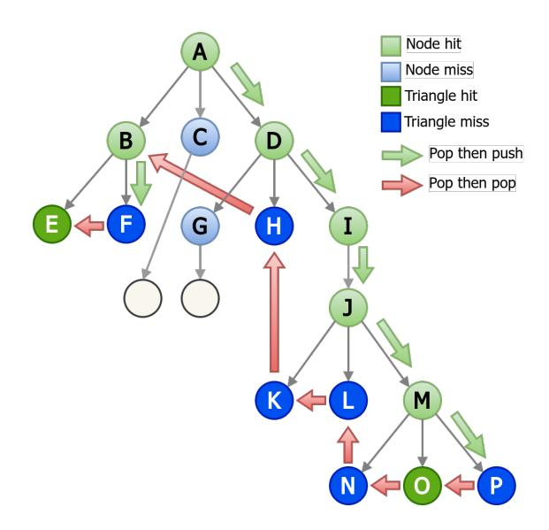
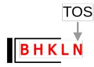
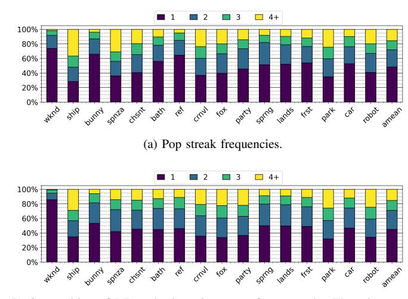
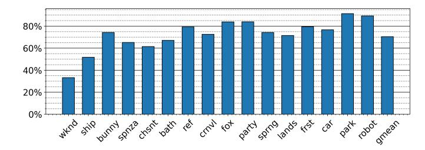

# Algorithm 1: BVH Traversal using DFS to find the closest-hit primitive

```
Input: ray, root node addr
  Output: closest node
1 if ray intersects root node then
2 stack.push(root node addr);
3 while stack is not empty do
4 node addr ← stack.pop();
5 node ← mem read(node addr);
6 if node is internal node then
7 for i = 0 to 5 do // 6-ary tree
8 thit ←
             ray box test(ray, node.child[i].AABB);
9 if thit < min thit then
10 stack.push(node.child[i].addr);
11 else // leaf node
12 thit ← ray triangle test(ray, node);
13 if thit < min thit then
14 closest node ← node;
15 min thit ← thit;
16 return closest node;
```

on the result of the current intersection test, so the next node to be read cannot be known until the test has completed. On the contrary, when consecutive pops happen (upward or same-level traversal), addresses of nodes to be read next are readily available in the traversal stack, and they can be trivially retrieved in a timely manner. This is the key insight driving our prefetcher design.

Figure [5a](#page-4-0) shows an example BVH tree traversal using the DFS algorithm. The traversal starts with the intersection test at the root node A. We assume that the ray eventually hits leaf nodes O and E. Therefore, when node A is popped and read from memory, the intersection test would show the ray hits the bounding boxes of B and D, whose addresses are pushed to stack. Then the address of D is popped and read from memory. Its children are tested for intersection and H, I are pushed to stack. This traversal continues until the whole tree is traversed, and nodes O and E are found as triangles that are hit. Note that the children of G and C are ignored because

<span id="page-4-0"></span>

(a) BVH Tree traversal with depth-first search. The ray eventually hits nodes O and E. Green arrows indicate a pop from the traversal stack followed by a push of its children. For example, node A is popped and read from memory. A's node data contains AABB coordinates of its children B, C, and D, among which B and D test positive for intersection, and therefore pushed to stack. Red arrows indicate a pop from the stack followed by another pop. For example, O is popped after P is popped.



<span id="page-4-1"></span>(b) Traversal stack right after O is popped. The stack contains the nodes' addresses. N is used instead of &N for simplicity.

<span id="page-4-3"></span>Fig. 5. Example DFS BVH traversal and the corresponding traversal stack.

their bounding boxes are not hit and they are not pushed to the stack. Addresses of nodes P, N, L, K, H, and F are pushed to the stack because the ray intersects their bounding boxes, but misses the triangle inside them. Figure [5b](#page-4-1) shows the content of the thread's traversal stack right after the address of O is popped.

From this example, we make an important observation on the traversal trend in DFS, which is the frequent down-and-up traversal through the tree. In other words, a series of pop-push operations (traversing down the tree) are typically followed by a series of pop operations (traversing up the tree). In the example shown in Figure [5a,](#page-4-0) a tree branch, A → D → I → J → M → P → O → N, is traversed until its tip is reached, then the upward traversal, N → L → K → H → B, begins. As the traversal stack already contains the addresses of these nodes, as shown in Figure [5b,](#page-4-1) we can prefetch them when we observe consecutive pops, meaning the thread is traversing the tree upward.

Note that although the node addresses (e.g., N, L, K, H, B) are in the stack, these nodes themselves have not been fetched and processed yet by the current thread (or ray). Therefore, prefetching them can reduce both cold misses if no other prior



(b) Composition of RT read misses in terms of pop streaks. The misses are those generating DRAM traffic, i.e., missing in both L1 and L2.

<span id="page-4-2"></span>Fig. 6. Analysis of pop streaks.

rays (or threads) have fetched them, and capacity or conflict misses if they were fetched by other threads but evicted from the caches later on.

To see the impact of such traversal stack pop streaks, we extract traversal stack activity from the simulator. Note that during BVH traversal, every memory read request is a *pop* from a traversal stack. Therefore, we categorize the cache misses from RT reads by the position of the pop within a streak—i.e., whether it is the 1st, 2nd, 3rd, or 4th+ consecutive pop. The 1st pop (i.e., no consecutive pops) means downward traversal while consecutive pops(2, 3, 4+) correspond to upward or same-level traversal. We quantify both the frequency of these pop streaks and their cache miss rates in Figure [6.](#page-4-2) Although single pops, i.e. a pop followed immediately by a push, make up most of the stack activity, longer pop streaks make up a significant portion of all pops. Consequently, and more importantly, these longer pop streaks account for a large portion of all cache misses, making them prime candidates for prefetching.

#### *B. Prefetch Opportunities in BFS*

BFS is another option for tree traversal, where nodes at the same level are processed before descending deeper into the tree. In this case, the traversal stack would operate as a FIFO queue rather than a LIFO stack. Taking the BVH tree in Figure [5](#page-4-3) as an example, after node A is popped and accessed, both nodes B and D will be pushed into a queue (i.e., queue content: B,D). After B is popped and accessed, its children E and F will be pushed into the queue after node D (i.e., queue content: D, E, F). Next, node D will be popped and accessed as it is the head of the queue.

While BFS is commonly used in traversing graphs [\[15\]](#page-12-21) [\[34\]](#page-13-7) [\[36\]](#page-13-8), it is less effective for ray tracing compared to DFS, as it takes longer to identify the first hit and cannot skip as many nodes. Table [I](#page-5-0) shows the average number of nodes per ray



<span id="page-5-1"></span>Fig. 7. Percentage of RT read misses where the node was in the traversal queue when a previously read node missed in caches.

visited by BFS and DFS for path tracing shaders, which trace closest-hit rays.

However, BFS has one important advantage over DFS: predictability. Because BFS uses a FIFO queue, the next node that will be read is known as long as the queue is not empty. New nodes are pushed to the tail of the queue, and the next node is popped from the head. This observation makes BFS an appealing candidate for prefetching as studied in previous work [\[13\]](#page-12-20). The key to accurate prefetching with BFS is timing. Although the address of the next node is readily available regardless of upward or downward traversal, prefetch must be done at the right time to avoid being too early or late.

With BFS, the traversal trend is always traversing the nodes on the same level before moving on to the next level. A prefetch opportunity exists as long as the queue is not empty. Following the example in Figure [5a,](#page-4-0) when the node B is to be popped, the queue content is the addresses of node B and D. As a result, when B is sent to the memory access queue, D can be prefetched. If both are cache misses, their latency can be overlapped.

In Figure [7,](#page-5-1) we show the percentage of RT read misses that satisfy the conditions, i.e., the queue is not empty and the demand access is a cache miss. In theory, these results show that, on average, 70.42% of all queue pops can be followed with an accurate prefetch, i.e. an upperbound on the prefetcher's effectiveness. In practice, scheduling uncertainties and cache sizes will limit the effectiveness of the prefetcher.

#### IV. TREE TRAVERSAL PREFETCHER

