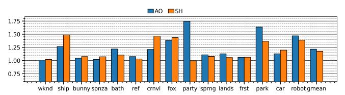

# *F. Ambient Occlusion and Shadow Shaders*

Lumibench features two additional ray tracing workloads: Ambient Occlusion (AO) and Shadow (SH) shaders. These shaders are used together with rasterization to improve visual quality, unlike path tracing which renders the frame by pure ray tracing. Both shaders first trace a primary ray from user's position towards the scene and find the closest-hit point. Then, AO shaders estimate the ambient light that reaches crevices of objects by tracing 4 randomly directed rays from the point of intersection. SH shaders calculate shadows by tracing 2 rays from the hit point towards light sources. Secondary rays, also called shadow rays, are any-hit rays, i.e., they terminate traversal on first hit. In addition, they are more localized as they all share the same origin point (the intersection point of the primary ray). Therefore, they are already relatively fast to execute, leaving small room for improvement, unlike path tracing.

Fig. 27. TTP speedups (higher is better) with AO and SH shaders, 128x128 resolution. park is 64x64. Lumibench does not support AO and SH shaders in chsnt scene.

We simulated TTP with AO and SH shaders, and achieved 1.22x and 1.18x speedup on average respectively, as shown in Figure [27.](#page-10-1) chsnt is not included in the results, because Lumibench does not support AO and SH shaders in this scene.

#### *G. Prefetcher Area Overhead*

To estimate TTP's area overhead, we implemented and synthesized the state-machine as described in Section [IV](#page-5-3) using FreePDK45 [\[41\]](#page-13-12). We assume the same hardware configuration as in Table [III,](#page-7-1) meaning there can be 4 warps in the RT unit, and each warp has 32 threads, therefore 128 state machines per SM. The total number of cells needed to synthesize 128 state machines is 1117. Each state machine has 2 bits of state, which requires 256 sequential cells. The remaining 861 cells are used for the combinational logic. On average, each state-machine requires 1117/128 = 8.7 cells. To put this into perspective, as shown in Figure [4,](#page-3-0) just the *Ray Properties* field in the ray buffer would require 32∗3∗2 = 192 bits of space per thread to store the ray origin and direction data. Therefore, we conclude that the area overhead of TTP is negligible in comparison to the existing hardware.

