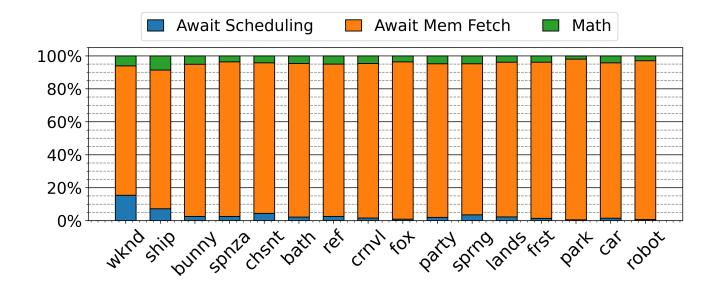
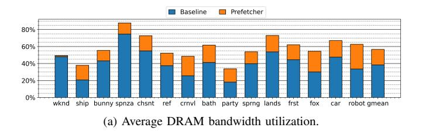
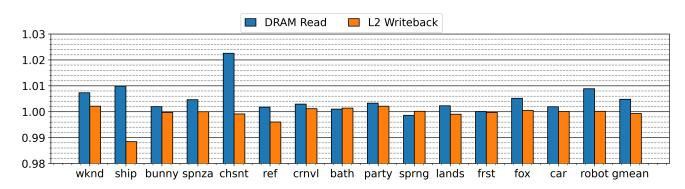

# TTP: A Hardware-Efficient Design for Precise Prefetching in Ray Tracing

Yavuz Selim Tozlu† *Electrical and Computer Engineering North Carolina State University* Raleigh, USA ystozlu@ncsu.edu

Anshul Naithani† *Electrical and Computer Engineering North Carolina State University* Raleigh, USA anaitha2@ncsu.edu

Huiyang Zhou *Electrical and Computer Engineering North Carolina State University* Raleigh, USA hzhou@ncsu.edu

*Abstract*—Ray tracing (RT) is a 3D graphics technique that offers highly realistic visuals. It is becoming prominent and accessible as GPU vendors have integrated dedicated ray tracing acceleration hardware. However, tracing millions of rays through 3D scenes consisting of high numbers of triangles in real time is challenging and requires expensive hardware. The main bottleneck in RT workloads is the expensive Bounding Volume Hierarchy (BVH) traversal task, which is a large tree structure that encodes the 3D scene. BVH traversal is a memory-bound problem, as the GPU threads spend most of their time reading tree node data from memory.

In this work, we attack the memory latency bottleneck of ray tracing through prefetching. We propose a novel hardware prefetcher, named Tree Traversal Prefetcher (TTP), for ray tracing. The main idea is to leverage the existing tree traversal stack in the RT units for highly accurate prefetching. In particular, TTP prefetches nodes using the addresses already available on the hardware traversal stacks of each thread. For DFS (Depth-first search) based traversal, prefetches are generated when nodes are being popped consecutively from the traversal stack, potentially corresponding to upward traversal through the tree.

We evaluate TTP on a cycle-level simulator, Vulkan-sim 2.0, and show that it achieves 1.48x speedup on average (up to 1.89x) compared to the baseline, with nearly negligible hardware overhead. TTP achieves 98.92% average L1 accuracy, which is the ratio of the prefetched blocks being actually referenced by demand loads. The coverage, computed as the ratio of L1 miss reduction over baseline L1 misses, is 31.54%, correlating well with the achieved speedup.

*Index Terms*—GPU, Ray Tracing, Prefetching.

#### I. INTRODUCTION

Ray tracing is a modern 3D rendering technique that generates highly realistic graphics for both real-time applications like video games and offline rendering such as animations [\[7\]](#page-12-0) [\[8\]](#page-12-1) [\[20\]](#page-12-2). Unlike rasterization, ray tracing accurately models the lighting effects in a scene, providing life-like graphics [\[17\]](#page-12-3). The challenge, however, is that ray tracing incurs high computational costs. Recently, hardware vendors have introduced specialized units, RT units/cores, in GPUs to accelerate ray tracing [\[4\]](#page-12-4) [\[5\]](#page-12-5) [\[6\]](#page-12-6) [\[16\]](#page-12-7), prompting developers to adopt advanced ray tracing algorithms, thereby advancing real-time rendering [\[8\]](#page-12-1) [\[10\]](#page-12-8). Beyond computer graphics, RT units have been exploited for more general purpose applications. [\[14\]](#page-12-9) [\[22\]](#page-12-10) [\[24\]](#page-12-11) [\[26\]](#page-12-12) [\[35\]](#page-13-0) [\[44\]](#page-13-1).

†Both authors contributed equally to this work.

Despite advances in ray tracing hardware, rendering complex 3D scenes in real time remains challenging. First, each frame requires tracing millions of rays to generate a high resolution picture. Second, although different rays traverse the 3D scene independently, thereby being massively parallel, each ray follows its own traversal path to bounce through objects to find intersections, leading to unpredictable and divergent behavior. Thirdly, during the traversal of the objects in a scene, each ray needs to access a large data set, i.e., the Bounding Volume Hierarchy (BVH). As a result, on-chip caches are usually not sufficient, and the memory wall is exposed as a key performance bottleneck.

BVH traversal makes up the bulk of ray tracing. A 3D scene is organized as a hierarchy of bounding boxes, which is stored as a tree in memory. The size of BVH trees can be in the order of gigabytes, depending on the scene complexity, thereby stressing the on-chip cache hierarchy. During traversal, an RT unit fetches tree nodes from memory, tests rays for intersections with boxes, and descends through the tree to find the closest hit primitive for each ray. As intersection tests and coordinate transformations are carried out in fast, fixed-function hardware, memory bottleneck is exposed as the primary challenge.

To better understand the performance of ray tracing workloads, Figure [1](#page-1-0) shows the averaged distribution of thread status while executing a *trace ray* instruction (the methodology is in Section [V\)](#page-6-0). The *trace ray* instruction performs BVH traversal on the specialized GPU hardware, the RT unit. Within the RT unit, threads spend most of their time waiting for memory read requests to return, confirming that the memory wall is a significant bottleneck in ray tracing. To further analyze the memory performance of ray tracing workloads, we report the average DRAM bandwidth with and without our Tree Traversal Prefetcher (TTP) in Figure [2a.](#page-1-1) From the figure, we can see that most of the scenes do not fully utilize the DRAM bandwidth, suggesting ray tracing is mostly constrained by memory latency instead of bandwidth, also shown in previous work [\[40\]](#page-13-2). Additionally, underutilization of the bandwidth in the baseline suggests that there is sufficient headroom for a prefetcher.

In this paper, we aim to accelerate ray tracing by addressing its memory bottlenecks. We propose TTP to reduce the

Fig. 1. Thread status distribution in an RT unit. Threads may be waiting for scheduling, waiting on a memory fetch, or performing math operations such as intersection tests or coordinate transformations. 128x128 resolution path tracing, 1 sample per pixel.

(b) Total number of DRAM reads and L2 writebacks with TTP normalized to baseline.

Fig. 2. DRAM activity with and without (i.e., baseline) TTP.

memory access latency. The key idea of TTP is to leverage the existing per-thread traversal stack in the RT unit for generating prefetches based on the tree traversal trend, which is predicted from the stack push/pop operation sequences. Our analysis shows that TTP generates highly accurate prefetches (i.e., the prefetched data are demanded in a timely manner) with minor hardware changes to the RT unit. As seen in Figure [2a,](#page-1-1) TTP introduces a bandwidth overhead of 18.22% on average. On the other hand, the overall amount of data loaded from or written to DRAM remains nearly identical, as shown in Figure [2b.](#page-1-2) This shows that the increased bandwidth from TTP is due to the reduced execution time rather than extra data transfer from/to DRAM. Our results also show that TTP outperforms the state-of-the-art Treelet prefetcher [\[19\]](#page-12-13), which was specifically designed for RT units.

In summary, this paper makes the following contributions:

- We propose TTP, a novel hardware prefetcher for ray tracing, which leverages the existing traversal hardware to prefetch data and hide the memory access latency.
- We study the traversal trends across the 3D scenes and show that TTP is highly effective in various ray tracing workloads and outperforms the state-of-the-art Treelet prefetcher.
- Our simulation results show that TTP achieves up to

- 1.89x performance improvement with a geometric mean of 1.48x.
- TTP supports both DFS- and BFS-based traversal, offering a new performance optimization opportunity by selecting different traversal algorithms for different workloads.

#### II. BACKGROUND

