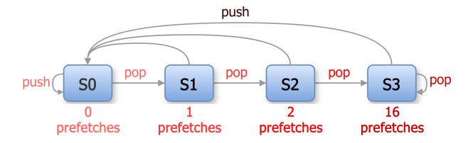
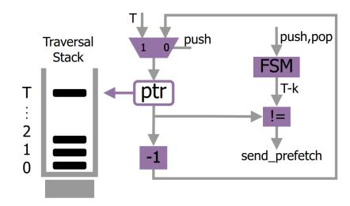
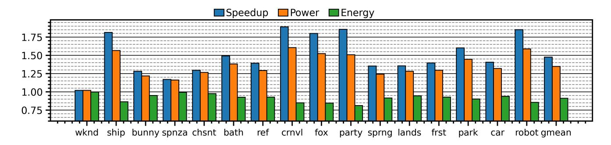
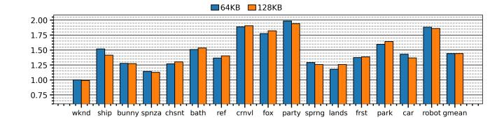
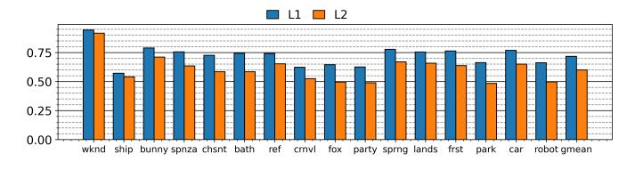
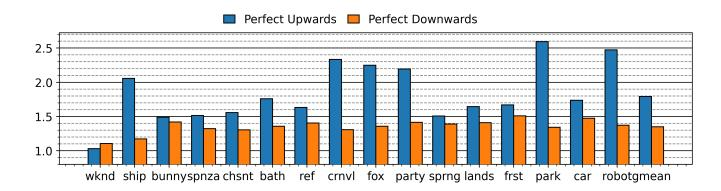
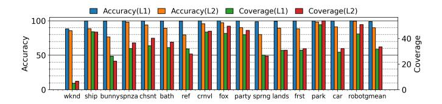
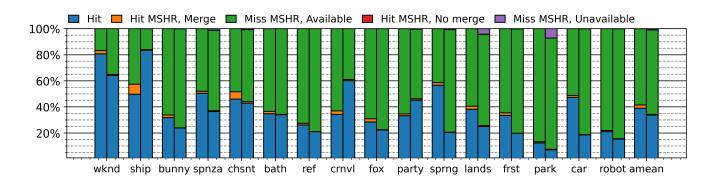

# *A. Generating Prefetches with DFS*

For DFS-based ray tracing, we propose to generate prefetches when the traversal trend is upward along the tree. To do so, we monitor the actions of the traversal stack: pushes and pops. With the first *pop* after a *push*, we generate 1 prefetch, which is the node at the top of the stack. With the second consecutive *pop*, we generate 2 prefetches using the top two nodes in the stack, and with the third *pop*, we are more confident about the trend and can be more aggressive in generating prefetches, e.g., by issuing up to 16 prefetches using the top 16 nodes in the stack. A *push* would reset the *pop* streak and stop generating prefetches. Figure [8](#page-5-2) shows the state machine that implements this operation. This state machine can be implemented using 2 bits. There is no need to predict prefetch addresses as we simply use the content of

TABLE I COMPARISON OF DFS AND BFS TRAVERSAL IN TERMS OF AVERAGE AND MAXIMUM NODES VISITED PER RAY. POSITIVE DIFF MEANS BFS VISITS

MORE NODES.

|        |       |       | Average Nodes Per Ray | Max Nodes Per Ray |       |        |  |
|--------|-------|-------|-----------------------|-------------------|-------|--------|--|
| Scenes | DFS   | BFS   | Diff                  | DFS               | BFS   | Diff   |  |
| WKND   | 13.3  | 13.3  | 0.0%                  | 73                | 73    | 0.0%   |  |
| SHIP   | 43.3  | 46.6  | 7.6%                  | 240               | 245   | 2.1%   |  |
| BUNNY  | 11.3  | 12.5  | 10.6%                 | 141               | 175   | 24.1%  |  |
| SPNZA  | 38.0  | 51.5  | 35.5%                 | 335               | 385   | 14.9%  |  |
| CHSNT  | 59.0  | 137.4 | 132.9%                | 274               | 574   | 109.5% |  |
| BATH   | 18.4  | 21.1  | 14.7%                 | 249               | 278   | 11.6%  |  |
| REF    | 11.3  | 12.7  | 12.4%                 | 235               | 291   | 23.8%  |  |
| CRNVL  | 43.8  | 51.4  | 17.4%                 | 487               | 492   | 1.0%   |  |
| FOX    | 84.0  | 117.2 | 39.5%                 | 568               | 874   | 53.7%  |  |
| PARTY  | 34.8  | 37.4  | 7.5%                  | 551               | 551   | 0.0%   |  |
| SPRNG  | 31.4  | 38.7  | 23.2%                 | 204               | 291   | 42.6%  |  |
| LANDS  | 30.2  | 38.9  | 28.8%                 | 527               | 535   | 1.5%   |  |
| FRST   | 35.2  | 49.7  | 41.2%                 | 355               | 943   | 165.6% |  |
| CAR    | 41.1  | 53.3  | 29.7%                 | 303               | 582   | 92.4%  |  |
| PARK   | 185.5 | 272.3 | 46.8%                 | 1753              | 2071  | 18.1%  |  |
| ROBOT  | 102.5 | 166.6 | 62.6%                 | 1516              | 1841  | 21.4%  |  |
| AVERG  | 49.0  | 70.0  | 42.9%                 | 487.8             | 636.9 | 30.6%  |  |

Fig. 8. State machine that generates prefetches.

the traversal stack. As each thread has its own traversal stack, our proposed TTP is a per-thread prefetching engine, sending prefetches when the warp is selected by the scheduler.

In the example shown in Figure [5a,](#page-4-0) O would be prefetched when P is popped from the stack (state S1), then N and L would be prefetched after O is popped (state S2).

The state machine can be adjusted for more flexibility, including the number of prefetches in each state and the number of states. However, as this state machine is one per traversal stack and, therefore, per thread, increasing the number of states may increase the hardware cost. Therefore, this paper uses the design in Figure [8](#page-5-2) and studies the sensitivity of the parameters in our experiments.

We choose not to prefetch when a thread traverses down the tree. The reason is that we need to predict both intersection test results at different nodes and the descendent node addresses. Unless the prediction accuracy is high, such a scheme may incur high bandwidth/energy overhead and/or slowdown due to mispredicted paths. In contrast, prefetching for upward traversal does not require any address predictions.

### *B. Generating Prefetches with BFS*

We propose a simpler prefetching scheme for BFS. With every pop from the traversal queue, up to N nodes are prefetched starting from the head. The parameter *N* determines the prefetch distance — that is, how far ahead in the queue the nodes are fetched. A larger *N* results in prefetching nodes

Fig. 9. TTP implementation. Top of the stack is denoted by T, and the bottom is 0. Purple blocks indicate newly added hardware structures. Only per-thread structures are shown.

that will be accessed further in the future. We explore with different values for *N* and report the results in Section [VI-C.](#page-8-0)

#### *C. Implementation*

Figure [9](#page-6-1) shows the implementation of TTP. Due to the simplicity of the underlying algorithm, very little hardware is required. We add an additional (2-bit) field to the warp buffer to implement the finite-state machine of each thread. Push and pop actions in the traversal stack orchestrates the finite-state machine, which in turn calculates the T − k value, where T denotes the top of stack, and k is the prefetch distance, i.e. 1, 2 or 16. We add a pointer that points to the next address in the stack that will be prefetched. If a push happens, it is reset to T. If a pop happens, FSM is updated, which updates the T − k value. Otherwise, with every prefetch, the pointer is decremented by one, which moves it to the next address in the stack. When the pointer reaches T − k, as determined by the comparator, prefetching stops. The pointer only resets to *T* upon a stack push, which prevents repeating prefetches from consecutive pops. Alternatively, each stack entry can have a flag bit to record whether the node address has been prefetched to avoid same entries being prefetched multiple times.

By default, prefetch requests are sent when there are no demand reads, i.e. demand reads take priority. In Section [VI-B,](#page-8-1) we report results with different arbitration schemes where prefetches take priority if no prefetches were sent recently. Since the Vulkan-sim GPU model uses a sector cache model with sector size of 32B, prefetch requests for nodes that are larger than 32B are broken down into 32B chunks and sent one at a cycle, similar to demand reads.

When TTP is used with BFS, the prefetch distance k is a fixed value, N, rather than determined by the finite-state machine. Our experiments in Section [VI-C](#page-8-0) analyze the choice of this parameter.

#### V. METHODOLOGY

We extend Vulkan-sim 2.0 [\[39\]](#page-13-4) to model our proposed TTP, and host the open-source code at github.com/yavuz650/vulkansim. We use GPUWattch [\[30\]](#page-13-9) for power analysis, which is included in the Vulkan-sim codebase.

The primary metric that we use for performance evaluation is the ratio of total number of simulation cycles, i.e., cycles baseline/cycles prefetcher. Baseline is the default RT unit that is shipped with Vulkan-sim.

Lumibench has 16 scenes with increasing geometric complexity, as summarized in Table [II.](#page-7-0) 15 out of 16 scenes finish simulation without errors at 128x128 resolution. The park scene times out after 72 hours. Due to this, simulations for the park scene are ran at 64x64 resolution instead, which run into completion.

We compare our TTP with the state-of-the-art prefetcher for ray tracing, the Treelet prefetcher [\[19\]](#page-12-13). Both prefetchers are run at various resolutions using the same simulator configuration shown in Table [III.](#page-7-1) For the Treelet prefetcher, we cloned and built the code available on Github [\[1\]](#page-12-22) without any modifications. This repository has the necessary code that modifies the BVH tree to form treelets, perform treelet based traversal and prefetching. We enable the following options to turn on the Treelet prefetcher: *treelet based traversal*, *treelet prefetch* and *keep accepting warps*. chsnt scene consistently crashes at every resolution when Treelet prefetching is enabled, and therefore not included in the results.

#### VI. RESULTS

#### *A. Overall Performance Evaluation*

We start with evaluating the overall performance of TTP. Figure [10](#page-7-2) shows the normalized speedup, energy and power over the baseline. We see a geometric mean of 1.48x speedup (1.89x peak), 1.35x power and 0.91x energy consumption (i.e., 8.70% energy savings). Among the scenes, wknd is a very simple procedural scene featuring spheres and no triangles, offering limited room for improvement. We observe that TTP yields the highest speedups in scenes with long pop streak misses (ship, crnvl, fox, party, robot), as shown before in Figure [6.](#page-4-2)

In addition, we perform a limit study by simulating with perfect upward and perfect downward traversals. For perfect upward traversal, 2nd and later pops after a push always hit in the L1 cache, and for perfect downward traversal, 1st pops after a push always hit in the L1 cache. Figure [11](#page-7-3) shows the results, where geometric means are 1.79x and 1.35x. These results correlate well with the characterization in Figure [6.](#page-4-2)

TTP can also work with larger L1 data cache sizes. Figure [12](#page-7-4) shows the normalized speedups (1.44x average for both) with cache sizes of 64KB and 128KB.

Figure [13](#page-7-5) shows how the L1 and L2 RT read missesper-kilo-instruction (MPKI) rates change with TTP. Both L1 and L2 misses reduce consistently (28.28% and 40.01%, respectively) across all scenes, verifying the effectiveness of TTP.

Figure [14](#page-8-2) shows the accuracy and coverage of our TTP. *Accuracy* is the ratio of prefetched blocks that were accessed by a demand load. Average accuracies are 98.92% and 89.81% for L1 and L2 respectively. High levels of accuracy ensure that the cache is not polluted with unused data blocks. The accuracy is not 100% because in some rare cases, the prefetched data might end up being evicted before a demand load accesses it. *Coverage* is the ratio of useful prefetches to all RT misses of baseline. It indicates the proportion of misses that are prefetched and turned into hits. Averages are 31.54%

TABLE II BENCHMARK SCENES FROM LUMIBENCH [\[32\]](#page-13-10). SCENE STATS TAKEN FROM [\[19\]](#page-12-13).

| Scene         |       |       |       |       |       |       |         |         |
|---------------|-------|-------|-------|-------|-------|-------|---------|---------|
| Label         | wknd  | ship  | bunny | spnza | chsnt | bath  | ref     | crnvl   |
| Tree Size(MB) | 0.2   | 0.5   | 12.2  | 22    | 25.5  | 104.2 | 37.1    | 37.3    |
| Depth         | 7     | 12    | 11    | 16    | 12    | 16    | 13      | 16      |
| Scene         |       |       |       |       |       |       |         |         |
| Label         | fox   | party | sprng | lands | frst  | park  | car     | robot   |
| Tree Size(MB) | 597.8 | 143.8 | 164.3 | 279.2 | 348.6 | 501.9 | 1,233.6 | 1,721.3 |
| Depth         | 15    | 14    | 14    | 12    | 14    | 14    | 16      | 18      |

Fig. 10. TTP speedup (higher the better), power and energy (lower the better) with DFS traversal, normalized to baseline.

TABLE III VULKAN-SIM HARDWARE CONFIGURATION

| # Streaming Multiprocessors(SM) | 8                                  |  |  |  |  |
|---------------------------------|------------------------------------|--|--|--|--|
| Max. TBs per SM                 | 16                                 |  |  |  |  |
| Warp Size                       | 32                                 |  |  |  |  |
| Instruction Cache               | 128KB, 20 cycles                   |  |  |  |  |
| L1 Data Cache                   | 32KB, Fully assoc. LRU, 20 cycles, |  |  |  |  |
|                                 | 256 MSHRs                          |  |  |  |  |
| L2 Cache                        | 512KB, 16-way assoc. LRU, 160 cy   |  |  |  |  |
|                                 | cles, 768 MSHRs                    |  |  |  |  |
| Core, Interconnect, L2 Clock    | 1365 MHz                           |  |  |  |  |
| Memory Clock                    | 3500 MHz                           |  |  |  |  |
| # of RT Units per SM            | 1                                  |  |  |  |  |
| RT Unit Warp Buffer Size        | 4                                  |  |  |  |  |

Fig. 12. Normalized speedups with larger L1 data caches.

Fig. 13. RT read MPKI with TTP normalized to baseline. Lower is better.

Fig. 11. Normalized speedups with perfect upward and downward traversal.

and 33.46% for L1 and L2 coverages, respectively. Speedups are largely proportional to coverage. Higher coverage indicates that the BVH traversal for a particular scene exhibits the downand-up traversal trend that our prefetcher performs well with.

To get a better understanding of the prefetcher efficiency, we look at the responses from caches. There are multiple possible outcomes of a cache access: (1) Hit, (2) hit in MSHR(Miss Status and Handling Register), or (3) miss in MSHR. If there

Fig. 14. Prefetcher accuracy and coverage with DFS traversal. Higher is better.

Fig. 15. L1 and L2 cache responses to prefetch requests. For each scene, first column is L1, second column is L2.

is an MSHR hit, the access request can be merged if a merge entry is available. If there is an MSHR miss, a new MSHR entry can be created if an empty entry is available. We present the cache response breakdown for prefetch accesses for both L1 and L2 caches in Figure [15.](#page-8-3) Note that the green bars, i.e. *Miss MSHR, Available*, are the ideal cache response type for a prefetch request. A prefetch request can only be useful if it misses in cache and MSHRs, and there is an empty MSHR entry available. We define the prefetcher efficiency as the ratio of prefetch requests that miss in caches and MSHR, i.e. the green bars in Figure [15.](#page-8-3) On average, the prefetcher efficiency is 58.56% and 64.85% for L1 and L2 respectively. Prefetches resulting in cache or MSHR hits are redundant but they do not pollute the cache.

By default, Lumibench uses 128x128 resolution for simulations. We increased the resolution to 256x256 to see the impact on TTP's performance. Figure [16](#page-8-4) shows the normalized speedups at 256x256. Average speedup is 1.44x for 256x256, which is very close to the results at 128x128.

To further establish TTP's robustness, we simulate it with a different hardware configuration that has 30SMs, 64KB L1 cache and 3MB L2 cache. Figure [17](#page-8-5) shows the normalized speedups in this configuration. Average speedup is 1.50x, and peak is 1.93x, which verify that TTP can work with different hardware setups.

