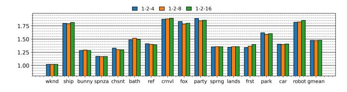
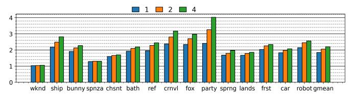
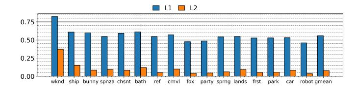
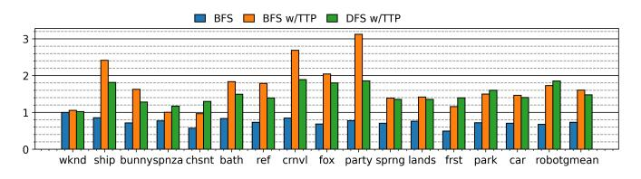
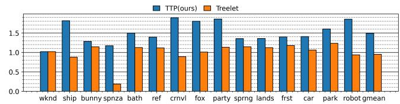
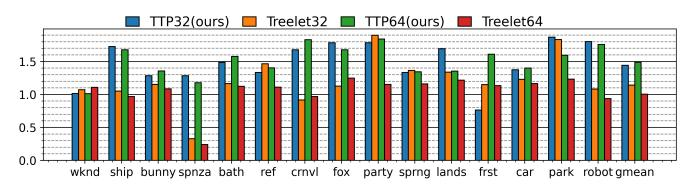
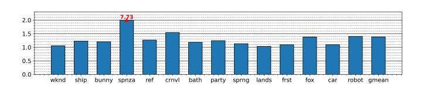
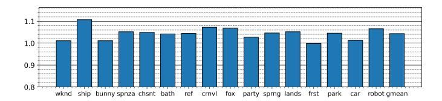

# *C. TTP with BFS*

Figure [20](#page-8-8) shows the normalized speedup of TTP with BFS normalized to BFS without TTP. We experiment with 3 different prefetch distance values: 1, 2 and 4. TTP achieves an average of 1.85x, 2.05x, and 2.20x speedup for N = 1, 2, and 4 respectively. Longer prefetching distance is favorable, although the returns diminish quickly as N is increased. We use N = 4 for the rest of simulations for BFS.

Fig. 19. Speedups for different prefetch intensities, normalized to baseline. Higher is better.

Fig. 20. Normalized speedup for different prefetch distance values with BFS.

Fig. 21. RT read MPKI with TTP normalized to baseline, with BFS *N=4*. Lower is better.

Fig. 22. BFS and DFS speedups normalized to DFS without TTP. N = 4 for BFS w/TTP. Higher is better.

Figure [21](#page-9-0) shows normalized RT read MPKI. We note that both L1 and L2 misses are substantially reduced (44.10% and 92.04%, respectively), more so than the reductions in DFS. As expected, prefetching in BFS is much more effective since it is predictable.

We also compare DFS and BFS, with and without TTP. Figure [22](#page-9-1) shows the speedups normalized to DFS. When no prefetching is involved, BFS is always slower than DFS. Interestingly, when TTP is enabled, BFS performs better than DFS on average, achieving 1.61x average speedup. Although BFS accesses more nodes than DFS, it has better cache performance and therefore processes the nodes quicker than DFS. The determining factor here is the *average-nodes-perray* metric, which we presented in Table [I.](#page-5-0) DFS is faster in 5 scenes: spnza, chsnt, frst, park and robot. These 5 scenes also have the highest average-nodes-per-ray difference between DFS and BFS, and consequently, BFS loses its edge over DFS.

#### *D. Comparison with Treelet Prefetcher*

Treelet prefetcher is a GPU hardware prefetcher targeting ray tracing [\[19\]](#page-12-13). Treelet prefetcher requires the Treelet traversal algorithm, which involves pre-processing the BVH tree to divide it into treelets (sub-trees), and it directly replaces DFS. Once treelets are formed, the traversal is carried out in treelet granularity, i.e., all the nodes that are present within a treelet are traversed first before moving on to nodes in a different treelet. A treelet is prefetched when its root node is read. This requires adding additional information in the BVH tree nodes to identify which treelet a BVH node belongs to during traversal. As such, this requires modifications to the traversal algorithm and the BVH tree organization. Another disadvantage of the Treelet traversal is that it may access more nodes than DFS does, because instead of traversing deeper into the tree to find a triangle, it prioritizes traversing treelets. Figure [23](#page-9-2) shows the speedups over baseline in path tracing for Treelet and TTP at 128x128 resolution. TTP has better performance in all the scenes. Treelet has 1.00x average

Fig. 23. TTP and Treelet prefetcher speedups normalized to baseline, 128x128 path tracing. Higher is better.

Fig. 24. Speedups (higher is better) of the two prefetchers across different resolutions. For each scene, first two columns are 32x32, the last two columns are 64x64.

speedup due to the performance loss in the scenes ship, spnza, crnvl, and fox.

To have a more comprehensive comparison, we simulate 32x32 and 64x64 frame resolutions. The results are presented in Figure [24.](#page-9-3) When the frame resolution is changed to 32x32, Treelet prefetcher shows 1.14x speedup, close to the results reported in the previous work [\[19\]](#page-12-13), whereas TTP achieves 1.44x speedup. It should be noted that, at this low resolution, the SMs are under utilized due to the limited number of thread blocks. At 64x64, Treelet achieves 1.00x speedup, mainly due to performance regression in some scenes, whereas TTP maintains 1.49x speedup. These results show that TTP outperforms Treelet and is more robust across different resolutions. Treelet prefetcher generates excessive prefetches which consume too much bandwidth. This especially becomes a problem as we increase the resolution from 32x32 to 128x128, which results in more thread blocks and therefore higher bandwidth utilization. For example, in the spnza scene, average DRAM bandwidth usage goes up from 58% in baseline to 80% with Treelet at 128x128 resolution. It is likely that the excessive prefetches waste bandwidth and pollute the caches, leading to poor performance. Figure [25](#page-9-4) shows the normalized number of total DRAM reads for Treelet prefetcher. On average, the DRAM traffic increases by 1.38x. For comparison, with our TTP, the total DRAM traffic does not change.

## *E. Comparison with Park et al. [\[38\]](#page-13-11)*

Park et al. [\[38\]](#page-13-11) propose a prefetching scheme similar to TTP, the key difference being when and how often prefetches are

Fig. 25. Total DRAM reads for Treelet prefetcher normalized to baseline. Lower is better.

Fig. 26. Normalized speedups with Park et al.'s prefetching strategy. Prefetches are generated during a leaf node intersection test to overlap test latency with memory fetch latency.

triggered. Park et al.'s prefetcher aims to overlap fixed-function math latency (i.e. leaf node intersection tests) with memory latency. For this approach to be effective, math latency should be roughly on par with the latency of a cache miss. This depends on the math hardware, BVH tree format(i.e. how many primitives are packed in each leaf node), and the memory subsystem performance. The BVH tree used in this work is built by the open-source Embree library [\[3\]](#page-12-23), which is what Vulkan-sim uses by default. The tree format has one primitive inside each leaf node, and the intersection latency is in the simulator is configured as 8 cycles for a leaf node, which is remarkably faster than the latency of a cache miss(100-300 cycles). If the BVH tree format packed more primitives in each leaf node, then the intersection test latency would potentially increase. This could make it viable to overlap test latency with cache miss latency.

We model Park et al.'s prefetching strategy in Vulkan-sim to the best of our ability, and simulate using the same hardware configuration and resolution used for our TTP. We generate prefetches during a leaf node intersection test, and try to prefetch as many nodes as possible from the stack during that interval. Figure [26](#page-10-0) shows the normalized speedups. We observed marginal speedups, averaging at 1.04x with a peak of 1.11x. The limited speedups are due to the timing of prefetches and how often the prefetcher is triggered. The intersection latency is too short to hide a long memory request latency; and prefetching only happens after a leaf node is accessed. In contrast, TTP covers all upward traversals.

