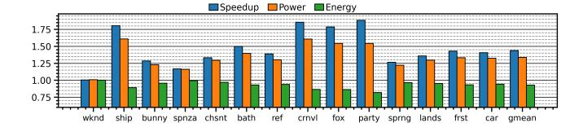
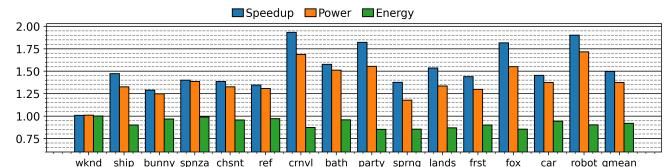
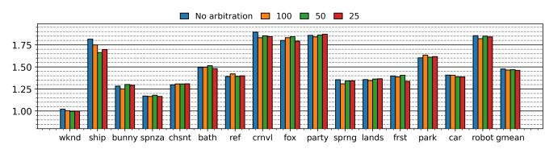

# *B. Prefetcher Arbitration and Aggressiveness*

We experiment with an arbitration scheme where prefetch requests are prioritized over demand requests if a fixed number

Fig. 16. Normalized speedup, power and energy at 256x256 resolution. park and robot scenes time out after 72 hours at this resolution.

Fig. 17. Normalized speedup (higher is better), power and energy (lower is better) with a larger GPU model.

Fig. 18. Speedups for different prefetch arbitration configurations, normalized to baseline. Higher is better

of cycles have passed since the last prefetch request. Results are shown in Figure [18.](#page-8-6) We evaluate thresholds of 25, 50, and 100 cycles. On average, arbitration makes little to no difference.

Figure [19](#page-8-7) shows the speedups for different prefetch intensities of TTP. The numbers correspond to the number of prefetches that are generated in each state, as shown in the state machine diagram in Figure [8.](#page-5-2) All configurations have similar overall performance although certain scenes prefer higher/lower intensity. This shows that TTP is not sensitive to this parameter.

