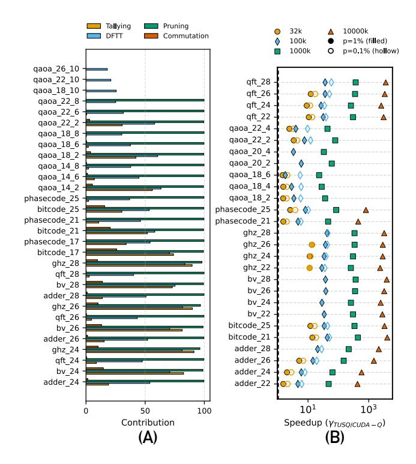

# *D. Ablation study*

Figure [10](#page-10-0) (A) shows the relative speedup provided by each optimization of the TUSQ pipeline. The speedup is quantized by the percentage reduction in matrix-vector multiplications achieved by each stage in isolation. Note that the percentage reduction achieved by all four stages in conjunction with each other is less than the sum of the reduction achieved by the four stages individually. This is because different optimizations may end up eliminating the same source of redundancy in the simulation, i.e. they have overlapping regions of optimization.

We see that DFTT consistently achieves a substantial speedup across all benchmarks corresponding to the elimination of the O(log |E|) factor. For short to medium depth benchmarks, ER Tallying's speedup is large. It reduces as the depth increases. This is expected since more gates result in a longer ER, which reduces the chances of repeated samples that can be batched together. We see ER Tallying produce speedups at par with Pruning. Most importantly, unlike Pruning, they

Fig. 10. (A) Cost Reduction by different components of TUSQ across various benchmarks. (B) Variation of TUSQ's speedup over CUDA-Q, for shots ranging from 32K to 10 Million, for p = 1% and p = 0.1%.

don't cause fidelity loss. ER Commutation provides the least amount of speedup, which also decreases with circuit depth for the same reasons as ER Tallying.

The speedup provided by Pruning is large as long as the output distribution is "peaked" - i.e. we can distinguish signal from noise. However, for very deep circuits - e.g. QAOA, p = 10, where the signal is totally washed out, we observe that pruning is totally ineffective. These circuits are so deep that almost every shot produces a unique ER, eliminating any distinction between "significant" and "insignificant" ERs. Unlike the other three optimizations, the speedup from Pruning comes at the cost of deviation in fidelity as discussed in Section [V-B.](#page-9-2) Note that the numbers reported in Figure [10\(](#page-10-0)A) are for α = 0.01 and β = 100. Since α and β are user-defined parameters dependent on the user's error tolerance, Pruning's speedup becomes a function of this error tolerance.

Across all evaluated benchmarks, the average (maximum) speedup of each component w.r.t. the previous ones is 30.51%(91.19%) for ER Tallying, 5.14%(25.92%) for ER Commutation, 89.32%(99.79%) for Pruning, and 50.79%(83.58%) for DFTT. On average, the speedup from lossless optimizations (ER Tallying, ER Commutation and DFTT) is 46.62%, while that from Pruning is 53.3%. Note that we report the arithmetic mean here because some entries in our data are 0, which makes GM an infeasible metric.

#### *E. Comparison Against TQSim*

TQSim, a recent noisy simulator by Wang et. al. [\[41\]](#page-13-2) also uses a tree to speed up noisy simulations. Despite peripheral similarities, there are marked differences in the design and performance of the two methods. TQSim performs simulation using a combination of breadth-first search, memoization and sampling. It starts by chopping a n qubit, depth d circuit (C(n, d)) into k disjoint sub-circuits {sci(n, di), i ∈ [0, 1, ...k −1]} such that each sub-circuit has n qubits and the sum of depths of all sub-circuits is d, i.e. Pdi = d. The tree's root node represents the start of the circuit. Nodes at depth i correspond to the ensemble of statevectors at the end of subcircuit i that represents all possible ERs. TQSim samples a subset of representative nodes at different tree depths and memoizes their statevector until memory saturation. The saved states can be reused for future computation, which reduces simulation time. Whenever the memory saturates before all intermediate states can be saved, there is an inevitable loss in simulation fidelity. Since memory saturation is a common phenomenon, especially for large statevectors, TQSim proposes methods to cache "important" nodes that lead to minimal fidelity loss while also maximising simulation speed.

In contrast, TUSQ traverses the tree in a depth-first fashion. No memoization is needed (unless simulating non-invertible channels), making our speedup purely algorithmic, unlike TQSim, where the speedup is a function of available memory. TUSQ uses ERs as an intermediate representation (IR) to determine whether two circuits give the same output without actually computing it. The ERs let us spot redundant computation (which can be eliminated without any fidelity loss), and insignificant computation (which can be eliminated at a small fidelity loss - the aggressiveness being a tunable knob in the form of α and β parameters). This is in contrast to TQSim, where no IR is used. Any reduction in computation is accompanied by an inevitable loss in fidelity. The sweet spot between fidelity loss and speedup is determined using statistical methods.

To evaluate the performance of TUSQ against TQSim in the time and memory critical regime, we compute the relative speedup (γT USQ/T QSim) for six benchmarks - adder, bitcode, bv, phasecode, qaoa, and qft. The number of qubits ranges from 5 to 25. For our evaluation, we use an error rate p = 1%, 1 million shots, and a GPU memory of 40 GB for all experiments. The results are shown in Figure [8](#page-9-0) (A) on the red secondary axis. For both simulators, we use the same error budget (given by the bar plot on the primary axis) since a larger speedup can be achieved at the cost of a larger error. On average (geometric mean), TUSQ performs 39.3× and up to 3134.3× faster than TQSim.

We also compare the performance of TQSim against TUSQ on smaller benchmarks (non-memory-critical), evaluated over 32 thousand shots (low compute), in Figure [8](#page-9-0) (B). For lower shots, the amount of redundancies (and the opportunity to eliminate them) is lower. This, coupled with the fact that the workloads are not memory-critical, makes this an unfavourable regime for TUSQ's operation. In this regime, TUSQ's preprocessing overheads do not give comparable returns. On average, TQSim is 3.26× and 2.25× faster than TUSQ for BV and QFT, respectively. As the number of qubits grows (and the benchmarks become increasingly memory-critical), the speedup ratio decreases. This confirms our hypothesis that TUSQ is the optimal choice for time and memory critical benchmarks. We expect a similar behavior for other benchmarks as well.

## VI. DISCUSSION

## *A. Compatible Noise Models*

While DFTT+Caching can simulate arbitrary quantum channels, modelling noise as a unitary channel enables us to perform the simulation without requiring additional memory. This is true by definition for measurement and depolarizing noise. Many theoretical and simulation studies, especially those studying FTQC, model device noise as comprising only depolarizing and measurement error [\[12\]](#page-13-28), [\[14\]](#page-13-23), [\[27\]](#page-13-29), [\[38\]](#page-13-30), [\[39\]](#page-13-31), [\[42\]](#page-13-32).

Decoherence (amplitude damping, phase damping, thermal relaxation, etc.) can also be implemented using Pauli channels using the twirling approximations given in [\[13\]](#page-13-25). The effect of decoherence can be expressed as:

$$\rho \to (1-p_X-p_Y-p_Z)\rho + p_X X \rho X + p_Y Y \rho Y + p_Z Z \rho Z \tag{6}$$
 Here  $p_X = p_Y = \frac{1-e^{-t/T_1}}{4}$ , and  $p_Z = \frac{1-e^{-t/T_2}}{2} - \frac{1-e^{-t/T_1}}{4}$ . The  $p_X$  and  $p_Y$  terms account only for amplitude damping errors  $(T_1 \text{ errors})$  while the  $p_Z$  term accounts for both

amplitude and phase damping errors (T1 and T2 errors.) General non-unitary channels can be supported in the TUSQ framework by replacing DFTT with DFTT+Caching. The other components of TUSQ remain unchanged since they don't assume operator invertibility.

## *B. Utility of TUSQ beyond NISQ*

| Benchmark | QFT 40  | Adder 40 | QAOA 40 (p = 2) |
|-----------|---------|----------|-----------------|
| Unopt TNS | 1119642 | 628889   | 158407          |
| TNS+TUSQ  | 3444    | 2625     | 805             |

TABLE III

TIME TAKEN (IN SECONDS) TO PERFORM AN UNOPTIMIZED TENSOR NETWORK SIMULATION (UNOPT TNS) VS A TUSQ-ENABLED TENSOR NETWORK SIMULATION (TNS+TUSQ). ALL BENCHMARKS CONSIST OF 40 QUBITS AND ARE EVALUATED FOR BOND DIMENSION = 16.

TUSQ can be used to perform logical-level simulations of quantum programs with noise models characteristic of the Fault-Tolerant Quantum Computing (FTQC) era. Tools like Stim [\[14\]](#page-13-23) allow the user to perform physical qubit-level simulations with error correction. However, this is scalably possible for Clifford circuits only [\[7\]](#page-13-33). An error-corrected simulation of any useful quantum circuit at the physical qubit level is infeasible since they contain non-Clifford gates.

A practical strategy for a general non-Clifford circuit in the FTQC era is to obtain a logical-level noise model, corresponding logical error rates using Stim simulations, followed by a logical-level simulation. Since FTQC era applications are deep circuits with a large number of logical qubits, they end up being time and memory-critical on most systems. This warrants the need for simulators like TUSQ.

Statevector simulations are also used in verifying subroutines used in the FTQC era. Magic State Cultivation (MSC) [\[16\]](#page-13-34) is a low-overhead technique for producing high-fidelity T states. Ref. [\[16\]](#page-13-34) uses statevector simulations to verify the correctness of MSC for code distances d = 3 and uses a heuristic to conjecture its correctness for larger distances. Scalable statevector simulators will enable us to obtain verifiable results for larger code distances and speed up simulation for smaller cases. We used TUSQ, now incorporated with the ability to perform mid-circuit measurements, to simulate MSC circuits provided in [\[16\]](#page-13-34). We compare it against the codebase provided by [\[16\]](#page-13-34) at [\[15\]](#page-13-35). Using the original code, we get a simulation time of 1166.69 seconds for a code distance = 3 MSC circuit (consisting of 18 qubits) for p = 10−4 . TUSQ performs the same simulation in 2.24 seconds - a 520× speedup. This demonstrates the usefulness of TUSQ for quickly verifying simulable sub-routines used extensively in the FTQC era.

Finally, although TUSQ's algorithm has been demonstrated primarily for noisy SVS in this work, it applies to any simulation paradigm which involves matrix-vector multiplications and sampling from a vector. For example, all of TUSQ's components can be applied on top of a Tensor Network Simulator to perform efficient noisy Tensor Network Simulations (TNS) of circuits with hundreds of qubits. Table [III](#page-11-2) reports the time taken by unoptimized TNS vs TNS+TUSQ for three 40-qubit benchmarks - QFT, Adder, and QAOA (p = 2) for α = 0.01, β = 100 and 100,000 shots. For performing unoptimized TNS simulations, we use CUDA-Q with the "tensornet-mps" flag. All simulations were performed using bond dimension = 16. Note that while all TNS+TUSQ simulations completed within the 40-hour time limit imposed by Perlmutter, the unoptimized TNS did not complete within that time budget. The reported numbers were extrapolated after computing the time taken for 100, 1000 and 10, 000 shots. As expected, the time increases linearly with the number of shots since these naive simulators do not look to eliminate redundancy. We observe an average speedup of 248.39× provided by TUSQ+TNS over a naive TNS. This shows the applicability of TUSQ to simulation methods that scale beyond statevector simulations.

A similar discussion is given in ref. [\[32\]](#page-13-17) on the usability of redundancy-aware noisy simulation techniques to perform noisy SVS and large-scale noisy TNS.

## *C. Related Work*

An extensive amount of work has been done to improve noiseless circuit simulation speed and reduce memory overhead. Refs [\[43\]](#page-13-13), [\[45\]](#page-14-0) use sparsity and data compression to simulate more qubits. FlatDD [\[22\]](#page-13-36) and BQSim [\[21\]](#page-13-11) use decision diagrams to represent quantum circuits in a memoryefficient way. Hybrid simulators like HyQuas [\[44\]](#page-13-37) switch between multiple approaches to quantum circuit simulation based on patterns in the circuit. qHipster [\[36\]](#page-13-38) implements a distributed quantum circuit simulator. DM-Sim [\[25\]](#page-13-12) proposes a way to perform efficient density matrix simulations.

There exist simulators which are especially optimized for subclasses of circuits. Stim [\[14\]](#page-13-23) is extensively used in error correction research to simulate stabilizer circuits in polynomial time. MatchCake [\[17\]](#page-13-39), [\[18\]](#page-13-40) is used to simulate matchgate circuits in polynomial time. Other application-specific simulators are - Refs [\[20\]](#page-13-41), [\[28\]](#page-13-42), [\[40\]](#page-13-43).

Finally, Refs [\[26\]](#page-13-22), [\[32\]](#page-13-17), [\[41\]](#page-13-2) propose alternate ways to speed up noisy circuit simulation. We have performed an extensive comparison against TQSim throughout our work.

## VII. CONCLUSION

Noisy quantum circuit simulation, when implemented using an ensemble of circuits, ends up being substantially slower compared to a noiseless simulation. However, a large amount of this computation is redundant. In order to spot and eliminate these redundancies and improve simulation speed, we propose TUSQ. TUSQ has four components - ER Tallying, ER Commutation, Pruning, and Depth First Tree Traversal (DFTT). The first three components spot redundant or insignificant computation in the ensemble of circuits and eliminate them. Once all components of the ensemble are guaranteed to produce distinct outputs, we use DFTT to look for partial computational overlaps among these distinct components and reuse them across computations while expending no additional memory. Compared to Qiskit and CUDA-Q, TUSQ achieves an average speedup of 59.06× and 13.38×, with a maximum value of 7878.03× and 439.38×, respectively.

#### VIII. ACKNOWLEDGEMENT

This work is funded in part by the STAQ project under award NSF Phy-232580; in part by the US Department of Energy Office of Advanced Scientific Computing Research, Accelerated Research for Quantum Computing Program; and in part by the NSF Quantum Leap Challenge Institute for Hybrid Quantum Architectures and Networks (NSF Award 2016136), in part by the NSF National Virtual Quantum Laboratory program, in part based upon work supported by the U.S. Department of Energy, Office of Science, National Quantum Information Science Research Centers, and in part by the Army Research Office under Grant Number W911NF-23- 1-0077. The views and conclusions contained in this document are those of the authors and should not be interpreted as representing the official policies, either expressed or implied, of the U.S. Government. The U.S. Government is authorized to reproduce and distribute reprints for Government purposes notwithstanding any copyright notation herein. FTC is the Chief Scientist for Quantum Software at Infleqtion and an advisor to Quantum Circuits, Inc. We also acknowledge the use of NVIDIA Quantum Cloud resources for preliminary experiments conducted in this research. We also thank Meng Wang for sharing TQSim's GPU-compatible code, using which we executed some benchmarking experiments.

#### REFERENCES

- [1] "Cuda-q: Noisy simulation on gpus," [https://nvidia.github.io/](https://nvidia.github.io/cuda-quantum/latest/examples/python/noisy_simulations.html) [cuda-quantum/latest/examples/python/noisy](https://nvidia.github.io/cuda-quantum/latest/examples/python/noisy_simulations.html) simulations.html.
- [2] "Hamming weight," [https://en.wikipedia.org/wiki/Hamming](https://en.wikipedia.org/wiki/Hamming_weight) weight, accessed: 2025-03-27.
- [3] "Ibm quantum experience," [https://quantum.cloud.ibm.com,](https://quantum.cloud.ibm.com) accessed: 2026-02-16.
- [4] "Qiskit statevector simulator - gpu," [https://qiskit.github.io/qiskit-aer/](https://qiskit.github.io/qiskit-aer/stubs/qiskit_aer.StatevectorSimulator.html) stubs/qiskit [aer.StatevectorSimulator.html.](https://qiskit.github.io/qiskit-aer/stubs/qiskit_aer.StatevectorSimulator.html)
- [5] "Quantinuum cloud access," [https://www.quantinuum.com/](https://www.quantinuum.com/products-solutions/quantinuum-systems) [products-solutions/quantinuum-systems,](https://www.quantinuum.com/products-solutions/quantinuum-systems) accessed: 2025-4-9.
- [6] "Quera cloud access," [https://www.quera.com/premium-access.](https://www.quera.com/premium-access)
- [7] S. Aaronson and D. Gottesman, "Improved simulation of stabilizer circuits," *Physical Review A—Atomic, Molecular, and Optical Physics*, vol. 70, no. 5, p. 052328, 2004.
- [8] H. Bayraktar, A. Charara, D. Clark, S. Cohen, T. Costa, Y.-L. L. Fang, Y. Gao, J. Guan, J. Gunnels, A. Haidar *et al.*, "cuquantum sdk: A high-performance library for accelerating quantum science," in *2023 IEEE International Conference on Quantum Computing and Engineering (QCE)*, vol. 1. IEEE, 2023, pp. 1050–1061.
- [9] F. Bonechi, E. Celeghini, R. Giachetti, E. Sorace, and M. Tarlini, "Heisenberg xxz model and quantum galilei group," *Journal of Physics A: Mathematical and General*, vol. 25, no. 15, p. L939, aug 1992. [Online]. Available:<https://dx.doi.org/10.1088/0305-4470/25/15/007>
- [10] Y.-T. Chen, C. Farquhar, and R. M. Parrish, "Low-rank density-matrix evolution for noisy quantum circuits," *npj Quantum Information*, vol. 7, no. 1, p. 61, 2021.
- [11] B. A. Cipra, "An introduction to the ising model," *The American Mathematical Monthly*, vol. 94, no. 10, pp. 937–959, 1987. [Online]. Available:<https://doi.org/10.1080/00029890.1987.12000742>
- [12] D. Garc´ıa-Mart´ın, M. Larocca, and M. Cerezo, "Effects of noise on the overparametrization of quantum neural networks," *Physical Review Research*, vol. 6, no. 1, p. 013295, 2024.
- [13] J. Ghosh, A. G. Fowler, and M. R. Geller, "Surface code with decoherence: An analysis of three superconducting architectures," *Physical Review A—Atomic, Molecular, and Optical Physics*, vol. 86, no. 6, p. 062318, 2012.
- [14] C. Gidney, "Stim: a fast stabilizer circuit simulator," *Quantum*, vol. 5, p. 497, Jul. 2021. [Online]. Available: [https://doi.org/10.22331/](https://doi.org/10.22331/q-2021-07-06-497) [q-2021-07-06-497](https://doi.org/10.22331/q-2021-07-06-497)
- [15] C. Gidney, C. Jones, and N. Shutty, "Data for "magic state cultivation: growing t states as cheap as cnot gates"," Sep. 2024. [Online]. Available:<https://doi.org/10.5281/zenodo.13777072>
- [16] C. Gidney, N. Shutty, and C. Jones, "Magic state cultivation: growing t states as cheap as cnot gates," *arXiv preprint arXiv:2409.17595*, 2024.
- [17] J. Gince, "Fermionic machine learning," 2023. [Online]. Available: <https://github.com/MatchCake/MatchCake>
- [18] J. Gince, J.-M. Page, M. Armenta, A. Sarkar, and S. Kourtis, "Fermionic ´ machine learning," 2024.
- [19] L. K. Grover, "A fast quantum mechanical algorithm for database search," in *Proceedings of the twenty-eighth annual ACM symposium on Theory of computing*, 1996, pp. 212–219.
- [20] Y. Huang, S. Holtzen, T. Millstein, G. Van den Broeck, and M. Martonosi, "Logical abstractions for noisy variational quantum algorithm simulation," in *Proceedings of the 26th ACM international conference on architectural support for programming languages and operating systems*, 2021, pp. 456–472.
- [21] S. Jiang, Y.-H. Chung, C.-C. Chang, T.-Y. Ho, and T.-W. Huang, "Bqsim: Gpu-accelerated batch quantum circuit simulation using decision diagram," in *Proceedings of the 30th ACM International Conference on Architectural Support for Programming Languages and Operating Systems, Volume 2*, 2025, pp. 79–94.
- [22] S. Jiang, R. Fu, L. Burgholzer, R. Wille, T.-Y. Ho, and T.-W. Huang, "Flatdd: A high-performance quantum circuit simulator using decision diagram and flat array," in *Proceedings of the 53rd International Conference on Parallel Processing*, 2024, pp. 388–399.
- [23] T. Jones, A. Brown, I. Bush, and S. C. Benjamin, "Quest and high performance simulation of quantum computers," *Scientific reports*, vol. 9, no. 1, p. 10736, 2019.
- [24] A. Kandala, A. Mezzacapo, K. Temme, M. Takita, M. Brink, J. M. Chow, and J. M. Gambetta, "Hardware-efficient variational quantum eigensolver for small molecules and quantum magnets," *Nature*, vol. 549, no. 7671, pp. 242–246, 2017.

- [25] A. Li, O. Subasi, X. Yang, and S. Krishnamoorthy, "Density matrix quantum circuit simulation via the bsp machine on modern gpu clusters," in *Sc20: international conference for high performance computing, networking, storage and analysis*. IEEE, 2020, pp. 1–15.
- [26] G. Li, Y. Ding, and Y. Xie, "Eliminating redundant computation in noisy quantum computing simulation," in *2020 57th ACM/IEEE Design Automation Conference (DAC)*. IEEE, 2020, pp. 1–6.
- [27] S. F. Lin, J. Viszlai, K. N. Smith, G. S. Ravi, C. Yuan, F. T. Chong, and B. J. Brown, "Codesign of quantum error-correcting codes and modular chiplets in the presence of defects," in *Proceedings of the 29th ACM International Conference on Architectural Support for Programming Languages and Operating Systems, Volume 2*, 2024, pp. 216–231.
- [28] D. Lykov, R. Shaydulin, Y. Sun, Y. Alexeev, and M. Pistoia, "Fast simulation of high-depth qaoa circuits," in *Proceedings of the SC'23 Workshops of The International Conference on High Performance Computing, Network, Storage, and Analysis*, 2023, pp. 1443–1451.
- [29] M. A. Nielsen and I. L. Chuang, "Quantum computation and quantum information," *Phys. Today*, vol. 54, no. 2, p. 60, 2001.
- [30] ——, *Quantum computation and quantum information*. Cambridge university press, 2010.
- [31] R. Orus, "Tensor networks for complex quantum systems," ´ *Nature Reviews Physics*, vol. 1, no. 9, pp. 538–550, 2019.
- [32] T. L. Patti, T. Nguyen, J. G. Lietz, A. J. McCaskey, and B. Khailany, "Augmenting simulated noisy quantum data collection by orders of magnitude using pre-trajectory sampling with batched execution," *arXiv preprint arXiv:2504.16297*, 2025.
- [33] A. Peruzzo, J. McClean, P. Shadbolt, M.-H. Yung, X.-Q. Zhou, P. J. Love, A. Aspuru-Guzik, and J. L. O'brien, "A variational eigenvalue solver on a photonic quantum processor," *Nature communications*, vol. 5, p. 4213, 2014.
- [34] G. S. Ravi, K. N. Smith, P. Gokhale, and F. T. Chong, "Quantum computing in the cloud: Analyzing job and machine characteristics," in *2021 IEEE International Symposium on Workload Characterization (IISWC)*. IEEE, 2021, pp. 39–50.
- [35] P. W. Shor, "Polynomial-time algorithms for prime factorization and discrete logarithms on a quantum computer," *SIAM Journal on Computing*, vol. 26, no. 5, p. 1484–1509, Oct 1997. [Online]. Available: <http://dx.doi.org/10.1137/S0097539795293172>
- [36] M. Smelyanskiy, N. P. Sawaya, and A. Aspuru-Guzik, "qhipster: The quantum high performance software testing environment," *arXiv preprint arXiv:1601.07195*, 2016.
- [37] T. Tomesh, P. Gokhale, V. Omole, G. S. Ravi, K. N. Smith, J. Viszlai, X.- C. Wu, N. Hardavellas, M. R. Martonosi, and F. T. Chong, "Supermarq: A scalable quantum benchmark suite," in *IEEE International Symposium on High-Performance Computer Architecture (HPCA)*, 2022.
- [38] J. Viszlai, S. Lin, S. Dangwal, C. Bradley, V. Ramesh, J. Baker, H. Bernien, and F. T. Chong, "Interleaved logical qubits in atom arrays," in *2025 IEEE International Symposium on High Performance Computer Architecture (HPCA)*. IEEE, 2025, pp. 261–274.
- [39] J. Viszlai, W. Yang, S. F. Lin, J. Liu, N. Nottingham, J. M. Baker, and F. T. Chong, "Matching generalized-bicycle codes to neutral atoms for low-overhead fault-tolerance," *arXiv preprint arXiv:2311.16980*, 2023.
- [40] M. Wang, F. Hua, C. Liu, N. Bauman, K. Kowalski, D. Claudino, T. Humble, P. Nair, and A. Li, "Enabling scalable vqe simulation on leading hpc systems," in *Proceedings of the SC'23 Workshops of The International Conference on High Performance Computing, Network, Storage, and Analysis*, 2023, pp. 1460–1467.
- [41] M. Wang, S. Tannu, and P. J. Nair, "Accelerating simulation of quantum circuits under noise via computational reuse," in *Proceedings of the 52nd Annual International Symposium on Computer Architecture*, 2025, pp. 1539–1553.
- [42] S. Wang, E. Fontana, M. Cerezo, K. Sharma, A. Sone, L. Cincio, and P. J. Coles, "Noise-induced barren plateaus in variational quantum algorithms," *Nature communications*, vol. 12, no. 1, p. 6961, 2021.
- [43] X.-C. Wu, S. Di, E. M. Dasgupta, F. Cappello, H. Finkel, Y. Alexeev, and F. T. Chong, "Full-state quantum circuit simulation by using data compression," in *Proceedings of the International Conference for High Performance Computing, Networking, Storage and Analysis*, 2019, pp. 1–24.
- [44] C. Zhang, Z. Song, H. Wang, K. Rong, and J. Zhai, "Hyquas: hybrid partitioner based quantum circuit simulation system on gpu," in *Proceedings of the 35th ACM International Conference on Supercomputing*, 2021, pp. 443–454.

[45] A. Zulehner and R. Wille, "Advanced simulation of quantum computations," *IEEE Transactions on Computer-Aided Design of Integrated Circuits and Systems*, vol. 38, no. 5, pp. 848–859, 2018.