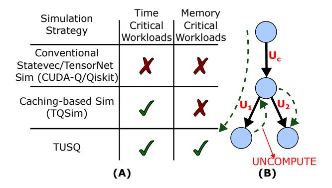
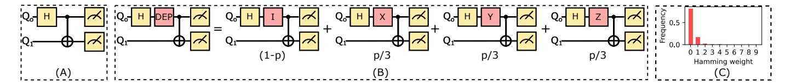
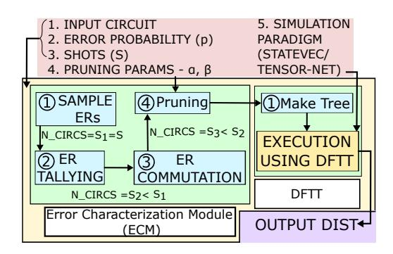
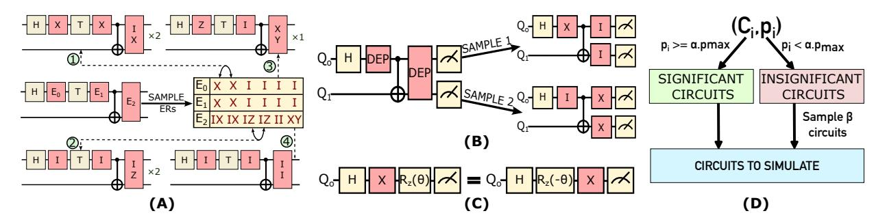
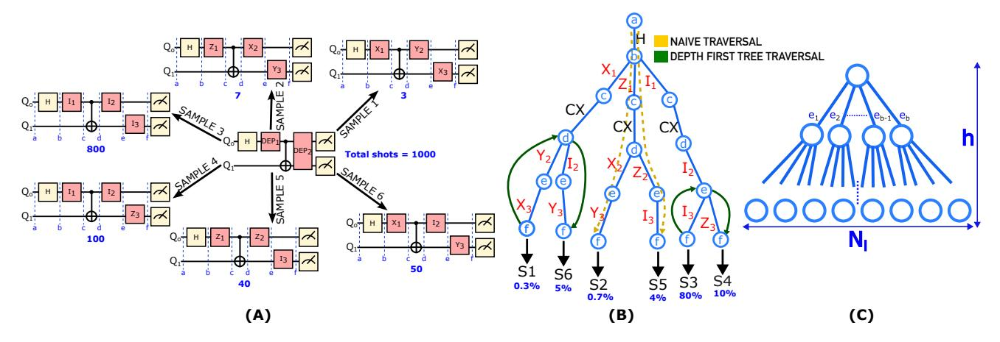
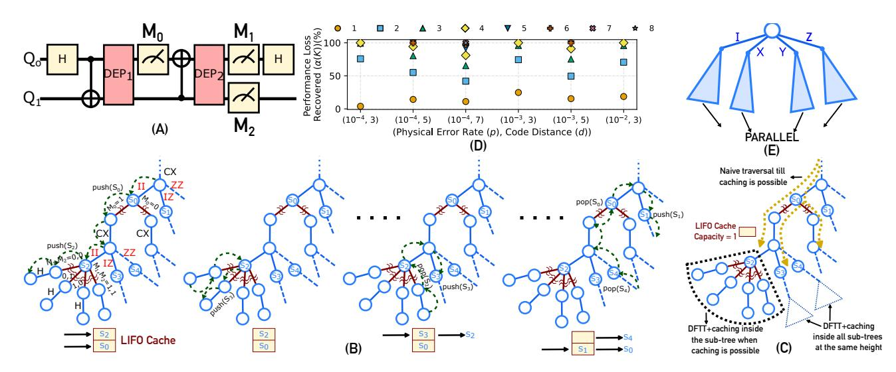
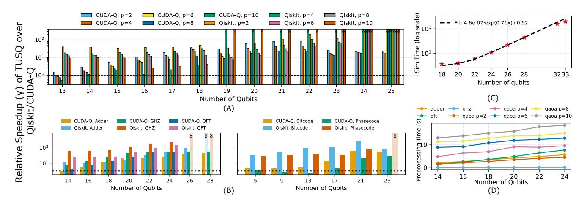

# TUSQ: Tracking, Uncomputation, and Sampling for Noisy Quantum Simulation

Siddharth Dangwal\* *University of Chicago* Chicago, USA siddharthdangwal@uchicago.edu

Tina Oberoi\* *University of Chicago* Chicago, USA toberoi@uchicago.edu

Ajay Sailopal\* *University of Chicago* Chicago, USA ajays@uchicago.edu

Dhirpal Shah *University of Chicago* Chicago, USA dhirpalshah@uchicago.edu

Frederic T. Chong *University of Chicago* Chicago, USA chong@cs.uchicago.edu

*Abstract*—Quantum computers have improved in size and quality in recent years, enabling the execution of complex circuits. However, for most researchers, access to compute time is limited. This necessitates the development of simulators that mimic noisy quantum hardware accurately and scalably. The ideal way to simulate noisy systems is via Density Matrix Simulation (DMS). However, its high memory footprint limits its scalability. Consequently, noisy simulations are performed in two steps: (a) sampling multiple circuits with fixed noisy gates from the stochastic noise channels, (b) performing the State Vector Simulations (SVS) of these circuits and averaging their output to obtain the effective noisy simulation result. This often leads to a substantial increase in compute overhead, slowing down the simulation. Existing methods solve this problem by caching critical intermediate results in memory and reusing them. However, when a simulation task is both compute and memoryintensive, we need to eliminate computational overheads without incurring extra memory overheads.

To enable fast simulation in the compute and memory bound regime, we propose *TUSQ* - Tracking, Uncomputation, and Sampling for Noisy Quantum Simulation. TUSQ is composed of two modules: the *Error Characterization Module* (ECM), and *Depth First Tree Traversal* (DFTT). The ECM characterizes errors so that the simulator can eliminate redundant circuit instances (via ER Tallying and ER Commutation), followed by importance sampling (in the Pruning stage), significantly reducing the number of circuits to be simulated relative to the baseline strategy of simulating all circuits. This is followed by DFTT, which computes the statevectors for these sampled circuits efficiently by taking advantage of circuit similarity, representing similar circuits in a tree and using computation and uncomputation to traverse the tree efficiently. TUSQ is evaluated for a total of 198 benchmarks, executed for 1 million shots and reports an average speedup of 59.06× and 13.38× over Qiskit and CUDA-Q, with a maximum speedup of 7878.03× and 439.38× respectively. We also compare TUSQ against TQSim in the time and memory critical regime. We observe an average and maximum speedup of 39.32× and 3134.31×, respectively.

*Index Terms*—Noisy Quantum Simulation, Statevector Simulation, Tensor Network Simulation

Fig. 1. (A) Simulation tasks can be memory critical, time critical or both. For computationally cheap tasks, a conventional simulator like Qiskit GPU/CUDA-Q [\[1\]](#page-13-0), [\[4\]](#page-13-1) works best since we avoid pre-processing time (which is usually performed on a CPU). For computationally expensive simulations that are not memory critical, we can cache critical intermediate results and reuse them to reduce simulation time. This is done in TQSim [\[41\]](#page-13-2). For tasks that are both time and memory critical, TUSQ eliminates computational redundancies using an initial pre-processing step. (B) For circuits with high overlap, TUSQ computes the output of the first, uncomputes to an intermediate stage and then carries out the remaining computation for the other, thereby reusing the computation for the initial overlapping portion.

## I. INTRODUCTION

Quantum computing has the potential to speed up tasks like factoring [\[35\]](#page-13-3), unordered search [\[19\]](#page-13-4), and physics and chemistry simulations [\[24\]](#page-13-5), [\[33\]](#page-13-6). However, compute time on these devices is scarce and expensive. It is often available only via cloud vendors like IBM [\[3\]](#page-13-7), Quantinuum [\[5\]](#page-13-8), and Quera [\[6\]](#page-13-9) with long queue times [\[34\]](#page-13-10). To accelerate quantum computing research, we need simulators that accurately mimic the execution of programs on real, noisy quantum hardware. We place a special emphasis on noisy simulations. Most current quantum simulators focus on noiseless simulation, which is not representative of real hardware [\[21\]](#page-13-11), [\[25\]](#page-13-12), [\[43\]](#page-13-13). Hence, scalable, noisy simulators are the need of the hour.

\*Equal contribution

Fig. 2. (A) A noiseless quantum circuit composed of one single- and one two-qubit gate. (B) A noisy version of the quantum circuit (A) with a non-unitary, stochastic depolarizing channel (DEP). This circuit can effectively be seen as a weighted classical average of four quantum circuits with the weights mentioned. Here, 'p' is the probability of noise on the H gate and is bounded between 0 and 1. (C)Frequency of sampled ERs by hamming weight. ERs with lower hamming weight (more I gates) are more frequent

The most popular quantum computing paradigm is gate-based quantum computing [30]. Noiseless gate-based systems can be simulated by starting in a known quantum state (represented as a complex vector), multiplying it with fixed unitary matrices (called gates) to obtain the final state and sampling it for a finite number of shots to output a classical probability distribution. A larger number of shots better represents the final quantum state, due to reduced sampling error. This method of performing noiseless *Quantum Circuit Simulation* (QCS) is called *State Vector Simulation* (SVS). Note that the matrix-vector multiplications needed to obtain the final vector need to be performed only once here.

Noisy QCS, on the other hand, involves stochastic noisy operations, which may manifest as different gates every shot. Figure 2 (B) gives an example of one such operation (DEP), which can manifest itself as four different operations (I/X/Y/Z) with varying probabilities. To accurately account for this stochasticity, we need to perform the entire sequence of matrix-vector multiplications afresh every time we sample the output vector. Hence, if our output distribution consists of S samples, we need to perform S distinct SVSs, resulting in an S-fold compute overhead.

An alternative approach to noisy QCS is *Density Matrix Simulation* (DMS), which can account for the effect of noise on a quantum state in one circuit execution. For this, DMS represents quantum states as matrices. Application of quantum operations is represented as matrix-matrix multiplication. Although DMS requires just one circuit execution, it has a quadratically higher memory overhead -  $\mathcal{O}(2^{2n}$  as opposed to  $\mathcal{O}(2^n)$ ) in the case of SVS, which makes it an infeasible choice [10], [23], [32], [41]. Ref [41] reports an estimate where El Capitan, one of the world's most powerful supercomputers, can handle at most a 25-qubit DMS, whereas one can run a 30-qubit SVS on a personal laptop with 16GB memory.

The excessive memory overhead of DMS makes the use of multiple SVSs the most efficient strategy for conducting noisy QCS. The accuracy of SVS for noisy QCS depends on the number of SVS samples (S) used. The statistical error w.r.t. DMS scales as  $\epsilon = \frac{\sigma}{\sqrt{S}}$ , where  $\sigma$  is the standard deviation of the observable across the ensemble. For larger circuits (more gates), the value of  $\sigma$  is also greater, which requires a bigger value of S to keep  $\epsilon$  low [41]. Further, more noisy gates imply a lower output fidelity, which also warrants an increased number of samples to get a non-zero useful signal. This, coupled with a longer time to perform each individual

SVS, results in a rapid increase in the compute overhead of noisy QCS. Such workloads that take a long time to run on available hardware are called *time-critical* workloads.

Recent noisy simulators like TQSim [41] handle this large compute requirement by caching critical intermediate results in memory and reusing them. This approach is quite practical when the workload has fewer qubits or the available memory is large. For example, TQSim simulates up to 20 qubit benchmarks (8MB memory consumption) on CPUs with 192 GB memory and on GPUs with 40GB memory. The additional memory allows caching of greater than or equal to 24576 and 5120 intermediate statevectors, respectively, which leads to a massive reduction in compute overhead. However, consider the simulation of a 30-qubit program on a 40GB GPU. The memory footprint of an *n*-qubit statevector scales as  $\mathcal{O}(2^n)$ . A 30 qubit statevector has a size of  $\sim 8GB$ ! This means a maximum of 5 statevectors can be cached at any given time, severely limiting our ability to reuse computation. Such workloads that consume the majority of available memory are called memory-critical. The number of gates in a quantum program is often a function of the number of qubits. Thus, the exponential scaling of the statevector memory with the number of qubits, coupled with the exponential scaling of intermediate states in the number of gates (not all of them are critical though), makes a caching-based strategy sub-optimal in the time and memory critical regime.

This work addresses both compute and memory constraints by proposing *TUSQ*: Tracking, Uncomputation, and Sampling for Noisy Quantum Simulation. Figure 1 (A) shows TUSQ's regime of interest. If the simulation is not compute-intensive, paying a CPU pre-processing cost is sub-optimal and a trivial simulation of the SVS ensemble on GPUs, as performed by Qiskit-GPU [4] and CUDA-Q [8], is preferred. A caching-based solution like TQSim is preferred for computationally intensive tasks when additional memory is available. In the compute and memory-constrained regime, TUSQ's on-CPU pre-processing step for redundancy elimination in the SVS ensemble makes noisy QCS faster than other approaches.

TUSQ's pre-processing step comprises two modules - *Er-ror Characterization Module* (ECM), and *Depth First Tree Traversal* (DFTT). Central to both modules is a lightweight Intermediate Representation (IR) called *Error Realization* (ER) that enables us to determine the amount of computational redundancy among circuits. Performing matrix-vector multiplications to obtain the final statevector is much more

expensive than sampling it multiple times [32]. The ECM uses ERs to identify circuits with the same final statevector, enabling their collective simulation by computing the common statevector once and sampling repeatedly from it. Once we are left with only unique circuits, the ERs also allow us to weigh the significance of each unique circuit and eliminate those with an insignificant contribution to the output. After this, DFTT computes the statevectors for these sampled circuits efficiently by taking advantage of circuit similarity, representing similar circuits in a tree and using computation and uncomputation to traverse the tree efficiently. Figure 1 (B) shows the simulation of two distinct circuits (represented by unitaries  $U_1U_c$  and  $U_2U_c$ ) with the same first half. TUSQ obtains the final statevector of the first circuit, uncomputes to the common intermediate stage and then carries out the remaining computation for the other, thereby saving on the time needed to simulate the common first half again. When generalized for all gates across all circuits, we effectively perform a Depth-First Tree Traversal (DFTT).

The net result of these optimizations is that we can simulate a 30-qubit adder circuit for  $10^6$  shots on a 40GB Nvidia A100 GPU in  $\sim 820$  seconds. The same benchmark on popular simulators like CUDA-Q and Qiskit takes more than 10 hours (keeping hardware specifications the same). Thus, TUSQ achieves high speed in the compute and memory critical regime. Overall, the key contributions of our work are:

- The Error Characterization Module (ECM) eliminates all circuit instances which do not produce a distinct statevector or which contribute insignificantly (based on user-defined threshold parameters) to the final output.
- 2) Depth First Tree Traversal (DFTT) groups circuits together based on the extent of their initial overlapping gates. The collection of circuits is represented as a tree, with the initial overlapping portion of two distinct circuits represented using the same edges, facilitating computational reuse.
- 3) Although most of the discussion in the paper assumes Statevector simulations, TUSQ is backend agnostic. We create a GPU-compatible software implementation of TUSQ and evaluate noisy Statevector and Tensor Network simulations. An open-source implementation of TUSQ can be found here.
- 4) We evaluate TUSQ on 198 benchmarks and report average speedups of  $59.06 \times$  and  $13.38 \times$  over Qiskit and CUDA-Q, with maximum speedups of  $7878.03 \times$  and  $439.38 \times$ , respectively. We also compare TUSQ against TQSim [41] in the time and memory critical regime and observe an average and maximum speedup of  $39.32 \times$  and  $3134.31 \times$  respectively.

#### II. NOISY QUANTUM CIRCUIT SIMULATION

In Section I, we described Statevector Simulation (SVS). Equation (1) shows the vector representation of a quantum state  $(|\psi\rangle)$ , and how it is manipulated using a unitary matrix, U, in the statevector formalism.

$$|\psi'\rangle = U\,|\psi\rangle = \begin{pmatrix} a_{00} & a_{01} & \dots & a_{0,2^k-1} \\ a_{10} & a_{11} & \dots & a_{1,2^k-1} \\ \vdots & \vdots & \ddots & \vdots \\ a_{2^k-1,0} & a_{2^k-1,1} & \dots & a_{2^k-1,2^k-1} \end{pmatrix} \begin{pmatrix} v_0 \\ v_1 \\ \vdots \\ v_{2^n-1} \end{pmatrix}$$

The statevector formalism is sufficient when representing noiseless systems. However, in the presence of noise, we rely on a different formalism called the density matrix formalism. Here, qubits are represented as a positive semidefinite Hermitian matrix  $\rho$  with a unit trace [29] called the density-matrix. Operations on the qubits are represented as maps between the initial state  $\rho$  and final state  $\rho'$  according to the equation  $\rho' = \sum_i K_i \rho K_i^{\dagger}$ . All quantum operations, noisy or noiseless, can be represented using DMS. For example, the application of a noiseless gate U, as given in Equation (1), becomes  $\rho' = U\rho U^{\dagger}$  in the density matrix formalism. Similarly, a depolarizing error channel acts as  $\rho' = (1-p)\rho + \frac{p}{3}X\rho X + \frac{p}{3}Y\rho Y + \frac{p}{3}Z\rho Z$ . Here, p denotes the probability of noise corrupting the state  $\rho$ . Performing QCS by implementing the equations of the density matrix formalism is called density matrix simulation (DMS). DMS gives us an elegant way to perform noisy QCS. However, as mentioned in Section I, the memory overhead of DMS grows quadratically faster compared to SVS, which limits the number of qubits that can be simulated even on supercomputing clusters [41]. Note that the depolarizing channel output is a sum of four terms corresponding to four outcomes - the quantum state stays unchanged with probability 1-p and it is acted upon by X/Y/Z gates, each with probability  $\frac{p}{3}$  (see Figure 2 (B)). This output can be interpreted as a weighted classical mixture of the input state  $\rho$  acted upon by unitary gates I, X, Y and Z. This interpretation lets us represent the output of noisy OCS as a sum of the outputs of multiple SVSs, each with a fixed manifestation of the noisy channels. This gives us a way to use the state vector formalism in the presence of noise with some extra circuit overhead as shown in Figure 2(B). Simulators like CUDA-Q [8], [32], and Qiskit [4] perform noisy simulation by executing these circuits sequentially.

Another commonly used simulation paradigm is Tensor Network Simulation (TNS) [31]. In spirit, it is similar to SVS since it also involves matrix vector multiplications. However, TNS defines an additional parameter, bond dimension D, which is the maximum allowable rank of any matrix in the circuit. If the rank of a matrix U is greater than D, we approximate it by assigning a value of 0 to its eigenvalues outside of the top D eigenvalues. TNS enables efficient simulation of wider and deeper circuits compared to SVS. However, this comes at the cost of approximations in the output. TNS is especially useful for simulating low entanglement circuits since they naturally have a small value of D.

#### III. MOTIVATION AND PROPOSAL

In Section II, we discuss that when using SVS or TNS, multiple simulations are needed to perform one noisy QCS. In effect, we trade off the memory overhead for higher

Fig. 3. TUSQ Overview: (A) Error Characterization Module (ECM) - The ECM characterizes errors so that the simulator can eliminate redundant circuit instances (via ER Tallying and ER Commutation) followed by importance sampling (in the Pruning stage) significantly reducing the numbers of circuits to be simulated ( $S_3 \ll S_1$ ) (See Section III-A) (B) DFTT then computes the statevectors for these sampled circuits efficiently by taking advantage of circuit similarity, representing similar circuits in a tree and using computation and uncomputation to traverse the tree efficiently (See Section III-B).The inputs to TUSQ are highlighted in red above the figure. The final output distribution is highlighted in purple.

computational cost. Our primary objective is to reduce this computational overhead and, hence, the simulation time. To achieve our objective, we introduce two modules - the *Error Characterization Module* (ECM), and *Depth First Tree Traversal* (DFTT). The ECM is further composed of three steps: (a) ER Tallying, (b) ER Commutation and (c) Pruning. The overall schematic of TUSQ is shown in Figure 3.

#### A. Error Characterization Module (ECM)

The goal of ECM is to analyze all circuit instances (say S) needed for a single noisy simulation and find instances that produce unique and significant outputs. Instead of computing the output statevector afresh every time, we compute only the unique instances and draw as many samples from them as their respective frequencies. Discarding insignificant circuits saves computational overhead at the cost of a marginal approximation error. To identify these instances, we propose three procedures: (a) Error Realization (ER) Tallying, (b) ER Commutation and (c) Pruning.

1) Error Realization (ER) Tallying: As shown in Figure 2(B), a circuit with noisy channels can be seen as a classical average of circuits with "fixed noisy gates" (the I/X/Y/Zgates remain fixed). We can obtain these fixed circuits from the noisy circuits by sampling the noise channels. We call the set of gates sampled from the noise channels per SVS instance an error realization (ER). For example, for a depolarizing noise channel with a 10% error rate (p = 0.1), the ER could be I (No error) with 90% probability (1-p), and X, Y, or Z (Error) with probability 3.3% each  $(\frac{p}{3})$ . For a circuit with n depolarizing channels, the ER would be the n-tuple of the ERs of each channel, eg -  $(I_0, X_1, Y_2, ..., I_{N-1})$ . Currently, on most reasonable quantum computers, the error rate per operation varies between 0.1% and 10%. This results in ERs with low Hamming weights [2] (fewer non-I gates). Since the probability of the I gate is much higher than the probability of X/Y/Z gates, the lower the Hamming weight of an ER, the higher its probability of occurrence. Figure 2 (C) shows the frequency of ERs of length 20, as a function of their Hamming weights for p=1%. We observe that the probability of an ER having a Hamming weight greater than 2 is zero.

Using this insight, we start tracking the frequencies of different ERs. We pre-sample all noisy channels for a given number of shots before performing the SVS, and keep track of the unique ERs and their frequencies. If any ER (say  $e_i$ ) occurs  $s_i$  times, we can simulate the corresponding circuit  $(c_i)$  once and sample the output state vector  $s_i$  times rather than performing  $s_i$  separate SVSs. Since sampling an output state vector multiple times is much cheaper than implementing matrix-vector multiplications [32], ER tallying reduces compute overhead substantially. The high-level overview of ER tallying is shown in Figure 4 (A).

2) ER Commutation: ER tallying keeps count of the unique ERs and their frequencies. However, there are instances where, despite being different, the ERs produce the same output state vector. Consider the circuit shown in figure 4 (B), and two sample ERs - (X, II) and (I, XX). Since these ERs are different, naively, we would compute the state vector for each of them separately. However, an X gate on the control qubit of a CNOT gate, when commuted through, leads to an extra X gate on the target qubit. This can be verified easily by performing the corresponding matrix multiplications. Thus, despite being different, these ERs produce the same result. Based on the circuit, this behavior might be ubiquitous, which gives us a greater opportunity for overhead reduction. ER commutation identifies such ER instances and groups them, i.e. if  $(c_1, s_1)$  and  $(c_2, s_2)$  are two (circuit, shot) tuples corresponding to distinct ERs  $e_1$  and  $e_2$ , which produce the same output state vector, then we remove the  $(c_2, s_2)$  tuple and update  $s_1$  as  $s_1 \rightarrow s_1 + s_2$ .

A noisy gate is pushed to the right until it encounters a situation where pushing it further will modify the noiseless circuit. For example, in Figure 4 (B), we push the noisy X gate through the CNOT since none of the noiseless circuit gates (Hadamard, CNOT, and measurement) is altered in this process. However, in Figure 4 (C), we do not push the X gate through the  $R_z$  since doing so would alter the argument of  $R_z$  from  $\theta$  to  $-\theta$ , modifying the noiseless circuit. Once this has been done, we simply compare the new ERs of  $c_1$  and  $c_2$ . If they are the same, we add their counts.

3) ER Commutation - Algorithm and Implementation: In order to benefit from ER commutation, we must ensure that the time taken to push the gates is small. If each circuit consists of a total of  $g_1$  gates out of which  $g_2$  are noisy gates, then in the naive case we would need to perform  $\mathcal{O}(g_1 \cdot g_2)$  operations per circuit to carry out ER commutation. The process would be similar to bubble sort. If the total number of unique circuits at the end of ER tallying is  $S_2$ , the total number of operations becomes  $\mathcal{O}(S_2 \cdot g_1 \cdot g_2)$ . This is a high cost.

We can reduce this cost using a greedy algorithm that is very close to optimal in practice. The algorithm starts by initializing a vector of stacks, one stack corresponding to each qubit. Our circuits are assumed to be transpiled into a basis of single-qubit

Fig. 4. (A) ER tallying overview: The circuit's noise channels (colored pink) are sampled to obtain the Error Realization (ER) for each channel and the combined ER of the circuit, which is an n-tuple of all individual channel ERs. If the ER  $e_i$  occurs  $s_i$  times, then the corresponding circuit  $c_i$ , is simulated once, and its output vector is sampled  $s_i$  times. (B) ER Commutation overview: The ERs corresponding to the two samples are different - (X, II) vs (I, XX). However, they produce the same output statevector. Sample 1 can be converted into Sample 2 by commuting the X error through the CNOT (C) The circuits on the left and right are equivalent. However, we do not push the noisy X gate through the  $R_z$  gate since it changes the argument from  $\theta$  to  $-\theta$ , effectively changing the noiseless circuit. (D) We evaluate the significance of each circuit by comparing its frequency of occurrence  $p_i$  with that of the most frequent circuit,  $p_{max}$ . If  $p_i \geq \alpha \cdot p_{max}$ , then it is significant, else it is not. All significant circuits are simulated. For insignificant circuits, we sample  $\beta$  random circuits and add them to the set of circuits to simulate.

Fig. 5. (A) Post-ECM circuits to simulate, along with their respective frequencies (B) The circuits are stored as a tree. The nodes represent the state vector at a particular point in the circuit. The edges represent gates. For each circuit, we can traverse from the root (a) to the leaf (f), updating the state vector by multiplying it with the respective edge's gate (Naive traversal as shown by the golden arrows). Computation reuse is facilitated by rolling back to a previous intermediate state. For example, once we have computed the output of Sample 1 (S1), we traverse back the edges (apply inverse of the gate) to node (d), and then down the branch of S6 (green arrows). For the example shown using the green arrows, we don't have to perform the multiplications from node (a) through node (d) for S6. This is Depth First Tree Traversal (DFTT) (C) For a depolarizing noise model, every node has 4 child nodes. In the case of measurement noise, there are just 2 child nodes.

gates and the CNOT gate. The noise sources are measurement noise and depolarizing noise, which includes Pauli twirled decoherence noise (see Section VI-A), all of which result in Pauli noisy gates. At every step of the algorithm, we maintain the invariant that each noisy gate is present as far to the right of the circuit as possible. This invariant is preserved using a set of commutation rules listed below:

- 1) Multiple noisy Pauli gates back-to-back are multiplied together to condense them into a single noisy Pauli gate.
- 2) A noisy Pauli gate can commute through any other noiseless Pauli gate.
- 3) Pauli gates X/Y/Z commute through rotation gates along the respective axis, i.e.  $R_X/R_Y/R_Z$ .
- 4) An X gate on the control (target) qubit of a CNOT, when pushed through the CNOT, results in an X gate on the control and target qubits (only on the target qubit) (see Figure 4 (B)).

- 5) A Z gate on the target (control) qubit of a CNOT, when pushed through the CNOT, results in a Z gate on the control and target qubits (only on the control qubit).
- 6) A Y gate on the control qubit of a CNOT, when pushed through the CNOT, results in a Y gate on the control qubit and an X gate on the target qubit, while a Y gate on the target qubit of a CNOT, when pushed through, results in a Z gate on the control qubit and a Y gate on the target qubit.

We iterate through the gates of our circuit. For each noiseless candidate gate in our circuit, we check the tops of the stacks of the qubits on which the gate acts. If the stack is empty or the top gate is one that doesn't commute with our candidate gate (as per our commutation rules), we push the candidate gate and proceed. If the top of the stack has a noisy gate that commutes (as per the commutation rules 2-6 enumerated below) with the candidate gate, then pop from the stack, push the candidate gate on the stack, and finally push new noisy gates according to the respective commutation rule. For each noisy candidate gate in the circuit, we check the tops of the stacks again. If we find existing noisy gates in the stacks, we simply merge the candidate gate with the existing noisy gates in the stacks according to rule 1; else, we push the candidate gate and proceed. This whole procedure maintains the circuit invariant of having noisy gates as much to the right as possible.

This process is repeated until all gates in the circuit are exhausted. Once that is done, we combine the shots of the circuits with the same ER.

4) **Pruning**: Figure 2(C) shows that the frequency of an ER decreases exponentially with an increase in its Hamming weight. Hence, the distribution of the number of ERs is not uniform. The primary contribution to an output distribution comes from a small fraction of ERs. We call circuits corresponding to these low hamming weight, high-frequency ERs as the significant circuits ( $\mathcal{C}_{\mathcal{S}}$ ). The set of low-frequency circuits is called insignificant circuits ( $\mathcal{C}_{\mathcal{I}}$ ). If the frequency of the most commonly occurring circuit is  $p_{max}$ , we define a constant  $\alpha$  such that any circuit with frequency  $p_i \geq \alpha \cdot p_{max}$  is significant, else it is insignificant. For this paper, we choose  $\alpha = 0.01$ .

Since these circuits are supposed to signify noise, which itself has stochasticity associated with it, eliminating circuit instances with low weights would introduce only a negligibly small perturbation to the circuit. Hence, for the significant circuits, we obtain the output state vector and sample it normally. For the insignificant circuits, we represent their collective contribution, instead of their individual contribution (which is negligibly small). The individual frequency of each insignificant circuit may be small; however, the sum of their frequencies (say  $p_{insig}$ ) can be substantial. For example, when simulating a 10-qubit QAOA circuit for a million shots, the significant circuits account for 58%, while the insignificant circuits account for 42% of the total shots. In this case, simply ignoring all insignificant circuits introduces a large error. Hence, we randomly sample a subset of insignificant circuits  $\mathcal{K} = \{(c_{t_1}, p_{t_1}), (c_{t_2}, p_{t_2}), ..., (c_{t_{\beta}}, p_{t_{\beta}})\}$ . The number  $\beta$  is a user-chosen hyperparameter. We compute the final state vector  $v_{t_i}$  for each element in K, and sample it for a total of  $\frac{p_{insig}}{\sum_{i=1}^{\beta} p_{t_i}} \cdot p_{t_i}$  times. This ensures that the total contribution of the set of insignificant circuits is maintained in the output distribution, even though each circuit's individual impact on the output is not very noticeable. The final number of circuits that we need to simulate is given by

$$S_{final} = \sum_{i} \mathbf{1}_{p_i \ge \alpha \cdot p_{max}} + \min(\beta, |\mathcal{C}_{\mathcal{I}}|)$$
 (2)

## B. Depth First Tree Traversal (DFTT)

Once we have obtained the set of circuits to simulate (the set of all significant circuits and representative insignificant circuits), we perform their SVS and average their output. The most naive way to achieve this is to perform matrix-vector multiplications for each SVS separately. However, we observe

that there are many opportunities for computation reuse across circuits, which we exploit using DFTT.

Figure 5 (A) shows the post-ECM SVS candidate circuits along with their respective frequencies of occurrence. If we place these circuits in a tree-like structure as shown in Figure 5 (B), we can facilitate computational reuse across them.

The nodes (a)-(f) denote the state vector at their respective positions in the circuit, while the edges represent gates acting on them (see Figure 5(A)). A parent-to-child edge traversal involves updating the state vector by multiplying it by the gate corresponding to the edge between the nodes. A child-to-parent edge traversal involves multiplying the state vector by the inverse of the corresponding gate. For the time being, we assume that all gates, noisy or noiseless, are unitary and have valid inverses. Such cases are ubiquitous, as discussed in Section VI-A. Circuits with non-unitary operations are handled in Section III-B2. The output of a circuit can be computed by traversing the root ((a)) to the leaf ((f)) for that circuit.

Once we have reached a leaf, we can reuse parts of the computation to reach other leaves. For example, in Figure 5(B), once we have reached the output of S1, we can follow the green arrows to obtain the output of S6, without having to traverse nodes (a)-(d) again. We roll back to a previous state and proceed from there instead of starting from scratch for S6, which saves us many compute operations. As the circuit gets larger, these benefits multiply. As mentioned in Section I, an alternative approach, as taken by TQSim [41], [26], would be to memoize node (d) when computing S1, and use it later when computing S6 instead of starting from scratch. Ref [41] also discusses how the memory in large-scale HPC systems stays underutilised to motivate their memoization based solution. In the case of DFTT, this additional available space is utilized by traversing multiple sub-trees in parallel. For example, if we are utilizing only 25% of the total memory, we can copy the state in the root down to its children and perform DFTT on the respective subtrees in parallel, as shown in Figure 6 (E). This offers an additional speedup.

1) **DFTT-Asymptotic Complexity**: In this section, we formally show the asymptotic advantage obtained by performing DFTT instead of naive simulation.

Consider a noise model where after every gate we apply a noisy channel with b different possibilities  $\{e_1, e_2, ..., e_b\}$ . For example, in the case of single qubit depolarizing noise b = 4 ( $\{I, X, Y, Z\}$ ), and in the case of measurement noise b = 2 ( $\{I, X\}$ ). For simplicity, we will assume the value of b to be fixed throughout the circuit. This creates a tree in which the number of nodes at each tree level grows exponentially. Let the total number of edges in the tree be |E|, the height of the tree be h, and the number of leaf nodes be  $N_l$  (see Figure 5 (C)). For DFTT, the number of operations  $(T_{dftt})$  is equal to the number of edge traversals. We traverse every edge twice, which gives us  $T_{dftt} = 2|E| = \mathcal{O}(|E|)$ . In the naive implementation, we traverse all the way from the root to a leaf node for every leaf node. The number of such traversals is equal to the number of leaves -  $N_l$ . The number of edges in each traversal is equal to the height of the tree. Hence

Fig. 6. Refer to Section III-B2 for details on DFTT+Caching (A) Circuit with two layers of mid-circuit measurements that we simulate using DFTT+Caching. (B) Traversing the tree using DFTT+Caching for the circuit in subfigure (A). During tree traversal, pre-mid-circuit-measurement (MCM) nodes are pushed to a LIFO cache (capacity K). These are accessed again when we traverse back through the mid-circuit measurement edge (colored red and marked with the  $\approx$  symbol). We annotate the edges of the first tree with the names of the operation they correspond to. We do not draw the complete tree due to space constraints and represent potentially omitted edges using dashed blue lines. Although demonstrated for mid-circuit measurements, DFTT+Caching works for all non-invertible channels. (C) When cache capacity (say K=1) is less than the number of MCM layers (two layers for our circuit), we traverse down to the K-th pre-MCM node from the leaf (shown with yellow dotted arrows) and perform DFTT+Caching on the sub-tree rooted at this node. We do this for all eligible subtrees. (D) Non-invertible channels force us to "switch-off" DFTT and use naive tree traversal, causing performance loss. Caching states before non-invertible channels and using DFTT for invertible channels enables us to recover performance (see Section III-B2 for details). We show the performance recovered as a function of the number of caches for six different surface code circuits for physical error rate  $(p) = 10^{-2}$ ,  $10^{-3}$  and  $10^{-4}$  and code distances (d) = 3, 5, 7. (E) If extra memory is available, we parallelize DFTT across sub-trees. An n-fold parallelization leads to an n-fold increase in memory.

 $T_{naive} = N_l \times h$ . Note that, at every tree level, the number of edges grows exponentially by a factor of b. Hence,  $b+b^2+\ldots+b^h=|E| \implies b\cdot(\frac{b^h-1}{b-1})=|E| \implies h=\log_b((b-1)|E|+b)-1$ 

Further, the number of leaf nodes is equal to the number of edges at the last level, which gives us  $N_l=b^h=(1-\frac{1}{b})|E|+1$ .

Using these two expressions, we get  $T_{naive} = N_l \times h = ((1-\frac{1}{b})|E|+1) \times (\log_b((b-1)|E|+b)-1) = \mathcal{O}(|E|\log_b|E|)$ . Thus, DFTT reduces the number of operations from  $\mathcal{O}(|E|\log_b|E|)$  to  $\mathcal{O}(|E|)$ .

2) Simulation of non-invertible channels: While the ECM works well for arbitrary quantum channels, the backtracking step in DFTT enforces all operations to be invertible. This assumption, although mostly valid, breaks down in certain key scenarios, e.g., mid-circuit measurements and erasures. A naive approach to simulating such circuits within TUSQ is to "switch off" DFTT, where we perform a root-to-leaf traversal for each leaf node independently, as shown by the golden dotted arrows in Figure 5 (B). Hence, the simulation doesn't fail, but the speedup from DFTT disappears. All speedup is due to the ECM alone.

However, based on the amount of memory available, we can tweak the design of DFTT to incorporate caching, thereby offering a speedup even in the presence of non-invertible channels. If we cache the state immediately before a non-invertible channel, DFTT can proceed normally throughout the circuit tree, except when backtracking across a non-invertible edge. Instead of backtracking, which is not permitted in this

case, we fetch the state from the cache. We call the set of states to be cached the "caching set". We explain our design, which we call DFTT+Caching, with the help of Fig. 6. Fig. 6(A) shows the circuit we are simulating. It consists of two layers of mid-circuit measurements (MCMs). Note that while there are three MCMs in the circuit, the number of non-invertible channels is just two - one corresponding to each layer of MCMs. We can merge all MCMs in the same layer into a single edge in the tree since access to a state with only a subset of concurrent MCMs applied (and others not applied) is never needed in our simulation. Merging all concurrent MCMs reduces the cache requirements drastically. Figure 6 (B) shows the DFTT+Caching protocol for a cache size, K=2. All the edges corresponding to non-invertible MCM layers are colored red and marked with the  $\approx$  sign. As soon as we encounter a pre-MCM node in the tree, we push it into a Last-In-First-Out (LIFO) cache. We pop the node once we have back-traversed all of its child edges (i.e. reached the node back from all of its children) since it would not be needed subsequently in the simulation. We perform the tree traversal while pushing to and popping from the LIFO cache till we reach the rightmost leaf of the tree, which marks the end of the simulation.

Note that in Fig. 6(B), the cache capacity, K=2, is equal to the number of non-invertible channels in the circuit. Hence, all pre-MCM nodes make it to the caching set. This enables us to fully recover any potential performance loss caused by non-invertible channels. However, in the memory-constrained regime, caching opportunities are limited. Often, the cache capacity, K, is smaller than the number of non-invertible

channels. In this case, the caching set stores the K pre-MCM nodes that are closest to the leaf in every branch. Figure [6](#page-6-1) (C) shows this situation with cache capacity K = 1. Here, in the first branch, state S2 gets cached while S0 doesn't (since S2 is closer to the leaf than S0). Since we cannot perform DFTT+Caching throughout the tree in this case, we traverse down to the "shallowest" (one with the least depth or farthest away from a leaf) node in the caching set from the root, and perform DFTT+Caching on the sub-tree rooted at this node. In Figure [6](#page-6-1) (C), the "shallowest nodes" are S2, S3 and S4. Once we finish DFTT+Caching inside one sub-tree, we traverse down to another "shallowest node" from the root and traverse its sub-tree using DFTT+Caching. This process is repeated till all sub-trees are traversed.

Figure [6\(](#page-6-1)D) shows the performance recovered by DFTT+Caching (α(K)) as a function of cache capacity (K) for rotated Surface Code memory circuits. We use the circuits' inbuilt Stim implementation [\[14\]](#page-13-23). We sweep the physical error rate (p) across three values - 10−2 , 10−3 , 10−4 and the code distance (d) across three values too - 3, 5, 7, leading to circuits with 26/64/118 physical qubits. We perform d rounds of measurement on each circuit, which leads to d non-invertible channels. Each circuit is sampled 1 million times. Suppose that the traversal with "DFTT switched off" requires N1 operations. Now, consider a hypothetical scenario where a tree with non-invertible edges can be fully traversed using DFTT in N2 operations. Note that this scenario is not realistic; however, N2 serves as a tight lower bound for DFTT+Caching. The number of operations performed by DFTT+Caching for a K-sized cache is denoted by NDF T T +Caching,K. Our performance recovery metric α(K) is defined as

$$\alpha(K) = \frac{N_1 - N_{DFTT + Caching, K}}{N_1 - N_2} \tag{3}$$

When NDF T T +Caching,K is equal to the N2 (operations needed by DFTT), we recover 100% performance.

Note that for Figure [6\(](#page-6-1)D), we do not perform the actual traversal. Rather, we count the number of operations needed to traverse the tree, enabling us to get estimates for circuits with up to 118 qubits. A single-qubit matrix vector multiplication is counted as 1 operation, and a two-qubit matrix vector multiplication is counted as 4 operations. Forward traversal across a non-invertible edge is 1 operation, while a back traversal is 0 operations (since we fetch from the cache).

We observe that a capacity-3 cache is enough to recover 60%− 100% of the performance across benchmarks. To recover the same amount of performance, the cache requirement increases with d. A higher d implies more measurement rounds, and hence more non-invertible channels, which leads to a larger cache requirement.

Other non-invertible channels like erasures, leakage errors, etc., can also be simulated using DFTT+Caching. Such logical channels are ubiquitous in FTQC-relevant logical level simulations, further highlighting the usefulness of TUSQ.

| Benchmark | Qubits | Depth  | Gate Counts |
|-----------|--------|--------|-------------|
| QAOA      | 13-25  | 82-770 | 130-1250    |
| Adder     | 4-28   | 69-289 | 97-417      |
| Bitcode   | 5-25   | 4-144  | 4-144       |
| Phasecode | 5-25   | 8-48   | 20-470      |
| GHZ       | 14-28  | 14-28  | 14-28       |
| QFT       | 14-24  | 27-47  | 105-300     |
| BV        | 4-24   | 6-26   | 14-74       |

TABLE I BENCHMARKS USED TO EVALUATE TUSQ FOR NOISY STATEVECTOR SIMULATIONS

### IV. METHODOLOGY

#### *A. Evaluation Infrastructure*

TUSQ is evaluated for noisy Statevector and Tensor Network simulations. TUSQ uses Nvidia's cuStateVec and cuTensorNet libraries [\[8\]](#page-13-18) as the backend kernels for performing statevector and tensor network simulations, respectively. Note that since TUSQ is backend agnostic, the user can use any simulation kernel of their choice. All benchmarking experiments were performed on the NERSC *Perlmutter* supercomputer. Each compute node is equipped with an AMD EPYC 7763 CPU (64 cores/128 threads), and NVIDIA A100 (40 GB) GPUs. Unless explicitly stated, computations were restricted to a single GPU using the CUDA\_VISIBLE\_DEVICES=0 environment variable.

#### *B. Benchmarks*

For our statevector simulations, we use the benchmarks from the Supermarq [\[37\]](#page-13-24) benchmark suite given in Table [I.](#page-7-0) Our benchmarks have been chosen to represent a variety of circuit structures - linear (GHZ, Bitcode, Phasecode), and parallel (QAOA); qubit counts - 13-28 qubits; circuit depths - 4-770; gate counts - 4-1250; and output distributions - unimodal (Adder, Bitcode, Phasecode), bimodal (GHZ), distribution with pronounced peaks (QAOA), and uniform distribution (QFT).

For the multi-GPU evaluation study (Section [V-A](#page-8-0) and Fig. [7](#page-8-1) (C)), we simulate up to 33-qubit circuits. For our tensor network simulation study (Section [VI-B](#page-11-1) and Table [III\)](#page-11-2), we simulate up to 40-qubit circuits.

#### *C. Metrics*

*1) Speedup (*γA/B*):* This metric quantifies the simulation speedup of protocol "A" with respect to protocol "B" as the ratio of the time taken by protocol "B" to that of the time taken by protocol "A".

$$\gamma_{A/B} = \frac{simulation\_time_B}{simulation\_time_A} \tag{4}$$

*2) Relative Fidelity Difference (*δA,B*):* Relative Fidelity Difference quantifies the deviation in fidelity reported by protocols A and B for the same program. If the fidelity of protocol A is fA, and fidelity of protocol B is fB, we have

$$\delta_{A,B} = \frac{|f_A - f_B|}{f_A + f_B} \tag{5}$$

where 0 < fA, fB ≤ 1 and 0 ≤ δA,B ≤ 1.

Fig. 7. Speedup Offered by TUSQ over Qiskit and CUDA-Q for QAOA (Subplot A), and Adder, GHZ, QFT, Bitcode and Phasecode (Subplot B). Note that for the QAOA subplot, p represents the number of layers in the QAOA ansatz. Higher p implies a deeper circuit. The bar's height represents the time taken by the baseline divided by TUSQ's wall time. The higher the bar, the greater the speedup. There are cases where the baseline times out on the Perlmutter cluster. These are represented with a bar reaching the roof of the plot and marked with an ∞ sign. TUSQ is the fastest simulator for 193 out of 198 benchmarks. There are 5 cases where CUDA-Q outperforms TUSQ (9, 13 qubit Phasecode and 13 qubit,p=6/8/10 QAOA). These programs have a small simulation time and are not time-critical. In this case, TUSQ's CPU pre-processing time becomes the speed bottleneck instead of GPU execution time. However, the wall clock time is low in both cases, with TUSQ simulating these programs in 1.36, 4.49, 29.37, 44.20, and 77.14 seconds, respectively. Compared to Qiskit, TUSQ's average relative speedup is 59.06×, with a maximum value of 7878.03×. Compared to CUDA-Q, the relative speedup is 13.38× with a maximum value of 439.38×. (C) Time taken to simulate 32 and 33 QAOA circuits (p=2, 32k shots) by splitting the statevector across multiple GPUs. Smaller (< 30 qubits) circuits need only a single GPU. The simulation time for 32 and 33-qubit circuits fits the exponential curve generated from the smaller circuits, demonstrating that multi-GPU execution does not add any significant serial overhead in TUSQ. (D) CPU preprocessing time of TUSQ: We observe an expected increase in the CPU pre-processing time with qubit size, with an average and maximum time of 3.97 and 18.52 seconds, respectively.

#### *D. Noise Modeling*

Our current noise models involve depolarising errors, measurement errors, and amplitude and phase damping errors, with the latter two being represented in their Pauli twirled form [\[13\]](#page-13-25). The Pauli twirling is needed to ensure Unitary noise gates, which are a prerequisite for DFTT. A detailed discussion of compatible noise models and their practical usefulness is given in Section [VI-A.](#page-11-0) For our experiments, we consider a value of probability of error p = 1%. We also evaluate TUSQ for p = 0.1% for some studies.

#### *E. Baseline*

We compare TUSQ against three GPU noisy simulators - Nvidia's CUDA-Q version 0.11.0, IBM's Qiskit version 2.1.0 and TQSim [\[41\]](#page-13-2). These first two simulators are widely adopted in the community, while TQSim is a recently published work. The backend kernel in all libraries is Nvidia cuStateVec v1.12.0. For our Tensor Network Simulation study, we integrate TUSQ with Nvidia cuTensorNet v2.9.1 and compare it against CUDA-Q with the tensornet-mps flag.

#### *F. Number of Shots*

There are various factors which decide the number of shots needed for simulation. We need to choose enough samples such that the statistical error with respect to DMS is minimized. Another factor is the output circuit fidelity. Since we are performing a noisy simulation, we want enough shots such that our output distribution has some useful signal. Our largest circuit has 1250 gates. For a 1% error rate, the fidelity is 3.4 × 10−6 . Hence, we need at least 106 shots to get a useful signal. For a lower error rate, we need fewer shots to get a useful signal. Another important factor to consider is the sampling error when measuring the quantum state. We want to have enough shots such that the quantum state is accurately captured. However, the exact number of shots here depends on the shape of the output distribution as well. In the case of workloads like BV, which have a single peak, the number of shots needed to capture the quantum state is low. However, for QFT or QAOA, where information about the entire distribution is needed, we need a large number of shots.

Past work also seems to have no consensus on the number of shots. Wang et. al. [\[41\]](#page-13-2) use 32,000 shots for all workloads (up to 25 qubits), while Patti et. al. [\[32\]](#page-13-17) use 109 shots for a 35 qubit simulation. For our work, we show our results for a variety of shots - 32k, 100k, 1 Mil, and 10 Mil.

#### V. EVALUATION

#### *A. Speedup*

Figure [7](#page-8-1) (A)-(B) shows the performance of TUSQ compared to Qiskit and CUDA-Q for 198 benchmarks. The height of each bar equals the value of the relative speedup. Bars that touch the roof of the plot and are marked with an ∞ sign correspond to cases where the baseline (Qiskit/CUDA-Q) didn't finish in 40 hours and timed out on Perlmutter.

TUSQ outperforms Qiskit on all benchmarks, and CUDA-Q on 193 out of 198 benchmarks. TUSQ is worse than CUDA-Q for the 9 and 13 qubit Phase Code, and the 13 qubit QAOA with p=6, 8, and 10. These programs have small simulation times and are not time-critical. In this case, TUSQ's CPU pre-processing time becomes the speed bottleneck instead of GPU execution time, hence a conventional GPU simulation is faster. However, the wall clock time is low in both cases, with TUSQ simulating these programs in 1.36, 4.49, 29.37, 44.20, and 77.14 seconds, respectively.

We observe that TUSQ's relative speedup increases with the number of qubits. This is expected since simulation time scales exponentially in the number of qubits. Hence, any improvement in simulation time also scales exponentially. Another trend that we observe in Figure [7](#page-8-1) (A) is that keeping the number of qubits fixed, the speedup reduces with an increase in the value of the depth parameter p (not to be confused with simulation error rate – p is an overloaded term in literature). This happens because of the reduction in the effectiveness of ER Tallying at greater depths. A deeper circuit results in a higher likelihood of ERs being distinct for the same number of qubits. This is also reflected in Figure [10](#page-10-0) (A), where the effectiveness of ER Tallying drops dramatically between the p = 2 and p = 6 case for all QAOA workloads.

Compared to Qiskit, TUSQ's average relative speedup is 59.06×, with a maximum value of 7878.03×. Compared to CUDA-Q, the relative speedup is 13.38× on average with a maximum value of 439.38×. Figure [7\(](#page-8-1)D) shows the scaling of CPU pre-processing time for TUSQ. It increases with the number of qubits, with an average and maximum time of 3.97 and 18.52 seconds, respectively. TUSQ can be extended to multi-GPU and multi-node systems for large statevectors. We split the statevector into multiple sub-vectors that are stored across different GPUs. If a gate acts only on one subvector, we update it locally. If it involves the manipulation of amplitudes scattered across multiple sub-vectors, we move all relevant amplitudes to a single GPU and operate on them. This incurs a communication overhead on top of the compute cost. Figure [7\(](#page-8-1)C) shows the time taken by TUSQ for 32 and 33-qubit simulations across multiple GPUs. We observe that these simulation times fit the exponential curve generated by the simulation times of smaller (< 30 qubit) circuits, demonstrating that multi-GPU execution does not add any significant serial overheads.

