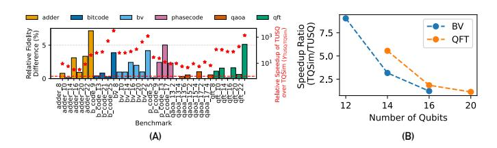
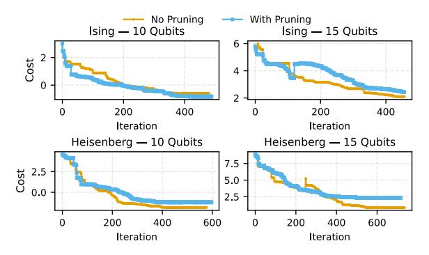

# *B. Deviation in Fidelity*

The Pruning step in TUSQ eliminates "insignificant" circuits which might lead to a deviation in fidelity from the baseline. All other steps of TUSQ - ER Tallying, ER Commutation, and DFTT are fidelity preserving. Figure [8](#page-9-0) (A) (primary axis) shows the Relative Fidelity Difference between the Pruning and no-Pruning approaches (δpruning,no pruning) for six benchmarks - BV, Adder, Bitcode, Phasecode, QAOA, and QFT. These values have been calculated for α = 0.01 and β = 100. The size of benchmarks varies from 8 to 22 qubits. The average value (arithmetic mean) of δ is 1.66%, and the maximum value is 7.15%. Note that geometric mean is not a valid metric in this case, since δ is equal to 0 for a few cases.

The effect of these fidelity deviations on algorithmic correctness is minimal, if any. For example, as shown in Figure [9,](#page-9-1) the VQE convergence plots with and without pruning error for 10 and 15-qubit Ising and Heisenberg Hamiltonians [\[9\]](#page-13-26),

Fig. 8. (A) Primary axis - Relative fidelity difference due to Pruning. Pruning is the only potential source of fidelity loss in TUSQ. All other steps are perfectly fidelity preserving. We see a relative fidelity difference of 1.66% on average, which goes up to 7.15%. Secondary axis (in red) - Relative speedup of TUSQ over TQSim (in the high compute and memory critical regime), keeping fidelity loss the same for both methods. The fidelity loss incurred is equal to the bar height. TUSQ consistently outperforms TQSim for the same value of fidelity loss with an average and maximum spedup of 39.32× and 3134.31× respectively (B) Relative speedup of TQSim over TUSQ in the low compute, non memory-critical regime. For BV and QFT, TQSim is on average 3.26× and 2.25× faster than TUSQ, respectively. As the number of qubits grows (and the benchmarks become memory-critical), the speedup ratio decreases, demonstrating that TUSQ is the optimal choice for time and memory-critical benchmarks.

Fig. 9. VQE convergence plots for 10 and 15 qubit Ising and Heisenberg Hamiltonians, with and without pruning error. The plots in all cases show similar convergence, highlighting the negligible effect of pruning error on VQE algorithmic correctness.

[\[11\]](#page-13-27) are very similar. For the Adder and BV benchmarks, the final output value from a noisy distribution is the bit-string with the highest frequency. We compare 320 instances of the Adder circuit (corresponding to 4-22 qubits) with and without pruning error. We observe that for 289 out of 320 instances, the inferred bit-string from a pruned distribution is the same as the one inferred from the original unpruned distribution. We also compare 380 instances of the BV benchmark (with and without pruning error), for qubits ranging from 4 to 26. We observe that the output bit-string is the same for the pruned and unpruned distributions in 368 out of 380 cases. Hence, we see that for most cases, the pruning error does not have a practical effect on algorithmic correctness.

Although a strict trend for δ cannot be predicted because of its dependence on many variables, we generally expect its value to increase as the number of gates in the circuit increases. This is because more gates imply a greater number of error channels, which makes the ER frequency distribution less skewed. A less-skewed probability distribution deviates more from the original when we chop off its tail.

Another thing to note is that lower δ values can be achieved

| Shots         | 32k   | 100k  | 1 Mil   | 10 Mil   |
|---------------|-------|-------|---------|----------|
| γT USQ/CUDA−Q | 4.51× | 14.1× | 140.51× | 2075.44× |

TABLE II VARIATION OF γT USQ/CUDA−Q FOR DIFFERENT SHOT VALUES.

at the cost of increased simulation time. If the user wants less fidelity deviation, then a lower value of α and a higher value of β parameters should be used. The exact values to be used are based on user preferences.

### *C. Scaling with shots and physical error rate*

Figure [10](#page-10-0) (B) shows the speedup (γT USQ/CUDA−Q) of TUSQ relative to CUDA-Q for shots ranging from 32,000 to 10,000,000. As mentioned in Section [IV-F,](#page-8-2) the number of shots needed to run a workload depends on various factors. To demonstrate the effectiveness of TUSQ across shot values, we perform a sweep from 32,000 to 10,000,000 shots.

We observe that γT USQ/CUDA−Q increases with the number of shots. An increase in shots comes with added compute time. However, it also means that the likelihood of any two circuits having computational redundancies increases. Since CUDA-Q doesn't look for opportunities to eliminate redundancies, it encounters a sharper increase in compute time relative to TUSQ. Hence, we report a greater speedup with more shots, further highlighting the performance of TUSQ for computeintensive, time-critical benchmarks. We would like to highlight that while the performance gains of TUSQ increase with the number of shots, it remains the better choice across the entire range of shots considered. The speedup numbers for p = 1% (solid markers) are given in Table [II.](#page-10-1)

For 32k and 100k shots, we also evaluate the speedup for p = 0.1% (hollow markers). For all benchmarks, the speedup in the case of p = 0.1% is greater than in the case of p = 1%. This is attributed to a higher likelihood of the I gate in ERs. This would mean more computational redundancy and hence, a higher speedup.

