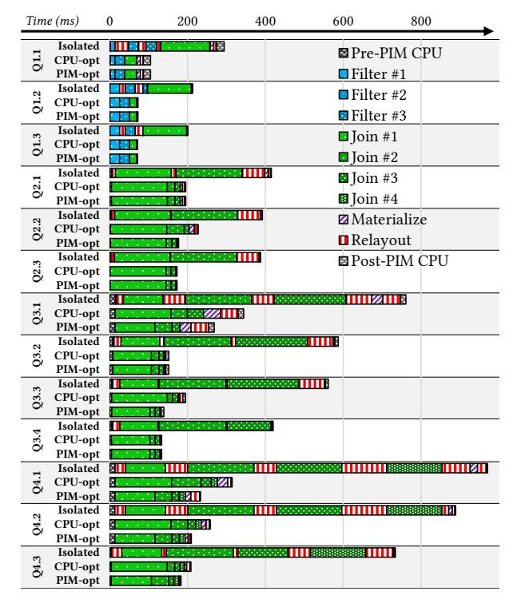

# C. End-to-end Query Workflow

Fig. 9 illustrates the workflow of a query in a BLIMP-aware DBMS. We make no changes to query parsing (uncolored box) and analysis of a conventional DBMS, apart from extracting semantics to understand the PIMDT column constraint proposed in Sec. IV-A. For the query planner and optimizer (hatched boxes), we use heuristics discussed earlier to make it PIM-friendly: operator pipelining, low-selectivity-first ordering, and late materialization strategies.

&lt;sup>7This "CPU recommendation" comes from a DuckDB plan (Sec. VII).

Fig. 9: High-level query workflow. Uncolored components follow "typical" DBMS design. Solid-colored components are implementations for running on PIM. Hatched-boxes are components that we have "hand-tailored" (future work to automate) based on heuristics outlined in Sec. VI. Solid arrows denote relayout, either from or to PIM.

These heuristics drive the final query plan, which a query executor will follow. For operators performed on non-PIMDT columns, normal host execution and pipelining are followed. For operators targeting PIMDT columns, a query executor will need to recognize if the operation is implemented/available. In case of unsupported operations, the executor should fall back to the host. If supported, it is dispatched using the operator's distinct workflow. Importantly, while PIM computation is happening, all PIM data access to said column is restricted (as discussed in Sec. II-B), therefore downstream and even parallel-adjacent operations must be stalled. However, the host could do meaningful work during this time, e.g. other independent parts of the query, partial materialization, etc.

Most operations on PIM (solid boxes) have a generalized workflow, with slight distinctions. In general, each operator has a pre-processing step, taking into consideration how much data is to be processed (where to partition the PIMDT) and setting up data structures (e.g., building hash tables). After pre-processing, the kernel executable, PIMDT partitions, and any input/auxiliary data are loaded into BLIMP banks via relayout routines (solid arrows). Once all banks receive their data, they begin execution. Kernels execute until completion or exception, following a fetch, execute, store workflow. Once done, the operator may need to supply additional input data to complete the computation for the partition. This can be used to facilitate host-mediated cross-bank data transfer or to alleviate restrictive memory constraints (e.g., joins may perform multiple rounds of computation as each hash table partition will need its own round of offload as discussed in Sec. V-B). After all computation on a PIMDT partition is complete, the operator begins partition postprocessing. Here the operator may partially materialize results or leave them in situ for later operators. Additionally, there may be cases where not all partitions of a PIMDT column were consumed (e.g., a 32GB column on a 16GB BLIMP memory system). In such cases, the process is repeated where unconsumed

partitions are processed (as discussed in Sec. IV-A). Once all partitions are served, the operator may materialize or consume the output, depending on the query plan. Finally, this pipeline is repeated for each operator scheduled to execute on PIM until all scheduled operations (host or PIM) complete, materialize, and the final result is delivered.

#### VII. END-TO-END QUERY EVALUATION FOR BLIMP

Thus far, we have discussed the implementation and performance of individual DBMS operators, the layout requirements necessary to enable PIM computation on columns of data, the modified (CPU-oriented) strategies for operator materialization, chaining, and ordering, and the orchestration steps needed for offload. We are now ready to consider the performance of end-to-end queries on a prototype PIM-aware DBMS utilizing the BLIMP-S and BLIMP-V platforms. As one baseline for comparison, we consider the host running *DuckDB*, a stateof-the-art analytical DBMS [63]. However, a DBMS such as DuckDB includes significantly higher overhead in its query execution than bare-metal performance (due to parsing, query optimization, logging, etc.), thus widely differing from the maximum possible performance of the CPU. To consider this, we also implement highly optimized, multithreaded, SIMD (AVX512) C++ queries under best-case scenarios, which we use as a true *baseline*. These kernels are programmed statically to perform each query and are hand-tuned to extract the best performance from our host (without using PIM).

#### *A. Star Schema Benchmark (SSB)*

We use a real-world, standardized query benchmark suite: the Star Schema Benchmark [62]. SSB is designed to evaluate the performance of data warehouse DBMSes, and consists of a single fact table (LINEORDER) that is accompanied by several dimension tables (CUSTOMER, DATE, PART, and SUPPLIER). Despite being based on TPC-H [74], it features several query modifications that aim to provide both functional and selectivity coverage across all query flights to model common data warehouse query workloads. There are four query flights, QF1-QF4, with increasing query complexity in later flights. Within each flight there are 3-4 queries, where later queries are progressively more selective. To evaluate a prototype heterogeneous DBMS on SSB, we specify the following LINEORDER columns to be in PIMDT format: i) all foreign key columns (lo\_orderdate, lo\_partkey, lo\_suppkey, and lo\_custkey) to evaluate in-memory joins, and ii) common filter columns (lo\_quantity, lo\_discount) to evaluate in-memory filtering. We run SSB at scale factor 100 (totaling 60GB of data) for all evaluations.

#### *B. Overall Baseline Comparisons*

Fig. 10 demonstrates SSB query flight speedups for DuckDB and BLIMP platforms normalized against a handoptimized C++ query baseline. In this evaluation, relayout, host orchestration, hash-build, data loading, and postprocessing times for PIM *are now considered*. Overall, we

Fig. 10: SSB query flight runtime speedup of BLIMP-S/-V and DuckDB normalized against "hand-optimized" (a well-engineered, compiled query that bypasses typical inter-operator boundaries and other realistic limitations of many modern DBMSes) CPU queries. Absolute runtimes for the hand-optimized kernels are given below each query.

find (state-of-the-art) DuckDB is  $2.3\times$  slower than the maximum performance achievable by the hand-tuned host version, while in contrast we find BLIMP-S and BLIMP-V speedups averaging  $1.4\times$  and  $2.3\times$ , respectively, over the baseline, and  $3.1\times$  and  $5.8\times$ , respectively, against DuckDB.

We emphasize the use of a hand-optimized C++ baseline, which we use to represent an ideal performance target. Each baseline query is hand-designed and hand-optimized, leveraging machine-specific knowledge when constructing each query. Furthermore, because each query is implemented as a single, monolithic (C++) function, a compiler can optimize this kernel-per-query far beyond what typical database management systems can achieve. In effect, each query is performed via a singular compiled and fused operator. While this approach yields exceptionally high single-operator performance, it is usually too rigid for practical use in any currently available open-source database management system. We use this baseline to assess performance beyond a strong baseline; anticipating that DuckDB will benefit from future advancements, we create a baseline that more closely reflects the maximum performance modern machines are capable of.

Considering BLIMP-S vs. BLIMP-V, we find that, on average, BLIMP-V is  $1.7\times$  faster than BLIMP-S. The most notable performance difference between the two platforms is between QF1 and QF2-4. This is due to the fact that QF1 is the only query flight that contains two predicate-based filters on the fact table, while query flights 2-4 are primarily join-focused. When looking at these separately, BLIMP-V outperforms BLIMP-S in QF1 by an average of  $2.5\times$ , and by an average of  $1.4\times$  in QF2-4. These results reflect the importance of the vectorization engine in selection. However, not all query components benefit from the vector engine. For example, while the hashing algorithm can be vectorized with BLIMP-V, each hash lookup cannot. Of the vectorizable components, scan-based filtering operators tend to deliver the strongest use case for BLIMP-V.

When considering BLIMP-S speedups against the baseline, we find relatively consistent performance across query flights, with two outliers: Q4.1 and Q4.3. Query flight 4 is the most memory-intensive of the SSB query suite, as it includes queries that join the LINEORDER table with *all* four dimension tables. Therefore, these queries are heavily impacted by memory access overheads. For Q4.1, we find higher than average performance for BLIMP-S. This query has the longest host

execution runtime (both in C++ implementation and DuckDB), largely due to the cost of joining-in all dimension tables. In PIM, we do not suffer from this same drawback because we are already operating in memory, thereby allowing BLIMP-S to achieve higher-than-usual performance against the host.

Further, the Q4.3 CPU baseline is unique: Unlike all other queries, where DuckDB generates a left-deep join tree, it uses a "bushy" join tree instead [59]. Among other differences, bushy join trees require rebuilding hash tables after successive joins. While this join strategy is performant on the CPU, it would require multiple hash table builds using data output from previous joins, incurring repeated relayout, hash table build, and broadcast costs that cannot be mitigated by host-PIM parallelism. Similar to previous discussions (Sec. VI-B), this computational pattern is antithetical to our overarching goals of minimizing relayout costs.

#### C. Understanding End-to-End Performance

The results shown in Fig. 10 are from the best query plans for a PIM-aware query planner. Motivated by earlier discussions on the importance of PIM-awareness, we consider stringing individual operations together rather than taking holistic approaches and consider when we use a CPUfocused planner (as provided by DuckDB). To do this, we re-evaluate the SSB suite using BLIMP-S on three query-plan methodologies: i) Isolated: dispatch isolated operators to PIM, performing operations as they come, one after another (similar to Plan #2 in Sec. VI-A); ii) CPU-optimal: dispatch operators to PIM with the context of CPU-driven heuristics (Sec. VI-B); and iii) PIM-optimal: dispatch operators to PIM using PIMaware heuristics (those reported in Fig. 10). We break down the results from these query plans in Fig. 11, showing time spent in each operator, their order, and data relayout, materialization, and host orchestration costs.

Similar to the discussion in Sec. VI-A, we extrapolate operator results (Sec. V) in isolation to evaluate each SSB query, assuming operators execute one after another. This time, timings for orchestration, data layout, movement, and transformation are taken into consideration to perform the operation. Despite these queries performing slightly better than DuckDB, we find this methodology far from efficient: on average,  $2.1\times$  worse than baseline and  $3.2\times$  worse than PIM-optimal plans. As earlier, we find relayout to be the biggest culprit; on average, 22% of query runtimes are in

Fig. 11: End-to-end query flight breakdown of Isolated, CPUoptimized, and PIM-optimized query plans using BLIMP-S.

relayout routines due to output data being sent back to the host. Besides relayout, inefficient use of operator chaining and materialization also cause join algorithms to perform 3.1× worse on average than PIM-optimized joins. These results are expected: performing joins in isolation is known to generate poor query plans. In the CPU and PIM-opt configurations, we use left-deep join trees to leverage selectivity during the join pipeline, causing later joins to process fewer records, reducing end-to-end latency [65]. Evaluating operator performance in isolation leads to results that become antithetical to a goal of PIM: *reducing data movement*.

Following discussions in Sec. VI-B, we use DuckDB to generate CPU-centric optimal join orders of the SSB query suite. For some queries, the CPU-driven plans match the PIM-optimal query plans, such as in queries Q1.1-3, Q2.1, Q2.3, Q3.2, and Q3.4. As these query plans are the same, there is no difference in end-to-end runtime. However, for the remaining queries, differences in join orderings account for runtime differences of 28% on average against PIM-optimal plans, with a maximum difference of 40% in the case of Q3.3. This difference in runtime is directly related to the CPU-driven join ordering, which does not prioritize intermediate selectivity between the join operators; in the case of BLIMP, additional time is spent processing records that could have been excluded in a previous join. Instead, the CPU-centric plans prioritized other optimizations, such as smaller hash table sizes, which do not improve performance in the PIM context.

In summary, while studying individual operators and the impact of input parameters on their performance is valid, extrapolating results while assuming non-holistic views will not rigorously evaluate an operator's overall contribution to end-to-end query performance. Further, using existing CPUcentric query planning will not extract the utmost performance possible from PIM environments due to a *fundamental* difference in processing paradigm and system architecture.

## VIII. RELATED WORK

Many works merge databases with PIM; from those on specialized accelerators [21], [8], [43], [60], [36], [70] to those targeting specific database operations such as partitioning [77], selection [75], [79], hashing [39], [48], and joins [33], [57], [50] on a variety of PIM architectures such as UPMEM and AxDIMM. While some works target generalized databases, some focus on OLTP databases, which feature different access patterns [46]. There are also works which incorporate vector engines to accelerate database operators [7], [30], [29], [6] in HMC. In contrast to all these prior efforts, we not only implement and study individual database operators (both scalar and vector), but also evaluate end-to-end query planning, materialization, and orchestration holistically for OLAP databases. Finally, other heterogeneous environments have been explored to accelerate database workloads (such as GPUs, TPUs, and customized accelerators) [22], [42], [41], [75], [23]. While our study focuses on BLIMP, we do not defend or claim that this is the best or only heterogeneous option. In fact, we believe our study to be useful for other architectures, since they face similar constraints (memory and/or orchestration), and can benefit from our findings and work.

#### IX. CONCLUDING REMARKS

As the non-von Neumann era evolves to explore alternative hardware paradigms for different application domains, processing-in-memory offers a rich set of design options and opportunities for analytical databases. Existing studies in PIM demonstrate the feasibility of operator-specific query acceleration. However, extrapolating the performance of individual operators in isolation for an "end-to-end" evaluation requires significant assumptions regarding operator chaining and data format conversion costs. In this work, we do not make such assumptions and instead consider a holistic view of query evaluation, including facets such as data structure and storage requirements, operator implementation, materialization, and query planning. During our evaluation, we discovered that many existing heuristics to improve query performance are inherently CPU-centric and not fully amenable in a heterogeneous context. To remedy this deficiency, we identify an alternative set of query planning heuristics to improve end-toend query latency in PIM while performing a true end-to-end evaluation of an analytical database benchmark, SSB. We find that, in general, PIM-focused query plans perform better than CPU-derived query plans and that queries where holistic data movement is considered are significantly faster (on average 3.2×) than plans where operators are performed in isolation. Broadly, we find that our work expands the domain of OLAP DBMS research in the BLIMP domain, yielding many novel concepts and meaningful insights that could be applied to other heterogeneous domains.

## REFERENCES

- [1] (2021) Hbm pim technology samsung semiconductor. [Online]. Available: https://www.samsung.com/semiconductor/solutions/ technology/hbm-processing-in-memory/
- [2] (2021) riscvovpsim free imperas risc-v instruction set simulator; github. [Online]. Available: https://github.com/riscv-ovpsim/imperas-riscv-tests
- [3] (2021) Upmem; upmem is releasing a true processing-in-memory (pim) acceleration solution. [Online]. Available: https://www.upmem.com/
- [4] D. J. Abadi, D. S. Myers, D. J. DeWitt, and S. R. Madden, "Materialization strategies in a column-oriented dbms," in *2007 IEEE 23rd International Conference on Data Engineering*, 2007, pp. 466–475.
- [5] A. Ailamaki, D. J. DeWitt, M. D. Hill, and D. A. Wood, "Dbmss on a modern processor: Where does time go?" in *Proceedings of the 25th International Conference on Very Large Data Bases*, ser. VLDB '99. San Francisco, CA, USA: Morgan Kaufmann Publishers Inc., 1999, p. 266–277.
- [6] M. A. Z. Alves, M. Diener, P. C. Santos, and L. Carro, "Large vector extensions inside the hmc," in *2016 Design, Automation I& Test in Europe Conference I& Exhibition (DATE)*, 2016, pp. 1249–1254.
- [7] M. A. Z. Alves, P. C. Santos, M. Diener, and L. Carro, "Opportunities and challenges of performing vector operations inside the DRAM," in *Proceedings of the 2015 International Symposium on Memory Systems, MEMSYS 2015, Washington DC, DC, USA, October 5-8, 2015*, B. L. Jacob, Ed. ACM, 2015, pp. 22–28. [Online]. Available: https://doi.org/10.1145/2818950.2818953
- [8] C. Balkesen, N. Kunal, G. Giannikis, P. Fender, S. Sundara, F. Schmidt, J. Wen, S. Agrawal, A. Raghavan, V. Varadarajan, A. Viswanathan, B. Chandrasekaran, S. Idicula, N. Agarwal, and E. Sedlar, "Rapid: Inmemory analytical query processing engine with extreme performance per watt," in *Proceedings of the 2018 International Conference on Management of Data*, ser. SIGMOD '18. New York, NY, USA: Association for Computing Machinery, 2018, p. 1407–1419. [Online]. Available: https://doi.org/10.1145/3183713.3190655
- [9] C. Balkesen, J. Teubner, G. Alonso, and M. T. Ozsu, "Main-memory ¨ hash joins on multi-core cpus: Tuning to the underlying hardware," in *2013 IEEE 29th International Conference on Data Engineering (ICDE)*. IEEE, 2013, pp. 362–373.
- [10] F. Bancilhon and M. Scholl, "Design of a backend processor for a data base machine," in *Proceedings of the 1980 ACM SIGMOD International Conference on Management of Data*, ser. SIGMOD '80. New York, NY, USA: Association for Computing Machinery, 1980, p. 93–93g. [Online]. Available: https://doi.org/10.1145/582250.582265
- [11] Banerjee, Hsiao, and Kannan, "Dbc—a database computer for very large databases," *IEEE Transactions on Computers*, vol. C-28, no. 6, pp. 414– 429, 1979.
- [12] R. Barber, G. Lohman, I. Pandis, V. Raman, R. Sidle, G. Attaluri, N. Chainani, S. Lightstone, and D. Sharpe, "Memory-efficient hash joins," *Proc. VLDB Endow.*, vol. 8, no. 4, p. 353–364, dec 2014. [Online]. Available: https://doi.org/10.14778/2735496.2735499
- [13] J. L. Bentley and H. T. Kung, "A tree machine for searching problems," 1979. [Online]. Available: https://api.semanticscholar.org/CorpusID: 59702475
- [14] S. Blanas, Y. Li, and J. M. Patel, "Design and evaluation of main memory hash join algorithms for multi-core cpus," in *Proceedings of the 2011 ACM SIGMOD International Conference on Management of data*, 2011, pp. 37–48.
- [15] P. A. Boncz, M. L. Kersten, and S. Manegold, "Breaking the memory wall in monetdb," *Communications of the ACM*, vol. 51, no. 12, pp. 77–85, 2008.
- [16] P. A. Boncz, S. Manegold, and M. L. Kersten, "Database architecture optimized for the new bottleneck: Memory access," in *Proceedings of the 25th International Conference on Very Large Data Bases*, ser. VLDB '99. San Francisco, CA, USA: Morgan Kaufmann Publishers Inc., 1999, p. 54–65.
- [17] P. A. Boncz, S. Manegold, M. L. Kersten *et al.*, "Database architecture optimized for the new bottleneck: Memory access," in *VLDB*, vol. 99, 1999, pp. 54–65.
- [18] S. A. Browning, "The tree machine: A highly concurrent computing environment," Ph.D. dissertation, USA, 1980, aAI8014303.
- [19] S. Chen, A. Ailamaki, P. Gibbons, and T. Mowry, "Improving hash join performance through prefetching," in *Proceedings. 20th International Conference on Data Engineering*, 2004, pp. 116–127.

- [20] G. Chernishev, V. Galaktionov, V. Grigorev, E. Klyuchikov, and K. Smirnov, "A comprehensive study of late materialization strategies for a disk-based column-store," in *Proceedings of the 24th International Workshop on Design, Optimization, Languages and Analytical Processing of Big Data (DOLAP) co-located with the 25th International Conference on Extending Database Technology and the 25th International Conference on Database Theory(EDBT/ICDT 2022)*, ser. DOLAP' 22, 2022.
- [21] E. S. Chung, J. D. Davis, and J. Lee, "Linqits: big data on little clients," in *The 40th Annual International Symposium on Computer Architecture, ISCA'13, Tel-Aviv, Israel, June 23-27, 2013*, A. Mendelson, Ed. ACM, 2013, pp. 261–272. [Online]. Available: https://doi.org/10.1145/2485922.2485945
- [22] A. Dakkak, C. Li, J. Xiong, I. Gelado, and W.-m. Hwu, "Accelerating reduction and scan using tensor core units," in *Proceedings of the ACM International Conference on Supercomputing*, ser. ICS '19. New York, NY, USA: Association for Computing Machinery, 2019, p. 46–57. [Online]. Available: https://doi.org/10.1145/3330345.3331057
- [23] C. Dennl, D. Ziener, and J. Teich, "Acceleration of sql restrictions and aggregations through fpga-based dynamic partial reconfiguration," in *2013 IEEE 21st Annual International Symposium on Field-Programmable Custom Computing Machines*, 2013, pp. 25–28.
- [24] F. Devaux, "The true processing in memory accelerator," in *2019 IEEE Hot Chips 31 Symposium (HCS), Cupertino, CA, USA, August 18-20, 2019*. IEEE, 2019, pp. 1–24. [Online]. Available: https://doi.org/10.1109/HOTCHIPS.2019.8875680
- [25] A. Devic, S. B. Rai, A. Sivasubramaniam, A. Akel, S. Eilert, and J. Eno, "To pim or not for emerging general purpose processing in ddr memory systems," in *49th IEEE/ACM International Symposium on Computer Architecture, ISCA 2022*. Institute of Electrical and Electronics Engineers Inc., 2022, pp. 231–244.
- [26] D. J. DeWitt, "Direct a multiprocessor organization for supporting relational data base management systems," in *Proceedings of the 5th Annual Symposium on Computer Architecture*, ser. ISCA '78. New York, NY, USA: Association for Computing Machinery, 1978, p. 182–189. [Online]. Available: https://doi.org/10.1145/800094.803046
- [27] D. DeWitt, S. Ghandeharizadeh, D. Schneider, A. Bricker, H.-I. Hsiao, and R. Rasmussen, "The gamma database machine project," *IEEE Transactions on Knowledge and Data Engineering*, vol. 2, no. 1, pp. 44–62, 1990.
- [28] A. Doan, "Human-in-the-loop data analysis: A personal perspective," in *Proceedings of the Workshop on Human-In-the-Loop Data Analytics*, ser. HILDA '18. New York, NY, USA: Association for Computing Machinery, 2018. [Online]. Available: https://doi.org/10.1145/3209900. 3209913
- [29] S. R. dos Santos, T. R. Kepe, and M. A. Z. Alves, "Improved computation of database operators via vector processing near-data," in *35th IEEE International Symposium on Computer Architecture and High Performance Computing, SBAC-PAD 2023, Porto Alegre, Brazil, October 17-20, 2023*. IEEE, 2023, pp. 1–11. [Online]. Available: https://doi.org/10.1109/SBAC-PAD59825.2023.00010
- [30] S. R. dos Santos, F. B. Moreira, T. R. Kepe, and M. A. Z. Alves, "Advancing database system operators with near-data processing," in *30th Euromicro International Conference on Parallel, Distributed and Network-based Processing, PDP 2022, Valladolid, Spain, March 9-11, 2022*, A. Gonzalez-Escribano, J. D. Garc ´ ´ıa, M. Torquati, and A. Skavhaug, Eds. IEEE, 2022, pp. 127–134. [Online]. Available: https://doi.org/10.1109/PDP55904.2022.00028
- [31] M. Drumond, A. Daglis, N. Mirzadeh, D. Ustiugov, J. Picorel, B. Falsafi, B. Grot, and D. Pnevmatikatos, "The mondrian data engine," in *Proceedings of the 44th Annual International Symposium on Computer Architecture*, ser. ISCA '17. New York, NY, USA: Association for Computing Machinery, 2017, p. 639–651. [Online]. Available: https://doi.org/10.1145/3079856.3080233
- [32] J. D. Ferreira, G. Falcao, J. Gomez-Luna, M. Alser, L. Orosa, ´ M. Sadrosadati, J. S. Kim, G. F. Oliveira, T. Shahroodi, A. Nori, and O. Mutlu, "pluto: Enabling massively parallel computation in dram via lookup tables," in *2022 55th IEEE/ACM International Symposium on Microarchitecture (MICRO)*, 2022, pp. 900–919.
- [33] M. S. Franco, S. Dominico, T. R. Kepe, L. C. P. Albini, E. C. de Almeida, and M. A. Z. Alves, "Evaluation of hash join operations performance executing on SDN switches: A cost model approach," *J. Inf. Data Manag.*, vol. 13, no. 2, 2022. [Online]. Available: https://doi.org/10.5753/jidm.2022.2515

- [34] M. Frouzakis, J. Gomez-Luna, G. F. Oliveira, M. Sadrosadati, and ´ O. Mutlu, "Pimdal: Mitigating the memory bottleneck in data analytics using a real processing-in-memory system," *arXiv preprint arXiv:2504.01948*, 2025.
- [35] A. Gholami, Z. Yao, S. Kim, C. Hooper, M. W. Mahoney, and K. Keutzer, "Ai and memory wall," *IEEE Micro*, 2024.
- [36] B. Gold, A. Ailamaki, L. Huston, and B. Falsafi, "Accelerating database operators using a network processor," in *Proceedings of the 1st International Workshop on Data Management on New Hardware*, ser. DaMoN '05. New York, NY, USA: Association for Computing Machinery, 2005, p. 1–es. [Online]. Available: https://doi.org/10.1145/1114252.1114260
- [37] J. Gomez-Luna, I. El Hajj, I. Fernandez, C. Giannoula, G. F. Oliveira, ´ and O. Mutlu, "Benchmarking a new paradigm: Experimental analysis and characterization of a real processing-in-memory system," *IEEE Access*, vol. 10, pp. 52 565–52 608, 2022.
- [38] A. Gonzalez, A. Kolli, S. Khan, S. Liu, V. Dadu, S. Karandikar, J. Chang, K. Asanovic, and P. Ranganathan, "Profiling hyperscale big data processing," in *Proceedings of the 50th Annual International Symposium on Computer Architecture*, 2023, pp. 1–16.
- [39] S. Haas, O. Arnold, B. Nothen, S. Scholze, G. Ellguth, A. Dixius, ¨ S. Hoppner, S. Schiefer, S. Hartmann, S. Henker, T. Hocker, J. Schreiter, ¨ H. Eisenreich, J.-U. Schlußler, D. Walter, T. Seifert, F. Pauls, M. Hasler, ¨ Y. Chen, H. Hensel, S. Moriam, E. Matus, C. Mayr, R. Sch ´ uffny, and ¨ G. P. Fettweis, "An mpsoc for energy-efficient database query processing," in *2016 53nd ACM/EDAC/IEEE Design Automation Conference (DAC)*, 2016, pp. 1–6.
- [40] N. Hajinazar, G. F. Oliveira, S. Gregorio, J. D. Ferreira, N. M. Ghiasi, M. Patel, M. Alser, S. Ghose, J. Gomez-Luna, and O. Mutlu, "Simdram: ´ a framework for bit-serial simd processing using dram," in *Proceedings of the 26th ACM International Conference on Architectural Support for Programming Languages and Operating Systems*, 2021, pp. 329–345.
- [41] D. He, S. C. Nakandala, D. Banda, R. Sen, K. Saur, K. Park, C. Curino, J. Camacho-Rodr´ıguez, K. Karanasos, and M. Interlandi, "Query processing on tensor computation runtimes," *Proc. VLDB Endow.*, vol. 15, no. 11, p. 2811–2825, jul 2022. [Online]. Available: https://doi.org/10.14778/3551793.3551833
- [42] Y.-C. Hu, Y. Li, and H.-W. Tseng, "Tcudb: Accelerating database with tensor processors," in *Proceedings of the 2022 International Conference on Management of Data*, ser. SIGMOD '22. New York, NY, USA: Association for Computing Machinery, 2022, p. 1360–1374. [Online]. Available: https://doi.org/10.1145/3514221.3517869
- [43] Z. Istvan, G. Alonso, M. Blott, and K. Vissers, "A flexible hash table ´ design for 10gbps key-value stores on fpgas," in *2013 23rd International Conference on Field programmable Logic and Applications*, 2013, pp. 1–8.
- [44] L. Ke, X. Zhang, J. So, J.-G. Lee, S.-H. Kang, S. Lee, S. Han, Y. Cho, J. H. Kim, Y. Kwon, K. Kim, J. Jung, I. Yun, S. J. Park, H. Park, J. Song, J. Cho, K. Sohn, N. S. Kim, and H.-H. S. Lee, "Near-memory processing in action: Accelerating personalized recommendation with axdimm," *IEEE Micro*, vol. 42, no. 1, pp. 116–127, 2022.
- [45] T. R. Kepe, E. C. de Almeida, and M. A. Alves, "Database processing-inmemory: An experimental study," *Proceedings of the VLDB Endowment*, vol. 13, no. 3, pp. 334–347, 2019.
- [46] H. Kim, Y. Zhao, A. Pavlo, and P. B. Gibbons, "No cap, this memory slaps: Breaking through the memory wall of transactional database systems with processing-in-memory," *Proceedings of the VLDB Endowment*, vol. 18, no. 11, pp. 4241–4254, 2025.
- [47] W. Kim, D. Gajski, and D. J. Kuck, "A parallel pipelined relational query processor," *ACM Trans. Database Syst.*, vol. 9, no. 2, p. 214–235, jun 1984. [Online]. Available: https://doi.org/10.1145/329.332
- [48] O. Kocberber, B. Grot, J. Picorel, B. Falsafi, K. Lim, and P. Ranganathan, "Meet the walkers accelerating index traversals for in-memory databases," in *2013 46th Annual IEEE/ACM International Symposium on Microarchitecture (MICRO)*, 2013, pp. 468–479.
- [49] Y. Kwon, K. Vladimir, N. Kim, W. Shin, J. Won, M. Lee, H. Joo, H. Choi, G. Kim, B. An, J. Kim, J. Lee, I. Kim, J. Park, C. Park, Y. Song, B. Yang, H. Lee, S. Kim, D. Kwon, S. Lee, K. Kim, S. Oh, J. Park, G. Hong, D. Ka, K. Hwang, J. Park, K. Kang, J. Kim, J. Jeon, M. Lee, M. Shin, M. Shin, J. Cha, C. Jung, K. Chang, C. Jeong, E. Lim, I. Park, J. Chun, and S. Hynix, "System architecture and software stack for gddr6-aim," in *2022 IEEE Hot Chips 34 Symposium (HCS)*, 2022, pp. 1–25.

- [50] D. Lee, J. So, M. AHN, J.-G. Lee, J. Kim, J. Cho, R. Oliver, V. C. Thummala, R. s. JV, S. S. Upadhya, M. I. Khan, and J. H. Kim, "Improving in-memory database operations with acceleration dimm (axdimm)," in *Proceedings of the 18th International Workshop on Data Management on New Hardware*, ser. DaMoN '22. New York, NY, USA: Association for Computing Machinery, 2022. [Online]. Available: https://doi.org/10.1145/3533737.3535093
- [51] P. L. Lehman, *A Systolic (VLSI) Array for Processing Simple Relational Queries*. Berlin, Heidelberg: Springer Berlin Heidelberg, 1981, pp. 285– 295. [Online]. Available: https://doi.org/10.1007/978-3-642-68402-9 31
- [52] H.-O. Leilich, G. Stiege, and H. C. Zeidler, "A search processor for data base management systems," in *Proceedings of the Fourth International Conference on Very Large Data Bases - Volume 4*, ser. VLDB '78. VLDB Endowment, 1978, p. 280–287.
- [53] D. Lemire, "Fast Random Integer Generation in an Interval," *ACM Transactions on Modeling and Computer Simulation*, vol. 29, no. 1, pp. 3:1–3:12, Jan. 2019. [Online]. Available: https://dl.acm.org/doi/10. 1145/3230636
- [54] D. Lemire and O. Kaser, "Strongly Universal String Hashing is Fast," *The Computer Journal*, vol. 57, no. 11, pp. 1624–1638, Nov. 2014. [Online]. Available: https://doi.org/10.1093/comjnl/bxt070
- [55] M. Lenjani, P. Gonzalez, E. Sadredini, S. Li, Y. Xie, A. Akel, S. Eilert, M. R. Stan, and K. Skadron, "Fulcrum: A simplified control and access mechanism toward flexible and practical in-situ accelerators," in *2020 IEEE International Symposium on High Performance Computer Architecture (HPCA)*. IEEE, Feb. 2020. [Online]. Available: https://doi.org/10.1109/hpca47549.2020.00052
- [56] G. Li, "Human-in-the-loop data integration," *Proc. VLDB Endow.*, vol. 10, no. 12, p. 2006–2017, aug 2017. [Online]. Available: https://doi.org/10.14778/3137765.3137833
- [57] C. Lim, S. Lee, J. Choi, J. Lee, S. Park, H. Kim, J. Lee, and Y. Kim, "Design and analysis of a processing-in-dimm join algorithm: A case study with upmem dimms," *Proc. ACM Manag. Data*, vol. 1, no. 2, jun 2023. [Online]. Available: https://doi.org/10.1145/3589258
- [58] J. Liu, A. Wilson, and D. Gunning, "Workflow-based human-in-the-loop data analytics," in *Proceedings of the 2014 Workshop on Human Centered Big Data Research*, ser. HCBDR '14. New York, NY, USA: Association for Computing Machinery, 2014, p. 49–52. [Online]. Available: https://doi.org/10.1145/2609876.2609888
- [59] G. Moerkotte and T. Neumann, "Dynamic programming strikes back," in *Proceedings of the 2008 ACM SIGMOD international conference on Management of data*, 2008, pp. 539–552.
- [60] R. Mueller, J. Teubner, and G. Alonso, "Streams on wires: A query compiler for fpgas," *Proc. VLDB Endow.*, vol. 2, no. 1, p. 229–240, aug 2009. [Online]. Available: https://doi.org/10.14778/1687627.1687654
- [61] H. Q. Ngo, E. Porat, C. Re, and A. Rudra, "Worst-case optimal join ´ algorithms," *J. ACM*, vol. 65, no. 3, mar 2018. [Online]. Available: https://doi.org/10.1145/3180143
- [62] P. O'Neil, E. O'Neil, X. Chen, and S. Revilak, *The Star Schema Benchmark and Augmented Fact Table Indexing*. Berlin, Heidelberg: Springer-Verlag, 2009, p. 237–252. [Online]. Available: https://doi.org/10.1007/978-3-642-10424-4 17
- [63] M. Raasveldt and H. Muhleisen, "Duckdb: An embeddable analytical ¨ database," in *Proceedings of the 2019 International Conference on Management of Data*, ser. SIGMOD '19. New York, NY, USA: Association for Computing Machinery, 2019, p. 1981–1984.
- [64] S. B. Rai, A. Sivasubramaniam, A. Kumar, P. V. Rengasamy, V. Narayanan, A. Akel, and S. Eilert, "Design space for scaling-in general purpose computing within the ddr dram hierarchy for mapreduce workloads," in *Proceedings of the 18th ACM International Conference on Computing Frontiers*, 2021, pp. 113–123.
- [65] R. Ramakrishnan and J. Gehrke, *Database management systems*. McGraw-Hill, Inc., 2002.
- [66] P. Rosenfeld, E. Cooper-Balis, and B. L. Jacob, "Dramsim2: A cycle accurate memory system simulator," *IEEE Comput. Archit. Lett.*, vol. 10, no. 1, pp. 16–19, 2011. [Online]. Available: https://doi.org/10.1109/L-CA.2011.4
- [67] Sam Benzaquen, Alkis Evlogimenos, Matt Kulukundis, and Roman Perepelitsa, "Swiss Table Design Notes." [Online]. Available: https: //abseil.io/about/design/swisstables#credits
- [68] Schuster, Nguyen, Ozkarahan, and Smith, "Rap.2—an associative processor for databases and its applications," *IEEE Transactions on Computers*, vol. C-28, no. 6, pp. 446–458, 1979.

- [69] V. Seshadri, D. Lee, T. Mullins, H. Hassan, A. Boroumand, J. Kim, M. A. Kozuch, O. Mutlu, P. B. Gibbons, and T. C. Mowry, "Ambit: Inmemory accelerator for bulk bitwise operations using commodity dram technology," in *Proceedings of the 50th Annual IEEE/ACM International Symposium on Microarchitecture*, 2017, pp. 273–287.
- [70] V. Seshadri, T. Mullins, A. Boroumand, O. Mutlu, P. B. Gibbons, M. A. Kozuch, and T. C. Mowry, "Gather-scatter dram: In-dram address translation to improve the spatial locality of non-unit strided accesses," in *Proceedings of the 48th International Symposium on Microarchitecture*, ser. MICRO-48. New York, NY, USA: ACM, 2015, pp. 267–280. [Online]. Available: http://doi.acm.org/10.1145/2830772.2830820
- [71] L. Shrinivas, S. Bodagala, R. Varadarajan, A. Cary, V. Bharathan, and C. Bear, "Materialization strategies in the vertica analytic database: Lessons learned," in *2013 IEEE 29th International Conference on Data Engineering (ICDE)*, 2013, pp. 1196–1207.
- [72] H. S. Stone, "A logic-in-memory computer," *IEEE Transactions on Computers*, vol. C-19, no. 1, pp. 73–78, 1970.
- [73] The PostgreSQL Global Development Group. (2024, Feb) PostgreSQL 16.2 Documentation: 8.1.4. Serial Types. [Online]. Available: https://www.postgresql.org/docs/16/datatype-numeric.html# DATATYPE-SERIAL
- [74] T. P. P. C. (TPC), "TPC Benchmark H," Apr. 2022. [Online]. Available: https://www.tpc.org/TPC Documents Current Versions/pdf/ TPC-H v3.0.1.pdf
- [75] L. Woods, Z. Istvan, and G. Alonso, "Ibex: An intelligent storage ´ engine with support for advanced sql offloading," *Proc. VLDB Endow.*, vol. 7, no. 11, p. 963–974, jul 2014. [Online]. Available: https://doi.org/10.14778/2732967.2732972
- [76] L. Wu, R. Sharifi, M. Lenjani, K. Skadron, and A. Venkat, "Sieve: Scalable in-situ DRAM-based accelerator designs for massively parallel k-mer matching," in *2021 ACM/IEEE 48th Annual International Symposium on Computer Architecture (ISCA)*. IEEE, Jun. 2021. [Online]. Available: https://doi.org/10.1109/isca52012.2021.00028
- [77] L. Wu, R. J. Barker, M. A. Kim, and K. A. Ross, "Navigating big data with high-throughput, energy-efficient data partitioning," in *The 40th Annual International Symposium on Computer Architecture, ISCA'13, Tel-Aviv, Israel, June 23-27, 2013*, A. Mendelson, Ed. ACM, 2013, pp. 249–260. [Online]. Available: https://doi.org/10.1145/2485922.2485944
- [78] W. A. Wulf and S. A. McKee, "Hitting the memory wall: Implications of the obvious," *SIGARCH Comput. Archit. News*, vol. 23, no. 1, pp. 20–24, Mar. 1995. [Online]. Available: http: //doi.acm.org/10.1145/216585.216588
- [79] S. L. Xi, A. Augusta, M. Athanassoulis, and S. Idreos, "Beyond the wall: Near-data processing for databases," in *Proceedings of the 11th International Workshop on Data Management on New Hardware*, ser. DaMoN'15. New York, NY, USA: Association for Computing Machinery, 2015. [Online]. Available: https://doi.org/10.1145/2771937. 2771945