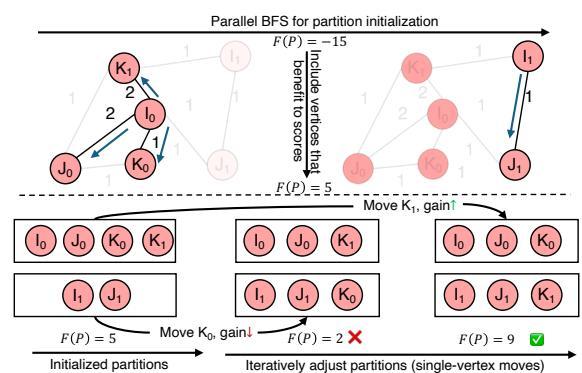
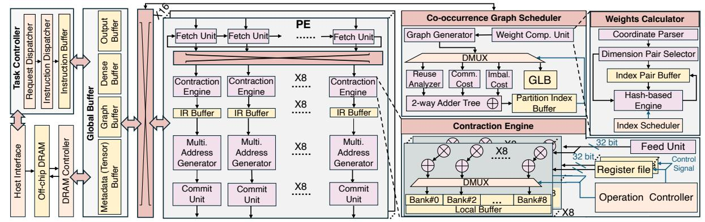

# A. DRAM Access Modeling for Tensor Contraction

To explicitly model DRAM access for tensor contraction, we propose an analytical model based on co-occurrence graph abstraction, where all tensor dimensions are considered. Specifically, we use Compressed Sparse Row format (CSR) [61], [62] to store the co-occurrence graph, so the memory footprint of the co-occurrence graph representing an r-order tensor containing N nonzero elements is:

$$M_{CSR} = \left(\sum |r| + 1\right) \times 4 + E \times 4 \tag{4}$$

where E represents the count of edges that do not overlap between the two index vertices, which is  $E << N \times \binom{r}{2}$ . Here, we use 32-bit floating-point precision (i.e., FP32). As such, each data point is 4 bytes.

For a given tensor contraction:  $C_{\{f_1\},\{f_2\}} = A_{\{f_1\},\{c\}} \times B_{\{c\},\{f_2\}}$  with a co-occurrence graph CoG(V,E), partitioning the co-occurrence will directly affect the tiling factors for all tensors A, B, and C, as vertex indices of sparse tensor A,  $f_1$  and c, are part of tensors B and C. Please note that both  $f_1$  and c represent sets of free-mode and contraction-mode indices as the tensor dimensionality increases. Tiling along



Fig. 6. Proposed modified Prize-collection Steiner tree partitioning algorithm for co-occurrence graph-based sparse tensor partitioning.

 $f_1$  impacts the storage requirement of the output tensor C, whereas adjusting the tiling factor along c affects the storage footprint of tensor B. The tensor dimension,  $f_2$ , is shared by both tensors B and C, and its tiling factor  $(M_t)$  determines the data locality for both dense tensors. A smaller  $M_t$  value enables more fibers of the sparse tensor A to reside in the onchip buffer, vice versa. To find an optimal set of tiling factors, we analyze the memory consumption of dense tensor B and C as well as sparse tensor A in the constrained on-chip buffer capacity  $M_{cap}$ :

$$(\prod_{V_{c_i} \in V_c} |V_{c_i}| + \prod_{V_{f_j} \in V_{f_1}} |V_{f_j}|) \times 4 \times M_t +$$

$$4 \times (2 \times E_I^p + E_Y^p) \le M_{cap}$$

$$(5)$$

Here,  $E_I^p$  represents internal edges (both endpoints in partition p), and  $E_X^p$  represents cut edges (one endpoint in partition p). Factor 2 represents that CoG is an undirected graph.

Based on the DRAM access model, we can determine that the number of vertices from both the free and contraction modes should be grouped into each partition.

#### B. Co-occurrence Graph Partitioning for Tensor Contraction

The formulation of the co-occurrence graph implies that tiling sparse tensors is critical in determining workload distribution, optimizing data locality, and ultimately selecting an appropriate dataflow. While several hypergraph partitioning algorithms [63]–[66] for tensor contraction have been proposed, they are typically limited to balancing the number of vertices and reducing edge cuts. This is because the hyperedge representation captures individual nonzero elements but not their sparsity patterns. Given the enriched semantics of co-occurrence graph, we repurpose the Prize-Collecting Steiner Tree (PCST) algorithm [52], called CoGTP, to select a connected subset of vertices that maximizes data reuse and workload balancing minus connectivity cost. The formulation of our PCST algorithm adheres to the following set of objectives.

**Intra-Tile Data Reuse.** As discussed earlier, edge weights in the co-occurrence graph quantify reuse frequency during tensor contraction. Grouping vertices connected by highweight edges within the same partition increases temporal locality and minimizes redundant tensor fetches.

**Inter-Tile Connectivity.** Cross-partition connectivity occurs when indices contributing to the same contraction reside in

#### **Algorithm 1:** Co-occurrence graph tensor partitioning.

```
Input: Tensor: T: Number of partitions: N
             Output: Partitions: P_0, P_1, ..., P_{N-1}
           Function Update(P)
                              best\_move \leftarrow null, max\_gain \leftarrow 0;
                               V_{boundary} \leftarrow \{v \in V \mid \exists u \in V\}
                                    Neighbors(v), membership[u] \neq membership[v]\};
                              for i \leftarrow 0 to N-1 do
                                                V_i^{boundary} \leftarrow V_{boundary} \cap P_i;
                                                for v \in V_i^{boundary} and |P_i| > 1 do
                                                                 // Find candidate target partitions
                                                                                 (neighbors of v)
                                                                 \mathcal{C}_v \leftarrow \{membership[u] \mid u \in
                                                                        Neighbors(v), membership[u] \neq i\};
                                                                 for j \in \mathcal{C}_v do
                                                                                   // Compute incremental gain
  10
                                                                                   gain \leftarrow \Delta \mathcal{F}(v, i \rightarrow j);
  11
                                                                                   if gain > max\_gain then
  12
  13
                                                                                                     max\_gain \leftarrow gain; best\_move \leftarrow (v, i, j);
  14
15
16
                              end
17
                                          Apply best move if improvement found
18
                              if best\_move \neq null then
                                              (v^*, i^*, j^*) \leftarrow best\_move; P_{i^*} \leftarrow P_{i^*} \setminus \{v^*\};
                                                    P_{j^*} \leftarrow P_{j^*} \cup \{v^*\};
                             return P:
20
21
                          Step 1: Construct Co-occurrence Graph
                       \leftarrow Indices(NNZ(T)), w(u,v) \leftarrow T[...;u;...;v;...];
                          G = (V, E, w) \leftarrow (V, w) // Step 2: Initialize
           D(v) = \sum_{u} w(u, v); Initialize(P); // Step 3: Optimize
                    T(P) = \alpha \sum_{i=0}^{N-1} \sum_{e \in P_i} w(e) - \lambda_{cu} \sum_{e \in \text{cul}} w(e) - \lambda_{cu} \sum_{e \in \text{cul}} w(e) - \lambda_{cu} \sum_{e \in \text{cul}} w(e) - \lambda_{cu} \sum_{e \in \text{cul}} w(e) - \lambda_{cu} \sum_{e \in \text{cul}} w(e) - \lambda_{cu} \sum_{e \in \text{cul}} w(e) - \lambda_{cu} \sum_{e \in \text{cul}} w(e) - \lambda_{cu} \sum_{e \in \text{cul}} w(e) - \lambda_{cu} \sum_{e \in \text{cul}} w(e) - \lambda_{cu} \sum_{e \in \text{cul}} w(e) - \lambda_{cu} \sum_{e \in \text{cul}} w(e) - \lambda_{cu} \sum_{e \in \text{cul}} w(e) - \lambda_{cu} \sum_{e \in \text{cul}} w(e) - \lambda_{cu} \sum_{e \in \text{cul}} w(e) - \lambda_{cu} \sum_{e \in \text{cul}} w(e) - \lambda_{cu} \sum_{e \in \text{cul}} w(e) - \lambda_{cu} \sum_{e \in \text{cul}} w(e) - \lambda_{cu} \sum_{e \in \text{cul}} w(e) - \lambda_{cu} \sum_{e \in \text{cul}} w(e) - \lambda_{cu} \sum_{e \in \text{cul}} w(e) - \lambda_{cu} \sum_{e \in \text{cul}} w(e) - \lambda_{cu} \sum_{e \in \text{cul}} w(e) - \lambda_{cu} \sum_{e \in \text{cul}} w(e) - \lambda_{cu} \sum_{e \in \text{cul}} w(e) - \lambda_{cu} \sum_{e \in \text{cul}} w(e) - \lambda_{cu} \sum_{e \in \text{cul}} w(e) - \lambda_{cu} \sum_{e \in \text{cul}} w(e) - \lambda_{cu} \sum_{e \in \text{cul}} w(e) - \lambda_{cu} \sum_{e \in \text{cul}} w(e) - \lambda_{cu} \sum_{e \in \text{cul}} w(e) - \lambda_{cu} \sum_{e \in \text{cul}} w(e) - \lambda_{cu} \sum_{e \in \text{cul}} w(e) - \lambda_{cu} \sum_{e \in \text{cul}} w(e) - \lambda_{cu} \sum_{e \in \text{cul}} w(e) - \lambda_{cu} \sum_{e \in \text{cul}} w(e) - \lambda_{cu} \sum_{e \in \text{cul}} w(e) - \lambda_{cu} \sum_{e \in \text{cul}} w(e) - \lambda_{cu} \sum_{e \in \text{cul}} w(e) - \lambda_{cu} \sum_{e \in \text{cul}} w(e) - \lambda_{cu} \sum_{e \in \text{cul}} w(e) - \lambda_{cu} \sum_{e \in \text{cul}} w(e) - \lambda_{cu} \sum_{e \in \text{cul}} w(e) - \lambda_{cu} \sum_{e \in \text{cul}} w(e) - \lambda_{cu} \sum_{e \in \text{cul}} w(e) - \lambda_{cu} \sum_{e \in \text{cul}} w(e) - \lambda_{cu} \sum_{e \in \text{cul}} w(e) - \lambda_{cu} \sum_{e \in \text{cul}} w(e) - \lambda_{cu} \sum_{e \in \text{cul}} w(e) - \lambda_{cu} \sum_{e \in \text{cul}} w(e) - \lambda_{cu} \sum_{e \in \text{cul}} w(e) - \lambda_{cu} \sum_{e \in \text{cul}} w(e) - \lambda_{cu} \sum_{e \in \text{cul}} w(e) - \lambda_{cu} \sum_{e \in \text{cul}} w(e) - \lambda_{cu} \sum_{e \in \text{cul}} w(e) - \lambda_{cu} \sum_{e \in \text{cul}} w(e) - \lambda_{cu} \sum_{e \in \text{cul}} w(e) - \lambda_{cu} \sum_{e \in \text{cul}} w(e) - \lambda_{cu} \sum_{e \in \text{cul}} w(e) - \lambda_{cu} \sum_{e \in \text{cul}} w(e) - \lambda_{cu} \sum_{e \in \text{cul}} w(e) - \lambda_{cu} \sum_{e \in \text{cul}} w(e) - \lambda_{cu} \sum_{e \in \text{cul}} w(e) - \lambda_{cu} \sum_{e \in \text{cul}} w(e) - \lambda_{cu} \sum_{e \in \text{cul}} w(e) - \lambda_{cu} \sum_{e \in \text{cul}} w(e) - \lambda_{cu} \sum_{e \in \text{cul}} w(e) - \lambda_{cu} \sum_{e \in \text{cul}} w(e) - \lambda_{cu} \sum_{e \in \text{cul}} w(e) - \lambda_{cu} \sum_{e \in \text{cul}} w(e) - \lambda
                  \lambda_b \sum_{i=0}^{N-1} \left( \sum_{v \in P_i} (D(v) - \frac{W}{N})^2 \right);
            F \leftarrow \mathcal{F}(P), \Delta \mathcal{F} \leftarrow \mathcal{F}(P);
26
          while \Delta \mathcal{F} > \epsilon do
                            \mathbf{Update}(P);\,\Delta\mathcal{F}\leftarrow\mathcal{F}(P)-F;\,F\leftarrow\mathcal{F}(P);
27
             28 end
29 return optimized partitions \{P_0, \ldots, P_{N-1}\};
```

different tiles, where tensor elements or partial results need to be exchanged across partitions. Such connectivity can lead to either irregular DRAM access or communication between computing nodes. To discourage inter-tile connectivity, we impose a cut penalty on cross-partition edges  $e_{\rm cross}$ , proportional to their associated weights.

**Workload Balancing.** To avoid uneven partition sizes, we introduce a quadratic load-imbalance penalty. The workload of each vertex is estimated by its weighted degree  $D(v) = \sum_u W(u,v)$ , which reflects its computational cost. Accordingly, the total workload of partition  $P_i$  is approximated by  $\sum_{v \in P_i} D(v)$ , and deviations across partitions are penalized.

Given this, the objective function of our proposed graph partitioning algorithm is formulated as follows:

$$\max\{\alpha \sum_{i}^{N} \sum_{e \in P_{i}} W(e) - \lambda_{cut} \sum_{\forall ecross \notin T} W(e) - \lambda_{b} \lfloor \sqrt{\sum_{i}^{N} \left( \sum_{v \in P_{i}} (D(v) - \frac{W}{N})^{2} \right)} \rfloor \}$$
 (6)

where  $P_i$  denotes the i-th partition,  $e_{cross} \notin T$  is the edge cuts across tiles. The parameters  $\alpha$ ,  $\lambda_{cut}$ , and  $\lambda_b$  control the trade-offs between the three objectives. We select  $\alpha=2.0$ ,  $\lambda_{cut}=1.0$ , and  $\lambda_b=1.0$  based on structural properties of co-occurrence graphs and memory-intensive characteristics of tensor contraction workloads. Specifically,  $\alpha=2.0$  reflects that high-degree vertices provide quadratic reuse opportunities


Fig. 7. Proposed co-occurrence graph-based dataflow for multidimensional tensor reuse.

 $(\mathcal{O}(k^2))$  pairwise interactions) while incurring linear storage cost  $(\mathcal{O}(k))$ , establishing a 2:1 benefit-to-cost ratio that prioritizes data reuse. The unit penalties  $\lambda_{cut}=1.0$  and  $\lambda_b=1.0$  match unit communication cost (already normalized by data volume) and the typical coefficient of variation in workload distributions for power-law graphs [67]. Section VII-G provides empirical validation of these parameter choices across diverse tensor structures. The detailed process is depicted in Algorithm 1, Lines 21-29.

To initialize partitions, we apply a breadth-first search (BFS) to cluster high-connectivity regions within the co-occurrence graph. The BFS runs in parallel from multiple seed vertices, maximizing the first term of the objective function. As shown in Figure 6, a score of  $\mathcal{F}(P) = 5$  is calculated for initial partitions. Following initialization, CoGTP performs an iterative local refinement procedure (Algorithm 1, Lines 1-20) inspired by the Kernighan-Lin algorithm [68]. A greedy hillclimbing strategy is employed to escape local optima and progressively improve the objective. To constrain the search space, the refinement considers only single-vertex migrations between partition pairs whose vertices are located on current partition boundaries that contribute to edge cuts. In each iteration, a candidate vertex v is tentatively moved to every other partition  $P_i$   $(i \neq j)$ , and the corresponding objective change  $\Delta \mathcal{F}$  is evaluated. For example, the attempted relocation of  $K_1$  is discarded due to its negative impact on the score, whereas moving  $K_0$  is retained because it provides a positive gain as shown in the Figure 6. The iteration terminates once  $\Delta \mathcal{F}$  falls below a threshold  $\epsilon$ . The per-iteration complexity is  $\mathcal{O}(\sqrt{|V|}d)$ , where d denotes the average unweighted vertex degree. Since most tensor workloads are highly sparse, d typically ranges from 1 to 10, enabling efficient convergence.



Fig. 8. An overview of TensorPrism accelerator design, which includes processing element (PE) architecture, co-occurrence graph (CoG) scheduler, contraction engine, and weight computation unit.

