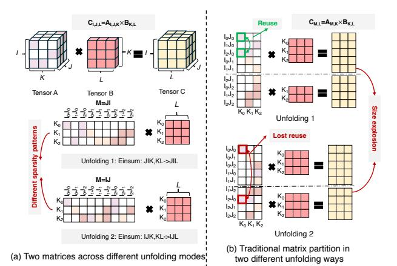
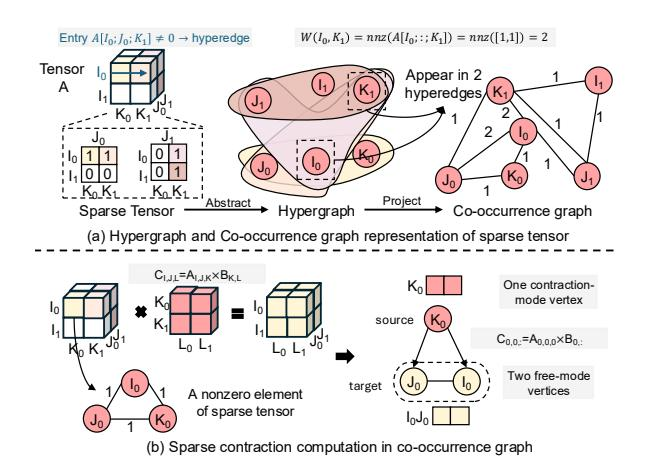

# A. High-order Tensor Contraction

High-order tensors, which extend matrices to three or more dimensions, are a foundational computational abstraction in contemporary machine learning and scientific computing. For example, transformer-based large language models employ fourth-order attention tensors to capture token-to-token dependencies across batch, sequence, and head dimensions. A high-order tensor is a multi-dimensional array in which each dimension corresponds to a *mode*, and its *order* (i.e., rank) is defined as the total number of dimensions. A *fiber* is the tensor analogue of a vector along a given mode. For instance, given a 3-order tensor as shown in Figure 1,  $\mathcal{A}_{I,J,K} \in \mathbb{R}^{I \times J \times K}$ , its coordinates can be presented as a list c; e.g., if c = i, j, then  $\mathcal{A}_{i,j,k} = \mathcal{A}_{c,k}$ .

Tensor contraction [46], [47] generalizes matrix multiplication to higher dimensions. Essentially, tensor contraction computes a sum over shared modes between two or more tensors,

Fig. 1. High-order tensor contraction, Hypergraph, and Co-occurrence graph. producing an output tensor of reduced order. Specifically, the tensor contraction could be formulated as:

$$C_{f_1, f_2} = \sum_{c} \mathcal{A}_{\{f_1\}, \{c\}} \mathcal{B}_{\{c\}, \{f_2\}}$$
 (1)

Here,  $\{f_1\}$  and  $\{f_2\}$  denote the *free modes* that are not involved in contraction, while  $\{c\}$  represents the contraction modes. Importantly, the fiber length along every contraction mode in one operand must match the corresponding fiber length in the other operand. If the two input tensors contain m and n modes, respectively, the resulting tensor will have  $m+n-2|\{c\}|$  modes, where  $|\{c\}|$  is the number of contraction modes. For instance, as illustrated in Fig. 1(a), contracting tensors  $\mathcal{A}_{I,J,K}$  and  $\mathcal{B}_{K,L}$  produces a third-order tensor  $\mathcal{C}_{I,J,L}$ .

Essentially, tensor contraction transforms high-order matrix multiplication into a sequence of matrix multiplications. Common approaches include mode unfolding (matrixization), Einstein summation lowering (einsum), and loop transformation. While these methods enable reusing optimized sparse—dense matrix multiplication (SpMM) kernels, they introduce several limitations: (1) unfolding can inflate intermediate matrix dimensions by orders of magnitude, (2) different unfolding choices lead to different sparsity patterns, making optimization mode-dependent, and (3) compromised data reuse and intermediate data reuse due to tensor unfolding.

**Tensor Contraction in Real-world Applications.** Sparse tensor contraction has emerged as a fundamental computational kernel across a wide spectrum of real-world applications, spanning from machine learning to scientific computing. Table I summarizes applications of high-order tensor contraction across diverse tensor orders and density characteristics. For example, in LLMs, multi-head attention operates on 4D tensors (batch, heads, sequence length, channel dimension), where the attention scores and context are computed via contractions over the feature dimension [48]. In computer vision and video analytics, activations and inputs are naturally 4D-5D, and operations such as 3D convolution can be expressed as high-order contractions across channel and kernel modes. In scientific computing, atmospheric and ocean simulations represent evolving physical fields as high-order tensors over time, latitude, longitude, altitude level, and physical variables. Even though prior work, such as Trapezoid [49] and Misam [50], improves the performance of sparse tensor computation across varying sparsity ratios, current solutions primarily target low-order tensors. Consequently, high-order

Fig. 2. The impacts of matrix tiling on different unfolding modes: (a) Two matrices across different unfolding modes, and (b) Traditional matrix partition in two different unfolding ways.

sparse contractions remain largely underexplored.

#### B. Hypergraph and Co-occurrence Graph

Graph theory has been widely used to find parallelism and data reuse opportunities for sparse tensor computations [51]. For example, sparse-dense matrix multiplication (SpMM), Y = AX, can be equivalently expressed as a graph computation, and vice versa, where  $A \in \mathbb{R}^{N \times N}$  is a sparse matrix,  $X \in \mathbb{R}^{N \times F}$  is a dense feature matrix, and  $Y \in \mathbb{R}^{N \times F}$  is the output. When interpreting A as the adjacency matrix of a graph G = (V, E) with |V| = N, each nonzero entry  $A_{ij} \neq 0$  corresponds to a directed edge  $j \rightarrow i$ .

Similarly, as shown in Figure 1, high-order tensors can be represented as hypergraphs or co-occurrence graphs. For example, a hypergraph generalizes a traditional graph by allowing a single edge to connect an arbitrary number of vertices. Formally, a hypergraph is defined as  $H=(V,\mathcal{E})$ , where V denotes the vertex set and each hyperedge  $e\in\mathcal{E}$  is a subset of V with  $|e|\geq 2$ . Consider a simple example with six vertices  $V=\{v_1,v_2,v_3,v_4,v_5,v_6\}$ , three hyperedges capture high-order relationships:  $e_1=\{v_1,v_2,v_3\},\ e_2=\{v_2,v_3\},$  and  $e_3=\{v_3,v_5,v_6\}$ , which results in the hypergraph  $H=(V,\mathcal{E}),\ \mathcal{E}=\{e_1,e_2,e_3\}.$ 

A co-occurrence graph provides an alternative representation that encodes hyperedge relationships using weighted pairwise edges. Any pair of vertices  $(v_i,v_j)$  is connected if they co-occur in at least one hyperedge, and the edge weight equals the number of hyperedges in which they co-exist  $w(v_i,v_j)=|\{e\in\mathcal{E}\mid v_i,v_j\in e\}|$ . For example, as illustrated in Figure 1, two hyperedges involving  $v_2$  and  $v_3$  are represented as a single edge with weight 2. This preserves the vertex set but converts hyperedge connectivity into pairwise edge representation, enabling reuse of well-established graph-based optimizations.

#### C. Prize-Collecting Steiner Tree

The Prize-Collecting Steiner Tree (PCST) [52] is a classical combinatorial optimization problem in graph theory. Given an undirected graph G = (V, E), each edge  $e \in E$  is associated

with a non-negative cost  $c_e$ , and each vertex  $v \in V$  is assigned a non-negative prize  $\pi_v$ . The objective of PCST is to identify a connected subgraph that balances the trade-off between minimizing edge costs and maximizing collected prizes (e.g., optimization objective). Formally, let  $T = (V_T, E_T)$  denote a tree with  $V_T \subseteq V$  and  $E_T \subseteq E$ . The objective function is defined as:  $\min_T \left(\sum_{e \in E_T} c_e + \sum_{v \notin V_T} \pi_v\right)$ . PCST has been widely used for combinatorial optimization in large-scale graph systems.

#### III. MOTIVATION AND CHALLENGES

#### A. Dataflow in High-order Tensor Contraction

Sparse tensor contraction commonly flattens high-order tensors into two-dimensional forms to leverage existing SpMM optimizations such as matrix tiling and dataflow. For example, the 3D tensor contraction  $C_{i,j,l} = \sum_k A_{i,j,k} \times B_{k,l}$ , with  $A \in \mathbb{R}^{I \times J \times K}$  and  $B \in \mathbb{R}^{K \times L}$ , produces an output tensor  $C \in \mathbb{R}^{I \times J \times L}$  that keeps modes (i,j) intact and contracts over mode k. The 3D tensor can be unfolded along either the J-mode (JIK, KL  $\rightarrow$  JIL) or the I-mode (IJK, KL  $\rightarrow$  IJL) using einsum notation. Mathematically, the unfolding reshapes matrix A into a matrix of size  $(JI \times K)$  or a matrix of size  $(IJ \times K)$ . By unfolding, the high-order sparse tensor operation is mapped to a traditional SpMM kernel, such as  $C_{M,L}$  =  $A_{M,K} \times B_{K,L}$  (e.g., M = IJ or M = JI), which allows the reuse of established dataflow techniques such as inner-product, outer-product, and Gustavson algorithm [10], [15], [53]-[55]. Specifically, the inner-product dataflow optimizes reuse of the output matrix, but it suffers from relatively poor locality for the input dense matrix because the dense inputs could be fetched repeatedly. The outer-product dataflow achieves high reuse and locality for the dense operand (i.e.,  $Patial\_C_{M,L} =$  $\sum_{k} A_{:,k} \times B_{k,:}$  by broadcasting dense rows (i.e.,  $B_{k,:}$ ) along the shared dimension, but it often requires substantial storage for partial sums (or expensive synchronization of  $Patial\_C_{M,L}$ ) to accumulate scattered updates to the output. The Gustavson dataflow fetches one row of sparse tensor at a time and streams the corresponding rows from the input matrix into output accumulation, balancing input and output data locality.

In addition, traditional matrix tiling and reordering techniques remain applicable for optimizing data locality in sparse tensor contraction. For example, the unfolded tensor can be tiled along the free modes (the I and J dimensions) or along the contraction mode (the K dimension). Despite their higher dimensionality, sparse high-order tensors can still be reordered to expose locally dense subregions, thereby enhancing computational regularity and improving data locality.

#### B. Challenges in Tensor Contraction

As high-order tensors become increasingly common in today's applications, optimization techniques generally fall into two categories: (1) unfolding tensors into lower-dimensional operations and (2) directly operating on tensors natively.

TABLE II
CONCLUSION OF STATE-OF-THE-ART SPARSE ACCELERATION DESIGNS.

| Prior Designs   | Tensor Order    | Tensor Repr.     | Dataflow Strategy | Operation Kernel | Tiling Strategy | Cross-mode Dep. Capture |
|--------------------|--------------------|---------------------|----------------------|---------------------|--------------------|----------------------------|
| Sparse-dense Mati  | rix Multiplication | n .                 |                      |                     |                    |                            |
| ExTensor [10]      | Matrix/Tensor      | 2D Unfolding        | Inner-product        | SpMM&SpMSpM         | Fixed              | ×                          |
| DRT [24]           | Matrix/Tensor      | 2D Unfolding        | Inner/Outer/Row-wise | SpMM&SpMSpM         | Dynamic Reflexive  | ×                          |
| SEXTANS [23]       | Matrix             | 2D Unfolding        | Row-wise             | SpMM                | Adaptive           | ×                          |
| SPADE [1]          | Matrix             | 2D Unfolding        | Row-wise             | SpMM                | Adaptive           | ×                          |
| HotTiles [2]       | Matrix             | 2D Unfolding        | Row-wise             | SpMM                | Heterogeneous      | ×                          |
| Trapezoid [49]     | Matrix             | 2D Unfolding        | Inner/Gustavson      | SpMSpM              | Fixed              | ×                          |
| Misam [50]         | Matrix             | 2D Unfolding        | Inner/Outer/Row-wise | SpMM&SpMSpM         | ML-driven          | ×                          |
| Sparse Convolutio  | n Networks         |                     |                      |                     |                    |                            |
| SCNN [56]          | Tensor             | 2D Unfolding        | Inner-product        | Contraction(Conv)   | -                  | ×                          |
| Sparten [57]       | Tensor             | 2D Unfolding        | Row-wise             | Contraction(Conv)   | -                  | ×                          |
| Traditional Tensor | Contraction        |                     |                      |                     |                    |                            |
| GSpTC [3]          | Tensor             | Native Tensor       | Outer-product        | Contraction         | Chunk-based        | •                          |
| TCP [4]            | Tensor             | Native Tensor       | Inner-product        | Contraction         | Dynamic            | •                          |
| Co-occurrence Gra  | aph-driven Tens    | or Contraction      |                      |                     |                    |                            |
| TensorPrism        | 2D Graph           | Co-occurrence Graph | Graph-native         | Contraction         | PCST-based         | /                          |

Partial cross-mode dependency capture (limited to unfolded or single-mode analysis)

1) Unfolding high-order tensors to 2D SpMM Kernels: Even though SpMM optimization techniques [1], [10], [22]–[24], [58], [59] can still be applied to high-order sparse tensor computation, unfolding tensors into lower-dimensional forms inflates input metadata and misses reuse opportunities.

Metadata Overhead for Sparse Tensor Unfolding. Metadata for sparse tensor unfolding can increase significantly when an unfolded mode becomes a product of multiple dimensions. For example, as shown in Figure 2, a third-order tensor  $A_{i,j,k}$  can be matricized by grouping (i,j) into the row index, which leads to a matrix of size  $(IJ) \times K$  (equivalently  $(JI) \times K$ ). In tensor-native sparse formats, metadata typically scales with the sum of mode sizes, i.e.,  $\mathcal{O}(I+J+K)$ . After unfolding into a sparse matrix format that uses per-row/per-column pointers (e.g., CSR/CSC), the metadata scales with the number of rows or columns. As a result, the size becomes  $\mathcal{O}(IJ+K)$ . Consequently, when a mode size explodes into a product such as IJ, the metadata can dominate the storage cost even if the number of nonzeros remains unchanged.

Reuse Distance Issues for Tensor Unfolding. Beyond metadata overhead, tensor unfolding can also compromise locality by (1) increasing reuse distance and (2) reducing immediate reuse opportunities. Inspired by reuse distance analysis in cache performance modeling [60], we define reuse **distance** as the number of distinct sparse rows (or columns) accessed between two consecutive accesses to the same row (or column) of the dense tensor. As illustrated in Figure 2, for a third-order sparse tensor  $A_{i,j,k}$ , the maximum reuse distance is bounded by I + J (the sum of the free-mode extents), since the coordinate information in the two free modes is sufficient to identify a unique sparse data element. After unfolding (i, j) into a single matrix dimension, the corresponding bound inflates to  $I \times J$  (the product of the free-mode extents). This expansion can substantially degrade temporal locality and exceed the capacity of the limited on-chip storage.

Unfolding also reduces the number of adjacent neighbors available for immediate reuse. In a 2D sparse matrix, each nonzero can have at most four structurally adjacent neighbors that share a row or column index. These adjacent nonzero elements typically reuse the same dense tensors. In contrast, in a third-order tensor, each nonzero can share an index with neighbors along three modes, increasing the total number of

Fig. 3. Data reuse analysis with various tensor dimensions.

adjacent neighbors to six. The combination of fewer adjacent neighbors and a much larger worst-case reuse distance highlights compromised data locality when representing sparse tensors as 2D matrices.

We summarize state-of-the-art sparse accelerator designs in Table II. Specifically, Extensor [10] improves sparse kernel efficiency via coordinate intersection mechanisms; however, its benefits for SpMM are limited, as the dense matrix operand does not require intersection, restricting the overall optimization potential. DRT [24] extends Extensor by introducing dynamic sparsity-aware tiling with flexible tile sizes to better exploit data locality. More recent designs, including Trapezoid [49] and Misam [50], target a broader spectrum of input density ranges. Trapezoid adapts to increasing row/column intersection parallelism and multi-fiber intersection dataflows, whereas Misam leverages an MLdriven decision tree to dynamically select hardware configurations(e.g., compression format, PE numbers) and dataflows tailored to the input characteristics. While prior work maps multi-dimensional tensors into two-dimensional space to exploit efficient data locality and cross-mode data reuse, overlooking higher-dimensional index semantics makes parts of the computation irrecoverable when mapping intermediate results back to the original tensor domain. As shown in Figure 3, our results show that current loop transformation techniques in tensor unfolding fail to capture 50-60% of potential data reuse. This inefficiency is exacerbated in higher dimensions used in scientific applications, such as quantum simulation [45], where nearly 90% of reuse opportunities go unharnessed.

2) Tensor-native Dataflow Optimization: Recent work avoids the drawbacks of tensor unfolding by adopting tensornative strategies that enhance data reuse and computational efficiency. Gündüz et al. [26] represent sparse tensors as hypergraphs and leverage KaHyPar [27] to obtain partitions with minimal edge cuts while maintaining load balance. TCP [4] directly optimizes reuse at the tensor level rather than relying on unfolded matrix forms. GSpTC [3] further proposes finegrained partitioning and scheduling techniques to improve parallelism in sparse tensor contraction.

GSpTC and TCP extend outer-product and inner-product dataflows to high-order tensor contractions. For example, outer-product dataflow broadcasts a contraction-mode vector (e.g., dense input tensors) to accumulate partial results across free-mode output locations (e.g., output tensors), which effectively captures input reuse. Similarly, the inner-product dataflow computes each output entry as a dot product between a sparse row of the sparse input and the corresponding dense

Fig. 4. (a) Hypergraph and Co-occurrence graph representation of sparse tensor (b) Sparse contraction computation in co-occurrence graph.

column, iterating over the contraction-mode operands (e.g., dense input) and accumulating into a single fixed output accumulator to maximize output locality and reuse. However, current dataflows are inefficient in simultaneously capturing (1) both input and output reuse and (2) cross-mode reuse.

#### IV. GRAPH ABSTRACTION OF TENSOR CONTRACTION

Graph abstractions have been explored to model tensor computations and improve data locality and parallelism [10], [26], [27], [55]. However, applying current graph abstractions directly to sparse tensor contraction remains challenging due to (1) their limited ability to capture high-order tensor structures, and (2) the complexity that grows with contraction order when exploring cross-dimensional sparsity relationships. To address this issue, we reformulate sparse high-order tensor contraction using a Co-occurrence Graph that reveals inherent data reuse and parallel execution opportunities. For example, converting hyperedges into pairwise weighted edges in co-occurrence graphs can enable efficient reordering without losing high-order semantics.

Co-occurrence Graph Abstraction for Sparse Tensor **Contraction.** For two-dimensional tensors [8], [9], [11], sparse matrix-dense matrix multiplication (SpMM) and graph computation are mathematically equivalent, where each nonzero tensor element corresponds to a graph vertex, while edges represent aggregation operations that accumulate rows of the input dense matrix. When extending to high-order tensors, a single vertex (i.e., a coordinate index) can no longer uniquely identify a nonzero element, since multiple indices are required to locate an entry in a high-dimensional space. Consequently, hypergraphs were introduced to encode nonzero elements, where each hyperedge captures the full set of high-order tensor indices. While hypergraphs list all nonzero tensor elements as hyperedges, extracting index overlap, an indicator of data reuse, remains challenging. To this end, we repurpose the co-occurrence graph for sparse high-order tensors, enabling explicit tracking of index overlap while preserving hyperedges to recover the original nonzero elements in high-dimensional space. For example, in a co-occurrence graph as shown in Fig-

Fig. 5. The reuse definition of sparse tensor with hypergraph representation. ure 4(a), each vertex represents an index of the sparse tensor, and edges capture the connectivity and frequency of their co-occurrence. Both the hypergraph and the co-occurrence graph are mathematically equivalent.

Specifically, for a given co-occurrence graph CoG = (V, E), the edge weight between vertices i and j could be directly formulated to represent the nonzero element in the sparse tensor A as:

$$W((i,j)) = nnz(A[..;i;..;j;..]), \forall i,j$$
 (2)

For a third-order sparse tensor  $A_{I,J,K}$ , its co-occurrence graph CoG(V,E) contains |V|=I+J+K vertices. As shown in Figure 4(b), a  $2\times 2\times 2$  tensor generates a co-occurrence graph with |V|=6 vertices, where vertices  $I_0$  and  $K_1$  exhibit a co-occurrence weight of  $W(I_0,K_1)=\max(A[I_0,:,K_1])=2$ . A complete subgraph, such as a clique  $(I_0,J_0,$  and  $K_0)$ , corresponds to a nonzero tensor element. Each nonzero tensor indicates one vector-wise operation similar to SpMM.

However, unlike conventional SpMM dataflows such as the Push (outer-product), Pull (inner-product), or Gustavson execution models, the pull/push behavior of vertices in a co-occurrence graph cannot be mapped directly to traditional inner- or outer-product execution. In tensor contraction, the dataflow is determined by both pull/push operations and index mode. For example, vertices corresponding to the *contraction modes* (e.g., modes K) determine the vector location in the input dense tensor, whereas vertices associated with the *free modes* (e.g., mode I and J) determine the output tensor locations. Specifically, vertices  $I_0$  and  $J_0$  identify the destination vector in the output matrix, while vertex  $K_0$  selects the source vector in the dense input matrix. The pull or push operations on the destination vertex set  $\{I_0, J_0\}$  are equivalent to inner-or outer-product execution.

Quantify Reuse in Sparse Tensor Contraction. Quantifying data reuse in sparse tensor computations is difficult due to irregular sparsity patterns. The fundamental challenge lies in that coordinate representations of sparse tensors do not expose their sparsity structure. For SpMM and sparse tensor contraction, tiling along tensor dimensions, whether adaptive or fixed, does not ensure that both input dense matrices are reduced to their minimum possible dimensions. Such variations also make data reuse difficult to quantify. Graph abstraction provides

a way to quantify data reuse in sparse tensor contraction. By co-locating vertex connectivity, it captures reuse through hyperedge intersections as shown in Figure 5. Please note that we only use hyperedge to visualize the data reuse, and we measure the data reuse directly on the co-occurrence graph. Tensor contraction exhibits two distinct forms of reuse: (1) input reuse from shared vertices in contraction modes, and (2) output reuse from shared vertices in free modes.

**Input reuse** occurs when two hyperedges share a vertex K in a contraction mode. In this case, both hyperedges access the same subtensor B[K,:], but contribute to different output coordinates in C. As illustrated in Figure 5(a), the subtensor  $B[K_0,:]$  is reused by hyperedges  $(I_0,J_0,K_0)$  and  $(I_1,J_1,K_0)$  to update  $C[I_0,J_0,:]$  and  $C[I_1,J_1,:]$ , respectively.

**Output reuse**, in contrast, occurs when two hyperedges share vertices in free modes. When hyperedges overlap on free-mode vertices, they access different input elements but accumulate into the same output location. As shown in Figure 5(b), the output subtensor  $C[I_0,J_0,:]$  aggregates contributions from both  $B[K_0,:]$  and  $B[K_1,:]$ , because vertices  $I_0$  and  $J_0$  are shared by hyperedges  $(I_0,J_0,K_0)$  and  $(I_0,J_0,K_1)$ .

Formally, we could extract the reuse of sparse tensor contraction using its co-occurrence graph abstraction. Given a co-occurrence graph CoG(V,E) for tensor contraction:  $C_{\{f_1\},\{f_2\}} = A_{\{f_1\},\{c\}} \times B_{\{c\},\{f_2\}}$ , the reuse of sparse tensor contraction thus can be expressed as:

$$Reuse = \frac{\sum_{v_i \in V_{f_1}} D(v_i)}{|\{f_1\}|} + \frac{\sum_{v_j \in V_c} D(v_j)}{|\{c\}|} - \prod_{v_i \in V_c} v_i - \prod_{v_j \in V_{f_1}} v_j$$
(3)

Here,  $V_c$  is the contraction mode vertices and  $V_{f_1}$  is the free mode vertices in the co-occurrence graph. D(V) is the degree of each vertex. As such, the tensor tiling problem can be naturally formed as a graph partitioning problem.

