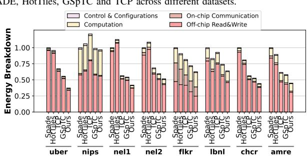

# VII. EVALUATION

## *A. Evaluation Setup*

Simulation Framework. We develop a cycle-accurate simulator for TensorPrism following established methodologies from prior accelerator research [18], [49], [69]. The simulator integrates with Ramulator [70] to model HBM2 memory with 307.2 GB/s bandwidth and captures cycle-level behavior of all compute, memory, and control components. The TensorPrism accelerator is configured with 16 PEs organized in a 4×4 mesh topology, each containing a contraction engine with 512 FP32 MACs (8K MACs total), operating at 650 MHz. GLB is provisioned with 2.5 MB capacity, partitioned into 1 MB for metadata storage, 1 MB for dense tensor operands, and 512 KB for co-occurrence graph metadata and intermediate buffers. Each PE maintains 48 KB of local storage for register files and accumulators. For ASIC evaluation, we synthesize the design in Verilog RTL using TSMC 28nm technology with Synopsys Design Compiler. Power analysis is performed using Synopsys PrimeTime PX, with switching activity extracted from postsynthesis waveform traces. On-chip SRAM energy and area are modeled using CACTI 7.0 [71].

Datasets. We evaluate TensorPrism across eight real-world tensor datasets from the FROSTT repository [72], [73] spanning diverse scientific and machine learning domains, as detailed in Table III. Our benchmark suite includes: temporalspatial tensor from ride-sharing services (Uber), scientific publication topic modeling (Nips), large-scale knowledge graphs (Nell-1, Nell-2), social media interaction networks (Flickr), network traffic analysis (LBNL-Networks), urban analytics (Chicago-Crime), and e-commerce recommendation systems (Amazon-Reviews). These datasets exhibit order ranging from 3D to 5D tensors, with densities spanning 14 orders of magnitude (10−14 to 10−2 ), and nonzero counts from millions to billions, providing comprehensive coverage of tensor contraction workloads encountered in practice.

Baseline Accelerators. We compare TensorPrism against four state-of-the-art tensor acceleration frameworks: (1) SPADE [1], which employs tile-based scheduling with barrier synchronization for SpMM and extends to tensor operations via matricization; (2) HotTiles [2], which partitions tensors into dense and sparse regions processed by heterogeneous compute units; (3) GSpTC [3], a GPU-based framework using contraction-mode chunking strategies; and (4) TCP [4], which performs dynamic tensor partitioning with communicationaware tile sizing. Furthermore, we compare TensorPrism with

Fig. 9. Normalized speedup comparison of TensorPrism over SPADE, HotTiles, GSpTC and TCP across different datasets.

DIMENSIONS AND DENSITY OF DIFFERENT TENSOR INPUTS.

| Dataset        | Acr. | Dimensions                                                    | NNZs          | Density               |
|----------------|------|---------------------------------------------------------------|---------------|-----------------------|
| Uber           | uber | $183 \times 24 \times 1, 140 \times 1, 717$                   | 3,309,490     | $3.8 \times 10^{-4}$  |
| Nips           | nips | $2,482 \times 2,862 \times 14,036 \times 17$                  | 3,101,609     | $1.8 \times 10^{-6}$  |
| Nell-1         | nel1 | $2,902,330 \times 2,143,368 \times 25,495,389$                | 143,599,552   | $9.1 \times 10^{-13}$ |
| Nell-2         | nel2 | $12,092 \times 9,184 \times 28,818$                           | 76,879,419    | $2.4 \times 10^{-5}$  |
| Flickr         | flkr | $319,686 \times 28,153,045 \times 1,607,191 \times 731$       | 112,890,310   | $1.1 \times 10^{-14}$ |
| LBNL-Network   | lbnl | $1,605 \times 4,198 \times 1,631 \times 4,209 \times 868,131$ | 1,698,825     | $4.2 \times 10^{-14}$ |
| Chicago-Crime  | chcr | $6,186\times24\times77\times32$                               | 5,330,673     | $1.4 \times 10^{-2}$  |
| Amazon-Reviews | amre | $4,821,207 \times 1,774,269 \times 1,805,187$                 | 1,741,809,018 | $1.1 \times 10^{-10}$ |

a hypergraph partitioning algorithm [27], **HyperSB**, for performance analysis. To ensure fair comparison, all baseline designs are scaled to match TensorPrism's computational resources. We implement each baseline's core algorithmic contributions—SPADE's barrier-based tiling, HotTiles' heterogeneous scheduling, GSpTC's chunking strategy, TCP's dynamic partitioning, and HyperSB's KaHyPar partitioning to cluster the non-zeros—while normalizing hardware parameters. For accelerators originally designed for SpMM (SPADE, HotTiles), we extend them to tensor contraction following the matricization approach described in their respective papers. Performance measurements include end-to-end execution time encompassing tensor loading, co-occurrence graph construction, kernel execution, and result writeback to host memory.

#### B. Performance Analysis

Figure 9 presents normalized speedup comparisons across feature lengths  $(k \in \{64,128\})$  and contraction orders  $(f = |\{f\}| \in \{1,2\})$ . TensorPrism achieves geometric mean speedups of  $2.22\times$ ,  $2.40\times$ ,  $1.71\times$ ,  $1.76\times$ , and  $1.49\times$  over SPADE, HotTiles, GSpTC, TCP, and HyperSB, respectively.

Unfolding Approaches with SpMM Kernels. SPADE and HotTiles exhibit the largest performance gaps  $(2.22\times$  and  $2.40\times$  slower) because matricization destroys cross-mode locality by flattening multi-dimensional tensors into 2D matrices. This index merging obscures coordinate relationships and forces redundant memory fetches due to compromised data locality. On *uber* with k=64, f=2, SPADE incurs  $2.09\times$  excess execution time, with 91% of overhead from repeated fetches of dense-tensor rows that TensorPrism loads once through co-occurrence graph representation. HotTiles' heterogeneity-aware partitioning operates post-unfolding on

Fig. 10. The energy efficiency breakdown across different datasets. 2D tiles, missing cross-mode reuse patterns that TensorPrism captures natively.

**Tensor-Native Baselines.** GSpTC narrows the gap to  $1.57 \times$ through tensor-native partitioning, yet suffers from sequential partition matching that discovers dependencies reactively during execution. We observe that only 14.2% is spent on computation versus 67.4% on preprocessing and writeback. The critical bottleneck is the reduction phase (i.e., accumulating/synchronizing partial sums): adding multiple outputs into output dense-rows with synchronization operations forces thread serialization on shared memory addresses. On chcr with k = 64, f = 2, reduction contention accounts for 73% of execution time. TensorPrism's co-occurrence dataflow eliminates this serialization by pushing input dense rows to different output addresses, guaranteeing no write conflicts. TCP's circuit-switched fetch network relies on a fixed dataflow pattern decided ahead of execution, which restricts how tensors can be partitioned and prevents the system from adapting to irregular shapes and having a balanced workload. For nell, who has very large dimension sizes, the mismatch between input and hardware memory and computation resources forces extra data rearrangement steps, and the predefined network structure and dataflow of TCP are unable to relieve the resulting overhead. On amre with k = 128, f = 2, powerof-2 division requirements of partition force padding that wastes 2.89× bandwidth compared to TensorPrism's adaptive partitioning, satisfying 94% of accesses from on-chip buffers.

**Hypergraph Partitioning.** TensorPrism achieves an average of  $1.49\times$  speedup over HyperSB, with gains stemming from two primary factors. The key idea of HyperSB is to cluster vertices to reduce the edge cuts between different

Fig. 11. Throughput comparison across different feature sizes. partitions while balancing the vertex count. However, workload balancing remains unsolved, as edge count represents the nonzero elements and their associated computations. In addition, data reuse is not directly considered in HyperSB's objective function. Despite this, HyperSB still outperforms GSpTC and TCP thanks to the direct presentation of high-dimensional order. This eliminates the inflated intermediate data caused by tensor unfolding.

**Dataset Characteristics.** Performance gains vary by tensor structure and size. For power-law tensors (*uber*, flkr), the graph abstraction proposed by TensorPrism exhibits superior performance compared with TCP and GSpTC due to more flexible partition ways. Similarly, the hypergraph-based approach of HyperSB also shows a better performance. Notably, when f=1, SPADE and HotTiles exhibit better performance than TCP and GSpTC because the size of the last mode of nips is very small (only 17). On *nell* with extreme degree variance, TensorPrism achieves  $2.95\times$  speedup at 2KB features by concentrating super-high-degree vertices within partitions. For uniform tensors (*lbnl*), advantages narrow to  $1.16\times$  and  $1.45\times$  as even sparsity reduces partitioning effectiveness, though TensorPrism maintains gains by eliminating unfolding overhead.

Scalability Study. As feature length increases from k=64 to k=128, advantages amplify for irregular tensors. On nel1, speedup over SPADE increases from  $2.50\times$  to  $4.74\times$ . TensorPrism's contraction engines broadcast inputs to eight parallel units with temporal reuse through the feed unit, achieving up to  $128\times$  reuse per fetch. Matricization-based approaches exhibit linear memory traffic growth with feature dimensions. For larger contractions (f=2), performance gaps widen further, on amre with k=128, f=2, TensorPrism achieves  $4.11\times$  speedup versus  $2.38\times$  for f=1, as deeper nesting exposes richer reuse patterns invisible to unfolding-based methods treating contractions independently.

