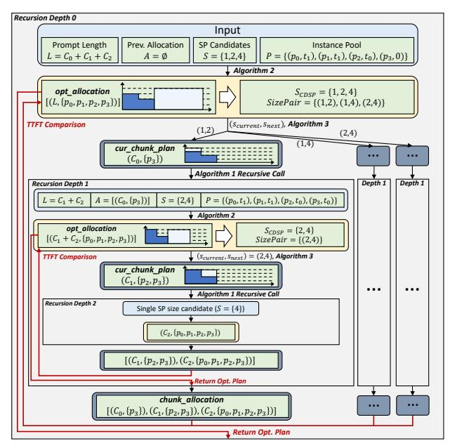

# Algorithm 3: Chunk Plan Solving Algorithm

```
Input: unallocated prompt length L, previous chunk allocation A, current chunk's SP size s_{current}, subsequent chunks' minimal SP size s_{next}, prefill instance pool P.

2 // get previous chunks' token number and instance allocation

3 C \leftarrow A.get\_total\_chunk\_length()

4 initial\_group \leftarrow A.get\_all\_instances()

5 // get current and next instance groups

6 current\_group \leftarrow GetGroup(P, initial\_group, s_{current})

7 next\_group \leftarrow GetGroup(P, current\_group, s_{next})

8 // estimate chunk computation latency budget

9 T_{queue}^{current} \leftarrow \max_{T_i} \{T_i | p_i \in current\_group\}

10 T_{queue}^{next} \leftarrow \max_{T_i} \{T_j | p_j \in next\_group\}

11 T_{budget} \leftarrow T_{queue}^{next} - T_{queue}^{current}

12 // use performance model to solve chunk size

13 L_{chunk} \leftarrow min(L, SolvePerformanceModel(T_{budget}, s_c, C))

14 \mathbf{return}(L_{chunk}, current\_group)
```

above (**line 6-7**). Then, the algorithm sets the current chunk's prefill latency budget as the difference between the queuing delays of  $next\_group$  and  $current\_group$  (**line 9-11**). For example, in the case shown in Fig. 4-(b), when solving the plan for chunk 1 with  $s_{current}$ =2 and  $s_{next}$ =4, the budget is obtained by comparing the maximum queuing latencies of instances 0–3 and 2–3. Given the latency budget and the historical token number, the performance model in Eq. (1) becomes a polynomial in the chunk size, which can be solved numerically (e.g., using Newton's method) to determine the current chunk's token number (**line 13-14**).

#### B. CDSP Prefill Scheduling Example

To provide a clearer illustration of the whole scheduling workflow, we walk through Algorithm 1 using the example shown in Fig. 4. The overall procedure is depicted in Fig. 10. Assuming the prompt lengths of chunk 0, chunk 1, and chunk 2 in Fig. 4-(b) are  $C_0$ ,  $C_1$ , and  $C_2$ , respectively, and the SP size candidates are powers of two. Algorithm 1 is invoked with the following inputs: (1) prompt length  $L=C_0+C_1+C_2$ ; (2) previous chunk allocation  $A=\emptyset$ ; (3) SP size candidates  $S=\{1,2,4\}$ ; and (4) instance pool  $P=\{p_0,p_1,p_2,p_3\}$ , where the queuing delays of  $p_0$  and  $p_1$  are  $t_1$ ,  $p_2$  is  $t_0$ , and  $p_3$  is 0.

Given these inputs, Algorithm 1 first invokes Algorithm 2 to select the single-chunk SP execution plan that satisfies the improvement rate. Assuming the improvement rate in Algorithm 2 is set to 0 (i.e., any TTFT reduction is accepted), Algorithm 2 selects the single-chunk strategy with SP size 4, as shown in Fig. 4-(a). This strategy is used as the initial optimal CDSP execution plan, denoted as  $[(L, \{p_0, p_1, p_2, p_3\})]$ . Accordingly, we obtain three  $(s_{current}, s_{next})$  pairings: (1, 2) (1, 4), and (2, 4). Without loss of generality, we use  $(s_{current}, s_{next})$ =(1, 2) to illustrate the subsequent recursive process.

Given  $(s_{current}, s_{next})$ =(1,2), Algorithm 1 invokes Algorithm 3 to determine current chunk's token count. Since the instance sets with minimum queuing delays for SP=1 and SP=2 are  $\{p_3\}$  and  $\{p_2, p_3\}$ , respectively, with a delay gap of  $t_0$ , Algorithm 3 thus determines the chunk length  $C_0$  that fills this gap. Then, Algorithm 1 updates the input state and



Fig. 10. A Walking-through Example of CDSP Prefill Scheduling. proceeds recursively. Specifically, the remaining prompt length becomes L=C1+C2, the allocation record A is updated to include (C0, {p3}), the SP size candidate set is reduced to S={2, 4}, and the queuing delay of p<sup>3</sup> is updated to t0.

At recursion depth 1, Algorithm 1 again invokes Algorithm 2 to obtain the initial optimal strategy. It adopts SP=4 to process the whole remaining tokens, denoted as [C<sup>1</sup> + C2, {p0, p1, p2, p3}]. Then, the algorithm identifies the only valid pairing (scurrent, snext)=(2, 4), calls Algorithm 3 to determine corresponding chunking plan (C1, {p2, p3}), and proceeds to the next recursive level. At recursion depth 2, since only one SP size candidate (SP=4) remains, Algorithm 1 directly returns the result from Algorithm 2, denoted as [C2, {p0, p1, p2, p3}]. This result is then combined with (C1, {p2, p3}) to form the execution plan corresponding to (scurrent, snext)=(2, 4). After comparing the TTFT with the initial optimal strategy, the recursion at depth 1 returns the current best execution plan, which is combined with (C0, {p3}) to form the complete execution plan for (scurrent, snext)=(1, 2). After comparing this plan with other candidate strategies, Algorithm 1 at depth 0 returns the one with the lowest TTFT as the final CDSP execution plan.

