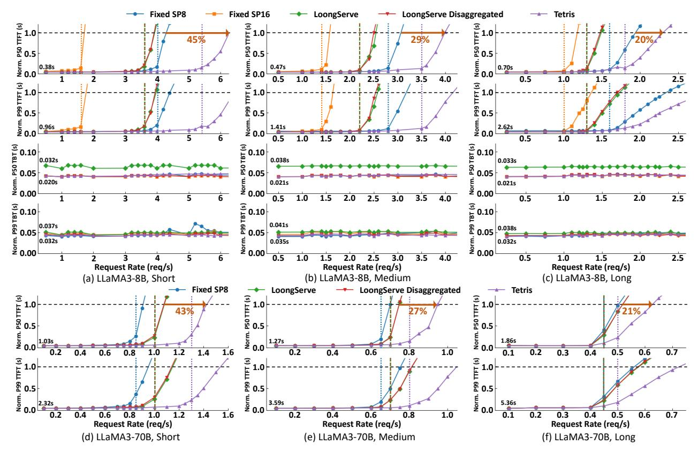
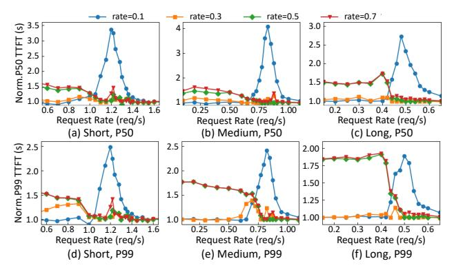
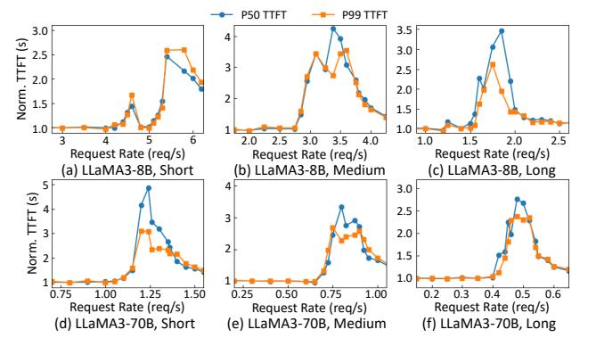

# *B. Comparison against Baselines*

We first compare Tetris with the baselines through stress tests on the collected real workloads, where different load conditions are simulated by scaling the request arrival timestamps. Similar to LoongServe [43], we normalize all results to 25× of the light-load latency. As shown in Fig. 11, for LLaMA3- 8B, fixing the SP size to 16 reports the worst TTFT due to the resource over-provision. It not only degrades short requests' TTFTs but also postpones subsequent requests' execution. Shrinking the fixed SP size to 8 improves TTFT. However, it hurts long requests' TTFTs and remains inflexible for short requests, as SP-8 can still over-allocate resources for their

Fig. 11. Comparison against Baselines on LLaMA3-8B/70B under Different Workloads.

demands. LoongServe and LoongServe Disaggregated perform between the two fixed-SP configs. Although they can mitigate TTFT degradation for short requests, excessive SP expansion still delays request execution and hurts overall TTFT. Besides, although LoongServe exposes all instances to the prefill scheduler via ESP, it must reserve dedicated instances for decoding batches, resulting in marginal performance gains over LoongServe Disaggregated. Compared with the best-performing baseline (i.e., Fixed SP 8), Tetris can increase the max load by 20%-45%, owing to its fine-grained SP adjustment and prudent control of SP expansion. As to TBT, although LoongServe reports comparable P99 latency, its P50 latency is 55%-67% higher than the large-TP configuration enabled by the disaggregated architecture.

For LLaMA3-70B, since prefill adopts TP-4 and decoding reports marginal TBT gains from TP-4 to TP-8, we mainly compare the TTFT results. LoongServe (Disaggregated) can outperform Fixed SP8, as SP-8 is already an over-provision for short requests under TP-4. Compared with these baselines, Tetris enhances the max load by 21%-43%. CDSP remains effective as model and system scales increase.

## C. Performance Analysis

**TTFT Distribution Analysis:** To analyze Tetris's TTFT benefits, we compare the cumulative TTFT distributions under the highest request rate where the best-performing baseline maintains low latency to preserve user experience. Each sys-

Fig. 12. TTFT Distribution Analysis.

tem's critical request rates are marked by vertical dashed lines in Fig. 11. As Fig. 12 shows, Tetris achieves 1.64-  $2.78 \times /2.86$ - $4.17 \times$  lower P50 TTFT on LLaMA3-8B/70B. As to P99 TTFT, it yields 1.52- $3.13 \times /2.27$ - $4.35 \times$  lower values, respectively. Tetris can effectively enhance the serving quality compared with existing SOTA systems.

**Throughput Analysis:** To assess Tetris's resource efficiency, we then compare all systems' throughput under their critical request rates. As shown in Fig. 13, Tetris improves the throughput by 1.24-3.38×/1.15-1.81× for LLaMA3-8B/70B, while maintaining low latency for user experience. The finegrained and moderate SP allocation in Tetris can better adapt to varying request lengths, enhancing resource utilization.

Fig. 13. Throughput Analysis under TTFT Constraints.

Fig. 14. Improvement Rate Analysis on LLaMA3-8B.

## D. Ablation Study

**Improvement Rate Analysis:** To analyze how improvement rate preferences vary with loads, we compare Tetris's TTFT under different fixed rates, which span the range used in rate exploration. All results are normalized to the TTFT under dynamic rate adjustment. As shown in Fig. 14-15, under low request rates, TTFT is dominated by prefill latency. Therefore, enforcing a smaller improvement rate (e.g., 0.1, 0.3) helps allocate larger SP sizes, reducing computation time and improving overall TTFT. As request load increases, queuing delay becomes a larger contributor to TTFT. Increasing the improvement rate (e.g., 0.5, 0.7) mitigates excessive SP expansion, enabling earlier execution of later requests and reducing queuing-driven TTFT. When the system is highly saturated, queuing delay constitutes the majority of TTFT, rendering it less sensitive to rate variation. Compared with fixed-rate settings, our dynamic rate adjustment can select near-optimal rates across varying load conditions, enabling CDSP to effectively optimize TTFT.

Chunking Analysis: To quantify the benefits of CDSP chunking, we compare CDSP scheduling with single-chunk scheduling (i.e., skipping line 5-21 in Algorithm 1). As shown in Fig. 16, single-chunk scheduling incurs up to 2.33-4.17×/2.71-4.77× higher P50 TTFT on LLaMA3-8B/70B. For P99 TTFT, it yields 2.64-3.58×/2.43-3.23× higher values, respectively. Under light loads, each request's minimal queuing delay limits CDSP's search space and makes single-chunk plan efficient enough. As the load increases, queuing latency becomes more pronounced, and the resource fragmentation intensifies. Therefore, CDSP's fine-grained SP allocation can significantly improve resource efficiency and reduce TTFT. When the

Fig. 15. Improvement Rate Analysis on LLaMA3-70B.

Fig. 16. TTFT Slowdown under Single-Chunk Scheduling.

system is highly saturated, similar to the improvement rate, accumulated queuing delays reduce the system's sensitivity to chunking, leading to diminishing TTFT gains.

