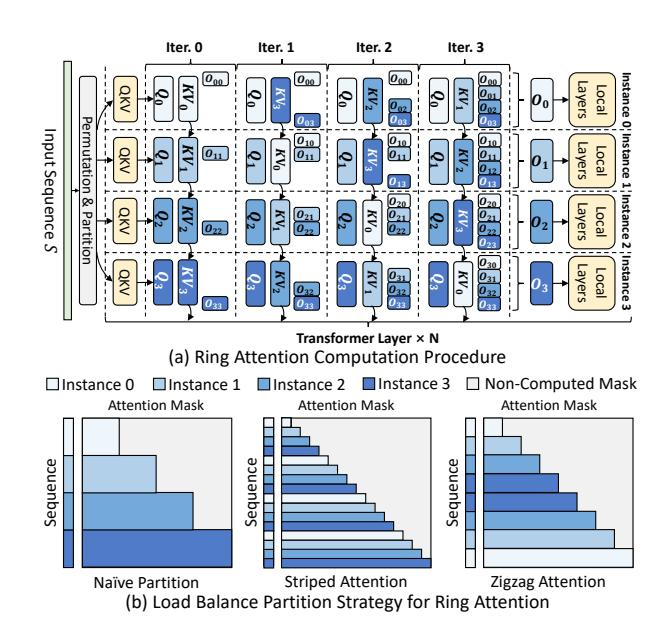
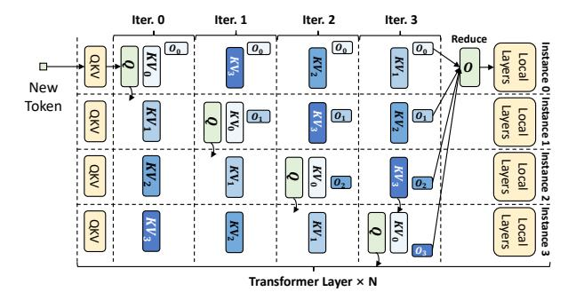
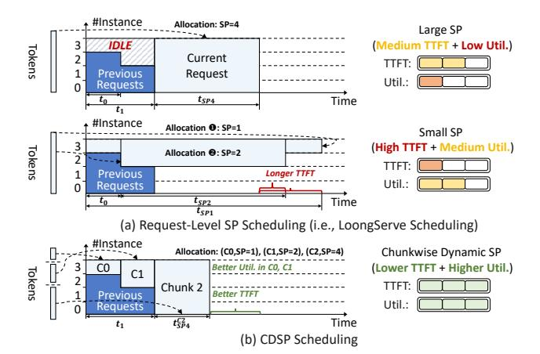

# B. LLM Serving

Online LLM service has been widely deployed by cloud companies [2], [4], [14], [30], which receives requests from multiple users, conducts inference on a GPU cluster, and returns decoding outputs in real-time. To evaluate the serving quality (or Service Level Objectives, SLOs), service providers proposed several metrics: The Prefill stage is measured by time to first token (TTFT), which is the duration between request arrival and the finish of prefill computation. For decoding stage, time between tokens (TBT) is employed to measure the smoothness of the output streaming procedure.



Fig. 1. Prefill Ring Attention Computation Procedure.

To jointly optimize TTFT/TBT and improve the serving system's efficiency, several system optimizations have been proposed: Iteration-level scheduling adds new requests once the current decoding iteration finishes, reducing the queuing latency of each request [45]. PagedAttention eliminates the memory fragmentation caused by the variance of prompt and decoding lengths via managing the KV cache in block granularity [19]. Prefill-decoding disaggregation routes requests under different stages to distinct model instances to avoid the interference between the two stages [32], [47].

## C. Sequence Parallelism for Long-Context LLMs

Sequence parallelism (SP) has been a pivotal approach to handle long-context requests' compute and memory demands [5], [11], [16]–[18], [20], [21], [40], [43], [44]. In this paper, we mainly focus on ring-attention-style SP, which has been adopted in LLM inference [43], [44]. Ring attention distributes the tokens of one sequence to multiple model instances. As shown in Fig. 1-(a), during the prefill stage, each instance first calculates its local tokens' query, key, and value tensors together with their attention results. Then, it sends key-value tensors to the next neighbor and receives new key-value tensors from the previous neighbor iteratively to interact local query tensors with full key-value tensors. After the distributed attention computation, each instance computes the remaining operators without communication.

In prefill ring attention, since the causal mask adopted by LLMs only requires each token to compute with all preceding tokens, splitting the sequence into multiple consecutive shards will lead to imbalanced workload distribution across instances, as shown in Fig. 1-(b). Several optimized partition strategies have been proposed to alleviate this issue: Striped Attention [5] partitions the sequence into evenly-spaced stripes and assigns them to each instance in a round-robin manner, so that each instance can conduct computation to every KV cache shard. Another strategy [11], [16], [44] interleaves the KV Cache



Fig. 2. Decoding Ring Attention Computation Procedure.

across instances in a "zigzag" manner, which partitions the sequence into 2N shards S0, ..., S2N−<sup>1</sup> for N SP instances, and allocates (S<sup>i</sup> , S2N−i−1) to instance i, In this way, each instance is assigned with identical computation workload.

During the decoding stage, instead of passing key-value tensors, ring attention transfers query vectors because their smaller data volume can reduce the ring communication overhead [43], [44]. As shown in Fig. 2, suppose the context KV cache is distributed across four instances. Decoding ring attention designates a master instance (e.g., instance 0) to process the decoding input. In each iteration, current token's query vector is forwarded to each instance to compute partial attention results. After all instances complete computation, the master instance aggregates all partial results and proceeds with the remaining local layers. When multiple requests are present in the decoding batch, each instance can serve as the master for a subset of requests, enabling full utilization of compute resources across all instances.

## *D. Limitations of Existing SP-Serving Systems*

Despite SP's strong performance, existing systems still exhibit several limitations, preventing them from fully utilizing SP in online long-context LLM serving scenarios:

Limitation #1 (Fixed-SP System): Partitioning the cluster with a fixed SP size fails to meet the inter-request resource demand variation, which manifests in two aspects: *(1) Large SP Size is an overkill for short requests*. First, excessive SP size allocation leaves each instance with only a marginal compute workload, which leads to low GPU utilization. Second, the undersized compute workload cannot fully overlap ring communication, which can even cause the performance to be inferior to a reduced SP size. *(2) Small SP Size severely prolongs long requests' prefill latency*, which can even reach to tens of seconds, thereby significantly hurting the system's overall TTFT distribution.

To elucidate such disparity, we benchmark the prefill latency of LLaMA3-8B [15] on A100 GPUs. Detailed setups are listed in Sec. VII-A. We set the batch size to 1 and vary the prompt length from 4k to 256k. The SP size is adjusted from 1 to 16, with the TP size of 1. As listed in Table I, *for short lengths* (e.g., 4k, 8k), adopting a moderate SP size is enough to achieve the optimal performance. Further enlarging the SP size incurs 1.2×-3× higher latency. *For long requests* (e.g., 128k, 256k), enlarging the SP size delivers a

TABLE I PREFILL LATENCY (SECONDS) COMPARISON OF LLAMA3-8B, TESTED ON A100 GPUS. THE OPTIMAL LATENCY IS MARKED IN BOLD.

| Prompt Length<br>4k<br>8k<br>16k<br>32k<br>64k<br>128k<br>256k         |
|------------------------------------------------------------------------|
| SP=1 Latency<br>0.28<br>0.57<br>1.29<br>3.22<br>9.05<br>29.20<br>OOM   |
| SP=2 Latency<br>0.16<br>0.31<br>0.69<br>1.67<br>4.61<br>14.30<br>50.07 |
| SP=4 Latency<br>0.13<br>0.20<br>0.39<br>0.92<br>2.43<br>7.32<br>24.77  |
| SP=8 Latency<br>0.21<br>0.24<br>0.31<br>0.58<br>1.37<br>3.96<br>12.81  |
| SP=16 Latency<br>0.39<br>0.43<br>0.46<br>0.53<br>0.96<br>2.31<br>7.02  |

quasi-linear improvement, with a latency gap of up to 43.05s. This phenomenon remains consistent across varying TP sizes and model scales. Considering online serving processes highly dynamic requests with substantial context length variation as listed above, a fixed SP configuration cannot fully satisfy such diverse resource demands.

Limitation #2 (Existing Dynamic-SP System): Existing state-of-the-art long-context serving system, LoongServe [43], shares similar insights, which proposes Elastic Sequence Parallelism (ESP) to adjust resource allocation: ESP groups all instances into a unified SP pool sharing the same TP size. By assigning different SP sizes to request batches, it changes resource allocation without re-partitioning LLM parameters. Although it has achieved SOTA performance compared with best-performing non-SP systems [1], [19], [23], [47], its inflexible SP management fails to fully unlock SP's performance benefits, with limitations evident in three aspects:

*(1) Cluster Architecture: Unified TP size fails to satisfy the disparate characteristics between prefill and decoding.* Given the device budget, larger SP size (+ smaller TP size) is preferred by prefill in existing SP-based inference systems [43], [44] due to the following reasons: (1) SP provides more flexibility in adjusting resource provision, since we only need to split tokens across model instances. In contrast, adjusting TP requires resharding LLM's weight matrices, which suspends the underlying devices to serve new requests. (2) Compared with TP, SP demonstrates better cross-node scalability because TP's all-reduce latency increases significantly given the low inter-host network bandwidth [44]. However, constraining decoding to prefill's small TP, as in ESP, severely degrades its performance. To demonstrate this issue, we evaluate the decoding latency of LLaMA3-8B under different TP sizes using A100 GPUs. As shown in Fig. 3-(a), compared with TP=8, TP=1, TP=2, and TP=4 incurs up to 5.73×, 3.87×, and 1.93× higher latency, respectively. Such a slowdown severely hurts the SLO attainment of online LLM services with stringent TBT objectives [35], [47].

LoongServe mitigates such inefficiency by augmenting decoding batches' SP size when it detects heightened resource demand. However, given the same device budget, increasing SP is less effective than enlarging TP for decoding. We conduct experiments on LLaMA3-8B with 8 A100 GPUs to reveal the performance gap. As shwon in Fig. 3-(b), adopting (SP8, TP1), (SP4, TP2), and (SP2, TP4) inflates decoding latency by up to 1.83×, 1.41×, and 1.15×, respectively, relative to (SP1, TP8). Such behavior persists when larger models are


Fig. 3. Decoding Latency Analysis.

partitioned across multiple GPU nodes. For example, Yang et al. [44] report that (SP2, TP8) incurs higher decoding latency than (SP1, TP16) on LLaMA3-405B. The main reason is that the scant compute workload of decoding attention is insufficient to fully mask the ring communication overhead. Therefore, an ideal online serving system should be aware of the disparity in parallelism strategy requirements to sufficiently optimize both TTFT and TBT.

(2) Batching Strategy: Greedily expanding SP size for fixed batches fails to optimize global latency distribution. LoongServe adopts greedy static batching for request scheduling: It selects multiple pending requests and adopts dynamic programming to decide prefill SP instances, which assigns the largest SP size to exhaustively minimize per-batch prefill latency. Once all requests finish prefill computation, the entire batch proceeds to decoding collectively. During the entire decoding stage, the batch is fixed — no additional requests are added until the phase terminates.

Batching multiple long-context requests improves the prefill throughput, which is advantageous for offline inference tasks operating on a large, pre-specified input set (e.g., posttraining model evaluation). However, **combining long-context requests into one prefill batch severely hurts the system's TTFT**, as early-arriving requests have to wait for the entire batch to complete time-consuming prefill computation. Such inter-request TTFT interference should be avoided by the online service scheduler (e.g., constraining each prefill batch to a single request [35]).

Besides, the local optimum provided by the greedy scheduler lacks awareness of real-time load conditions, failing to optimize the overall TTFT distribution. For example, consider a system with 16 LLaMA3-8B SP instances (TP=1), each with 1-second queuing delay. If a 32k request is greedily assigned SP=16 by LoongServe scheduler (based on Table I), and a subsequent 16k request arrives, the TTFTs of (32k, 16k) requests are (1.53s, 1.84s). In contrast, if we assign SP=8 to the 32k request and reserve 8 instances for the 16k request,

the TTFTs become (1.58s, 1.31s). With only a 0.05s increase in the 32k request's TTFT, the system's average/max TTFTs are reduced by 0.24/0.26s, respectively. However, an effective mechanism is still lacking to adaptively select the most suitable SP allocation based on the system's load conditions, under highly dynamic serving workloads.

Additionally, **static batching brings inefficient resource usage for decoding**. The resource utilization progressively declines as requests in a decoding batch complete execution. However, static batching precludes the addition of new requests during decoding, preventing the adoption of continuous batching to boost utilization [45], [47].

(3) SP Allocation Granularity: Request-level SP allocation cannot achieve both low TTFT and high resource utilization at the same time. Allocating SP sizes by treating all tokens of a request as a whole, as in the ESP mechanism, provides an intuitive way to meet inter-request diverse resource demands. However, in online serving with unpredictable request arrivals, this strategy induces a trade-off between TTFT optimization and resource utilization: Directly assigning large SP to long requests can cause resource idleness, as SP's ring communication requires all instances to start computation simultaneously. When a long request arrives, a short request with a smaller SP size may already be running. To reduce TTFT, the scheduler may assign the long request a larger SP size by reusing instances occupied by the short request. In this case, the additional instances allocated to the long request remain idle during the short request's execution, hurting resource utilization. However, allocating small SP for better resource utilization significantly degrades long requests' TTFT, because larger SP sizes substantially reduce long requests' prefill latency.

For example, given 16 LLaMA3-8B SP instances (TP=1), if a 16k request is assigned SP=8 before the arrival of a 128k request, assigning SP=16 to the 128k request results in 8 instances idle for 0.31 seconds. However, directly assigning SP=8 using the 8 idle instances incurs a 1.34-second TTFT increase. This underscores the need for a fine-grained SP allocation strategy capable of jointly minimizing TTFT and maximizing resource utilization.

To address these limitations, we propose chunkwise dynamic sequence parallelism (CDSP) and build a distributed system, Tetris, to fully utilize CDSP for online long-context LLM serving. In the following sections, we will first present CDSP's basic concept and Tetris's system overview. Then, we will describe Tetris's inference engine and scheduler design. Finally, we will introduce Tetris's prototype implementation.

## III. TETRIS OVERVIEW

## A. Chunkwise Dynamic Sequence Parallelism

Request-level SP scheduling assigns SP uniformly to each request's all tokens. Although this approach tries to satisfy perrequest resource demand, it creates imbalance across instances due to dynamic SP allocation. Such an imbalance results in instance idleness when allocating large SP sizes to reduce TTFT, as ring attention mandates simultaneous KV cache



Fig. 4. Basic concept of Chunkwise Dynamic SP (CDSP).

transfer across all instances. Conversely, decreasing SP size to mitigate resource idleness notably prolongs TTFT for long requests, whose prefill latency fluctuates by tens of seconds when shrinking SP sizes. For example, as shown in Fig. 4-(a), when current request arrives, due to dynamic SP allocation of prior requests, instances 0–1 have a queuing delay of  $t_1$ , instance 2 has a delay of  $t_0$ , and instance 3 is immediately available. Assigning SP=4 to minimize TTFT causes instances 2 and 3 to remain idle for  $t_1$ - $t_0$  and  $t_1$ , respectively, reducing cluster utilization. Conversely, assigning SP=1 or SP=2 improves utilization but significantly increases prefill latency compared to SP=4, resulting in substantially higher TTFT.

To fulfill requests' SP requirements without compromising resource utilization, we propose chunkwise dynamic sequence parallelism (CDSP), a more fine-grained parallelism strategy. As depicted in Fig. 4-(b), rather than allocating a fixed SP size to the entire request, CDSP subdivides each request into multiple chunks and selects appropriate SP sizes for them. Specifically, CDSP applies larger SP to latter chunks (e.g., SP=4 to chunk 2) to accommodate the computation demands of long requests. In contrast, preceding segments are scheduled with smaller SP sizes (e.g., SP=1/2 to chunk 0/1), allowing partial execution to start earlier by leveraging idle resource fragments. By progressively expanding the SP size across chunks — akin to filling the gaps in the tetris game — CDSP maximizes resource utilization (e.g., fully utilizes instance 2-3 in Fig. 4) and further reduces TTFT beyond request-level scheduling (e.g.,  $t_1+t_{SP4}^{C2} < min\{t_1+t_{SP4}, t_0+t_{SP2}, t_{SP1}\}$ ).

## B. Serving System Overview

Tetris is built on prefill-decoding disaggregated cluster architecture, as shown in Fig. 5. In contrast to existing designs where all prefill instances operate independently, Tetris connects all prefill instances into a unified SP group and assigns each a smaller TP size (e.g., TP=1 in Fig. 5), maximizing resource allocation flexibility. On the other hand, each decoding instance adopts a larger TP size (e.g., TP=4 in Fig. 5) to fully optimize the TBT performance. For each request, the prefill dispatcher generates CDSP execution plan based


Fig. 5. System Architecture of Tetris.

on real-time load conditions. The designated prefill instances conduct CDSP prefill and stream KV cache to the target decoding instance, which adds the request through continuous batching and proceeds with output generation.

## C. Design Considerations and Challenges

**Design Goal:** Tetris aims to enable fine-grained dynamic SP mechanism, while remaining fully compatible with SOTA optimization techniques. To address the limitations of existing dynamic SP schemes discussed above, Tetris is designed with three key objectives: (G1) The cluster must satisfy distinct parallelism demands between prefill and decoding. (G2) The scheduler must fully consider real-time load conditions when regulating the SP allocation of each request. (G3) The inference engine must fully optimize CDSP prefill computation to maximize its acceleration potential.

Although prefill-decoding disaggregation can achieve (G1), existing designs are built solely on tensor/pipeline parallelism (TP/PP), lacking support for dynamic SP in disaggregation cluster [32], [35], [47]. To fully realize (G2) and (G3), Tetris must address the following challenges:

Challenge #1: Inference Engine Adaptation: (1) Attention Computation. As shown in Fig. 4-(b), SP size expansion results in uneven KV cache distribution, creating inter-instance load imbalance. Therefore, we need to tailor attention computation for CDSP to maximize its resource utilization. (2) Cache Transfer Management. Unlike existing non-SP disaggregated clusters, where each request's full KV cache is located on a single prefill instance, CDSP distributes each chunk's KV cache across multiple prefill instances. We need to coordinate cache transfer to ensure timely delivery of each request's all cache chunks to the decoding instance.

Challenge #2: Scheduler Customization: (1) For CDSP Execution Plan, we need to determine the chunk number, each chunk's token number, and the corresponding prefill instance allocation. They define a vast scheduling space given the large context window and numerous prefill instances. An efficient CDSP plan solver is vital to meet real-time requirements. (2) For SP Size Regulation, efficiently integrating real-time load impacts into the CDSP plan solver is also vital to achieve optimal global TTFT distribution.

The subsequent sections will elaborate on how Tetris addresses these issues.


Fig. 6. CDSP's Prefill Computation Procedure


Fig. 7. Compatibility between CDSP Prefill and Balanced Ring Attention.

## IV. TETRIS INFERENCE ENGINE

#### A. CDSP Prefill Computation

**Overall Procedure:** As shown in Fig. 6, during CDSP computation, each chunk's tokens are evenly interleaved across the assigned prefill instance group. All instance groups compute sequentially following the chunk order. Before computing each chunk, the KV cache of all preceding chunks is evenly redistributed to current chunk's instance group to balance the attention workload distribution. To reduce cache balancing overhead, we constrain that each chunk's instance group must include all instances involved in preceding chunks, which is ensured by the CDSP scheduler discussed later. In Fig. 6's two-chunk example, chunk-0 is first executed on instances *P0-P3*. Before chunk-1's execution, *P0-P3* forward the second half of their local KV cache to *P4-P7*, equalizing the cache load across chunk-1's instances.

**Implementation Simplification:** Balanced CDSP prefill can be achieved by augmenting existing striped/zigzag attention mechanisms, given that each chunk computes attention with all historical tokens. In Fig. 7, we follow the example in Fig. 6 to demonstrate such extension. During computation, chunk 0 is partitioned across prefill instances *P0-P3* using striped/zigzag interleaving, achieving balanced computation. For chunk 1, since it attends to chunk 0 through a full attention mask, balanced computation is achieved by uniformly redistributing chunk 0's KV cache across *P0-P7*. Specifically, during cache balancing, since striped/zigzag attention has already assigned two equal-length KV cache segments to each instance *P0-P3*, we only need to transfer the latter segment on each instance *Pi* 


Fig. 8. Overlap Between Prefill Computation and Cache Balancing.


Fig. 9. Handshake-based CDSP Transfer Management.

to instance P4+i ( $0 \le i \le 3$ ). For intra-chunk attention in chunk 1, we can apply the same balanced interleaving strategy used for chunk 0 to ensure load balance. This approach allows CDSP prefill to reuse existing striped/zigzag ring attention implementations, significantly reducing integration complexity. Cache-Balancing Latency Overlap: Cache balancing intro-

Cache-Balancing Latency Overlap: Cache balancing introduces additional KV cache transfer. To eliminate its impact on TTFT, we propose a layer-wise overlap mechanism between prefill computation and cache balancing. The key insight is that fully connected layers perform computation independently of the KV cache. As shown in Fig. 8, once the ring attention in current layer completes, its inter-instance communicator can be reused to perform cache balancing for the next layer. This cross-layer overlap efficiently hides cache balancing latency, ensuring to fully unveil CDSP's benefits.

## B. CDSP Cache Transfer Management

Challenge: Backend Starvation. For each request, decoding instance begins computation only after receiving its full KV cache from all prefill instance groups. Since most transfer backends require GPU buffers [22], [28], [35], long-context serving, producing huge intermediate tensors, may leave insufficient memory to reserve a dedicated transfer backend for each prefill instance. Under this case, some instances may never obtain any backend without proper management, preventing the decoding instance from receiving the full KV cache. This starvation not only delays decoding execution, but also causes partially filled cache to occupy decoding instances for extended periods, reducing memory utilization.

**Backend Allocation Handshake:** To address this issue, we introduce a handshake mechanism into prefill-decoding cache transfer procedure. As shown in Fig. 9-(a), prefill instance's

send manager initiates a handshake before issuing KV cache transfer (②). If the receive engine is either buffer-free [7] or has sufficient backends, the handshake merely signals the receive manager to launch transfer using current prefill instance's dedicated backend. Otherwise, requests are sorted by the first handshake timestamp. The receive manager sequentially reserves backends for each request until all its chunks are transferred, preventing the starvation from interrupting latter chunks' transmission.

Overall Transfer Procedure: As shown in Fig. 9-(a), each request chunk is first dispatched to both the GPU workers (1) and the send manager (1). While GPU workers are computing (2), the send manager issues a handshake to the target receive manager for backend allocation (2). Once the allocation is confirmed (3), both the send and receive managers issue cache transfer (3). Then, send and receive engines use high-performance communication libraries [22], [28], [35] for transfer execution (1-3). After receiving all chunks' KV cache by repeating the above procedure, the receive manager will notify the local scheduler (5) to insert the request into the decoding batch using iteration-level scheduling (3).

Handshake Latency Overlap: As shown in Fig. 9-(b), since prefill computation is independent with handshake, the whole handshake procedure (@-8 in Fig. 9-(a)) can be seamlessly integrated into layer-wise cache transmission [32], [35]. In this way, we can overlap the handshake with prefill computation to efficiently hide its latency overhead.

## V. TETRIS SCHEDULING ALGORITHM

## A. CDSP Prefill Scheduling

**Prefill Latency Model:** Given LLMs' huge context windows, exhaustive chunk size searching leads to prohibitive scheduling complexity. Therefore, we follow previous works' practice [43], [47] and adopt a latency model based on floating point operations (FLOPs) to guide scheduling. For a request chunk R, denote its historical token number as C, and the token number within it as L. The prefill latency under the SP size of s can be estimated as:

$$T_s(R) = a_s + b_s \cdot L + c_s \cdot (C \cdot L) + d_s \cdot L^2, \tag{1}$$

where  $a_s$ ,  $b_s$ ,  $c_s$ ,  $d_s$  are coefficients for the overhead of constant factors, fully-connected layers, attention with historical tokens, and attention within current tokens, respectively. The latency model of each target SP size can be obtained from least-squares fitting by collecting latency data across various (C,L) pairs. This fitting process can be performed offline, and the performance models can be reused during subsequent online serving until the GPU/model type changes.

**Overall Scheduling Workflow:** As listed in Algorithm 1, CDSP's scheduling algorithm employs a recursive approach to search for the optimal chunking strategy dynamically. It takes four inputs: (1) Unallocated token number L. (2) Previous chunk allocation  $A = [a_0, ..., a_{l-1}]$ , where  $a_i$  records chunk i's token number and prefill instance group. For a new request (i.e., the first invocation of Algorithm 1), A is initialized as an empty list. (3) The candidate set of SP sizes  $S = \frac{1}{2} \sum_{i=1}^{n} a_i \sum_{i=1}^{n} a_i \sum_{i=1}^{n} a_i \sum_{i=1}^{n} a_i \sum_{i=1}^{n} a_i \sum_{i=1}^{n} a_i \sum_{i=1}^{n} a_i \sum_{i=1}^{n} a_i \sum_{i=1}^{n} a_i \sum_{i=1}^{n} a_i \sum_{i=1}^{n} a_i \sum_{i=1}^{n} a_i \sum_{i=1}^{n} a_i \sum_{i=1}^{n} a_i \sum_{i=1}^{n} a_i \sum_{i=1}^{n} a_i \sum_{i=1}^{n} a_i \sum_{i=1}^{n} a_i \sum_{i=1}^{n} a_i \sum_{i=1}^{n} a_i \sum_{i=1}^{n} a_i \sum_{i=1}^{n} a_i \sum_{i=1}^{n} a_i \sum_{i=1}^{n} a_i \sum_{i=1}^{n} a_i \sum_{i=1}^{n} a_i \sum_{i=1}^{n} a_i \sum_{i=1}^{n} a_i \sum_{i=1}^{n} a_i \sum_{i=1}^{n} a_i \sum_{i=1}^{n} a_i \sum_{i=1}^{n} a_i \sum_{i=1}^{n} a_i \sum_{i=1}^{n} a_i \sum_{i=1}^{n} a_i \sum_{i=1}^{n} a_i \sum_{i=1}^{n} a_i \sum_{i=1}^{n} a_i \sum_{i=1}^{n} a_i \sum_{i=1}^{n} a_i \sum_{i=1}^{n} a_i \sum_{i=1}^{n} a_i \sum_{i=1}^{n} a_i \sum_{i=1}^{n} a_i \sum_{i=1}^{n} a_i \sum_{i=1}^{n} a_i \sum_{i=1}^{n} a_i \sum_{i=1}^{n} a_i \sum_{i=1}^{n} a_i \sum_{i=1}^{n} a_i \sum_{i=1}^{n} a_i \sum_{i=1}^{n} a_i \sum_{i=1}^{n} a_i \sum_{i=1}^{n} a_i \sum_{i=1}^{n} a_i \sum_{i=1}^{n} a_i \sum_{i=1}^{n} a_i \sum_{i=1}^{n} a_i \sum_{i=1}^{n} a_i \sum_{i=1}^{n} a_i \sum_{i=1}^{n} a_i \sum_{i=1}^{n} a_i \sum_{i=1}^{n} a_i \sum_{i=1}^{n} a_i \sum_{i=1}^{n} a_i \sum_{i=1}^{n} a_i \sum_{i=1}^{n} a_i \sum_{i=1}^{n} a_i \sum_{i=1}^{n} a_i \sum_{i=1}^{n} a_i \sum_{i=1}^{n} a_i \sum_{i=1}^{n} a_i \sum_{i=1}^{n} a_i \sum_{i=1}^{n} a_i \sum_{i=1}^{n} a_i \sum_{i=1}^{n} a_i \sum_{i=1}^{n} a_i \sum_{i=1}^{n} a_i \sum_{i=1}^{n} a_i \sum_{i=1}^{n} a_i \sum_{i=1}^{n} a_i \sum_{i=1}^{n} a_i \sum_{i=1}^{n} a_i \sum_{i=1}^{n} a_i \sum_{i=1}^{n} a_i \sum_{i=1}^{n} a_i \sum_{i=1}^{n} a_i \sum_{i=1}^{n} a_i \sum_{i=1}^{n} a_i \sum_{i=1}^{n} a_i \sum_{i=1}^{n} a_i \sum_{i=1}^{n} a_i \sum_{i=1}^{n} a_i \sum_{i=1}^{n} a_i \sum_{i=1}^{n} a_i \sum_{i=1}^{n} a_i \sum_{i=$ 

## **Algorithm 1:** CDSP Scheduling Algorithm

```
1 Input: unallocated prompt length L, previous chunk allocation A,
     SP size candidates S, prefill instance pool P.
2 Step 0: Initial (single-chunk) plan generation
   instance\_group \leftarrow SingleChunkSchedule(L, A, S, P)
   opt\_allocation \leftarrow A.append((L, instance\_group))
5 Step 1: Chunk plan exploration
   S_{CDSP} \leftarrow \{s_i | s_i \in S, s_i \leq |instance\_group|\}
   SizePair \leftarrow \{(s_i, s_j) | s_i \in S_{CDSP}, s_j \in S_{CDSP}, s_i < s_j\}
   for each (s_{current}, s_{next}) \in SizePair do
        // solve for current chunk's plan
        current\_chunk\_plan \leftarrow
          GetChunkPlan(L, A, s_{current}, s_{next}, instance\_group)
11
        if Illegal(current\_chunk\_plan) then
         continue
12
        // generate full chunk plan recursively
        L^{'} \leftarrow L - current\_chunk\_plan.chunk\_length
        A' \leftarrow A.append(current\_chunk\_plan)
15
        S' \leftarrow \{s_i | s_i \in S_{CDSP}, s_i \ge s_{next}\}
16
17
        P' \leftarrow instance\_group.update(current\_chunk\_plan)
        chunk\_allocation \leftarrow CDSPSchedule(L', A', S', P')
18
        // compare and update the best allocation record
19
        \label{eq:chunk_allocation} \textbf{if} \ opt\_allocation.TTFT > chunk\_allocation.TTFT \ \textbf{then}
20
          | \quad opt\_allocation \leftarrow chunk\_allocation
```

22 return opt\_allocation

 $\{s_0,...,s_{m-1}\}$ , where each  $s_j$  denotes an available SP size for allocation. (4) The prefill instance pool  $P=\{p_0,...,p_{n-1}\}$ , where each  $p_k$  maintains the queuing time  $T_k$  when the remaining tokens are scheduled for execution.

Given these inputs, the algorithm first treats all remaining tokens as a single chunk to conduct initial instance group allocation (details will be discussed later), which determines the max SP size according to real-time request pressure (line **3-4**). Then, the algorithm further investigates the gains from CDSP chunking. It enumerates all valid SP size pairs for the current and subsequent chunks, according to the instance number of the initial allocation (line 6-7). For each pair, the algorithm first solves current chunk's execution plan based on s<sub>current</sub>'s corresponding instance subgroup (details will be discussed later) (line 10). It then filters out illegal plans, such as those with negative chunk sizes or chunk lengths that are too short to yield benefits under  $s_{current}$  (line 11-12). If current\_chunk\_plan is valid, the algorithm modifies input states and recursively solves for the complete chunk allocation (line 14-18). To avoid double-counting historical queuing delays, instance\_group's queuing latency must be updated before each recursive call. Assume current\_chunk\_plan's prefill computation latency and max instance queuing latency are  $T_{prefill}$  and  $T_{queue}$ , respectively. For each instance  $p_i \in$  $instance\_group$ , its queuing latency  $T_i$  is updated as follows:

$$T_i \leftarrow max\{0, T_i - (T_{queue} + T_{prefill})\}$$
 (2)

When  $S_{CDSP}$  contains only one candidate, the recursive search terminates and directly returns the single-chunk plan. After recursive searching returns, the algorithm updates the best allocation record based on the TTFT estimation (line 20-21). Once all SP pairs in SizePair are explored, the algorithm returns the optimal allocation (line 22).

Single-chunk Scheduling (line 3 in Algorithm 1): As listed

## **Algorithm 2:** Single-chunk Scheduling Algorithm

```
1 Input: unallocated prompt length L, previous chunk allocation A,
     SP size candidates S, prefill instance pool P.
2 (opt\_TTFT, opt\_group) \leftarrow (INF, \emptyset)
3 // get previous chunks' token number and instance allocation
4 C \leftarrow A.get\_total\_chunk\_length()
\texttt{5} \ initial\_group \leftarrow A.get\_all\_instances()
6 for each s \in S do
        // extend previous allocation to generate new instance group
        instance\_group \leftarrow GetGroup(P, initial\_group, s)
        T_{queue} \leftarrow \max_{x} \{T_i | p_i \in instance\_group\}
        T_{prefill} \leftarrow PerformanceModel(s, C, L)
TTFT \leftarrow T_{queue} + T_{prefill}
        // ensure sufficient performance gains to avoid over-expansion
12
        if TTFT < opt\_TTFT \times (1 - improvement\_rate) then
13
         | (opt\_TTFT, opt\_group) \leftarrow (TTFT, instance\_group)
15 return opt_group
```

in Algorithm 2, for each SP size s, it constructs instance group by extending the instance set allocated to previous chunks (**line 8**), reducing cache balancing overhead as discussed in Sec. IV-A. It then estimates the TTFT by combining the prefill latency predicted by Eq. (1) with the max instance queueing latency (**line 9-11**), which is used to update the best allocation (**line 13-14**). Specifically, to avoid excessive SP expansion, the algorithm increases SP size only when the TTFT gain exceeds a certain threshold, which is dynamically adjusted based on real-time request arrival pressure.

The **instance group extension** (i.e., GetGroup in line 8) proceeds as follows: (1) When initial\_group is empty (i.e., first-chunk allocation), the algorithm first checks whether s can be satisfied within a single node. If so, it selects the node with the minimal s-th shortest queuing latency and takes its s shortest-queued instances to avoid cross-node fragmentation. Otherwise, if s spans k full nodes, the algorithm selects the top-k nodes with the shortest queuing latency. For remaining instances, the same intra-node selection strategy is applied across the unallocated nodes. (2) When initial\_group is non-empty, the algorithm first adds instances within the nodes containing initial\_group's instances. If additional instances are still needed, the algorithm applies the same strategy as (1) to the remaining free nodes.

To select **real-time load-aware improvement rate**, we implement a simulator-based search mechanism. The key insight is that the request length distribution of long-context services remains stable over days or weeks. Therefore, we can periodically collect the length distribution and sample requests under various request arrival rates to simulate different load conditions. For each arrival rate, we can use Eq. (1) to simulate TTFT on the corresponding request sample under various improvement rates, yielding the one that minimizes TTFT. This profiling can be performed offline. During online serving, the scheduler monitors the request rate within a sliding time window and dynamically updates the improvement rate by querying the pre-profiled optimal rate records.

Chunk Plan Solving (line 10 in Algorithm 1): As listed in Algorithm 3, it first allocates instance groups to  $s_{current}$  and  $s_{next}$  using the instance group extension strategy discussed

