# TimeGaps Channels: Exploiting CPU Halted Time for Fun and Profit

Yusi Feng\*

*Southern University of Science and Technology* Shenzhen, China fengys@sustech.edu.cn

Xin Zhang\* *Peking University* Beijing, China zhangxin00@stu.pku.edu.cn

Sioli O'Connell *University of Adelaide* Adelaide, Australia sioli.oconnell@adelaide.edu.au

Liangwei Qiu

*Southern University of Science and Technology* Shenzhen, China 12311814@mail.sustech.edu.cn

Chitchanok Chuengsatiansup *Hasso-Plattner-Institut and University of Potsdam* Potsdam, Germany chitchanok.chuengsatiansup@hpi.de

Daniel Genkin *Georgia Tech* Atlanta, GA, USA genkin@gatech.edu

Yuval Yarom *Ruhr University Bochum* Bochum, Germany

yuval.yarom@rub.de

Yinqian Zhang‡ *Southern University of Science and Technology* Shenzhen, China yinqianz@acm.org

Zhi Zhang† *The University of Western Australia* Perth, Australia zzhangphd@gmail.com

*Abstract*—What do computers do when they do not compute? To answer this question, we investigate *TimeGaps*, periods during program execution, in which the timestamp counter progresses while the CPU is halted. We develop techniques for identifying TimeGaps and find that on Intel processors, TimeGaps amount to over 1% of the elapsed time. We further find that TimeGaps occurrence correlate with frequency transitions at either the CPU or at the Integrated Graphics Processing Unit (iGPU).

We then turn our attention to the security impact of TimeGaps under two settings: default Dynamic Voltage and Frequency Scaling (DVFS) configuration, and fixed-frequency countermeasures. Under default DVFS settings, TimeGaps exhibit leakage capabilities comparable to state-of-the-art CPU-frequency-based side channels, i.e., Hertzbleed. Leveraging this, we infer website visits with an accuracy of 98.0% on Chrome and 85.2% on Tor, and extract cryptographic keys from Cloudflare's CIRCL library.

Under fixed CPU frequency, where Hertzbleed is no longer effective, TimeGaps induced by iGPU frequency transitions continue to leak iGPU instruction and operand-level information. Moreover, TimeGaps re-enable three frequency-based sidechannel attacks previously believed to be mitigated by fixing CPU frequency, including pixel stealing with a high accuracy of 98.2%, robust website fingerprinting (92.2% on Chrome, 87.4% on Tor), and keystroke detection with a precision of over 84.6%.

*Index Terms*— CPU Halted Time, iGPU Frequency Transition, Side Channel

#### I. INTRODUCTION

Although sharing computational resources improves utilization and efficiency in modern computing systems, it also

- \* Yusi Feng and Xin Zhang contributed equally to this work.
- ‡ Yinqian Zhang is affiliated with the Research Institute of Trustworthy Autonomous Systems and the Department of Computer Science and Engineering.
  - † Zhi Zhang is the corresponding author.

introduces security risks in the form of side channel attacks [\[13,](#page-13-0) [14,](#page-13-1) [16,](#page-13-2) [29,](#page-14-0) [30\]](#page-14-1). Such attacks have compromised a wide range of targets, including cryptographic implementations [\[1,](#page-12-0) [3,](#page-12-1) [35,](#page-14-2) [54\]](#page-15-0), security mechanisms [\[11,](#page-13-3) [19,](#page-13-4) [31,](#page-14-3) [36\]](#page-14-4), user interface [\[42\]](#page-14-5), and others [\[43,](#page-14-6) [53\]](#page-14-7).

Rather than targeting specific components, a recent line of work focuses on monitoring CPU execution speed [\[8\]](#page-13-5) or clock frequency [\[10,](#page-13-6) [47,](#page-14-8) [49,](#page-14-9) [50\]](#page-14-10). These attacks rely, at least in part, on the observation that modern CPUs dynamically manage frequency to fit within power and thermal constraints. As the heat and power correlate with program execution, monitoring the execution speed reveals information about other programs executing on the same system. Such frequency-based side channels have been exploited to break cryptographic implementations [\[49,](#page-14-9) [50\]](#page-14-10), bypass cross-origin policies in web browsers [\[47,](#page-14-8) [50\]](#page-14-10), and infer sensitive user activity such as pixel content, browsing history, or website visits [\[8,](#page-13-5) [10\]](#page-13-6).

Prior side channel attacks observe the processor's behavior as it actively performs computations. However, there are periods during which the processor temporarily halts execution. For example, when transitioning between P-states (CPU voltage-frequency pairs), CPU cores pause instruction execution until the voltage stabilizes [\[15,](#page-13-7) [24,](#page-13-8) [27\]](#page-13-9). We refer to these idle intervals, during which the processor halts and performs no computation, as *TimeGaps*.

While the existence of such TimeGaps is documented [\[24\]](#page-13-8), prior work on this topic only focuses on performance aspects [\[15,](#page-13-7) [27\]](#page-13-9). In particular, their security implications remain unexplored. Thus, we ask the following questions:

*Can we identify cases of halted processors? What are the causes of these cases? What can we learn from them?*

In this work, we conduct a systematic investigation of

TimeGaps. We develop methods to identify TimeGaps, analyze their characteristics and underlying causes, and demonstrate their security implications.

Identifying TimeGaps. We first develop techniques for identifying TimeGaps. The core idea is to repeatedly monitor the processor's timestamp counter, which increases at a constant rate. A large gap between two consecutive readings indicates a period during which the program was not executing, potentially due to the CPU being halted. The main challenge is distinguishing TimeGaps from other events, such as interrupt handling, which prevent program execution without halting the CPU. We develop three approaches for overcoming this challenge, including one that does not require elevated privileges.

Overall, we find that TimeGaps are fairly common and span substantial periods that can reach over 1% of the elapsed CPU time. Moreover, TimeGaps are prevalent across all modern Intel microarchitectures we tested, from Coffee Lake to Raptor Lake Refresh.

Root Causes of TimeGaps. We identify two main causes for TimeGaps. First, we demonstrate that CPU frequency transitions give rise to TimeGaps, as Intel documents [\[24\]](#page-13-8). In addition, we confirm that TimeGaps are synchronized across all CPU cores on Skylake-derived microarchitectures [\[38\]](#page-14-11).

Beyond confirming the documented root causes above, our investigation unveils a hitherto unpublished source of TimeGaps: iGPU frequency transitions. We find that on platforms with integrated GPUs, changes in iGPU frequency also result in observable TimeGaps. In particular, we confirm that TimeGaps caused by iGPU frequency transitions persist even when the operating system configures the CPU to run at a fixed frequency. We further validate that iGPU-induced TimeGaps are synchronized across all CPU cores and coexist with CPUinduced TimeGaps under the default DVFS configuration. To the best of our knowledge, this is the first work to identify TimeGaps induced by iGPU activity.

Traditional CPU-frequency-based side channels monitor CPU frequency changes induced by CPU [\[10,](#page-13-6) [49\]](#page-14-9) or iGPU computations [\[50\]](#page-14-10). Thus, all these channels can be mitigated by fixing the CPU frequency or disabling Turbo Boost. In addition, when exploring iGPUs, past works stress the CPU near its thermal limit so that iGPU load acts as the final trigger that pushes the processor over that threshold and causes a CPU frequency drop [\[49,](#page-14-9) [50\]](#page-14-10). Different from them, we do not rely on stressing the CPU cores and instead monitor CPU stalls caused by changes in CPU and iGPU frequencies.

Information Leakage Caused by TimeGaps. We continue our investigation of TimeGaps by evaluating their ability to leak information about a victim process in two scenarios: one with default DVFS settings and another with countermeasures against CPU-frequency-based side channels [\[10,](#page-13-6) [49,](#page-14-9) [50\]](#page-14-10), such as fixed CPU frequency. In the default scenario, we show that data-dependent variations such as differences in Hamming weights (HW) and Hamming distances (HD) can be distinguished through TimeGaps. This leakage capability is comparable to recent attacks such as Hertzbleed [\[49\]](#page-14-9).

We further demonstrate that TimeGaps remain exploitable even when CPU frequency scaling is restricted. Specifically, iGPU-related instructions and their operand values induce measurable timing differences that can be distinguished through TimeGaps. Importantly, commodity Intel systems lack reliable mechanisms to fully prevent iGPU frequency transitions, hampering the mitigation of this leakage vector.

Adversarial Use. We present two unprivileged techniques for collecting TimeGaps: one in the native environment and one in the browser, implemented in JavaScript. In the native scenario, the attacker's program runs directly on the victim machine; in the browser scenario, the victim machine unintentionally visits an attacker-controlled website.

Attacks with Fixed Frequency. Although fixing the CPU frequency can mitigate attacks, such as pixel stealing [\[50\]](#page-14-10), we show that TimeGaps can revive such attacks by monitoring TimeGaps caused by iGPU frequency transitions. Particularly, we reconstructed a 48x48 pixel region from a cross-origin iframe in 4.38 seconds per pixel with an error rate of 1.78%. These results, achieved under a fixed CPU frequency, are comparable to prior work [\[47,](#page-14-8) [50\]](#page-14-10).

Furthermore, with a fixed CPU frequency and interrupts disabled, we achieve a website inference accuracy of 92.2% on Chrome and 87.4% on Tor, in both native and browser environments. We also detect inter-keystroke timing [\[46\]](#page-14-12) with over 84.6% precision, comparable to [\[39\]](#page-14-13), indicating that our detection results can be exploited to infer keystroke inputs.

Beyond these attack results, prior coarse-grained executionspeed measurement attacks attribute their root causes largely to frequency scaling [\[10\]](#page-13-6) and interrupt handling [\[8,](#page-13-5) [13\]](#page-13-0). Our results show that TimeGaps, particularly those induced by iGPU frequency transitions, are also a major contributor.

Attacks with Default DVFS Settings. Finally, under default DVFS settings, we demonstrate capabilities comparable to state-of-the-art frequency-based side channels. We achieve high-accuracy website fingerprinting, reaching 98.0% on Chrome and 85.2% on Tor in the native environment, and extract cryptographic keys from Cloudflare's CIRCL cryptographic library [\[12\]](#page-13-10).

Summary of Contributions. We contribute the following:

- We identify iGPU frequency changes as a previously undocumented and unexplored root cause of TimeGaps, and we provide a systematic characterization of TimeGaps in terms of their generality and cross-core synchronization. [\(Section III\)](#page-2-0)
- We leverage TimeGaps to construct a new unprivileged side channel that enables two attack vectors derived from CPU and iGPU frequency changes. We show that TimeGaps leak instruction- and operand-level information under both default and restricted CPU frequency settings. [\(Section IV\)](#page-6-0)
- We demonstrate that TimeGaps lead to practical attacks. Under fixed CPU frequency, we re-enable frequency-based pixel stealing attacks. We further demonstrate high-accuracy website fingerprinting and keystroke timing attacks, even with interrupts removed. Under default DVFS settings, we

perform website fingerprinting and extract cryptographic keys from SIKE. [\(Sections V](#page-8-0) and [VI\)](#page-10-0)

Responsible Disclosure. We reported our findings to Intel, who acknowledged the report by email and did not request an embargo.

#### II. BACKGROUND AND RELATED WORK

#### *A. Dynamic Voltage Frequency Scaling*

Intel processors use DVFS to maximize performance within power and thermal limits. This mechanism relies on multiple voltage–frequency pairs, known as CPU P-states [\[21\]](#page-13-11), defined by Advanced Configuration and Power Interface (ACPI) [\[7\]](#page-13-12). Higher P-states allow higher CPU frequencies and improve performance but also increase energy use and heat. To select a suitable P-state for the current workload, Intel processors let either the operating system [\[9\]](#page-13-13) or internal hardware logic [\[52\]](#page-14-14) initiate P-state transitions.

P-state Transition Latency. In multiple multi-core systems, all cores typically share the same clock domain and thus operate under the same P-state [\[17,](#page-13-14) [21,](#page-13-11) [38\]](#page-14-11). When a P-state transition is initiated, the processor determines the highest requested CPU frequency among all cores and applies this uniformly across the shared clock domain. Due to voltage instability, when the CPU transitions from one P-state to another, the CPU cores stop executing instructions until the transition stabilizes. Because all cores in a clock domain change frequency together, all are halted simultaneously. To date, only I-DVFS [\[15\]](#page-13-7) and SUIT [\[27\]](#page-13-9) have recognized these halted CPU periods as a notable issue, both from a performance perspective. I-DVFS treats them as a bottleneck and proposes hardware modifications to eliminate their impact. In addition, SUIT leverages P-state transitions to enable secure undervolting, and recent work [\[41\]](#page-14-15) discusses frequency-transition latency as a feature of the Intel Alder Lake architecture.

iGPU Dynamic Frequency. As documented in Intel's Integrated Graphics Developer's Guide [\[25\]](#page-13-15), the iGPU employs dynamic frequency scaling, increasing its clock frequency to boost performance under high workload and scaling it down when demand decreases. Furthermore, Intel graphics dynamic frequency is a performance feature that makes use of unused package power and thermals to increase application performance [\[20\]](#page-13-16).

#### *B. DVFS and GPU Exploitation*

Multiple attacks exploit the strong relationship between CPU activities and the CPU voltage and frequency. Examples of such attacks include fault-injection [\[5,](#page-13-17) [34,](#page-14-16) [37,](#page-14-17) [48\]](#page-14-18) and side channel attacks [\[33,](#page-14-19) [49,](#page-14-9) [50,](#page-14-10) [51\]](#page-14-20). In fault injection attacks, privileged attackers manipulate the voltage or the frequency and then induce timing-constraint violations during computation [\[5,](#page-13-17) [34,](#page-14-16) [37,](#page-14-17) [48\]](#page-14-18). For side channel attacks, unprivileged attackers use the CPU frequency as an indirect measure of power consumption.

Furthermore, many Intel CPUs adopt a system-on-chip design in which the integrated GPU (iGPU) shares resources with the CPU cores, including the cache-coherent memory

TABLE I SYSTEM CONFIGURATIONS.

<span id="page-2-1"></span>

| Type             | CPU                            | Microarchitecture                  | Graphics Card                                      |
|------------------|--------------------------------|------------------------------------|----------------------------------------------------|
| Mobile<br>Mobile | Core i5-8259U<br>Core i7-9750H | Coffee Lake<br>Coffee Lake Refresh | Intel Iris Plus 655 (iGPU)<br>Intel UHD 630 (iGPU) |
| Desktop          | Core i3-10100                  | Comet Lake                         | Intel UHD 630 (iGPU) &<br>NVIDIA GTX 1080 Ti       |
| Desktop          | Core i9-10940X                 | Cascade Lake-X                     | AMD Radeon HD 7450                                 |

subsystem and the power-management subsystem. Although such a design promises improvements in power efficiency and performance, it also introduces a new surface for side channel attacks [\[18,](#page-13-18) [28,](#page-13-19) [47,](#page-14-8) [50,](#page-14-10) [51\]](#page-14-20). Specifically, exploiting the shared power management, Wang et al. [\[50\]](#page-14-10) demonstrate that iGPU power consumption can influence CPU frequency, enabling pixel stealing attacks. Additionally, Taneja et al. [\[47\]](#page-14-8) show that the GPU side also employs DVFS to adjust GPU frequency in order to meet power and thermal constraints.

#### III. UNDERSTANDING TIMEGAPS

<span id="page-2-0"></span>In this section, we investigate *TimeGaps*, periods of time in which the CPU halts and performs no computation. We first develop techniques for identifying TimeGaps, demonstrating their existence and some of their basic properties. We then proceed to identify the causes of TimeGaps. We find two main causes: P-state transitions, which can also be viewed as CPU frequency changes, and changes in the operating frequency of the iGPU. We begin our investigation with a description of the experimental setup that we use.

#### *A. Experimental Setup*

We use four Intel-based machines, as summarized in [Table I,](#page-2-1) including mobile and desktop systems with distinct CPU models. Our setup covers machines equipped with an iGPU, a discrete GPU, and configurations featuring both. The iGPU is typically disabled by default when a discrete GPU is present. We investigate three main system configurations below:

default This is the default system configuration without restricting the CPU power management policies.

freq-control In this configuration, we control the CPU core frequency using the cpufreq-set command from the Linux cpufreq-utils package. As the details of the frequency control vary between experiments, we describe the specific details when introducing each experiment.

isol-cpu In this configuration, we isolate one or more CPU cores so that they do not serve any interrupts. For that, we use the isolcpus kernel option to isolate the core and enable tickless mode to eliminate any remaining timer interrupts on that core.

To monitor P-states, we use the MSR\_PERF\_STATUS register (MSR 0x198), which reflects the current performance status of a specific core, including the P-state. We note that our non-privileged attacks do not require any privileged operations. Specifically, we do not assume that the attacker can access cpufreq-set, isolcpus, or MSRs.

```
1 index = 0;
2 prev = rdtscp();
3 loop {
4 current = rdtscp();
5 if ( current - prev > threshold) {
6 jumps[index] = current - prev;
7 index++;
8 }
9 prev = current;
10 }
```

Listing 1. Pseudo-code of the timestamp jumps collector.

#### <span id="page-3-2"></span>*B. Timestamp Jump Categorization*

Our first task is to confirm the existence of timestamp jumps, including both TimeGaps and other prolonged execution delays in program execution. For this, we use the program in [Listing 1.](#page-3-0) The program repeatedly reads the timestamp counter of the processor, using the rdtscp instruction. The program compares consecutive reads of the timestamp counter and records the difference if it is above a predefined threshold. The difference between consecutive timestamp reads is expected to be small, in the order of 20–40 cycles. However, several reasons may cause a read to be delayed, resulting in larger differences, which we record as timestamp jumps. In our experiments, we set the threshold to 5,000 cycles to ignore delays caused by cache and TLB misses.

We run our program on each test machine while the system is mostly idle, with no workload other than our collector and standard operating system services. On all of the machines, we observe that large timestamp jumps in program execution are fairly common, occurring hundreds of times per second.

A timestamp jump in program execution does not necessarily indicate that the processor stopped executing. Various events, including interrupts and system management mode (SMM) events, have a higher priority than user code and induce timestamp jumps for user-level software. To identify whether the CPU indeed halts, we use the CPU\_CLK\_UNHALTED.THREAD and CPU\_CLK\_ UNHALTED.REF\_TSC performance monitoring counters (PMCs), which measure the number of cycles during which the target core executes instructions. Specifically, at each iteration of the loop in [Listing 1,](#page-3-0) we also read the counters of these PMC events. We then compare the observed timestamp jumps with the change in unhalted cycles read from the PMC. If the unhalted cycles counter does not advance during the delay, we assume that the CPU was halted during the delay.

[Figure 1](#page-3-1) shows an example trace collected over 10 seconds on the i7-9750H processor, where 1 second corresponds to 2.6 billion cycles (the base CPU frequency is 2.6 GHz). We observe a substantial number of halted timestamp jumps and fewer unhalted ones (9,457 and 575, respectively). Moreover, halted jumps are markedly longer, with most exceed 30,000 cycles, whereas unhalted jumps are mostly under 10,000 cycles. Overall, halted jumps occupy 1.53% of the total time, accounting for 0.153 seconds over the 10-second period (about 0.4 billion of the 26 billion CPU cycles).

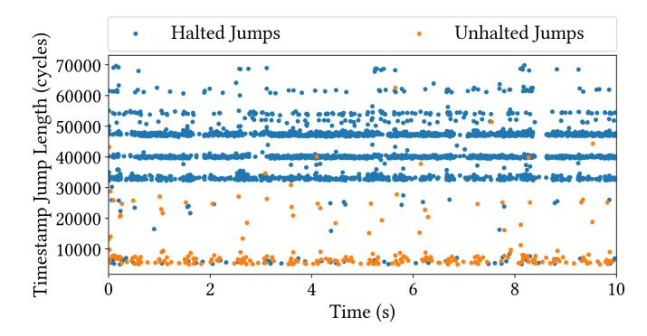

<span id="page-3-1"></span>Fig. 1. Timestamp jumps observed on the i7-9750H. The horizontal axis represents the time at which each jump is observed. The vertical is the length of the jumps. Color indicates whether the jump is halted or unhalted. The longest 0.5% of the jumps are omitted to remove outliers.

Obs. 1: Multiple instances of CPU halted time exist, potentially accounting for more than 1% of the overall CPU utilization.

To identify the source of unhalted timestamp jumps, we repeat the experiment in the isol-cpu configuration. That is, we execute the collection program on a core that does not handle interrupts. In this setup, we only observe halted timestamp jumps, almost all of which exceed 30,000 cycles. The absence of unhalted timestamp jumps on interrupt-free cores indicates that such jumps are caused by interrupts.

In this work, we focus on halted timestamp jumps, which we refer to as *TimeGaps*. We observe that TimeGaps are much more frequent than jumps due to interrupts. Therefore, in attack scenarios, when interrupts are enabled, we can ignore jumps due to interrupts, treating them as measurement noise. Accordingly, in the rest of this section, we investigate TimeGaps in a noise-free isol-cpu environment.

Obs. 2: During over 94.3% of timestamp jumps, the processor is halted, and no computation is performed. We can therefore treat the remaining unhalted timestamp jumps as noise.

We further examine the presence and inter-core synchronization of TimeGaps on the Intel microarchitectures summarized in [Table I.](#page-2-1) Using the same collection procedure, we collect a substantial number of TimeGaps on each platform. To assess inter-core synchronization, we repeatedly select and isolate two random physical cores, disable interrupts on both, and simultaneously record TimeGaps over a 10-second interval. On all platforms, we observe a one-to-one correspondence between TimeGaps recorded on different cores. The start time and duration of corresponding TimeGaps across cores differ by an average of just 46.21 cycles and 0.69%, respectively.

Obs. 3: TimeGaps occur synchronously across all CPU cores.

#### <span id="page-4-3"></span>*C. TimeGaps Caused by CPU*

We now turn our attention to identifying the root cause of TimeGaps. Our starting point is the Intel Power Management Guide [\[24\]](#page-13-8), which states that during P-state transitions, no instructions are processed on the core for a period of time. Such TimeGaps were previously identified in the context of CPU efficiency [\[15,](#page-13-7) [24,](#page-13-8) [27\]](#page-13-9). We now perform a sequence of experiments to analyze the properties of such TimeGaps.

We begin by examining the correlation between P-state transitions and TimeGaps under three different DVFS settings. We use SSH to access the machines remotely, minimizing interference from graphical user interfaces. When we use the default DVFS settings, we observe 11,279 TimeGaps over a 10-second interval. In contrast, in the freq-control configurations, when we fix the CPU frequency, no TimeGaps occur. To further support the hypothesis that the TimeGaps we observe are due to P-state transitions, we repeat the freq-control experiment, but now we switch between two different frequencies at regular intervals. We observe that, in this setting, TimeGaps occur at the same intervals as the frequency transitions.

We then use the isol-cpu configuration to isolate two cores. On one of the cores, we record the times of P-state transitions, by monitoring changes in the MSR\_PERF\_STATUS register (MSR 0x198). On the other core, we run our TimeGaps collection program [\(Listing 1\)](#page-3-0). The observed transition sequences align closely, with differences bounded only by clock sampling resolution. These results indicate that DVFSinduced P-state transitions are a source of TimeGaps, with a strong temporal correlation between the two.

We further examine individual P-state transition pairs and find that different transitions yield characteristic TimeGap durations. Within two hours across diverse workloads (idle and stressed CPU via stress-ng), we record 2,946,491 transitions and observe that each pair induces a characteristic duration range. For example, 4.0 to 4.1 GHz transitions most often produce about 35,000 cycles, whereas 4.4 to 4.3 GHz transitions typically yield about 52,000 cycles. These ranges are characteristic yet partially overlapping.

Obs. 4: A P-state transition is accompanied by a measurable TimeGap, and different transition pairs exhibit characteristic (albeit partially overlapping) distributions of TimeGap durations.

## *D. TimeGaps Caused by iGPU*

We now explore other potential causes of TimeGaps. To that aim, we eliminate all P-state transitions by using the freq-control configuration, with a fixed CPU frequency. We find that on systems where the iGPU is used as the default display device, TimeGaps continue to appear and correlate with changes in iGPU frequency.

In our first experiment, we execute several workloads on our test system. Specifically, we start with a random selection of five stress-ng benchmarks, covering CPU computation,

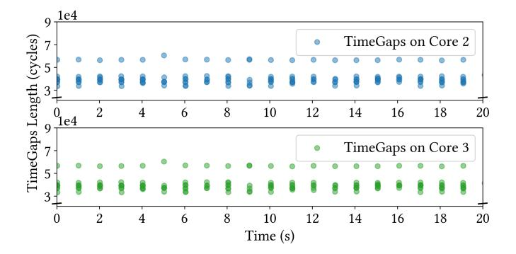

<span id="page-4-1"></span>Fig. 2. TimeGaps observed during the execution of an OpenCL function on the GPU per second on an i5-8259U CPU at 2300 MHz.

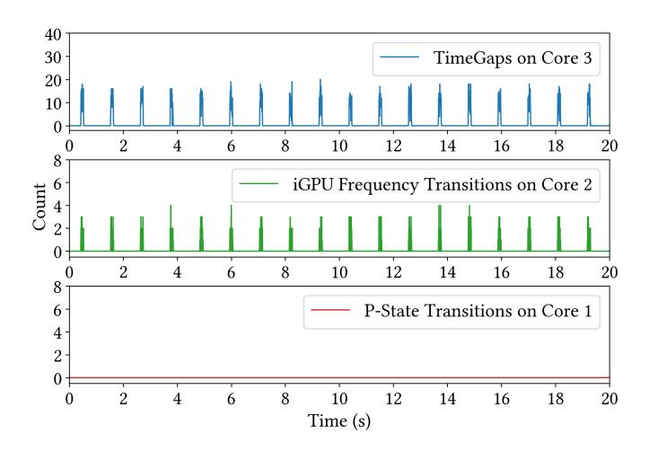

<span id="page-4-2"></span>Fig. 3. TimeGaps, iGPU frequency transitions, and P-state transitions observed during the execution of an OpenCL function that runs for 0.1 seconds every second on an i5-8259U at 2300 MHz.

memory, I/O, network, and system resource stress tests. We execute the benchmarks for 10 seconds and then swap to another random selection of five benchmarks. We repeat the process five times, using a total of 25 benchmarks over a total period of 50 seconds. We then switch to a video player and play videos for a period of 100 seconds.

During the 150 seconds of the test, we run our TimeGaps collection program [\(Listing 1\)](#page-3-0). At the same time, we also run a program that monitors the iGPU frequency by reading the gt\_cur\_freq\_mhz system file [1](#page-4-0) . Finally, on a third core, we monitor P-state transitions using the PMC.

We observe no P-state transitions for the entire experiment. We also do not observe TimeGaps when running the CPU load. However, when playing videos, we observe TimeGaps, which appear to be correlated with iGPU frequency transitions.

To further understand the relationship between TimeGaps and GPU activity, we design the following experiments that exercise the iGPU while pinning the CPU frequency.

<span id="page-4-0"></span><sup>1</sup>We note that the file is updated only once every approximately 0.3 ms. Hence, our iGPU trace is only partial. An alternative approach is to use the perf\_event\_open system call to track PMU events from the Intel i915 driver, which provides an update rate of 5 ms.

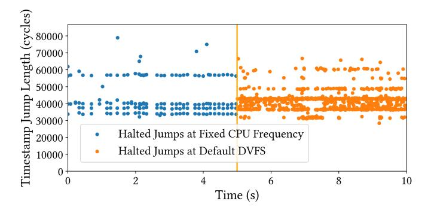

<span id="page-5-0"></span>Fig. 4. Measured halted jumps (TimeGaps) on the i5-8259U at 2300 MHz with iGPU workloads and under default DVFS without iGPU activity.

We first develop a program that executes an OpenCL kernel function on the iGPU once per second. The kernel runs the vector\_add function to compute the sum of two one-dimensional arrays, each of size 4. This allows us to observe the system behavior under consistent and repeated GPU workloads. [Figure 2](#page-4-1) shows the results of running this code on an i5-8259U with integrated Intel UHD Graphics 630. We observe that TimeGaps are synchronized across cores, in the absence of P-state transitions. Additionally, we execute the OpenCL function on the iGPU for 0.1 seconds every second and monitor the iGPU frequency transitions on a separate core. As shown in [Figure 3,](#page-4-2) TimeGaps align with iGPU frequency transitions.

Obs. 5: iGPU-related workloads cause TimeGaps and they are synchronized across CPU cores under a fixed CPU frequency. These TimeGaps are from iGPU frequency transitions.

Next, we perform a comparison on the machines listed in [Table I.](#page-2-1) After fixing the CPU frequency, we observe that TimeGaps persist only on systems that use the iGPU to drive the display (i5-8259U and i7-9750U). In contrast, on machines featuring discrete GPUs, no TimeGaps are observed once the CPU frequency is fixed. We further study a platform (i3- 10100) with both an Intel UHD Graphics 630 iGPU and a GTX 1080 Ti discrete GPU (dGPU). On this system, TimeGaps persist when the display is connected to the iGPU, but disappear when the display output is handled exclusively by the discrete GPU.

Obs. 6: Under a fixed CPU frequency, TimeGaps only appear when iGPU is used to drive the display and vanish when the display is handled exclusively by dGPU, tying the phenomenon specifically to the iGPU/display power domain.

Further, we study iGPU-induced TimeGaps from the CPU core's perspective using hardware performance counters. With the CPU frequency pinned on i5-8259U, we run the OpenCL workload on the iGPU while recording CPU\_CLK\_UNHALTED.THREAD and CPU\_CLK\_ UNHALTED.REF\_TSC via the same program in [Section III-B.](#page-3-2) From these counters, we construct timestamp jumps and derive the distribution of halted-time intervals. [Figure 4](#page-5-0) shows that iGPU frequency transitions produce TimeGaps whose duration distribution closely matches that of TimeGaps induced by CPU frequency transitions.

I-DVFS [\[15\]](#page-13-7) provides evidence that CPU P-state transitions cause TimeGaps because the SoC power-management unit (PMU) temporarily halts CPU cores. Intel's RAPL module treats iGPU as a package-level power domain managed [\[26\]](#page-13-20). Combined with our observations above, we speculate that iGPU DVFS is orchestrated by the same package-level PMU as CPU P-states: when the iGPU requests a new frequency, the PMU also halts CPU cores to maintain safe timing and voltage margins, which manifests the TimeGaps we observe. To further support this hypothesis, we conduct the following experiments.

First, we rule out OS idle behavior as the cause of the observed TimeGaps. On the Intel i5-8259U, we fix the CPU frequency, keep the pinned CPU cores active, run OpenCL workloads on the iGPU, and measure the active cores' percore C1 and C1E residency. The C1/C1E deltas remain zero throughout the experiment, including during TimeGaps. This indicates that the observed TimeGaps are not caused by OSmanaged idle states, such as MWAIT-driven C-states.

We then examine architectural evidence for shared packagelevel coordination. Intel documentation for 8th-Gen Uplatform processors [\[22\]](#page-13-21) describes Processor Graphics as an on-package device and places both IA-domain CPU control/status registers and GT-domain integrated graphics control/status registers within the same package-level PMU register space. This provides architectural context suggesting that IA and GT domains are coordinated through the same packagelevel PMU.

With the description above, still under fixed CPU frequency, we run an OpenCL workload that repeatedly launches iGPU kernels while minimizing CPU-side activity. Specifically, kernels are submitted in batches to a single command queue and synchronized only once per batch. As a result, the CPU mainly performs kernel submission and waits for completion, while the computation is executed by the iGPU. Under this setting, the iGPU frequency frequently fluctuates within a range between 1,017 MHz and 1,050 MHz, while CPU-side activity remains low. This setup therefore isolates iGPU-side DVFS activity with minimal CPU involvement.

During execution, we repeatedly read the package and core energy MSRs, MSR\_PKG\_ENERGY\_STATUS (package plane) and MSR\_PP0\_ENERGY\_STATUS (core plane). For each interval in which the energy reading changes, we record the energy delta together with the corresponding start and end timestamps (via rdtscp). We also record all TimeGaps and classify the energy intervals into two groups with or without a TimeGap. We then use the ratio between the energy delta (∆Epkg for package plane and ∆Ecore for core plane) and the timestamp delta (∆t) as a power proxy. Across 20-second runs with 270 TimeGaps on average per run, [Figure 5\(a\)](#page-6-1) shows

<span id="page-6-1"></span>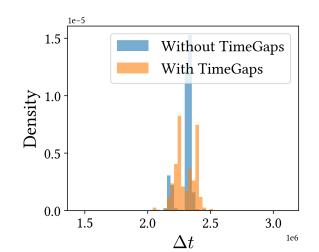

<span id="page-6-2"></span>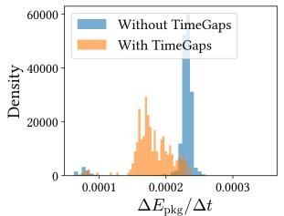

- (a) Timestamp Delta Distribution (b) Package Power Proxy Distribution

Fig. 5. Distributions of timestamp deltas (∆t) and package-level power proxies (∆Epkg/∆t) for intervals with and without TimeGaps.

that the timestamp-delta distributions of the two groups are comparable, with their mean values differing by only 0.12%. In contrast, [Figure 5\(b\)](#page-6-2) shows that the package-level power proxy is significantly lower for intervals containing TimeGaps, with an average reduction of 18.2% compared with intervals without TimeGaps. Meanwhile, the core-plane power proxy (∆Ecore/∆t) remains low and relatively stable (an average reduction of only 2.9%).

Together, these results support that iGPU DVFS triggers a short package-level coordination that temporarily stalls CPU cores (TimeGaps) without OS-idle, explaining the DVFS alignment and cross-core synchronization.

Obs. 7: Core-level events show that iGPU frequency changes create halted-time intervals whose duration distribution closely matches that of CPU P-state–induced TimeGaps, indicating a common package-level powermanagement origin.

Finally, to confirm that TimeGaps due to iGPU activity can coexist with TimeGaps from P-state transitions, we repeat the experiments described in [Section III-B](#page-3-2) in a noise-free environment under the default DVFS configuration, but this time while playing video. On our i5-8259U, which includes an iGPU, we observe significantly more TimeGaps than Pstate transitions (1,949 vs. 1,148). We attribute this difference to additional TimeGaps caused by iGPU activity.

Obs. 8: TimeGaps resulting from P-state transitions and iGPU activities coexist if both sources are satisfied, or appear alone if the other source is disabled (e.g., the CPU frequency is fixed or the iGPU is not used).

#### <span id="page-6-0"></span>IV. INFORMATION LEAKAGE CAUSED BY TIMEGAPS

We now analyze the leakage capabilities of the TimeGaps side channel. We construct two settings: one under the default DVFS system configuration and another with restricted CPU frequency, representing a system with countermeasures against side channels based on CPU frequency, specifically by fixing the CPU frequency or disabling Turbo Boost. We first show that, under the default DVFS configuration, TimeGaps exhibit capabilities comparable to recent CPU-frequency-based attacks, such as Hertzbleed [\[49\]](#page-14-9), particularly in distinguishing data-dependent variations, including differences in Hamming weights (HW) and Hamming distances (HD). We further show that TimeGaps continue to reveal instruction and data-level information even when CPU frequency scaling is restricted. Importantly, commodity Intel systems currently lack mechanisms to reliably fix iGPU frequency, rendering this vector difficult to mitigate from user space[2](#page-6-3) .

## *A. Threat Model and Assumptions*

Our attacks target Skylake-derived microarchitectures, where TimeGaps are synchronized across all cores and arise from both CPU and iGPU frequency transitions. We assume an unprivileged attacker who executes either a native process on the victim machine or JavaScript within an attacker-controlled webpage that the victim visits. Consequently, the attacker cannot modify the victim's system under both environments, e.g., disabling DVFS or Simultaneous Multithreading.

For the default DVFS scenario, we assume that the DVFS policy is enabled by default. For the restricted CPU frequency scenario, we assume the system operates at a fixed CPU frequency and employs the iGPU for display output. We make no assumptions about the number of victim threads or the specific core on which the victim process executes. Besides, interrupts are themselves a well-known leakage source [\[8\]](#page-13-5). In experiments with an interrupt-free environment, the attacker is pinned to an isolated core with interrupts removed, reflecting a system-level mitigation against interrupt-based side channels.

## <span id="page-6-4"></span>*B. Unprivileged Detection*

Both methods used in [Section III](#page-2-0) to filter unhalted jumps require privileged access, which is disallowed in our threat model. We now present the unprivileged techniques used in the rest of this paper to observe TimeGaps.

In the native environment, we use the collector program in [Listing 1](#page-3-0) to collect TimeGaps and use SegScope [\[57\]](#page-15-1) to filter interrupts. SegScope observes that when the processor returns from an interrupt, transitioning from kernel space back to user space, the segment registers such as GS are cleared to 0. To leverage this behavior, we set GS to a nonzero value (e.g., 1) before reading the timestamp counter. For each detected timestamp jump, we examine the value of GS. If it remains 1, we classify the jump as a TimeGap rather than an interrupt.

In a browser scenario where neither SegScope nor highresolution timers are available, we use a loop-counting program [\[8\]](#page-13-5), implemented in JavaScript with millisecond precision, to detect TimeGaps. The code measures computational throughput by counting how many iterations of an empty loop can be completed during fixed time intervals. We observe that TimeGaps significantly affect the loops: when a TimeGap occurs, the CPU halts, resulting in fewer completed iterations

<span id="page-6-3"></span><sup>2</sup>We note that on Intel iGPUs using the i915 driver, even when the maximum and minimum iGPU frequencies are set to the same value via the gt\_min\_freq\_mhz and gt\_max\_freq\_mhz interfaces, the iGPU frequency still varies in the presence of iGPU workloads.

and lower counter values. To validate this, we simultaneously collect TimeGaps and loop counters under the default DVFS setting while accessing 100 different websites. Fish and Chips [\[13\]](#page-13-0) reports a highest correlation of −0.49 ± 0.11 between loop-counter values and interrupt-handling time. In comparison, our Pearson correlation between the total duration of TimeGaps and loop-counter values is −0.70 ± 0.06, indicating a strong negative linear relationship where longer TimeGaps consistently lead to lower loop-counter values.

#### *C. Distinguishing Data under Default DVFS Settings*

We explore whether TimeGaps can leak information about different data being processed by the same instructions, particularly data with varying Hamming distances (HD) and Hamming weights (HW).

Experiment Setup. We use the code described in [Sec](#page-6-4)[tion IV-B](#page-6-4) to collect TimeGaps and compute CPU frequency using the MSR\_IA32\_MPERF and MSR\_IA32\_APERF registers. In each experiment, a consistent set of ALU instructions (referred to as the sender) is executed in a loop across all cores, with varying input data. We sample the CPU frequency at 1 ms intervals and collect 30,000 data points for each experiment, while concurrently gathering TimeGaps information.

Past works have demonstrated that the power consumption of digital circuits tends to correlate with the number of 1 bits in the data being processed and with the number of bits in which consecutive data values differ, known as Hamming Weight (HW) and Hamming Distance (HD), respectively [\[49\]](#page-14-9). To demonstrate the correlation of HD with TimeGaps, we implement a sender that alternates between the *SHLX* and *SHRX* instructions, which shift bits left and right, respectively. These instructions operate on a second source register with a fixed value of 0x0000ffffffff0000, containing 32 ones surrounded by 16 zeros on each side. The shift amount, provided by a separate register, varies from 0 to 16 across iterations. Although the total number of ones remains constant during shifting, the number of bit transitions between the input and output changes with the shift amount. This setup allows us to evaluate the impact of varying HD without confounding it with changes in Hamming Weight. We also note that on our test platforms, *SHLX* and *SHRX* execute on different ports (port 0 and port 6, respectively), and are issued in alternating pairs to maintain balanced usage.

To analyze the correlation with HW, the sender uses bitwise *OR* instructions between the source and destination registers, storing the result in the destination register. All *OR* instructions use the same inputs and outputs, avoiding bit transitions. This design ensures that we can test different HW in the source registers without introducing the effects of HD.

Experiment Results. [Figure 6](#page-7-0) shows that the frequency of TimeGaps is strictly proportional to the Hamming distance. Specifically, the larger the HD, the lower the frequency of transitions. The number of TimeGaps, though not strictly proportional to HD, can still be distinguished. As illustrated in [Figure 6\(b\),](#page-7-1) the number of TimeGaps initially rises and then falls with increasing COUNT values. For example, from

<span id="page-7-1"></span>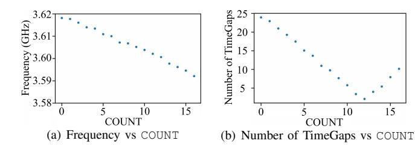

<span id="page-7-0"></span>Fig. 6. Effect of varying COUNT (HD) on our i7-9750H. The Y-axis represents the mean value of frequency or the number of TimeGaps per trace.

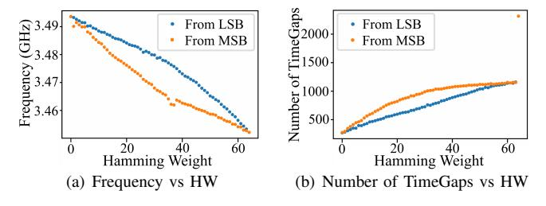

<span id="page-7-2"></span>Fig. 7. Effect of increasing HW on our i7-9750H.

COUNT 10 to 15, the recorded gaps are 5.77, 3.40, 2.10, 4.00, 5.43, and 7.93, respectively, showing clear variability.

[Figure 7](#page-7-2) presents the results as the HW increases from 0 to 64, analyzing two scenarios where the 1 s start from the least significant bit (LSB) and the most significant bit (MSB). We observe a notable increase in the number of TimeGaps and a corresponding decrease in the frequency with rising HW. We believe that the reason behind this is the frequency demonstrates more pronounced fluctuations at lower levels, which consequently leads to more TimeGaps.

## *D. Distinguishing Instructions and Data with Fixed CPU Frequency*

We next investigate whether instructions and data can be distinguished by monitoring TimeGaps on CPU cores under fixed CPU frequency or with Turbo Boost disabled.

Experiment Setup. To distinguish between different instructions, we construct two separate 1-dimensional OpenCL workloads: Int that repeatedly performs integer addition operations, and Float that performs repeated floating-point additions. To distinguish between different data values, we vary the Int workload by using two operands: one repeatedly adds the constant value 1, while the other adds a large immediate operand, 0xfffffff. While executing these workloads on the iGPU, we concurrently monitor the iGPU's frequency by reading gt\_cur\_freq\_mhz, track iGPU power consumption using perf\_event\_open on the PMU event power/energy-gpu, and collect TimeGaps at 1 ms intervals.

Experiment Results. [Figure 8](#page-8-1) shows the iGPU power consumption, iGPU frequency, and the total duration of TimeGaps collected on the CPU every 1 ms while executing different instruction types. The int and float workloads exhibit distinct power consumption profiles. Specifically, 83.8% of

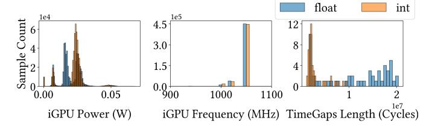

<span id="page-8-1"></span>Fig. 8. Distribution of iGPU power consumption, iGPU frequency, and TimeGaps length observed at 1 ms intervals during execution of int and float OpenCL workloads on an i5-8259U at 2300 MHz.

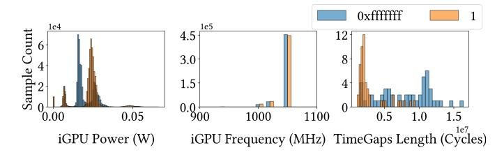

<span id="page-8-2"></span>Fig. 9. Distribution of iGPU power consumption, iGPU frequency, and TimeGaps length observed at 1 ms intervals during repeated additions of 1 or 0xfffffff on an i5-8259U at 2300 MHz.

int's power measurements fall within the 0.020–0.030 W range, whereas 55.0% of float's power measurements fall within the 0.015–0.025 W range. In terms of frequency behavior, float workloads more frequently sustain higher frequencies such as 1050 MHz and 1017 MHz, whereas int workloads are more often observed at 1000 MHz. Further, float instructions induce significantly more TimeGaps than int. The average TimeGap duration over a 10-second window is 1.3 ms for the float workload, compared to 5.0 ms for int.

As shown in [Figure 9,](#page-8-2) the 0xfffffff and 1 operand addition workloads produce distinct iGPU power and frequency behaviors. The power-consumption distribution curves show clearly separated peaks, indicating a significant shift in typical power-usage patterns between workloads. The 0xfffffff operand workload is associated with sustained operation at higher frequencies, particularly around 1050 MHz, whereas the 1 operand workload predominantly runs at 1017 MHz and 1000 MHz. In terms of TimeGaps, the 0xfffffff workload yields a greater number of TimeGaps. Over a 10-second interval, it accumulates 3.6 ms of TimeGaps, which is 2.8× the length recorded during the 1 operand workload.

We also repeat the above experiments with Turbo Boost disabled and without constraining the CPU frequency. The results closely match those obtained under fixed-frequency execution at the base clock. A plausible explanation is that, in the absence of Turbo Boost, the CPU remains within its thermal and power limits, resulting in minimal or no frequency transitions during the measurement period.

## V. ATTACKS WITH FIXED CPU FREQUENCY

## <span id="page-8-0"></span>*A. Pixel Stealing Attack*

Browsers may cache site-specific user information locally to improve performance. However, if a user visits an attackercontrolled page that embeds a victim page in a cross-origin iframe, a pixel-stealing attacker can influence how the iframe is rendered and observe the resulting side effects, thereby reconstructing the victim page. For example, the attacker can magnify each pixel region of the iframe and apply a shader or filter such as a Gaussian blur. Rendering different pixel values generates different iGPU workloads, thus different TimeGaps. By applying rendering operations whose cost depends on the sampled pixel value and correlating the resulting TimeGaps, we can infer each pixel's value and reconstruct the framed content, even though the frame itself remains inaccessible under same-origin policies [\[6,](#page-13-22) [47,](#page-14-8) [50,](#page-14-10) [51,](#page-14-20) [51\]](#page-14-20).

While prior works have explored power- and frequencybased side channels on x86 CPUs [\[6,](#page-13-22) [50\]](#page-14-10), they have limitations. Wang et al. [\[50\]](#page-14-10) rely on CPU frequency variations induced by the iGPU and can be mitigated by fixing the CPU frequency, whereas Chun et al. [\[6\]](#page-13-22) depend on Windowsspecific scheduling behavior and are not applicable to Linuxbased systems. In this section, we present the first attack capable of recovering pixels from a cross-origin page on x86 CPUs under fixed-frequency settings in a Linux environment. Experimental Setup. We conduct our experiments on an Intel i5-8259U machine using Mozilla Firefox 136.0.1. All CPU cores pinned to the base frequency using the performance governor. Our attack proceeds in two stages: a native proofof-concept (PoC) validation and an end-to-end pixel stealing phase, using the techniques outlined in [Section IV-B.](#page-6-4) In the validation phase, we collect iGPU frequency and TimeGaps at 1 ms intervals during the rendering of different pixel values in a native setting to assess their distinguishability. In the endto-end browser-based attack, we first establish a ground-truth timing threshold using controlled measurements, then apply this threshold to classify individual pixels embedded within an iframe, whose content is protected by the same-origin policy and therefore not directly accessible.

Specifically, we sequentially select each pixel from the target page and use CSS to convert it into a grayscale value of either black or white. We then apply a CSS scale transform to enlarge the selected pixel to a 2000×2000 iframe and overlay it with a random image using the feComposite filter. In the rendering thread, a chain of feGaussianBlur filters is repeatedly applied to the composed image. Black pixels remain black after composition, whereas white pixels reveal the underlying random image in the resulting frame.

Experimental Results. In the native PoC phase, as shown in [Figure 10,](#page-9-0) rendering white pixels leads to a stable high iGPU frequency (the iGPU frequency remains at 1050 MHz in 67.0% of samples), whereas rendering black pixels frequently fluctuates between 300 and 1050 MHz. Consequently, we observe 1.65× as much accumulated TimeGap duration when rendering black pixels as when rendering white pixels, with an average

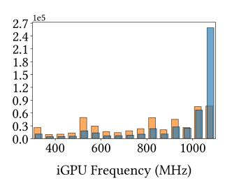

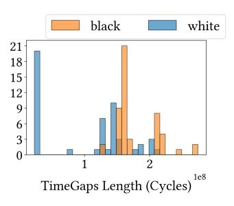

<span id="page-9-0"></span>Fig. 10. Distribution of iGPU frequency and accumulated TimeGap duration observed at 1 ms intervals during repeated rendering of white or black pixels on an i5-8259U at 2300 MHz.


Fig. 11. Results of our pixel stealing attack on Mozilla Firefox, retrieving visual content from a cross-origin iframe.

<span id="page-9-1"></span>TimeGap duration of 7.5 ms per CPU second during blackpixel rendering. These observations demonstrate the feasibility of translating TimeGaps into fine-grained differentiation.

In the browser phase, we achieve a recovery speed of 4.38 seconds per pixel with an error rate of 1.78%. As shown in Figure 11, our end-to-end attack reconstructs a 48×48 pixel region from a cross-origin iframe within 2.8 hours. Our results are comparable to prior frequency-based work. Hot Pixels [47] reports 8.1 to 22.6 seconds per pixel, while Wang et al. [50] reports 0.86 to 3.07 seconds per pixel. These studies focus on recovering small, stable UI regions such as elements in an inbox-style interface rather than full pages.

#### <span id="page-9-3"></span>B. Website Fingerprinting Attack

Website fingerprinting attacks leverage statistical methods to identify the websites a user visits. Our key insight is that rendering different websites produces distinguishable CPU and iGPU workloads, and therefore distinct TimeGaps. Although prior coarse-grained execution-speed measurement website fingerprinting attacks attribute their causes largely to CPU frequency scaling [10] and interrupt handling [8], we have shown in Section IV-B that TimeGaps are also a major contributor to such measurement under default settings.

In this section, we demonstrate that TimeGaps can be exploited for website fingerprinting even under fixed-frequency settings and in the absence of interrupts. We collect TimeGaps under both native and browser environments, as described in Section IV-B. For comparison, we evaluate them against DF-SCA [10], which leverages the unprivileged cpufreq interface to access real-time CPU core frequencies. Aligned with existing work [8, 10, 44, 57, 58], we assume that the attacker uses DNNs as classifiers for website fingerprinting. During the offline phase, we collect sufficient TimeGaps data, together with other relevant data, as we visit different websites

<span id="page-9-2"></span>TABLE II
TOP-1 CLASSIFICATION ACCURACY (AVERAGE ± STANDARD DEVIATION)
UNDER TWO ATTACK SCENARIOS.

| Data Source        | Fixed Frequency  |                   | Default Setting    |                    |
|--------------------|------------------|-------------------|--------------------|--------------------|
|                    | Chrome           | Tor               | Chrome             | Tor                |
| TimeGaps (native)  | 92.2±0.7%        | 87.4±0.9%         | 98.0±0.9%          | 85.2±1.0%          |
| TimeGaps (browser) | $92.3 \pm 0.7\%$ | $88.2 \pm 1.2\%$  | $95.4 \pm 0.8\%$   | $65.4 {\pm} 0.8\%$ |
| Frequency [10]     | $1.1 \pm 0.1\%$  | $1.0 {\pm} 0.1\%$ | $93.3 {\pm} 0.5\%$ | $63.0 \pm 1.5\%$   |

to train the model. In the online phase, the trained model is used to predict which website has been accessed.

Experimental Setup. We conduct our experiments on an Intel Core i7-7700 machine, using both Chrome and the Tor browser. We select the top 100 active, non-explicit websites from the Alexa Top 150 list [8]. On Chrome, we collect 100 traces per website, each lasting 15 seconds, while on Tor, each trace lasts 30 seconds. During each trace, we visit a website and use our attacker program to record, every 500 μs, the total duration of TimeGaps in the native environment, the loop-counter values in the browser, and the CPU frequency by reading scaling\_cur\_freq [10].

For data processing, we implement the same Long Short-Term Memory (LSTM) model featuring 32 units as prior works [8, 44, 57], and maintain identical hyperparameters. During our evaluation, we split the data into ten folds, using one fold as the test set and dividing the rest into an 81% training set and a 9% validation set. This process is repeated iteratively for each fold, and we calculate the average accuracy across all ten folds to establish the final accuracy.

Experimental Results. As shown in Table II, under the fixed frequency setting, TimeGaps collected natively achieve accuracy comparable to those inferred via the counter-based approach in the browser, reaching 92.2±0.7% on Chrome. Although Tor Browser introduces noise such as unpredictable data packets to protect user anonymity, which reduces finger-printing accuracy, we still achieve 87.4±0.9%. In addition, the accuracy under the fixed frequency setting is higher than under default DVFS. This is because Tor's injected noise may cause bursty CPU activity that perturbs CPU frequency, while fixing the CPU frequency removes this DVFS-induced fluctuation, resulting in cleaner traces and higher accuracy.

#### C. Keystroke Detection

Characters can be reliably inferred from distinctive patterns in inter-keystroke timing [45]. In line with prior works [10, 32, 39, 40, 42], we focus on demonstrating keystroke timing. We assume a fixed-frequency scenario, where the frequency-based detection [10] is ineffective. Besides, we actively remove the keystroke interrupts on the attacker core to avoid the assumption about which core the attack process is running on. This mitigates all single-core interrupt-based keystroke attacks [32, 40, 42], with the exception of the approach by Rauscher et al. [39], which targets the latest CPU architectures to detect cross-core interrupts.

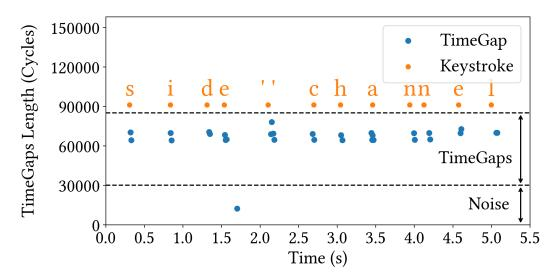

<span id="page-10-1"></span>Fig. 12. TimeGaps sequence vs. recorded keystroke timing and keystroke values on the i5-8259U CPU.

Our attack targets a victim who physically enters a password using the keyboard. In this scenario, each keystroke results in an asterisk appearing on the screen. This activity is likely to trigger iGPU frequency transitions, which can be indirectly observed through the appearance of TimeGaps.

Experimental Setup. We run our attack on the Intel i5- 8259U machine equipped with an Intel Iris Plus 655 integrated GPU. We collect TimeGaps on an arbitrary core while a human types on the keyboard. To validate our results, we concurrently run another program that reads the keyboard device file and records the press and release times, along with the values of each keystroke. For our end-to-end evaluation, we manually typed 1,687 times within 700 seconds.

Experimental Results. [Figure 12](#page-10-1) shows the TimeGaps we collected while typing "side channel" in the graphical terminal. The orange letters correspond to the times of key presses, while the blue lines indicate the lengths and occurrence times of TimeGaps. It can be seen that we can easily extract the typing patterns through TimeGaps. Specifically, our keystroke detection achieves a precision of 84.6%, a recall of 99.6%, an F1 score of 91.5%, and a temporal standard deviation of 5.56 ms, which is comparable to [\[39\]](#page-14-13), reporting a precision of 97.6%, a recall of 98.3%, an F1 score of 98.2%, and a temporal standard deviation of 6.15 ms. This means that we are also able to infer the typed characters.

## VI. ATTACKS UNDER DEFAULT DVFS SETTINGS

## <span id="page-10-0"></span>*A. Website Fingerprinting Attacks*

Using the same setup as in [Section V-B,](#page-9-3) except under default DVFS, we evaluate the effectiveness of TimeGaps for website fingerprinting. As shown in [Table II,](#page-9-2) TimeGaps collected in the native environment achieve the highest website identification accuracy among all data sources, reaching 98.0 ± 0.9% on Chrome and 85.2±1.0% on Tor, demonstrating that TimeGaps are a previously undocumented main leakage source.

Furthermore, as discussed in Section [III-C,](#page-4-3) TimeGap durations also carry information about the magnitude of frequency transitions. In addition, they can capture each transition in real time. Consequently, TimeGaps collected natively provide strong capability for rapid recognition. Using only a 0.1 second data window, TimeGaps (native) achieve a Top-5 accuracy[3](#page-10-2) of 57.1±3.5%, significantly outperforming counter values (31.8±2.3%) and frequency data (18.2±1.0%). Moreover, TimeGaps (native) reach over 90% Top-1 accuracy within the first 1.3 seconds of each trace, whereas achieving similar accuracy requires 2.6 seconds using counter values and 3.7 seconds using frequency data.

#### *B. Extracting Cryptographic Keys*

We now apply TimeGaps to extract cryptographic keys by leveraging data-dependent CPU frequency transitions. Specifically, we show how to recover the secret key from the Supersingular Isogeny Key Encapsulation (SIKE) implementation in Cloudflare's Interoperable Reusable Cryptographic Library (CIRCL) [\[12\]](#page-13-10). Although it has been proven to be breakable by cryptographic attacks [\[2\]](#page-12-2), we note that its secret-dependent power behavior continues to make it a valuable target for recent side-channel analysis [\[6,](#page-13-22) [49,](#page-14-9) [57\]](#page-15-1).

Specifically, SIKE is a post-quantum key encapsulation mechanism, where the secret key is a 378-bit binary integer m in the case of SIKE-751. If the i-th and (i − 1)-th bits of m differ (m<sup>i</sup> ̸= mi−1), the (i+ 1)-th step of the Montgomery ladder will produce a zero value, causing a stall in the decryption process and resulting in reduced power consumption. In contrast, if m<sup>i</sup> = mi−1, the computation proceeds normally with higher power consumption.

Experimental Setup. Aligned with previous work [\[49,](#page-14-9) [57\]](#page-15-1), we execute our attack program while CIRCL spawns 300 concurrent go routines and utilizes 10 randomly generated 378-bit keys. We collect TimeGaps during each bit-guessing attempt. The evaluation is carried out on our i5-8259U, accessed via SSH to minimize iGPU noise.

Experimental Results. We analyze the distribution of the total duration of TimeGaps to distinguish cases where the i-th and (i−1)-th bits of m differ or are equal. When m<sup>i</sup> ̸= mi−1, a zero value is produced, stalling execution and causing the processor to operate in a more variable frequency environment. In this case, the probability that no TimeGaps occur is 95.48%. In contrast, when m<sup>i</sup> = mi−1, the processor runs more stably, and the probability of no TimeGaps increases to 96.14%. Ultimately, to recover the full key, we only need to determine whether the first bit is 0 or 1, significantly reducing the search space to just two possibilities.

