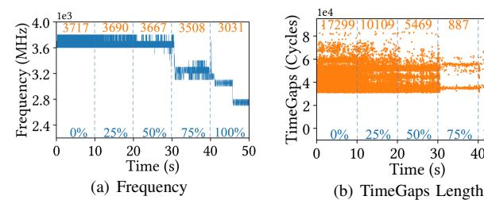
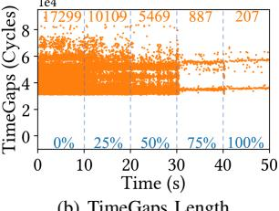
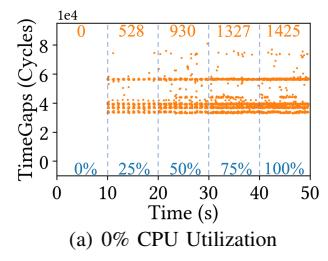
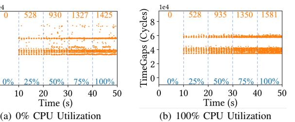

# VII. COMPARISON WITH RELATED WORK

We compare TimeGaps with prior frequency- and powerbased side channels, particularly Hertzbleed [\[49\]](#page-14-9) in terms of observation primitives, prerequisites, and channel strengths.

Observation Primitives. Unprivileged frequency interfaces, such as cpufreq, provide millisecond-level granularity and may miss short DVFS transitions [\[10\]](#page-13-6). In contrast, executiontime or loop-counting inference provides finer granularity but mixes frequency effects with interrupt noise [\[47,](#page-14-8) [49,](#page-14-9) [50\]](#page-14-10). In our browser setting of [Section IV-B,](#page-6-4) we reuse the same loop-counting primitive as [\[8\]](#page-13-5) and show that dips in loop counts primarily reflect halted-time TimeGaps (including those

3Top-5 accuracy refers to the probability that the correct website is among the top five predictions.

induced by iGPU DVFS) rather than interrupts alone. So TimeGaps separates halted intervals from interrupt effects.

Further, the execution-time proxies generally conflate three factors: frequency-dependent progress, halted time during DVFS transitions (TimeGaps), and interrupt handling. To quantify them, we rerun our website-fingerprinting under default DVFS and the same fingerprinting setup as [Section V-B,](#page-9-3) while logging the timing with CPU frequency, total TimeGaps duration, and interrupt-handling duration. We then compute the Pearson correlation coefficients between the timing measurements and each variable. A positive coefficient indicates a direct relationship, whereas a negative coefficient indicates an inverse relationship. The magnitude of the coefficient reflects the strength of the association. Across 100 sites, the timing correlates with frequency (0.61 ± 0.05), TimeGaps (−0.71±0.06), and interrupts (−0.37±0.07). This shows that in this case, timing is more associated with DVFS-transitioninduced halted time than with frequency alone. Clearly, this is an association measure, not a causal decomposition.

Prerequisites. Hertzbleed exploits frequency-dependent execution timing caused by data-dependent CPU DVFS. Therefore, fixing the CPU frequency mitigates the channel. Prior iGPU-related frequency effects reported in [\[50\]](#page-14-10) similarly arise when the CPU is stressed near thermal limits and can also be neutralized by fixing CPU frequency. In contrast, TimeGaps exploit transient halted-time intervals during DVFS coordination, including iGPU-induced DVFS events. Thus, TimeGaps do not require CPU stress and remain observable under fixed CPU frequency, exposing a leakage source beyond steady-state CPU frequency changes.

Channel Strengths. On the i5-8259U under default DVFS, we exploit TimeGaps to build a covert channel, achieving 50 bps with a 0.35% error rate, comparable to Hertzbleed [\[49\]](#page-14-9), which reports 28.41 bps with a 0.53% error rate. For sidechannel attacks, TimeGaps remain effective under fixed CPU frequency. As in [Section III-C,](#page-4-3) TimeGap durations also correlate with transition magnitude, enabling faster detection than coarse polling or noisy loop-counting baselines.

## VIII. DISCUSSION AND FUTURE WORK

## *A. TimeGaps Under Different System Workloads*

The aforementioned evaluations were conducted on an otherwise clean system, without stressing the CPU or iGPU. In this section, we examine how TimeGaps behave under varying CPU and iGPU utilizations, thereby assessing their resistance to noise. We first sweep CPU utilization under default DVFS, and then fix the CPU frequency while sweeping iGPU utilization across multiple CPU-load settings.

Under default DVFS, we collect TimeGaps and P-states separately on a pinned core, while using stress-ng --cpu-load to control the CPU utilization of all other cores. As shown in [Figure 13\(b\),](#page-11-0) higher CPU utilization leads to fewer TimeGaps. In [Figure 13\(a\),](#page-11-1) we observe an approximately one-second delay between a change in CPU

Fig. 13. The effect of CPU utilization on TimeGaps under default DVFS (Intel Core i5-8259U). CPU Utilization is swept from 0% to 100% in 25% increments, each held for 10 s. Orange numbers report the mean CPU frequency (MHz) and TimeGap count per 10-s window and blue numbers indicate the enforced utilization for that window.

Fig. 14. The effect of iGPU utilization on TimeGaps with CPU frequency fixed at 2.30 GHz (Intel Core i5-8259U). iGPU utilization is swept from 0% to 100% in 25% increments, each held for 10 s. Figure [14\(a\)](#page-11-2) and Figure [14\(b\)](#page-11-3) show results at 0% and 100% CPU utilization, respectively. Orange numbers report the TimeGap count per 10-s window and blue numbers indicate the enforced iGPU utilization.

utilization and the corresponding frequency change. This delay is expected because the CPU needs time to accumulate heat and reach the thermal limit, after which frequency change is triggered.

Under fixed CPU frequency, we vary the duration of OpenCL kernel execution within each one-second interval to change the average iGPU utilization, while keeping CPU utilization constant. As shown in [Figure 14,](#page-11-4) the number of TimeGaps is strongly correlated with iGPU utilization, whereas CPU utilization of either 0% in [Figure 14\(a\)](#page-11-2) or 100% in [Figure 14\(b\)](#page-11-3) has a limited effect. These results show that TimeGaps remain stable under fixed workloads and that iGPU-induced TimeGaps are relatively robust against CPUside noise.

Website Fingerprinting Attack under Noise. Since we focus on iGPU-induced TimeGaps, we evaluate the attack in the fixed-frequency setting and perform native websitefingerprinting experiments under varying iGPU utilization in Chrome. We maintain 25% CPU utilization and inject light (25%), medium (50%), and heavy (75%) iGPU loads as noise. The resulting accuracies are 88.3±1.2%, 82.5±1.2%, and 82.4±1.8%, respectively. While these are lower than that of the non-noise attack (92.2±0.7%), the sustained performance above 82% demonstrates the robustness of TimeGaps against concurrent system noise.

