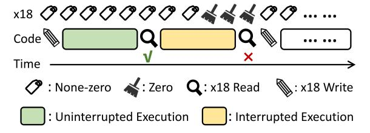

# *D. TIDE-based Denoising*

We then introduce a TIDE-based de-noising technique that accurately detects and filters out interrupted measurements. We note that interrupts are a well-known source of noise in both performance benchmarking [\[66\]](#page-14-22), [\[67\]](#page-14-23), [\[68\]](#page-14-24) and microarchitectural attacks [\[22\]](#page-13-21), [\[69\]](#page-14-25). As interrupts frequently occur to handle various system events, the timing and overhead of each interrupt is inherently non-deterministic, introducing variability in performance measurements. Moreover, in some attacks [\[22\]](#page-13-21), after the attacker has tricked the processor into a specific micro-architectural state, interrupts can trigger the execution of unrelated code that disrupts this state, e.g., by evicting primed cache lines [\[25\]](#page-13-24) or waking up idle cores [\[22\]](#page-13-21).

Fig. 4: TIDE-based denoising inserts at most one x18 read and one x18 write between every two pieces of code.

Our denoising primitive is built using TIDE's ability to accurately detect whether the current process has been interrupted after the x18 register is set. By placing the measurement between an x18 write and an x18 read, we can determine whether it is noised by interrupts, without interfering with its execution. By removing noisy measurements from a set of samples, one can significantly improve the accuracy of the final results.

Figure [4](#page-6-1) illustrates the workflow of TIDE-based de-noising. Before executing the code under measurement, we set the x18 register to a non-zero value. After each measurement, we check whether the value of x18 is cleared. If it remains unchanged, the current process is considered uninterrupted during the execution of our code. Otherwise, if x18 is cleared, it indicates an interrupt or exception occurred, and the corresponding measurement is discarded or repeated. The number of x18 writes can be further reduced to optimize the overhead if the current x18 is already a non-zero value. In this way, we achieve accurate de-noising with the cost of at most one register write and one register read.

### IV. UNDERSTANDING APPLE'S INTERRUPT DELIVERY

Aligned with previous interrupt detection techniques [\[20\]](#page-13-19), [\[17\]](#page-13-16), [\[22\]](#page-13-21), TIDE is also limited to detecting interrupts on its own operating core, i.e., local-core detection. Extending such techniques to cross-core side channels requires detecting interrupts that are triggered on one core but handled on another. Thus, we investigate shared peripheral interrupts (SPIs)[2](#page-6-2) , which are generated by devices external to the processor cores (e.g., network cards, keyboards, and GPUs) and delivered to one or more cores for handling. However, these attacks have so far been demonstrated only on Linux-based systems [\[25\]](#page-13-24), [\[18\]](#page-13-17), [\[19\]](#page-13-18), [\[20\]](#page-13-19), [\[17\]](#page-13-16) and Intel-based macOS [\[7\]](#page-13-6), where interrupt delivery mechanisms are open-source and well documented [\[70\]](#page-14-26). On Apple silicon, by contrast, the proprietary and poorly understood interrupt delivery design makes mounting crosscore attacks substantially more challenging.

Particularly, unlike traditional Arm architectures that employ a hardware named generic interrupt controller (GIC) to determine the target handling cores, Apple silicon adopts its own proprietary and closed-source hardware design, referred to as Apple interrupt controller (AIC) [\[37\]](#page-13-36). Starting from the

2While some processor-triggered interrupts can also be delivered across cores, their number is typically limited, and our results show that SPIs are the primary enabler of cross-core attack on Apple systems (Section [V-C\)](#page-10-0).

M1 Pro, Apple's AICv2 employs a hardware-based mechanism to dispatch interrupts to willing cores [\[36\]](#page-13-35). All platforms evaluated in this paper follow this design. This incompatibility introduces significant challenges for both custom operating system development[3](#page-7-1) and interrupt-related attacks.

Goals. Due to Apple's proprietary design and restricted kernel instrumentation, fully reverse-engineering its interrupt delivery is difficult. As a meaningful first step, this paper concentrates on two questions that are particularly critical for enabling cross-core interrupt side-channel attacks. Specifically, we ask:

- Q1: How does AIC deliver shared peripheral interrupts?
- Q2: What factors can affect interrupt delivery decisions?

Metrics: interrupt delivery efficiency. To investigate how AIC delivers SPIs to an attack core, we consider a setup in which we have complete control over both the attack code and the victim code. To quantify how often interrupts are received under a certain setting, we use the *efficiency* metric, defined as the ratio between the number of SPI requests generated and the number of interrupts successfully received. Except for some cases where a single request may trigger multiple interrupts (e.g., each keystroke may generate two interrupts [\[25\]](#page-13-24), [\[26\]](#page-13-25)), the efficiency typically ranges from 1 to +∞. An SPI request refers to a hardware resource request, such as receiving a network packet or tapping a keyboard. Since macOS does not provide an API to reliably activate an SPI, we use this metric to evaluate the interrupt receiving rate under different resource request frequencies.

