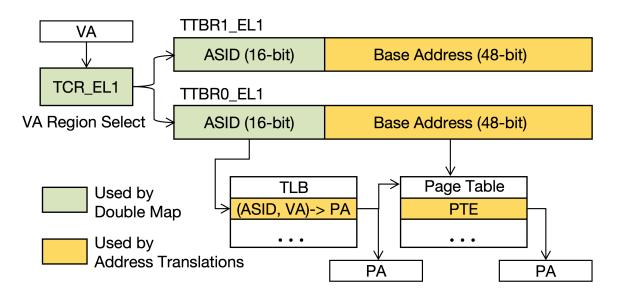
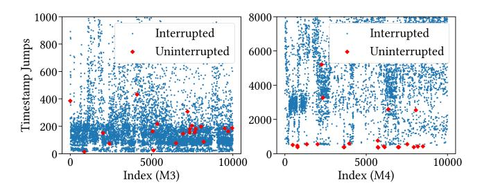
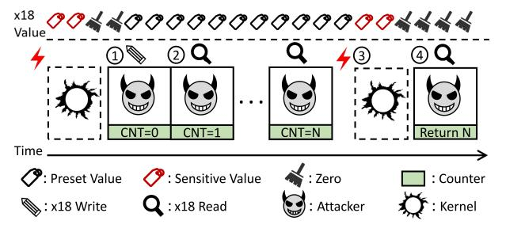

# <span id="page-3-1"></span>*C. Procedure Call Standard for the AArch64 Architecture*

The procedure call standard for the Arm architecture (AAPCS) is a key component of the Arm application binary interface (ABI) specification [\[53\]](#page-14-9). It establishes conventions for function calls and parameter passing on Arm platforms, covering register usage, stack management, and the handling of parameters and return values. After transitioning from x86 to its proprietary M-series processors in 2020, Apple employs a variant of AAPCS for the Arm 64-bit architecture, known as AAPCS64 [\[54\]](#page-14-10). In this standard, Apple provides 31 generalpurpose registers for developers, named from x0 to x30, which are implemented at hardware-level and can be broadly divided into two categories.

The first category is used for program calls. Specifically, registers x0–x8 are used to pass up to integer or pointer arguments and return value. Besides, x9–x15 are callersaved temporary registers for intermediate computations, while x19–x28 are callee-saved registers but used for local variables that persist across function calls. Finally, x29 register serves as the frame pointer to facilitate debugging and stack unwinding, and x30 register, known as the link register, holds return addresses during function calls.

Second, for a platform usage perspective, registers x16 and x17 operate as intra-procedure-call registers and are primarily used by the linker for dynamic linking and system calls. Besides, register x18 is reserved for platform-specific purposes, whose use is defined by the execution environment. For example, Apple uses x18 as a scratch register in context switches on hardware where cross-privilege Spectre mitigation [\[55\]](#page-14-11) is needed and Windows uses x18 as a thread-local storage (TLS) pointer [\[56\]](#page-14-12). On these platforms, leveraging x18 for general-purpose application is discouraged [\[57\]](#page-14-13), [\[54\]](#page-14-10), [\[56\]](#page-14-12). For instance, LLVM replaces the use of x18 with x15 to prevent potential crashes [\[58\]](#page-14-14).

### <span id="page-3-2"></span>*D. Double Map*

To protect Apple silicon from being affected by Meltdown attacks [\[59\]](#page-14-15), [\[2\]](#page-13-1), Apple introduced the Double Map feature in macOS 10.13.2 and iOS 11.2 (XNU kernel 4570.31.3) [\[60\]](#page-14-16). The key insight behind Double Map is to retain kernel translations while rendering them inaccessible during EL0 execution, rather than fully unmapping the kernel address space. This effectively avoids unnecessary TLB invalidation and thus reduces the runtime overhead of privilege transitions [\[59\]](#page-14-15).

<span id="page-3-0"></span>

Fig. 1: Address translation under the Double Map mitigation.

On Apple's Arm-based platforms, Double Map is implemented by leveraging the two Translation Table Base Registers (TTBRs) available on ARMv8-A processors together with the Translation Control Register (TCR). As illustrated in Figure [1,](#page-3-0) in XNU, TTBR0\_EL1 holds the base address of the translation tables associated with the current process address space, whereas TTBR1\_EL1 references the translation tables used to map the kernel address space shared across all processes. Both registers also carry the Address Space Identifier (ASID), which participates in TLB lookups. Updating the ASID changes the effective translation context without requiring full TLB invalidation, as previously cached entries become non-matching under the new ASID. During each user-to-kernel transition, TTBR0\_EL1 is required to switch the translation context (e.g., the ASID) to kernel, while TTBR1\_EL1 remains unchanged because the kernel address space is shared across all processes.

The TCR\_EL1 register defines the translation regime, including virtual address size, translation granularity, and table-walk behavior. In XNU's Double Map implementation, TCR\_EL1 is switched between two translation configurations. One configuration (TCR\_EL1\_BOOT) restores the full kernelvisible address mappings used during EL1 execution, while the other (TCR\_EL1\_USER) restricts the virtual address range accessible during EL0 execution. During privilege transitions, TCR\_EL1 must be updated before memory accesses to ensure that address translation is performed under the intended translation regime.

### III. TIDE

<span id="page-3-3"></span>Experimental setup. We evaluate TIDE on multiple machines as shown in Table [I,](#page-4-1) including physical machines and cloud instances with different M-series CPUs and macOS versions.

### *A. Threat Model*

In this paper we focus on Apple systems equipped with Mseries processors running macOS. Our primary threat model

TABLE I: System configurations.

<span id="page-4-1"></span>

| Machine               | CPU    | os                 | Cores   |
|-----------------------|--------|--------------------|---------|
| MacBook Pro 2021      | M1 Pro | macOS Ventura 13.6 | 2 E+8 P |
| Mac mini 2023         | M2     | macOS Ventura 13.7 | 4 E+4 P |
| MacBook Air 2023      | M3     | macOS Sonoma 14.6  | 4 E+4 P |
| MacBook Pro 2023      | M3 Max | macOS Sonoma 14.7  | 4E+10P  |
| Mac mini 2020 (Cloud) | M1     | macOS Sonoma 14.6  | 4 E+4 P |
| Mac mini 2024 (Cloud) | M4     | macOS Sequoia 15.2 | 6 E+4 P |

assumes a native adversary that can execute user-space code on the same macOS host as the victim without elevated privileges. This aligns with existing interrupt side channels [23], [19], [20], [22], [17], as well as previously demonstrated side channels on Apple silicon [5], [2], [61], [30]. It can be achieved under multiple real-world settings, including a multi-user workstation with untrusted user processes and post-compromise execution (e.g., a malicious application). Since binding execution to a specific core requires privileges on macOS, we make no assumption about the attacker core, which differs from prior attacks based on single-core interrupt detection [17], [20], [22].

Further, while the attacker has access to local system resources, we assume a timer-constrained scenario where the attacker has no access to any timing source (such as the kperf API or cntvct\_el0). This assumption is motivated by prior defenses targeting architectural timers [28], [29], [4], [27], [31], [32], [46] and aligns with existing timer-less side-channel attacks on Apple silicon [1], [30] (see Section II-B for details). Unless otherwise specified, the timer-constrained native model underlies most of our experiments and case studies, where TIDE serves as a detection technique.

Besides the timer-constrained native model, we consider a browser-based adversary in Section V-C, where the victim visits a malicious webpage. Importantly, this model does not rely on TIDE itself, since deploying TIDE requires native code execution. Instead, we access the impact of our reverse-engineering insights about Apple's interrupt delivery on existing browser-based attack [7]. In this attack, a millisecond-granularity timer provided by the browser is needed.

### <span id="page-4-0"></span>B. Overview

**Insight.** The key insight of TIDE is to exploit the footprints during context switches at the architectural level. Specifically, interrupts are hardware signals that transition the context of the received core from user space to kernel space to execute the corresponding kernel handler. Upon completion, the OS explicitly triggers another context switch to resume execution in user-space. During these transitions, the processor must correctly save and restore the running state of the interrupted process, especially the registers. Any footprint left by the context switches may allow a user process to detect the presence of an interrupt on its operating core.

After moving from x86 architecture to Apple silicon in 2020, Apple adopts the procedure call standard for the Arm architecture (AAPCS). Under this standard, 31 general registers (x0-x30) are accessible in user-space, and can be read

and written without requiring elevated privileges (see more details in Section II-C). As the first step of our study, we design an experiment to automatically identify whether/which architectural registers can be exploited.

Triggering reliable context switches. Since interrupts can only be triggered indirectly on Apple systems (e.g., by requesting a hardware resource), we identify two additional methods to deterministically trigger context switches: system calls (e.g., read(), fsync(), stat(), gettimeofday(), and mmap()) and exceptions (e.g., division-by-zero errors, segmentation faults, and debug traps). To avoid any possible optimization that bypasses context switches (e.g., commpage can reduce context switches caused by the C-based function gettimeofday [62]), we use svc instructions to test the 5 syscalls mentioned before. For each register, we assign it with a known value, invoke the system call, and then check whether the value remains unchanged after the call returns. By repeating this process for all accessible registers, we can identify the registers that are modified during context switches. **Observation**. We observe consistent results across all tested machines listed in Table I. In particular, four registers are consistently altered following a context switch triggered by an arbitrary system call: x0, x1, x16, and x18. Among them, x0 is used to store the return value and x1 serves an additional parameter-passing role, and x16 is preserved for internal linkage (i.e., the ID of system call in this test). All three registers function as a part of the system call mechanism. In contrast, x18, the platform register mandated by the AAPCS standard, is consistently cleared to zero after a context switch and independent of the execution results of our system calls. Root cause. To understand how x18 is cleared, we investigated the XNU kernel source [63]. We found that this behavior is enforced by the XNU kernel as a part of Apple's Double Map mitigation. Specifically, XNU introduced the use of x18 as a scratch register with Apple's Double Map feature [59] in version 4570.31.3 [60], released in December 2017. Subsequently, it further added the explicit clearing of x18 in version 4570.61.3 [64], released in March 2018. Our analysis reveals a dependency between Double Map and the x18 behavior. Specifically, prior to saving the interrupted user registers (including the original x18) in Lel0 irg vector 64 long, the exception entry path executes two macros (Listing 1), both of which reuse x18 as a scratch register and thus overwrite its original user value.

The first one is MAP\_KERNEL (Line 1-10), which restores a kernel-consistent translation regime by updating the both TTBRO\_EL1 and TCR\_EL1 registers (see Section II-D for details). Both steps require a general-purpose register (GPR) operand where updating TTBRO\_EL1 uses a read-modify-write sequence (mrs/orr/msr), and restoring TCR\_EL1 requires msr TCR\_EL1, Xt, where the source value must come from a GPR (i.e., no immediate operand is allowed).

The second one is BRANCH\_TO\_KVA\_VECTOR (Line 13-20), which resolves the appropriate exception handler in the kernel virtual address (KVA) space and transfers control to it. Under Double Map, kernel exception handlers

```
.macro MAP_KERNEL
2
        /* Switch to the kernel ASID for the task. */
3
                x18, TTBR0 EL1
       mrs
4
                x18, x18, #(1 << TTBR_ASID_SHIFT)
       orr
                TTBR0_EL1, x18
5
       msr
6
        /* Update the TCR to map the kernel using the
        kernel ASID. */
7
       MOV64
                x18, TCR_EL1_BOOT
                TCR_EL1, x18
8
       msr
9
       ish
                sy
10
    .endmacro
11
12
    .macro BRANCH_TO_KVA_VECTOR
        /* Find the kernelcache table for the exception
13
        vectors by accessing the per-CPU data. \star/
14
                x18, TPIDR_EL1
15
       ldr
                x18, [x18, ACT_CPUDATAP]
16
       ldr
                x18, [x18, CPU_EXC_VECTORS]
17
        /*Branch to the corresponding handler.*/
18
       ldr
                x18, [x18, #($1 << 3)]
19
       br
                x18
20
    .endmacro
21
22
   Lel0_
         _irq_vector_64:
23
       MAP_KERNEL
24
        BRANCH_TO_KVA_VECTOR Le10_irq_vector_64_long, 9
```

Listing 1: Use of x18 as a scratch register in the XNU kernel. The generic purpose registers are saved after branching to Lel0\_irq\_vector\_64\_long.

are no longer statically reachable and must be dynamically resolved through per-CPU metadata. Therefore, the macro first reads TPIDR\_EL1 to obtain the current thread pointer, then traverses the per-CPU data structure to locate the CPU\_EXC\_VECTORS table, and finally indexes the table to fetch the corresponding handler address before executing an indirect branch (br). Each of these steps reuses x18 as a temporary pointer register.

Although the kernel could theoretically save the GPRs before executing BRANCH\_TO\_KVA\_VECTOR, at least one GPR must still be used as a scratch register to establish a kernel-consistent translation regime via MAP\_KERNEL. XNU uses  $\times 18$  for this purpose, which causes the user's original  $\times 18$  value to be overwritten before it can be saved. To mitigate potential kernel information leakage, XNU subsequently introduced explicit clearing of  $\times 18$  before returning from kernel space to user space [64].

Compared to existing interrupt detection techniques. Although previous timer-based detection techniques [25], [65] are not applicable in our timer-constrained scenario, we still compare TIDE with them to demonstrate its high precision. As the processor is temporarily preempted by the kernel during interrupt handler routine, these two techniques exploit the discontinuity of time in user-space to detect interrupts. To make a comparison, we apply TIDE to verify whether all observed jumps in timestamps are indeed caused by interrupts. Further, to demonstrate that the counting-thread timers are not a reliable way to detect interrupts, we also apply the counting-thread timer to capture jumps in its counter under the timer constrained scenario.

To achieve this, we monitor the corresponding jumps in timestamps by reading <code>cntvct\_el0</code> register and select a

<span id="page-5-1"></span>

Fig. 2: Comparisons between TIDE and timer-based detection. Not all jumps in timestamps clears the x18 register (red dots), which means no kernel-userspace context switch occurs.

pre-determined threshold (i.e.,  $1\mu s$ ) for each machine for determining whether an jump is caused by an interrupt [25]. To verify whether a context switch occurs after each detected jump, we insert x18 read and write operations immediately before and after the timestamp check. We observe consistent results on all our tested machines in Table I.

Figure 2 shows the jumps in timestamps on our Macbook Air 2023 equipped with an M3 processor (whose cntvct el0 increments at a fixed frequency of 24 MHz) and cloud Mac mini equipped with an M4 processor (whose cntvct\_el0 increments at a higher frequency of 1 GHz). Both the blue and red dots in the figure represent jumps in timestamps, which the timer-based method classifies as interrupt-induced. However, based on the ground truth obtained from TIDE, we observe that not every timestamp jump on Apple CPUs is accompanied by a clear of the x18 register. Since this clearing is performed by the kernel during a context switch, the absence of a clear indicates that no kernel-userspace context switch occurred. This implies that such timestamp jumps are unlikely to be caused by interrupts. On our test machines, approximately 0.2%-0.5% of jumps in timestamps are at the same level of interrupted jumps, leading to false positives for timer-based detection techniques.

In addition, across all our machines, the counter increments produced by counting threads are consistently less reliable than those observed with TIDE. For instance, when TIDE detects 100,000 interrupts, only 45.0% of them are detected by counting threads with a threshold of 2,000 on the M3 Pro machine, compared to 62.9% on the M1 Pro machine and 80.5% on the M3 Air machine.

**Exploitation**. With the precise interrupt detection, we design two primitives. *First*, we build a TIDE-based interrupt timing primitive, which incorporates a counter program in the same thread. To use this counter to represent the interrupt timing duration, we assign the  $\times 18$  register with a non-zero value and then make the counter increment until the  $\times 18$  is cleared. *Second*, we apply TIDE to distinguish the interrupted measurements, thereby filtering out the interrupt noise to improve their robustness to system noise. For instance, since interrupts are a common source of noise in counting-thread timers, TIDE can maintain its accuracy even in an interrupt-heavy environment.

<span id="page-6-0"></span>

Fig. 3: TIDE-based interrupt timing leverages a counter to represent the time interval between two consecutive interrupts.

### *C. TIDE-based Interrupt Timing*

First, we design a primitive that can measure the interval between two consecutive interrupts, i.e., interrupt timing. As this interrupt timing information can reflect when the victim requests a resource, it is considered as sensitive information and has served as a foundation in a large number of interrupt side channel attacks [\[7\]](#page-13-6), [\[22\]](#page-13-21), [\[20\]](#page-13-19) fingerprinting.

To represent this time interval, prior attacks commonly relied on an external timer to record precise timestamps upon detecting an interrupt. However, architectural timers are not available in our threat model and counting-thread timers are badly noised under interrupt-rich scenarios. To overcome this challenge, we define a counter to denote the time interval between two consecutive interrupts.

Figure [3](#page-6-0) illustrates how this counter works, which consists of four main steps. *First*, we assign x18 with a non-zero value (e.g., 0x1). *Second*, we define a loop function, inside which we check x18 and increment the counter after each check. *Third*, during this period of time, if an interrupt occurs, the context switches from user-space to kernel-space. The OS kernel temporally occupies this core and uses x18 for its own aim (e.g., x18 has been used for mitigation against cross-privilege Spectre leakages [\[55\]](#page-14-11)). Before the processor returns from an interrupt handler to user-space, macOS explicitly clears x18 to 0. *Lastly*, upon detecting the x18's value change, we break the loop and record the counter. This counter value denotes the number of executed loops and reflects the elapsed time in user-space before the detected interrupt occurs.

