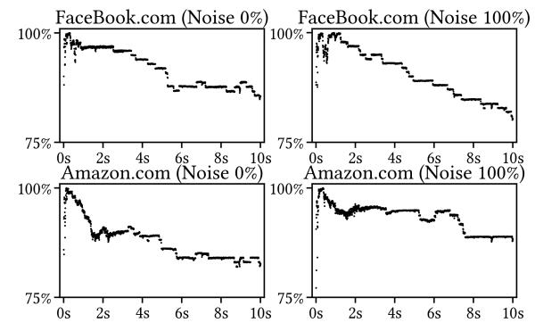

# *B. Factors of Interrupt Delivery*

To address Q2, we investigate whether Apple's interrupt controller (AIC) forwards all SPIs to active cores while ignoring idle ones. This design could explain why TIDE detects interrupts on an arbitrary core and would also align

3AIC has prevented Windows Arm64 from running natively on Apple silicon [\[71\]](#page-14-27), [\[72\]](#page-14-28).

4https://github.com/junjie1475/MacOS CoreBinder

Fig. 5: The efficiencies of network interrupts when we bind sender and receiver to specific cores.

with Apple Silicon's emphasis on power efficiency. On Linuxbased systems running on Arm or x86, SPIs are consistently routed to the core specified by interrupt affinity, regardless of whether that core is idle. This design enables Mwait- [\[22\]](#page-13-21) and IdleLeak-style [\[20\]](#page-13-19) attacks, which exploit interrupt-induced wakeups from idle states.

Experimental setup. We consider three types of user processes on Mac mini 2023. The first is implemented identically to the receiver process, which measures the number of received interrupts on its core. The second is a busy-looping program, and the third is a process that actively sleeps, causing its core to enter the idle state. First, we reuse the sender process in Section [IV-A](#page-7-4) and use CoreBinder [\[73\]](#page-14-29) to pin it to core 0. This process loops to send network packets of 9 kB at a fixed frequency of 100 kHz via udp protocol. In the meanwhile, we run varying numbers of receiver processes (from 1 to 7). Next, we change some of the receiver processes to our busy-looping programs or idle programs.

Experimental results. Figure [6](#page-8-2) shows the number of detected interrupts in different settings. We find that the number of interrupts detected on each receiver core remains similar across all settings. In addition, when we replace some receivers with busy-looping processes, the number of interrupts received by the remaining receivers stays the same. However, when we replace them with idle processes, the number of detected interrupts drops in line with the number of active receivers. This indicates that AIC delivers SPIs only to active cores and ignores idle cores. This design reduces power consumption and fundamentally blocks Mwait- and IdleLeak-style side-channel attacks, as they rely on the interrupt-induced wakeups from idle states to detect cross-core interrupts. In the past, such attacks were considered infeasible only due to the lack of available instructions on Apple silicon [\[22\]](#page-13-21). Moreover, as all active cores will receive the similar number of interrupts, using a counting-thread timer to detect interrupts on Apple silicon becomes ineffective (Section [III-B\)](#page-4-0). Last, our results show

Fig. 6: The efficiencies under different settings are shown in separate columns, where a process running on core 0 loops to trigger network interrupts. The absence of the number for a core means that core is idle. The number of active cores can decide the efficiencies for a given SPI requesting frequency.

consistent behavior across both P-cores and E-cores, which suggests that Apple treats the two core types identically during the interrupt-delivery decision phase.

Observation 2: Apple silicon with macOS uniformly delivers SPIs to all active cores and ignores the idle cores.

### V. CASE STUDIES

### *A. Timer-free Website and Video Fingerprinting*

As demonstrated in Section [IV,](#page-6-3) network cards can generate interrupts that are delivered to all active cores uniformly. When accessing a website or video streams, distinctive network packets will be sent and received, which generates distinctive network interrupts. Besides, the time between packets depends on the loaded content and remote servers. Thus, an attacker can use TIDE to detect a certain number of interrupts to observe the distinctive interrupt patterns in network packets. The exact website accessed or video stream watched by the user can then be inferred based on a machine learning (ML) model, i.e., MLassisted side channel attack [\[7\]](#page-13-6), [\[74\]](#page-14-30).

Attack design. Aligned with existing work [\[75\]](#page-14-31), [\[7\]](#page-13-6), [\[76\]](#page-14-32), [\[77\]](#page-14-33), [\[78\]](#page-14-34), [\[79\]](#page-14-35), [\[20\]](#page-13-19), [\[17\]](#page-13-16), [\[19\]](#page-13-18), our attack consists of two phases: an offline preparation phase and an online attack phase. In the offline phase, we use TIDE to collect enough interrupt traces incurred by website visiting or video playing for model training. In the online phase, we use the well-trained model to predict the website or video that has been visited or watched. Experimental setup. We evaluate the website fingerprinting attack in both closed-world and open-world scenarios. For the *closed-world* scenario, we assume the attacker knows the complete set of the websites that the victim will visit. The attacker aims to distinguish the victim's accesses of 100 different websites. We select the top 100 websites according to Alexa [\[80\]](#page-14-36) and collect 100 traces for each of the explicitly classified websites. For the open-world scenario, we add an other-class for websites not part of the top 100 from the Alexa top 1 million list, and collect the traces of 2000 additional websites (one per website). For the video fingerprinting attack,

Fig. 7: Example TIDE traces of different websites. Darker regions indicate shorter intervals between interrupts.

TABLE III: Classification accuracy across 10-fold cross validation for our website and video fingerprinting (FP) attack.

| Attack Scenario                                              | Default                 |                         | Fixed Frequency         |                         |
|--------------------------------------------------------------|-------------------------|-------------------------|-------------------------|-------------------------|
|                                                              | Top-1 Acc               | Top-5 Acc               | Top-1 Acc               | Top-5 Acc               |
| Closed-world Website FP Open-world Website FP Video FP | 93.8% 91.5% 78.1% | 98.7% 98.5% 97.9% | 93.1% 91.1% 87.2% | 98.5% 98.3% 98.3% |

we use a closed-world setting to distinguish between the top 20 trending videos in the US at the time of writing for YouTube, and collect 200 traces for each video. By default, we collect the interrupt side channel data on the Macbook Air M3, which is equipped with 4 E-cores and 4 P-cores.

Since our research focus is not in the ML algorithm, we use the same routine to process data from website finger-printing and video fingerprinting. Specifically, we partition the collected traces into 10 folds, using one fold as the test set and the remaining traces split into a training set (81%) and a validation set (9%). These collected TIDE traces are directly fed into a Long Short-Term Memory (LSTM) model with 32 units, using the open-source implementation of Cook et al. [7], without any preprocessing.

**Experimental results.** Figure 7 shows the example TIDE traces of 3 different websites. We can observe sufficiently distinctive patterns for each webpage. Table III presents the results of our attack, where the top-n accuracy refers to the accuracy of correctly identifying a set of n possible websites, one of which is the actual website being accessed. For the closed-world website fingerprinting, the base top-1 accuracy is 1% for random guess between 100 possible websites, while our attack achieves a high top-1 accuracy of 93.8%. Besides, we achieve top-1 accuracy of 91.5% for the open-world website fingerprinting and 78.1% for the video fingerprinting. Attacks without frequency throttling. Considering that TIDE-based interrupt timing incorporates a counter which is likely impacted by CPU frequency, we then perform an ablation study to remove the impact of frequency changes. However, macOS does not provide the ability to fix CPU frequency from user-space. Thus, we replace the counter in TIDE with an architectural timer, i.e., cntvct\_el0, which is updated at a fixed frequency of 24 MHz. With this timer, we re-perform all aforementioned fingerprinting attacks. As shown in Table III, we obtain a top-1 accuracy of 93.1% in the closed-world website fingerprinting and 91.1% in the openworld website fingerprinting. For the video fingerprinting, we achieve a top-1 accuracy of 87.2% and top-5 accuracy of 98.3%. It can be concluded that our attack remains highly effective even without any signal due to frequency scaling.

Attacks across various hardware. To investigate whether the number of overall processor cores impacts its accuracy, we further run the same closed-world website fingerprinting attack using 10 websites when only one attack thread is running. Under this setting, we achieve a top-1 accuracy of 96.9% on the MacBook Air M3 (4 E-cores and 4 P-cores), 93.3% on our MacBook Pro 2021 (2 E-cores and 8 P-cores), and 80.1% on our MacBook Pro 2023 M3 Max (4 E-cores and 10 P-cores). The results show that our attack works well across different hardwares, with acceptable accuracy.

**Attacks with two threads**. We further investigate whether combining two TIDE threads can improve the accuracy of the attack. Specifically, we launch two TIDE-based threads to independently collect interrupt traces. Using the same classifier, we perform website fingerprinting across 10 websites. With combined traces from the two threads, we achieve an accuracy of 95.7% on the MacBook Air 2023, 69.3% on the MacBook Pro 2021, and 74.2% on the MacBook Pro 2023. We found that the additional attack thread provides limited or even negative benefit on certain platforms. This is likely due to Apple's interrupt distribution strategy, which tends to deliver interrupts uniformly across cores. In addition, increasing the number of active cores may reduce the number of received interrupts per core (as discussed in Section IV-B), ultimately degrading the quality of the captured signal. To validate this hypothesis, we re-evaluate fingerprinting using only one TIDEbased thread when an additional computing-intensive thread runs in background during the training and testing phase. The resulting accuracies are 94.6% on the MacBook Air 2023, 69.5% on the MacBook Pro 2021, and 72.6% on the MacBook Pro 2023, similar to the results using two attack threads.

Attacks with video playback. We evaluate the sensitivity of our attack to realistic background noise by continuously playing a 60 s video during website fingerprinting. Video playback introduces asynchronous interrupts and varies CPU core utilization. Our results show that the website fingerprinting still keeps an accuracy of 60.6%, which demonstrates the robustness of our TIDE-based interrupt side channels.

Comparison with timer-based technique [7]. While our attack is the first interrupt-based website and video finger-printing on macOS for Apple silicon without relying on architectural timers, its performance is also comparable to or better than existing timer-based interrupt side-channels [22], [20], [19], [17], [7]. We followed Cook et al. [7] to implement their loop counting attack on our MacBook 2023 Air machine, which achieves an accuracy of 94.8% for the website fingerprinting attack (while TIDE achieves 93.8%), and 74.5% for the video fingerprinting attack (while TIDE achieves 78.1%). Thus, our results are in line with timer-based attacks, with its additional advantage of applicability in a timer-constrained scenario. To prove this, we further deployed the random timer defense proposed by Cook et al. [7], and

found that our attack remains effective because it does not rely on the noisy architectural timers. In contrast, the top-1 accuracy of the timer-based attack drops to approximately 1% for website fingerprinting and 5% for video fingerprinting, which is close to random guessing.

### *B. Denoising Counting-Thread Timers*

Interrupts are a common source of noise for both sidechannel attacks [\[22\]](#page-13-21) and performance benchmarks. As discussed in Section [IV,](#page-6-3) in macOS for Apple silicon, the interrupt noise cannot be avoided directly because it is not possible to set device interrupt affinity on macOS without the use of custom kernel modules. In this subsection, we evaluate TIDEbased de-noising by measuring its impact on counting-thread based timers. By distinguishing and filtering out interrupted measurements, TIDE substantially reduces this distortion.

Counting-thread timers rely on uninterrupted execution to maintain timing accuracy [\[22\]](#page-13-21), [\[30\]](#page-13-29), [\[17\]](#page-13-16), as the internal counter stops incrementing when its operating core receives an interrupt. Here, we introduce a second shared counter, referred to as the TIDE-based counter, that tracks the number of interrupts received. Each time before incrementing the timing counter, the counting thread checks the x18 register that is preset to a non-zero value. If it has been cleared (indicating an interrupt), the thread increments the TIDE-based counter and restores x18 to a non-zero value. When using this enhanced counting thread to measure code execution time, both counters are read before and after the target code execution.

Overhead. We compare the original and enhanced counting threads by measuring their counter increments per second (i.e., granularity). Across 100 runs on the M3 MacBook Air, we observe only a 0.06% reduction in timing granularity under an idle environment. This is because register reads are much faster than the memory writes already present in the original loop. In addition, the extra register writes and memory writes occur only when an interrupt is detected, which happens infrequently compared to the number of loop iterations.

Enhanced SysBumps attack. To show demonstrate how TIDE helps de-noise counting-thread timers, we use the Sys-Bumps attack [\[2\]](#page-13-1) as a representative example. This attack breaks kernel address space layout randomization (KASLR) on macOS versions 13.1 through 15.1. Although the user page table and kernel page table are isolated by Apple's Double Map mitigation, the data TLB (dTLB) is still shared across privilege levels. When speculative execution is triggered on a mapped physical address, the resulting architectural effects evict a primed entry in the shared dTLB even though the speculative results themselves are isolated. To extract the micro-architectural effects at architectural level, Sysbumps applies a Prime+Probe technique and uses a counting-thread timer to measure the probe time. Similar to other KASLR derandomization attacks, Sysbumps iterates over each candidate address (32,768 slots for macOS) and distinguishes whether each address has a valid physical mapping. Our key idea is to use TIDE as a signal to identify and discard time windows that are heavily perturbed by interrupts.

We deploy SysBumps using its open-source code without any optimization. When introducing dynamic interrupt noise, we use Chrome browser v130.0 to play the videos sequentially from the YouTube short video category in the foreground. Each transition to a new video triggers a burst of interrupts and memory activity. We observe that SysBumps has included several techniques intended to reduce interrupt-induced noise. For instance, it selects a valid range of memory accesses and repeats the Prime+Spectre+Probe if a measured access time is unrealistically small or large. Nevertheless, they are insufficient in an environment with heavy interrupts, because interrupts can occur during both the prime phase and the speculative execution phase.

Experimental results. Under an idle setting, our original SysBumps attack achieves 92% success rate on our M3 MacBook Air under across 100 runs, which is comparable with the 95.7%-98.8% reported in SysBumps [\[2\]](#page-13-1). However, the success rate of the original SysBumps decreases to only 54% when our video noise is introduced. We then apply the TIDEenhanced timer to distinguish and re-execute the Prime+Probe measurements that experience one or more interrupts, results of which show that it improves the success rate to 81%. The remaining gap to 100% is due to dTLB-level noise introduced by video playback and other system noise. Such interference can occur without triggering interrupts, which prevents it from being fully eliminated by our interrupt-based filtering. Nonetheless, the results confirm that the majority of noise stems from interrupts and can be effectively mitigated through TIDE's denoising capability.

### *C. Enhancing Loop-Counting Attack*

After demonstrating the benefits of TIDE itself, we now turn to our reverse-engineering results. We aim to show that these insights provide a deeper understanding of interrupt-based side channels. We consider the loop-counting attack [\[7\]](#page-13-6), which increments a counter in a tight loop and detects interrupts by sampling the number of iterations completed within fixed time intervals. Because it only requires a coarse-grained timer with millisecond resolution, this attack is applicable in browser environments and has therefore attracted significant attention in recent years [\[39\]](#page-13-38), [\[81\]](#page-14-37), [\[74\]](#page-14-30), [\[82\]](#page-14-38), [\[83\]](#page-14-39).

On x86 architectures, loop-counting attack has been well studied under two thread-placement settings [\[7\]](#page-13-6), i.e., when attacker core and victim core are separate or co-located. However, as discussed in Section [IV,](#page-6-3) Apple's interrupt delivery is decided by the number of active cores. This design renders interrupt side channels on macOS for Apple silicon more complex than on x86, and raises concerns on whether the loopcounting attack can withstand interference from additional processes that alter the number of active cores.

Loop-counting attack under noise. To model noise from a varying number of active cores, we introduce a simple compute-intensive thread implemented as an infinite loop that does not generate interrupts. We evaluate its impact in both the training and testing phases. During training, an attacker unaware of Apple's interrupt delivery may inadvertently include

Fig. 8: Normalized trace values averaged over 100 runs on our M3 Air. A compute-intensive thread that produces no interrupts can significantly distort the trace profiles.

TABLE IV: Classification accuracy under different settings.

| Train Test | Noise (0%) | Noise (20%) | Noise (100%) | Enhanced |
|---------------|------------|-------------|--------------|----------|
| Noise (0%)    | 94.8%      | 89.4%       | 39.3%        | 93.6%    |
| Noise (100%)  | 40.7%      | 66.4%       | 92.7%        | 92.8%    |

such noise when collecting data. To capture this possibility, we vary the proportion of perturbed samples in the training set, corresponding to 0%, 20%, and 100% poisoned levels. During testing, where the attacker requires only a single trace for an online attack, we examine two scenarios: a noise-free trace and a trace perturbed by a compute-intensive thread.

For data collection and processing, we use 100 websites on an M3 MacBook Air. For each website, we collect 100 traces, with each trace lasts 10 seconds. The classifier design and the dataset split are identical to that described in Section [V-A.](#page-8-3) The noise is introduced by injecting perturbed samples into either the training or testing set, depending on the scenario. When deriving the validation set from the training set, noise present in the training data may influence the validation subset.

Experimental results. Table [IV](#page-11-0) summarizes the classification accuracy under the aforementioned settings. Only training under the consistent thread setting yields a high accuracy of over 90%. While the strong fitting capacity of the ML model limits the impact of noise during training, accuracy degrades sharply when noise is introduced at inference phase, dropping to about 40%. This indicates that the baseline attack is not robust to the noise caused by the varying active cores. Figure [8](#page-11-1) further compares traces collected from different websites under noise-free and noisy conditions. Each plot reports the average of 100 runs for a given website, with values normalized by the maximum iteration count observed by the attacker. The results clearly demonstrate that introducing an additional thread substantially distorts the trace profiles.

Enhanced loop-counting attack. With our understanding of Apple's interrupt-delivery behavior that the number of active cores is the primary factor influencing delivery patterns, attackers can augment the training dataset by incorporating the number of active cores into the labeling process. Each class becomes a pair consisting of a website and the corresponding number of active cores. This modification effectively mitigate the noise from additional running threads by enlarging both the dataset and the label space. We retain the same classifier architecture and evaluation workflow, adjusting only the final layer to accommodate the enlarged set of output classes. Under this configuration, the classifier jointly predicts the number of active cores and the visited website. Our results show that the classifier achieves accuracies of 92.8% and 93.6% on the M3 Air with and without background noise, respectively.

## *D. Cross-core Covert Channel*

Lastly, we apply TIDE to build a cross-core covert channel [\[20\]](#page-13-19), [\[19\]](#page-13-18), [\[17\]](#page-13-16), to evaluate both the signal-to-noise ratio (SNR) and the bandwidth of our side channel. To evaluate the SNR results, we use a millisecond timer for synchronization, and record the number of detected interrupts during each fixed interval. To evaluate the end-to-end bandwidth, we do not rely on any timer without computing the interrupt arrival rate. Instead, the sender encodes each bit by issuing a fixed number of SPI requests (thus a known number of interrupts detected on the receiver side) and varying the delay between them using deterministic busy-wait loops. These delays differ for transmitting a bit '0' or '1'. Each SPI request is triggered by sending a 9 KB UDP packet on our Mac mini 2023 in Table [I.](#page-4-1) Experimental results. For the SNR evaluation, we vary the number of active cores while sampling the signal at 1 ms intervals. We encode bit values by either issuing periodic network interrupts (bit '1') or remaining busy wait (bit '0'). Under 0, 1, 2, 3 additional active cores, the measured SNR values are 1.35, 1.63, 0.98, and 0.93 respectively. These results indicate that moderate core-level activity does not substantially weaken the side-channel signal. To further demonstrate this, we run a compute-intensive process in the background when evaluating our covert channel. For the covert channel, our sender uses a busy-wait loop with 100 iterations to encode bit '0' and 10,000 iterations to encode bit '1', introducing distinguishable timing intervals of different bits for the receiver. Additionally, the sender fixes the number of SPI requests, issuing 3,000 network-packet requests for bit '0' and 1,000 for bit '1', to ensure that the total number of interrupts detected from the receiver per bit remains approximately fixed (e.g., 320 in our experiments). For one run of the covert channel, the sender transmits 1 kB data from /dev/urandom. Across 10 runs, we achieved an averaged bandwidth of 111.65 bps with an average error rate of 4.45%. The main reason for the error bits is our coarse-grained alignment of the counters.

