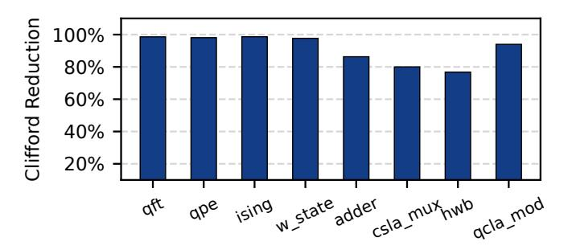

# A. Figure of Merit

The primary metric used to evaluate TACO is the reduction in Clifford gate counts. We specifically measure the percentage decrease in CNOT, Hadamard (H), and Phase (S) gates. Additionally, we estimate potential execution time savings by calculating QEC cycle reductions based on the logical gate latencies detailed in Section II-B.

#### B. QEC Cycle Calculation

We evaluate the temporal overhead of FTQC circuits using two complementary methodologies to capture both theoretical lower bounds and practical architectural constraints.

**Architecture-Independent Analysis.** We first calculate the total QEC cycles as the critical path length, utilizing the cycles-per-gate values from Section II-B. This metric represents the theoretical minimum cycle count based on the longest dependency chain, independent of hardware resource limitations or routing overhead.

Cycle-Accurate Simulation and Routing. To capture realistic architectural constraints, we use a cycle-accurate simulator that processes the circuit layer by layer. While local operations are applied directly, non-local gates (CNOT) and state-injections (T, S) are routed to available compute blocks. By default, our simulator employs **greedy routing**, which allocates resources to ready gates on a first-come, first-served basis. As a specialized case study demonstrating compatibility with advanced resource management, we integrate **LSQECC routing** [76]. This dual-routing approach validates TACO's performance across varying architectural sophistication.

#### C. Benchmark Circuits

We evaluate TACO using a diverse set of benchmarks categorized by their structural characteristics. First, we select key algorithms from QASMBench [50], including the Quantum Fourier Transform (qft), Quantum Phase Estimation (qpe), ising model simulation, and w\_state preparation.

Second, we include four Toffoli-heavy FTQC algorithms from Op-T-mize [48]: adder, csla\_mux, hwb, and qcla\_mod. These represent essential arithmetic subroutines for high-level algorithms such as Shor's algorithm [67]. Table I summarizes the qubit and gate counts for these benchmarks.

TABLE I
BENCHMARK CIRCUIT CHARACTERISTICS.

|                     | qft   | ising | qpe   | w_state | adder | csla_mux | hwb   | qcla_mod |
|---------------------|-------|-------|-------|---------|-------|----------|-------|----------|
| Qubits              | 18    | 26    | 9     | 76      | 24    | 15       | 16    | 26       |
| Gates               | 783   | 307   | 36    | 378     | 330   | 70       | 31764 | 294      |
| Clifford+T          | 95968 | 25520 | 7587  | 38223   | 1128  | 210      | 91642 | 1120     |
| Gates               |       |       |       |         |       |          |       |          |
| Increase $(\times)$ | 122.6 | 83.1  | 210.8 | 101.1   | 3.4   | 3.0      | 2.9   | 3.8      |

Scalability and Compatibility. To evaluate scalability, we utilize large-scale qft circuits ranging from 100 to 300 qubits. Furthermore, to demonstrate that TACO is complementary to existing FTQC synthesis frameworks, we conduct a case study on circuits synthesized by Synthetiq [59] and TRASYN [39]. We apply TACO as a post-processing step to these outputs to further optimize final gate counts.

Expansion to Clifford+T Basis. Table I reports both the original gate counts (Gates) in native representation and compiled counts in the Clifford+T basis. Notably, rotation-heavy circuits (e.g., qft, qpe) exhibit an expansion of over  $83\times$ , while Toffoli-dominated circuits experience a smaller growth of  $3-4\times$ . This disparity arises from the decomposition of high-level operations: a single rotation gate is synthesized into hundreds of Clifford+T gates, of which roughly 60% are Clifford and 40% are T gates. In contrast, a Toffoli gate can be decomposed into 8 Clifford gates and 7 T gates. Consequently, in rotation-dominated circuits, over 99% of the Clifford+T gates originate from rotation synthesis, whereas for Toffoliheavy circuits,  $\sim 70\%$  result from Toffoli decomposition.

#### D. Clifford+T Synthesis

We compare TACO against the native Clifford+T transpilation functionality in Qiskit 2.2.3 (Optimization Level 3). While Qiskit employs the Solovay-Kitaev algorithm [24] for

approximate unitary synthesis, TACO leverages the GridSynth algorithm [64] for optimal T-count synthesis. For all cases, we set a default synthesis error tolerance of  $\epsilon = 10^{-10}$ .

#### VI. EVALUATION RESULTS

#### A. Clifford Gate Reduction

Fig. 17. Clifford gate reduction percentage across benchmark circuits. TACO achieves an average 91.2% Clifford gate reduction across all benchmarks.

Figure 17 presents Clifford gate reduction results for all benchmark circuits. TACO achieves an average Clifford gate reduction of 91.2% and up to 98.6%, highlighting the strength of our optimization. Notably, QFT and QPE circuits show reductions of 98.6% and 98.1%, respectively. The smallest reduction is observed in the hwb circuit at 77%, due to its high initial CNOT gate content (over 65%). Since TACO preserves CNOT gates to maintain gate parallelism, the potential for Clifford reduction in hwb is inherently limited. Nevertheless, as shown in Section VI-B, retaining these CNOT gates ultimately improves overall execution runtime.

#### B. Speedup of TACO over PBC

Fig. 18. TACO achieves  $1.14\times$  to  $21.9\times$  speedup across benchmark circuits over PBC, with a geometric mean speedup of  $4.4\times$ .

With enhanced gate parallelism, TACO achieves significant speedup over PBC across the benchmarks as shown in Figure 18. On average, TACO achieves 4.4× speedup over the baseline approach. The smallest speedup is observed for w\_state at 1.14×, which can be attributed to the circuit's limited CNOT gate density of only 1%. As discussed in Section III-B, the primary source of limited parallelism stems from commuting CNOT gates through the circuit. Since w\_state contains relatively few CNOT gates, its circuit depth remains comparable between PBC and TACO, resulting in similar QEC runtime with only modest improvement. Interestingly, the hwb circuit, which has a high CNOT ratio and

shows the worst Clifford gate reduction results, still achieves a  $3.52\times$  speedup, demonstrating that runtime performance can be significantly improved even when gate-reduction opportunities are limited. For all remaining benchmark circuits, TACO achieves at least  $1.54\times$  speedup, with a maximum of  $21.9\times$  for circuits with higher CNOT gate density and greater opportunities for parallel execution.

#### C. TACO versus PBC: Overall FTQC Volume Reduction

In this section, we perform a comprehensive FTQC resource estimation comparison between PBC and TACO using the 18-qubit QFT circuit. Both approaches produce optimized circuits with 40,777 T gates. While PBC eliminates all Clifford gates, TACO retains 1,080 Clifford gates, resulting in total gate counts of 40,777 and 41,857 gates, respectively. Despite this slightly higher gate count, the key advantage of TACO lies in execution parallelism: it achieves a circuit depth of 6,598 compared to PBC's 39,055, making TACO 5.9× shallower and dramatically reducing the total execution cycles required.

1) Resource Estimation Methodology: We evaluate resource requirements using established FTQC estimation methods [32], [34], [51]. We assume a physical error rate of  $10^{-3}$  and compare two PBC architectures: a compact, area-optimized design and a fast design. We select distillation protocols targeting T-gate error below 1%, with code distance chosen to maintain logical error below 1%. These parameters are standard in FTQC resource estimations [32], [51].

(b) Fast FTQC Architecture.

Fig. 19. PBC architectures for comparison.

2) PBC Architecture: We compare TACO against PBC using two FTQC architectures from prior work [51]. In PBC, multi-qubit  $\frac{\pi}{4}$  rotations are executed via lattice surgery between logical qubits and magic state ancillae. Each  $\frac{\pi}{4}$  rotation acts on logical edges set by the Pauli string. For example, a ZZZY Pauli string requires lattice surgery on the Z edges of qubits 0-2 and both X and Z edges of qubit 3.

Figure 19 shows the two baseline architectures. The 'Compact design' uses 1.5n+3 qubit tiles but exposes only one edge per qubit to the ancilla region. When the required edges are not exposed, qubits must be rotated before surgery can proceed. Yedge operations are particularly costly, requiring simultaneous exposure of both X and Z edges. This necessitates three additional ancilla qubits and up to 9 cycles per multi-qubit  $\frac{\pi}{4}$  rotation. The 'Fast architecture' exposes all edges of all qubits, enabling one multi-qubit  $\frac{\pi}{4}$  rotation per cycle at the cost of significantly more tiles  $(2n + \sqrt{8n} + 1)$ .

 $\label{thm:table II} \textbf{Resource comparison for 20-qubit QFT circuit}$ 

| Metric               | PBC Compact         | PBC Fast            | TACO                |  |
|----------------------|---------------------|---------------------|---------------------|--|
| Magic state blocks   | 1                   | 11                  | 33                  |  |
| Magic state tiles    | 11                  | 121                 | 363                 |  |
| Data tiles           | 30                  | 49                  | 41                  |  |
| Total tiles          | 41                  | 170                 | 404                 |  |
| QEC cycles           | 28,783,535          | 2,382,355           | 760,901             |  |
| Code distance        | 21                  | 19                  | 19                  |  |
| Physical qubits/tile | 882                 | 722                 | 722                 |  |
| Volume (data)        | $7.6 \cdot 10^{11}$ | $8.4 \cdot 10^{10}$ | $2.3 \cdot 10^{10}$ |  |
| Volume (MSD)         | $2.8 \cdot 10^{11}$ | $2.1 \cdot 10^{11}$ | $2.0 \cdot 10^{11}$ |  |
| Total volume         | $1.0 \cdot 10^{12}$ | $2.9 \cdot 10^{11}$ | $2.2 \cdot 10^{11}$ |  |
| Reduction with TACO  | -79%                | -24%                | -                   |  |
| QEC cycles w. MSC    | 28,783,535          | 2,382,355           | 595,604             |  |
| Volume (MSC)         | $2.8 \cdot 10^{10}$ | $2.1 \cdot 10^{10}$ | $2.1 \cdot 10^{10}$ |  |
| Total volume w. MSC  | $7.9 \cdot 10^{11}$ | $1.1 \cdot 10^{11}$ | $3.8 \cdot 10^{10}$ |  |
| Reduction with TACO  | -95%                | -63%                | -                   |  |

3) Distillation Protocol and Throughput: With  $4 \times 10^4$  T gates, each magic state requires an error rate below  $0.01/(4 \times 10^4) = 2.5 \times 10^{-7}$ . We employ the standard 15-to-1 distillation protocol, which suppresses errors by  $35p^3$  using 11 logical qubit tiles and produces one magic state every 11 cycles [51]. At a physical error rate of  $10^{-3}$ , this yields magic states with error rates of  $35 \times (10^{-3})^3 = 3.5 \times 10^{-8}$ .

The required distillation blocks depend on each architecture's magic state consumption rate. PBC Compact consumes one magic state every nine cycles, requiring only one distillation block, totaling 28,783,535 QEC cycles. PBC Fast consumes one magic state per cycle, requiring 11 distillation blocks to meet demand and totaling 2,382,355 cycles. With magic state distillation blocks, the optimal number of blocks is found to be 3, each containing 11 distillation units. Using the cycle simulator (discussed in Section V-B), TACO completes execution in 760,901 cycles. This results in total logical qubit tile counts of: PBC Compact (30 data + 11 distillation = 41), PBC Fast (49 data + 121 distillation = 170), and TACO (29 data + 12 compute + 363 distillation = 404).

- 4) Code Distance: The logical error rate per logical qubit per code cycle can be approximated as  $p_L=0.1(100p)^{(d+1)/2}$  [29], where p is the physical error rate and d is the code distance. To maintain overall logical error below 1%, the code distance must satisfy: total\_tiles × total\_cycles ×  $d \times p_L < 0.01$ . Given the tile and cycle counts, PBC Compact requires a minimum code distance of 21, while PBC Fast and TACO require only 19 due to shorter execution time. The physical qubits per logical qubit is calculated as  $2*d^2$ .
- 5) Resource Comparison: Table II summarizes the complete resource breakdown across all three architectures. The results demonstrate that TACO significantly reduces qubit-cycle volume and achieves 79% and 24% reductions over PBC Compact and Fast, respectively.

Moreover, when using more efficient magic state cultivation (MSC), TACO's optimal architecture containing 4 compute & distillation blocks reduces QEC cycles to 595,604. It requires the same distance-19 code, with the volume for magic states reduced by an order of magnitude [34] compared to magic-state distillation. The result is TACO reduces the qubit-cycle

volume by more than **95**% and **63**% compared to PBC Compact and PBC Fast, respectively.

It's worth noting that, although TACO uses more logical qubit tiles, its overall overhead is significantly lower than that of PBC-based approaches. More importantly, between the two PBC-based approaches, the fast design is more efficient than the compact design. PBC Compact's data volume overhead is  $2.7 \times$  higher than magic state volume, while PBC Fast has comparable overhead. By adopting TACO, the magic-state overhead remains nearly constant while the data volume is significantly reduced, leading to an overall reduction. In this context, further reducing T gate overhead in PBC-based architectures has diminishing returns, whereas in TACO, such optimizations can be more impactful. Thus, TACO improves the effectiveness of existing T gate optimizations.

6) Sensitivity to Magic-State Throughput: We further examine the same case study under different magic-state throughputs. In the default TACO configuration, the system provisions enough factories to supply 4 magic states per round, resulting in 64.5k physical qubits, 595k QEC cycles, and a  $2.7 \times$ reduction in FTQC execution overhead measured as qubitcycle volume relative to PBC Fast, which uses 44k physical qubits. Reducing the throughput to 3 magic states per round lowers the physical-qubit count to 47.6k, which is only slightly above PBC Fast, while increasing runtime to 760k QEC cycles. Reducing further to 2 magic states per round lowers the physical-qubit count to 30.8k, which is below PBC Fast, but increases runtime to 1.14M QEC cycles. Despite this areatime tradeoff, TACO still achieves  $2.9\times$  and  $2.99\times$  lower qubit-cycle volume than PBC Fast, respectively, as shown in Table III. This shows that the benefit of TACO is preserved even under tighter qubit budgets.

TABLE III
TACO UNDER REDUCED MAGIC-STATE THROUGHPUT.

| TACO config.           | Phys. qubits | QEC cycles | Vol. red. vs. PBC Fast |
|------------------------|--------------|------------|---------------------------|
| 4 magic states / round | 64.5k        | 595k       | 2.70×                     |
| 3 magic states / round | 47.6k        | 760k       | $2.90 \times$             |
| 2 magic states / round | 30.8k        | 1.14M      | 2.99×                     |

#### D. TACO Combined with LSQECC and EDPC

To demonstrate that the Clifford-reduced circuits produced by TACO can benefit from orthogonal routing optimizations, we compile the 20-qubit QFT circuit optimized by TACO using LSQECC [76]. Since LSQECC currently does not support the TACO layout with compute sites, we use its default EDPC layout [49]. Following the same methodology described in Section VI-C, we obtain a final FTQC volume of  $1.33 \times 10^{11}$  with magic state distillation, corresponding to a further  $1.7 \times$  reduction compared to the naive routing baseline (Table IV). We expect further reductions in total FTQC volume once LSQECC supports TACO layout with compute sites as the high locality of the circuit can significantly reduce the number of operations required for routing.

 $\label{thm:conditional} TABLE\ IV$  Improved FTQC volume of TACO with LSQECC routing.

| <b>Routing Method</b>           | FTQC Volume                                                              | Reduction            |
|---------------------------------|--------------------------------------------------------------------------|----------------------|
| Naive (greedy) LSQECC (EDPC) | $\begin{array}{c} 2.2 \times 10^{11} \\ 1.33 \times 10^{11} \end{array}$ | Baseline $1.7\times$ |

These results confirm that TACO and routing optimizations target complementary layers of the compilation stack. While routing algorithms improve spatial scheduling, TACO focuses on circuit-level simplification that enables compatibility with such optimizations. In contrast, PBC offers no routing opportunities since each layer contains only a single operation.

TABLE V LSQECC EXECUTION TIME FOR QFT.

|                        | LSQECC  | LSQECC + TACO |
|------------------------|---------|---------------|
| Lattice-Surgery Slices | 123,139 | 62,503        |

On the other hand, TACO not only benefits from LSQECC's routing algorithm, but also improves LSQECC execution through its Clifford reduction. To quantify this effect, we run LSQECC on both the original and the TACO-optimized QFT circuits, using the same layout and magic-state factory configuration (i.e., the same physical-qubit budget). As shown in Table V, the original QFT circuit requires 123,139 lattice-surgery slices, whereas the TACO-optimized circuit requires only 62,503 slices. This corresponds to a nearly  $2\times$  reduction in execution time. These results demonstrate that TACO and LSQECC are synergistic: LSQECC improves the routing of TACO-optimized circuits, while TACO reduces the execution time of LSQECC by simplifying the underlying circuit.

#### E. TACO: Scalability

Fig. 20. Clifford gate reduction ratios achieved by TACO on QFT circuits ranging from 100 to 300 qubits. The reduction ratio remains consistently around 95% across all circuit sizes, demonstrating the scalability of TACO to large-scale fault-tolerant quantum circuits.

TACO reduces Clifford gates via local optimizations, specifically by simplifying Clifford operations in synthesized gate sequences of single-qubit  $R_z$  rotations and in the decomposition of CCX gates. Since these two sources dominate the Clifford gate count in FTQC circuits, the reduction achieved by TACO naturally extends to larger circuits.

To evaluate scalability, we apply TACO to QFT circuits ranging from 100 to 300 qubits and measure the resulting Clifford reduction ratios. As shown in Figure 20, the reduction

ratio remains consistently around **95**% across all tested sizes, demonstrating the scalability of TACO to large circuits while maintaining high optimization efficiency.

## F. Clifford+T Transpilation

TABLE VI CLIFFORD+T TRANSPILATION COMPARISON BETWEEN QISKIT AND TACO

|                              | Qiskit-O3    |           |          | TACO         |         |          |  |
|------------------------------|--------------|-----------|----------|--------------|---------|----------|--|
| Circuit                      | Unitaries to | T Gates   | Time (s) | Unitaries to | T Gates | Time (s) |  |
|                              | Synthesize   |           |          | Synthesize   |         |          |  |
| QFT                          | 408          | 2,623,881 | 34.73    | 378          | 9,529   | 0.041    |  |
| QPE                          | 30           | 275,356   | 3.39     | 30           | 411     | 0.013    |  |
| Ising                        | 75           | 589,669   | 7.69     | 75           | 1,500   | 0.049    |  |
| W-State                      | 148          | 1,383,832 | 18.85    | 75           | 2,218   | 0.121    |  |
| TACO Improvement over Qiskit |              |           | 1.26×    | 490×         | 352×    |          |  |

We compare TACO against Qiskit for Clifford+T transpilation. We focus on three key metrics: the number of unitaries requiring synthesis, the number of T gates, and transpilation time. Of the eight benchmark circuits, the first four (qft, qpe, ising, and w\_state) include arbitrary rotation gates that require synthesis, while the others can be trivially decomposed into Clifford+T gates. Therefore, we only include comparisons for the non-trivial benchmarks. Results are shown in Table VI. TACO reduces the number of unitaries requiring synthesis by  $1.26\times$  on average, even compared to Qiskit with O3 optimization. TACO achieves  $490\times$  fewer T gates on average, which is attributed to both fewer unitaries requiring synthesis and the use of a more efficient synthesis algorithm. More importantly, TACO achieves these superior results with an average  $352\times$  faster transpilation time.

