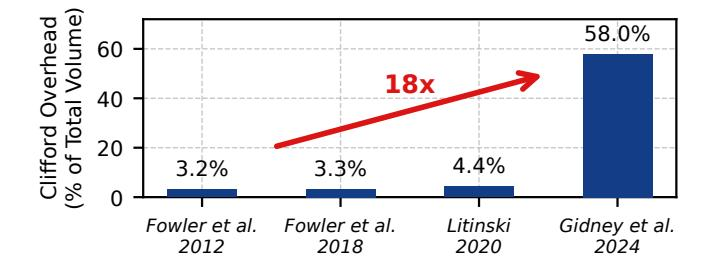
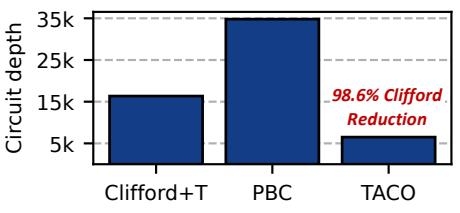

# Transpiler-Architecture Co-Design to Curb Clifford Costs in Fault-Tolerant Quantum Computing

Meng Wang1, 2, Chenxu Liu2, Samuel Stein2, Yufei Ding3, Poulami Das4, Prashant J. Nair1, Ang Li2,5

- 1 Department of Electrical and Computer Engineering, The University of British Columbia
- 2 Physical and Computational Science Division, Pacific Northwest National Laboratory
- 3 Department of Computer Science and Engineering, University of California San Diego
- 4 Department of Electrical and Computer Engineering, The University of Texas at Austin

Abstract—Quantum Error Correction (QEC) codes form the foundation of Fault-Tolerant Quantum Computing (FTQC) and predominantly use the Clifford+T gate set. Recently, Clifford operations have become the key performance bottleneck in implementing QEC. While state-of-the-art approaches like Pauli-Based Compilation (PBC) reduce Clifford overhead by transforming Clifford gates into Pauli measurements, they do so at the cost of gate-level parallelism, inflating circuit depth and execution times.

To overcome these limitations, we introduce TACO, a Transpiler–Architecture Co-design framework that tackles the Clifford bottleneck through circuit and architectural optimization. TACO uses FTQC insights to guide hardware-aware Clifford gate elimination and circuit restructuring, and leverages the resulting optimized circuits to refine architectural design. TACO applies FTQC-specific transformations to aggressively reduce Clifford overhead from rotation synthesis and Toffoli decompositions, while preserving gate-level parallelism. The resulting architecture is optimized for the locality and data-movement patterns of these circuits, enabling high-throughput, resource-efficient execution. Our evaluation across diverse benchmarks shows that TACO achieves up to  $21.9\times$  (mean  $4.4\times$ ) reduction in execution time compared to the state-of-the-art baseline.

Index Terms—Fault-tolerant quantum computing, quantum error correction, Clifford+T circuits, architecture co-design.

### I. INTRODUCTION

Quantum Error Correction (QEC) [18], [36], [46], [47], [66] is essential to enable practical fault-tolerant quantum computing (FTQC). QEC encodes logical qubits into multiple physical qubits to actively detect and correct errors [1], [8], [31], [63]. Among QEC codes, the surface code [30], [42], [46] is especially promising, offering planar connectivity, high thresholds, and efficient decoding, and can realize universal fault-tolerant computation through additional mechanisms such as lattice surgery, code deformation, and magic-state distillation [13], [30], [57]. As quantum algorithms advance, balancing the resource costs of Clifford and T gates in QEC is key to realizing practical FTQC.

Historically, magic-state preparation for T gates dominated FTQC resource costs, often exceeding 95% of the total qubit-cycle volume. This challenge motivated substantial progress in T-gate optimization, significantly reducing T-state overheads [19], [33], [34], [38], [52]. As a result, FTQC resource estimates have begun to expose other costs that were previously treated as negligible. In particular, Clifford operations

Fig. 1. Clifford gate volume percentage of the 18-qubit QFT circuit execution increased by more than  $18 \times$  from 3.2% to 58% as T gates become cheaper with improved magic state preparation protocols [29], [30], [34], [52].

can now constitute a major, and in some cases dominant, fraction of the computational overhead. As shown in Figure 1, the Clifford-overhead fraction in an 18-qubit QFT circuit increases from 3.2% to 58% under resource estimates spanning the past decade. We observe a similar trend across a broad set of benchmark circuits, as discussed in Section III-A.

Limitations of State-of-the-Art: A common approach for addressing Clifford gate overhead is to convert Clifford+T circuits into Pauli-based circuits (PBC) [15], [51]. This transformation commutes all Clifford gates to the end of the circuit, effectively absorbing them into the final measurements and eliminating explicit Clifford operations. However, this approach comes with important trade-offs. PBC introduces numerous multi-qubit  $\frac{\pi}{4}$  rotations. These rotations significantly constrain gate parallelism (i.e., the number of gates that can be executed in parallel), as shown in Figure2 (a). Moreover, as multi-qubit logical operations involve more qubits, their error rates rise, often requiring higher code distances to maintain fault tolerance. This, in turn, increases physical qubit requirements and further limits the efficiency of PBC.

Our Proposal: We address the Clifford bottleneck with TACO, a systematic Transpiler—Architecture Co-design Optimization framework. We observe that optimizing either the circuit or hardware in isolation cannot efficiently resolve the trade-offs between gate count, parallelism, and hardware cost in FTQC. TACO overcomes these challenges through three tightly connected strategies: (1) Hardware-informed Clifford optimization removes Clifford gates by analyzing their origins and exploiting hardware-native operations. This re-

&lt;sup>5 Department of Electrical and Computer Engineering, University of Washington

- (a) Gate parallelism comparison.
- (b) TACO: Software-Hardware codesign.
- (c) Depth of original and optimized circuits.

Fig. 2. Comparison of Clifford optimization approaches showing gate reduction vs. circuit depth trade-offs for an 18-qubit QFT circuit. (a) The state-of-the-art Clifford optimization method, PBC, significantly restricts gate parallelism. (b) TACO employs a software-hardware co-design approach that (c) reduces Clifford gates by 98.6% in the QFT circuit, which is comparable to PBC, while achieving 5.3× lower circuit depth.

duces Clifford count by over 91% on average while maintaining parallelism. (2) FTQC-aware transpilation leverages the simplified Clifford structure to map circuits into fault-tolerant forms that align with the true hardware cost hierarchy. This ensures both Clifford and T gates are synthesized efficiently. (3) Resource-locality-driven architecture exploits the locality and regularity in optimized circuits to allocate compute and storage resources efficiently. This helps sustain high gate throughput and minimizes physical qubit overhead.

Insight 1: Hardware-Informed Clifford+T Optimization: We use the insight that Clifford gates in FTQC circuits mainly arise from two sources: the decomposition of Toffoli gates and the synthesis of single-qubit rotations such as  $R_z$ . In typical quantum algorithms, each Toffoli gate decomposes into 8 Clifford and 7 T gates. We show that these Clifford gates can be merged or canceled *locally* based on algebraic structure, without reducing gate parallelism. For single-qubit rotations, standard Clifford+T synthesis can expand each rotation into hundreds of gates, with Cliffords comprising up to 60% of the sequence. Unlike the Toffoli case, these Clifford gates are not locally removable within Clifford+T, since they serve as basis changes between T gates  $(R_z(\frac{\pi}{4}))$ . However, recognizing that  $R_x(\frac{\pi}{4})$  can be implemented using mechanisms analogous to T gates expands the effective gate set, making most basis changes unnecessary and reducing Clifford gates by over 98%. By combining local Clifford gate cancellation for Toffoli decompositions with a hardware-native implementation of single-qubit rotations, we eliminate over 98.6% of Clifford gates. As shown in Figure 2(c), our optimized Clifford+T circuits achieve a  $5.3 \times$  lower circuit depth compared to PBC. **Insight 2: FTQC-Aware Circuit Transpilation:** Transpiling algorithmic circuits into Clifford+T form involves two key steps: decomposition and gate synthesis. Although decomposing circuits into standard gate sets may appear straightforward, we find that it offers significant, often hidden optimization opportunities that are largely missed by existing transpilers [6], [43], [57], [72]. Our FTQC-aware transpiler exploits these opportunities by jointly coordinating decomposition and synthesis to minimize the resulting Clifford+T gate count.

**Insight 3: Resource-Locality-Driven Architecture:** We exploit the high spatial and temporal locality of our optimized FTQC circuits, especially in extended  $\frac{\pi}{4}$  rotation sequences, to design an architecture with dedicated compute and memory blocks. Compute qubits, characterized by frequent gate activ-

ity, are clustered in compute blocks optimized for rapid access to magic state resources and efficient execution of consecutive  $\frac{\pi}{4}$  rotations. These blocks are configured to expose both the X and Z edges of each logical qubit, enabling flexible, low-latency lattice surgery with state-distillation ancillae. Storage qubits, which remain idle except during Clifford operations, are assigned to memory blocks arranged in a compact three-row layout. This layout minimizes physical area while preserving connectivity via shared ancilla tiles. This enables rapid (typically within a few QEC cycles) and flexible transfer of logical qubits between memory and compute blocks.

At a higher level, our approach systematically integrates hardware layout, circuit transpilation, and architectural refinement through a cross-layer feedback loop. Hardware layout decisions, such as compute and memory block partitioning and ancilla tile placement, directly inform transpiler optimizations. This allows Clifford+T circuits to be mapped to maximize locality and throughput. Conversely, insights from circuit transpilation, such as  $\frac{\pi}{4}$  rotation clustering and gate reuse, drive targeted refinements in the hardware design. This iterative codesign allows each layer to reinforce the others, resulting in a  $2.3 \times$  reduction in the total Clifford+T gate count. From the resulting circuit, we further eliminate, on average, 91% of remaining Clifford gates while preserving parallelism, leading to a geometric mean of 4.4× speedup in QEC cycles. Our resource-locality-driven architecture sustains one logical gate per QEC cycle with just 1.5n + 4 logical qubit tiles. This approach significantly outperforms prior designs that require  $2n + \sqrt{8n} + 1$  logical qubit tiles [51].

In summary, this work has *four* key contributions:

- We identify Clifford gates as the dominant, yet previously overlooked source of overhead in FTQC, contributing to more than half of the total gate overhead.
- We propose TACO, a cross-stack framework that reduces Clifford gate overhead by 91% on average (up to 98.6%). This leads to a mean  $4.4\times$  speedup across diverse benchmarks.
- We develop an FTQC-aware transpiler that reduces overall gate count by  $2.3 \times$  compared to state-of-the-art compilers.
- We design a hardware architecture tailored to the structure and locality of optimized circuits, achieving one logical gate per QEC cycle with only  $1.5n{+}4$  logical qubit tiles. This approach substantially outperforms prior designs that require  $2n{+}\sqrt{8n}{+}1$  logical qubit tiles.

(a) Distance-3 surface code layout. (b) Lattice surgery between logical qubits. (c) Comparison of FTQC gate synthesis algorithms.

Fig. 3. (a) Distance-3 surface code layout showing data qubits (o), syndrome qubits (•), stabilizers (shaded areas), and logical qubit abstraction. X and Z-stabilizers are shown with different colors. (b) Lattice surgery operations between ① neighboring logical qubits and ② non-neighboring logical qubits using an ancilla logical qubit. (c) T-gate count versus synthesis error when synthesizing a random 1-qubit unitary into a Clifford+T gate sequence using the Solovay-Kitaev algorithm [24], [45] and GridSynth [64].

#### II. BACKGROUND

#### A. Surface Code and Fault-Tolerant Operations

**Basics of Surface Code:** Quantum error correction (QEC) protects fragile qubits by encoding logical qubits into multiple physical qubits. The surface code [16], [26], [30] arranges qubits in a 2D lattice with data qubits ( $\circ$ ) and syndrome qubits ( $\bullet$ ) that perform stabilizer measurements to detect errors (Figure 3(a)). Each surface code patch defines a logical qubit with distance d, capable of correcting up to  $\frac{d-1}{2}$  errors.

**Lattice Surgery:** Logical fault-tolerant operations are implemented via *lattice surgery* [27], [29], [42], [70], which enables qubit interactions by merging or splitting patches along shared edges (Figure 3(b)). For non-adjacent qubits, interactions are facilitated by repositioning or using ancillary qubits.

**Gate Implementation:** The surface code natively supports most Clifford gates (Pauli-X/Y/Z, Hadamard, CNOT) [30], [51], while the Phase gate (S) requires code deformations or gate teleportation with  $|Y\rangle$  states. The non-Clifford T gate, essential for universal computation, is implemented through gate teleportation using magic states  $|M\rangle$  prepared via resource-intensive magic state distillation [12], [34], [44], [52].

