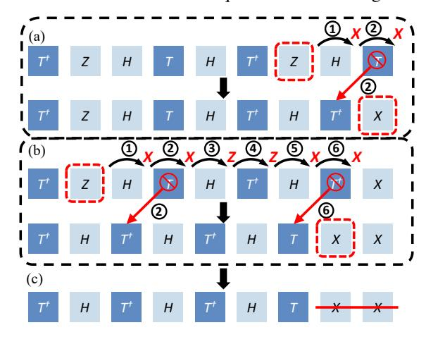

# B. The Parallelism Trade-Off for Tackling Clifford Overhead

A common method for reducing Clifford overhead is Pauli-Based Compilation (PBC), which commutes all Clifford gates to the end of the circuit and absorbs them into the final measurements. While this eliminates explicit Clifford gates, it comes at the significant cost of reduced gate-level parallelism.

Fig. 5. Gate-weight distribution of PBC and TACO for the 20-qubit QFT circuit. PBC produces multi-qubit operations involving up to 16 qubits, while TACO keeps all operations at one- or two-qubit weight. This preserves high gate parallelism by avoiding wide, multi-qubit gates.

Commuting single-qubit Clifford gates through non-Clifford gates keeps non-Clifford operations localized to individual qubits, though in altered forms. However, when two-qubit Clifford gates are commuted through non-Clifford gates, these operations become entangled with additional qubits, resulting in multi-qubit rotation gates. This process compounds as more two-qubit Cliffords are moved, ultimately generating operations that act on an increasing number of qubits, i.e., with a higher weight. Figure 5 shows the gate-weight distribution from PBC for the 20-qubit QFT circuit. Starting from only single- and two-qubit gates, PBC generates high-weight operations involving up to 16 qubits.

This effect is particularly problematic for quantum algorithms, which depend on multi-qubit entanglement. After PBC

transformation, most non-Clifford gates act on large subsets of qubits, severely restricting parallel execution opportunities. As shown in Figure 2(c), the 40,777 gates produced by PBC for the 18-qubit QFT circuit yield a circuit depth of 37,756, averaging just 1.08 gates per circuit layer.

#### C. Preserving Parallelism with Structured Clifford+T Circuits

A key challenge in reducing Clifford overhead without losing parallelism lies in how CNOT gates are treated. By deliberately avoiding the commutation of CNOT gates through the circuit, one can preserve the natural gate parallelism critical for efficient quantum computation. Thereafter, one can then focus on optimizing the remaining components, namely Toffoli gates and single-qubit gate sequences, and eliminating Clifford gates within these sequences. This helps target the primary sources of Clifford overhead while maintaining parallelism.

To optimize single-qubit gate sequences, we use the Matsumoto-Amano (MA) Normal Form [35], [55], a canonical structure for any single-qubit Clifford+T sequence:

MA Normal Form := 
$$(T|\epsilon) (HT|SHT)^* C$$
 (1)

In this form,  $(T|\epsilon)$  is an optional initial T gate, followed by a sequence of HT or SHT patterns (denoted by  $(HT|SHT)^*$ ), ending with a Clifford gate C. Notably, the MA Normal Form guarantees both a minimal T-gate count and a unique decomposition for any target unitary, enabling systematic and efficient optimization of these sequences. By converting all single-qubit gate sequences into MA Normal Form, one can isolate Clifford reduction to two subproblems. First, eliminating redundant Cliffords within Toffoli decompositions, and second, those within these structured single-qubit sequences. This targeted strategy enables effective Clifford gate removal while preserving circuit parallelism. As shown in Figure 5, TACO limits operation weight to at most two qubits.

## IV. DESIGN OF TACO

TACO is a full-stack optimization framework for FTQC. As shown in Figure 6, TACO unifies dynamic circuit decomposition, Clifford gate reduction, and architecture-aware optimization in a single workflow. We begin by presenting techniques for Clifford gate reduction, both for single-qubit sequences (Section IV-A) and CCX (Toffoli) gate decompositions (Section IV-B). Next, we introduce a dynamic circuit transformation pass (Section IV-C) that efficiently minimizes high-cost gates during synthesis, leveraging circuit structure for further reductions. Finally, we show how the locality patterns emerging from these optimized circuits directly inform the design of a tailored FTQC architecture (Section IV-D).

#### A. Structured Clifford Reduction for Single-Qubit Gates

TACO systematically identifies all single-qubit gate sequences in the circuit and converts them into Matsumoto-Amano (MA) Normal Form (Equation 1). This structured representation enables TACO to apply Clifford reduction to each sequence, effectively eliminating most Clifford gates

Fig. 6. Overview of the design. TACO begins with dynamic gate decomposition of the algorithmic circuit, transforming it into an intermediate form with reduced Rz gates before synthesizing into a Clifford+T circuit. TACO then applies Clifford reduction to minimize execution time. The resulting circuit's high locality of  $\pi/4$  rotations informs a software-guided hardware design.

while preserving circuit integrity. The approach is shown below with a representative gate sequence:

$$T S H T H T S H T$$
 (2)

1) Eliminating Phase Gates: In MA Normal Form, only two fundamental gate patterns can appear -HT and SHT, which result in four possible gate patterns in the sequence:

A key observation is that every S gate in these sequences is immediately preceded by a T gate, with a single exception: an initial SHT prefix. An equivalence exists between TS gates and  $T^{\dagger}Z$  gates, which we can verify through:

$$TS = \begin{bmatrix} 1 & 0 \\ 0 & e^{i\frac{\pi}{4}} \end{bmatrix} \begin{bmatrix} 1 & 0 \\ 0 & i \end{bmatrix} = \begin{bmatrix} 1 & 0 \\ 0 & e^{i\frac{\pi}{4}i} \end{bmatrix} = \begin{bmatrix} 1 & 0 \\ 0 & e^{i\frac{3\pi}{4}} \end{bmatrix}$$
(4)

$$T^{\dagger}Z = \begin{bmatrix} 1 & 0 \\ 0 & e^{-i\frac{\pi}{4}} \end{bmatrix} \begin{bmatrix} 1 & 0 \\ 0 & -1 \end{bmatrix} = \begin{bmatrix} 1 & 0 \\ 0 & -e^{-i\frac{\pi}{4}} \end{bmatrix} = \begin{bmatrix} 1 & 0 \\ 0 & e^{i\frac{3\pi}{4}} \end{bmatrix}$$
 (5)

Note that  $T^{\dagger}$  and Z gates are natively supported on hardware, with Z gates being executed virtually. With this equivalence, we can effectively transform all expensive S gates into 'free'

Fig. 7. Remove Phase (S) gate using the identity:  $TS = T^{\dagger}Z$ .

Z gates. The sample gate sequence shown in Equation 2 can be transformed into the new sequence shown in Figure 7.

Fig. 8. Commute and merge Pauli gates using commuting rules defined in Equation 6. (a,b) shows the commuting process of the two Pauli gates and (c) the merging of the Pauli gates. Circled numbers are the step order.

2) Eliminating All Pauli Gates: Once we eliminate all S gates from the sequence, we are left with H, T,  $T^{\dagger}$ , and Z gates. Although Z gates can be executed virtually, we want to eliminate them first to make the next step of eliminating H gates easier. The following commutation relations hold:

$$ZH = HX; XH = HZ$$
  
 $ZT = TZ; ZT^{\dagger} = T^{\dagger}Z$   
 $XT = T^{\dagger}X; XT^{\dagger} = TX$  (6)

These relations enable all the Pauli gates to be commuted at the end of the sequence and merged as shown in Figure 8.

3) Eliminating All Hadamard Gates: To this point, the remaining gates in the sequence are H, T, and  $T^{\dagger}$  with a potential Pauli gate at the end of the sequence. Unlike Pauli Gates, Hadamard cannot be easily commuted to the end of the sequence. To further eliminate Hadamard gates, we introduce a new gate operator:  $Rx(\frac{\pi}{4})$ . This operator requires the same hardware resources and implementation complexity as the T gate, with the only distinction being that the T gate performs lattice surgery between a magic state and the Z edge of the target qubit, whereas  $R_x(\frac{\pi}{4})$  operates on the X edge [42], [51]. The following commutation relation holds:

$$HT = Rx(\frac{\pi}{4})H, \quad HT^{\dagger} = Rx^{\dagger}(\frac{\pi}{4})H, \quad HH = I \quad (7)$$

We iterate over the sequence from left to right to efficiently remove all Hadamard gates. When encountering an H, we commute it forward using Equation 7. The two cancel if we meet a second H. This process is repeated until all H gates are pushed to the end or eliminated. Figure 9 illustrates this.

4) Transpilation Efficiency: The three FTQC-specific optimizations, elimination of Phase (Section IV-A1), Pauli (Section IV-A2), and Hadamard gates (Section IV-A3), each run in linear time O(n), where n is the number of gates in the circuit.

Fig. 9. Commuting all the Hadamard gates to the end of the sequence using the commuting rules in Equation 7. Circled numbers indicate the step order.

These passes are highly efficient in practice. For example, our 18-qubit QFT benchmark (see Section VI-C) contains 459  $R_z$  gates and expands to 104,217 Clifford+T gates after synthesis. TACO completes the entire transpilation in under 1 second, compared to 16.1 seconds required by GridSynth for gate synthesis alone. Thus, TACO introduces negligible overhead and imposes no FTQC compilation bottleneck.

5) Exploiting Locality in Optimized Circuits: Following the three Clifford+T gate sequence optimizations, the resulting circuit displays a high degree of **locality**. That is, multiple  $R\left(\frac{\pi}{4}\right)$  rotations are often applied consecutively to the same qubit. Because each such rotation requires interaction with a magic state, this structural locality can be exploited to improve execution efficiency by strategically placing qubits near magic-state sources. This intrinsic property of the optimized circuit directly informs our architecture design in Section IV-D, enabling more efficient resource allocation and throughput.

