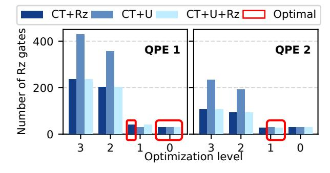
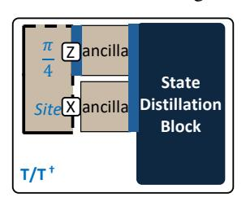
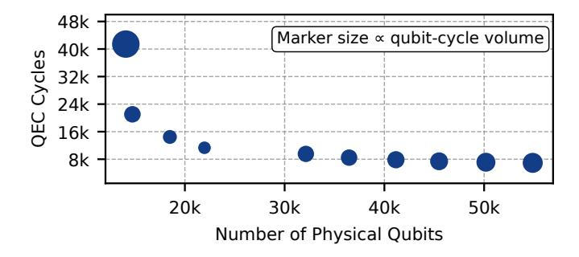
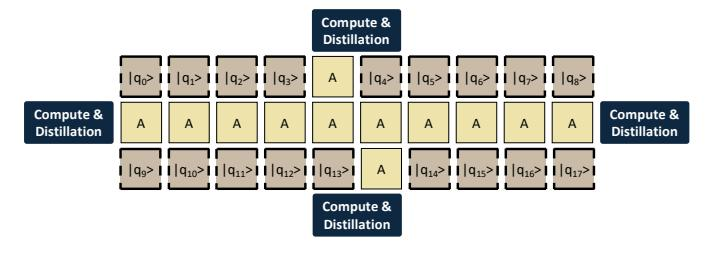

# B. Parallelism-Preserving Clifford Reduction in Toffoli Gates

A single Toffoli gate decomposes into seven  $T/T^{\dagger}$  gates, six CNOTs, and two Hadamard gates, as shown in Figure 10(a). Figure 10(b) illustrates the commutation process of the first non-Clifford gate  $(T^{\dagger})$ . ①: the  $T^{\dagger}$  gate is represented as  $R_Z(-\pi/4)$ . ②: it is then commuted through a CNOT gate, and ③: subsequently through a Hadamard gate.

Figure 10(c) shows the circuit after all remaining non-Clifford gates have been commuted to the front, leaving the Clifford gates grouped afterward and labeled  $C_1$  through  $C_8$ . These Clifford gates can be locally canceled. Gates  $C_3$  and  $C_4$ , both CNOTs acting on the same target qubit, commute and can be swapped. After this swap, the consecutive self-inverse pairs  $(C_2, C_4)$ ,  $(C_3, C_5)$ , and  $(C_7, C_8)$  cancel, followed by the remaining Hadamard pair  $(C_1, C_6)$ .

After these local cancellations, only the non-Clifford rotations acting on the three qubits of the original Toffoli gate remain, as shown in Figure 10(d). All operations stay confined to this local three-qubit subspace, ensuring that no additional commutation steps or circuit depth overhead are introduced.

#### C. FTQC-oriented Dynamic Circuit Transformation

A key step in our workflow is an intermediate circuit transformation, motivated by the fact that efficient gate synthesis algorithms such as GridSynth [64] operate on a restricted gate

Fig. 10. (a) Decomposition of the Toffoli gate into Clifford and non-Clifford components. (b) Commutation of the first non-Clifford gate  $(T^{\dagger})$ : ①  $T^{\dagger}$  represented as  $R_Z(-\pi/4)$ , ② commuted through a CNOT, and ③ through a Hadamard gate. (c) The circuit obtained after commuting all non-Clifford gates to the front. (d) Eight Clifford gates cancel pairwise after swapping  $C_3$  and  $C_4$ . Consecutive self-inverse Clifford pairs  $(C_2, C_4)$ ,  $(C_3, C_5)$ , and  $(C_7, C_8)$  cancel first, followed by the remaining pair  $(C_1, C_6)$ .

set. Reducing the number of gates that require synthesis at this stage directly impacts overall resource cost. To highlight this challenge, we evaluated common NISQ-oriented transpilers on two 4-qubit Quantum Phase Estimation (QPE) circuits. As shown in Figure 11, no configuration consistently achieves low  $R_z$  gate counts for practical FTQC needs, revealing an important gap in current transpiler strategies.

To address this, we develop a dynamic transformation method optimized for FTQC that consists of three stages. First, we study all possible decomposition rules for gates up to three

Fig. 11. Number of Rz gates in intermediate circuits obtained from transpiling two 4-qubit QPE circuits using Qiskit Transpiler across optimization levels 0-3 and three basis gate sets (Clifford+T+U, Clifford+T+Rz, Clifford+T+U+Rz). Lower Rz gate counts indicate better optimization.

qubits, selecting the option with the minimum FTQC cost for each. Second, we simplify trivial cases by replacing rotation gates that are Clifford+T equivalent, such as mapping  $R_z(\pi)$  to a Pauli-Z. Third, we merge consecutive single-qubit gates whenever possible, leveraging local cancellations to further reduce the gate count. This targeted approach yields optimal gate counts on both QPE benchmarks, consistently outperforming NISQ-oriented transpiler configurations and demonstrating the value of FTQC-specific dynamic transformation.

#### D. Architecture Co-Design Guided by Circuit Locality

The optimized Clifford+T circuits from Section IV-A exhibit high  $\pi/4$  rotation locality – that is, long sequences of  $R\left(\frac{\pi}{4}\right)$  rotations are repeatedly applied to the same qubit. The length of these sequences can span dozens or even hundreds of consecutive rotations. To exploit this structural regularity, we propose an FTQC architecture consisting of two logical regions: a *compute block* and a *memory block*. The compute block hosts logical qubits that undergo frequent  $\pi/4$  rotations, enabling efficient interaction with magic-state resources. The memory block holds the remaining qubits in a compact, area-efficient layout while still supporting necessary Clifford operations such as CNOT and Hadamard gates.

1) Compute Block: The compute block is optimized for executing long sequences of  $\frac{\pi}{4}$ -rotation operations. In the Clifford-Reduced circuit from Section IV-A, there are four types of  $\frac{\pi}{4}$  rotations: Z-axis rotations, X-axis rotations, and their inverses. The  $Rz(\frac{\pi}{4})$  gate, equivalent to the T gate, requires lattice surgery between a magic state qubit and the Z-edge of the target qubit. Similarly, the  $Rx(\frac{\pi}{4})$  gate requires interaction with the X-edge of the target qubit.

Fig. 12. Layout of the compute block, showing the  $\frac{\pi}{4}$  logical qubit site with both X and Z edges exposed via ancilla qubits to the state distillation block. This configuration supports  $Rz(\frac{\pi}{4})$  (left) and  $Rx(\frac{\pi}{4})$  rotations (right) by enabling selective edge interaction. One compute block uses four logical qubit tiles: two for the  $\frac{\pi}{4}$ -site qubit and two ancilla tiles.

As shown in Figure 12, each compute block includes a  $\pi/4$  logical qubit site with X and Z edges exposed through ancilla tiles connected to the state distillation block. These edges are activated according to the required rotation axis. During magic-state injection, the sign of the resulting  $R(\frac{\pi}{4})$  rotation is probabilistic. If the opposite sign is produced, the intended rotation is recovered using a Clifford correction, which is unavoidable but much cheaper than another non-Clifford rotation. High  $\pi/4$ -rotation locality ensures that each target qubit remains in the compute block throughout its rotation sequence, avoiding unnecessary movement between memory and compute regions and improving execution efficiency.

Fig. 13. Memory block layout for storing idle qubits. Logical qubits occupy the first and third rows, while the middle row is reserved for ancilla qubits.

- 2) Memory Block: The memory block stores the remaining logical qubits, which are mostly idle except during the execution of CNOT or Hadamard gates. We adopt the compact tile layout from [51], illustrated in Figure 13. The design consists of three rows: logical qubit tiles occupy the first and third rows, while the middle row contains ancilla tiles. This arrangement requires only 1.5n tiles for n logical qubits and supports direct interactions between any qubit pair via the shared ancilla layer, enabling flexible and efficient CNOT operations. Hadamard gates can be applied locally with minimal overhead. The central ancilla row is also connected to the compute block, enabling seamless movement of qubits between memory and compute regions as needed for fault-tolerant execution.
- 3) Patch Rotation: In the memory block, each logical qubit exposes only a single computational basis for interactions. When operations require the complementary basis, a patch rotation is performed: 1 cycle to expand the patch, one cycle to rotate the logical basis, and one cycle to shrink back, totaling 3 code cycles [51]. Since these rotations are infrequent, they do not impact overall performance.
- 4) Qubit Transfer Between Memory and Compute Blocks: When a logical qubit moves between memory and compute blocks, the architecture provides direct access from any memory location to the compute block. The transfer completes in a single code cycle by expanding the qubit into the compute block and contracting it back to its operational configuration.

#### E. Optimizing Compute and Distillation Block Placement

Fig. 14. Gate parallelism comparison of 20-qubit QFT. TACO preserves the same high gate-level parallelism as the original Clifford+T circuit.

As shown in Figure 14, TACO-optimized circuit preserves the high gate-level parallelism of the original Clifford+T circuit. This parallelism requires multiple magic states within each circuit layer, which necessitates multiple distillation blocks. This raises two practical questions: how many distillation blocks are optimal, and where should they be placed.

Fig. 15. Qubit-cycle comparison for 18-qubit QFT execution with magic state preparation throughputs from 1-10 magic states/cycle using Magic State Cultivation [34]. Marker sizes are proportional to qubit-cycle volume, with four magic states/cycle being the optimal configuration.

Minimizing Space-Time Volume via Factory Scaling. The primary architectural objective of TACO is to minimize the total space-time volume. This requires balancing the physical qubit overhead of magic state factories against the resulting increase in circuit throughput. Unlike prior heuristics that suggest fixed overhead ratios for distillation, we explicitly model the physical cost of each distillation block based on its surface code distance and layout requirements. Figure 15 illustrates the QEC cycles required for an 18-qubit QFT circuit as a function of available magic state blocks. The marker size indicates the total qubit-cycle volume, which incorporates the actual spatial footprint of both memory qubits and the allocated distillation factories. We observe that as throughput increases, the cycle count decreases significantly, reaching an optimal volume at 4 magic-state blocks. This configuration represents a 57% reduction in volume compared to a singleblock setup. Beyond this point, further scaling yields diminishing returns because the added spatial overhead outweighs the marginal cycle reductions. TACO automatically identifies this optimal configuration by simulating these trade-offs, ensuring that resource allocation is driven by total volume minimization rather than arbitrary overhead limits.

Fig. 16. Architecture for 18-qubit QFT execution featuring 18 logical memory qubits and 4 distributed compute and distillation blocks.

