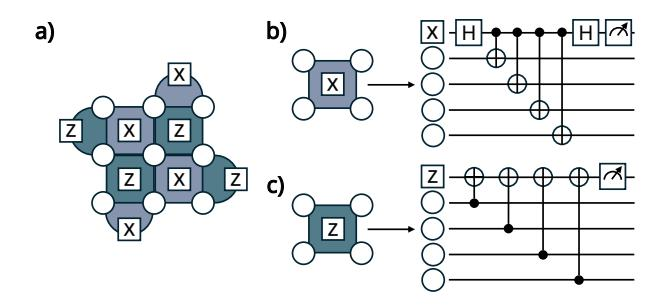
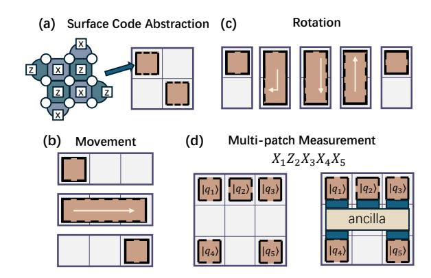

# *A. Preliminary*

*1) Quantum Computing and Quantum Error Correction:* The fundamental unit of quantum computing is the qubit. A qubit inhabits a 2-D Hilbert space with computational basis states |0⟩ and |1⟩, and an arbitrary pure state can be written as |ψ⟩ = α |0⟩ + β |1⟩, where α and β are complex amplitudes satisfying |α| 2 + |β| 2 = 1. Realistic qubits are noisy and error-prone. For example, a bit-flip error maps |ψ⟩ to α |1⟩ + β |0⟩, and a phase-flip error maps α |0⟩ + β |1⟩ to α |0⟩ − β |1⟩. Quantum error correction (QEC) codes are necessary to preserve quantum information against such errors.

Stabilizer codes form a broad family of QEC codes that includes many of the most widely used constructions. A stabilizer code is specified by a set of commuting stabilizer generators S1, . . . , Sm, each of which is a Pauli operator acting as a tensor product of Pauli strings on the physical qubits. During syndrome extraction, dedicated ancilla qubits interact with the data qubits to measure the parity of each stabilizer without collapsing the encoded state.

*2) Surface Code and Lattice Surgery:* The surface code [7] has emerged as a leading candidate for building practical faulttolerant quantum computers due to its high error threshold and hardware compatibility. Fig. 2(a) shows a rotated surface code of distance d = 3. The corresponding syndrome extraction circuit is shown in Fig. 2(b)(c): circles represent data qubits, and each data qubit couples to adjacent X- and Z-type ancilla qubits. The syndrome extraction is repeated over multiple rounds to collect measurement outcomes.

Fig. 2. Example rotated surface code of distance d=3. a) The code is defined by a set of X- and Z-type stabilizer checks used for syndrome extraction. b) and c) Syndrome extraction circuits for the X and Z stabilizers, respectively.

Lattice surgery [30] is a leading approach for implementing logical operations in surface code architectures. It works by measuring joint stabilizers along the boundaries of adjacent code patches, temporarily merging and then splitting patches [30]–[32] to enact gate primitives. In contrast, non-Clifford operations such as the T gate, are typically supplied via magic state distillation or cultivation [33]–[37]. In this distillation process, multiple noisy magic states are converted into fewer, higher fidelity states that are suitable for fault-tolerant state injection.

Following the best practice [38], we represent each encoded surface-code qubit as a tile, as shown in Fig. 3(a). Building on this abstraction, Fig. 3(b–d) illustrates the key lattice surgery operations on tiles: patch movement, patch rotation, and multi-patch parity measurement. Execution of logical circuits typically follows the Pauli-Based Computation (PBC) paradigm, which systematically translates the universal Clifford+T circuits into a sequence of Pauli rotations. These rotations are then realized via the requisite lattice-surgery operations. We refer to [38] for a detailed introduction.

Fig. 3. (a) Abstract view of the surface code as a patch. (b-d) Summary of the logical operations that can be performed.

3) The Pauli Frame and T-Gate Synchronization: The classical processing requirements for FTQC are fundamentally dictated by the Pauli frame [29], [39] and its interaction with non-Clifford gates. The Pauli frame is a classical data structure

that efficiently tracks the accumulation of Pauli errors on data qubits. This is a direct consequence of the definition of the Clifford group  $\mathcal{C}_n$ . If an operation  $C \in \mathcal{C}_n$  is a Clifford gate, then for any Pauli operator  $P \in \mathcal{P}_n$ , the transformation results in another Pauli operator  $P' = CPC^\dagger \in \mathcal{P}_n$ . This property allows for efficient classical tracking: if an accumulated error  $E \in \mathcal{P}_n$  exists on the state  $|\psi\rangle$ , applying a Clifford circuit C transforms the state to  $C(E|\psi\rangle) = (CEC^\dagger)(C|\psi\rangle) = E'(C|\psi\rangle)$ . The new error E' is also a Pauli operator and can be easily computed classically, allowing the frame to be updated without physical correction.

This convenience ends, however, with the introduction of non-Clifford gates, such as the T-gate, which are essential for universal quantum computation [33]. The T-gate breaks the classical tracking mechanism, as the transformed error can no longer be represented in the Pauli frame; for instance,  $TXT^{\dagger} \notin \mathcal{P}_n$ . As illustrated in Figure 4, a T-gate is typically implemented via preparing a high-fidelity magic state [34], [37], [40] and realizing a gate teleportation, which concludes with a measurement and a classically-controlled Pauli correction (an S-gate). Crucially, this final correction cannot be commuted through the T-gate and absorbed into the Pauli frame. Before this correction can be applied, the accumulated error on the logical qubit,  $E_{acc}$ , must be physically corrected by applying  $E_{acc}^{\dagger}$ . Only after the state is restored from  $E_{acc}|\psi\rangle$  to  $|\psi\rangle$  can the teleportation proceed correctly.

Fig. 4. T-gate implementation via gate teleportation. The classically-controlled S-gate correction forces a decoder synchronization by physically correcting the Pauli frame.

The central insight is the dichotomy in decoding requirements for FTQC. While the Pauli frame permits a relaxed, asynchronous approach to error correction, the presence of non-Clifford gates creates absolute synchronization points. They transform decoding into a priority scheduling problem, where synchronization failures lead to computational stalls and increased logical error rates.

4) Window Decoding: To manage the continuous stream of syndrome data in FTQC, decoders operate on discrete chunks of information known as windows. The traditional approach is serial sliding window decoding [41], where the temporal syndrome data is partitioned into fixed-size windows that are processed sequentially. However, this approach faces a scalability bottleneck. Let the time to generate the data for one window be  $\tau_{gen}$  and the time for a single decoder to process it be  $\tau_{dec}$ . To prevent an exponential backlog of unprocessed syndromes, the system must satisfy the condition

τdec < τgen [15]. Assuming a decoder whose latency scales linearly with the number of qubits, N, i.e., τdec ∝ N, this constraint can be rewritten as:

$$N < \frac{\tau_{round}}{k} \tag{1}$$

where τround is the duration of a single syndrome measurement cycle and k is a constant. This inequality reveals that for any decoder hardware, there exists an upper bound on the code distance that can be supported in real-time, rendering the approach unscalable for large QEC codes.

The introduction of *parallel window decoding* offered a solution. The key insight is that temporally disjoint windows are causally independent and can thus be decoded concurrently, as illustrated in Figure 5. In the time dimension, this allows for a checkerboard pattern of decoding, where all *even* windows can be processed in parallel, followed by all *odd* windows [24], [25]. This concept extends naturally to the spatial dimension, where operations on different logical qubits can also be partitioned and processed in parallel [27]. Further refinements, such as speculative decoding [26], aim to minimize the overhead at window boundaries. The parallel window approaches require that the decoding volume for a given window is expanded to include a buffer region containing syndrome data from its neighbors, with the window buffer size determining the extent of this look-ahead information. Then, the earlier decoded window creates artificial syndromes on its boundary with its neighbors. The insight of parallel window decoding is: with a sufficient number of parallel decoders, the system's overall throughput can be maintained even if individual decoders are slow (τdec ≥ τgen).

Fig. 5. Spatio-temporal partitioning of a lattice surgery operation. (a) The monolithic operation volume. (b) It is decomposed into a graph of causallyconstrained slices, where red edges represent mutual exclusion constraints. (c) The graph is 2-colored, which partitions all slices into two independent sets, and each set can be decoded in parallel.

