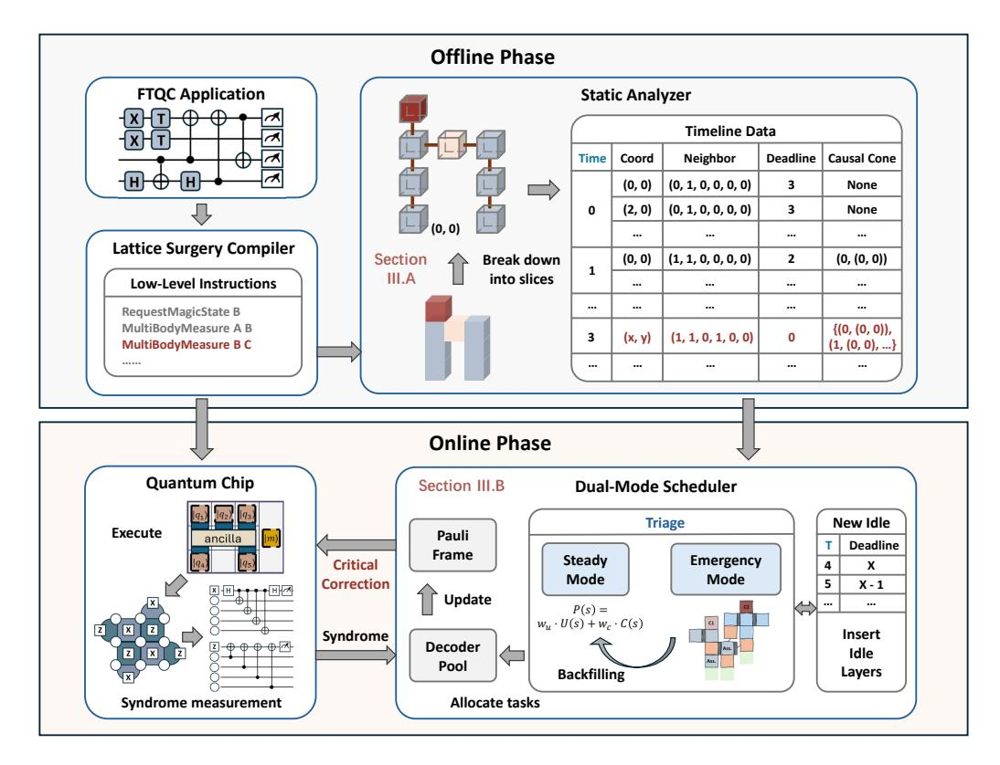

# *A. System Model and Problem Formulation*

The decoder scheduler serves as middleware within the FTQC classical control stack. As illustrated in Figure 7, its architecture is divided into offline and online phases.

*1) Offline Phase: Compile-Time Analysis:* Due to the superlinear complexity of the decoder, processing a large block of syndrome data is less efficient than decoding its components individually. Building upon the concepts of parallel window decoding, we leverage fine-grained spatio-temporal partitioning to maximize the degree of parallelism. We therefore adopt the *slice* as the atomic scheduling unit of our framework.

A slice S(t, p), represents the syndrome data generated from a single square logical patch at position p during a d-rounds syndrome measurement cycle t. The scheduler models the computation as an undirected graph G = (V, E), where the set of vertices V consists of all slices. An edge (u, v) ∈ E represents a mutual exclusion constraint signifying that slices u and v cannot be decoded concurrently. Each slice is characterized by a set of attributes that guide the scheduler's decisions:

- *a) Neighbors:* Edges in the constraint graph are defined by the neighbors of each slice. A slice S(t, p) can have up to six neighbors: two for temporal predecessor (t − 1) and successor (t + 1), and four spatial neighbors at time t. A data qubit slice always has at least one temporal dependency due to the syndrome stream. Spatial dependencies are introduced by multi-qubit lattice surgery.
- *b) Decoding Status:* Each slice maintains a state transitioning through the automata depicted in Figure 8. A slice is initially UNGENERATED. Once its syndrome is produced by the quantum hardware, it becomes PENDING. A PENDING

slice is eligible for decoding, but may be blocked by a neighbor that is currently being decoded; in this case, it is marked as OCCUPIED. When a slice is ready and selected by the scheduler, it moves to ASSIGNED for the duration of its decoding. Upon successful processing, it enters COMPLETED. The Timeline dynamically maintains PENDING and COMPLETED slices during the online phase to facilitate the scheduler's decision.

*c) Causal Cone:* Slices associated with critical operations (i.e., Clifford corrections after a T-gate teleportation) have the causal cone as an additional attribute, which defines the complete set of historical slices that must be decoded to update the Pauli frame, as described in Section II-B2. Our framework employs a lazy computation strategy. When the scheduler requires a causal cone, it is calculated ondemand via a backward BFS starting from the critical slice's immediate spatial and temporal predecessors (i.e., the slices directly participating in the non-Clifford gate). The traversal only expands to (i) same-layer spatial neighbors and (ii) the one-step temporal predecessor at t−1. A node in COMPLETED state will be pruned, while the BFS continues on the remaining frontier until the queue is exhausted. The results are then stored in a bounded LRU cache. All subsequent queries related to the same critical operation are served instantly from the cache.

Based on the slice abstraction, the compiler first lowers a high-level program to a Low-Level Instruction (LLI) stream over a 2-D logical-qubit layout. A single pass then builds the *Timeline* structure, where each unit stores: (i) an integer layer index t (unit: one syndrome-measurement cycle), (ii) spatial coordinate (r, c), (iii) operation label, (iv) a 6-bit immediateneighbor mask (t−1, t+1, ↑, ↓, ←,→), (v) a deadline measured in *layers* to the nearest upcoming critical synchronization point (∞ if none), and (vi) a possible *causal cone* reference. During online simulation, this discrete timeline is mapped to scheduler time τ : syndrome-generation events occur at τ = 1, 2, . . . (one cycle step each), while decoding-completion events are scheduled at τfinish = τstart + Tdec.

*2) Online Phase: Real-time Execution:* During execution, the LLI is streamed to quantum hardware, which generates a continuous stream of syndrome data corresponding to the executed operations. This stream is the primary input to Triage, which dispatches decoding tasks to a shared pool of M physical decoders. The scheduler is triggered by two events: (i) arrival of a new syndrome layer, which introduces new pending slices; and (ii) completion of a decoding task, which releases decoder capacity.

At each syndrome-arrival event, the engine checks whether synchronization constraints are satisfied for critical operations. If satisfied, execution proceeds normally. If not, the engine inserts an *idle syndrome layer* at ℓ: all existing timeline layers with index t ≥ ℓ are shifted to t + 1, and a new layer t = ℓ is created with per-qubit idle slices (while preserving spatial layout and carrying forward deadline semantics). This preserves causal order but delays all subsequent logical operations by one cycle. Decoders continue processing already assigned tasks asynchronously, and scheduling is retriggered after each decode completion and next syndrome arrival. Therefore, the

Fig. 7. Architectural Overview of the Triage Scheduling Framework. The offline phase consists of a compiler and a static analyzer that generate an annotated Timeline from LLIs. During the online phase, the scheduler uses this Timeline to dispatch a stream of syndrome data from the hardware to a finite pool of M physical decoders.

Fig. 8. State transition diagram for a slice's lifecycle.

scheduler objective is to maximize decoder throughput and minimize the number of such idle-layer insertions.

- *3) Problem Formulation:* Now we can formally define our task as a real-time scheduling problem. Given:
  - A shared pool of M decoders, each with speed r i dec relative to the syndrome generation speed.
  - A dynamic, undirected constraint graph G = (V, E) representing the set of all generated slices, slice attributes, and their mutually exclusive constraints.

The scheduler's task is to, at each decision point, find an assignment function π : V ′ → {1, ..., M} where V ′ is a subset of all PENDING slices, satisfying:

- 1) The chosen set of slices V ′ must be an independent set in the graph G (i.e., for any two slices u, v ∈ V ′ , there is no edge between them).
- 2) The number of assigned slices cannot exceed the number of available decoders, |V ′ | ≤ Mavailable.

The global objective is to produce a sequence of assignments that minimizes *the total number of idle syndrome layers* when synchronizing the Pauli frames of critical operations, thus minimizing the overall logical error rate.

