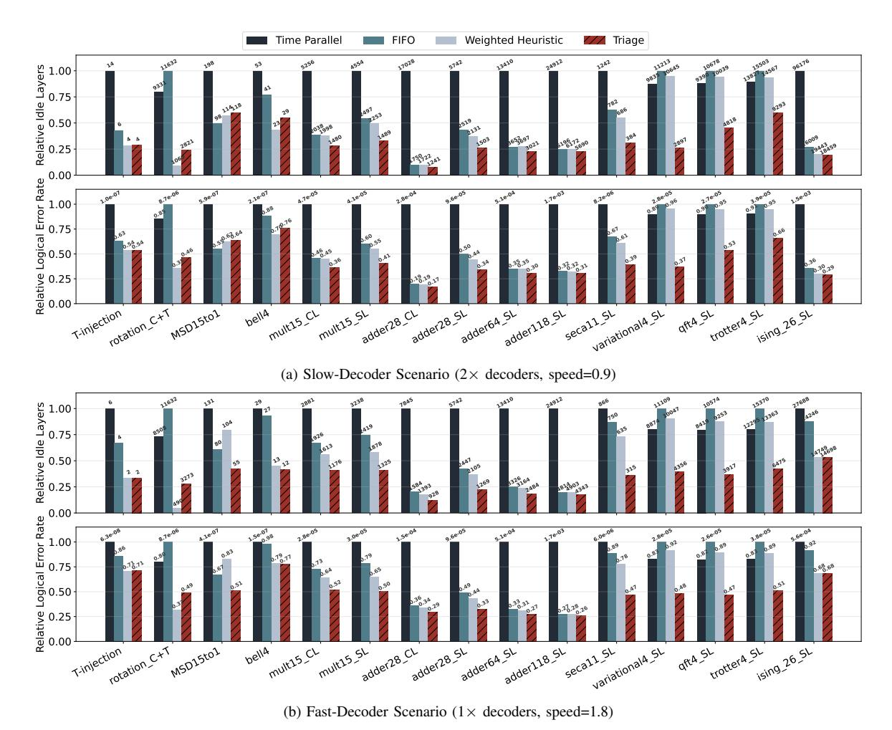

# B. Design Space Exploration of Scheduling Strategies

To characterize the performance landscape of various scheduling strategies, we conduct a design space exploration across a wide range of decoder counts and relative speeds, comparing our *Triage* scheduler against the *Time Parallel* scheduler, the *Time-Space Parallel* (FIFO) scheduler, and the *SWIPER* [26]. Figure 13 presents the performance of these schedulers as heatmaps, where darker regions indicate a higher number of inserted idle layers and thus poorer performance. The *Triage* scheduler's performance is particularly pronounced in the most challenging regions where decoders are both slow (low y-axis value) and scarce (low x-axis value), whereas *SWIPER* achieves the global minimum of idle layers when decoding resources are relatively abundant.

Figure 14 synthesizes these results into an optimal map. Each cell is colored to indicate which scheduler achieved the best performance for that specific resource configuration. The *Triage* scheduler (red) defines most of the feasible resource-constrained lower-left frontier. In contrast, *SWIPER* (light blue) tends to be optimal in the resource-abundant upper-right

regime. Notably, the lower-left black regions denote a regime of failure where extreme resource scarcity forces all schedulers to trigger the backlog-induced termination threshold.

Fig. 14. The optimal scheduler map on the Bell4 application. Each cell in the grid is colored according to the best-performing scheduler for that decoder pool configuration.

#### C. Performance Across Benchmarks

We now evaluate the schedulers on various FTQC benchmarks. Figure 15 illustrates the idle layers inserted and LER across all benchmarks in two representative resource scenarios: a **Parallelism-Rich Scenario**, featuring numerous but slow decoders (count = 2×#LQs, speed=0.9), and a **Latency-Rich Scenario**, featuring few but fast decoders (count = #LQs, speed=1.8). The height of the idle-step bars is normalized within each application, while the absolute values are labeled.

The results in both Figure 15a and Figure 15b show a trend of hierarchy of performance. For visual clarity, *SWIPER* is omitted as its performance under resource-constrained scenarios is comparable to the FIFO policy. The *time-only parallelism* scheduler performs the worst, while the *Triage* scheduler consistently achieves the best or near-best performance. The FIFO policy itself is not particularly bad, as starting from the bottom of the timeline results in most allocated slices having small degrees. Across these benchmarks, Triage achieves an average logical error rate reduction of 52.6% compared to the time-parallel baseline.

Fig. 15. LER comparison across all benchmarks for (a) a resource-constrained scenario and (b) a resource-abundant scenario. Lower bars indicate better performance. Triage outperforms the baseline in nearly all cases.

An intriguing exception is the variational algorithm, where time-space parallel scheduling using a single strategy mode performs worse than time-only parallel scheduling alone. In this case, splitting the multi-qubit logical operations into dependent slices increases scheduling difficulty, yet the performance of the Triage scheduler remains superior.

Estimation of Physical Execution Time. The total wall-clock time is determined by the total number of layers (including inserted idles) and the duration of each layer:  $T_{total} = N_{total\_layers} \times T_{layer}$ . Each logical layer in a surface code typically requires d rounds of syndrome measurements, so  $T_{layer} = d \times T_{meas}$ . For a distance d = 21 code,  $T_{layer}$  varies significantly across platforms: approximately 21  $\mu$ s for superconducting qubits ( $T_{meas} \approx 1\mu$ s), and ranging from 2.1 ms to 21 ms for ion traps or neutral atoms. By reducing the number of idle layers our Triage scheduler translates directly into significant wall-clock time savings.

