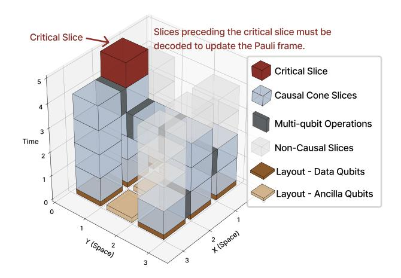

# *B. Motivation*

*1) The Decoder Resource Dilemma:* Consider a surface code computation with a 2-D array of logical qubits, as shown in Figure 3. A real-time decoding system must continuously process the syndrome streams from all active qubit patches. How should we allocate resources in this classical system?

On one extreme, a *one-to-one mapping* dedicates a physical decoder to each logical qubit. While maximizing parallelism, this approach is architecturally infeasible for large systems due to its prohibitive cost and resource underutilization. On the other extreme, a *one-for-all approach* uses a constant number of decoders to service the entire machine. This is also unscalable, as the latency requirement for each decoder would scale inversely with the number of logical qubits (O(1/Nlq)), an impossible demand for any non-trivial algorithm.

The only viable path is a shared-resource model: an *Mfor-N scheduler* that manages a pool of M physical decoders to service the tasks from N logical qubits, transforming the issue into a scheduling problem. The scheduler should make online decisions to prioritize tasks and maximize throughput, especially in two critical scenarios: the resource-constrained regime where fast decoders are scarce (M ≤ N, τdec < τgen), and the computationally-constrained regime where decoders may be individually slow (M > N, τdec ≥ τgen).

Recent research has begun exploring this scheduling problem [28]. Existing models, based on a logical qubit level abstraction, offer a valuable first step but fail to capture the fine-grained complexity inherent in large-scale quantum algorithms. By shifting the scheduling abstraction down to the level of individual spatio-temporal windows, we can unlock two powerful dimensions of optimization.

First, a fine-grained scheduler can effectively manage the strong *spatial correlations* created by operations like lattice surgery. Because lattice surgery temporarily merges adjacent logical patches and measures joint stabilizers along their boundaries, errors become spatially correlated across the merged region. Instead of forcing a single decoder to serialize the decoding of this massive, combined volume, a slice-aware scheduler can partition it into smaller, spatially parallelizable windowed tasks, simultaneously ensuring correctness and efficiency. Second, this approach can also fully leverage *spatiotemporal parallelism* during non-Clifford operations. A sliceaware scheduler can dispatch multiple decoders to collaboratively resolve emergent windows, reducing synchronization latency. Furthermore, this decomposition is inherently more efficient, as it avoids the super-linear complexity penalty associated with decoding large, monolithic data blocks [16].

*2) The Scalability Crisis of Parallel Decoding:* Parallel window decoding [24]–[26] have addressed the *computational scalability* problem of sliding window decoding. However, this arises an architectural question: what is the practical upper bound on the number of required decoders M?

We define the complete set of dependencies for a critical operation as its *causal cone*: the transitive closure of all undecoded historical slices belonging to any logical qubit that has become correlated with the target through a chain of multiqubit operations, as illustrated in Figure 6. In the worst case, if the algorithm is highly entangled and the intervals between non-Clifford gates are long, this causal cone can grow to a large spatio-temporal volume. A brute-force parallel approach to resolve such a backlog at the last minute would require a number of decoders proportional to the backlog's size.

This reveals the *resource scalability* as another potential crisis. The demand for decoders is highly non-uniform, with massive spikes preceding critical gates, making a static, worstcase provisioning of decoders architecturally infeasible. This

Fig. 6. An illustration of the causal cone corresponds to one critical slice, which is the Clifford correction after the T-gate teleportation in Figure 4.

insight is our central motivation: a dynamic online scheduler is essential to manage a finite decoder pool, handling the average workload efficiently while mobilizing maximum parallelism only when necessary to meet critical deadlines.

