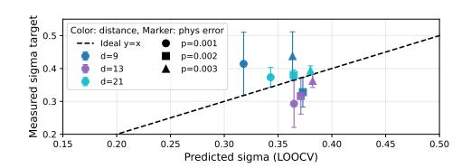

# D. Impact of Stochastic Decoding Latency

In practical FTQC systems, decoding latency is not deterministic but fluctuates due to varying error patterns. We model

decoder latency jitter as a mean-preserving lognormal factor,

$$t_{\text{actual}} = t_{\text{estimated}} \cdot \exp\left(-\frac{\sigma^2}{2} + \sigma z\right), \quad z \sim \mathcal{N}(0, 1), \quad (3)$$

so that the mean latency remains consistent while introducing a heavy tail characteristic of real-time systems. The jitter scale  $\sigma$  is parameterized as

$$\sigma(d, p) = \operatorname{clamp}(\sigma_{base} + \alpha_d \log_2(d/5) + \alpha_p(p - p_{ref}), \sigma_{min}, \sigma_{max})$$
(4)

Here,  $\sigma_{\rm base}$  is the baseline jitter at  $(d=5, p=p_{\rm ref})$ ,  $\alpha_d$  captures distance-driven complexity growth, and  $\alpha_p$  captures error-rate-driven complexity growth.

The calibration set is built from per-shot pymatching latency measurements on Stim-generated rotated surface-code circuits with 15K measured shots per setting after warmup. We obtain  $\sigma_{\rm base}=0.3447,~\alpha_d=0.0041,~\alpha_p=15.03,~p_{\rm ref}=10^{-3},~\sigma_{\rm min}=0.30,~\sigma_{\rm max}=0.70.$  Leave-one-out validation predicts the held-out  $\sigma$  with a mean absolute error of 0.064 and captures tail quantiles with about 15% relative error. Thus, the lognormal model is a calibrated heavy-tail

(b) Empirical Lognormal  $\sigma$ : Measured vs. Predicted.

(c) LER sensitivity to  $\sigma$  (Multiplier15\_SL).

Fig. 16. Evaluation of the Triage scheduler under stochastic latency. (a) compares LER in noiseless and noisy scenarios; (b) validates our  $\sigma(d,p)$  fit against empirical measurements; (c) demonstrates Triage's robustness as latency jitter increases.

service-time abstraction used to test whether Triage remains robust when complex syndrome patterns create tail latency.

As shown in Figure 16b, our lognormal model closely matches the empirical  $\sigma$  measured from pymatching. Figure 16a presents a detailed comparison of LER for each application under both noiseless and noisy environments. Although the presence of stochastic latency inevitably leads to a higher LER, *Triage* consistently maintains a significant advantage over the baseline. This robustness is further quantified in Figure 16c, which tracks the LER of the Multiplier15\_SL benchmark as the jitter intensity  $\sigma$  varies from 0 to 1. While the gap between FIFO and Triage narrows at extreme noise levels, *Triage* remains the superior strategy.

