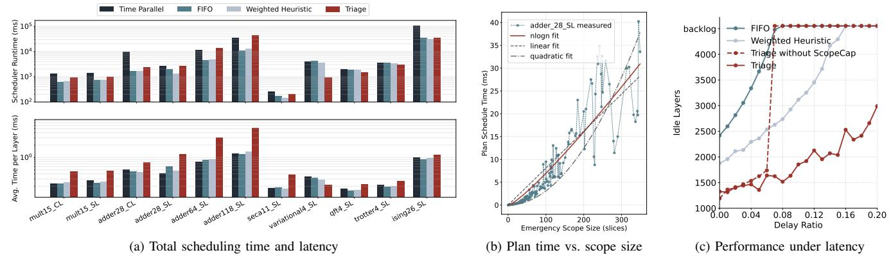
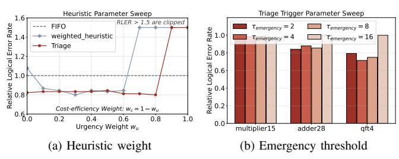

# E. Computational Overhead Analysis

Figure 17a breaks down the runtime into total scheduling time and average latency per logical layer. Note that all reported runtimes strictly isolate the pure algorithmic latency required to generate a scheduling plan, excluding the simulation environment. The measured wall-clock numbers characterize our Python prototype. Triage has sub-millisecond median per-layer scheduling cost across our benchmarks, but large emergency scopes can create multi-millisecond tail latency. This is acceptable for slow-cycle platforms such as ion traps or neutral atoms, but a superconducting implementation with  $\sim\!20~\mu\mathrm{s}$  logical-layer cycles would require a compiled or hardware-assisted implementation. Our claim is that the algorithmic structure is bounded: emergency planning scales as  $O(n\log n)$  and ScopeCap prevents pathological causal cones from entering the critical path.

To rigorously assess how this scheduler latency impacts overall system performance, we conduct a sensitivity simulation that incorporates real-time scheduling delays. We define a *Delay Ratio* as the baseline FIFO scheduler runtime relative to the decoding time, sweeping this ratio from 0.00 to 0.20. For heuristic policies, task assignment is delayed proportionally. For *Triage's* emergency mode, the delay is dynamically calculated using the fitted  $O(n \log n)$  function

based on the real-time scope size. As shown in Figure 17c with the Multiplier15\_SL benchmark, the *Triage without ScopeCap* policy suffers from severe runtime penalties when attempting to resolve massive causal cones near the end of applications, causing the system to hit a backlog failure at a delay ratio of 0.06. By enforcing the *ScopeCap*, *Triage* maintains robust and superior performance across the entire delay spectrum.

## F. Sensitivity and Ablation Studies

1) Impact of Decoding Window Size: The decoding window size presents a critical trade-off between decoding throughput and individual operation fidelity. Smaller windows accelerate processing but reduce syndrome context, whereas larger windows improve accuracy at the cost of increased latency. This balance is dictated by classical resource availability.

Figure 18 illustrates this trade-off under two regimes: resource-constrained (speed=  $0.8\times$ ) and resource-rich (speed=  $1.5\times$ ). In the constrained regime, smaller buffers are optimal as they maintain high decoding throughput, thereby minimizing total idle layers and the resulting aggregate LER. Conversely, in resource-rich scenarios, the bottleneck shifts from throughput to individual operation fidelity, favoring larger windows. Consequently, the optimal buffer size is hardware-dependent; while current latency-limited systems necessitate smaller buffers, future high-performance hardware will likely favor larger windows approaching d/2 [27].

2) Impact of Hyperparameters: We evaluate Triage's sensitivity to its primary hyperparameters: the heuristic weight  $(w_u)$  and the emergency threshold  $(\tau_{emergency})$ . As Figure 19(a) shows, sweeping  $w_u$  from 0 to 1 reveals that the logical error rate is remarkably robust, eliminating the need for application-specific tuning. Similarly, Figure 19(b) demonstrates stable performance across a moderate threshold range  $(\tau_{emergency} \in [2,8])$ . Performance degrades only when excessively high thresholds (e.g.,  $\tau_{emergency} = 16$ ) delay necessary interventions during congestion spikes. Overall, Triage exhibits strong robustness to parameter variations without requiring fine-grained tuning.

Fig. 17. Computational overhead analysis. (a) Total scheduling time per application (top) and average latency per logical layer (bottom). (b) Plan schedule time versus emergency scope size, best captured by an  $O(n \log n)$  fit  $(y = a \cdot n \log n, a = 0.01513, R^2 = 0.805637)$ . (c) System performance (Idle Layers) under simulated scheduler latency.

Fig. 18. LER (bars) and inserted idle layers (lines) as a function of the window decoding buffer size with Triage at d = 7. The decoder count is fixed to 8. An optimal operating point appears around a buffer size of d/2.

Fig. 19. Sensitivity analysis of *Triage*. Triage has robust performance across a wide range of parameter configurations.

## VI. RELATED WORK

Improvements on Decoders. Research on decoders for FTQC has focused on improving accuracy, latency, and scalability. This includes algorithmic approaches, such as lookup table decoders [20], [45], [46], minimum-weight perfect matching (MWPM) decoders for surface codes [41], [47], [48]. In addition, system-level approaches have been investigated to reduce decoding latency [22], [49]–[52]. These include specialized solutions for superconducting qubits [16], [21], [53], [54], hierarchical decoders [55], optimized union-find decoders [56], and FPGA-based implementations [57], [58].

These individual-decoder efforts complement our framework, which schedules a shared decoder pool to manage system-wide latency constraints.

**Decoder Scheduling.** Most existing works on decoder design assume a dedicated decoder is statically allocated for each logical qubit [24], [25], [59]. Recent concurrent works have begun to address the challenges of dynamic decoder scheduling [26], [28], [59], with *SWIPER* [26] representing the current SOTA. Our framework focuses on mitigating the decoding pressure induced by non-Clifford operations, achieving lower logical error rates under resource-constrained scenarios. Furthermore, our simulation enables a direct evaluation of how classical resource bottlenecks dictate final performance.

Compilers for Optimizing Lattice Surgery. Many compilers have been proposed to improve the scheduling of lattice surgery operations [60]–[65], and several works have also focused on increasing the parallelism during these procedures [44], [66]–[68]. In our study, we use the compiler introduced in [62], [63] to compare different strategies for decoder scheduling. Integrating advanced compiler techniques may further improve overall performance.

#### VII. CONCLUSION

In this work, we identified the management of classical decoder resources as a bottleneck for scalable FTQC. We utilized a spatio-temporal framework to formulate the constrained dynamic scheduling problem. We then proposed *Triage*, a dual-mode scheduling architecture that maximizes resource utilization. Our implementation focused on surface codes, the principles of constrained parallel-window scheduling are broadly relevant. Extending this framework to general QLDPC codes will be a promising future work. Furthermore, exploring the co-design of the quantum compiler and scheduler represents a next step, enabling the compiler to optimize circuits with classical resource awareness.

