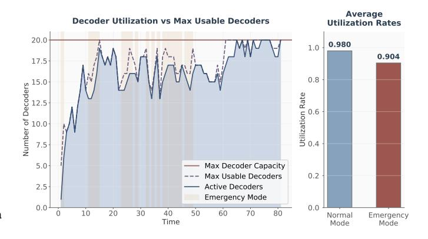
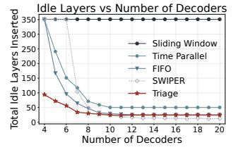
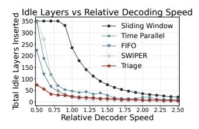

# IV. EXPERIMENT SETUP

**Simulation Framework.** We develop a simulation framework that models the entire classical control pipeline: The compiler emits LLIs, the static analyzer constructs an annotated Timeline, and a discrete-event simulator generates

Fig. 11. Motivation for Opportunistic Backfilling. Left: Triage's decoder utilization over time showing active decoders (blue), maximum capacity (purple dashed), and emergency periods (orange). Right: Comparison of utilization rates. The utilization can be improved by backfilling.

syndromes and invokes the scheduler on syndrome arrivals and task completions. Before each critical operation, it checks whether the causal cone is decoded; otherwise it inserts an idle syndrome layer into the Timeline, and generates a layer of syndrome similar to the memory experiment [10]. To prevent an unrecoverable backlog of decoding tasks, the simulation is forcibly terminated if the total number of inserted idle layers exceeds ten times the original layer count of the benchmark. The scheduler is invoked on every syndrome generation and every task completion.

**Metrics.** We evaluate scheduler performance using two metrics. Since an idle layer is inserted only when synchronization fails, we measure *the number of inserted idle layers* as a direct metric for the scheduler's ability to handle critical operations. The simulation will also terminate when a significant backlog is detected. The *logical error rate (LER)* provides the ultimate measure which is correlated to the total execution layers. We first simulate window-based lattice surgery using a circuit-level noise model, and then aggregate the LER of each layer to obtain the overall LER.

**System Configuration.** We use a Litinski-style compiler [38] to generate LLIs for our benchmarks. The instruction set is composed of multi-patch measurement, patch rotation and idle. To model the decoding time, we profiled the pymatching decoder [16] on varying decoding volume, fitting the empirical data to a power-law model:  $t_{decode} =$  $A \cdot (\text{volume})^{\alpha}$ . Given  $\alpha = 1.17$ , our framework's decoding time for a given slice is determined by the size of its window buffer, which is directly related to the number of unresolved neighbors (i.e., its degree in the constraint graph). Note that our assumption that latency is monotonically increasing with volume holds for any practical decoder, so the relative performance trends in our evaluation are expected to be general. Pattern-dependent runtime variation is modeled separately in Section V-D, where a calibrated heavy-tail jitter model is injected into every decoder task.

For Monte Carlo, we simulate a d = 9 rotated surface code under circuit-level depolarizing noise at  $p = 3 \times 10^{-3}$ , and

TABLE I
CHARACTERISTICS OF THE FTQC BENCHMARK SUITE.

| Benchmark                        | Short Name      | # LQubits | # Layers | # T-Gates | T-Den.* | Category               |
|----------------------------------|-----------------|-----------|----------|-----------|---------|------------------------|
| T-State Injection                | T_injection     | 9         | 13       | 1         | 7.69%   | FT Gadget              |
| Arbitrary Rotation $(\pi/7)$     | rotation_C+T    | 1         | 2694     | 318       | 11.80%  | FT Benchmark           |
| Magic State Distillation 15-to-1 | MSD15to1        | 5         | 24       | 11        | 45.83%  | FT Gadget              |
| Bell State Preparation           | bell4           | 4         | 41       | 5         | 12.20%  | FT Gadget              |
| 15-qubit Multiplier              | mult15_CL*      | 15        | 586      | 252       | 43.00%  | Arithmetics            |
| 15-qubit Multiplier              | mult15_SL*      | 15        | 508      | 252       | 49.61%  | Arithmetics            |
| 28-qubit Adder                   | adder28_CL      | 28        | 1894     | 168       | 8.87%   | Arithmetics            |
| 28-qubit Adder                   | adder28_SL      | 28        | 640      | 168       | 26.25%  | Arithmetics            |
| 64-bit Adder                     | adder64_SL      | 64        | 1492     | 392       | 26.27%  | Arithmetics            |
| 118-bit Adder                    | adder118_SL     | 118       | 2770     | 728       | 26.28%  | Arithmetics            |
| 11-qubit SECA                    | secal1_SL       | 11        | 140      | 56        | 40.00%  | Arithmetics            |
| 4-qubit Variational              | variational4_SL | 4         | 3636     | 402       | 11.06%  | Variational Algorithm  |
| 4-qubit QFT                      | qft4_SL         | 4         | 1505     | 459       | 30.50%  | QFT Algorithm          |
| 4-qubit Trotterization           | trotter4_SL     | 4         | 2198     | 576       | 26.21%  | Hamiltonian Simulation |
| 26-qubit Ising Model             | ising26_SL      | 26        | 11303    | 3688      | 32.63%  | Hamiltonian Simulation |

\* T-Den.: The proportion of T gates, CL: Compiled with Compact Layout [38], SL: Compiled with Standard Layout [44].

we extrapolate the logical error rate to the d=21 case. We perform the Monte Carlo simulations with Stim [42], with each point made of at least  $10^5$  runs.

**Benchmarks.** To cover a wide range of scenarios, we select a series of benchmarks from QASMBench [43] with various T-gate densities. Furthermore, to demonstrate the universality of our framework, we include compiled versions for both Compact Layout (CL) [38] and Standard Layout (SL) [44]. A summary of these benchmarks is provided in Table I.

**Simulation Device.** All experiments were conducted with an Intel i9-14900K processor and 188 GB of RAM. The simulation framework was implemented in Python 3.9.

**Baselines.** While parallel window decoding has been extensively discussed [24]–[26], a framework for fine-grained scheduling has yet to be established. We construct baselines within our framework in Section III-A to demonstrate the benefits of our spatio-temporal parallelism:

- Serial sliding window [41]: A scheduler processes a block of slices involved in a lattice surgery operation at a time, but does not process slices at later times in advance.
- *Time-parallel window [24]:* A scheduler leverages parallelism across the time dimension for logical patches, but does not split up multi-qubit operations.
- SWIPER [26]: A state-of-the-art speculative scheduler.
   We reproduce its successor-based strategy which is optimistic regarding mis-speculations, setting 10% misprediction rate and 10% speculation time. Furthermore, the speculative decoding module is not included in the decoder usage.

## V. EVALUATION RESULTS

We design our evaluation based on the following key questions to reflect the practicality of our framework.

**Q1** How does the spatio-temporal parallelism compare to default and SOTA strategies under varying constraints?

- (a) Fixed decoding speed of 0.8.
- (b) Fixed pool of 8 decoders.

Fig. 12. Relation between idle layers inserted and (a) number of available decoders; (b) relative decoding speed  $(\tau_{dec}/\tau_{gen})$ .

- **Q2** How do the proposed schedulers perform across a diverse suite of FTQC applications in terms of idle reduction and logical error rates?
- **Q3** How resilient is the Triage scheduler to real-world decoder latency fluctuations?
- **Q4** What are the computational overheads of the proposed schedulers? Does Triage's advantage degenerate when considering scheduling and interconnect latency?
- **Q5** How do internal mechanisms and hyperparameters contribute to the overall performance?

In the following simulations, the heuristic weights are set to  $w_u = w_c = 0.5$ , the Triage trigger's replan scope threshold is 0.3, and the minimum planning interval is 2.

#### A. Motivating Spatio-Temporal Parallelism

We first evaluate five schedulers representing a spectrum of parallelization strategies on the Bell4 on Litinski's compact layout. This task comprises 39 logical layers and includes 5 critical  $\pi/8$  gates. The schedulers under comparison are: the baseline *sliding window* and *time-parallel* schedulers; the speculative scheduler *SWIPER* [26]; our *time-space-parallel* scheduler with FIFO policy; and our *Triage* scheduler. Figure 12 shows the number of inserted idle layers as we vary the number of available decoders and the relative speed of each individual decoder.

Fig. 13. Heatmaps illustrating the number of inserted idle layers for different schedulers across various decoder counts and relative speeds. Darker red indicates a higher number of idle layers, signifying worse performance. The *Triage* scheduler consistently achieves near-best performance across the entire space and defines the performance frontier in resource-constrained scenarios.

- a) Observation 1: Serial processing is fundamentally unscalable: As shown in both figures, the sliding window scheduler exhibits the worst performance. The flat line demonstrates that its sequential nature makes it fundamentally unable to leverage parallel hardware resources to increase throughput.
- b) Observation 2: Spatio-temporal parallelism enables superior resource utilization: The time-parallel scheduler offers a significant improvement over the serial approach, but its performance saturates at a high number of idle layers. The time-parallel scheduler is bottlenecked by its inability to break down correlated multi-qubit operations, resulting in a high floor. In contrast, the time-space-parallel schedulers can process these complex operations with a much finer granularity, achieving a lower saturation point.
- c) Observation 3: Triage outperforms SWIPER under resource constraints: SWIPER leverages its speculative mechanism to achieve extremely high parallelism, showing competitive performance when resources are abundant. However, these advantages diminish significantly in resource-constrained regimes where speculative overheads can lead to resource contention. In contrast, our Triage scheduler demonstrates superior performance in these scenarios.

